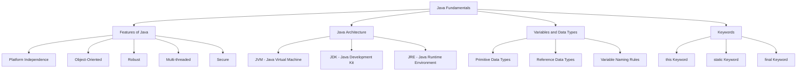
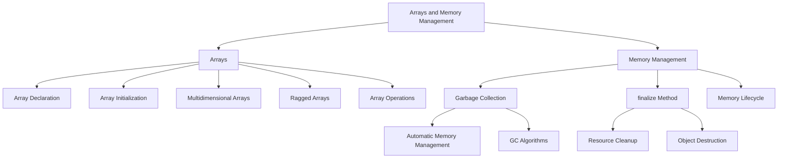
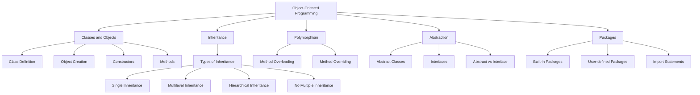

# CJP Unit 1-2 Flowchart

## Java Fundamentals

```mermaid
flowchart TD
    A[Java Fundamentals] --> B[Features of Java]
    A --> C[Java Architecture]
    A --> D[Variables and Data Types]
    A --> E[Keywords]
    
    B --> B1[Platform Independence]
    B --> B2[Object-Oriented]
    B --> B3[Robust]
    B --> B4[Multi-threaded]
    B --> B5[Secure]
    
    C --> C1[JVM - Java Virtual Machine]
    C --> C2[JDK - Java Development Kit]
    C --> C3[JRE - Java Runtime Environment]
    
    D --> D1[Primitive Data Types]
    D --> D2[Reference Data Types]
    D --> D3[Variable Naming Rules]
    
    E --> E1[this Keyword]
    E --> E2[static Keyword]
    E --> E3[final Keyword]
```

## Arrays and Memory Management

```mermaid
flowchart TD
    A[Arrays and Memory Management] --> B[Arrays]
    A --> C[Memory Management]
    
    B --> B1[Array Declaration]
    B --> B2[Array Initialization]
    B --> B3[Multidimensional Arrays]
    B --> B4[Ragged Arrays]
    B --> B5[Array Operations]
    
    C --> C1[Garbage Collection]
    C --> C2[finalize Method]
    C --> C3[Memory Lifecycle]
    
    C1 --> C1a[Automatic Memory Management]
    C1 --> C1b[GC Algorithms]
    
    C2 --> C2a[Resource Cleanup]
    C2 --> C2b[Object Destruction]
```

## Object-Oriented Programming

```mermaid
flowchart TD
    A[Object-Oriented Programming] --> B[Classes and Objects]
    A --> C[Inheritance]
    A --> D[Polymorphism]
    A --> E[Abstraction]
    A --> F[Packages]
    
    B --> B1[Class Definition]
    B --> B2[Object Creation]
    B --> B3[Constructors]
    B --> B4[Methods]
    
    C --> C1[Types of Inheritance]
    C1 --> C1a[Single Inheritance]
    C1 --> C1b[Multilevel Inheritance]
    C1 --> C1c[Hierarchical Inheritance]
    C1 --> C1d[No Multiple Inheritance]
    
    D --> D1[Method Overloading]
    D --> D2[Method Overriding]
    
    E --> E1[Abstract Classes]
    E --> E2[Interfaces]
    E --> E3[Abstract vs Interface]
    
    F --> F1[Built-in Packages]
    F --> F2[User-defined Packages]
    F --> F3[Import Statements]
``` 