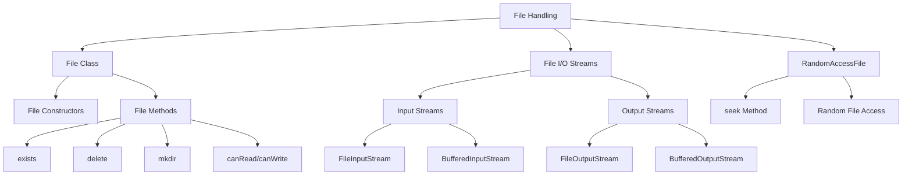
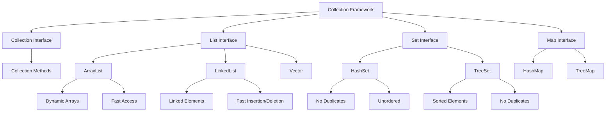
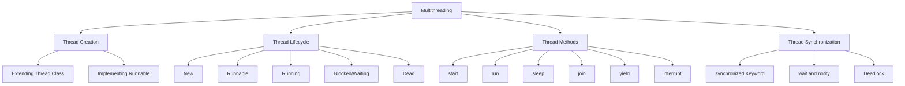
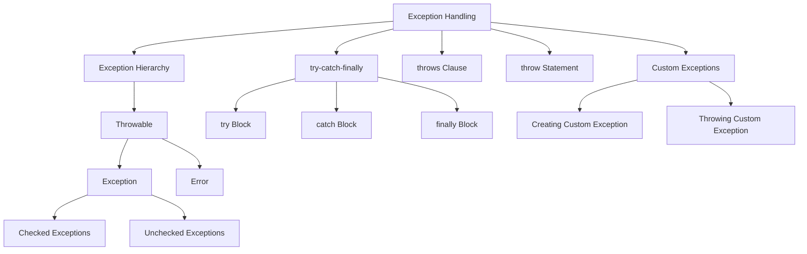

# CJP Unit 3-4 Flowchart

## File Handling

```mermaid
flowchart TD
    A[File Handling] --> B[File Class]
    A --> C[File I/O Streams]
    A --> D[RandomAccessFile]
    
    B --> B1[File Constructors]
    B --> B2[File Methods]
    B2 --> B2a[exists]
    B2 --> B2b[delete]
    B2 --> B2c[mkdir]
    B2 --> B2d[canRead/canWrite]
    
    C --> C1[Input Streams]
    C --> C2[Output Streams]
    C1 --> C1a[FileInputStream]
    C1 --> C1b[BufferedInputStream]
    C2 --> C2a[FileOutputStream]
    C2 --> C2b[BufferedOutputStream]
    
    D --> D1[seek Method]
    D --> D2[Random File Access]
```

## Collection Framework

```mermaid
flowchart TD
    A[Collection Framework] --> B[Collection Interface]
    A --> C[List Interface]
    A --> D[Set Interface]
    A --> E[Map Interface]
    
    B --> B1[Collection Methods]
    
    C --> C1[ArrayList]
    C --> C2[LinkedList]
    C --> C3[Vector]
    
    D --> D1[HashSet]
    D --> D2[TreeSet]
    
    E --> E1[HashMap]
    E --> E2[TreeMap]
    
    C1 --> C1a[Dynamic Arrays]
    C1 --> C1b[Fast Access]
    
    C2 --> C2a[Linked Elements]
    C2 --> C2b[Fast Insertion/Deletion]
    
    D1 --> D1a[No Duplicates]
    D1 --> D1b[Unordered]
    
    D2 --> D2a[Sorted Elements]
    D2 --> D2b[No Duplicates]
```

## Multithreading

```mermaid
flowchart TD
    A[Multithreading] --> B[Thread Creation]
    A --> C[Thread Lifecycle]
    A --> D[Thread Methods]
    A --> E[Thread Synchronization]
    
    B --> B1[Extending Thread Class]
    B --> B2[Implementing Runnable]
    
    C --> C1[New]
    C --> C2[Runnable]
    C --> C3[Running]
    C --> C4[Blocked/Waiting]
    C --> C5[Dead]
    
    D --> D1[start]
    D --> D2[run]
    D --> D3[sleep]
    D --> D4[join]
    D --> D5[yield]
    D --> D6[interrupt]
    
    E --> E1[synchronized Keyword]
    E --> E2[wait and notify]
    E --> E3[Deadlock]
```

## Exception Handling

```mermaid
flowchart TD
    A[Exception Handling] --> B[Exception Hierarchy]
    A --> C[try-catch-finally]
    A --> D[throws Clause]
    A --> E[throw Statement]
    A --> F[Custom Exceptions]
    
    B --> B1[Throwable]
    B1 --> B1a[Exception]
    B1 --> B1b[Error]
    
    B1a --> B1a1[Checked Exceptions]
    B1a --> B1a2[Unchecked Exceptions]
    
    C --> C1[try Block]
    C --> C2[catch Block]
    C --> C3[finally Block]
    
    F --> F1[Creating Custom Exception]
    F --> F2[Throwing Custom Exception]
``` 