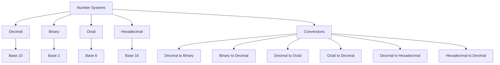
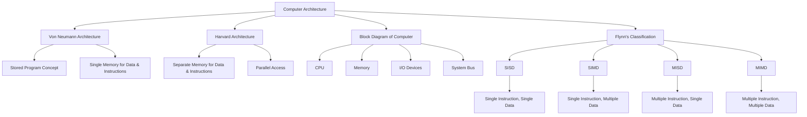
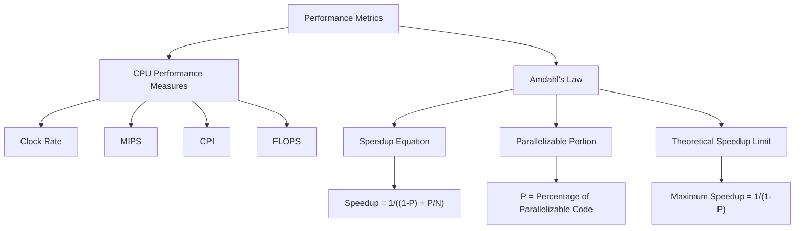
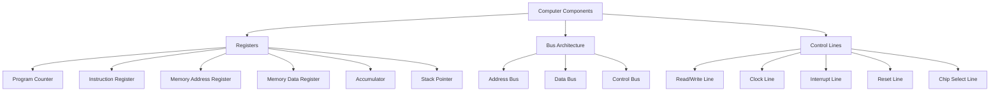

# COA Unit 1-2 Flowchart

## Number Systems

```mermaid
flowchart TD
    A[Number Systems] --> B[Decimal]
    A --> C[Binary]
    A --> D[Octal]
    A --> E[Hexadecimal]
    
    B --> B1[Base 10]
    C --> C1[Base 2]
    D --> D1[Base 8]
    E --> E1[Base 16]
    
    A --> F[Conversions]
    F --> F1[Decimal to Binary]
    F --> F2[Binary to Decimal]
    F --> F3[Decimal to Octal]
    F --> F4[Octal to Decimal]
    F --> F5[Decimal to Hexadecimal]
    F --> F6[Hexadecimal to Decimal]
```

## Computer Architecture

```mermaid
flowchart TD
    A[Computer Architecture] --> B[Von Neumann Architecture]
    A --> C[Harvard Architecture]
    A --> D[Block Diagram of Computer]
    A --> E[Flynn's Classification]
    
    B --> B1["Stored Program Concept"]
    B --> B2["Single Memory for Data & Instructions"]
    
    C --> C1["Separate Memory for Data & Instructions"]
    C --> C2["Parallel Access"]
    
    D --> D1[CPU]
    D --> D2[Memory]
    D --> D3[I/O Devices]
    D --> D4[System Bus]
    
    E --> E1[SISD]
    E --> E2[SIMD]
    E --> E3[MISD]
    E --> E4[MIMD]
    
    E1 --> E1a["Single Instruction, Single Data"]
    E2 --> E2a["Single Instruction, Multiple Data"]
    E3 --> E3a["Multiple Instruction, Single Data"]
    E4 --> E4a["Multiple Instruction, Multiple Data"]
```

## Performance Metrics

```mermaid
flowchart TD
    A[Performance Metrics] --> B[CPU Performance Measures]
    A --> C[Amdahl's Law]
    
    B --> B1[Clock Rate]
    B --> B2[MIPS]
    B --> B3[CPI]
    B --> B4[FLOPS]
    
    C --> C1["Speedup Equation"]
    C --> C2["Parallelizable Portion"]
    C --> C3["Theoretical Speedup Limit"]
    
    C1 --> C1a["Speedup = 1/((1-P) + P/N)"]
    C2 --> C2a["P = Percentage of Parallelizable Code"]
    C3 --> C3a["Maximum Speedup = 1/(1-P)"]
```

## Computer Components

```mermaid
flowchart TD
    A[Computer Components] --> B[Registers]
    A --> C[Bus Architecture]
    A --> D[Control Lines]
    
    B --> B1[Program Counter]
    B --> B2[Instruction Register]
    B --> B3[Memory Address Register]
    B --> B4[Memory Data Register]
    B --> B5[Accumulator]
    B --> B6[Stack Pointer]
    
    C --> C1[Address Bus]
    C --> C2[Data Bus]
    C --> C3[Control Bus]
    
    D --> D1[Read/Write Line]
    D --> D2[Clock Line]
    D --> D3[Interrupt Line]
    D --> D4[Reset Line]
    D --> D5[Chip Select Line]
``` 