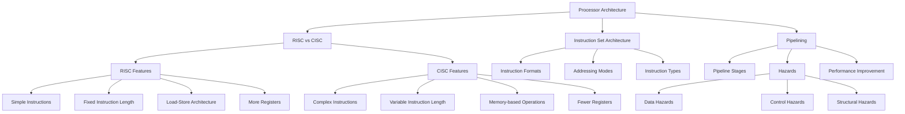
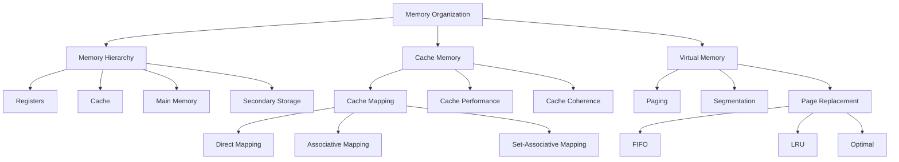
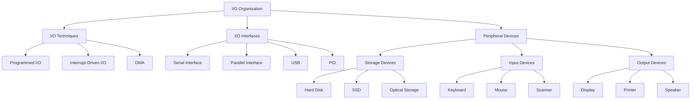
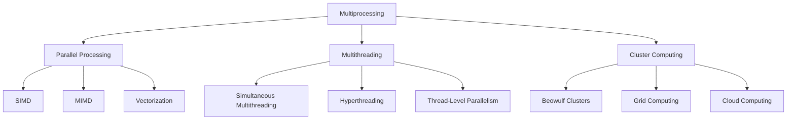

# COA Unit 3-4 Flowchart

## Processor Architecture

```mermaid
flowchart TD
    A[Processor Architecture] --> B[RISC vs CISC]
    A --> C[Instruction Set Architecture]
    A --> D[Pipelining]
    
    B --> B1[RISC Features]
    B --> B2[CISC Features]
    
    B1 --> B1a["Simple Instructions"]
    B1 --> B1b["Fixed Instruction Length"]
    B1 --> B1c["Load-Store Architecture"]
    B1 --> B1d["More Registers"]
    
    B2 --> B2a["Complex Instructions"]
    B2 --> B2b["Variable Instruction Length"]
    B2 --> B2c["Memory-based Operations"]
    B2 --> B2d["Fewer Registers"]
    
    C --> C1[Instruction Formats]
    C --> C2[Addressing Modes]
    C --> C3[Instruction Types]
    
    D --> D1[Pipeline Stages]
    D --> D2[Hazards]
    D --> D3[Performance Improvement]
    
    D2 --> D2a[Data Hazards]
    D2 --> D2b[Control Hazards]
    D2 --> D2c[Structural Hazards]
```

## Memory Organization

```mermaid
flowchart TD
    A[Memory Organization] --> B[Memory Hierarchy]
    A --> C[Cache Memory]
    A --> D[Virtual Memory]
    
    B --> B1[Registers]
    B --> B2[Cache]
    B --> B3[Main Memory]
    B --> B4[Secondary Storage]
    
    C --> C1[Cache Mapping]
    C --> C2[Cache Performance]
    C --> C3[Cache Coherence]
    
    C1 --> C1a[Direct Mapping]
    C1 --> C1b[Associative Mapping]
    C1 --> C1c[Set-Associative Mapping]
    
    D --> D1[Paging]
    D --> D2[Segmentation]
    D --> D3[Page Replacement]
    
    D3 --> D3a[FIFO]
    D3 --> D3b[LRU]
    D3 --> D3c[Optimal]
```

## I/O Organization

```mermaid
flowchart TD
    A[I/O Organization] --> B[I/O Techniques]
    A --> C[I/O Interfaces]
    A --> D[Peripheral Devices]
    
    B --> B1[Programmed I/O]
    B --> B2[Interrupt-Driven I/O]
    B --> B3[DMA]
    
    C --> C1[Serial Interface]
    C --> C2[Parallel Interface]
    C --> C3[USB]
    C --> C4[PCI]
    
    D --> D1[Storage Devices]
    D --> D2[Input Devices]
    D --> D3[Output Devices]
    
    D1 --> D1a[Hard Disk]
    D1 --> D1b[SSD]
    D1 --> D1c[Optical Storage]
    
    D2 --> D2a[Keyboard]
    D2 --> D2b[Mouse]
    D2 --> D2c[Scanner]
    
    D3 --> D3a[Display]
    D3 --> D3b[Printer]
    D3 --> D3c[Speaker]
```

## Multiprocessing

```mermaid
flowchart TD
    A[Multiprocessing] --> B[Parallel Processing]
    A --> C[Multithreading]
    A --> D[Cluster Computing]
    
    B --> B1[SIMD]
    B --> B2[MIMD]
    B --> B3[Vectorization]
    
    C --> C1[Simultaneous Multithreading]
    C --> C2[Hyperthreading]
    C --> C3[Thread-Level Parallelism]
    
    D --> D1[Beowulf Clusters]
    D --> D2[Grid Computing]
    D --> D3[Cloud Computing]
``` 