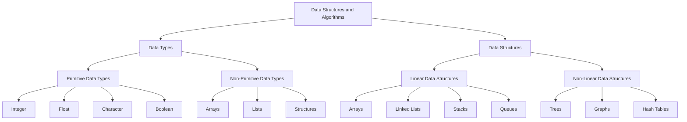
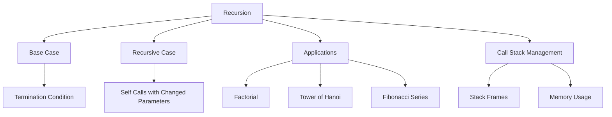
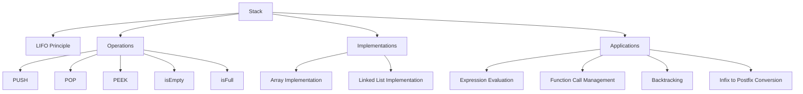
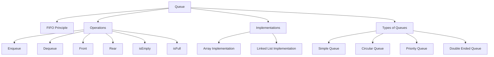
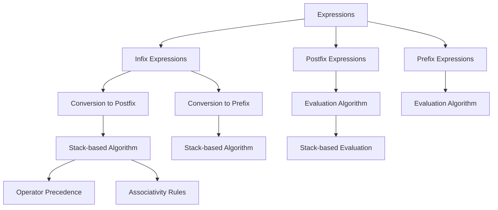

# DSA Unit 1-2 Flowchart

## Data Types and Structures Overview

```mermaid
flowchart TD
    A[Data Structures and Algorithms] --> B[Data Types]
    A --> C[Data Structures]
    
    B --> B1[Primitive Data Types]
    B --> B2[Non-Primitive Data Types]
    
    B1 --> B1a[Integer]
    B1 --> B1b[Float]
    B1 --> B1c[Character]
    B1 --> B1d[Boolean]
    
    B2 --> B2a[Arrays]
    B2 --> B2b[Lists]
    B2 --> B2c[Structures]
    
    C --> C1[Linear Data Structures]
    C --> C2[Non-Linear Data Structures]
    
    C1 --> C1a[Arrays]
    C1 --> C1b[Linked Lists]
    C1 --> C1c[Stacks]
    C1 --> C1d[Queues]
    
    C2 --> C2a[Trees]
    C2 --> C2b[Graphs]
    C2 --> C2c[Hash Tables]
```

## Recursion

```mermaid
flowchart TD
    R[Recursion] --> R1[Base Case]
    R --> R2[Recursive Case]
    R --> R3[Applications]
    
    R3 --> R3a[Factorial]
    R3 --> R3b[Tower of Hanoi]
    R3 --> R3c[Fibonacci Series]
    
    R1 --> R4[Termination Condition]
    R2 --> R5[Self Calls with Changed Parameters]
    
    R --> R6[Call Stack Management]
    R6 --> R6a[Stack Frames]
    R6 --> R6b[Memory Usage]
```

## Stack Data Structure

```mermaid
flowchart TD
    S[Stack] --> S1[LIFO Principle]
    S --> S2[Operations]
    S --> S3[Implementations]
    S --> S4[Applications]
    
    S2 --> S2a[PUSH]
    S2 --> S2b[POP]
    S2 --> S2c[PEEK]
    S2 --> S2d[isEmpty]
    S2 --> S2e[isFull]
    
    S3 --> S3a[Array Implementation]
    S3 --> S3b[Linked List Implementation]
    
    S4 --> S4a[Expression Evaluation]
    S4 --> S4b[Function Call Management]
    S4 --> S4c[Backtracking]
    S4 --> S4d[Infix to Postfix Conversion]
```

## Queue Data Structure

```mermaid
flowchart TD
    Q[Queue] --> Q1[FIFO Principle]
    Q --> Q2[Operations]
    Q --> Q3[Implementations]
    Q --> Q4[Types of Queues]
    
    Q2 --> Q2a[Enqueue]
    Q2 --> Q2b[Dequeue]
    Q2 --> Q2c[Front]
    Q2 --> Q2d[Rear]
    Q2 --> Q2e[isEmpty]
    Q2 --> Q2f[isFull]
    
    Q3 --> Q3a[Array Implementation]
    Q3 --> Q3b[Linked List Implementation]
    
    Q4 --> Q4a[Simple Queue]
    Q4 --> Q4b[Circular Queue]
    Q4 --> Q4c[Priority Queue]
    Q4 --> Q4d[Double Ended Queue]
```

## Expression Evaluation & Conversion

```mermaid
flowchart TD
    E[Expressions] --> E1[Infix Expressions]
    E --> E2[Prefix Expressions]
    E --> E3[Postfix Expressions]
    
    E1 --> E4[Conversion to Postfix]
    E1 --> E5[Conversion to Prefix]
    
    E3 --> E6[Evaluation Algorithm]
    E2 --> E7[Evaluation Algorithm]
    
    E4 --> E8[Stack-based Algorithm]
    E5 --> E9[Stack-based Algorithm]
    E6 --> E10[Stack-based Evaluation]
    
    E8 --> E11[Operator Precedence]
    E8 --> E12[Associativity Rules]
``` 