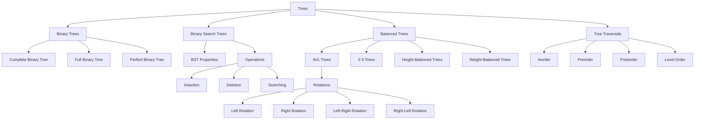
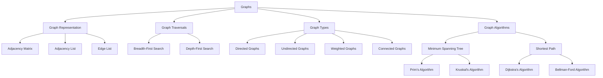
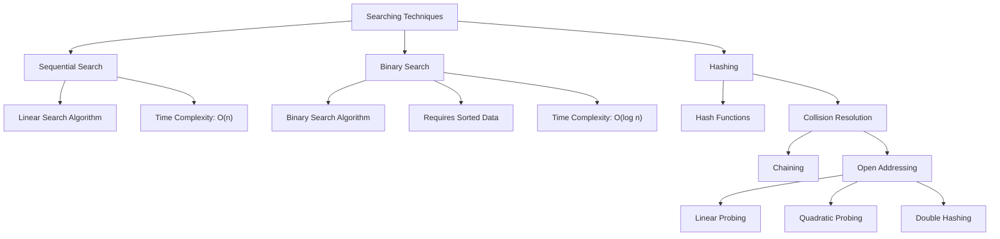
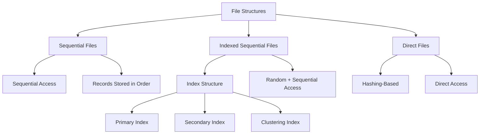
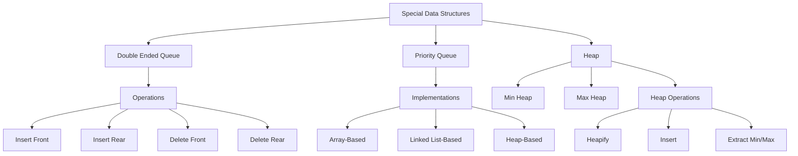

# DSA Unit 3-4 Flowchart

## Trees

```mermaid
flowchart TD
    T[Trees] --> T1[Binary Trees]
    T --> T2[Binary Search Trees]
    T --> T3[Balanced Trees]
    T --> T4[Tree Traversals]
    
    T1 --> T1a[Complete Binary Tree]
    T1 --> T1b[Full Binary Tree]
    T1 --> T1c[Perfect Binary Tree]
    
    T2 --> T2a[BST Properties]
    T2 --> T2b[Operations]
    
    T2b --> T2b1[Insertion]
    T2b --> T2b2[Deletion]
    T2b --> T2b3[Searching]
    
    T3 --> T3a[AVL Trees]
    T3 --> T3b[2-3 Trees]
    T3 --> T3c[Height-Balanced Trees]
    T3 --> T3d[Weight-Balanced Trees]
    
    T3a --> T3a1[Rotations]
    T3a1 --> T3a1a[Left Rotation]
    T3a1 --> T3a1b[Right Rotation]
    T3a1 --> T3a1c[Left-Right Rotation]
    T3a1 --> T3a1d[Right-Left Rotation]
    
    T4 --> T4a[Inorder]
    T4 --> T4b[Preorder]
    T4 --> T4c[Postorder]
    T4 --> T4d[Level Order]
```

## Graphs

```mermaid
flowchart TD
    G[Graphs] --> G1[Graph Representation]
    G --> G2[Graph Traversals]
    G --> G3[Graph Types]
    G --> G4[Graph Algorithms]
    
    G1 --> G1a[Adjacency Matrix]
    G1 --> G1b[Adjacency List]
    G1 --> G1c[Edge List]
    
    G2 --> G2a[Breadth-First Search]
    G2 --> G2b[Depth-First Search]
    
    G3 --> G3a[Directed Graphs]
    G3 --> G3b[Undirected Graphs]
    G3 --> G3c[Weighted Graphs]
    G3 --> G3d[Connected Graphs]
    
    G4 --> G4a[Minimum Spanning Tree]
    G4a --> G4a1[Prim's Algorithm]
    G4a --> G4a2[Kruskal's Algorithm]
    
    G4 --> G4b[Shortest Path]
    G4b --> G4b1[Dijkstra's Algorithm]
    G4b --> G4b2[Bellman-Ford Algorithm]
```

## Searching Techniques

```mermaid
flowchart TD
    S[Searching Techniques] --> S1[Sequential Search]
    S --> S2[Binary Search]
    S --> S3[Hashing]
    
    S1 --> S1a[Linear Search Algorithm]
    S1 --> S1b["Time Complexity: O(n)"]
    
    S2 --> S2a[Binary Search Algorithm]
    S2 --> S2b[Requires Sorted Data]
    S2 --> S2c["Time Complexity: O(log n)"]
    
    S3 --> S3a[Hash Functions]
    S3 --> S3b[Collision Resolution]
    
    S3b --> S3b1[Chaining]
    S3b --> S3b2[Open Addressing]
    
    S3b2 --> S3b2a[Linear Probing]
    S3b2 --> S3b2b[Quadratic Probing]
    S3b2 --> S3b2c[Double Hashing]
```

## File Structures

```mermaid
flowchart TD
    F[File Structures] --> F1[Sequential Files]
    F --> F2[Indexed Sequential Files]
    F --> F3[Direct Files]
    
    F1 --> F1a[Sequential Access]
    F1 --> F1b[Records Stored in Order]
    
    F2 --> F2a[Index Structure]
    F2 --> F2b["Random + Sequential Access"]
    
    F3 --> F3a[Hashing-Based]
    F3 --> F3b[Direct Access]
    
    F2a --> F2a1[Primary Index]
    F2a --> F2a2[Secondary Index]
    F2a --> F2a3[Clustering Index]
```

## Special Data Structures

```mermaid
flowchart TD
    D[Special Data Structures] --> D1[Double Ended Queue]
    D --> D2[Priority Queue]
    D --> D3[Heap]
    
    D1 --> D1a[Operations]
    D1a --> D1a1[Insert Front]
    D1a --> D1a2[Insert Rear]
    D1a --> D1a3[Delete Front]
    D1a --> D1a4[Delete Rear]
    
    D2 --> D2a[Implementations]
    D2a --> D2a1[Array-Based]
    D2a --> D2a2[Linked List-Based]
    D2a --> D2a3[Heap-Based]
    
    D3 --> D3a[Min Heap]
    D3 --> D3b[Max Heap]
    D3 --> D3c[Heap Operations]
    
    D3c --> D3c1[Heapify]
    D3c --> D3c2[Insert]
    D3c --> D3c3[Extract Min/Max]
``` 