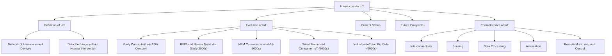
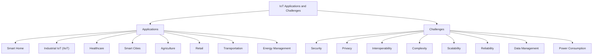
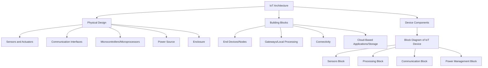
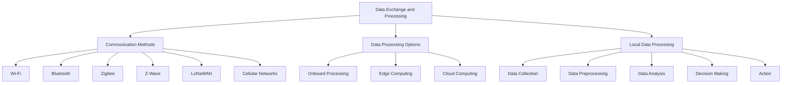

# IOT Unit 1-2 Flowchart

## Introduction to IoT

```mermaid
flowchart TD
    A[Introduction to IoT] --> B[Definition of IoT]
    A --> C[Evolution of IoT]
    A --> D[Current Status]
    A --> E[Future Prospects]
    A --> F[Characteristics of IoT]
    
    B --> B1["Network of Interconnected Devices"]
    B --> B2["Data Exchange without Human Intervention"]
    
    C --> C1["Early Concepts (Late 20th Century)"]
    C --> C2["RFID and Sensor Networks (Early 2000s)"]
    C --> C3["M2M Communication (Mid-2000s)"]
    C --> C4["Smart Home and Consumer IoT (2010s)"]
    C --> C5["Industrial IoT and Big Data (2010s)"]
    
    F --> F1["Interconnectivity"]
    F --> F2["Sensing"]
    F --> F3["Data Processing"]
    F --> F4["Automation"]
    F --> F5["Remote Monitoring and Control"]
```

## IoT Applications and Challenges

```mermaid
flowchart TD
    A[IoT Applications and Challenges] --> B[Applications]
    A --> C[Challenges]
    
    B --> B1["Smart Home"]
    B --> B2["Industrial IoT (IIoT)"]
    B --> B3["Healthcare"]
    B --> B4["Smart Cities"]
    B --> B5["Agriculture"]
    B --> B6["Retail"]
    B --> B7["Transportation"]
    B --> B8["Energy Management"]
    
    C --> C1["Security"]
    C --> C2["Privacy"]
    C --> C3["Interoperability"]
    C --> C4["Complexity"]
    C --> C5["Scalability"]
    C --> C6["Reliability"]
    C --> C7["Data Management"]
    C --> C8["Power Consumption"]
```

## IoT Architecture

```mermaid
flowchart TD
    A[IoT Architecture] --> B[Physical Design]
    A --> C[Building Blocks]
    A --> D[Device Components]
    
    B --> B1["Sensors and Actuators"]
    B --> B2["Communication Interfaces"]
    B --> B3["Microcontrollers/Microprocessors"]
    B --> B4["Power Source"]
    B --> B5["Enclosure"]
    
    C --> C1["End Devices/Nodes"]
    C --> C2["Gateways/Local Processing"]
    C --> C3["Connectivity"]
    C --> C4["Cloud-Based Applications/Storage"]
    
    D --> D1["Block Diagram of IoT Device"]
    D1 --> D1a["Sensors Block"]
    D1 --> D1b["Processing Block"]
    D1 --> D1c["Communication Block"]
    D1 --> D1d["Power Management Block"]
```

## Data Exchange and Processing

```mermaid
flowchart TD
    A[Data Exchange and Processing] --> B[Communication Methods]
    A --> C[Data Processing Options]
    A --> D[Local Data Processing]
    
    B --> B1["Wi-Fi"]
    B --> B2["Bluetooth"]
    B --> B3["Zigbee"]
    B --> B4["Z-Wave"]
    B --> B5["LoRaWAN"]
    B --> B6["Cellular Networks"]
    
    C --> C1["Onboard Processing"]
    C --> C2["Edge Computing"]
    C --> C3["Cloud Computing"]
    
    D --> D1["Data Collection"]
    D --> D2["Data Preprocessing"]
    D --> D3["Data Analysis"]
    D --> D4["Decision Making"]
    D --> D5["Action"]
``` 