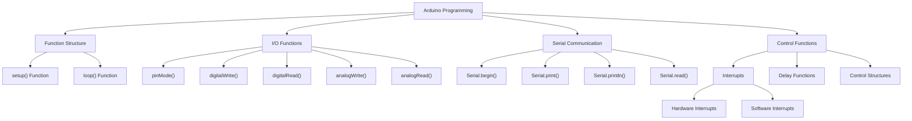
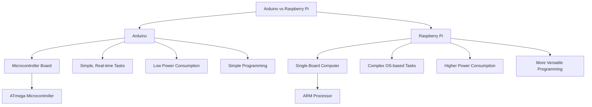
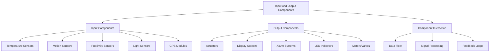
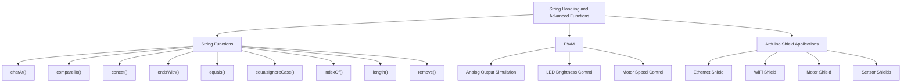

# IOT Unit 3-4 Flowchart

## Arduino Programming Fundamentals

```mermaid
flowchart TD
    A[Arduino Programming] --> B[Function Structure]
    A --> C[I/O Functions]
    A --> D[Serial Communication]
    A --> E[Control Functions]
    
    B --> B1["setup() Function"]
    B --> B2["loop() Function"]
    
    C --> C1["pinMode()"]
    C --> C2["digitalWrite()"]
    C --> C3["digitalRead()"]
    C --> C4["analogWrite()"]
    C --> C5["analogRead()"]
    
    D --> D1["Serial.begin()"]
    D --> D2["Serial.print()"]
    D --> D3["Serial.println()"]
    D --> D4["Serial.read()"]
    
    E --> E1["Interrupts"]
    E --> E2["Delay Functions"]
    E --> E3["Control Structures"]
    
    E1 --> E1a["Hardware Interrupts"]
    E1 --> E1b["Software Interrupts"]
```

## Arduino vs Raspberry Pi

```mermaid
flowchart TD
    A[Arduino vs Raspberry Pi] --> B[Arduino]
    A --> C[Raspberry Pi]
    
    B --> B1["Microcontroller Board"]
    B --> B2["Simple, Real-time Tasks"]
    B --> B3["Low Power Consumption"]
    B --> B4["Simple Programming"]
    
    C --> C1["Single-Board Computer"]
    C --> C2["Complex OS-based Tasks"]
    C --> C3["Higher Power Consumption"]
    C --> C4["More Versatile Programming"]
    
    B1 --> B1a["ATmega Microcontroller"]
    C1 --> C1a["ARM Processor"]
```

## Input and Output Components

```mermaid
flowchart TD
    A[Input and Output Components] --> B[Input Components]
    A --> C[Output Components]
    A --> D[Component Interaction]
    
    B --> B1["Temperature Sensors"]
    B --> B2["Motion Sensors"]
    B --> B3["Proximity Sensors"]
    B --> B4["Light Sensors"]
    B --> B5["GPS Modules"]
    
    C --> C1["Actuators"]
    C --> C2["Display Screens"]
    C --> C3["Alarm Systems"]
    C --> C4["LED Indicators"]
    C --> C5["Motors/Valves"]
    
    D --> D1["Data Flow"]
    D --> D2["Signal Processing"]
    D --> D3["Feedback Loops"]
```

## String Handling and Advanced Functions

```mermaid
flowchart TD
    A[String Handling and Advanced Functions] --> B[String Functions]
    A --> C[PWM]
    A --> D[Arduino Shield Applications]
    
    B --> B1["charAt()"]
    B --> B2["compareTo()"]
    B --> B3["concat()"]
    B --> B4["endsWith()"]
    B --> B5["equals()"]
    B --> B6["equalsIgnoreCase()"]
    B --> B7["indexOf()"]
    B --> B8["length()"]
    B --> B9["remove()"]
    
    C --> C1["Analog Output Simulation"]
    C --> C2["LED Brightness Control"]
    C --> C3["Motor Speed Control"]
    
    D --> D1["Ethernet Shield"]
    D --> D2["WiFi Shield"]
    D --> D3["Motor Shield"]
    D --> D4["Sensor Shields"]
``` 