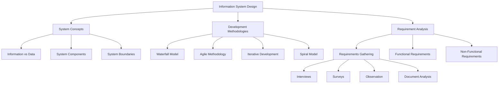
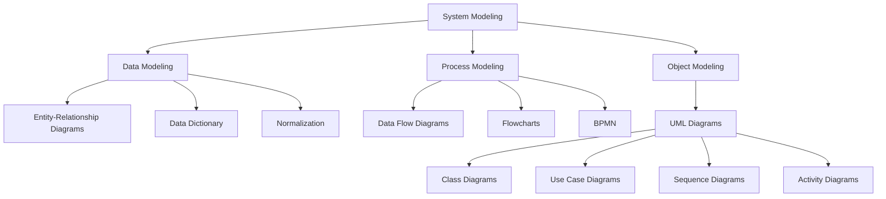
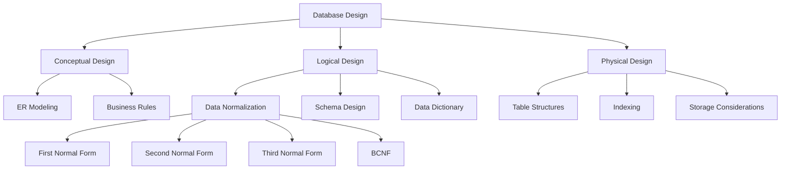
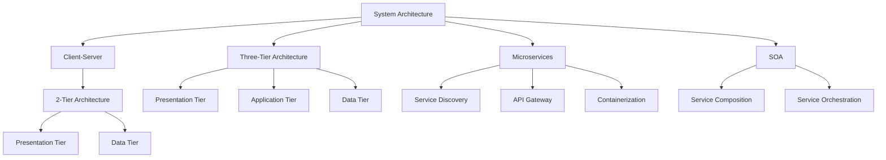

# ISD Unit 1-2 Flowchart

## Information System Fundamentals

```mermaid
flowchart TD
    A[Information System Design] --> B[System Concepts]
    A --> C[Development Methodologies]
    A --> D[Requirement Analysis]
    
    B --> B1[Information vs Data]
    B --> B2[System Components]
    B --> B3[System Boundaries]
    
    C --> C1[Waterfall Model]
    C --> C2[Agile Methodology]
    C --> C3[Iterative Development]
    C --> C4[Spiral Model]
    
    D --> D1[Requirements Gathering]
    D --> D2[Functional Requirements]
    D --> D3[Non-Functional Requirements]
    
    D1 --> D1a[Interviews]
    D1 --> D1b[Surveys]
    D1 --> D1c[Observation]
    D1 --> D1d[Document Analysis]
```

## System Modeling

```mermaid
flowchart TD
    S[System Modeling] --> S1[Data Modeling]
    S --> S2[Process Modeling]
    S --> S3[Object Modeling]
    
    S1 --> S1a[Entity-Relationship Diagrams]
    S1 --> S1b[Data Dictionary]
    S1 --> S1c[Normalization]
    
    S2 --> S2a[Data Flow Diagrams]
    S2 --> S2b[Flowcharts]
    S2 --> S2c[BPMN]
    
    S3 --> S3a[UML Diagrams]
    S3a --> S3a1[Class Diagrams]
    S3a --> S3a2[Use Case Diagrams]
    S3a --> S3a3[Sequence Diagrams]
    S3a --> S3a4[Activity Diagrams]
```

## Database Design

```mermaid
flowchart TD
    D[Database Design] --> D1[Conceptual Design]
    D --> D2[Logical Design]
    D --> D3[Physical Design]
    
    D1 --> D1a[ER Modeling]
    D1 --> D1b[Business Rules]
    
    D2 --> D2a[Data Normalization]
    D2 --> D2b[Schema Design]
    D2 --> D2c[Data Dictionary]
    
    D3 --> D3a[Table Structures]
    D3 --> D3b[Indexing]
    D3 --> D3c[Storage Considerations]
    
    D2a --> D2a1[First Normal Form]
    D2a --> D2a2[Second Normal Form]
    D2a --> D2a3[Third Normal Form]
    D2a --> D2a4[BCNF]
```

## System Architecture

```mermaid
flowchart TD
    A[System Architecture] --> A1[Client-Server]
    A --> A2[Three-Tier Architecture]
    A --> A3[Microservices]
    A --> A4[SOA]
    
    A1 --> A1a[2-Tier Architecture]
    A1a --> A1a1[Presentation Tier]
    A1a --> A1a2[Data Tier]
    
    A2 --> A2a[Presentation Tier]
    A2 --> A2b[Application Tier]
    A2 --> A2c[Data Tier]
    
    A3 --> A3a[Service Discovery]
    A3 --> A3b[API Gateway]
    A3 --> A3c[Containerization]
    
    A4 --> A4a[Service Composition]
    A4 --> A4b[Service Orchestration]
``` 