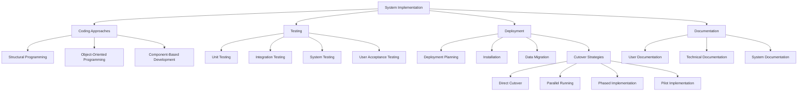
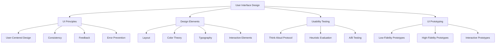
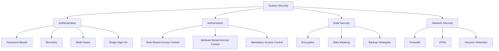
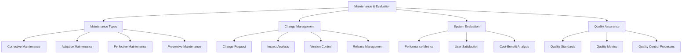

# ISD Unit 3-4 Flowchart

## System Implementation

```mermaid
flowchart TD
    I[System Implementation] --> I1[Coding Approaches]
    I --> I2[Testing]
    I --> I3[Deployment]
    I --> I4[Documentation]
    
    I1 --> I1a[Structural Programming]
    I1 --> I1b[Object-Oriented Programming]
    I1 --> I1c[Component-Based Development]
    
    I2 --> I2a[Unit Testing]
    I2 --> I2b[Integration Testing]
    I2 --> I2c[System Testing]
    I2 --> I2d[User Acceptance Testing]
    
    I3 --> I3a[Deployment Planning]
    I3 --> I3b[Installation]
    I3 --> I3c[Data Migration]
    I3 --> I3d[Cutover Strategies]
    
    I3d --> I3d1[Direct Cutover]
    I3d --> I3d2[Parallel Running]
    I3d --> I3d3[Phased Implementation]
    I3d --> I3d4[Pilot Implementation]
    
    I4 --> I4a[User Documentation]
    I4 --> I4b[Technical Documentation]
    I4 --> I4c[System Documentation]
```

## User Interface Design

```mermaid
flowchart TD
    U[User Interface Design] --> U1[UI Principles]
    U --> U2[Design Elements]
    U --> U3[Usability Testing]
    U --> U4[UI Prototyping]
    
    U1 --> U1a[User-Centered Design]
    U1 --> U1b[Consistency]
    U1 --> U1c[Feedback]
    U1 --> U1d[Error Prevention]
    
    U2 --> U2a[Layout]
    U2 --> U2b[Color Theory]
    U2 --> U2c[Typography]
    U2 --> U2d[Interactive Elements]
    
    U3 --> U3a[Think-Aloud Protocol]
    U3 --> U3b[Heuristic Evaluation]
    U3 --> U3c[A/B Testing]
    
    U4 --> U4a[Low-Fidelity Prototypes]
    U4 --> U4b[High-Fidelity Prototypes]
    U4 --> U4c[Interactive Prototypes]
```

## System Security

```mermaid
flowchart TD
    S[System Security] --> S1[Authentication]
    S --> S2[Authorization]
    S --> S3[Data Security]
    S --> S4[Network Security]
    
    S1 --> S1a[Password-Based]
    S1 --> S1b[Biometric]
    S1 --> S1c[Multi-Factor]
    S1 --> S1d[Single Sign-On]
    
    S2 --> S2a[Role-Based Access Control]
    S2 --> S2b[Attribute-Based Access Control]
    S2 --> S2c[Mandatory Access Control]
    
    S3 --> S3a[Encryption]
    S3 --> S3b[Data Masking]
    S3 --> S3c[Backup Strategies]
    
    S4 --> S4a[Firewalls]
    S4 --> S4b[VPNs]
    S4 --> S4c[Intrusion Detection]
```

## System Maintenance and Evaluation

```mermaid
flowchart TD
    M[Maintenance & Evaluation] --> M1[Maintenance Types]
    M --> M2[Change Management]
    M --> M3[System Evaluation]
    M --> M4[Quality Assurance]
    
    M1 --> M1a[Corrective Maintenance]
    M1 --> M1b[Adaptive Maintenance]
    M1 --> M1c[Perfective Maintenance]
    M1 --> M1d[Preventive Maintenance]
    
    M2 --> M2a[Change Request]
    M2 --> M2b[Impact Analysis]
    M2 --> M2c[Version Control]
    M2 --> M2d[Release Management]
    
    M3 --> M3a[Performance Metrics]
    M3 --> M3b[User Satisfaction]
    M3 --> M3c[Cost-Benefit Analysis]
    
    M4 --> M4a[Quality Standards]
    M4 --> M4b[Quality Metrics]
    M4 --> M4c[Quality Control Processes]
``` 