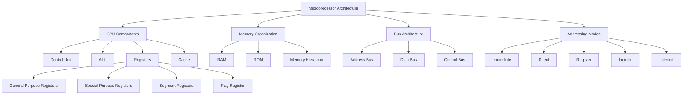
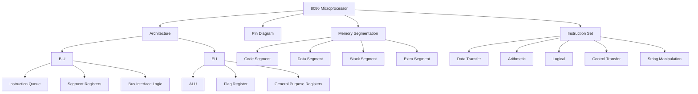
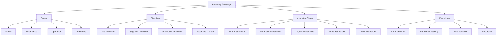
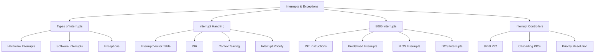

# MFE Unit 1-2 Flowchart

## Microprocessor Architecture

```mermaid
flowchart TD
    M[Microprocessor Architecture] --> M1[CPU Components]
    M --> M2[Memory Organization]
    M --> M3[Bus Architecture]
    M --> M4[Addressing Modes]
    
    M1 --> M1a[Control Unit]
    M1 --> M1b[ALU]
    M1 --> M1c[Registers]
    M1 --> M1d[Cache]
    
    M1c --> M1c1[General Purpose Registers]
    M1c --> M1c2[Special Purpose Registers]
    M1c --> M1c3[Segment Registers]
    M1c --> M1c4[Flag Register]
    
    M2 --> M2a[RAM]
    M2 --> M2b[ROM]
    M2 --> M2c[Memory Hierarchy]
    
    M3 --> M3a[Address Bus]
    M3 --> M3b[Data Bus]
    M3 --> M3c[Control Bus]
    
    M4 --> M4a[Immediate]
    M4 --> M4b[Direct]
    M4 --> M4c[Register]
    M4 --> M4d[Indirect]
    M4 --> M4e[Indexed]
```

## 8086 Microprocessor

```mermaid
flowchart TD
    P[8086 Microprocessor] --> P1[Architecture]
    P --> P2[Pin Diagram]
    P --> P3[Memory Segmentation]
    P --> P4[Instruction Set]
    
    P1 --> P1a[BIU]
    P1 --> P1b[EU]
    
    P1a --> P1a1[Instruction Queue]
    P1a --> P1a2[Segment Registers]
    P1a --> P1a3[Bus Interface Logic]
    
    P1b --> P1b1[ALU]
    P1b --> P1b2[Flag Register]
    P1b --> P1b3[General Purpose Registers]
    
    P3 --> P3a[Code Segment]
    P3 --> P3b[Data Segment]
    P3 --> P3c[Stack Segment]
    P3 --> P3d[Extra Segment]
    
    P4 --> P4a[Data Transfer]
    P4 --> P4b[Arithmetic]
    P4 --> P4c[Logical]
    P4 --> P4d[Control Transfer]
    P4 --> P4e[String Manipulation]
```

## Assembly Language Programming

```mermaid
flowchart TD
    A[Assembly Language] --> A1[Syntax]
    A --> A2[Directives]
    A --> A3[Instruction Types]
    A --> A4[Procedures]
    
    A1 --> A1a[Labels]
    A1 --> A1b[Mnemonics]
    A1 --> A1c[Operands]
    A1 --> A1d[Comments]
    
    A2 --> A2a[Data Definition]
    A2 --> A2b[Segment Definition]
    A2 --> A2c[Procedure Definition]
    A2 --> A2d[Assembler Control]
    
    A3 --> A3a[MOV Instructions]
    A3 --> A3b[Arithmetic Instructions]
    A3 --> A3c[Logical Instructions]
    A3 --> A3d[Jump Instructions]
    A3 --> A3e[Loop Instructions]
    
    A4 --> A4a[CALL and RET]
    A4 --> A4b[Parameter Passing]
    A4 --> A4c[Local Variables]
    A4 --> A4d[Recursion]
```

## Interrupts and Exceptions

```mermaid
flowchart TD
    I[Interrupts & Exceptions] --> I1[Types of Interrupts]
    I --> I2[Interrupt Handling]
    I --> I3[8086 Interrupts]
    I --> I4[Interrupt Controllers]
    
    I1 --> I1a[Hardware Interrupts]
    I1 --> I1b[Software Interrupts]
    I1 --> I1c[Exceptions]
    
    I2 --> I2a[Interrupt Vector Table]
    I2 --> I2b[ISR]
    I2 --> I2c[Context Saving]
    I2 --> I2d[Interrupt Priority]
    
    I3 --> I3a[INT Instructions]
    I3 --> I3b[Predefined Interrupts]
    I3 --> I3c[BIOS Interrupts]
    I3 --> I3d[DOS Interrupts]
    
    I4 --> I4a[8259 PIC]
    I4 --> I4b[Cascading PICs]
    I4 --> I4c[Priority Resolution]
```