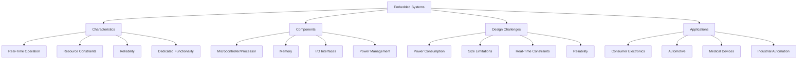
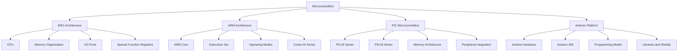
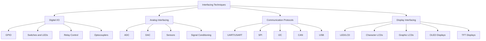
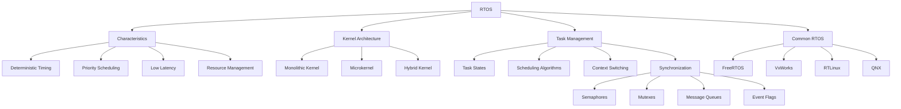

# MFE Unit 3-4 Flowchart

## Embedded Systems Fundamentals

```mermaid
flowchart TD
    E[Embedded Systems] --> E1[Characteristics]
    E --> E2[Components]
    E --> E3[Design Challenges]
    E --> E4[Applications]
    
    E1 --> E1a[Real-Time Operation]
    E1 --> E1b[Resource Constraints]
    E1 --> E1c[Reliability]
    E1 --> E1d[Dedicated Functionality]
    
    E2 --> E2a[Microcontroller/Processor]
    E2 --> E2b[Memory]
    E2 --> E2c[I/O Interfaces]
    E2 --> E2d[Power Management]
    
    E3 --> E3a[Power Consumption]
    E3 --> E3b[Size Limitations]
    E3 --> E3c[Real-Time Constraints]
    E3 --> E3d[Reliability]
    
    E4 --> E4a[Consumer Electronics]
    E4 --> E4b[Automotive]
    E4 --> E4c[Medical Devices]
    E4 --> E4d[Industrial Automation]
```

## Microcontrollers

```mermaid
flowchart TD
    M[Microcontrollers] --> M1[8051 Architecture]
    M --> M2[ARM Architecture]
    M --> M3[PIC Microcontrollers]
    M --> M4[Arduino Platform]
    
    M1 --> M1a[CPU]
    M1 --> M1b[Memory Organization]
    M1 --> M1c[I/O Ports]
    M1 --> M1d[Special Function Registers]
    
    M2 --> M2a[ARM Core]
    M2 --> M2b[Instruction Set]
    M2 --> M2c[Operating Modes]
    M2 --> M2d[Cortex-M Series]
    
    M3 --> M3a[PIC16 Series]
    M3 --> M3b[PIC18 Series]
    M3 --> M3c[Memory Architecture]
    M3 --> M3d[Peripheral Integration]
    
    M4 --> M4a[Arduino Hardware]
    M4 --> M4b[Arduino IDE]
    M4 --> M4c[Programming Model]
    M4 --> M4d[Libraries and Shields]
```

## Interfacing Techniques

```mermaid
flowchart TD
    I[Interfacing Techniques] --> I1[Digital I/O]
    I --> I2[Analog Interfacing]
    I --> I3[Communication Protocols]
    I --> I4[Display Interfacing]
    
    I1 --> I1a[GPIO]
    I1 --> I1b[Switches and LEDs]
    I1 --> I1c[Relay Control]
    I1 --> I1d[Optocouplers]
    
    I2 --> I2a[ADC]
    I2 --> I2b[DAC]
    I2 --> I2c[Sensors]
    I2 --> I2d[Signal Conditioning]
    
    I3 --> I3a[UART/USART]
    I3 --> I3b[SPI]
    I3 --> I3c[I2C]
    I3 --> I3d[CAN]
    I3 --> I3e[USB]
    
    I4 --> I4a[LED/LCD]
    I4 --> I4b[Character LCDs]
    I4 --> I4c[Graphic LCDs]
    I4 --> I4d[OLED Displays]
    I4 --> I4e[TFT Displays]
```

## Real-Time Operating Systems

```mermaid
flowchart TD
    R[RTOS] --> R1[Characteristics]
    R --> R2[Kernel Architecture]
    R --> R3[Task Management]
    R --> R4[Common RTOS]
    
    R1 --> R1a[Deterministic Timing]
    R1 --> R1b[Priority Scheduling]
    R1 --> R1c[Low Latency]
    R1 --> R1d[Resource Management]
    
    R2 --> R2a[Monolithic Kernel]
    R2 --> R2b[Microkernel]
    R2 --> R2c[Hybrid Kernel]
    
    R3 --> R3a[Task States]
    R3 --> R3b[Scheduling Algorithms]
    R3 --> R3c[Context Switching]
    R3 --> R3d[Synchronization]
    
    R3d --> R3d1[Semaphores]
    R3d --> R3d2[Mutexes]
    R3d --> R3d3[Message Queues]
    R3d --> R3d4[Event Flags]
    
    R4 --> R4a[FreeRTOS]
    R4 --> R4b[VxWorks]
    R4 --> R4c[RTLinux]
    R4 --> R4d[QNX]
``` 