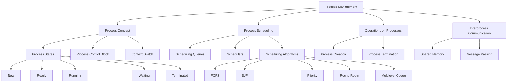
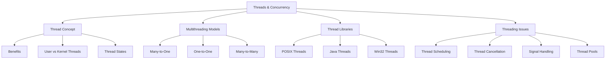
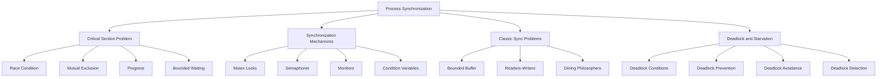

# OS Unit 1-2 Flowchart

## Operating System Fundamentals

```mermaid
flowchart TD
    O[Operating System] --> O1[OS Functions]
    O --> O2[OS Types]
    O --> O3[OS Structure]
    O --> O4[OS Services]
    
    O1 --> O1a[Process Management]
    O1 --> O1b[Memory Management]
    O1 --> O1c[File Management]
    O1 --> O1d[I/O Management]
    O1 --> O1e[Security]
    
    O2 --> O2a[Batch OS]
    O2 --> O2b[Time-Sharing OS]
    O2 --> O2c[Distributed OS]
    O2 --> O2d[Network OS]
    O2 --> O2e[Real-Time OS]
    
    O3 --> O3a[Monolithic]
    O3 --> O3b[Layered]
    O3 --> O3c[Microkernel]
    O3 --> O3d[Hybrid]
    
    O4 --> O4a[User Interface]
    O4 --> O4b[Program Execution]
    O4 --> O4c[I/O Operations]
    O4 --> O4d[File System Manipulation]
    O4 --> O4e[Communication]
```

## Process Management

```mermaid
flowchart TD
    P[Process Management] --> P1[Process Concept]
    P --> P2[Process Scheduling]
    P --> P3[Operations on Processes]
    P --> P4[Interprocess Communication]
    
    P1 --> P1a[Process States]
    P1 --> P1b[Process Control Block]
    P1 --> P1c[Context Switch]
    
    P1a --> P1a1[New]
    P1a --> P1a2[Ready]
    P1a --> P1a3[Running]
    P1a --> P1a4[Waiting]
    P1a --> P1a5[Terminated]
    
    P2 --> P2a[Scheduling Queues]
    P2 --> P2b[Schedulers]
    P2 --> P2c[Scheduling Algorithms]
    
    P2c --> P2c1[FCFS]
    P2c --> P2c2[SJF]
    P2c --> P2c3[Priority]
    P2c --> P2c4[Round Robin]
    P2c --> P2c5[Multilevel Queue]
    
    P3 --> P3a[Process Creation]
    P3 --> P3b[Process Termination]
    
    P4 --> P4a[Shared Memory]
    P4 --> P4b[Message Passing]
```

## Threads and Concurrency

```mermaid
flowchart TD
    T[Threads & Concurrency] --> T1[Thread Concept]
    T --> T2[Multithreading Models]
    T --> T3[Thread Libraries]
    T --> T4[Threading Issues]
    
    T1 --> T1a[Benefits]
    T1 --> T1b[User vs Kernel Threads]
    T1 --> T1c[Thread States]
    
    T2 --> T2a[Many-to-One]
    T2 --> T2b[One-to-One]
    T2 --> T2c[Many-to-Many]
    
    T3 --> T3a[POSIX Threads]
    T3 --> T3b[Java Threads]
    T3 --> T3c[Win32 Threads]
    
    T4 --> T4a[Thread Scheduling]
    T4 --> T4b[Thread Cancellation]
    T4 --> T4c[Signal Handling]
    T4 --> T4d[Thread Pools]
```

## Process Synchronization

```mermaid
flowchart TD
    S[Process Synchronization] --> S1[Critical Section Problem]
    S --> S2[Synchronization Mechanisms]
    S --> S3[Classic Sync Problems]
    S --> S4[Deadlock and Starvation]
    
    S1 --> S1a[Race Condition]
    S1 --> S1b[Mutual Exclusion]
    S1 --> S1c[Progress]
    S1 --> S1d[Bounded Waiting]
    
    S2 --> S2a[Mutex Locks]
    S2 --> S2b[Semaphores]
    S2 --> S2c[Monitors]
    S2 --> S2d[Condition Variables]
    
    S3 --> S3a[Bounded Buffer]
    S3 --> S3b[Readers-Writers]
    S3 --> S3c[Dining Philosophers]
    
    S4 --> S4a[Deadlock Conditions]
    S4 --> S4b[Deadlock Prevention]
    S4 --> S4c[Deadlock Avoidance]
    S4 --> S4d[Deadlock Detection]
``` 