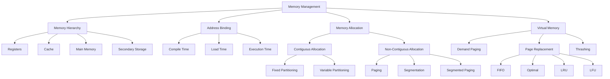
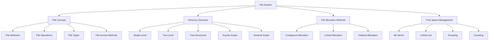
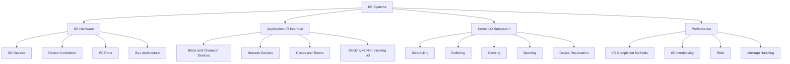
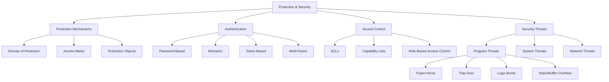

# OS Unit 3-4 Flowchart

## Memory Management

```mermaid
flowchart TD
    M[Memory Management] --> M1[Memory Hierarchy]
    M --> M2[Address Binding]
    M --> M3[Memory Allocation]
    M --> M4[Virtual Memory]
    
    M1 --> M1a[Registers]
    M1 --> M1b[Cache]
    M1 --> M1c[Main Memory]
    M1 --> M1d[Secondary Storage]
    
    M2 --> M2a[Compile Time]
    M2 --> M2b[Load Time]
    M2 --> M2c[Execution Time]
    
    M3 --> M3a[Contiguous Allocation]
    M3 --> M3b[Non-Contiguous Allocation]
    
    M3a --> M3a1[Fixed Partitioning]
    M3a --> M3a2[Variable Partitioning]
    
    M3b --> M3b1[Paging]
    M3b --> M3b2[Segmentation]
    M3b --> M3b3[Segmented Paging]
    
    M4 --> M4a[Demand Paging]
    M4 --> M4b[Page Replacement]
    M4 --> M4c[Thrashing]
    
    M4b --> M4b1[FIFO]
    M4b --> M4b2[Optimal]
    M4b --> M4b3[LRU]
    M4b --> M4b4[LFU]
```

## File System

```mermaid
flowchart TD
    F[File System] --> F1[File Concept]
    F --> F2[Directory Structure]
    F --> F3[File Allocation Methods]
    F --> F4[Free Space Management]
    
    F1 --> F1a[File Attributes]
    F1 --> F1b[File Operations]
    F1 --> F1c[File Types]
    F1 --> F1d[File Access Methods]
    
    F2 --> F2a[Single-Level]
    F2 --> F2b[Two-Level]
    F2 --> F2c[Tree-Structured]
    F2 --> F2d[Acyclic-Graph]
    F2 --> F2e[General Graph]
    
    F3 --> F3a[Contiguous Allocation]
    F3 --> F3b[Linked Allocation]
    F3 --> F3c[Indexed Allocation]
    
    F4 --> F4a[Bit Vector]
    F4 --> F4b[Linked List]
    F4 --> F4c[Grouping]
    F4 --> F4d[Counting]
```

## I/O Systems

```mermaid
flowchart TD
    I[I/O Systems] --> I1[I/O Hardware]
    I --> I2[Application I/O Interface]
    I --> I3[Kernel I/O Subsystem]
    I --> I4[Performance]
    
    I1 --> I1a[I/O Devices]
    I1 --> I1b[Device Controllers]
    I1 --> I1c[I/O Ports]
    I1 --> I1d[Bus Architecture]
    
    I2 --> I2a[Block and Character Devices]
    I2 --> I2b[Network Devices]
    I2 --> I2c[Clocks and Timers]
    I2 --> I2d[Blocking vs Non-blocking I/O]
    
    I3 --> I3a[Scheduling]
    I3 --> I3b[Buffering]
    I3 --> I3c[Caching]
    I3 --> I3d[Spooling]
    I3 --> I3e[Device Reservation]
    
    I4 --> I4a[I/O Completion Methods]
    I4 --> I4b[I/O Interleaving]
    I4 --> I4c[DMA]
    I4 --> I4d[Interrupt Handling]
```

## Protection and Security

```mermaid
flowchart TD
    S[Protection & Security] --> S1[Protection Mechanisms]
    S --> S2[Authentication]
    S --> S3[Access Control]
    S --> S4[Security Threats]
    
    S1 --> S1a[Domain of Protection]
    S1 --> S1b[Access Matrix]
    S1 --> S1c[Protection Objects]
    
    S2 --> S2a[Password-Based]
    S2 --> S2b[Biometric]
    S2 --> S2c[Token-Based]
    S2 --> S2d[Multi-Factor]
    
    S3 --> S3a[ACLs]
    S3 --> S3b[Capability Lists]
    S3 --> S3c[Role-Based Access Control]
    
    S4 --> S4a[Program Threats]
    S4 --> S4b[System Threats]
    S4 --> S4c[Network Threats]
    
    S4a --> S4a1[Trojan Horse]
    S4a --> S4a2[Trap Door]
    S4a --> S4a3[Logic Bomb]
    S4a --> S4a4[Stack/Buffer Overflow]
``` 