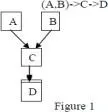

# Unit 2

## 1) Differentiate abstract class and interface with example.

Both abstract classes and interfaces are used to declare methods in Java that are then implemented by other classes. However, they are used in different scenarios and have different characteristics:

| Aspect               | Abstract Class                                                 | Interface                                                                                                  |
| -------------------- | -------------------------------------------------------------- | ---------------------------------------------------------------------------------------------------------- |
| Default methods      | Can contain default method implementations.                    | Cannot contain default method implementations (unless using default methods feature introduced in Java 8). |
| Instance variables   | Can have instance variables.                                   | Cannot have instance variables (only static final variables).                                              |
| Constructors         | Can have constructors.                                         | Cannot have constructors.                                                                                  |
| Extension            | An abstract class can be extended using the keyword "extends". | An interface is implemented using the keyword "implements".                                                |
| Multiple inheritance | A class can extend only one abstract class.                    | A class can implement multiple interfaces.                                                                 |

Here's an example of an abstract class and its implementation:

```java
abstract class AbstractAnimal {
    abstract void makeSound();
}

class Dog extends AbstractAnimal {
    void makeSound() {
        System.out.println("Woof");
    }
}

```

And here's an example of an interface and its implementation:

```java
interface AnimalInterface {
    void makeSound();
}

class Cat implements AnimalInterface {
    public void makeSound() {
        System.out.println("Meow");
    }
}

```

## 2) Explain inheritance and its types with Example.

Inheritance in Java is a mechanism where a new class is derived from an existing class. In Java, classes are used to create objects (specific data structures), and methods are used to perform actions. The new class, known as the derived class, inherits attributes and behavior from the pre-existing class, which is known as the base class or superclass. Inheritance is essential in object-oriented programming because it promotes code reuse and is a way to model relationships between your classes.

There are four types of inheritance in Java:

1. **Single Inheritance**: In single inheritance, a class inherits the properties and methods of a single superclass. This is the simplest type of inheritance.

```java
class Animal {
  void eat() {
    System.out.println("eating...");
  }
}
class Dog extends Animal {
  void bark() {
    System.out.println("barking...");
  }
}

```

In this example, the `Dog` class inherits the `eat` method from the `Animal` class. Therefore, a `Dog` object can invoke both `eat` and `bark` methods.

1. **Multilevel Inheritance**: In multilevel inheritance, a derived class acts as a base class for other classes.

```java
class Animal {
  void eat() {
    System.out.println("eating...");
  }
}
class Dog extends Animal {
  void bark() {
    System.out.println("barking...");
  }
}
class BabyDog extends Dog {
  void weep() {
    System.out.println("weeping...");
  }
}

```

In this example, `BabyDog` is derived from `Dog`, which is derived from `Animal`. Therefore, a `BabyDog` object can invoke `weep`, `bark`, and `eat` methods.

1. **Hierarchical Inheritance**: In hierarchical inheritance, a single class serves as a superclass for more than one subclass.

```java
class Animal {
  void eat() {
    System.out.println("eating...");
  }
}
class Dog extends Animal {
  void bark() {
    System.out.println("barking...");
  }
}
class Cat extends Animal {
  void meow() {
    System.out.println("meowing...");
  }
}

```

In this example, both `Dog` and `Cat` classes are derived from the `Animal` class. Therefore, a `Dog` object can invoke `eat` and `bark` methods, while a `Cat` object can invoke `eat` and `meow` methods.

1. **Multiple Inheritance (Not Supported in Java)**: In multiple inheritance, a class can inherit from more than one class. Java does not support multiple inheritance with classes. In other words, a class cannot extend more than one class. However, a class can implement more than one interface, which is a form of multiple inheritance.

```java
interface Animal {
  void eat();
}
interface Mammal {
  void giveBirth();
}
class Dog implements Animal, Mammal {
  public void eat() {
    System.out.println("eating...");
  }
  public void giveBirth() {
    System.out.println("giving birth...");
  }
}

```

In this example, the `Dog` class is implementing `Animal` and `Mammal` interfaces. Therefore, a `Dog` object can invoke `eat` and `giveBirth` methods.

## 3) Why multiple inheritance is not supported in java.

Multiple inheritance is not supported in Java to avoid the "diamond problem". The "diamond problem" is an ambiguity that arises when a class has two superclasses that have a common superclass, and all three superclasses have a method with the same name. It's unclear which superclass method the subclass would inherit in this case. By disallowing multiple inheritance, Java avoids this issue altogether.

However, Java does support multiple inheritance of types. This means a class can implement multiple interfaces, which can contain default methods. If the interfaces contain methods with the same name, the implementing class or interface must override the method. This provides a clear and specific implementation for the method, circumventing the "diamond problem".

## 4) What is package? Explain type of packages.

A package in Java is a namespace that organizes a set of related classes and interfaces. Conceptually, you can think of packages as being similar to different folders on your computer. You might keep HTML pages in one folder, images in another, and scripts or applications in yet another. Because software written in the Java programming language can be composed of hundreds or thousands of individual classes, it makes sense to keep things organized by placing related classes and interfaces into packages.

There are two types of packages in Java:

1. **Built-in Packages**: These are the packages that come with the Java development environment. They contain a large number of classes which are a part of Java API. Some of the commonly used built-in packages are:
   - java.lang: Contains classes that are fundamental to the design of the Java programming language.
   - java.io: Provides classes for system input and output through data streams.
   - java.util: Contains the collections framework, legacy collection classes, event model, date and time facilities, internationalization, and miscellaneous utility classes.
2. **User-defined Packages**: These are the packages created by users for their use. They help in resolving naming conflicts when different packages have classes with the same names. Packages provide easier access control and also make searching/locating and usage of classes, interfaces, enumerations, and annotations easier.

Here is an example of how to create a user-defined package in Java:

```java
package mypackage;  // This is a package declaration

public class MyClass {
  public void display() {
    System.out.println("This is a user-defined package");
  }
}

```

In the above code, `mypackage` is the package we've defined, and `MyClass` is a class under that package.

## 5) Explain ways to import packages with examples.

There are two ways to import packages in Java - using the wildcard (\*) character and specifying the full class name.

1. **Using the Wildcard (\*) Character**: This method imports all the classes and interfaces contained in the specified package. For example, if we want to use any class or interface in the `java.util` package, we can import it using the wildcard (\*) character as follows:

```java
import java.util.*;

```

In this example, all classes and interfaces from the `java.util` package can be used without specifying their fully qualified name.

1. **Specifying the Full Class Name**: This method imports only the specified class or interface from the package. For example, if we only need the `ArrayList` class from the `java.util` package, we can import it as follows:

```java
import java.util.ArrayList;

```

In this example, only the `ArrayList` class can be used from the `java.util` package. Other classes and interfaces from this package will not be available unless they are also imported.

Remember, even though using the wildcard (\*) character to import all classes and interfaces might seem convenient, it is generally recommended to import only the necessary classes or interfaces to keep the namespace clean and avoid name conflicts.

## 6) Explain method overriding with example.

Method overriding in Java occurs when a subclass provides a specific implementation of a method that is already provided by its parent class. It is used for runtime polymorphism and to provide the specific implementation of the method.

Method overriding is done using inheritance and it is performed between two classes with the same method name and parameters. The method in the subclass should have the same name, same parameters, or signature, and same return type(or subtype) as the one in its parent class.

Here is an example of method overriding:

```java
class Animal {
    void eat() {
        System.out.println("eating...");
    }
}

class Dog extends Animal {
    void eat() {
        System.out.println("eating bread...");
    }

    public static void main(String args[]) {
        Dog d = new Dog();
        d.eat(); // This will call the "eat" method in the Dog class
    }
}

```

In this example, the `Dog` class overrides the `eat` method of the `Animal` class. So, when you create a `Dog` object and call the `eat` method, it will print "eating bread...", which is the implementation of the `eat` method in the `Dog` class.

## 7) Differentiate Method Overloading and Method Overriding with examples.

Both method overloading and method overriding are techniques used in Java to implement methods with the same name, but they serve different purposes and have different rules.

**Method Overloading**:

Method overloading occurs when two or more methods in the same class have the exact same name but different parameters (different number of parameters and/or type of parameters), which is why it is also known as compile-time polymorphism. The return type of the methods does not factor into method overloading, and it can be different or the same. Method overloading is used to increase the readability of the program.

Here is an example of method overloading:

```java
class Calculation {
    void sum(int a, int b) {
        System.out.println(a + b);
    }
    void sum(int a, int b, int c) {
        System.out.println(a + b + c);
    }
    public static void main(String args[]) {
        Calculation obj = new Calculation();
        obj.sum(10, 20); // This will call the first "sum" method
        obj.sum(10, 20, 30); // This will call the second "sum" method
    }
}

```

**Method Overriding**:

Method overriding occurs when a subclass provides a specific implementation of a method that is already provided by its parent class, which is why it is also known as runtime polymorphism. The method must have the same name, return type, and parameters in both the subclass and the parent class. Method overriding is used to provide the specific implementation of a method that is already provided by its superclass.

Here is an example of method overriding:

```java
class Animal {
    void eat() {
        System.out.println("eating...");
    }
}
class Dog extends Animal {
    void eat() {
        System.out.println("eating bread...");
    }
    public static void main(String args[]) {
        Dog obj = new Dog();
        obj.eat(); // This will call the "eat" method in the Dog class
    }
}

```

In summary, method overloading deals with multiple methods in the same class with the same name but different parameters, whereas method overriding deals with two methods, one in the parent class and the other in the subclass, that have the same name, return type, and parameters.

## 8) Explain super keywords.

The `super` keyword in Java is a reference variable that is used to refer to the immediate parent class object. It can be used in three scenarios:

1. **Accessing Parent Class Variables**: If a variable is declared in both the parent and child class, and you need to access the variable from the parent class within the child class, you can use the `super` keyword.

```java
class Parent {
    int num = 100;
}

class Child extends Parent {
    int num = 200;

    void printNum() {
        System.out.println(super.num);  // This will print 100
    }
}

```

In the above example, `super.num` refers to the `num` variable from the `Parent` class, while `num` without `super` refers to the `num` variable from the `Child` class.

1. **Calling Parent Class Methods**: If a method is declared in both the parent and child class, and you need to call the method from the parent class within the child class, you can use the `super` keyword.

```java
class Parent {
    void display() {
        System.out.println("Parent display");
    }
}

class Child extends Parent {
    void display() {
        System.out.println("Child display");
    }

    void printDisplay() {
        super.display();  // This will print "Parent display"
    }
}

```

In the above example, `super.display()` calls the `display()` method from the `Parent` class.

1. **Calling Parent Class Constructors**: You can use the `super` keyword to call the constructor of the parent class. This is often used to initialize parent class variables.

```java
class Parent {
    Parent() {
        System.out.println("Parent Constructor");
    }
}

class Child extends Parent {
    Child() {
        super();
        System.out.println("Child Constructor");
    }
}

```

In the above example, `super()` is used in the `Child` class constructor to call the constructor of the `Parent` class. This will print "Parent Constructor" before printing "Child Constructor".

## 9) Explain Final keywords.

The `final` keyword in Java is used to restrict the user. The `final` keyword can be used in various contexts:

1. **Final Variable**: When the `final` keyword is used with variables, the value of the variable cannot be changed after it has been initialized. This means that a `final` variable can only be assigned once.

```java
final int MAX_VALUE = 100;
MAX_VALUE = 200;  // This will give an error because you can't change the value of a final variable

```

1. **Final Method**: When the `final` keyword is used with methods, the method cannot be overridden by any subclass. This is typically done for methods that have a complete implementation, and we want to prevent subclasses from changing the implementation.

```java
class Parent {
    final void display() {
        System.out.println("Parent display");
    }
}

class Child extends Parent {
    void display() { // This will give an error because you can't override a final method
        System.out.println("Child display");
    }
}

```

1. **Final Class**: When the `final` keyword is used with classes, the class cannot be subclassed. This is typically done for classes that are fully developed and have a complete implementation, and we don't want any other class to extend it.

```java
final class MyFinalClass {
    // some code
}

class Child extends MyFinalClass { // This will give an error because you can't subclass a final class
    // some code
}

```

In summary, the `final` keyword provides a way to create constants in Java (final variables), prevent method overriding (final methods), and prevent inheritance (final classes).

## 10) Explain Dynamic method dispatch or runtime polymorphism.

Dynamic method dispatch, also known as runtime polymorphism, is a process used in object-oriented programming that allows the identification of the method to be called at runtime rather than at compile-time. In Java, this is achieved through method overriding and interface methods.

In this mechanism, an overridden method is called through the reference variable of a superclass. The determination of the method to be called is based on the object being referred to by the reference variable. It allows Java to support overriding of methods which plays a crucial role in allowing Java to achieve Runtime Polymorphism.

Here is an example:

```java
class Animal {
    void eat() {
        System.out.println("animal is eating...");
    }
}

class Dog extends Animal {
    void eat() {
        System.out.println("dog is eating...");
    }
}

public class Main {
    public static void main(String[] args) {
        Animal a = new Dog();
        a.eat();
    }
}

```

In this example, the `eat` method of the `Dog` class is called despite the reference being of type `Animal`. This is because the actual object being referred to is of the `Dog` class. This decision is made at runtime, hence the term 'runtime polymorphism'.

## 11) Explain instanceof operator.

The `instanceof` operator in Java is used to test whether an object is an instance of a specific class or an interface. It is a binary operator used to test the type of an object during runtime. The `instanceof` operator is used for type checking and also for downcasting. If we apply `instanceof` operator with any variable that has a `null` value, it returns `false`.

Here is the syntax:

```
object instanceof ClassOrInterfaceType

```

The `instanceof` operator will return `true` if the `object` is an instance of the given `ClassOrInterfaceType`, and `false` otherwise.

Here is an example usage:

```java
class Animal {}
class Dog extends Animal {}

public class Main {
    public static void main(String[] args) {
        Dog d = new Dog();
        System.out.println(d instanceof Animal);  // prints "true"
    }
}

```

In this example, the `instanceof` operator is used to check if `d`, which is an instance of `Dog`, is also an instance of `Animal`. Since `Dog` is a subclass of `Animal`, the operator returns `true`.

## 12) Explain single level and multiple inheritances in java. Write a program to demonstrate a combination of both types of inheritance as shown in figure.



Inheritance in Java is a concept where the properties of one class can be inherited by the other. It helps to reuse the code and establish a relationship between different classes. Inheritance in Java can be classified into two types: Single Level Inheritance and Multiple Inheritance.

**Single Level Inheritance**: In Single Level Inheritance, a class inherits the properties of another class (parent class). This is the simplest type of inheritance. Here is an example:

```java
class Parent {
    void parentMethod() {
        System.out.println("This is a method in Parent class");
    }
}

class Child extends Parent {
    void childMethod() {
        System.out.println("This is a method in Child class");
    }
}

```

In the above example, `Child` is the subclass and `Parent` is the superclass. The `Child` class inherits the properties and behavior of the `Parent` class.

**Multiple Inheritance (through Interfaces)**: Java does not support multiple inheritance with classes. In other words, a class cannot extend more than one class. However, a class can implement more than one interface, which is a form of multiple inheritance.

```java
interface Parent1 {
    void parent1Method();
}

interface Parent2 {
    void parent2Method();
}

class Child implements Parent1, Parent2 {
    public void parent1Method() {
        System.out.println("This is a method in Parent1 interface");
    }
    public void parent2Method() {
        System.out.println("This is a method in Parent2 interface");
    }
}

```

In the above example, `Child` class is implementing `Parent1` and `Parent2` interfaces. Therefore, a `Child` object can invoke `parent1Method` and `parent2Method` methods.

When it comes to the combination of both types of inheritance, it would look something like this:

```java
interface Parent1 {
    void parent1Method();
}

class Parent2 {
    void parent2Method() {
        System.out.println("This is a method in Parent2 class");
    }
}

class Child extends Parent2 implements Parent1 {
    public void parent1Method() {
        System.out.println("This is a method in Parent1 interface");
    }
}

```

In this example, `Child` class extends the `Parent2` class and implements `Parent1` interface. Therefore, a `Child` object can invoke `parent1Method` and `parent2Method` methods. This example corresponds to the inheritance diagram provided in the question.

## 13) What is error? Explain various types of errors. How can we handle run time errors in java.

An error in Java is a serious problem that is not expected to be caught under normal circumstances. It is usually caught during runtime and indicates that something severely went wrong, such as system malfunction.

There are three types of errors in Java:

1. **Compile-time Errors**: These errors are also known as syntax errors. They occur when the rules of the Java programming language are not followed. For example, if a program uses a variable that has not been declared, then the compiler will report a compile-time error.
2. **Run-time Errors**: These errors are also known as exceptions. They occur during the execution of the program when the JVM (Java Virtual Machine) has to shut down in order not to damage the operating system or the hardware. Examples of runtime errors include dividing by zero, file not found, network connection lost, and out of memory errors.
3. **Logical Errors**: These errors occur when the program compiles and runs fine, but the results are not as expected due to some faulty logic in the program.

Java provides a powerful concept of exception handling that allows us to handle runtime errors (exceptions) to maintain the normal flow of the application. The core advantage of exception handling is that it separates the error handling code from the regular code.

Java exception handling is performed through the use of five keywords: `try`, `catch`, `finally`, `throw`, and `throws`.

- `try`: The try block contains a set of statements where an exception can occur.
- `catch`: The catch block is used to handle the exception. It must be used after the try block.
- `finally`: The finally block is used to execute the important code of the program. It is executed whether an exception is handled or not.
- `throw`: The throw keyword is used to throw an exception manually.
- `throws`: The throws keyword is used to declare exceptions. It doesn't throw an exception. It specifies that there may occur an exception in the method.

Here is an example of handling a runtime error using a try-catch block:

```java
public class Main {
  public static void main(String[] args) {
    try {
      int[] arr = {1, 2, 3};
      System.out.println(arr[5]); // This will throw an ArrayIndexOutOfBoundsException
    } catch (ArrayIndexOutOfBoundsException e) {
      System.out.println("Array Index is Out Of Bounds");
    }
  }
}

```

In this example, attempting to access an array element out of bounds throws an `ArrayIndexOutOfBoundsException`. The exception is caught and handled by the catch block, and the program continues to run without crashing.

## 14) Explain the importance of Exception handling in java. Write a program to handle ArithmeticException, ArrayIndexOutofBoundsException using try-catch-finally and throw.

Exception handling is a powerful mechanism in Java that is used to handle runtime errors so that the normal flow of the program can be maintained. It is mainly used for handling checked exceptions (known exceptions that occur during compile-time), however, it can also be used for handling unchecked exceptions (exceptions that occur during runtime).

The importance of exception handling in Java are as follows:

- It helps to maintain the normal flow of the application. An exception normally disrupts the normal flow of the program; using exception handling allows the program to continue its execution.
- Exception handling provides a way to catch any exception that occurs during the execution of a program and provides a meaningful message to the user while also saving the state of the program for later debugging.

Here's an example of a program that handles `ArithmeticException` and `ArrayIndexOutOfBoundsException` using try-catch-finally and throw:

```java
public class Main {
    public static void main(String[] args) {
        try {
            int zero = 0;
            int average = 10/zero;  // This will throw ArithmeticException
            throw new ArithmeticException("You can't divide a number by zero!");
        } catch(ArithmeticException e) {
            System.out.println(e.getMessage());
        } finally {
            System.out.println("Arithmetic Exception handled.");
        }

        try {
            int[] arr = new int[5];
            arr[10] = 50; // This will throw ArrayIndexOutOfBoundsException
            throw new ArrayIndexOutOfBoundsException("Array Index is Out Of Bounds!");
        } catch(ArrayIndexOutOfBoundsException e) {
            System.out.println(e.getMessage());
        } finally {
            System.out.println("ArrayIndexOutOfBoundsException handled.");
        }
    }
}

```

In this program, we are purposely causing an `ArithmeticException` and an `ArrayIndexOutOfBoundsException`. When these exceptions occur, they are caught and handled by corresponding catch blocks, and a meaningful message is printed to the user. The finally block is executed after the try and catch blocks regardless of whether an exception was thrown and handled or not.

## 15) What is Is-A relationship in Java?

The "Is-A" relationship in Java is a way of saying that one object is a type of another and is established through the inheritance mechanism. In other words, "Is-A" represents the parent-child relationship between classes. If we have a class `Child` that extends a class `Parent`, we can say that `Child` "Is-A" `Parent`.

Here's an example:

```java
class Animal {
    void eat() {
        System.out.println("eating...");
    }
}

class Dog extends Animal {
    void bark() {
        System.out.println("barking...");
    }
}

public class Main {
    public static void main(String[] args) {
        Dog d = new Dog();
        d.eat();  // Dog can eat because it "Is-A" Animal
        d.bark(); // Dog can bark because it is a Dog
    }
}

```

In this example, `Dog` extends `Animal`, so it inherits the `eat` method from `Animal`. This means that `Dog` "Is-A" `Animal`. The `Dog` class also has its own method `bark`. The "Is-A" relationship means that a `Dog` object can do anything that an `Animal` object can do, but not necessarily the other way around.

## 16) Are constructor and instance initialization block inherited to subclass?

No, constructors and instance initialization blocks are not inherited by subclasses in Java. While a subclass can call a constructor of the superclass using the `super` keyword, it does not inherit the constructor itself. Similarly, instance initialization blocks are not inherited. Each class (both superclass and subclass) has its own instance initialization block.

## 17) Are static members inherited to subclass in Java?

No, static members are not inherited to subclasses in Java. When a subclass is created, it does not inherit the static members (variables or methods) of its superclass. Static members belong to the class itself rather than instances of the class, so they are not part of the inheritance hierarchy. Each class, including the superclass and subclass, has its own copy of static members.

Here's an example to illustrate this concept:

```java
class SuperClass {
    static int staticVar = 10;

    static void staticMethod() {
        System.out.println("SuperClass static method");
    }
}

class SubClass extends SuperClass {
}

public class Main {
    public static void main(String[] args) {
        System.out.println(SubClass.staticVar); // Output: 10
        SubClass.staticMethod(); // Output: SuperClass static method
    }
}

```

In this example, `SubClass` does not define its own `staticVar` or `staticMethod`, but it can still access and use them as if they were inherited. However, this is because the static members are accessible through the class itself (`SubClass.staticVar` and `SubClass.staticMethod()`), not because they are inherited from `SuperClass`.

## 18) Will the code successfully compiled? If yes, what is the output?

public class A {
int x = 20;
}
public class B extends A {
int x = 30;
}
public class Test {
public static void main(String[] args)
{
B b = new B();
System.out.println(b.x);
A a = new A();
System.out.println(a.x);
A a2 = new B();
System.out.println(a2.x);
}
}

Yes, the code will compile successfully. However, the output will be:

```
30
20
20

```

In the `Test` class, when `b.x` is called, it prints `30` because `b` is an instance of class `B` and `x` in `B` has a value of `30`. When `a.x` is called, it prints `20` because `a` is an instance of class `A` and `x` in `A` has a value of `20`. Finally, when `a2.x` is called, it prints `20` because `a2` is also an instance of class `A` (even though it was initialized as an instance of class `B`) and `x` in `A` has a value of `20`.

## 19) Will this code run successfully? If yes, what will be the output?

public class A
{
private int x = 50;
void m1() {
System.out.println(x);
}
}
public class B extends A {
}
public class Test {
public static void main(String[] args)
{
A a = new B();
a.m1();
}
}

Yes, the code will run successfully. The output will be:

```
50

```

Explanation:

- Class `A` has a private instance variable `x` with a value of `50` and a method `m1` that prints the value of `x`.
- Class `B` extends class `A` but does not define any new members or methods.
- In the `Test` class, an instance of `B` is created and assigned to a variable of type `A`.
- When `m1` is called on the `A` reference `a`, it prints the value of `x`, which is `50`. Even though `x` is private in `A`, it can still be accessed within `A`'s methods.

## 20) Can I import same package/class twice? Will the JVM load the package twice at runtime?

Yes, you can import the same package or class multiple times in Java without any issues. The compiler will not complain about duplicate imports, and the JVM will not load the package or class multiple times at runtime.

Import statements are simply a way to tell the compiler where to find classes when you refer to them by their simple names. Once a class or package is imported, it is available for use throughout the file, regardless of the number of times it was imported. The JVM ensures that each class is loaded into memory only once, even if it is imported multiple times.
