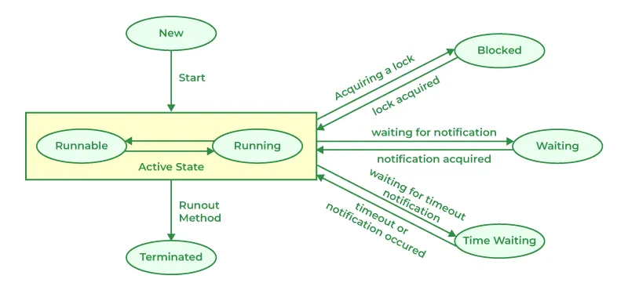
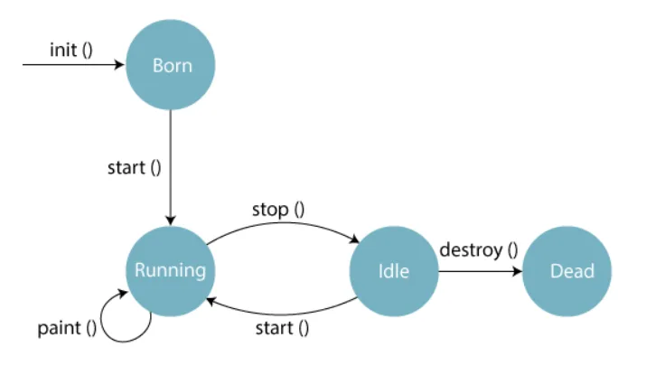

# Unit 4

## 1) Draw and explain the life cycle of thread. Also list and explain various methods of thread.



### Life Cycle of a Thread

1. **New**:
   - A thread is in the new state when an instance of the `Thread` class is created but `start()` method is not called yet.
2. **Runnable**:
   - After calling the `start()` method, the thread moves to the runnable state.
   - The thread is ready to run, but the scheduler has not selected it to be the running thread yet.
3. **Running**:
   - The thread moves to the running state when the scheduler selects it to run.
   - The `run()` method of the thread is executed.
4. **Blocked/Waiting**:
   - A thread can move to a blocked or waiting state due to reasons like waiting for I/O operations, synchronization, or sleep.
5. **Dead**:
   - The thread enters the dead state when the `run()` method completes or when `stop()` method is called.
   - A dead thread cannot be restarted.

### Methods of Thread Class

1. **start()**:
   - Starts the execution of the thread by calling the `run()` method.
2. **run()**:
   - Contains the code that the thread will execute.
3. **sleep(long millis)**:
   - Causes the thread to sleep for the specified number of milliseconds.
4. **yield()**:
   - Causes the currently executing thread to pause temporarily and allow other threads to execute.
5. **join()**:
   - Waits for the thread to die.
6. **interrupt()**:
   - Interrupts the thread, causing it to throw an `InterruptedException`.
7. **isAlive()**:
   - Checks if the thread is alive.
8. **setName(String name)**:
   - Sets the name of the thread.
9. **getName()**:
   - Gets the name of the thread.
10. **setPriority(int priority)**:
    - Sets the priority of the thread.
11. **getPriority()**:
    - Gets the priority of the thread.
12. **isDaemon()**:
    - Checks if the thread is a daemon thread.
13. **setDaemon(boolean on)**:
    - Marks the thread as a daemon thread.
14. **currentThread()**:
    - Returns a reference to the currently executing thread.

### Example of Thread Life Cycle and Methods

```java
public class MyThread extends Thread {
    public void run() {
        System.out.println("Thread is running...");
    }

    public static void main(String[] args) {
        MyThread thread = new MyThread(); // New
        thread.start(); // Runnable
        // Running
        try {
            thread.sleep(1000); // Sleeping
            thread.join(); // Waiting
        } catch (InterruptedException e) {
            e.printStackTrace();
        }
        System.out.println("Is thread alive? " + thread.isAlive()); // Checking if alive
    }
}

```

In this example, the thread goes through the life cycle stages and uses various methods like `start()`, `sleep()`, `join()`, and `isAlive()` to demonstrate the thread's behavior and state transitions.

## 2) What is multitasking? And how to achieve it?

### Multitasking in Computing

Multitasking in computing refers to the ability of a system to execute multiple tasks or processes concurrently. There are two main types of multitasking:

1. **Process-based Multitasking**:
   - Involves running multiple processes simultaneously.
   - Each process has its own memory space and resources.
   - Operating systems like Windows, Linux, and macOS support process-based multitasking.
2. **Thread-based Multitasking**:
   - Involves running multiple threads within a single process.
   - Threads share the same memory space and resources.
   - Java, C/C++, and other programming languages support thread-based multitasking.

### Achieving Multitasking in Java

In Java, multitasking can be achieved using threads. Here's how to achieve multitasking using threads in Java:

1. **Extending Thread Class**:
   - Create a class that extends the `Thread` class.
   - Override the `run()` method with the code that the thread will execute.
   - Create an instance of the class and call the `start()` method to start the thread.

```java
public class MyThread extends Thread {
    public void run() {
        System.out.println("Thread is running...");
    }

    public static void main(String[] args) {
        MyThread thread = new MyThread();
        thread.start();
    }
}

```

1. **Implementing Runnable Interface**:
   - Create a class that implements the `Runnable` interface.
   - Implement the `run()` method with the code that the thread will execute.
   - Create an instance of the class, create a `Thread` object with the instance, and call the `start()` method.

```java
public class MyRunnable implements Runnable {
    public void run() {
        System.out.println("Thread is running...");
    }

    public static void main(String[] args) {
        MyRunnable myRunnable = new MyRunnable();
        Thread thread = new Thread(myRunnable);
        thread.start();
    }
}

```

By creating and running multiple threads, Java allows you to achieve multitasking, where different parts of a program can execute concurrently, improving performance and responsiveness.

## 3) What is Multithreading and Multiprocessing with examples? Write a program to create two threads with thread class and runnable interface.

### Multithreading vs. Multiprocessing

**Multithreading** and **Multiprocessing** are two different approaches to achieve concurrency in computer systems.

**Multithreading**:

- Involves running multiple threads within a single process.
- Threads share the same memory space and resources.
- Switching between threads is faster than switching between processes.
- Example: A web server using multiple threads to handle multiple client requests concurrently.

**Multiprocessing**:

- Involves running multiple processes simultaneously.
- Each process has its own memory space and resources.
- Processes are independent and do not share memory.
- Switching between processes is slower than switching between threads.
- Example: A computer running multiple applications simultaneously, each in its own process.

### Creating Threads Using Thread Class and Runnable Interface

Here's an example of creating two threads using both the `Thread` class and the `Runnable` interface:

```java
// Using Thread class
class MyThread extends Thread {
    public void run() {
        System.out.println("Thread is running...");
    }
}

// Using Runnable interface
class MyRunnable implements Runnable {
    public void run() {
        System.out.println("Thread is running...");
    }
}

public class ThreadExample {
    public static void main(String[] args) {
        // Using Thread class
        MyThread thread1 = new MyThread();
        thread1.start();

        // Using Runnable interface
        MyRunnable runnable = new MyRunnable();
        Thread thread2 = new Thread(runnable);
        thread2.start();
    }
}

```

In this example:

1. We create a class `MyThread` that extends the `Thread` class and overrides the `run()` method.
2. We create a class `MyRunnable` that implements the `Runnable` interface and overrides the `run()` method.
3. In the `main` method, we create an instance of `MyThread` and call its `start()` method to start the thread.
4. We create an instance of `MyRunnable`, create a `Thread` object with it, and call the `start()` method to start the thread.

When you run this program, it will create two threads and execute their `run()` methods concurrently, printing "Thread is running..." twice.

By using threads, you can achieve multitasking in Java, allowing different parts of your program to run simultaneously and improve performance and responsiveness.

## 4) What do you mean by Generic Method in Java? Explain Generic class constructors with an example program.

### Generic Method in Java

A **Generic Method** in Java is a method that can operate on different types of data while maintaining type safety. By using generics, you can create methods that work with a variety of data types without sacrificing type safety. Generic methods are defined with a type parameter enclosed in angle brackets (`<>`) before the return type.

### Example of a Generic Method:

```java
public class GenericMethodExample {
    public <T> void display(T value) {
        System.out.println("Value: " + value);
    }

    public static void main(String[] args) {
        GenericMethodExample example = new GenericMethodExample();
        example.display(10); // Integer
        example.display("Hello, Generics!"); // String
        example.display(3.14); // Double
    }
}

```

In this example:

- The `display` method is a generic method that takes a single parameter of type `T`.
- The type parameter `T` allows the method to accept different types of data.
- The method is called with different types of arguments (Integer, String, Double) without explicitly specifying the data type.

### Generic Class Constructors in Java

In Java, you can create generic classes that have constructors with type parameters. This allows you to create instances of the generic class with specific data types.

### Example of a Generic Class with Constructor:

```java
public class Box<T> {
    private T value;

    public Box(T value) {
        this.value = value;
    }

    public T getValue() {
        return value;
    }

    public static void main(String[] args) {
        Box<Integer> intBox = new Box<>(10);
        System.out.println("Integer Value: " + intBox.getValue());

        Box<String> stringBox = new Box<>("Hello, Generics!");
        System.out.println("String Value: " + stringBox.getValue());
    }
}

```

In this example:

- The `Box` class is a generic class with a type parameter `T`.
- The class has a constructor that takes an argument of type `T`.
- Instances of the `Box` class are created with specific data types (Integer, String) by specifying the type parameter when creating the object.

By using generic methods and generic class constructors in Java, you can create flexible and reusable code that can work with different data types while maintaining type safety.

## 5) What is Generics? Explain wildcards with examples.

### Generics in Java

Generics in Java is a feature that allows you to write code that works with different data types without needing to know the specific type in advance. It provides type safety and eliminates the need for explicit type casting. Generics are defined using angle brackets (`<>`) and a type parameter.

Here's an example of a generic class:

```java
public class Box<T> {
    private T item;

    public void set(T item) {
        this.item = item;
    }

    public T get() {
        return item;
    }
}

```

In this example, `Box` is a generic class with a type parameter `T`. The type parameter is used to specify the type of the `item` field and the return type of the `get()` method.

### Wildcards in Generics

Wildcards (`?`) are used to represent unknown types in generic code. They provide flexibility when working with generic types. There are three types of wildcards:

1. **Unbounded Wildcard**: `?`
   - Represents any type
   - Example: `List<?>`
2. **Upper Bounded Wildcard**: `? extends Type`
   - Represents a subtype of the specified type
   - Example: `List<? extends Number>`
3. **Lower Bounded Wildcard**: `? super Type`
   - Represents a supertype of the specified type
   - Example: `List<? super Integer>`

### Example of Wildcards

```java
public class WildcardExample {
    public static void printList(List<?> list) {
        for (Object item : list) {
            System.out.println(item);
        }
    }

    public static void main(String[] args) {
        List<String> stringList = new ArrayList<>();
        stringList.add("Apple");
        stringList.add("Banana");
        printList(stringList);

        List<Integer> integerList = new ArrayList<>();
        integerList.add(1);
        integerList.add(2);
        printList(integerList);
    }
}

```

In this example:

- The `printList` method takes a `List<?>` as an argument, which means it can accept a list of any type.
- Inside the method, we can iterate over the list and print each item using `Object` since the exact type is unknown.
- In the `main` method, we create a `List<String>` and a `List<Integer>`, and pass them to the `printList` method.

Wildcards provide flexibility when working with generic types, allowing you to write code that can handle different types of collections without needing to know the exact type in advance.

## 6) Explain Applet initialization and termination with example.

### Applet Initialization and Termination in Java

In Java, an applet is a small application that runs within a web browser. Applets are typically used to provide interactive content on web pages. The initialization and termination of an applet involve specific methods that are called during the applet's lifecycle.

### Applet Initialization:

1. **`init()` Method**:
   - The `init()` method is called when the applet is first loaded.
   - It is used to perform initialization tasks such as setting up the applet's initial state.
   - This method is called only once during the applet's lifecycle.

### Applet Termination:

1. **`stop()` Method**:
   - The `stop()` method is called when the applet is no longer visible on the screen.
   - It is used to pause or stop any ongoing activities in the applet.
   - This method is called when the user navigates away from the applet or closes the browser window.
2. **`destroy()` Method**:
   - The `destroy()` method is called when the applet is about to be destroyed.
   - It is used to release any resources held by the applet.
   - This method is called before the applet is removed from memory.

### Example of Applet Initialization and Termination:

```java
import java.applet.Applet;
import java.awt.Graphics;

public class MyApplet extends Applet {
    public void init() {
        System.out.println("Initializing applet...");
    }

    public void paint(Graphics g) {
        g.drawString("Hello, Applet!", 20, 20);
    }

    public void stop() {
        System.out.println("Stopping applet...");
    }

    public void destroy() {
        System.out.println("Destroying applet...");
    }
}

```

In this example:

- The `init()` method is used to initialize the applet and print a message to the console.
- The `paint()` method is used to draw the text "Hello, Applet!" on the applet window.
- The `stop()` method is used to print a message when the applet is stopped.
- The `destroy()` method is used to print a message when the applet is destroyed.

By implementing these methods in your applet, you can control the initialization and termination behavior of the applet, allowing you to perform setup tasks when the applet is loaded and clean-up tasks when the applet is closed or removed.

## 7) What is priority in thread? Explain Thread Priority with an example.

### Thread Priority in Java

In Java, each thread has a priority that helps the scheduler determine the order in which threads should be executed. Thread priority is represented by an integer value ranging from 1 (lowest priority) to 10 (highest priority). The default priority of a thread is usually inherited from its parent thread.

### Example of Thread Priority:

```java
public class PriorityExample {
    public static void main(String[] args) {
        Thread thread1 = new Thread(() -> {
            for (int i = 0; i < 5; i++) {
                System.out.println("Thread 1 running...");
            }
        });

        Thread thread2 = new Thread(() -> {
            for (int i = 0; i < 5; i++) {
                System.out.println("Thread 2 running...");
            }
        });

        thread1.setPriority(Thread.MIN_PRIORITY); // Set minimum priority (1)
        thread2.setPriority(Thread.MAX_PRIORITY); // Set maximum priority (10)

        thread1.start();
        thread2.start();
    }
}

```

In this example:

- We create two threads, `thread1` and `thread2`, each with a different task.
- We set the priority of `thread1` to the minimum priority (1) and the priority of `thread2` to the maximum priority (10).
- The threads are started, and the tasks are executed concurrently.
- The scheduler may give preference to the thread with higher priority (`thread2`) over the thread with lower priority (`thread1`).

By setting thread priorities, you can influence the order in which threads are executed by the scheduler. However, thread priorities are only hints to the scheduler and do not guarantee the exact order of execution. It is important to use thread priorities judiciously and avoid relying heavily on them for critical application logic.

## 8) Explain applet life cycle with proper diagram.



### Applet Life Cycle in Java

The applet life cycle in Java refers to the sequence of events that occur during the lifetime of an applet. The applet life cycle is defined by the methods that are automatically called by the browser or applet viewer at specific stages of the applet's execution.

Here's a diagram illustrating the applet life cycle:

```
        init()
          |
          |
          v
       start()
          |
          |
          v
        paint()
          |
          |
          v
        stop()
          |
          |
          v
       destroy()

```

1. **`init()`**:
   - Called once when the applet is first loaded.
   - Used for initialization tasks, such as setting up variables or loading resources.
2. **`start()`**:
   - Called each time the applet is made visible on the web page.
   - Used to start or resume the applet's execution.
3. **`paint()`**:
   - Called whenever the applet needs to display or update its content.
   - Used to draw the applet's graphical user interface (GUI).
4. **`stop()`**:
   - Called each time the applet is no longer visible on the web page.
   - Used to pause or stop the applet's execution.
5. **`destroy()`**:
   - Called when the applet is about to be destroyed by the browser or applet viewer.
   - Used to release any resources held by the applet, such as memory or network connections.

The applet life cycle begins with the `init()` method, which is called once when the applet is first loaded. After initialization, the `start()` method is called, and the applet starts executing. The `paint()` method is called whenever the applet needs to display or update its content.

If the applet becomes invisible, the `stop()` method is called to pause the applet's execution. When the applet becomes visible again, the `start()` method is called to resume execution.

Finally, when the applet is about to be destroyed, the `destroy()` method is called to release any resources held by the applet.

By understanding the applet life cycle and implementing the appropriate methods, you can control the behavior of your applet at different stages of its execution and ensure that it functions correctly within the web browser or applet viewer.

## 9) Write a program to create a thread by implementing Runnable Interface.

Here's an example program that demonstrates creating a thread by implementing the `Runnable` interface in Java:

```java
public class RunnableExample implements Runnable {
    @Override
    public void run() {
        System.out.println("Thread is running...");
    }

    public static void main(String[] args) {
        RunnableExample runnableExample = new RunnableExample();
        Thread thread = new Thread(runnableExample);
        thread.start();
    }
}

```

In this example:

1. We create a class called `RunnableExample` that implements the `Runnable` interface.
2. Inside the `RunnableExample` class, we override the `run()` method, which will contain the code that the thread will execute.
3. In the `run()` method, we simply print "Thread is running..." to the console.
4. In the `main()` method, we create an instance of the `RunnableExample` class.
5. We create a new `Thread` object and pass the `RunnableExample` instance to its constructor using the `Thread(Runnable target)` constructor.
6. Finally, we call the `start()` method on the `thread` object to start the thread. This will execute the `run()` method of the `RunnableExample` class in a separate thread.

When you run this program, it will create a new thread and execute the code inside the `run()` method concurrently with the main thread. The output will be:

```
Thread is running...
```

By implementing the `Runnable` interface, you can create a class that represents a task to be executed by a thread. This approach separates the task definition from the thread creation, making it more flexible and reusable.

The `Runnable` interface is preferred over extending the `Thread` class directly because it allows your class to extend other classes if needed, as Java does not support multiple inheritance for classes.

## 10) Explain: wait, sleep with example. OR Compare the methods of wait and sleep.

### Comparison of `wait()` and `sleep()` Methods in Java

The `wait()` and `sleep()` methods in Java are used to pause the execution of a thread, but they have some key differences:

1. **Purpose**:
   - `wait()` is used to pause the execution of a thread until another thread notifies it or a specified amount of time has elapsed.
   - `sleep()` is used to pause the execution of a thread for a specified amount of time.
2. **Synchronization**:
   - `wait()` can only be called from within a synchronized context (synchronized method or block).
   - `sleep()` can be called from anywhere and does not require synchronization.
3. **Notification**:
   - When a thread calls `wait()`, it releases the lock on the object and waits for another thread to notify it using `notify()` or `notifyAll()`.
   - `sleep()` does not release the lock on the object.
4. **Exception Handling**:
   - `sleep()` throws a `InterruptedException` if the thread is interrupted while sleeping.
   - `wait()` throws an `InterruptedException` if the thread is interrupted while waiting.

### Example of `wait()` and `sleep()`

```java
public class WaitSleepExample {
    public static void main(String[] args) {
        Object lock = new Object();

        Thread thread1 = new Thread(() -> {
            synchronized (lock) {
                System.out.println("Thread 1: Acquired lock");
                try {
                    System.out.println("Thread 1: Going to wait");
                    lock.wait();
                    System.out.println("Thread 1: Notified");
                } catch (InterruptedException e) {
                    e.printStackTrace();
                }
            }
        });

        Thread thread2 = new Thread(() -> {
            synchronized (lock) {
                System.out.println("Thread 2: Acquired lock");
                try {
                    System.out.println("Thread 2: Going to sleep");
                    Thread.sleep(2000);
                    System.out.println("Thread 2: Woke up");
                    lock.notify();
                } catch (InterruptedException e) {
                    e.printStackTrace();
                }
            }
        });

        thread1.start();
        thread2.start();
    }
}

```

In this example:

- `thread1` acquires the lock on the `lock` object and calls `wait()`.
- `thread2` acquires the lock on the `lock` object and calls `sleep()` for 2 seconds.
- After `thread2` wakes up, it calls `notify()` to notify `thread1`.
- `thread1` is notified and resumes execution after acquiring the lock again.

The key differences are:

- `wait()` releases the lock and waits for a notification, while `sleep()` does not release the lock.
- `wait()` can only be called from within a synchronized context, while `sleep()` can be called from anywhere.

In summary, `wait()` is used for inter-thread communication and synchronization, while `sleep()` is used for pausing the execution of a thread for a specified amount of time.

## 11) Explain synchronization in thread with example.

### Synchronization in Java Threads

In Java, synchronization is a technique used to control access to shared resources or critical sections of code by multiple threads. It ensures that only one thread can access the shared resource at a time, preventing race conditions and maintaining data consistency.

### Example of Synchronization:

```java
public class SynchronizationExample {
    private int count = 0;

    public synchronized void increment() {
        count++;
    }

    public static void main(String[] args) {
        SynchronizationExample example = new SynchronizationExample();

        Thread thread1 = new Thread(() -> {
            for (int i = 0; i < 1000; i++) {
                example.increment();
            }
        });

        Thread thread2 = new Thread(() -> {
            for (int i = 0; i < 1000; i++) {
                example.increment();
            }
        });

        thread1.start();
        thread2.start();

        try {
            thread1.join();
            thread2.join();
        } catch (InterruptedException e) {
            e.printStackTrace();
        }

        System.out.println("Count: " + example.count);
    }
}

```

In this example:

- We have a `SynchronizationExample` class with a shared variable `count`.
- The `increment()` method is synchronized to ensure that only one thread can increment `count` at a time.
- We create two threads, `thread1` and `thread2`, that both increment `count` 1000 times.
- By synchronizing the `increment()` method, we prevent race conditions and ensure that the final value of `count` is correct.

Synchronization in Java can be achieved using the `synchronized` keyword on methods or blocks. When a method is synchronized, only one thread can execute that method at a time. This prevents multiple threads from accessing shared resources concurrently and ensures data consistency.

By using synchronization, you can avoid issues like data corruption, race conditions, and inconsistent state in multi-threaded applications, making your code thread-safe and reliable.

## 12) Explain the problem occurs in thread without synchronization.

### Problem of Thread Interference without Synchronization

When multiple threads access shared resources or critical sections of code without proper synchronization, it can lead to several issues, including:

1. **Race Conditions**:
   - Race conditions occur when the outcome of a program depends on the timing or interleaving of multiple threads.
   - Without synchronization, threads can interfere with each other, leading to unpredictable results.
2. **Data Corruption**:
   - Concurrent access to shared data without synchronization can result in data corruption.
   - If multiple threads modify shared data simultaneously, the data can become inconsistent or corrupted.
3. **Inconsistent State**:
   - Without synchronization, threads may see inconsistent states of shared objects or variables.
   - This can lead to unexpected behavior and bugs in the program.
4. **Lost Updates**:
   - When multiple threads read, modify, and write shared data without synchronization, updates made by one thread may be lost due to interference from other threads.

### Example of Thread Interference without Synchronization:

```java
public class ThreadInterferenceExample {
    private int count = 0;

    public void increment() {
        count++;
    }

    public static void main(String[] args) {
        ThreadInterferenceExample example = new ThreadInterferenceExample();

        Thread thread1 = new Thread(() -> {
            for (int i = 0; i < 1000; i++) {
                example.increment();
            }
        });

        Thread thread2 = new Thread(() -> {
            for (int i = 0; i < 1000; i++) {
                example.increment();
            }
        });

        thread1.start();
        thread2.start();

        try {
            thread1.join();
            thread2.join();
        } catch (InterruptedException e) {
            e.printStackTrace();
        }

        System.out.println("Count: " + example.count);
    }
}

```

In this example:

- We have a shared variable `count` that is incremented by two threads without synchronization.
- Both threads increment `count` 1000 times each.
- Due to lack of synchronization, thread interference can occur, leading to incorrect results in the final count.

To avoid these problems, it is essential to use synchronization mechanisms such as `synchronized` blocks or methods to control access to shared resources and critical sections of code in multi-threaded applications. Synchronization ensures thread safety, prevents data corruption, and maintains consistency in shared data access.

## 13) Explain Thread communication.

### Thread Communication in Java

Thread communication in Java refers to the process of exchanging data or signals between multiple threads. This is essential in multi-threaded applications where threads need to coordinate with each other to achieve a common goal.

### Methods of Thread Communication

There are several methods of thread communication in Java:

1. **Synchronized Methods and Blocks**:
   - Synchronized methods and blocks provide a way to protect shared resources from concurrent access.
   - Only one thread can execute a synchronized method or block at a time.
2. **Wait and Notify**:
   - The `wait()` method is used to pause a thread until another thread notifies it.
   - The `notify()` method is used to wake up a waiting thread.
3. **Join**:
   - The `join()` method is used to wait for a thread to finish its execution.
   - It allows one thread to wait for another thread to complete its task.
4. **ThreadLocal**:
   - `ThreadLocal` is a class that provides a way to store thread-local variables.
   - Each thread has its own copy of the variable, and changes made by one thread do not affect other threads.
5. **Atomic Variables**:
   - Atomic variables are used to update shared variables in a thread-safe manner.
   - They provide a way to perform atomic operations on shared variables.
6. **BlockingQueue**:
   - `BlockingQueue` is an interface that provides a way to implement a queue that blocks when the queue is empty or full.
   - It is used for producer-consumer scenarios where one thread produces data and another thread consumes it.

### Example of Thread Communication using Wait and Notify

```java
public class ThreadCommunicationExample {
    private boolean dataAvailable = false;
    private String data = null;

    public synchronized void produce(String data) {
        while (dataAvailable) {
            try {
                wait();
            } catch (InterruptedException e) {
                e.printStackTrace();
            }
        }
        this.data = data;
        dataAvailable = true;
        notify();
    }

    public synchronized String consume() {
        while (!dataAvailable) {
            try {
                wait();
            } catch (InterruptedException e) {
                e.printStackTrace();
            }
        }
        dataAvailable = false;
        notify();
        return data;
    }

    public static void main(String[] args) {
        ThreadCommunicationExample example = new ThreadCommunicationExample();

        Thread producer = new Thread(() -> {
            example.produce("Hello, Consumer!");
        });

        Thread consumer = new Thread(() -> {
            String data = example.consume();
            System.out.println("Consumed: " + data);
        });

        producer.start();
        consumer.start();
    }
}

```

In this example:

- We have a `ThreadCommunicationExample` class that provides a way for two threads to communicate using `wait()` and `notify()`.
- The `produce()` method is used to produce data and notify the consumer thread.
- The `consume()` method is used to consume data and notify the producer thread.
- The `main()` method creates two threads, a producer and a consumer, and starts them.

By using thread communication mechanisms, you can coordinate the actions of multiple threads in a multi-threaded application, ensuring that they work together efficiently and safely.

## 14) Explain Deadlock.

### Deadlock in Multithreading

Deadlock is a situation in multithreading where two or more threads are blocked forever, waiting for each other to release resources that they need to proceed. This results in a standstill where none of the threads can make progress, leading to a deadlock condition.

### Causes of Deadlock:

1. **Mutual Exclusion**:
   - Threads hold resources and wait for others without releasing the resources they already have.
2. **Hold and Wait**:
   - Threads hold resources while waiting for others, creating a circular dependency.
3. **No Preemption**:
   - Resources cannot be forcibly taken from a thread; they must be voluntarily released.
4. **Circular Wait**:
   - Threads form a circular chain where each thread is waiting for a resource held by the next thread in the chain.

### Example of Deadlock:

```java
public class DeadlockExample {
    private static final Object resource1 = new Object();
    private static final Object resource2 = new Object();

    public static void main(String[] args) {
        Thread thread1 = new Thread(() -> {
            synchronized (resource1) {
                System.out.println("Thread 1: Locked resource 1");
                try {
                    Thread.sleep(100);
                } catch (InterruptedException e) {
                    e.printStackTrace();
                }
                synchronized (resource2) {
                    System.out.println("Thread 1: Locked resource 2");
                }
            }
        });

        Thread thread2 = new Thread(() -> {
            synchronized (resource2) {
                System.out.println("Thread 2: Locked resource 2");
                try {
                    Thread.sleep(100);
                } catch (InterruptedException e) {
                    e.printStackTrace();
                }
                synchronized (resource1) {
                    System.out.println("Thread 2: Locked resource 1");
                }
            }
        });

        thread1.start();
        thread2.start();
    }
}

```

In this example:

- `thread1` locks `resource1` and waits to lock `resource2`.
- `thread2` locks `resource2` and waits to lock `resource1`.
- Both threads are waiting for resources held by each other, leading to a deadlock.

### Preventing Deadlock:

To prevent deadlock, you can follow strategies like:

- Avoiding circular dependencies.
- Acquiring resources in a fixed order.
- Using timeouts and retries.
- Implementing resource allocation hierarchies.

By understanding the causes of deadlock and implementing proper synchronization strategies, you can minimize the risk of deadlock in multithreaded applications and ensure smooth and efficient execution of threads.

## 15) Differentiate Thread class and Runnable interface.

### Difference Between Thread Class and Runnable Interface in Java

1. **Inheritance**:
   - **Thread Class**: When using the `Thread` class, your class extends the `Thread` class, which means you cannot extend any other class as Java does not support multiple inheritance.
   - **Runnable Interface**: When implementing the `Runnable` interface, your class can still extend another class, as Java allows implementing multiple interfaces.
2. **Flexibility**:
   - **Thread Class**: Using the `Thread` class limits the flexibility of your class, as it already defines the behavior of a thread.
   - **Runnable Interface**: Implementing the `Runnable` interface allows your class to define its own behavior and separate the task from the thread logic.
3. **Code Reusability**:
   - **Thread Class**: Extending the `Thread` class limits code reusability, as the class is tightly coupled with the thread behavior.
   - **Runnable Interface**: Implementing the `Runnable` interface promotes better code reusability, as the task can be executed by any thread.
4. **Resource Sharing**:
   - **Thread Class**: Each instance of a class extending `Thread` has its own separate object and resource, which can lead to resource wastage.
   - **Runnable Interface**: Implementing `Runnable` allows multiple threads to share the same instance of the class, promoting better resource sharing.
5. **Separation of Concerns**:
   - **Thread Class**: Mixing the task logic with thread logic can lead to a lack of separation of concerns.
   - **Runnable Interface**: Implementing `Runnable` enforces a clear separation of the task logic from the thread logic, promoting better code organization.

### Example:

**Using Thread Class:**

```java
public class MyThread extends Thread {
    public void run() {
        System.out.println("Thread is running...");
    }

    public static void main(String[] args) {
        MyThread thread = new MyThread();
        thread.start();
    }
}

```

**Using Runnable Interface:**

```java
public class MyRunnable implements Runnable {
    public void run() {
        System.out.println("Thread is running...");
    }

    public static void main(String[] args) {
        MyRunnable myRunnable = new MyRunnable();
        Thread thread = new Thread(myRunnable);
        thread.start();
    }
}

```

In summary, using the `Runnable` interface is generally preferred over extending the `Thread` class as it promotes better code design, flexibility, and code reusability in multithreaded applications.

## 16) What is the difference between an Applet and a Java Application ?

### Difference Between an Applet and a Java Application

1. **Execution Environment**:
   - **Applet**: An applet is a Java program that runs within a web browser using a Java applet viewer or a Java-enabled web browser.
   - **Java Application**: A Java application is a standalone program that runs on the local machine using the Java Virtual Machine (JVM).
2. **User Interaction**:
   - **Applet**: Applets are designed for interactive content on web pages and can respond to user events like mouse clicks and keyboard input.
   - **Java Application**: Java applications typically run as standalone programs and may have graphical user interfaces (GUI) or command-line interfaces.
3. **Deployment**:
   - **Applet**: Applets are deployed on web servers and embedded in web pages using HTML tags like `<applet>` or `<object>`.
   - **Java Application**: Java applications are distributed as executable JAR files or native installers and run directly on the local machine.
4. **Security Restrictions**:
   - **Applet**: Applets run in a restricted environment called the sandbox to prevent malicious activities, with limited access to system resources.
   - **Java Application**: Java applications have full access to system resources and can perform a wide range of operations on the local machine.
5. **Network Access**:
   - **Applet**: Applets can make network connections to the server from which they were loaded, subject to security restrictions.
   - **Java Application**: Java applications can make network connections to any server, subject to network and security configurations.
6. **Lifecycle**:
   - **Applet**: Applets have a specific lifecycle (init, start, stop, destroy) managed by the browser or applet viewer.
   - **Java Application**: Java applications have a main method as the entry point and do not have a predefined lifecycle like applets.
7. **Portability**:
   - **Applet**: Applets are platform-independent and can run on any system with a Java-enabled web browser.
   - **Java Application**: Java applications are also platform-independent and can run on any system with the Java Runtime Environment (JRE) installed.

In summary, applets are designed for web-based interactive content, while Java applications are standalone programs that run on the local machine. Each has its own deployment, security, and user interaction characteristics, making them suitable for different types of applications.

## 17) What are the ways to resize an Applet?

There are two main ways to resize an applet in Java:

1. **Using the `resize()` method**:

   - The `resize()` method is a deprecated method in Java, but it can still be used to resize an applet.
   - The `resize()` method takes two parameters: the desired width and height of the applet.

   Example:

   ```java
   public void init() {
       resize(400, 300);
   }

   ```

   In this example, the `resize()` method is called in the `init()` method to set the initial size of the applet to 400x300 pixels.

2. **Using the `setSize()` method**:

   - The `setSize()` method is a more modern approach to resizing an applet.
   - The `setSize()` method is inherited from the `Component` class and can be called on the applet instance.
   - It takes two parameters: the desired width and height of the applet.

   Example:

   ```java
   public void init() {
       setSize(400, 300);
   }

   ```

   In this example, the `setSize()` method is called in the `init()` method to set the initial size of the applet to 400x300 pixels.

It's important to note that resizing an applet should be done in the `init()` method, which is called when the applet is first loaded. Calling `resize()` or `setSize()` in other lifecycle methods, such as `start()` or `paint()`, may not have the desired effect.

Additionally, it's recommended to use the `setSize()` method over the `resize()` method, as the `resize()` method is deprecated and may be removed in future versions of Java.

Keep in mind that the actual size of the applet may be affected by the web browser's layout and the HTML code embedding the applet. The applet's size can be further adjusted using HTML attributes or CSS styles.

## 18) What is the role of the destroy () method in an Applet?

### Role of the `destroy()` Method in an Applet

In Java, the `destroy()` method is part of the applet lifecycle and is called by the browser or applet viewer when the applet is about to be destroyed or removed from memory. The `destroy()` method provides an opportunity for the applet to release any resources it has acquired during its execution.

### Purpose of the `destroy()` Method:

1. **Resource Cleanup**:
   - The `destroy()` method is used to release any resources held by the applet, such as closing files, sockets, or database connections.
   - It allows the applet to clean up resources and perform any necessary cleanup operations before it is removed from memory.
2. **Finalization**:
   - The `destroy()` method is the last method called in the applet lifecycle, providing a final chance for the applet to perform any necessary finalization tasks.
   - It allows the applet to gracefully shut down and release any resources that may not be automatically cleaned up by the Java Virtual Machine (JVM).
3. **Memory Management**:
   - Releasing resources in the `destroy()` method helps in efficient memory management, ensuring that resources are properly released and memory is freed up when the applet is no longer needed.

### Example of the `destroy()` Method:

```java
import java.applet.Applet;

public class MyDestroyApplet extends Applet {
    public void init() {
        System.out.println("Applet initialized.");
    }

    public void start() {
        System.out.println("Applet started.");
    }

    public void stop() {
        System.out.println("Applet stopped.");
    }

    public void destroy() {
        System.out.println("Applet destroyed. Cleaning up resources...");
        // Release any resources here
    }
}

```

In this example:

- The `destroy()` method is overridden in the `MyDestroyApplet` class to provide custom cleanup logic.
- When the applet is about to be destroyed, the `destroy()` method is called, and any necessary resource cleanup operations can be performed.

By implementing the `destroy()` method in an applet, you can ensure that resources are properly released and cleanup tasks are performed before the applet is removed from memory, promoting efficient memory management and proper shutdown of the applet.

## 19) What are signed Applets and unsigned Applets?

### Signed Applets and Unsigned Applets in Java

**Signed Applets** and **Unsigned Applets** refer to different types of Java applets based on their level of security and permissions when running within a web browser.

### Signed Applets:

1. **Definition**:
   - **Signed Applets** are Java applets that are digitally signed with a certificate from a trusted Certificate Authority (CA).
   - The digital signature verifies the authenticity and integrity of the applet, indicating that it has not been tampered with since it was signed.
2. **Security Permissions**:
   - **Signed Applets** have elevated security permissions compared to unsigned applets.
   - They can access resources on the local machine, such as files, network connections, and system properties, based on the permissions granted by the user.
3. **Deployment**:
   - **Signed Applets** require the user to explicitly grant permission to run with elevated privileges.
   - They may display a security dialog prompting the user to trust the applet before it can run with the requested permissions.

### Unsigned Applets:

1. **Definition**:
   - **Unsigned Applets** are Java applets that are not digitally signed with a certificate.
   - They run in a restricted environment known as the sandbox, with limited access to system resources.
2. **Security Restrictions**:
   - **Unsigned Applets** are subject to stricter security restrictions to prevent malicious activities.
   - They are limited in their ability to access local resources and perform certain operations that could pose a security risk.
3. **Deployment**:
   - **Unsigned Applets** can run without requiring explicit user permission, as they operate within the security constraints of the sandbox.
   - They are typically used for displaying interactive content on web pages without the need for elevated privileges.

### Use Cases:

- **Signed Applets** are used for applications that require access to local resources or perform privileged operations, such as file I/O, network access, or system-level tasks.
- **Unsigned Applets** are commonly used for displaying interactive content, animations, games, or simple applications that do not require elevated permissions.

In summary, the distinction between **Signed Applets** and **Unsigned Applets** lies in their security permissions, deployment requirements, and access to system resources. Signed applets provide more flexibility and capabilities, while unsigned applets operate within the secure confines of the sandbox to prevent potential security risks.

## 20) How can you pass parameters to Applets?

There are two main ways to pass parameters to applets in Java:

1. **Using HTML Parameters**:

   - Parameters can be passed to an applet using HTML `<param>` tags within the `<applet>` or `<object>` tags.
   - The `<param>` tag specifies a name-value pair for the parameter.

   Example:

   ```html
   <applet code="MyApplet.class" width="400" height="300">
     <param name="message" value="Hello, Applet!" />
   </applet>
   ```

   In this example, the `message` parameter is passed to the applet with the value "Hello, Applet!".

2. **Using the `getParameter()` Method**:

   - The applet can retrieve the passed parameters using the `getParameter()` method.
   - The `getParameter()` method takes the name of the parameter as an argument and returns its value as a string.

   Example:

   ```java
   public void init() {
       String message = getParameter("message");
       if (message != null) {
           System.out.println("Parameter value: " + message);
       } else {
           System.out.println("Parameter not found.");
       }
   }

   ```

   In this example, the applet retrieves the value of the `message` parameter using the `getParameter()` method and prints it to the console.

It's important to note that the `getParameter()` method returns a string, so you may need to convert the parameter value to the desired data type if necessary.

Additionally, you can pass multiple parameters to an applet by using multiple `<param>` tags and retrieving them using the `getParameter()` method.

Example:

```html
<applet code="MyApplet.class" width="400" height="300">
  <param name="message" value="Hello, Applet!" />
  <param name="color" value="red" />
</applet>
```

```java
public void init() {
    String message = getParameter("message");
    String colorString = getParameter("color");
    // Process the parameters as needed
}

```

By using HTML parameters and the `getParameter()` method, you can pass configuration data and settings to applets, allowing them to customize their behavior based on the provided parameters.
