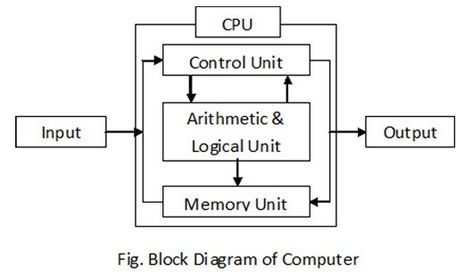
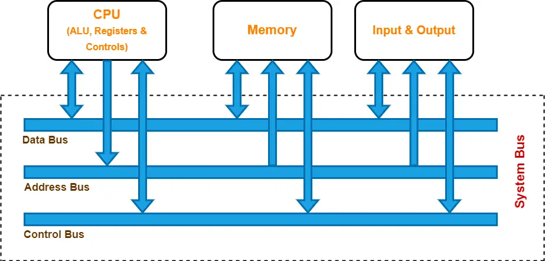
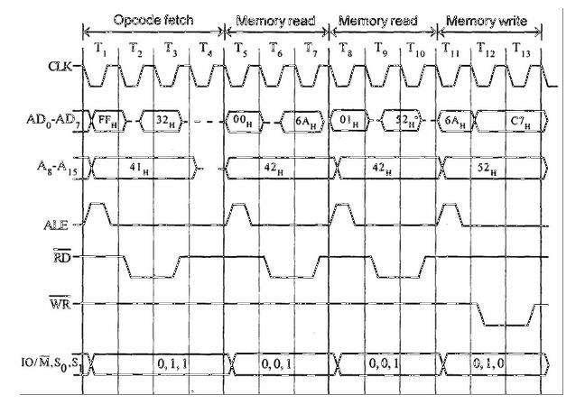
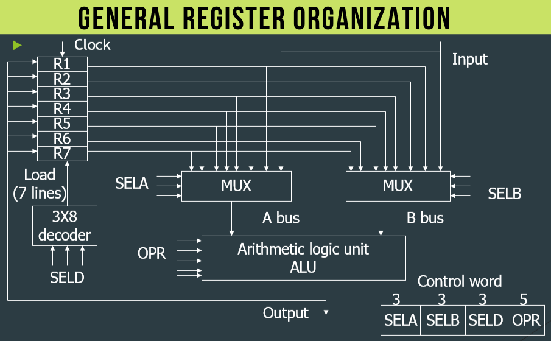
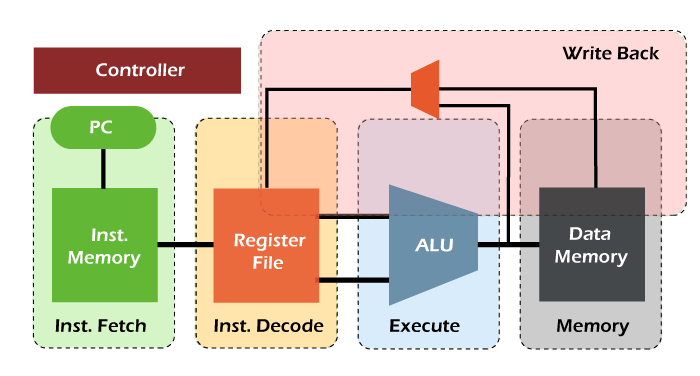
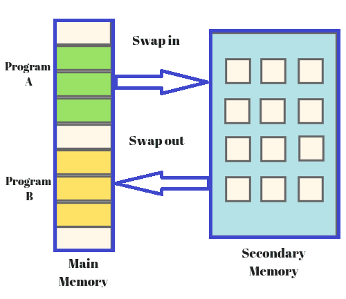

# Computer Organization and Architecture

## 1) Convert 45(decimal) into octal, hexadecimal and binary.

To convert the decimal number 45 into octal, hexadecimal, and binary:

1. **Octal (Base 8):**
   - Divide 45 by 8: 45 ÷ 8 = 5 with a remainder of 5.
   - Divide 5 by 8: 5 ÷ 8 = 0 with a remainder of 5.
   - The remainders, read from bottom to top, are 55 in octal.
   - So, 45(decimal) = 55(octal).
2. **Hexadecimal (Base 16):**
   - Divide 45 by 16: 45 ÷ 16 = 2 with a remainder of 13 (D in hexadecimal).
   - The hexadecimal equivalent of 13 is D.
   - The quotient from the division, which is 2, is less than 16, so we stop.
   - So, 45(decimal) = 2D(hexadecimal).
3. **Binary (Base 2):**
   - To convert to binary, we can repeatedly divide by 2 and keep track of the remainders.
   - Divide 45 by 2: 45 ÷ 2 = 22 with a remainder of 1.
   - Divide 22 by 2: 22 ÷ 2 = 11 with a remainder of 0.
   - Divide 11 by 2: 11 ÷ 2 = 5 with a remainder of 1.
   - Divide 5 by 2: 5 ÷ 2 = 2 with a remainder of 1.
   - Divide 2 by 2: 2 ÷ 2 = 1 with a remainder of 0.
   - The binary representation, read from bottom to top, is 101101.
   - So, 45(decimal) = 101101(binary).

Therefore, 45 in different number systems is:

- Octal: 55
- Hexadecimal: 2D
- Binary: 101101

## 2) Explain block diagram of computer.

The block diagram of a computer represents the major components or subsystems that make up a computer system and how they interact. Here is a basic explanation of the key components typically found in a computer's block diagram:



1. **Input Devices:** These devices allow users to input data and instructions into the computer. Examples include keyboards, mice, scanners, and microphones.
2. **Central Processing Unit (CPU):** The CPU is often considered the brain of the computer. It performs arithmetic, logical, control, and input/output operations specified by the instructions in the program.
3. **Memory:** Memory is used to store data and instructions that the CPU needs to access quickly. It is divided into two main types: primary memory (RAM) and secondary memory (like hard drives and SSDs).
4. **Arithmetic Logic Unit (ALU):** The ALU is a component of the CPU that performs arithmetic and logical operations, such as addition, subtraction, AND, OR, and NOT operations.
5. **Control Unit:** The control unit coordinates the activities of the CPU, memory, and input/output devices. It fetches instructions from memory, decodes them, and executes them.
6. **Registers:** Registers are small, high-speed storage locations within the CPU used to temporarily hold data and instructions during processing.
7. **Bus:** The bus is a communication system that allows data to be transferred between the CPU, memory, and input/output devices. It consists of multiple lines for different types of data transfer (e.g., address bus, data bus, control bus).
8. **Output Devices:** Output devices display or present data processed by the computer. Examples include monitors, printers, and speakers.
9. **Secondary Storage:** This includes devices like hard drives, SSDs, and optical drives, which provide long-term storage for data and programs.
10. **System Interconnection:** This includes various buses and pathways that allow the components of the computer to communicate with each other.

The block diagram of a computer provides a high-level overview of how these components are interconnected and work together to process data and perform tasks.

## 3) Explain Flynn’s classification of Computer Architecture.

Flynn's Taxonomy is a well-known classification of computer architectures proposed by Michael J. Flynn in 1966. It is based on two main factors: the number of data streams (or instruction streams) being processed and the number of processors (or execution units) involved in the processing. The taxonomy originally consisted of four categories, but was later expanded to include additional categories.

1. **Single Instruction, Single Data (SISD)**: In this architecture, there is a single instruction stream and a single data stream, and they are processed by a single processor. This is the simplest and most common type of computer architecture, found in most personal computers and smartphones.
2. **Single Instruction, Multiple Data (SIMD)**: In this architecture, there is a single instruction stream, but multiple data streams are processed simultaneously by multiple processors or execution units. This architecture is often used in applications that involve large amounts of data, such as image and video processing, and scientific simulations.
3. **Multiple Instruction, Single Data (MISD)**: In this architecture, there are multiple instruction streams, but only a single data stream is processed. This architecture is not commonly used, as it is difficult to implement and has limited practical applications.
4. **Multiple Instruction, Multiple Data (MIMD)**: In this architecture, there are multiple instruction streams and multiple data streams, and they are processed by multiple processors or execution units. This architecture is often used in high-performance computing, such as supercomputers and large-scale data centers.
5. **Single Instruction, Multiple Thread (SIMT)**: This is a variation of SIMD, where each execution unit can process a different thread of the same instruction. This architecture is often used in graphics processing units (GPUs).
6. **Multiple Instruction, Multiple Thread (MIMT)**: This is a combination of MIMD and SIMT, where each processor can process multiple threads of different instructions. This architecture is often used in hybrid CPU-GPU systems.

Flynn's Taxonomy provides a useful framework for understanding and comparing the different types of computer architectures and their performance characteristics. However, it is important to note that modern computer systems often incorporate elements of multiple categories, and the taxonomy does not account for other factors that can affect performance, such as memory hierarchy and cache coherence.

## 4) Explain Flynn’s classification based on instruction and data stream.

Flynn's classification is a taxonomy used to categorize computer architectures based on the number of instruction streams (I) and data streams (D) that can be processed concurrently. There are four categories in Flynn's classification:

1. **Single Instruction, Single Data (SISD):**
   - In SISD architecture, a single instruction stream operates on a single data stream.
   - This is the traditional von Neumann architecture where a single processor fetches instructions from memory and operates on data sequentially.
   - Most conventional computers, including desktops and laptops, fall into this category.
2. **Single Instruction, Multiple Data (SIMD):**
   - In SIMD architecture, a single instruction stream is applied to multiple data streams simultaneously.
   - This architecture is often used in parallel processing for tasks like image processing, where the same operation is performed on multiple pixels simultaneously.
   - GPUs (Graphics Processing Units) often use SIMD architecture to process graphics data efficiently.
3. **Multiple Instruction, Single Data (MISD):**
   - In MISD architecture, multiple instruction streams operate on a single data stream.
   - While theoretically possible, this architecture is not commonly found in practical implementations due to its complexity and limited real-world applications.
   - One example could be a fault-tolerant system where multiple algorithms are applied to the same data stream to detect errors.
4. **Multiple Instruction, Multiple Data (MIMD):**
   - In MIMD architecture, multiple instruction streams operate on multiple data streams independently.
   - This is the most common architecture for parallel computing, where each processor executes its own set of instructions on its own data.
   - Clusters of computers, distributed systems, and modern multi-core processors fall into this category.

Flynn's classification provides a conceptual framework for understanding different parallel processing architectures based on how instructions and data are processed.

## 5) Explain the difference between Von Neumann and Harvard Architecture.

Von Neumann Architecture and Harvard Architecture are two fundamental designs for computers. Here's how they differ:

1. **Von Neumann Architecture:**
   - **Memory:** Uses a single memory unit to store both data and instructions.
   - **Data and Instructions:** Data and instructions are stored in the same memory space and accessed using the same bus system.
   - **Execution:** Instructions are fetched from memory, decoded, and executed sequentially.
   - **Control Unit:** The control unit manages the flow of data and instructions between the CPU, memory, and input/output devices.
   - **Example:** Most modern computers, including personal computers and servers, use the Von Neumann architecture.
2. **Harvard Architecture:**
   - **Memory:** Uses separate memory units for storing instructions and data.
   - **Data and Instructions:** Instructions and data are stored in separate memory spaces and accessed using separate bus systems.
   - **Execution:** Allows for parallel fetching of instructions and data, which can lead to faster execution of programs.
   - **Control Unit:** The control unit is more complex compared to Von Neumann architecture, as it needs to manage two separate memory systems.
   - **Example:** Often used in embedded systems, digital signal processors (DSPs), and some microcontrollers.

In summary, the key difference between Von Neumann and Harvard Architecture lies in how they handle memory: Von Neumann architecture uses a single memory space for both data and instructions, while Harvard architecture uses separate memory spaces for data and instructions.

## 6) Explain Amdahl’s law and derive speedup equation.

Amdahl's Law is a principle in parallel computing that describes the potential speedup in executing a task using multiple processors. It was formulated by computer architect Gene Amdahl in 1967. The law states that the speedup of a program using multiple processors in parallel computing is limited by the sequential portion of the program.

Amdahl's Law is typically expressed using the following equation:

$$
\text{Speedup} = \frac{1}{(1 - P) + \frac{P}{S}}
$$

Where:

- $\text{Speedup}$ is the theoretical speedup of the execution of the whole task.
- $P$ is the fraction of the task that can be parallelized (ranging from 0 to 1).
- $S$ is the speedup achieved by the parallelized portion of the task.

The equation can also be written as:

$\text{Speedup} = \frac{1}{(1 - P) + \frac{P}{N}}$

Where $N$ is the number of processors.

Amdahl's Law highlights the importance of identifying and optimizing the sequential parts of a program, as they can severely limit the overall speedup achievable through parallelization.

## 7) How are numbers represented in computer system? Explain any number representation in detail.

Numbers are represented in a computer system using binary digits (bits), which can have a value of either 0 or 1. There are several ways to represent numbers in binary, including fixed-point, floating-point, and signed and unsigned integers. In this answer, I will explain the signed integer representation in detail.

Signed integers are used to represent both positive and negative integers in a computer system. The most common way to represent signed integers is by using the two's complement representation. In this representation, the most significant bit (MSB) of the binary number is used as a sign bit, with 0 indicating a positive number and 1 indicating a negative number.

To convert a positive binary number into its two's complement representation, we simply leave the number unchanged. For example, the decimal number 5 is represented as 0101 in binary, and its two's complement representation is also 0101.

To convert a negative binary number into its two's complement representation, we first take the one's complement of the number by flipping all the bits (i.e., changing 0s to 1s and 1s to 0s). Then, we add 1 to the result. For example, the decimal number -5 is represented as 1011 in binary. Its one's complement is 0100, and its two's complement is 0101 + 1 = 0110.

The range of values that can be represented using a signed integer depends on the number of bits used to represent the number. For example, an 8-bit signed integer can represent values in the range of -128 to 127, while a 32-bit signed integer can represent values in the range of -2^31 to (2^31 - 1).

In summary, signed integers are used to represent both positive and negative integers in a computer system. The two's complement representation is the most common way to represent signed integers, where the most significant bit is used as a sign bit and the remaining bits are used to represent the magnitude of the number. The range of values that can be represented using a signed integer depends on the number of bits used to represent the number.

## 8) CALCULATE CPI AND MIPS FOR CPU WITH 200 MHZ FREQUENCY WHICH IS EXECUTING A BENCHMARK PROGRAM WITH FOLLOWING INSTRUCTION MIX.

| INSTRUCTION CATEGORY | PERCENTAGE OF OCCURRENCE | NO. OF CYCLES PER INSTRUCTION |
| -------------------- | ------------------------ | ----------------------------- |
| ALU                  | 38                       | 1                             |
| LOAD AND STORE       | 15                       | 3                             |
| BRANCH               | 42                       | 4                             |
| OTHERS               | 5                        | 5                             |

To calculate the CPI (Cycles Per Instruction) and MIPS (Million Instructions Per Second) for the given CPU, we first need to find the weighted average of the number of cycles per instruction for each instruction category.

The weighted average can be calculated using the following formula:

CPI = (P1 \* C1) + (P2 \* C2) + (P3 \* C3) + (P4 \* C4)

where P1, P2, P3, and P4 are the percentages of occurrence for each instruction category, and C1, C2, C3, and C4 are the number of cycles per instruction for each category.

Substituting the given values into the formula, we get:

CPI = (0.38 \* 1) + (0.15 \* 3) + (0.42 \* 4) + (0.05 \* 5)
CPI = 0.38 + 0.45 + 1.68 + 0.25
CPI = 2.76

Now that we have the CPI, we can calculate the MIPS using the following formula:

MIPS = (Clock frequency / CPI) / 1,000,000

Substituting the given clock frequency of 200 MHz and the calculated CPI of 2.76, we get:

MIPS = (200,000,000 / 2.76) / 1,000,000
MIPS = 72,463,768 / 1,000,000
MIPS = 72.46

Therefore, the CPI for the given CPU is 2.76, and the MIPS is approximately 72.46.

## 9) Explain bus architecture and explain 3 types of buses with diagram.

Bus architecture in a computer system refers to the arrangement of various buses that connect the CPU, memory, and input/output devices. Buses are communication channels used to transfer data and instructions between different components of the computer. There are three main types of buses in a typical computer system:

1. **Address Bus:** The address bus is used to specify the memory locations for read or write operations. It carries the address of the memory location or I/O port being accessed. The width of the address bus determines the maximum memory capacity that can be addressed. For example, a 32-bit address bus can address up to 2^32 (or 4 GB) of memory locations.
2. **Data Bus:** The data bus is used to transfer data between the CPU, memory, and I/O devices. It carries the actual data being read from or written to memory or I/O devices. The width of the data bus determines the amount of data that can be transferred in a single bus cycle. Common widths include 8-bit, 16-bit, 32-bit, and 64-bit data buses.
3. **Control Bus:** The control bus carries control signals that coordinate the activities of different components of the computer system. It includes signals such as read/write signals, interrupt signals, clock signals, and bus arbitration signals. These signals are used to manage the flow of data and control the timing of operations.

Here is a diagram illustrating the bus architecture of a typical computer system:



In this diagram, the CPU is connected to the memory and I/O devices through the address bus, data bus, and control bus. The address bus is used to specify the memory locations, the data bus is used to transfer data, and the control bus is used to manage the flow of data and control signals.

## 10) Explain registers and their types.

Registers are small, high-speed storage locations within the CPU that hold data and instructions that are currently being used by the CPU. They are the fastest storage locations in a computer and are used to store data temporarily during processing. Registers are crucial for the efficient operation of the CPU because they allow for quick access to data and instructions needed for processing.

Types of Registers:

1. **Program Counter (PC):** The program counter is a special-purpose register that holds the memory address of the next instruction to be fetched and executed.
2. **Instruction Register (IR):** The instruction register holds the current instruction being executed by the CPU. It is used to decode the instruction and determine the operation to be performed.
3. **Memory Address Register (MAR):** The memory address register holds the memory address of the data or instruction to be fetched from or stored into memory.
4. **Memory Data Register (MDR):** The memory data register holds the data read from or written to memory. It acts as a buffer between the CPU and memory.
5. **Accumulator (ACC):** The accumulator is a general-purpose register used for arithmetic and logic operations. It holds the results of these operations temporarily.
6. **Index Registers:** Index registers are used for indexing operations, such as accessing elements in an array. They hold the index value used to calculate the memory address of the data.
7. **Stack Pointer (SP):** The stack pointer is used to manage the stack in memory. It points to the top of the stack and is used to push and pop data onto and from the stack.
8. **Condition Code Register (CCR):** The condition code register holds various condition flags that indicate the result of arithmetic and logic operations, such as zero, negative, carry, and overflow flags.

These registers work together to facilitate the execution of instructions by the CPU. They provide temporary storage for data and instructions and help in managing the flow of data between the CPU and memory.

## 11) Explain Types of registers in 8085.

The 8085 microprocessor is an 8-bit microprocessor that uses a variety of registers to store and manipulate data. The following are the different types of registers in the 8085 microprocessor:

1. **General-purpose registers (GPRs)**: The 8085 microprocessor has six general-purpose registers, each of which is 8-bits wide. These registers are named B, C, D, E, H, and L. They can be used to store data temporarily, perform arithmetic and logical operations, and hold memory addresses.
2. **Accumulator (A)**: The accumulator is an 8-bit register that is used for most of the arithmetic and logical operations in the 8085 microprocessor. It is also used to store the results of these operations.
3. **Flag register**: The flag register is an 8-bit register that is used to store the results of various arithmetic, logical, and other operations performed by the 8085 microprocessor. It contains five flags that are used to indicate the status of the operation: Carry (C), Zero (Z), Sign (S), Parity (P), and Auxiliary Carry (AC).
4. **Program counter (PC)**: The program counter is a 16-bit register that is used to store the memory address of the next instruction to be executed by the 8085 microprocessor.
5. **Stack pointer (SP)**: The stack pointer is an 8-bit register that is used to point to the top of the stack in memory. The stack is a reserved area of memory that is used to store data temporarily during the execution of a program.
6. **Instruction register (IR)**: The instruction register is an 8-bit register that is used to temporarily store the instruction that is being executed by the 8085 microprocessor.
7. **Memory address register (MAR)**: The memory address register is a 16-bit register that is used to store the memory address of the data that is being read from or written to memory.
8. **Memory buffer register (MBR)**: The memory buffer register is an 8-bit register that is used to temporarily store the data that is being read from or written to memory.

These registers are used in conjunction with each other to perform various operations in the 8085 microprocessor. The use of registers allows the microprocessor to access data quickly and efficiently, which is essential for the performance of the system.

## 12) What are the different types of control lines used in computer? Explain its functions.

Control lines are used in a computer system to synchronize and control the flow of data between different components such as the CPU, memory, and I/O devices. The following are the different types of control lines used in a computer system and their functions:

1. **Address lines**: These are used to specify the memory address or I/O device address that the CPU wants to access. The number of address lines determines the maximum amount of memory that the CPU can address.
2. **Data lines**: These are used to transfer data between the CPU, memory, and I/O devices. The number of data lines determines the size of the data bus and the amount of data that can be transferred at a time.
3. **Read/Write (R/W) line**: This is used to indicate whether the CPU is performing a read operation or a write operation. A high signal on the R/W line indicates a read operation, while a low signal indicates a write operation.
4. **Clock (CLK) line**: This is used to synchronize the operations of different components in the computer system. The clock signal is generated by a quartz crystal oscillator and is used to control the timing of the CPU, memory, and I/O devices.
5. **Interrupt request (IRQ) line**: This is used by I/O devices to request the attention of the CPU. The CPU can then temporarily suspend its current task and service the interrupt request.
6. **Reset (RST) line**: This is used to reset the computer system to its initial state. The reset signal is usually generated by a push-button switch or a power-on reset circuit.
7. **Chip select (CS) line**: This is used to select a particular chip or device in the computer system. Each chip or device has a unique chip select signal that is used to enable or disable its operation.
8. **Enable/Disable (E/D) line**: This is used to enable or disable the operation of a particular chip or device in the computer system. A high signal on the E/D line indicates that the chip or device is enabled, while a low signal indicates that it is disabled.

These control lines are essential for the proper operation of a computer system. They allow the CPU to access memory and I/O devices, transfer data between different components, and synchronize the operations of different components.

## 13) Compare RISC and CISC.

RISC (Reduced Instruction Set Computing) and CISC (Complex Instruction Set Computing) are two contrasting CPU design philosophies. Here's a comparison between the two:

1. **Instruction Set:**
   - **RISC:** RISC processors have a reduced set of simple and basic instructions. Instructions are typically fixed length and execute in one clock cycle.
   - **CISC:** CISC processors have a complex and varied set of instructions, including multi-step operations that can take several clock cycles to execute.
2. **Instruction Execution:**
   - **RISC:** RISC processors emphasize a simple instruction pipeline, often with a load-store architecture where data is moved between memory and registers before being operated on.
   - **CISC:** CISC processors can have more complex pipelines and may execute multi-step instructions directly from memory.
3. **Registers:**
   - **RISC:** RISC processors typically have a larger number of general-purpose registers, which are used to store intermediate results and operands.
   - **CISC:** CISC processors may have fewer registers, and some instructions may operate directly on memory locations.
4. **Memory Access:**
   - **RISC:** RISC processors often use load-store architecture, which means that only load and store instructions can access memory.
   - **CISC:** CISC processors allow memory access directly by certain instructions, reducing the need for moving data between registers and memory.
5. **Pipelining and Superscalar Execution:**
   - **RISC:** RISC processors are more amenable to pipelining and superscalar execution due to their simpler instructions and pipeline structures.
   - **CISC:** CISC processors can also implement pipelining and superscalar execution, but the complexity of the instructions and pipelines can make it more challenging.
6. **Code Size and Performance:**
   - **RISC:** RISC code tends to be more compact due to the simple instructions, which can lead to better performance in terms of instruction cache usage and instruction fetch.
   - **CISC:** CISC code can be more complex and larger, but the variety of instructions can sometimes lead to more efficient execution of certain tasks.

In summary, RISC processors prioritize simplicity and efficiency in instruction execution, while CISC processors aim to provide a wide variety of complex instructions to handle a broader range of tasks. The choice between RISC and CISC often depends on the specific requirements of the application and the trade-offs between simplicity and complexity in CPU design.

## 14) Explain different types of Addressing modes with diagram.

Addressing modes in computer architecture define how the CPU accesses operands for an instruction. There are several types of addressing modes, each with its own way of specifying operands. Here are some common addressing modes:

1. **Immediate Addressing:** The operand is specified directly in the instruction. For example, `MOV AX, 5` moves the immediate value 5 into the AX register.

   

2. **Register Addressing:** The operand is specified by a register. For example, `MOV AX, BX` moves the contents of register BX into register AX.

   

3. **Direct Addressing:** The operand is specified by a memory address. For example, `MOV AX, [1234]` moves the contents of memory location 1234 into register AX.

   

4. **Indirect Addressing:** The operand is a memory address stored in a register. For example, `MOV AX, [BX]` moves the contents of the memory address stored in register BX into register AX.
5. **Indexed Addressing:** The operand is a memory address calculated by adding an index value to a base address. For example, `MOV AX, [BX+SI]` moves the contents of the memory address calculated by adding the contents of registers BX and SI into register AX.
6. **Relative Addressing:** The operand is a memory address calculated relative to the current instruction pointer or program counter. For example, `JMP label` jumps to the memory address specified by the label.
7. **Stack Addressing:** The operand is implicitly specified by the top of the stack. For example, `PUSH AX` pushes the contents of register AX onto the stack.

Each addressing mode offers a different way to access operands, providing flexibility and efficiency in executing instructions.

## 15) Explain different types of Addressing modes of 8085 in detail.

The 8085 microprocessor supports several addressing modes that are used to access data stored in memory. The following are the different types of addressing modes supported by the 8085 microprocessor and their functions:

1. **Direct Addressing Mode**: In this mode, the 16-bit address of the memory location to be accessed is specified in the instruction itself. This mode is used when the memory location to be accessed is fixed and does not change during the execution of the program.
2. **Register Addressing Mode**: In this mode, the data to be accessed is stored in one of the registers of the 8085 microprocessor. The instruction specifies the register to be used. This mode is used when the data to be accessed is stored in a register and does not need to be accessed from memory.
3. **Immediate Addressing Mode**: In this mode, the data to be used in the operation is specified in the instruction itself. This mode is used when the data to be used in the operation is a constant and does not need to be accessed from memory.
4. **Implied Addressing Mode**: In this mode, the data to be used in the operation is implied by the instruction itself. This mode is used when the data to be used in the operation is a fixed value and does not need to be accessed from memory.
5. **Indexed Addressing Mode**: In this mode, the address of the memory location to be accessed is calculated by adding the contents of a register (called the index register) to a base address specified in the instruction. This mode is used when the memory location to be accessed is not fixed and changes during the execution of the program.
6. **Relative Addressing Mode**: In this mode, the address of the memory location to be accessed is calculated by adding a signed offset specified in the instruction to the program counter (PC). This mode is used for branching and looping operations in the program.
7. **Indirect Addressing Mode**: In this mode, the address of the memory location to be accessed is stored in a pair of registers (called the pointer registers). The instruction specifies the pointer registers to be used. This mode is used when the memory location to be accessed is not fixed and changes during the execution of the program.

These addressing modes are essential for the proper operation of the 8085 microprocessor. They allow the microprocessor to access data stored in memory, perform operations on the data, and make decisions based on the results of the operations.

## 16) Explain block diagram of 8085 microprocessor.

The block diagram of the 8085 microprocessor shows the organization of its various functional units and how they are interconnected. Here's a brief explanation of the key components in the block diagram of the 8085 microprocessor:

1. **Arithmetic and Logic Unit (ALU):** The ALU performs arithmetic and logical operations on data. It includes various registers like the accumulator, general-purpose registers, and temporary registers.
2. **Registers:** The 8085 microprocessor has several registers, including the accumulator (A), general-purpose registers (B, C, D, E, H, and L), and special-purpose registers (program counter, stack pointer, and flag register).
3. **Control Unit:** The control unit coordinates the operations of the microprocessor by generating control signals to manage the flow of data and instructions between different units.
4. **Instruction Register and Decoder:** The instruction register holds the current instruction being executed, and the decoder interprets the instruction and generates control signals.
5. **Timing and Control Unit:** This unit generates the timing signals required for various operations and controls the sequencing of operations.
6. **Interrupt Control:** The interrupt control unit manages interrupts from external devices and controls the response of the microprocessor to interrupts.
7. **Address and Data Bus:** The address bus carries the memory address of the data being accessed, while the data bus carries the actual data being read from or written to memory or I/O devices.
8. **Memory and I/O Interface:** This interface allows the microprocessor to communicate with external memory and I/O devices.
9. **Clock Generator:** The clock generator generates the clock signal required for the operation of the microprocessor.
10. **Reset Circuit:** The reset circuit initializes the microprocessor when it is powered on or when a reset signal is received.

Here is a simplified block diagram of the 8085 microprocessor:


This block diagram illustrates the major components of the 8085 microprocessor and their interconnections.

## 17) Define flag register and explain 5 flags.

The flag register, also known as the status register, is a special-purpose register in a computer's CPU that contains several individual flags, each of which indicates a particular condition resulting from the execution of an instruction. These flags are used by the CPU to make decisions during program execution and to control the flow of instructions. Here are five commonly used flags:

1. **Zero Flag (Z):** The Zero flag is set (1) if the result of an operation is zero. It is cleared (0) if the result is non-zero. This flag is used to test whether the result of an operation is zero.
2. **Sign Flag (S):** The Sign flag is set (1) if the result of an operation is negative (i.e., the most significant bit is 1). It is cleared (0) if the result is positive. This flag is used to test the sign of a result.
3. **Carry Flag (C):** The Carry flag is set (1) if an arithmetic operation generates a carry out of the most significant bit. It is also used in logical operations to indicate that a carry occurred. This flag is used to handle operations that involve values larger than the register size.
4. **Overflow Flag (V or O):** The Overflow flag is set (1) if an arithmetic operation results in an overflow, meaning the result is too large to be represented in the available number of bits. It is used to detect errors in signed arithmetic operations.
5. **Parity Flag (P):** The Parity flag is set (1) if the number of set bits (1s) in the result of an operation is even. It is cleared (0) if the number of set bits is odd. This flag is used for error checking and parity calculations.

These flags are typically modified automatically by the CPU during arithmetic, logical, and comparison operations. Programmers can test these flags using conditional branch instructions to control program flow based on the outcome of previous operations.

## 18) Design the timing diagram for STA 526A. opcode for STA= 32H.

To design a timing diagram for the STA 526A instruction (opcode 32H) in the context of the 8085 microprocessor, we need to consider the various stages of the instruction execution. Here's a general timing diagram for the STA instruction:

1. **T1 (Opcode Fetch):** During T1, the opcode (32H) is fetched from memory and placed on the data bus.
2. **T2 (Memory Address Fetch):** The 16-bit memory address is fetched from the next two memory locations (LSB first) and stored in the memory address register (MAR).
3. **T3 (Memory Write):** The contents of the accumulator (A register) are placed on the data bus. The control signals are activated to write the data from the accumulator to the memory location specified by the MAR.



In this diagram, ALE (Address Latch Enable) is used to latch the lower byte of the memory address during T2. RD (Read) and WR (Write) are used to control the data transfer to and from memory. IO/M (Input/Output Memory) indicates whether the current operation is a memory or I/O operation. MREQ (Memory Request) is activated to indicate a memory access operation.

## 19) Explain 0 address, 1 address, 2 address, 3 address instructions with x= (A*B) + (C*D) example.

In computer architecture, instructions can be classified based on the number of operands they have. The operands can be either memory locations or registers. The following are the different types of instructions based on the number of operands and their explanation with the example of x = (A \* B) + (C \* D):

1. **0-address instruction**: In this type of instruction, the operands are implicit and are not specified in the instruction. The instruction only specifies the operation to be performed. For example, the instruction to load the accumulator with a constant value is a 0-address instruction.

Example: In the case of x = (A \* B) + (C \* D), there is no 0-address instruction as all the operands are explicitly specified.

1. **1-address instruction**: In this type of instruction, one of the operands is specified in the instruction, and the other operand is implicit. The instruction specifies both the operation to be performed and the location of one of the operands. For example, the instruction to add the contents of a memory location to the accumulator is a 1-address instruction.

Example: In the case of x = (A \* B) + (C \* D), a 1-address instruction can be used to store the result in the memory location x. The instruction would specify the operation to be performed (store) and the location of the result (x).

1. **2-address instruction**: In this type of instruction, both the operands are specified in the instruction, and the result is stored in one of the operands. The instruction specifies the operation to be performed and the location of both the operands. For example, the instruction to add the contents of two memory locations and store the result in one of the memory locations is a 2-address instruction.

Example: In the case of x = (A \* B) + (C \* D), a 2-address instruction can be used to perform the multiplication operations. The instruction would specify the operation to be performed (multiply) and the location of both the operands (A and B for the first multiplication, and C and D for the second multiplication).

1. **3-address instruction**: In this type of instruction, all three operands are specified in the instruction, and the result is stored in one of the operands. The instruction specifies the operation to be performed and the location of all three operands. For example, the instruction to add the contents of two memory locations and store the result in a third memory location is a 3-address instruction.

Example: In the case of x = (A \* B) + (C \* D), a 3-address instruction can be used to perform the final addition operation. The instruction would specify the operation to be performed (add) and the location of all three operands (the result of the first multiplication, the result of the second multiplication, and the memory location x where the result is to be stored).

## 20) Explain instructions-PUSH, ADD, JMP, AND, LDA.

Here are the explanations of the instructions PUSH, ADD, JMP, AND, and LDA:

1. **PUSH**: The PUSH instruction is used to push a value onto the stack. The stack is a data structure that allows you to add and remove data in a last-in, first-out (LIFO) manner. The PUSH instruction typically takes one operand, which is the value to be pushed onto the stack.

Example: PUSH AX (push the contents of the AX register onto the stack)

1. **ADD**: The ADD instruction is used to add two values and store the result in a register or memory location. The ADD instruction typically takes two operands, which are the values to be added, and a third operand, which is the destination register or memory location where the result is to be stored.

Example: ADD AX, BX (add the contents of the BX register to the contents of the AX register and store the result in the AX register)

1. **JMP**: The JMP instruction is used to jump to a specific memory location or label in the program. The JMP instruction typically takes one operand, which is the memory location or label to jump to.

Example: JMP label (jump to the label named "label")

1. **AND**: The AND instruction is used to perform a bitwise AND operation on two values and store the result in a register or memory location. The AND instruction typically takes two operands, which are the values to be ANDed, and a third operand, which is the destination register or memory location where the result is to be stored.

Example: AND AL, 0FH (perform a bitwise AND operation on the contents of the AL register and the hexadecimal value 0FH and store the result in the AL register)

1. **LDA**: The LDA instruction is used to load a value into a register from a memory location. The LDA instruction typically takes one operand, which is the memory location to be loaded, and a second operand, which is the destination register where the value is to be stored.

Example: LDA AX, [BX] (load the contents of the memory location pointed to by the BX register into the AX register)

## 21) Explain memory system in detail.

The memory system of a computer is a critical component that stores data and instructions necessary for the operation of the CPU. It consists of several levels of memory, each with its own characteristics and purposes. Here's a detailed explanation of the memory system:

1. **Primary Memory (Main Memory):**
   - **RAM (Random Access Memory):** Main memory in a computer is typically made up of RAM. RAM is volatile memory, meaning it loses its contents when the power is turned off. It is used to store data and instructions that are currently being processed by the CPU.
   - **ROM (Read-Only Memory):** ROM is non-volatile memory that stores firmware and bootstrap programs. It is used to hold instructions that are essential for the computer to boot up, such as the BIOS (Basic Input/Output System).
2. **Cache Memory:**
   - Cache memory is a small, high-speed memory located on the CPU or between the CPU and main memory. It stores frequently accessed data and instructions to reduce the average time taken to access memory.
3. **Secondary Storage:**
   - Secondary storage devices, such as hard disk drives (HDDs) and solid-state drives (SSDs), provide long-term, non-volatile storage for data and programs. They are slower than primary memory but offer much larger storage capacities.
4. **Virtual Memory:**
   - Virtual memory is a memory management technique that uses secondary storage to simulate additional main memory. It allows the computer to run programs larger than its physical memory capacity by transferring data between RAM and disk storage as needed.
5. **Memory Hierarchy:**
   - The memory system is organized in a hierarchy, with different levels of memory offering varying speeds and capacities. The hierarchy is designed to provide the CPU with fast access to the most frequently used data and instructions while still offering large storage capacities for less frequently used data.
6. **Memory Access:**
   - The CPU accesses memory using addresses. Each byte in memory has a unique address, and the CPU uses these addresses to read or write data and instructions. Memory access times vary depending on the type of memory and its location in the memory hierarchy.
7. **Memory Management:**
   - Memory management is the process of controlling and coordinating computer memory, assigning portions of memory to different programs and ensuring that they do not interfere with each other. This includes techniques such as virtual memory management, caching, and memory protection.
8. **Memory Performance:**
   - Memory performance is measured by metrics such as latency (the time taken to access a specific piece of data) and bandwidth (the rate at which data can be transferred to and from memory). Improving memory performance often involves balancing trade-offs between speed, cost, and capacity.

Overall, the memory system of a computer is a complex and critical component that plays a crucial role in the performance and functionality of the system.

## 22) Difference between Register Stack and Memory Stack.

Register Stack and Memory Stack are two different concepts in computer architecture, primarily related to how data is stored and accessed in a stack-based system. Here are the key differences between them:

1. **Location of Storage:**
   - **Register Stack:** Register stack uses registers within the CPU to store stack elements. These registers are typically dedicated for stack operations.
   - **Memory Stack:** Memory stack uses memory locations (RAM) to store stack elements. It typically uses a specific region of memory allocated for the stack.
2. **Access Speed:**
   - **Register Stack:** Register stack operations are usually faster than memory stack operations since registers are located within the CPU and have very fast access times.
   - **Memory Stack:** Memory stack operations are relatively slower compared to register stack operations due to the latency involved in accessing memory.
3. **Size Limitations:**
   - **Register Stack:** Register stack is limited by the number of registers available in the CPU. The size of the register stack is fixed and cannot be easily increased.
   - **Memory Stack:** Memory stack can grow or shrink dynamically based on the memory available in the system. It is limited by the amount of memory allocated for the stack.
4. **Number of Stacks:**
   - **Register Stack:** Typically, there is only one register stack available in a CPU, although some architectures may support multiple register stacks.
   - **Memory Stack:** It is possible to have multiple memory stacks in a system, each with its own dedicated region of memory.
5. **Usage and Purpose:**
   - **Register Stack:** Register stack is often used for fast storage and retrieval of temporary data and for supporting function calls and returns in the CPU.
   - **Memory Stack:** Memory stack is used for storing local variables, function call information, and managing program flow (e.g., storing return addresses) in high-level programming languages.

In summary, register stack and memory stack differ in terms of their location, access speed, size limitations, the number of stacks supported, and their usage in computer systems. Both types of stacks play important roles in supporting different aspects of program execution and memory management.

## 23) Explain instruction execution cycle with timing diagram or flow chart.

The instruction execution cycle, also known as the instruction cycle or fetch-execute cycle, is the basic operation performed by a CPU to execute instructions. It consists of several steps that are repeated for each instruction. Here's an explanation of the instruction execution cycle along with a basic flowchart:

1. **Fetch:** The CPU fetches the next instruction from memory. The address of the next instruction is usually stored in a special-purpose register called the Program Counter (PC).
2. **Decode:** The fetched instruction is decoded to determine the operation to be performed and the operands involved.
3. **Execute:** The CPU executes the decoded instruction, which may involve arithmetic or logic operations, data movement, or control transfer.
4. **Write Back:** If the instruction results in a value that needs to be stored, such as the result of an arithmetic operation, the CPU writes this value back to the appropriate location (e.g., a register or memory).

Here is a basic flowchart illustrating the instruction execution cycle:


COA%205de7ab6fa6fa4139874561841e6e520f/Untitled%201.png
In the fetch stage, the CPU uses the address in the Program Counter to fetch the instruction from memory. In the decode stage, the CPU decodes the fetched instruction to determine the operation to be performed. In the execute stage, the CPU performs the operation specified by the instruction. Finally, in the write-back stage, the CPU writes the result of the operation back to the appropriate location.

This cycle repeats for each instruction in the program, allowing the CPU to execute a sequence of instructions to perform complex tasks.

## 24) Explain types of instruction format.

Instruction formats define the layout and structure of instructions in a computer architecture. Different types of instruction formats are used based on the design of the CPU. Here are the common types of instruction formats:

1. **Register-Memory:**
   - This format uses one part of the instruction to specify a register operand and another part to specify a memory operand.
   - Example: `ADD R1, 100` (Add the contents of register R1 with the value stored at memory location 100).
2. **Register-Register:**
   - This format uses registers for both operands.
   - Example: `ADD R1, R2` (Add the contents of registers R1 and R2).
3. **Register-Immediate:**
   - This format uses a register for one operand and an immediate value for the other operand.
   - Example: `MOV R1, 10` (Move the value 10 into register R1).
4. **Memory-Memory:**
   - This format uses memory addresses for both operands.
   - Example: `MOVE 100, 200` (Move the contents of memory location 100 to memory location 200).
5. **Stack:**
   - This format uses a stack for operand storage and retrieval.
   - Example: `PUSH R1` (Push the contents of register R1 onto the stack).
6. **Indexed:**
   - This format uses an index register and a displacement to access memory.
   - Example: `MOV R1, [R2+10]` (Move the contents of memory location pointed by R2 + 10 into register R1).
7. **Indirect:**
   - This format uses indirect addressing, where the address of the operand is stored in a register or memory location.
   - Example: `MOV R1, [R2]` (Move the contents of memory location pointed by R2 into register R1).
8. **Control Transfer:**
   - This format is used for control transfer instructions like jumps and branches.
   - Example: `JMP 500` (Jump to memory location 500).

Different instruction formats provide flexibility in how instructions are specified and executed, allowing for efficient and versatile programming in a computer system.

## 25) Explain general register organization with diagram.

General Register Organization refers to the arrangement and structure of registers within a CPU. Registers are small, high-speed storage locations used to hold data temporarily during program execution. Here's an explanation of the general register organization along with a diagram:

1. **Accumulator (A):** The accumulator is a register used for arithmetic and logic operations. It holds one of the operands for arithmetic operations and stores the results of these operations.
2. **General-Purpose Registers (GPRs):** These registers are used for various purposes and can hold data or addresses. They are typically used by the CPU to store intermediate results, function arguments, loop counters, and other temporary data. The number of general-purpose registers varies depending on the CPU architecture but can range from a few to several dozen.
3. **Index Registers:** Index registers are used for indexing operations, such as accessing elements in an array or navigating through data structures. They hold the index value used to calculate the memory address of the data.
4. **Stack Pointer (SP):** The stack pointer is used to manage the stack in memory. It points to the top of the stack and is used to push and pop data onto and from the stack.
5. **Program Counter (PC):** The program counter is a special-purpose register that holds the memory address of the next instruction to be fetched and executed.
6. **Status Flags:** These are special-purpose registers or individual bits within other registers that hold various status flags indicating the result of arithmetic and logic operations. Common flags include zero flag (Z), carry flag (C), sign flag (S), and overflow flag (V).

Here is a simplified diagram illustrating the general register organization:



In this diagram, the accumulator is located at the top, followed by the general-purpose registers, index registers, stack pointer, program counter, and status flags. The specific number and size of registers may vary depending on the CPU architecture. These registers collectively form the register file, which is used by the CPU to perform operations and manage program execution.

## 26) What is Pipelining? Explain different types of pipelining.

Pipelining is a technique used in computer architecture to increase the performance of a processor by dividing its work into a series of smaller, independent tasks that can be performed simultaneously. In a pipelined processor, the different stages of the instruction processing process are overlapped, so that while one instruction is being executed in one stage, another instruction is being processed in a different stage.

Here are the different types of pipelining:

1. **Instruction-level pipelining**: This is the most common type of pipelining and involves dividing the instruction processing process into a series of stages, such as instruction fetch, instruction decode, execution, memory access, and write-back. Each stage is responsible for a specific task, and the stages are connected in a pipeline so that instructions can flow through them continuously.
2. **Arithmetic pipelining**: This type of pipelining is used in processors that perform a large number of arithmetic operations, such as digital signal processors (DSPs) or graphics processing units (GPUs). Arithmetic pipelines are used to perform complex mathematical operations, such as multiplication or division, in a series of stages.
3. **Data-level pipelining**: This type of pipelining is used in processors that perform a large number of data-intensive operations, such as database servers or data warehouses. Data-level pipelines are used to process data in a series of stages, such as data filtering, data transformation, and data aggregation.
4. **Superscalar pipelining**: This type of pipelining is used in processors that can execute more than one instruction at a time. Superscalar pipelines are designed to allow multiple instructions to be processed simultaneously, by using multiple execution units and a sophisticated instruction scheduling mechanism.
5. **Vector pipelining**: This type of pipelining is used in processors that can perform operations on a large number of data elements simultaneously, such as scientific or engineering applications. Vector pipelines are designed to allow a single instruction to operate on a large number of data elements, by using a specialized vector processing unit.

Pipelining is a powerful technique for improving the performance of a processor, but it also introduces some challenges, such as pipeline hazards and increased power consumption. These challenges must be carefully managed in order to achieve the maximum benefit from pipelining.

## 27) Describe the significance of parallel processing with example.

Parallel processing is a technique used in computer architecture to improve the performance of a system by executing multiple tasks or instructions simultaneously. In contrast to sequential processing, where tasks are executed one after the other, parallel processing allows tasks to be divided into smaller, independent units that can be executed in parallel.

The significance of parallel processing can be seen in a variety of applications, including:

1. **Scientific and engineering simulations**: Scientific and engineering simulations often involve complex mathematical calculations that can take a long time to execute on a single processor. By using parallel processing, these calculations can be divided into smaller units and executed simultaneously, allowing the simulation to run much faster.
2. **Data analytics and machine learning**: Data analytics and machine learning algorithms often involve processing large amounts of data, which can be time-consuming on a single processor. By using parallel processing, the data can be divided into smaller units and processed simultaneously, allowing the algorithms to run much faster.
3. **Video and image processing**: Video and image processing applications often involve processing large amounts of data in real-time. By using parallel processing, the data can be divided into smaller units and processed simultaneously, allowing the application to run much faster and more smoothly.
4. **High-performance computing (HPC)**: HPC applications, such as weather modeling, genetic sequencing, and cryptography, often involve complex calculations that can take a long time to execute on a single processor. By using parallel processing, these calculations can be divided into smaller units and executed simultaneously, allowing the applications to run much faster.

For example, consider a weather modeling application that simulates the movement of air and moisture in the atmosphere. The application involves a large number of complex mathematical calculations, including partial differential equations, that can take a long time to execute on a single processor. By using parallel processing, the calculations can be divided into smaller units and executed simultaneously on multiple processors, allowing the simulation to run much faster and more accurately. This, in turn, can help meteorologists to make more accurate weather forecasts and to better understand the dynamics of the Earth's climate system.

## 28) Explain different types of hazards that can occur in a pipeline.

In a pipelined processor, hazards can occur that can disrupt the smooth flow of instructions through the pipeline. Hazards can cause the pipeline to stall, which can reduce the performance of the processor.

Here are the different types of hazards that can occur in a pipeline:

1. **Data hazards**: Data hazards occur when an instruction in the pipeline depends on the result of a previous instruction that has not yet completed. For example, consider a sequence of instructions that adds two numbers and then multiplies the result by a third number. If the add instruction is still in the execution stage of the pipeline when the multiply instruction enters the pipeline, the multiply instruction will have to stall until the add instruction completes and the result is written back to a register.
2. **Control hazards**: Control hazards occur when an instruction in the pipeline changes the flow of control, such as a branch or jump instruction. For example, consider a sequence of instructions that includes a branch instruction. If the branch instruction is still in the decode stage of the pipeline when the next instruction enters the pipeline, the next instruction may be fetched from the wrong location in memory, which can cause the pipeline to stall.
3. **Structural hazards**: Structural hazards occur when there are not enough resources in the processor to support the simultaneous execution of multiple instructions. For example, consider a processor with two execution units, one for integer operations and one for floating-point operations. If two floating-point instructions enter the pipeline at the same time, they will have to compete for the same execution unit, which can cause the pipeline to stall.
4. **Resource hazards**: Resource hazards occur when multiple instructions in the pipeline require the same resource, such as a register or a memory location. For example, consider a sequence of instructions that loads a value from memory into a register and then adds another value to the same register. If the load instruction is still in the execution stage of the pipeline when the add instruction enters the pipeline, the add instruction will have to stall until the load instruction completes and the value is written back to the register.

To mitigate the effects of hazards, pipelined processors use techniques such as forwarding, speculative execution, and branch prediction. These techniques can help to reduce the number of pipeline stalls and improve the performance of the processor.

## 29) Explain Flynn’s taxonomy for parallel processing.

### Flynn's Taxonomy

Flynn's taxonomy is a classification scheme for parallel computer architectures based on the number of concurrent instruction streams and data streams. It categorizes parallel computers into four main classes:

1. **Single Instruction, Single Data (SISD)**
2. **Single Instruction, Multiple Data (SIMD)**
3. **Multiple Instruction, Single Data (MISD)**
4. **Multiple Instruction, Multiple Data (MIMD)**

### Single Instruction, Single Data (SISD)

SISD architecture is a traditional von Neumann architecture with a single processor executing a single instruction stream that operates on a single data stream. It is not considered a parallel architecture.

### Single Instruction, Multiple Data (SIMD)

SIMD architecture has multiple processing elements that perform the same operation on multiple data streams simultaneously. It is suitable for applications that require the same operation to be performed on large data sets, such as image processing and scientific computations. Examples include vector processors and graphics processing units (GPUs).

### Multiple Instruction, Single Data (MISD)

MISD architecture has multiple processors that perform different operations on a single data stream. This architecture is rarely used in practice, and there are no well-known examples of MISD computers.

### Multiple Instruction, Multiple Data (MIMD)

MIMD architecture has multiple processors that execute different instruction streams on different data streams concurrently. Each processor operates independently and has its own program counter and registers. MIMD computers can be further classified into shared memory and distributed memory architectures. Examples include multicore processors and computer clusters.

### Advantages of Parallel Processing

1. **Improved performance**: By executing multiple instructions or operating on multiple data streams simultaneously, parallel processing can significantly improve performance compared to sequential processing.
2. **Efficient use of resources**: Parallel processing allows for the efficient utilization of multiple processors or processing elements, reducing idle time and improving overall system efficiency.
3. **Scalability**: Parallel architectures can be scaled by adding more processors or processing elements to handle larger workloads or more complex problems.

Flynn's taxonomy provides a framework for understanding and comparing different parallel computer architectures based on their ability to exploit parallelism and their suitability for various applications.

## 30) Define vector processing.

Vector processing is a technique used in computer architecture to improve performance by processing multiple data elements simultaneously using a single instruction. Here's a more detailed explanation:

### Definition of Vector Processing

Vector processing refers to the simultaneous execution of an operation on multiple data elements, known as a vector. In contrast, scalar processing operates on a single data element at a time.

### Vector Processor Architecture

A vector processor consists of the following key components:

1. **Vector registers**: Used to store vector operands and results
2. **Vector functional units**: Perform arithmetic and logical operations on vector elements
3. **Vector control unit**: Manages the execution of vector instructions

### Advantages of Vector Processing

1. **Improved performance**: By processing multiple data elements simultaneously, vector processing can significantly improve performance compared to scalar processing.
2. **Reduced memory bandwidth requirements**: Vector processors can fetch multiple data elements with a single memory access, reducing the demand on memory bandwidth.
3. **Efficient use of hardware resources**: Vector processors can efficiently utilize their functional units by processing multiple data elements in parallel.

### Applications of Vector Processing

Vector processing is particularly useful in applications that involve large data sets and repetitive operations, such as:

1. **Scientific computing**: Solving complex mathematical problems, simulations, and modeling
2. **Image and signal processing**: Filtering, transformations, and compression
3. **Multimedia processing**: Video and audio encoding/decoding, graphics rendering

### Examples of Vector Processors

Some examples of vector processors include:

1. **Cray-1**: One of the earliest and most famous vector supercomputers
2. **Intel Streaming SIMD Extensions (SSE) and Advanced Vector Extensions (AVX)**: SIMD instruction set extensions for x86 processors
3. **NVIDIA GPUs**: Utilize vector processing for efficient graphics and general-purpose computing

Vector processing has been an important technique in the development of high-performance computing systems, enabling faster and more efficient processing of large data sets.

## 31) Write the methods for avoiding hazard.

### Methods for Avoiding Hazards

Hazards in pipelining occur when the pipeline is stalled or flushed due to dependencies between instructions. There are three types of hazards: structural, data, and control hazards. Here are some methods for avoiding these hazards:

### 1. **Structural Hazards**

Structural hazards occur when two or more instructions in the pipeline require the same resource at the same time. To avoid structural hazards:

- **Resource duplication**: Duplicate resources such as registers, ALUs, and memory access paths to reduce contention.
- **Resource sharing**: Implement resource sharing protocols to manage access to shared resources.

### 2. **Data Hazards**

Data hazards occur when an instruction depends on the result of a previous instruction that has not yet been written back to the register file. To avoid data hazards:

- **Register renaming**: Use register renaming to avoid name dependencies between instructions.
- **Forwarding**: Forward the result of an instruction to a dependent instruction in the pipeline.
- **Stalling**: Stall the pipeline until the dependent instruction is resolved.

### 3. **Control Hazards**

Control hazards occur when the pipeline is flushed due to a branch instruction or an exception. To avoid control hazards:

- **Branch prediction**: Use branch prediction to predict the outcome of a branch instruction and speculatively execute instructions.
- **Speculative execution**: Execute instructions speculatively and discard them if the branch prediction is incorrect.
- **Delayed branching**: Delay the execution of a branch instruction until the branch target is known.

### 4. **Pipelining Techniques**

Several pipelining techniques can be used to avoid hazards:

- **Pipelining with interlocking**: Implement interlocks to stall the pipeline when a hazard is detected.
- **Pipelining with buffering**: Use buffers to store instructions and data temporarily to avoid hazards.
- **Pipelining with parallel processing**: Execute multiple instructions in parallel to reduce the impact of hazards.

By using these methods, hazards in pipelining can be avoided or minimized, improving the performance and efficiency of the pipeline.

## 32) Explain types of Array processors.

Array processors are specialized parallel computing systems designed to efficiently process arrays or matrices of data. Here are the types of array processors commonly used:

### Types of Array Processors

1. **Vector Processors**:
   - **Description**: Vector processors operate on entire vectors or arrays of data elements in a single instruction.
   - **Characteristics**: They excel at performing the same operation on multiple data elements simultaneously.
   - **Applications**: Commonly used in scientific computing, signal processing, and simulations.
2. **SIMD Processors (Single Instruction, Multiple Data)**:
   - **Description**: SIMD processors execute the same instruction on multiple data elements in parallel.
   - **Characteristics**: Ideal for tasks that involve parallel processing of large data sets.
   - **Applications**: Widely used in multimedia applications, image processing, and graphics rendering.
3. **MIMD Processors (Multiple Instruction, Multiple Data)**:
   - **Description**: MIMD processors have multiple processing units that can execute different instructions on different data sets concurrently.
   - **Characteristics**: Each processing unit operates independently, allowing for diverse computations.
   - **Applications**: Suitable for parallel computing tasks, distributed systems, and complex simulations.
4. **Systolic Array Processors**:
   - **Description**: Systolic array processors are designed to process data in a pipeline-like manner, where data flows through a series of processing elements.
   - **Characteristics**: Efficient for tasks that involve regular and repetitive computations.
   - **Applications**: Commonly used in digital signal processing, neural networks, and matrix operations.
5. **Cellular Array Processors**:
   - **Description**: Cellular array processors consist of a grid of processing elements that operate independently and communicate with neighboring elements.
   - **Characteristics**: Enable massively parallel processing and are suitable for tasks with inherent parallelism.
   - **Applications**: Used in pattern recognition, artificial intelligence, and parallel algorithms.
6. **Reconfigurable Array Processors**:
   - **Description**: Reconfigurable array processors allow for dynamic reconfiguration of processing elements to adapt to different computational tasks.
   - **Characteristics**: Provide flexibility in optimizing hardware resources for specific applications.
   - **Applications**: Beneficial for tasks that require varying levels of parallelism and computation.

Each type of array processor offers unique advantages and is tailored to specific computational requirements, making them valuable in various fields such as scientific computing, signal processing, artificial intelligence, and high-performance computing.

## 33) Explain 6-stage pipeline with diagram.


### 6-Stage Pipeline

A 6-stage pipeline is a common design for pipelining in computer architecture. It divides the execution of an instruction into six stages, allowing multiple instructions to be processed concurrently. The stages are:

1. **Instruction Fetch (IF)**
2. **Instruction Decode (ID)**
3. **Operand Fetch (OF)**
4. **Execution (EX)**
5. **Memory Access (MA)**
6. **Write Back (WB)**

### Pipeline Stages

1. **Instruction Fetch (IF)**: The CPU fetches an instruction from memory and stores it in the instruction register.
2. **Instruction Decode (ID)**: The instruction is decoded to determine the operation and operands.
3. **Operand Fetch (OF)**: The required operands are fetched from the register file or memory.
4. **Execution (EX)**: The instruction is executed by the ALU, and the result is stored in a temporary register.
5. **Memory Access (MA)**: For load/store instructions, memory is accessed to read or write data.
6. **Write Back (WB)**: The result is written back to the register file.

### Advantages of 6-Stage Pipeline

1. **Improved performance**: By overlapping the execution of multiple instructions, the pipeline can achieve higher throughput.
2. **Reduced complexity**: Dividing the instruction execution into smaller stages simplifies the design of each stage.
3. **Flexibility**: The pipeline can be easily extended or modified to accommodate additional stages or functionality.

### Challenges in 6-Stage Pipeline

1. **Hazards**: Structural, data, and control hazards can occur, requiring techniques like forwarding and stalling to resolve them.
2. **Branch prediction**: Accurate branch prediction is crucial to maintain pipeline efficiency and avoid unnecessary flushes.
3. **Memory access latency**: Memory access latency can cause stalls in the pipeline, necessitating techniques like caching and memory hierarchy management.

The 6-stage pipeline is a widely used design in modern processors, offering a balance between performance, complexity, and flexibility.

## 34) Explain 4-stage pipeline with diagram.



### 4-Stage Pipeline

A 4-stage pipeline is a simplified design for pipelining in computer architecture. It divides the execution of an instruction into four stages, allowing for improved performance by overlapping the execution of multiple instructions. The stages are:

1. **Instruction Fetch (IF)**
2. **Instruction Decode (ID)**
3. **Execute (EX)**
4. **Write Back (WB)**

### Pipeline Stages

1. **Instruction Fetch (IF)**: The CPU fetches the next instruction from memory and stores it in the instruction register.
2. **Instruction Decode (ID)**: The instruction is decoded to determine the operation and operands.
3. **Execute (EX)**: The instruction is executed by the ALU, performing arithmetic or logical operations.
4. **Write Back (WB)**: The result of the instruction is written back to the register file or memory.

### Advantages of 4-Stage Pipeline

1. **Improved throughput**: By processing multiple instructions concurrently, the pipeline can achieve higher throughput.
2. **Simplified design**: With fewer stages, the pipeline design is less complex and easier to implement.
3. **Reduced latency**: Instructions can be processed more quickly due to the overlapping of stages.

### Challenges in 4-Stage Pipeline

1. **Hazards**: Data hazards, control hazards, and structural hazards can impact pipeline efficiency and require handling techniques.
2. **Resource contention**: Limited resources may lead to contention and stalls in the pipeline.
3. **Branch prediction**: Accurate branch prediction is essential to minimize pipeline flushes and maintain efficiency.

The 4-stage pipeline offers a balance between performance and complexity, making it a common choice in many processors. While simpler than longer pipelines, it still provides significant performance benefits by allowing for the parallel processing of instructions.

## 35) Draw timing diagram for micro-operation IN C0H. Opcode for (IN) = DBH.

### Timing Diagram for Micro-operation IN C0H (Opcode DBH)

This timing diagram illustrates the micro-operation "IN C0H" with the opcode DBH, assuming a basic computer architecture with a synchronous bus.

**Legend:**

- **T1, T2, T3…:** Clock cycles
- **C0H:** I/O device address
- **DBH:** Opcode for IN instruction
- **MAR:** Memory Address Register
- **MDR:** Memory Data Register
- **IR:** Instruction Register
- **PC:** Program Counter
- **ALU:** Arithmetic Logic Unit
- **ACC:** Accumulator
- **IO_DATA:** Data from I/O device

**Timing Diagram:**

| **Clock Cycle** | **Control Signals**                          | **Registers**     | **Bus**            | **Notes**                                |
| --------------- | -------------------------------------------- | ----------------- | ------------------ | ---------------------------------------- |
| **T1**          | PC → MAR, Fetch Instruction                  | PC = PC + 1       | PC → Address Bus   | Fetch instruction from memory            |
| **T2**          | MAR → Address Bus, Read instruction          | MDR = Instruction | MDR → Data Bus     | Transfer instruction to MDR              |
| **T3**          | MDR → IR, Decode instruction                 | IR = DBH          | IR → Decode Logic  | Decode the instruction DBH (IN C0H)      |
| **T4**          | IR → ALU, ALU = C0H, MAR = C0H, Write MAR    | MAR = C0H         | C0H → Address Bus  | Generate address for I/O device          |
| **T5**          | MAR → Address Bus, Read data from I/O device |                   | IO_DATA → Data Bus | Read data from I/O device at C0H address |
| **T6**          | Data Bus → MDR, MDR → ACC                    | ACC = IO_DATA     |                    | Transfer data to the accumulator         |
| **T7**          | **(Optional)** Update PC (if necessary)      |                   |                    |                                          |

**Explanation:**

1. The program counter (PC) points to the address of the IN instruction in memory.
2. The PC value is transferred to the memory address register (MAR).
3. The instruction is fetched from memory and loaded into the memory data register (MDR).
4. The instruction is transferred to the instruction register (IR) and decoded.
5. The decoded opcode (DBH) is sent to the ALU, which calculates the address of the I/O device (C0H).
6. The calculated address (C0H) is sent to the MAR.
7. The MAR is used to select the I/O device on the address bus.
8. Data is read from the I/O device and transferred to the MDR.
9. The data is then transferred to the accumulator (ACC).
10. Optionally, the PC may be updated to point to the next instruction.

This timing diagram provides a basic outline for the execution of the IN instruction. Specific timing details will vary depending on the particular computer architecture and implementation.

## 36) Compare RAM, ROM and Cash Memory.

RAM (Random Access Memory), ROM (Read-Only Memory), and cache memory are three different types of computer memory, each with its own characteristics and uses.

1. **RAM**: RAM is a volatile type of memory, which means that the data stored in it is lost when the power is turned off. It is used as the main memory of the computer, where the operating system, applications, and data are loaded and executed. RAM is faster than other types of storage, such as hard disk drives or solid-state drives, but it is also more expensive.
2. **ROM**: ROM is a non-volatile type of memory, which means that the data stored in it is retained even when the power is turned off. It is used to store the firmware or software that is required to boot the computer and perform other low-level functions. ROM is slower than RAM, but it is also less expensive.
3. **Cache memory**: Cache memory is a high-speed type of memory that is used to improve the performance of the computer by reducing the time it takes to access data from the main memory or storage. It is typically located between the CPU and the main memory or storage, and it stores a copy of the most frequently or recently accessed data. Cache memory is more expensive than both RAM and ROM, but it can significantly improve the performance of the computer.

Here is a comparison of the three types of memory:

| Memory Type | Volatility   | Speed     | Cost      | Use                     |
| ----------- | ------------ | --------- | --------- | ----------------------- |
| RAM         | Volatile     | Fast      | High      | Main memory             |
| ROM         | Non-volatile | Slow      | Low       | Firmware/booting        |
| Cache       | Volatile     | Very fast | Very high | Performance improvement |

In summary, RAM, ROM, and cache memory are three different types of computer memory, each with its own characteristics and uses. RAM is used as the main memory of the computer, ROM is used to store the firmware or software required to boot the computer, and cache memory is used to improve the performance of the computer by reducing the time it takes to access data.

## 37) Difference between Primary Memory and Secondary Memory.

Primary memory and secondary memory are two different types of computer memory, each with its own characteristics and uses.

1. **Primary memory**: Primary memory, also known as main memory or internal memory, is a type of volatile memory that is directly accessible by the CPU. It is used to store the operating system, applications, and data that are currently being used. Primary memory is typically faster than secondary memory, but it is also more expensive and has a limited capacity.
2. **Secondary memory**: Secondary memory, also known as external memory or auxiliary memory, is a type of non-volatile memory that is not directly accessible by the CPU. It is used to store data and applications that are not currently being used, as well as backups and archives. Secondary memory is typically slower than primary memory, but it is also less expensive and has a larger capacity.

Here is a comparison of the two types of memory:

| Memory Type | Volatility   | Speed | Cost | Capacity | Use                                                                            |
| ----------- | ------------ | ----- | ---- | -------- | ------------------------------------------------------------------------------ |
| Primary     | Volatile     | Fast  | High | Limited  | Currently used data and applications                                           |
| Secondary   | Non-volatile | Slow  | Low  | Large    | Data and applications that are not currently being used, backups, and archives |

In summary, primary memory and secondary memory are two different types of computer memory, each with its own characteristics and uses. Primary memory is used to store the data and applications that are currently being used, while secondary memory is used to store data and applications that are not currently being used, as well as backups and archives.

## 38) Write a short note on magnetic tape.

Magnetic tape is a type of data storage medium that uses a thin, flexible strip of plastic coated with a layer of magnetic material. It was first developed in the 1930s and was widely used for data storage and backup until the 1990s, when it was largely replaced by other technologies such as hard disk drives and optical discs.

Magnetic tape is typically used in a tape drive, which reads and writes data to the tape by magnetizing or demagnetizing the particles on the tape's surface. The tape is wound onto a reel or cartridge, and the tape drive uses a mechanism to move the tape forward or backward as needed.

Magnetic tape has a number of advantages and disadvantages as a data storage medium. Its advantages include:

- **Low cost**: Magnetic tape is typically less expensive than other types of data storage media, such as hard disk drives or solid-state drives.
- **High capacity**: Magnetic tape can store a large amount of data, with some modern tape technologies capable of storing up to several terabytes of data on a single cartridge.
- **Long-term storage**: Magnetic tape is well-suited for long-term storage of data, as it is not subject to the same degradation over time as other types of media, such as optical discs.

However, magnetic tape also has a number of disadvantages, including:

- **Slow access time**: Magnetic tape is a sequential access medium, which means that data can only be accessed in the order in which it was recorded. This can make it slow and cumbersome to access specific data on a tape.
- **Susceptibility to damage**: Magnetic tape is vulnerable to damage from a variety of sources, including physical damage, magnetic fields, and temperature and humidity fluctuations.
- **Obsolescence**: Magnetic tape technology has largely been replaced by other, more modern data storage technologies, which can make it difficult to find compatible hardware and software for older tape formats.

In summary, magnetic tape is a type of data storage medium that uses a thin, flexible strip of plastic coated with a layer of magnetic material. It has a number of advantages and disadvantages as a data storage medium, and has largely been replaced by other technologies in recent years.

## 39) Write a short note on Virtual Memory with diagram.

Virtual memory is a memory management technique used in modern operating systems that allows a computer to use more memory than is physically available in the system. It does this by temporarily transferring data from the computer's RAM (random access memory) to a designated space on the hard disk drive, known as the page file or swap space.


In this diagram, the physical memory of the computer is shown at the top. This is the amount of RAM that is physically installed in the system. Below the physical memory, there are three virtual memory spaces, each of which corresponds to a page of data that is being used by the computer.

When the computer needs to access data that is currently stored in the page file, it will transfer the data back to the physical memory and place it in the appropriate virtual memory space. The operating system will then use the virtual memory space to access the data, just as it would if the data were still in the physical memory.

Virtual memory allows a computer to use more memory than is physically available, which can improve the performance of the system by reducing the amount of time that is spent swapping data between the RAM and the hard disk. However, it can also have some drawbacks, such as increased disk activity and slower access times for data that is stored in the page file.

## 40) Explain Demand Paging.



Demand paging is a memory management technique used in modern operating systems that allows a computer to only load the pages of data that are currently needed into the physical memory, rather than loading the entire program or data set into memory at once.

In demand paging, the operating system divides the memory of the computer into fixed-size pages, typically 4KB or 8KB in size. When a program or data set is loaded, the pages of data are stored on the hard disk drive in a designated space known as the page file or swap space.

As the program or data set is accessed, the operating system will check to see if the page of data that is needed is currently in the physical memory. If the page is not in memory, the operating system will initiate a page fault, which is a signal to the memory management system to retrieve the page from the hard disk and load it into the physical memory.

Once the page is loaded into memory, the program or data set can continue to execute or be accessed as normal. If the physical memory becomes full, the operating system will use a page replacement algorithm to determine which pages of data are least likely to be needed in the near future, and will swap those pages out to the hard disk to make room for new pages.

Demand paging has a number of advantages, including:

- **Efficient use of memory**: Demand paging allows a computer to only load the pages of data that are currently needed into memory, which can reduce the amount of memory that is required for a given program or data set.
- **Improved performance**: By only loading the pages of data that are currently needed, demand paging can reduce the amount of time that is spent swapping data between the hard disk and the physical memory, which can improve the overall performance of the system.
- **Support for virtual memory**: Demand paging is a key component of virtual memory, which allows a computer to use more memory than is physically available in the system.

However, demand paging can also have some drawbacks, such as increased disk activity and slower access times for data that is stored in the page file.

In summary, demand paging is a memory management technique used in modern operating systems that allows a computer to only load the pages of data that are currently needed into the physical memory, rather than loading the entire program or data set into memory at once. This can improve the efficiency and performance of the system, and is a key component of virtual memory.

## 41) Explain Locality of Reference in Cash Memory.

Locality of reference is a concept in computer science that refers to the tendency of a program or data set to access certain portions of memory more frequently than others. In the context of cache memory, locality of reference is an important factor in determining the effectiveness of the cache.

Cache memory is a high-speed memory that is used to temporarily store frequently or recently accessed data from the main memory. The goal of cache memory is to reduce the amount of time that is spent accessing data from the main memory, which can improve the overall performance of the system.

Locality of reference is important in cache memory because it allows the cache to accurately predict which portions of memory are likely to be accessed in the near future, and to pre-fetch that data into the cache. There are two types of locality of reference that are relevant to cache memory:

1. **Temporal locality**: Temporal locality refers to the tendency of a program or data set to access the same portion of memory multiple times within a short period of time. For example, if a program is repeatedly accessing a particular variable or data structure, that portion of memory is likely to be accessed again in the near future. Temporal locality is important in cache memory because it allows the cache to accurately predict which portions of memory are likely to be accessed again in the near future, and to keep that data in the cache for quick access.
2. **Spatial locality**: Spatial locality refers to the tendency of a program or data set to access portions of memory that are located near each other. For example, if a program is accessing a particular array or data structure, it is likely to access other portions of memory that are located near that array or data structure. Spatial locality is important in cache memory because it allows the cache to accurately predict which portions of memory are likely to be accessed in the near future, and to pre-fetch that data into the cache.

In summary, locality of reference is a concept in computer science that refers to the tendency of a program or data set to access certain portions of memory more frequently than others. In the context of cache memory, locality of reference is an important factor in determining the effectiveness of the cache, as it allows the cache to accurately predict which portions of memory are likely to be accessed in the near future, and to pre-fetch that data into the cache for quick access.

## 42) Define Cache memory address mapping. Explain 3 types of Cache-Memory mapping algorithm (Direct mapping, Fully Associative mapping and Set-Associative mapping) with figure in detail.

Cache memory address mapping is the process of determining which portion of the main memory should be stored in the cache memory, and where in the cache memory it should be stored. The goal of cache memory address mapping is to maximize the effectiveness of the cache, by ensuring that the most frequently and recently accessed portions of memory are stored in the cache, and that they can be quickly and easily accessed when needed.

There are three main types of cache-memory mapping algorithms:

1. **Direct Mapping**: In direct mapping, each block of the main memory is mapped to a specific block of the cache memory. The mapping is determined by a fixed function, typically based on the address of the block in the main memory. For example, the least significant bits of the address might be used to index into the cache. Direct mapping is simple and fast, but it can suffer from poor performance if there is a high degree of contention for a particular block of the cache.

The following figure illustrates direct mapping:

```lua
                    +-----------------+
                    |     Main Memory   |
                    |                   |
                    +-----------------+
                             |
                             |
                             |
                             v
+-----------------+  +-----------------+  +-----------------+
|     Cache Memory  |  |     Cache Memory  |  |     Cache Memory  |
|      (Block 0)    |  |      (Block 1)    |  |      (Block 2)    |
+-----------------+  +-----------------+  +-----------------+

```

In this example, the main memory is divided into three blocks, and the cache memory is also divided into three blocks. Each block of the main memory is mapped to a specific block of the cache memory, based on the address of the block in the main memory.

1. **Fully Associative Mapping**: In fully associative mapping, each block of the main memory can be stored in any block of the cache memory. The mapping is determined dynamically, based on the current state of the cache. For example, the cache might use a least-recently-used (LRU) replacement policy to determine which block of the cache should be replaced when a new block is added. Fully associative mapping can provide excellent performance, but it is also complex and slow, as it requires a search of the entire cache to determine where a particular block should be stored.

The following figure illustrates fully associative mapping:

```lua
                    +-----------------+
                    |     Main Memory   |
                    |                   |
                    +-----------------+
                             |
                             |
                             |
                             v
+-----------------+  +-----------------+  +-----------------+
|     Cache Memory  |  |     Cache Memory  |  |     Cache Memory  |
|      (Any Block)    |  |      (Any Block)    |  |      (Any Block)    |
+-----------------+  +-----------------+  +-----------------+

```

In this example, the main memory is divided into three blocks, and the cache memory is also divided into three blocks. However, unlike direct mapping, each block of the main memory can be stored in any block of the cache memory, based on the current state of the cache.

1. **Set-Associative Mapping**: Set-associative mapping is a compromise between direct mapping and fully associative mapping. In set-associative mapping, the cache is divided into a number of sets, and each block of the main memory can be stored in any block of the corresponding set in the cache. The mapping is determined dynamically, based on the current state of the cache, using a replacement policy such as LRU. Set-associative mapping can provide good performance with a reasonable level of complexity and speed.

The following figure illustrates set-associative mapping:

```lua
                    +-----------------+
                    |     Main Memory   |
                    |                   |
                    +-----------------+
                             |
                             |
                             |
                             v
+-----------------+  +-----------------+  +-----------------+
|     Cache Memory  |  |     Cache Memory  |  |     Cache Memory  |
|      (Set 0)       |  |      (Set 1)       |  |      (Set 2)       |
|                   |  |                   |  |                   |
|      (Block 0 or 1)    |  |      (Block 2 or 3)    |  |      (Block 4 or 5)    |
|                   |  |                   |  |                   |
+-----------------+  +-----------------+  +-----------------+

```

In this example, the main memory is divided into six blocks, and the cache memory is divided into three sets, with two blocks per set. Each block of the main memory can be stored in any block of the corresponding set in the cache, based on the current state of the cache.

In summary, cache memory address mapping is the process of determining which portion of the main memory should be stored in the cache memory, and where in the cache memory it should be stored. The three main types of cache-memory mapping algorithms are direct mapping, fully associative mapping, and set-associative mapping, each with its own trade-offs in terms of complexity, speed, and performance.

## 43) Explain Page Replacement algorithm with example (FIFO, LRU and Optimal Page Replacement).

Page replacement algorithms are used in virtual memory management to determine which pages should be removed from the main memory (RAM) when the memory is full and a new page needs to be loaded. The goal of page replacement algorithms is to minimize the number of page faults, which occur when a requested page is not currently in the main memory and needs to be loaded from the disk.

Here are three common page replacement algorithms, with examples:

1. **First-In, First-Out (FIFO)**: In the FIFO algorithm, the page that has been in the main memory the longest is removed when a new page needs to be loaded. This is a simple algorithm to implement, but it can result in a high number of page faults if the oldest page is still being frequently accessed.

Example:

Consider a sequence of page references: 1, 2, 3, 4, 2, 1, 5, 3

If we have 3 frames in the main memory, the FIFO algorithm would work as follows:

- Load page 1 into frame 1
- Load page 2 into frame 2
- Load page 3 into frame 3
- Load page 4 into frame 1 (page 1 is removed)
- Load page 2 into frame 2 (no page is removed, as it is already in the main memory)
- Load page 1 into frame 3 (page 3 is removed)
- Load page 5 into frame 1 (page 4 is removed)
- Load page 3 into frame 2 (page 1 is removed from frame 3)

In this example, there are 6 page faults.

1. **Least-Recently-Used (LRU)**: In the LRU algorithm, the page that has not been accessed for the longest time is removed when a new page needs to be loaded. This algorithm can result in fewer page faults than FIFO, as it is more likely to remove a page that is not being frequently accessed. However, it can be more complex to implement, as it requires tracking the access time of each page.

Example:

Consider the same sequence of page references: 1, 2, 3, 4, 2, 1, 5, 3

If we have 3 frames in the main memory, the LRU algorithm would work as follows:

- Load page 1 into frame 1
- Load page 2 into frame 2
- Load page 3 into frame 3
- Load page 4 into frame 1 (page 1 is removed, as it was accessed the longest time ago)
- Load page 2 into frame 2 (no page is removed, as it is already in the main memory)
- Load page 1 into frame 3 (page 3 is removed, as it was accessed more recently than page 2)
- Load page 5 into frame 1 (page 4 is removed)
- Load page 3 into frame 2 (page 1 is removed from frame 3)

In this example, there are also 6 page faults. However, in a different sequence of page references, LRU may perform better than FIFO.

1. **Optimal Page Replacement**: In the optimal page replacement algorithm, the page that will not be accessed for the longest time in the future is removed when a new page needs to be loaded. This algorithm can result in the fewest number of page faults, as it is always removing the page that will not be needed for the longest time. However, it is not practical to implement in a real-world system, as it requires knowledge of the future page references.

Example:

Consider the same sequence of page references: 1, 2, 3, 4, 2, 1, 5, 3

If we have 3 frames in the main memory, the optimal page replacement algorithm would work as follows:

- Load page 1 into frame 1
- Load page 2 into frame 2
- Load page 3 into frame 3
- Load page 4 into frame 1 (page 1 is removed, as it will not be accessed for the longest time in the future)
- Load page 2 into frame 2 (no page is removed, as it is already in the main memory)
- Load page 1 into frame 3 (page 3 is removed, as it will be accessed again before page 2)
- Load page 5 into frame 1 (page 4 is removed)
- Load page 3 into frame 2 (page 1 is removed from frame 3)

In this example, there are only 4 page faults. However, as mentioned earlier, the optimal page replacement algorithm is not practical to implement in a real-world system.

In summary, page replacement algorithms are used to determine which pages should be removed from the main memory when the memory is full and a new page needs to be loaded. The FIFO algorithm removes the page that has been in the main memory the longest, the LRU algorithm removes the page that has not been accessed for the longest time, and the optimal page replacement algorithm removes the page that will not be accessed for the longest time in the future. The choice of page replacement algorithm can have a significant impact on the performance of a virtual memory system.

## 44) Cache access Time=20 ns, Memory access Time= 200ns, Hit Ratio=90%. Find Average Access Time?

The average access time for a cache-memory system can be calculated using the following formula:

Average Access Time = (Hit Ratio x Cache Access Time) + ((1 - Hit Ratio) x Memory Access Time)

In this case, the hit ratio is 90%, the cache access time is 20 ns, and the memory access time is 200 ns. Plugging in these values, we get:

Average Access Time = (0.9 x 20 ns) + ((1 - 0.9) x 200 ns)
= (18 ns) + (0.1 x 200 ns)
= 18 ns + 20 ns
= 38 ns

Therefore, the average access time for this cache-memory system is 38 ns. This means that, on average, it takes 38 ns to access a piece of data from the cache or memory, depending on whether it is a cache hit or a cache miss.

## 45) A system uses LRU page replacement policy. Assume that all the page frames are initially empty. What is the total number of page faults that will occur while processing the page reference string given below?

Total number of references=5,8,7,2,8,7,2,3,8,3=10 and calculate the Hit Ratio and Miss Ratio.

To calculate the total number of page faults that will occur while processing the given page reference string using the LRU page replacement policy, we can simulate the operation of the system using a table or a list.

Assume that the system has 3 page frames initially empty.

Here's how the system would operate:

1. The first page reference is to page 5. Since there are no pages in the page frames, this results in a page fault. Page 5 is loaded into the first page frame.
2. The second page reference is to page 8. This also results in a page fault, and page 8 is loaded into the second page frame.
3. The third page reference is to page 7. This results in a page fault, and page 7 is loaded into the third page frame.
4. The fourth page reference is to page 2. This results in a page fault, and page 2 is loaded into the first page frame, replacing page 5 (since it was the least recently used page).
5. The fifth page reference is to page 8. Since page 8 is already in the second page frame, this results in a page hit.
6. The sixth page reference is to page 7. Since page 7 is already in the third page frame, this results in a page hit.
7. The seventh page reference is to page 2. Since page 2 is already in the first page frame, this results in a page hit.
8. The eighth page reference is to page 3. This results in a page fault, and page 3 is loaded into the second page frame, replacing page 8 (since it was the least recently used page after page 2).
9. The ninth page reference is to page 8. This results in a page fault, and page 8 is loaded into the third page frame, replacing page 7 (since it was the least recently used page after page 2 and page 3).
10. The tenth page reference is to page 3. Since page 3 is already in the second page frame, this results in a page hit.

Therefore, the total number of page faults that will occur while processing the given page reference string using the LRU page replacement policy is 7.

To calculate the hit ratio and miss ratio, we can use the following formulas:

Hit Ratio = (Number of Page Hits) / (Total Number of Page References)
Miss Ratio = (Number of Page Faults) / (Total Number of Page References)

In this case, the total number of page references is 10, the number of page hits is 3, and the number of page faults is 7. Plugging in these values, we get:

Hit Ratio = (3) / (10) = 0.3
Miss Ratio = (7) / (10) = 0.7

Therefore, the hit ratio is 0.3 (or 30%) and the miss ratio is 0.7 (or 70%).

## 46) A system uses FIFO page replacement policy. Assume that all the page frames are initially empty. What is the total number of page faults that will occur while processing the page reference string given below?

Total number of references=5,8,7,2,8,7,2,3,8,3=10 and calculate the Hit Ratio and Miss Ratio.

To calculate the total number of page faults that will occur while processing the given page reference string using the FIFO page replacement policy, we can simulate the operation of the system using a table or a list.

Assume that the system has 3 page frames initially empty.

Here's how the system would operate:

1. The first page reference is to page 5. Since there are no pages in the page frames, this results in a page fault. Page 5 is loaded into the first page frame.
2. The second page reference is to page 8. This also results in a page fault, and page 8 is loaded into the second page frame.
3. The third page reference is to page 7. This results in a page fault, and page 7 is loaded into the third page frame.
4. The fourth page reference is to page 2. This results in a page fault, and page 2 is loaded into the first page frame, replacing page 5 (since it was the first page to be loaded).
5. The fifth page reference is to page 8. Since page 8 is already in the second page frame, this results in a page hit.
6. The sixth page reference is to page 7. Since page 7 is already in the third page frame, this results in a page hit.
7. The seventh page reference is to page 2. Since page 2 is already in the first page frame, this results in a page hit.
8. The eighth page reference is to page 3. This results in a page fault, and page 3 is loaded into the second page frame, replacing page 8 (since it was the second page to be loaded after page 5).
9. The ninth page reference is to page 8. This results in a page fault, and page 8 is loaded into the third page frame, replacing page 7 (since it was the third page to be loaded after page 5 and page 8).
10. The tenth page reference is to page 3. Since page 3 is already in the second page frame, this results in a page hit.

Therefore, the total number of page faults that will occur while processing the given page reference string using the FIFO page replacement policy is 7.

To calculate the hit ratio and miss ratio, we can use the following formulas:

Hit Ratio = (Number of Page Hits) / (Total Number of Page References)
Miss Ratio = (Number of Page Faults) / (Total Number of Page References)

In this case, the total number of page references is 10, the number of page hits is 3, and the number of page faults is 7. Plugging in these values, we get:

Hit Ratio = (3) / (10) = 0.3
Miss Ratio = (7) / (10) = 0.7

Therefore, the hit ratio is 0.3 (or 30%) and the miss ratio is 0.7 (or 70%).

## 47) A system uses Optimal page replacement policy. Assume that all the page frames are initially empty. What is the total number of page faults that will occur while processing the page reference string given below?

Total number of references=5,8,7,2,8,7,2,3,8,3=10 and calculate the Hit Ratio and Miss Ratio

To calculate the total number of page faults that will occur while processing the given page reference string using the optimal page replacement policy, we need to know the future page references in order to make the optimal decision. However, in practice, this is not possible.

For the sake of this example, let's assume that we have the ability to see the future page references and make the optimal decision.

Here's how the system would operate:

1. The first page reference is to page 5. Since there are no pages in the page frames, this results in a page fault. Page 5 is loaded into the first page frame.
2. The second page reference is to page 8. This also results in a page fault, and page 8 is loaded into the second page frame.
3. The third page reference is to page 7. This results in a page fault, and page 7 is loaded into the third page frame.
4. The fourth page reference is to page 2. This results in a page fault, and page 2 is loaded into the first page frame, replacing page 5 (since it will not be referenced again until after page 8 and page 7).
5. The fifth page reference is to page 8. Since page 8 is already in the second page frame, this results in a page hit.
6. The sixth page reference is to page 7. Since page 7 is already in the third page frame, this results in a page hit.
7. The seventh page reference is to page 2. Since page 2 is already in the first page frame, this results in a page hit.
8. The eighth page reference is to page 3. This results in a page fault, and page 3 is loaded into the second page frame, replacing page 8 (since it will not be referenced again until after page 7).
9. The ninth page reference is to page 8. This results in a page fault, and page 8 is loaded into the third page frame, replacing page 7 (since it will not be referenced again until after page 3).
10. The tenth page reference is to page 3. Since page 3 is already in the second page frame, this results in a page hit.

Therefore, the total number of page faults that will occur while processing the given page reference string using the optimal page replacement policy is 6.

To calculate the hit ratio and miss ratio, we can use the following formulas:

Hit Ratio = (Number of Page Hits) / (Total Number of Page References)
Miss Ratio = (Number of Page Faults) / (Total Number of Page References)

In this case, the total number of page references is 10, the number of page hits is 4, and the number of page faults is 6. Plugging in these values, we get:

Hit Ratio = (4) / (10) = 0.4
Miss Ratio = (6) / (10) = 0.6

Therefore, the hit ratio is 0.4 (or 40%) and the miss ratio is 0.6 (or 60%).

## 48) Consider a pipeline having 4 phases with duration 60, 40, 80 and 70 ns. Given latch delay is 10 ns. Calculate Speedup Ratio, Pipeline Cycle time and Non-pipeline execution time.

To calculate the speedup ratio, pipeline cycle time, and non-pipeline execution time for the given pipeline, we can use the following formulas:

1. Speedup Ratio = (Non-Pipeline Execution Time) / (Pipeline Execution Time)
2. Pipeline Cycle Time = Maximum Time of any Pipeline Stage + Latch Delay
3. Non-Pipeline Execution Time = Sum of the Times of all Pipeline Stages

Given:

- Pipeline Stages: 4
- Stage Times: 60 ns, 40 ns, 80 ns, 70 ns
- Latch Delay: 10 ns

First, let's calculate the non-pipeline execution time:

Non-Pipeline Execution Time = 60 ns + 40 ns + 80 ns + 70 ns = 250 ns

Next, let's calculate the pipeline cycle time:

Pipeline Cycle Time = Maximum Time of any Pipeline Stage + Latch Delay
= 80 ns (Stage 3 has the maximum time) + 10 ns = 90 ns

Now, let's calculate the pipeline execution time:

Pipeline Execution Time = (Number of Pipeline Stages) x (Pipeline Cycle Time)
= 4 x 90 ns = 360 ns

Finally, let's calculate the speedup ratio:

Speedup Ratio = (Non-Pipeline Execution Time) / (Pipeline Execution Time)
= 250 ns / 360 ns = 0.694 (rounded to 3 decimal places)

Therefore, the speedup ratio is 0.694, the pipeline cycle time is 90 ns, and the non-pipeline execution time is 250 ns.

Note: The speedup ratio is less than 1, which means that the pipeline is actually slower than the non-pipeline implementation. This can happen if the pipeline stages are not well-balanced or if the latch delay is too high. In practice, pipeline designers aim for a speedup ratio of at least 2 or 3.
