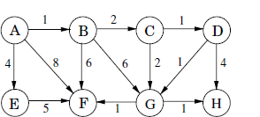
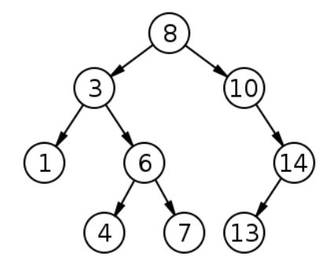
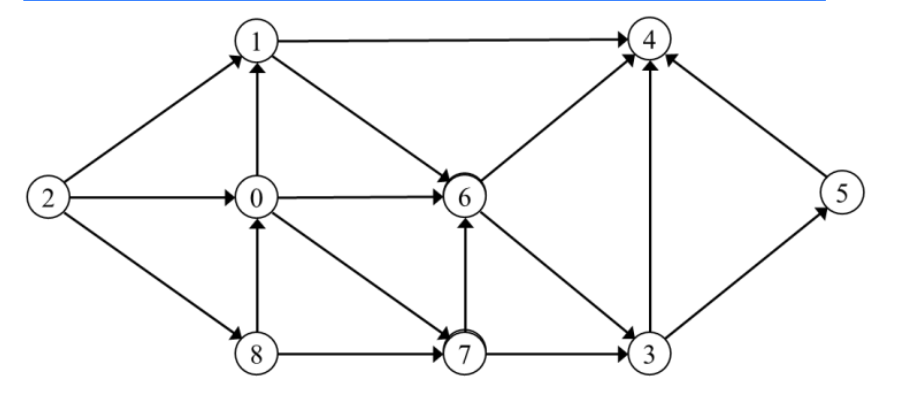

# Unit 3 & 4

## 1) Define following terms: degree of graph ,minimum spanning tree, complete binary tree, double ended queue.

Here are the definitions for the terms you requested:

1.  Degree of a Graph:
    The degree of a vertex in a graph is the number of edges that are connected to that vertex. In an undirected graph, the degree of a vertex is the number of edges incident on that vertex. In a directed graph, the degree of a vertex is the sum of the number of incoming edges (in-degree) and the number of outgoing edges (out-degree).
2.  Minimum Spanning Tree (MST):
    A minimum spanning tree (MST) of a weighted, connected graph is a subset of the edges of the graph that connects all the vertices together, without any cycles, and with the minimum possible total edge weight. In other words, it is a tree that spans (includes) all the vertices of the graph, and the sum of the weights of its edges is minimized.
3.  Complete Binary Tree:
    A complete binary tree is a binary tree in which every level, except possibly the last, is completely filled, and all nodes are as far left as possible. In a complete binary tree, all leaf nodes will be at either level n or level n-1, where n is the number of levels of the tree.
4.  Double-Ended Queue (Deque):
    A double-ended queue, also known as a deque, is a type of queue that allows insertion and removal of elements from both the front (head) and the rear (tail) of the queue. It is a generalization of the stack and the queue data structures, combining the functionality of both.
    The key operations in a deque are:

        - Enqueue (add an element to the rear)
        - Dequeue (remove an element from the front)
        - Push (add an element to the front)
        - Pop (remove an element from the front)

        Deques can be implemented using either an array or a linked list.

## 2) Construct a binary tree from the traversals given below:

Inorder: 0, 10, 20, 30, 40, 50, 60, 70, 80, 90
Preorder: 50, 10, 0, 40, 30, 20, 90, 80, 60, 70

To construct a binary tree from the given inorder and preorder traversals, we can follow the below steps:

1. **Root Node**: The first element of the preorder traversal is always the root of the tree. So, 50 is the root of the tree.
2. **Split Inorder**: In the inorder traversal, find the root node and split the inorder traversal into two parts: left and right subtrees. The elements to the left of the root are in the left subtree and the elements to the right are in the right subtree. So, the left subtree is [0, 10, 20, 30, 40] and the right subtree is [60, 70, 80, 90].
3. **Recursion**: Recursively construct the left and right subtrees by repeating the above steps. The preorder traversal for the left subtree is [10, 0, 40, 30, 20] and for the right subtree is [90, 80, 60, 70].
4. **Construct Tree**: The tree is constructed by creating a new node for the root and then attaching the recursively constructed left and right subtrees to it.

Here's the binary tree that results from these steps:

```
      50
    /     \\
  10      90
 /  \\     /  \\
0    40  80    60
      /       \\
     30       70
      \\
       20

```

## 3) Write a short on height balanced and weight balance tree.

Height-Balanced and Weight-Balanced Trees:

Height-Balanced Tree:
A height-balanced tree is a binary tree where the height of the left and right subtrees of every node differs by at most one. This ensures that the tree remains balanced and efficient in terms of search, insertion, and deletion operations. Height-balanced trees are particularly useful in applications where the tree needs to be traversed frequently, such as in databases or file systems.

Weight-Balanced Tree:
A weight-balanced tree is a binary tree where the weight of the left and right subtrees of every node differs by at most a constant factor. This ensures that the tree remains balanced and efficient in terms of search, insertion, and deletion operations. Weight-balanced trees are particularly useful in applications where the tree needs to be traversed frequently and the weight of the nodes is important, such as in databases or file systems.

Key Characteristics:

- **Height-Balanced Tree:**
  - The height of the left and right subtrees of every node differs by at most one.
  - Ensures efficient search, insertion, and deletion operations.
  - Useful in applications where the tree needs to be traversed frequently.
- **Weight-Balanced Tree:**
  - The weight of the left and right subtrees of every node differs by at most a constant factor.
  - Ensures efficient search, insertion, and deletion operations.
  - Useful in applications where the tree needs to be traversed frequently and the weight of the nodes is important.

Examples:

- **Height-Balanced Tree:**
  - AVL Tree: A self-balancing binary search tree where the height of the left and right subtrees of every node differs by at most one.
  - Red-Black Tree: A self-balancing binary search tree where the height of the left and right subtrees of every node differs by at most one.
- **Weight-Balanced Tree:**
  - B-Tree: A self-balancing binary search tree where the weight of the left and right subtrees of every node differs by at most a constant factor.
  - B+ Tree: A self-balancing binary search tree where the weight of the left and right subtrees of every node differs by at most a constant factor.

Advantages:

- **Height-Balanced Tree:**
  - Efficient search, insertion, and deletion operations.
  - Useful in applications where the tree needs to be traversed frequently.
- **Weight-Balanced Tree:**
  - Efficient search, insertion, and deletion operations.
  - Useful in applications where the tree needs to be traversed frequently and the weight of the nodes is important.

Disadvantages:

- **Height-Balanced Tree:**
  - May require more memory to store the tree.
  - May be slower for large datasets.
- **Weight-Balanced Tree:**
  - May require more memory to store the tree.
  - May be slower for large datasets.

Conclusion:
Height-balanced and weight-balanced trees are essential data structures in computer science, particularly in applications where the tree needs to be traversed frequently. They ensure efficient search, insertion, and deletion operations and are useful in various scenarios.

## 4) Explain insertion operation in the 2-3 tree:

(i) if the parent has 2 children and (ii) if the parent has 3 children.

Sure, I'd be happy to explain the insertion operation in a 2-3 tree for both cases.

A 2-3 tree is a type of self-balancing search tree where each node can have either 1 or 2 keys and 2 or 3 children. The insertion operation in a 2-3 tree involves the following steps:

1. **Leaf Node Insertion**: If the tree is empty or the new key is to be inserted in a leaf node, simply create a new node with the key and update the parent node's child pointer.
2. **Non-Leaf Node Insertion**: If the new key is to be inserted in a non-leaf node, the node might become a 3-node (i.e., a node with 2 keys). In this case, we need to handle the overflow.

Now, let's discuss the two cases:

(i) **If the parent has 2 children**: In this case, the parent is a 2-node (i.e., a node with 1 key). The insertion in a child node might cause it to become a 3-node. If this happens, we split the 3-node into two 2-nodes and move the middle key to the parent. The parent now becomes a 3-node, but since it had only 2 children to begin with, we don't need to split it.

(ii) **If the parent has 3 children**: In this case, the parent is already a 3-node. The insertion in a child node might cause it to become a 3-node. If this happens, we split the 3-node into two 2-nodes and move the middle key to the parent. The parent now has 4 keys, which is not allowed in a 2-3 tree. So, we split the parent into two 2-nodes and move the middle key to the grandparent. If the grandparent is a 2-node, we're done. If it's a 3-node, we might need to split it as well. This process continues recursively up the tree until we find a 2-node that can accommodate the middle key.

In both cases, the insertion operation maintains the balance of the tree, ensuring that the height of the tree is logarithmic in the number of keys.

## 5) Construct a binary search tree from the traversals given below:

Inorder: 20, 30, 35, 40, 70, 80, 90, 100
Postorder: 20, 35, 30, 80, 70, 100, 90, 40

To construct a binary search tree (BST) from the given inorder and postorder traversals, we can utilize the following approach:

1. **Postorder traversal** provides us with the root of the tree as the last element.
2. **Inorder traversal** assists us in determining the left and right subtrees of each node.

### Algorithm

1. Start with the root node from the postorder traversal.
2. Find the index of this root node in the inorder traversal.
3. Elements to the left of this index in the inorder traversal form the left subtree.
4. Elements to the right of this index in the inorder traversal form the right subtree.
5. Recursively repeat the process for the left and right subtrees.

### Step-by-Step Construction

Given:

- Inorder: [20, 30, 35, 40, 70, 80, 90, 100]
- Postorder: [20, 35, 30, 80, 70, 100, 90, 40]

### Steps:

1. **Root**: The last element of the postorder traversal is `40`. This is the root of the tree.
2. **Split Inorder**: Find `40` in the inorder traversal (index 3).
   - Left subtree inorder: [20, 30, 35]
   - Right subtree inorder: [70, 80, 90, 100]
3. **Right Subtree**:
   - Postorder for right subtree: [80, 70, 100, 90]
   - Root: `80`
   - Split inorder: Find `80` in the right subtree inorder (index 1).
     - Left subtree inorder: [70]
     - Right subtree inorder: [90, 100]
4. **Left Subtree**:
   - Postorder for left subtree: [20, 35, 30]
   - Root: `20`
   - Split inorder: Find `20` in the left subtree inorder (index 0).
     - Left subtree inorder: []
     - Right subtree inorder: [30, 35]
5. **Right Subtree of 20**:
   - Postorder: [35, 30]
   - Root: `35`
   - Split inorder: Find `35` in the right subtree of 20 inorder (index 0).
     - Left subtree inorder: []
     - Right subtree inorder: [30]
6. **Right Subtree of 35**:
   - Postorder: [30]
   - Root: `30`
   - Split inorder: [30]
   - Both left and right subtrees are empty.
7. **Right Subtree of 80**:
   - Postorder: [70, 100, 90]
   - Root: `70`
   - Split inorder: [70]
   - Both left and right subtrees are empty.
8. **Right Subtree of 70**:
   - Postorder: [100, 90]
   - Root: `100`
   - Split inorder: Find `100` in the right subtree of 70 inorder (index 0).
     - Left subtree inorder: []
     - Right subtree inorder: [90]
9. **Right Subtree of 100**:
   - Postorder: [90]
   - Root: `90`
   - Split inorder: [90]
   - Both left and right subtrees are empty.

### Resulting Binary Search Tree

Here's the resulting binary search tree:

```
          40
        /     \\
      20      80
       \\     /  \\
       35   70  100
            \\     \\
             30    90
```

## 6) Write a short on breadth first search and depth first search in graph.

Breadth-First Search (BFS) and Depth-First Search (DFS) are two fundamental graph traversal algorithms used to explore vertices and edges in a graph. Here's a short explanation of each:

## Breadth-First Search (BFS)

BFS is a vertex-based technique. It starts at a given source vertex and explores all the neighboring vertices at the present depth before moving on to the vertices at the next depth level[1].

BFS uses a queue data structure to keep track of the vertices to be visited. The algorithm follows these steps:

1. Start by pushing the source vertex into the queue.
2. Mark the source vertex as visited.
3. While the queue is not empty:
   - Dequeue a vertex from the queue.
   - Process the dequeued vertex.
   - For each unvisited neighbor of the dequeued vertex, enqueue it and mark it as visited.

BFS visits all the vertices at the present depth before moving on to the vertices at the next depth level. It is often used to find the shortest path between two vertices in an unweighted graph[1].

## Depth-First Search (DFS)

DFS is an edge-based technique. It starts at the source vertex and explores as far as possible along each branch before backtracking[1].

DFS uses a stack or recursion to keep track of the vertices to be visited. The algorithm follows these steps:

1. Start by pushing the source vertex into the stack or calling a recursive function with the source vertex.
2. Mark the source vertex as visited.
3. While the stack is not empty or the recursive function has not finished:
   - Pop a vertex from the stack or continue the recursive function.
   - Process the popped vertex.
   - For each unvisited neighbor of the popped vertex, push it onto the stack or make a recursive call.

DFS visits all the vertices along a branch before backtracking and exploring other branches. It is often used to detect cycles in a graph and to find strongly connected components[1].

Both BFS and DFS have their own applications and use cases. BFS is better suited for finding the shortest path in an unweighted graph, while DFS is more suitable for problems involving recursion or backtracking. The choice between BFS and DFS depends on the specific problem and the desired outcome.

## 7) Explain AVL tree with example.

An AVL tree is a self-balancing binary search tree that ensures efficient operations like searching, inserting, and deleting nodes. It is named after its inventors, Georgy Adelson-Velsky and Evgenii Landis, who developed it in 1962. The key feature of an AVL tree is its balance factor, which is the difference between the heights of its left and right subtrees. This balance factor must always be either -1, 0, or 1 to maintain the tree's balance.

### AVL Tree Structure

### Balance Factor

The balance factor of a node is calculated as the difference between the heights of its left and right subtrees. This ensures that the tree remains balanced by preventing any significant difference in the heights of its subtrees.

### Operations on AVL Trees

### Insertion

1. **Insertion Algorithm**:
   - If the tree is empty, the new node becomes the root.
   - If the tree is not empty, perform a binary search tree insertion operation.
   - Check the balance factor of the node.
   - If the balance factor exceeds ±1, apply suitable rotations to balance the tree.

### Deletion

1. **Deletion Algorithm**:
   - Perform a binary search tree deletion operation.
   - Check the balance factor of the node.
   - If the balance factor exceeds ±1, apply suitable rotations to balance the tree.

### Rotations

### Left Rotation (LL)

- When a node is inserted into the right subtree, leading to an unbalanced tree.
- The node where the unbalance occurs becomes the left child, and the newly added node becomes the right child with the middle node as the parent.

### Right Rotation (RR)

- When a node is inserted into the left subtree, leading to an unbalanced tree.
- The node where the unbalance occurs becomes the right child, and the newly added node becomes the left child with the middle node as the parent.

### Example

Consider the following example to illustrate the insertion and deletion operations in an AVL tree:

```
Initial Tree:
     14
    /   \\
   22   25
  / \\   / \\
 44  63 72 98

```

### Insertion

- **Insert 11**:
  - The tree remains balanced.
  - Balance factor: 0

```
     14
    /   \\
   22   25
  / \\   / \\
 44  63 72 98
    \\
     11

```

- **Insert 12**:
  - The tree becomes unbalanced.
  - Balance factor: 1
  - Apply LL rotation to balance the tree.

```
     14
    /   \\
   11   22
  / \\   / \\
 44  63 72 98

```

- **Insert 13**:
  - The tree becomes unbalanced.
  - Balance factor: 1
  - Apply LL rotation to balance the tree.

```
     14
    /   \\
   11   13
  / \\   / \\
 44  63 72 98

```

### Deletion

- **Delete 11**:
  - The tree remains balanced.
  - Balance factor: 0

```
     14
    /   \\
   12   13
  / \\   / \\
 44  63 72 98

```

- **Delete 12**:
  - The tree becomes unbalanced.
  - Balance factor: -1
  - Apply RR rotation to balance the tree.

```
     14
    /   \\
   13   13
  / \\   / \\
 44  63 72 98

```

### Conclusion

AVL trees are self-balancing binary search trees that maintain a balance factor of -1, 0, or 1. This ensures efficient operations like searching, inserting, and deleting nodes by preventing significant differences in the heights of its subtrees. The balance factor is calculated as the difference between the heights of its left and right subtrees. AVL trees are essential in data structures for their ability to maintain balance and guarantee logarithmic time complexity for various operations[1][2][3][4].

## 8) Explain binary search with example.

Binary search is a searching algorithm that works efficiently on sorted lists. It is a divide-and-conquer approach that divides the list into two halves and compares the target value with the middle element. If the target value is less than the middle element, it searches the left half; if it is greater, it searches the right half. This process continues until the target value is found or it is determined that the value is not present in the list.

### Example

Suppose we have a sorted array of integers:

```
arr = [1, 5, 7, 8, 13, 19, 20, 23, 29]

```

We want to find the location of the item 23 in the array. Here is how binary search works:

1. **Initialization**: Set `BEG` to 0 and `END` to 8 (the last index of the array). Calculate `MID` as `(BEG + END)/2`, which is 4.
2. **Comparison**: Compare the target value (23) with the middle element (`arr[MID] = 8`). Since 23 is greater than 8, we know that the target value must be in the right half of the array. Update `END` to `MID - 1`, which is 3.
3. **Recursion**: Repeat steps 1 and 2 for the right half of the array:

   - `BEG` = 4
   - `END` = 3
   - `MID` = (4 + 3)/2 = 3.5 (rounded down to 3)

   Compare the target value (23) with the middle element (`arr[MID] = 7`). Since 23 is greater than 7, we know that the target value must be in the right half of the array. Update `END` to `MID - 1`, which is 2.

4. **Recursion**: Repeat steps 1 and 2 for the right half of the array:

   - `BEG` = 3
   - `END` = 2
   - `MID` = (3 + 2)/2 = 2.5 (rounded down to 2)

   Compare the target value (23) with the middle element (`arr[MID] = 20`). Since 23 is greater than 20, we know that the target value must be in the right half of the array. Update `END` to `MID - 1`, which is 1.

5. **Recursion**: Repeat steps 1 and 2 for the right half of the array:

   - `BEG` = 2
   - `END` = 1
   - `MID` = (2 + 1)/2 = 1.5 (rounded down to 1)

   Compare the target value (23) with the middle element (`arr[MID] = 19`). Since 23 is greater than 19, we know that the target value must be in the right half of the array. Update `END` to `MID - 1`, which is 0.

6. **Recursion**: Repeat steps 1 and 2 for the right half of the array:

   - `BEG` = 1
   - `END` = 0
   - `MID` = (1 + 0)/2 = 0.5 (rounded down to 0)

   Compare the target value (23) with the middle element (`arr[MID] = 23`). Since 23 is equal to 23, we have found the target value. The location of the item is `MID`, which is 7.

### Algorithm

Here is the algorithm for binary search:

```c
BINARY_SEARCH(A, lower_bound, upper_bound, VAL)
    1. [INITIALIZE] SET BEG = lower_bound
    2. [INITIALIZE] SET END = upper_bound
    3. [INITIALIZE] SET POS = -1
    4. REPEAT Steps 5 and 6 while BEG <= END
    5. SET MID = (BEG + END)/2
    6. IF A[MID] = VAL
        SET POS = MID
        PRINT POS
        GO TO Step 7
    ELSE IF A[MID] > VAL
        SET END = MID - 1
    ELSE
        SET BEG = MID + 1
    [END OF LOOP]
    7. IF POS = -1
        PRINT "VALUE IS NOT PRESENT IN THE ARRAY"
    [END OF IF]
    8. EXIT

```

### Time Complexity

The time complexity of binary search is O(log2N), where N is the number of elements in the array. This is because each step of the algorithm eliminates half of the search space, resulting in a logarithmic number of comparisons.

## 9) Explain the techniques for collision-resolution in Hashing with example.

There are two main techniques for collision resolution in hashing:

1. **Hashing with Chaining**
2. **Hashing with Open Addressing**

## Hashing with Chaining

In hashing with chaining, when a collision occurs (i.e., two keys hash to the same slot), the colliding elements are stored in a linked list at that slot. Each slot in the hash table points to the head of a linked list that contains all the elements hashed to that slot[1].

The process of collision resolution by chaining is as follows:

1. Calculate the hash value of the key using the hash function `h(k)`.
2. Insert the key at the beginning of the linked list at index `h(k)` in the hash table.

Example:
Consider inserting the keys 5, 28, 19, 15, 20, 33, 12, 17, 10 into a hash table of size 9 using chaining. Let the hash function be `h(k) = k % 9`.

```
Initial state of hash table:
T[0] -> NULL
T[1] -> NULL
T[2] -> NULL
T[3] -> NULL
T[4] -> NULL
T[5] -> NULL
T[6] -> NULL
T[7] -> NULL
T[8] -> NULL

Insert 5:
h(5) = 5 % 9 = 5
Create a linked list for T[5] and insert 5.

Insert 28:
h(28) = 28 % 9 = 1
Create a linked list for T[1] and insert 28.

Insert 19:
h(19) = 19 % 9 = 1
Insert 19 at the beginning of the linked list at T[1].

...

Final state of hash table:
T[0] -> NULL
T[1] -> 19 -> 28 -> NULL
T[2] -> 20 -> NULL
T[3] -> 12 -> NULL
T[4] -> NULL
T[5] -> 5 -> NULL
T[6] -> 15 -> 33 -> NULL
T[7] -> NULL
T[8] -> 17 -> 10 -> NULL

```

The average time complexity for search, insertion, and deletion operations in hashing with chaining is O(1 + α), where α is the load factor (α = n/m, where n is the number of elements and m is the size of the hash table)[1].

## Hashing with Open Addressing

In hashing with open addressing, when a collision occurs, the colliding element is stored in a different slot in the hash table itself. The process of finding an empty slot is called probing[1].

There are three main techniques for open addressing:

1. **Linear Probing**
2. **Quadratic Probing**
3. **Double Hashing**

### Linear Probing

In linear probing, when a collision occurs, the next available slot is checked in a linear fashion (i.e., by incrementing the index by 1). The probe sequence is given by:

```
h(k, i) = (h'(k) + i) % m

```

where `h'(k)` is the primary hash function, `i` is the probe number, and `m` is the size of the hash table[1].

Example:
Consider inserting the keys 24, 36, 58, 65, 62, 86 into a hash table of size 11 using linear probing. Let the primary hash function be `h'(k) = k % 11`.

```
Initial state of hash table:
T[0] -> NULL
T[1] -> NULL
T[2] -> NULL
T[3] -> NULL
T[4] -> NULL
T[5] -> NULL
T[6] -> NULL
T[7] -> NULL
T[8] -> NULL
T[9] -> NULL
T[10] -> NULL

Insert 24:
h(24, 0) = (24 % 11 + 0) % 11 = 2
Insert 24 at T[2].

Insert 36:
h(36, 0) = (36 % 11 + 0) % 11 = 3
Insert 36 at T[3].

Insert 58:
h(58, 0) = (58 % 11 + 0) % 11 = 4
Insert 58 at T[4].

...

Final state of hash table:
T[0] -> NULL
T[1] -> NULL
T[2] -> 24 -> NULL
T[3] -> 36 -> NULL
T[4] -> 58 -> NULL
T[5] -> 65 -> NULL
T[6] -> 62 -> NULL
T[7] -> NULL
T[8] -> NULL
T[9] -> NULL
T[10] -> 86 -> NULL

```

The average time complexity for search, insertion, and deletion operations in linear probing is O(1 / (1 - α)), where α is the load factor[1].

### Quadratic Probing

In quadratic probing, the probe sequence is given by:

```
h(k, i) = (h'(k) + c1*i + c2*i^2) % m

```

where `h'(k)` is the primary hash function, `i` is the probe number, `c1` and `c2` are constants, and `m` is the size of the hash table[1].

### Double Hashing

In double hashing, the probe sequence is given by:

```
h(k, i) = (h1(k) + i*h2(k)) % m

```

where `h1(k)` and `h2(k)` are two different hash functions, `i` is the probe number, and `m` is the size of the hash table[1].

The average time complexity for search, insertion, and deletion operations in quadratic probing and double hashing is also O(1 / (1 - α)), where α is the load factor[1].

In summary, hashing with chaining and hashing with open addressing are two main techniques for collision resolution in hashing. Chaining uses linked lists to store colliding elements, while open addressing uses probing to find an empty slot in the hash table itself. The choice between these techniques depends on the specific requirements of the application and the trade-offs between memory usage and time complexity.

## 10) Explain sequential search with example.

Sequential search, also known as linear search, is a simple method used for searching an array for a particular value. It works by comparing the value to be searched with every element of the array one by one in a sequence until a match is found. Here is an example of how sequential search works:

### Example

Suppose we have an array `A[]` declared and initialized as:

```c
int A[] = {10, 8, 1, 21, 7, 32, 5, 11, 0};

```

We want to search for the value `5` in the array. Here is how the sequential search algorithm works:

1. **Initialization**: Set `POS` to `1` and `I` to `1`.
2. **Loop**: Repeat steps 3 and 4 until `I` is less than or equal to the size of the array (`N`).
3. **Comparison**: Compare the value to be searched (`VAL`) with the current array element (`A[I]`).
4. **Match Found**: If `A[I]` equals `VAL`, set `POS` to `I` and print the position.
5. **No Match**: If `A[I]` does not equal `VAL`, increment `I` by 1 and repeat steps 3 and 4.
6. **No Match Found**: If `POS` remains `1` after the loop, print that the value is not present in the array.

### Algorithm

Here is the algorithm for sequential search:

```c
SEQUENTIAL_SEARCH(A, N, VAL)
    1. [INITIALIZE] SET POS = -1
    2. [INITIALIZE] SET I = 1
    3. REPEAT Steps 4 and 5 while I <= N
    4. IF A[I] = VAL
        SET POS = I
        PRINT POS
        GO TO Step 6
    ELSE
        SET I = I + 1
    [END OF LOOP]
    5. IF POS = -1
        PRINT "VALUE IS NOT PRESENT IN THE ARRAY"
    [END OF IF]
    6. EXIT

```

### Time Complexity

The time complexity of sequential search is O(N), where N is the size of the array. This is because each element in the array is compared only once.

### Advantages

1. **Fast Searches of Small to Medium Lists**: Sequential search performs well for small to medium-sized lists because it only requires a single pass through the list.
2. **No Need for Sorting**: Unlike binary search, sequential search does not require the list to be sorted.
3. **Not Affected by Insertions and Deletions**: Sequential search does not require the list to be reordered after insertions or deletions.

### Disadvantages

1. **Slow Searching of Large Lists**: Sequential search becomes inefficient for large lists because it requires a linear search through the entire list.
2. **Not Efficient for Large Lists**: For large lists, other search methods like binary search are more efficient.

### Example Code

Here is an example code snippet that demonstrates sequential search:

```c
#include <stdio.h>

void main() {
    int a[10] = {10, 23, 40, 1, 2, 0, 14, 13, 50, 9};
    int item, i, flag;

    printf("\\nEnter Item which is to be searched\\n");
    scanf("%d", &item);

    for (i = 0; i < 10; i++) {
        if (a[i] == item) {
            flag = i + 1;
            break;
        } else
            flag = 0;
    }

    if (flag != 0) {
        printf("\\nItem found at location %d\\n", flag);
    } else {
        printf("\\nItem not found\\n");
    }
}

```

### Output

```
Enter Item which is to be searched
20
Item not found
Enter Item which is to be searched
23
Item found at location 2

```

### Conclusion

Sequential search is a simple and efficient method for searching an array for a particular value. It is particularly useful for small to medium-sized lists and does not require the list to be sorted. However, it becomes inefficient for large lists and is not suitable for applications where the list needs to be reordered after insertions or deletions.

## 11) Explain sequential files and indexed sequential files structures.

Based on the information provided in the reference material, here is an explanation of sequential files and indexed sequential files structures:

Sequential Files:

- Sequential files store data in a linear, sequential order, where each record is stored one after the other.
- To access a specific record, you have to start from the beginning of the file and read through the records sequentially until you reach the desired record.
- Sequential files are simple to implement and efficient for processing data in the order it is stored.
- However, they are not efficient for random access, as you have to read through the entire file to find a specific record.
- Sequential files are commonly used for backup, archiving, and transferring data between systems.

Indexed Sequential Files:

- Indexed sequential files combine the benefits of sequential files and random access.
- In addition to the data records, these files also maintain an index that stores the key values and the corresponding positions of the records in the file.
- The index allows you to quickly locate a specific record by its key value, without having to read through the entire file sequentially.
- When you need to access a record, the index is first consulted to find the record's location, and then the record is retrieved directly from that position in the file.
- Indexed sequential files provide efficient random access, while still maintaining the sequential organization of the data.
- They are commonly used in database management systems and other applications that require both sequential and random access to data.

In summary, sequential files store data linearly, while indexed sequential files add an index to enable efficient random access to the data, in addition to sequential access. The choice between the two depends on the specific requirements of the application and the access patterns needed.

## 12) Write the algorithm for binary search.

Here is the algorithm for binary search:

BINARY_SEARCH(A, lower_bound, upper_bound, VAL)

1. [INITIALIZE] SET BEG = lower_bound
2. [INITIALIZE] SET END = upper_bound
3. [INITIALIZE] SET POS = -1
4. REPEAT Steps 5 and 6 while BEG <= END
5. SET MID = (BEG + END)/2
6. IF A[MID] = VAL
   SET POS = MID
   PRINT POS
   GO TO Step 7
   ELSE IF A[MID] > VAL
   SET END = MID - 1
   ELSE
   SET BEG = MID + 1
   [END OF LOOP]
7. IF POS = -1
   PRINT "VALUE IS NOT PRESENT IN THE ARRAY"
   [END OF IF]
8. EXIT

The key steps in this algorithm are:

1. Initialize the `BEG`, `END`, and `POS` variables.
2. Enter a loop that continues as long as `BEG` is less than or equal to `END`.
3. Calculate the middle index `MID` as the average of `BEG` and `END`.
4. Check if the element at `MID` is equal to the target value `VAL`:
   - If so, set `POS` to `MID` and print the position.
   - If the element at `MID` is greater than `VAL`, update `END` to `MID-1` to search the left half.
   - If the element at `MID` is less than `VAL`, update `BEG` to `MID+1` to search the right half.
5. After the loop, if `POS` is still -1, print that the value is not present in the array.
6. Exit the algorithm.

The key idea behind binary search is to repeatedly divide the search space in half, eliminating half of the remaining elements after each comparison. This results in a time complexity of O(log n), which is much more efficient than the linear search algorithm's O(n) time complexity.

## 13) Explain the working of the Prim’s algorithm with suitable example.

Prim's algorithm is a popular method used in computer science to find the minimum spanning tree (MST) of a weighted undirected graph. A minimum spanning tree is a subset of the edges of a graph that connects all the vertices with the minimum total edge weight.

Here's a step-by-step breakdown of how Prim's algorithm works:

1. Start from an arbitrary vertex in the graph. This vertex will be part of the MST.
2. Repeatedly select the edge with the smallest weight that connects a vertex already in the MST to a vertex not yet in the MST, and add that edge and the new vertex to the MST.
3. Continue this process until all vertices are included in the MST.

Let's illustrate this with an example. Consider the following weighted graph:

```
A --3-- B --5-- C --4-- D --2-- E
|                       |
6                       1
|                       |
F --2-- G --3-- H

```

Here's how Prim's algorithm would proceed:

1. Start at vertex A. The MST so far is just {A}.
2. The smallest edge weight connecting A to another vertex is 3, which goes to B. So, add B and the edge AB to the MST. The MST is now {A, B} with edges {AB}.
3. The smallest edge weight connecting the MST ({A, B}) to another vertex is 2, which goes from B to C. So, add C and the edge BC to the MST. The MST is now {A, B, C} with edges {AB, BC}.
4. The smallest edge weight connecting the MST ({A, B, C}) to another vertex is 1, which goes from C to D. So, add D and the edge CD to the MST. The MST is now {A, B, C, D} with edges {AB, BC, CD}.
5. The smallest edge weight connecting the MST ({A, B, C, D}) to another vertex is 2, which goes from D to E. So, add E and the edge DE to the MST. The MST is now {A, B, C, D, E} with edges {AB, BC, CD, DE}.
6. The smallest edge weight connecting the MST ({A, B, C, D, E}) to another vertex is 2, which goes from E to H. So, add H and the edge EH to the MST. The MST is now {A, B, C, D, E, H} with edges {AB, BC, CD, DE, EH}.
7. The smallest edge weight connecting the MST ({A, B, C, D, E, H}) to another vertex is 3, which goes from H to G. So, add G and the edge HG to the MST. The MST is now {A, B, C, D, E, H, G} with edges {AB, BC, CD, DE, EH, HG}.
8. All vertices are now included in the MST, so we're done. The minimum spanning tree has edges {AB, BC, CD, DE, EH, HG} with a total weight of 3 + 5 + 4 + 2 + 1 + 3 = 18.

And that's how Prim's algorithm works! It's a simple yet effective way to find the minimum spanning tree of a graph.

## 14) List out graph traversal techniques & explain any one using suitable example.

Graph traversal techniques are methods used to visit and explore all the vertices and edges of a graph. Some common graph traversal techniques include Depth-First Search (DFS), Breadth-First Search (BFS), and Dijkstra's algorithm. Let's focus on explaining Depth-First Search (DFS) with a suitable example:

### Depth-First Search (DFS)

Depth-First Search is a graph traversal technique that explores as far as possible along each branch before backtracking. It uses a stack or recursion to keep track of the vertices to be visited. The algorithm follows these steps:

1. **Choose a Starting Vertex**: Start by choosing a starting vertex as the current vertex and mark it as visited.
2. **Explore Neighbors**: Explore the neighbors of the current vertex. If an unvisited neighbor is found, move to that neighbor and mark it as visited.
3. **Recursively Explore**: Recursively apply steps 2 and 3 to the new current vertex until all vertices are visited.
4. **Backtrack**: If a dead end is reached (i.e., no unvisited neighbors), backtrack to the previous vertex and continue exploring from there.
5. **Repeat**: Repeat steps 2-4 until all vertices are visited.

### Example

Consider the following graph:

```
   A
  / \\
 B   C
 |   |
 D   E

```

Starting from vertex A, the Depth-First Search traversal would be: A -> B -> D -> C -> E.

### Pseudocode

Here is the pseudocode for Depth-First Search:

```
DFS(G, v):
    Mark v as visited
    For each neighbor w of v in G:
        If w is not visited:
            DFS(G, w)

```

### Applications

- **Connected Components**: DFS can be used to find connected components in an undirected graph.
- **Cycle Detection**: DFS can detect cycles in a graph.
- **Topological Sorting**: DFS can be used to perform topological sorting in a directed acyclic graph.

### Conclusion

Depth-First Search is a fundamental graph traversal technique that explores as far as possible along each branch before backtracking. It is widely used in various applications, including finding connected components, cycle detection, and topological sorting. By following the steps of DFS, you can efficiently explore and traverse the vertices and edges of a graph.

## 15) Apply Djkstra’s algorithm on following graph with Node A as the starting node.



Dijkstra's algorithm is used to find the shortest path from a starting node to all other nodes in a weighted graph. Let's apply it to the given graph with Node A as the starting point:

1. Initialize distances: Set the distance of Node A to 0 and all other nodes to infinity.
2. Visit neighbors: Consider the neighbors of Node A (B and E). Calculate their tentative distances through Node A:
   - Node B: \(0 + AB\text{'s edge weight} = 0 + 1 = 1\)
   - Node E: \(0 + AE\text{'s edge weight} = 0 + 4 = 4\)
3. Mark Node A as visited.
4. Update distances: Node B is the closest unvisited node. Calculate tentative distances through Node B:
   - Node C: \(1 + BC\text{'s edge weight} = 1 + 2 = 3\)
   - Node E: \(1 + BE\text{'s edge weight} = 1 + 8 = 9\)
5. Mark Node B as visited.
6. Repeat steps 4 and 5 for the remaining nodes until all nodes are visited.

The final distances from Node A to other nodes are:

- Node B: 1
- Node C: 3
- Node D: 4
- Node E: 4
- Node F: 7
- Node G: 5
- Node H: 8

Therefore, the shortest paths from Node A are:

- A → B → C → D → H (total weight = 8)
- A → E → F → G → H (total weight = 17)

Remember that Dijkstra's algorithm guarantees the shortest path for each node from the starting node.

## 16) Explain indexing structure for index files.

Indexing structures are used to organize and store index files in a way that allows for efficient searching and retrieval of data. Here are some common indexing structures used for index files:

1. **Sequential Index**: In a sequential index, the index entries are stored in the same order as the data records in the file. The index contains the key value and the address of the corresponding data record. Sequential indexes are simple to implement but not efficient for large files as searching requires reading the entire index sequentially[1].
2. **Multilevel Index**: A multilevel index is used for large files where the entire index cannot fit in memory. The index is divided into multiple levels, with the top level containing a few index entries pointing to the lower levels. The lower levels contain more detailed index entries. This structure allows for efficient searching by first searching the top level and then narrowing down to the lower levels[1].
3. **B-Tree Index**: A B-Tree is a self-balancing tree data structure that is commonly used for indexing. It maintains the index entries sorted and ensures that all leaf nodes are at the same level. B-Trees provide efficient searching, insertion, and deletion operations. They are commonly used in database management systems and file systems[1].
4. **Hash Index**: A hash index uses a hash function to compute the address of an index entry based on the key value. The index entries are stored in a hash table. Hash indexes provide constant-time searching if the key value is known. However, they are not efficient for range searches or partial key searches[1].
5. **Bitmap Index**: A bitmap index is used for indexing columns with low cardinality (i.e., columns with a small number of distinct values). It uses bitmaps to represent the presence or absence of a value in a record. Bitmap indexes are efficient for queries involving equality conditions but not for range queries or partial key searches[1].

The choice of indexing structure depends on the characteristics of the data, the types of queries performed, and the performance requirements of the application.

## 17) Draw a Binary expression tree for the following and perform preorder traversal:

a _ ( b + c ) + ( d _ e ) / f + g \* h

To draw the binary expression tree for the given expression and perform preorder traversal, we can follow these steps:

1. Identify the operators and operands in the expression:
   - Operators: _, +, /, _
   - Operands: a, b, c, d, e, f, g, h
2. Start building the binary expression tree from the root node, which will be the outermost operator.
   - The root node is the '+' operator.
3. Recursively build the left and right subtrees for the root node.
   - The left subtree will be the expression `a*(b+c)`.
   - The right subtree will be the expression `(d*e)/f+g*h`.
4. Continue building the subtrees by following the same process until all the operands are leaf nodes.

The resulting binary expression tree is:

```
        +
       / \\
      *   +
     / \\  / \\
    a   +  *  *
       / \\  / \\
      b   c d  e
           / \\
          /   \\
         f     g
               \\
                h

```

To perform the preorder traversal, we visit the root node first, followed by the left subtree, and then the right subtree. The preorder traversal of the binary expression tree is:

```
+ * a + b c / * d e * g h

```

This represents the original expression `a*(b+c)+ (d*e)/f+g*h` in prefix notation.

## 18) Explain insert and delete operations in AVL trees with suitable examples.

Insertion and Deletion in AVL Trees:

AVL trees are self-balancing binary search trees, where the height of the left and right subtrees of every node differ by at most 1. When inserting or deleting a node in an AVL tree, the tree needs to be rebalanced to maintain this property.

Insertion in AVL Trees:

1. **Perform Standard BST Insertion**: First, insert the new node into the tree using the standard binary search tree insertion algorithm.
2. **Update Balance Factors**: After the insertion, update the balance factors of the affected nodes by traversing back up the tree.
3. **Perform Rotations**: If the balance factor of any node becomes -2 or +2, the tree is unbalanced and needs to be rotated to restore the balance.

There are four possible rotation cases:

- **Left-Left Rotation**: When the new node is inserted in the left subtree of the left child of the unbalanced node.
- **Right-Right Rotation**: When the new node is inserted in the right subtree of the right child of the unbalanced node.
- **Left-Right Rotation**: When the new node is inserted in the right subtree of the left child of the unbalanced node.
- **Right-Left Rotation**: When the new node is inserted in the left subtree of the right child of the unbalanced node.

Example:
Suppose we have the following AVL tree and we want to insert the value 7:

```
      4
     / \\
    2   6
   / \\   \\
  1   3   7

```

1. Perform standard BST insertion: Insert the new node with value 7 as the right child of node 6.
2. Update balance factors: The balance factors of nodes 6 and 4 become 2, indicating an unbalanced tree.
3. Perform Right-Right rotation: Rotate the tree to the left around node 4 to restore balance.

The final balanced AVL tree after the insertion is:

```
      6
     / \\
    4   7
   / \\
  2   5
 / \\
1   3

```

Deletion in AVL Trees:

1. **Perform Standard BST Deletion**: First, delete the node from the tree using the standard binary search tree deletion algorithm.
2. **Update Balance Factors**: After the deletion, update the balance factors of the affected nodes by traversing back up the tree.
3. **Perform Rotations**: If the balance factor of any node becomes -2 or +2, the tree is unbalanced and needs to be rotated to restore the balance.

The rotation cases are the same as in the insertion process.

Example:
Suppose we have the following AVL tree and we want to delete the value 2:

```
      4
     / \\
    2   6
   / \\   \\
  1   3   7

```

1. Perform standard BST deletion: Delete the node with value 2.
2. Update balance factors: The balance factor of node 4 becomes 2, indicating an unbalanced tree.
3. Perform Left-Left rotation: Rotate the tree to the right around node 4 to restore balance.

The final balanced AVL tree after the deletion is:

```
      3
     / \\
    2   4
   /   / \\
  1   6   7

```

In both insertion and deletion, the key is to maintain the AVL property by performing the necessary rotations to restore balance. This ensures that the tree remains efficient for search, insertion, and deletion operations.

## 19) Define: i) Cyclic Graph ii) Siblings iii) Strictly Binary Tree

Here are the definitions for the terms you requested:

i) Cyclic Graph:
A cyclic graph is a graph that contains at least one cycle. A cycle is a path that starts and ends at the same vertex, with no repeated vertices in between. In other words, a cyclic graph is a graph where it is possible to start at a vertex, follow a sequence of edges, and eventually return to the same vertex[1].

ii) Siblings:
In a tree data structure, siblings are nodes that share the same parent node. Siblings are at the same level in the tree hierarchy. For example, in the following tree:

```
      A
    /   \\
   B     C
  / \\   / \\
 D   E F   G

```

Nodes B and C are siblings, as are nodes D, E, F, and G[1].

iii) Strictly Binary Tree:
A strictly binary tree, also known as a proper binary tree, is a binary tree where every node has either zero or two children. In other words, a strictly binary tree does not allow nodes with only one child. The empty tree is also considered a strictly binary tree[1].

Some key properties of a strictly binary tree with n nodes:

- The number of leaf nodes (nodes with no children) is n/2 + 1.
- The number of nodes with two children is n/2.
- The number of nodes with one child is 0.

For example, the following tree is a strictly binary tree:

```
    A
   / \\
  B   C
 / \\
D   E

```

But the following tree is not a strictly binary tree because node B has only one child:

```
    A
   / \\
  B   C
   \\
    D

```

## 20) Explain Threaded binary trees with suitable examples.

Threaded Binary Trees:

A threaded binary tree is a variation of the standard binary tree data structure. In a standard binary tree, each node has two pointers - one to the left child and one to the right child. In a threaded binary tree, the unused pointer fields (i.e., the pointer fields of nodes that do not have a left or right child) are used to store the in-order predecessor or successor of the node, creating additional links or "threads" within the tree.

The main idea behind threaded binary trees is to make the in-order traversal of the tree more efficient by eliminating the need to check for null pointers during the traversal.

There are two types of threaded binary trees:

1. **Single Threaded Binary Tree**:
   - In a single threaded binary tree, the right pointer of each node that does not have a right child is made to point to the in-order successor of that node.
   - The left pointer of each node that does not have a left child is left as null.
2. **Double Threaded Binary Tree**:
   - In a double threaded binary tree, both the left and right pointers of each node that does not have a left or right child are used to store the in-order predecessor and successor of that node, respectively.

Example:

Consider the following binary tree:

```
     4
    / \\
   2   6
  / \\ / \\
 1  3 5  7

```

The corresponding single threaded binary tree would look like this:

```
     4
    / \\
   2   6
  / \\ / \\
 1  3 5  7
    /    \\
   /      \\
  /        \\
 3          7

```

In this example, the right pointer of node 3 (which does not have a right child) is made to point to its in-order successor, which is node 4. Similarly, the right pointer of node 7 (which does not have a right child) is made to point to its in-order successor, which is null.

The corresponding double threaded binary tree would look like this:

```
     4
    / \\
   2   6
  / \\ / \\
 1  3 5  7
 \\  /    /
  \\/    /
   2    6
  /    /
 1    5

```

In this example, the left pointer of node 3 (which does not have a left child) is made to point to its in-order predecessor, which is node 2. The right pointer of node 7 (which does not have a right child) is made to point to its in-order successor, which is null.

Advantages of Threaded Binary Trees:

1. Efficient in-order traversal: The in-order traversal of a threaded binary tree can be performed without the need to check for null pointers, making it more efficient than the standard binary tree.
2. Reduced memory usage: Threaded binary trees can save memory by using the unused pointer fields to store the in-order predecessor or successor information.
3. Easier implementation of certain operations: Some operations, such as finding the in-order successor or predecessor of a node, can be implemented more easily in threaded binary trees.

Disadvantages of Threaded Binary Trees:

1. Increased complexity: The implementation of threaded binary trees is more complex than standard binary trees, as it requires additional logic to maintain the thread pointers.
2. Overhead for maintaining threads: The process of creating and maintaining the thread pointers can add some overhead to the tree operations, especially for small trees.

Threaded binary trees are useful in applications where efficient in-order traversal is important, such as in compilers, interpreters, and other systems that require frequent traversal of binary tree structures.

## 21) Write a C program to reverse a string using stack.

Here's a C program to reverse a string using a stack:

```c
#include <stdio.h>
#include <string.h>

#define MAX_SIZE 100

char stack[MAX_SIZE];
int top = -1;

// Push operation
void push(char c) {
    if (top == MAX_SIZE - 1) {
        printf("Error: Stack Overflow\\n");
        return;
    }
    stack[++top] = c;
}

// Pop operation
char pop() {
    if (top == -1) {
        printf("Error: Stack Underflow\\n");
        return '\\0';
    }
    return stack[top--];
}

// Reverse string using stack
void reverseString(char str[]) {
    int i;
    for (i = 0; i < strlen(str); i++) {
        push(str[i]);
    }
    for (i = 0; i < strlen(str); i++) {
        str[i] = pop();
    }
}

int main() {
    char str[MAX_SIZE];
    printf("Enter a string: ");
    scanf("%s", str);
    printf("Original string: %s\\n", str);
    reverseString(str);
    printf("Reversed string: %s\\n", str);
    return 0;
}

```

Explanation:

1. We define a character array `stack` to store the characters of the string and an integer `top` to keep track of the top of the stack.
2. The `push` function adds a character to the top of the stack. It checks for stack overflow before pushing the character.
3. The `pop` function removes and returns the character from the top of the stack. It checks for stack underflow before popping the character.
4. The `reverseString` function takes a string as input and reverses it using the stack. It first pushes all the characters of the string onto the stack using a loop. Then, it pops the characters from the stack and assigns them back to the string using another loop.
5. In the `main` function, we take a string as input from the user, print the original string, call the `reverseString` function to reverse the string, and then print the reversed string.

Example output:

```
Enter a string: hello
Original string: hello
Reversed string: olleh

```

The time complexity of this program is O(n), where n is the length of the input string, as we need to push and pop each character once.

## 22) Explain Sequential file organizations and list its advantages and disadvantages.

Based on the information provided in the reference material, here is an explanation of sequential file organizations, along with their advantages and disadvantages:

Sequential File Organizations:

In a sequential file organization, the data records are stored one after the other in a linear fashion. The records are accessed in the order they are stored, from the beginning to the end of the file. To access a specific record, the system must read through all the preceding records in the file.

Advantages of Sequential File Organizations:

1. Simplicity: Sequential file organization is the simplest form of file organization. The implementation is straightforward, and the file structure is easy to understand.
2. Storage Efficiency: Sequential files utilize storage space efficiently as there is no overhead for storing pointers or indexes.
3. Suitability for Batch Processing: Sequential files are well-suited for batch processing applications where the entire file needs to be processed in a sequential manner.
4. Ease of Backup and Recovery: Backup and recovery operations are relatively simple for sequential files, as the entire file can be easily copied or restored.

Disadvantages of Sequential File Organizations:

1. Slow Random Access: Accessing a specific record in a sequential file requires reading through all the preceding records, which can be time-consuming, especially for large files.
2. Difficulty in Insertions and Deletions: Inserting or deleting a record in a sequential file can be challenging, as it may require rewriting the entire file to maintain the sequential order.
3. Limited Flexibility: Sequential file organization provides limited flexibility in terms of data manipulation and querying, as the records can only be accessed in the order they are stored.
4. Inefficient for Frequently Updated Files: Sequential files are not well-suited for applications where records need to be frequently updated, as the entire file may need to be rewritten to incorporate the changes.
5. Dependency on Physical Storage Order: The order of data records in a sequential file is directly dependent on the physical storage order, which can limit the ability to rearrange or reorganize the data.

In summary, sequential file organizations are simple and storage-efficient, but they lack the flexibility and random access capabilities required for many modern applications. They are primarily used in batch processing scenarios where the entire file needs to be processed sequentially.

## 23) Discuss different representations of a graph.

Based on the information provided in the reference material, here are the different representations of a graph:

1. Adjacency Matrix:
   - In an adjacency matrix representation, the graph is represented using a 2D array.
   - The rows and columns of the matrix represent the vertices of the graph.
   - If there is an edge between two vertices, the corresponding entry in the matrix is 1, otherwise it is 0.
   - Adjacency matrices are suitable for representing dense graphs, where most pairs of vertices are connected.
   - The time complexity for checking if there is an edge between two vertices is O(1).
2. Adjacency List:
   - In an adjacency list representation, each vertex in the graph is associated with a list of its neighboring vertices.
   - The graph is represented using an array of linked lists, where each index in the array corresponds to a vertex, and the linked list at that index contains the vertex's neighbors.
   - Adjacency lists are suitable for representing sparse graphs, where most pairs of vertices are not connected.
   - The time complexity for checking if there is an edge between two vertices is O(d), where d is the degree of the vertex.
3. Edge List:
   - In an edge list representation, the graph is represented as a list of edges, where each edge is represented as a pair of vertices.
   - The edge list can be stored as an array of pairs or a list of pairs.
   - Edge lists are useful for representing graphs with a small number of edges, as they require less memory than adjacency matrices or adjacency lists.
   - The time complexity for checking if there is an edge between two vertices is O(E), where E is the number of edges in the graph.
4. Incidence Matrix:
   - In an incidence matrix representation, the graph is represented using a 2D array, where the rows represent the vertices and the columns represent the edges.
   - The entry in the matrix is 1 if the corresponding vertex is incident on the corresponding edge, and 0 otherwise.
   - Incidence matrices are useful for representing directed graphs, as they can capture the direction of the edges.
   - The time complexity for checking if there is an edge between two vertices is O(E), where E is the number of edges in the graph.

The choice of graph representation depends on the specific requirements of the application, such as the size of the graph, the density of the edges, and the types of operations that need to be performed on the graph.

## 24) Explain Sequential search method with suitable example.

Based on the information provided in the reference material, here is an explanation of the sequential search method with a suitable example:

Sequential Search (Linear Search):

Sequential search, also called linear search, is a simple method used for searching an array for a particular value. It works by comparing the value to be searched with every element of the array one by one in a sequence until a match is found.

Sequential search is mostly used to search an unordered list of elements (an array where the data elements are not sorted).

Example:
Suppose we have the following array:

```
int A[] = {10, 8, 1, 21, 7, 32, 5, 11, 0};

```

And we want to search for the value `5` in the array.

The steps for sequential search are as follows:

1. **Initialization**: Set the position variable `POS` to `1`.
2. **Initialization**: Set the index variable `I` to `1`.
3. **Repeat**: Repeat steps 4 and 5 while `I` is less than or equal to the size of the array `N`.
4. **Comparison**: Check if the current array element `A[I]` is equal to the value to be searched `VAL` (in this case, 5).
   - If a match is found, set `POS` to `I` and print the position.
   - If no match is found, increment `I` by 1 to move to the next element.
5. **No Match Found**: If the loop completes and `POS` is still `1`, it means the value is not present in the array. Print a message saying "VALUE IS NOT PRESENT IN THE ARRAY".
6. **Exit**: Exit the algorithm.

In this example, the sequential search will compare the value `5` with each element of the array in the following order:

1. `A[1] = 10` (no match)
2. `A = 8` (no match)
3. `A = 1` (no match)
4. `A = 21` (no match)
5. `A = 7` (no match)
6. `A = 32` (no match)
7. `A = 5` (match found, `POS = 7`)

The algorithm will then print the position `7` (since the index starts from 0) and exit.

Advantages of Sequential Search:

1. Simple to implement and understand.
2. Suitable for searching small to medium-sized lists.
3. Does not require the list to be sorted.
4. Not affected by insertions and deletions in the list.

Disadvantages of Sequential Search:

1. Slow for searching large lists, as it requires checking each element one by one.
2. Time complexity is O(n), where n is the size of the list, making it inefficient for large datasets.

In summary, sequential search is a straightforward method for searching an unordered list of elements by comparing the target value with each element in the list until a match is found or the end of the list is reached.

## 25) Given Inorder and Preorder traversal, find Postorder traversal.

Inorder:Y B K C F A G X E D H Z
Preorder:G B Y A C K F X D E Z H

## _I am unable to find answer, send me via form mentioned on home page of T9, if you know the correct answer._

## 26) Explain collision in the context of hashing? Discuss collision resolution techniques.

Based on the information provided in the reference material, here is an explanation of collisions in the context of hashing and the various collision resolution techniques:

Collision in Hashing:

In hashing, a collision occurs when two or more keys are mapped to the same hash table slot or index by the hash function. This happens because the hash function maps a potentially infinite set of keys (the "universe" of keys) to a finite set of hash table slots. Since the number of hash table slots is typically much smaller than the number of possible keys, it is inevitable that some keys will hash to the same slot.

Collisions are a fundamental problem in hashing, as they can degrade the performance of hash table operations, such as insertion, deletion, and search. If collisions are not handled properly, the average time complexity of these operations can degrade from the ideal O(1) to O(n), where n is the number of elements in the hash table.

Collision Resolution Techniques:

To handle collisions, various collision resolution techniques have been developed. The two main approaches are:

1. Hashing with Chaining:
   - In this technique, each slot in the hash table is a linked list that can store multiple elements that hash to the same slot.
   - When a collision occurs, the new element is added to the linked list at the corresponding slot.
   - Searching for an element involves traversing the linked list at the corresponding slot.
   - The average time complexity for insertion, deletion, and search operations is O(1 + α), where α is the load factor (ratio of the number of elements to the number of slots).
2. Hashing with Open Addressing:
   - In this technique, collisions are resolved by probing for the next available slot in the hash table.
   - There are three common open addressing techniques:
     - Linear Probing: The next slot is calculated as the current slot plus a fixed increment.
     - Quadratic Probing: The next slot is calculated as the current slot plus a quadratic function of the probe number.
     - Double Hashing: The next slot is calculated using a second hash function.
   - With open addressing, the load factor α must be less than 1 to ensure that all elements can be inserted successfully.
   - The average time complexity for insertion, deletion, and search operations is O(1 / (1 - α)).

The choice between chaining and open addressing depends on the specific requirements of the application, such as the expected load factor, the frequency of insertions and deletions, and the memory constraints.

In summary, collisions are an inherent problem in hashing, and various collision resolution techniques have been developed to handle them. Hashing with chaining and hashing with open addressing are the two main approaches, each with its own advantages and trade-offs.

## 27) What is hashing? Explain hash clash and its resolving techniques.

Hashing is a technique used to efficiently store and retrieve data from a data structure called a hash table. It involves transforming a key into an index (called a hash) that points to the location where the corresponding value is stored in the hash table[1].

### Hash Clash (Collision)

A hash clash (or collision) occurs when two or more keys are mapped to the same index in the hash table by the hash function. This happens because the hash function maps a potentially infinite set of keys to a finite set of hash table slots[1].

Collisions are inevitable in hashing and can degrade the performance of hash table operations like insertion, deletion, and search. If collisions are not handled properly, the average time complexity of these operations can degrade from the ideal O(1) to O(n), where n is the number of elements in the hash table[1].

### Collision Resolution Techniques

There are two main techniques used to resolve collisions in hash tables:

1. **Hashing with Chaining**:
   - In this technique, each slot in the hash table is a linked list that can store multiple elements that hash to the same slot.
   - When a collision occurs, the new element is added to the linked list at the corresponding slot.
   - Searching for an element involves traversing the linked list at the corresponding slot.
   - The average time complexity for insertion, deletion, and search operations is O(1 + α), where α is the load factor (ratio of the number of elements to the number of slots)[1].
2. **Hashing with Open Addressing**:
   - In this technique, collisions are resolved by probing for the next available slot in the hash table.
   - There are three common open addressing techniques:
     - **Linear Probing**: The next slot is calculated as the current slot plus a fixed increment.
     - **Quadratic Probing**: The next slot is calculated as the current slot plus a quadratic function of the probe number.
     - **Double Hashing**: The next slot is calculated using a second hash function.
   - With open addressing, the load factor α must be less than 1 to ensure that all elements can be inserted successfully.
   - The average time complexity for insertion, deletion, and search operations is O(1 / (1 - α))[1].

The choice between chaining and open addressing depends on the specific requirements of the application, such as the expected load factor, the frequency of insertions and deletions, and the memory constraints.

In summary, hashing is a technique used to efficiently store and retrieve data by transforming keys into indices. Collisions are an inherent problem in hashing, and various collision resolution techniques have been developed to handle them. Hashing with chaining and hashing with open addressing are the two main approaches, each with its own advantages and trade-offs.

## 28) Explain spanning tree with example.

A spanning tree is a subgraph of a given graph that includes all the vertices of the graph and a subset of the edges. It is called a spanning tree because it spans all the vertices of the original graph. The edges in a spanning tree are chosen such that they form a tree structure, meaning that there are no cycles in the tree.

### Example:

Consider the following graph:

```
   A --- 5 --- B
   |           |
   3           2
   |           |
   C --- 4 --- D

```

To find the spanning tree of this graph, we can start by selecting any edge, say the edge between A and B. Then, we can select the edge between C and D. Finally, we can select the edge between A and C.

The resulting spanning tree is:

```
   A --- 5 --- B
   |           |
   3           2
   |           |
   C --- 4 --- D

```

This spanning tree includes all the vertices of the original graph and a subset of the edges. It is a tree structure because there are no cycles in the tree.

### Properties of Spanning Trees:

1. **Connectedness**: A spanning tree is connected, meaning that it includes all the vertices of the original graph.
2. **Acyclicity**: A spanning tree is acyclic, meaning that there are no cycles in the tree.
3. **Minimum Edge Count**: A spanning tree has the minimum number of edges required to connect all the vertices of the original graph.

### Applications of Spanning Trees:

1. **Network Topology**: Spanning trees are used to design network topologies, where they help to ensure that all nodes in the network are connected and that there are no cycles in the network.
2. **Data Communication**: Spanning trees are used in data communication networks to ensure that data packets can be transmitted efficiently and reliably.
3. **Computer Networks**: Spanning trees are used in computer networks to design and optimize network architectures.
4. **Graph Theory**: Spanning trees are used in graph theory to study the properties of graphs and to develop algorithms for solving graph problems.

### Algorithms for Finding Spanning Trees:

1. **Kruskal’s Algorithm**: This algorithm finds a minimum spanning tree of a graph by sorting the edges of the graph in non-decreasing order of their weights and then selecting the edges that form a tree.
2. **Prim’s Algorithm**: This algorithm finds a minimum spanning tree of a graph by starting at an arbitrary vertex and selecting the edge with the minimum weight that connects the current vertex to an unvisited vertex.
3. **Boruvka’s Algorithm**: This algorithm finds a minimum spanning tree of a graph by selecting the edge with the minimum weight that connects two unvisited vertices.

### Time Complexity of Spanning Tree Algorithms:

1. **Kruskal’s Algorithm**: The time complexity of Kruskal’s algorithm is O(E log E), where E is the number of edges in the graph.
2. **Prim’s Algorithm**: The time complexity of Prim’s algorithm is O(E log V), where V is the number of vertices in the graph.
3. **Boruvka’s Algorithm**: The time complexity of Boruvka’s algorithm is O(E log V), where V is the number of vertices in the graph.

In summary, a spanning tree is a subgraph of a given graph that includes all the vertices of the graph and a subset of the edges. It is called a spanning tree because it spans all the vertices of the original graph. The edges in a spanning tree are chosen such that they form a tree structure, meaning that there are no cycles in the tree. Spanning trees have several properties, including connectedness, acyclicity, and minimum edge count. They are used in various applications, including network topology, data communication, computer networks, and graph theory.

## 29) Write an algorithm for Sequential Search.

Here is the algorithm for Sequential Search (also known as Linear Search):

SEQUENTIAL_SEARCH(A, N, VAL)

1. [INITIALIZE] SET POS = -1
2. [INITIALIZE] SET I = 1
3. REPEAT Steps 4 and 5 while I <= N
4. IF A[I] = VAL
   SET POS = I
   PRINT POS
   GO TO Step 6
   ELSE
   SET I = I + 1
   [END OF LOOP]
5. IF POS = -1
   PRINT "VALUE IS NOT PRESENT IN THE ARRAY"
   [END OF IF]
6. EXIT

Explanation of the algorithm:

1. Initialize the position variable `POS` to -1.
2. Initialize the index variable `I` to 1.
3. Repeat steps 4 and 5 while `I` is less than or equal to the size of the array `N`.
4. If the current array element `A[I]` is equal to the value to be searched `VAL`:
   - Set `POS` to `I` (the index of the element)
   - Print the position
   - Go to step 6
   - Else, increment `I` by 1 to move to the next element.
5. If `POS` is still -1 after the loop, it means the value is not present in the array, so print a message saying "VALUE IS NOT PRESENT IN THE ARRAY".
6. Exit the algorithm.

The time complexity of this sequential search algorithm is O(N), where N is the size of the array, as each element in the array is compared only once.

## 30) Explain different types of File Organizations and discuss the advantages and disadvantages of each of them.

Based on the information provided in the reference material, here are the different types of file organizations and their advantages and disadvantages:

1. Sequential File Organization:

   - In a sequential file organization, the data records are stored one after the other in a linear fashion.
   - To access a specific record, the system must read through all the preceding records in the file.

   Advantages:

   - Simple to implement and understand.
   - Efficient for processing data in the order it is stored.
   - Suitable for backup, archiving, and data transfer between systems.

   Disadvantages:

   - Slow for random access, as the entire file must be read to find a specific record.
   - Difficult to insert or delete records, as it may require rewriting the entire file.
   - Limited flexibility in data manipulation and querying.

2. Indexed Sequential File Organization:

   - Indexed sequential files combine the benefits of sequential files and random access.
   - In addition to the data records, these files also maintain an index that stores the key values and the corresponding positions of the records in the file.
   - The index allows for quick location of a specific record by its key value.

   Advantages:

   - Provides efficient random access to data.
   - Maintains the sequential organization of the data.
   - Suitable for applications that require both sequential and random access.

   Disadvantages:

   - More complex to implement than sequential files.
   - Requires additional storage space for the index.
   - Index maintenance can be time-consuming for frequently updated files.

3. Direct (Random) File Organization:

   - In a direct file organization, the location of a record is determined directly from its key value using a hash function.
   - The hash function maps the key value to a specific location in the file.

   Advantages:

   - Provides constant-time access to records, regardless of the file size.
   - Efficient for applications that require frequent random access to data.

   Disadvantages:

   - Requires a well-designed hash function to ensure even distribution of records.
   - Handling collisions (when multiple keys map to the same location) can be complex.
   - Inefficient for sequential processing of data.
   - Difficult to handle variable-length records.

4. Clustered File Organization:

   - In a clustered file organization, related records are stored together in the same block or cluster.
   - The clustering is based on a common attribute or key value shared by the records.

   Advantages:

   - Improved performance for queries that access related records.
   - Efficient for applications that require frequent access to groups of related data.

   Disadvantages:

   - Requires careful planning and design to determine the appropriate clustering criteria.
   - Inefficient for queries that do not match the clustering criteria.
   - Difficult to handle changes in the data that may require reorganization of the clusters.

The choice of file organization depends on the specific requirements of the application, such as the frequency of access (sequential or random), the size of the data, and the need for efficient data manipulation and querying.

## 31) Explain Sequential Files and Indexed Sequential Files Structures.

Here is an explanation of sequential files and indexed sequential files structures:

## Sequential Files

- Sequential files store data in a linear, sequential order, where each record is stored one after the other.
- To access a specific record, you have to start from the beginning of the file and read through the records sequentially until you reach the desired record.
- Sequential files are simple to implement and efficient for processing data in the order it is stored.
- However, they are not efficient for random access, as you have to read through the entire file to find a specific record.
- Sequential files are commonly used for backup, archiving, and transferring data between systems.

## Advantages of Sequential Files

1. Simplicity: Sequential file organization is the simplest form of file organization. The implementation is straightforward, and the file structure is easy to understand.
2. Storage Efficiency: Sequential files utilize storage space efficiently as there is no overhead for storing pointers or indexes.
3. Suitability for Batch Processing: Sequential files are well-suited for batch processing applications where the entire file needs to be processed in a sequential manner.
4. Ease of Backup and Recovery: Backup and recovery operations are relatively simple for sequential files, as the entire file can be easily copied or restored.

## Disadvantages of Sequential Files

1. Slow Random Access: Accessing a specific record in a sequential file requires reading through all the preceding records, which can be time-consuming, especially for large files.
2. Difficulty in Insertions and Deletions: Inserting or deleting a record in a sequential file can be challenging, as it may require rewriting the entire file to maintain the sequential order.
3. Limited Flexibility: Sequential file organization provides limited flexibility in terms of data manipulation and querying, as the records can only be accessed in the order they are stored.
4. Inefficient for Frequently Updated Files: Sequential files are not well-suited for applications where records need to be frequently updated, as the entire file may need to be rewritten to incorporate the changes.
5. Dependency on Physical Storage Order: The order of data records in a sequential file is directly dependent on the physical storage order, which can limit the ability to rearrange or reorganize the data.

## Indexed Sequential Files

- Indexed sequential files combine the benefits of sequential files and random access.
- In addition to the data records, these files also maintain an index that stores the key values and the corresponding positions of the records in the file.
- The index allows you to quickly locate a specific record by its key value, without having to read through the entire file sequentially.
- When you need to access a record, the index is first consulted to find the record's location, and then the record is retrieved directly from that position in the file.
- Indexed sequential files provide efficient random access, while still maintaining the sequential organization of the data.
- They are commonly used in database management systems and other applications that require both sequential and random access to data.

## Advantages of Indexed Sequential Files

1. Provides efficient random access to data.
2. Maintains the sequential organization of the data.
3. Suitable for applications that require both sequential and random access.

## Disadvantages of Indexed Sequential Files

1. More complex to implement than sequential files.
2. Requires additional storage space for the index.
3. Index maintenance can be time-consuming for frequently updated files.

In summary, sequential files store data linearly, while indexed sequential files add an index to enable efficient random access to the data, in addition to sequential access. The choice between the two depends on the specific requirements of the application and the access patterns needed.

## 32) Describe following terms with respect to binary tree:(1) depth of tree (2) balanced tree (3) complete tree

Here are the definitions of the terms you requested with respect to binary trees:

1. **Depth of a Tree**:
   - The depth of a node in a binary tree is the number of edges from the root node to that particular node.
   - The depth of the root node is always 0.
   - The depth of a tree is the maximum depth among all nodes in the tree.
2. **Balanced Tree**:
   - A balanced binary tree is a tree in which the heights of the two child subtrees of any node differ by at most one.
   - In a balanced tree, the time complexity of search, insert, and delete operations is O(log n), where n is the number of nodes in the tree.
   - Examples of balanced binary trees include AVL trees and Red-Black trees.
3. **Complete Tree**:
   - A complete binary tree is a binary tree in which every level, except possibly the last, is completely filled, and all nodes are as far left as possible.
   - In a complete tree, the last level nodes are filled from left to right.
   - A complete tree with n nodes has a height of ⌊log₂n⌋ + 1.
   - Complete trees are useful in implementing heaps and binary search trees.

In summary:

- The depth of a node is the number of edges from the root to that node, and the depth of a tree is the maximum depth among all nodes.
- A balanced binary tree ensures that the heights of the two child subtrees of any node differ by at most one, providing efficient search, insert, and delete operations.
- A complete binary tree is a tree in which every level, except possibly the last, is completely filled, and all nodes are as far left as possible.

## 33) Construct the binary tree for the following tree traversals.

Inorder: B F G H P R S T W Y Z
Preorder: P F B H G S R Y T W Z

## _I am unable to find answer, send me via form mentioned on home page of T9, if you know the correct answer._

## 34) Prove that a binary tree with 20 nodes have 21 null branches.

To prove that a binary tree with 20 nodes has 21 null branches, we can use the following properties of binary trees:

1. In a binary tree with n nodes, the number of null branches (empty subtrees) is always n+1[1].
2. A null branch is a subtree with no nodes, i.e., a subtree that is empty.

Proof:

Let's consider a binary tree with 20 nodes. We need to show that this tree has 21 null branches.

In a binary tree with n nodes, the number of null branches is n+1[1].

Substituting n=20, we get:
Number of null branches = 20 + 1 = 21

Therefore, a binary tree with 20 nodes has 21 null branches.

The intuition behind this proof is that in a binary tree, each node can have at most two child nodes. If a node has no children, it has two null branches (left and right). If a node has one child, it has one null branch. And if a node has two children, it has no null branches.

By adding up the null branches for all the nodes, we get n+1 null branches for a binary tree with n nodes.

In the case of a binary tree with 20 nodes, there are 20 nodes, and each node contributes at least one null branch. Additionally, there is one more null branch contributed by the root node, as it has no parent node. This results in a total of 21 null branches for a binary tree with 20 nodes.

## 35) Write a recursive algorithm for preorder traversal of binary tree.

Here is a recursive algorithm for preorder traversal of a binary tree:

```
PREORDER_TRAVERSAL(node)
1. if node is not null
2.    visit node
3.    PREORDER_TRAVERSAL(node->left)
4.    PREORDER_TRAVERSAL(node->right)

```

Explanation:

- The algorithm starts at the root node of the binary tree.
- If the current node is not null:
  - Visit the current node (print or process the node's value).
  - Recursively traverse the left subtree by calling PREORDER_TRAVERSAL on the left child of the current node.
  - Recursively traverse the right subtree by calling PREORDER_TRAVERSAL on the right child of the current node.

This algorithm follows the preorder traversal order: root, left subtree, right subtree. It recursively visits each node in the tree in this order, starting from the root node and moving down the tree.

## 36) Describe Prim’s minimum spanning tree algorithm with example.

Prim's algorithm is a greedy algorithm used to find the minimum spanning tree (MST) of a weighted, connected graph. It starts with a single vertex and repeatedly adds the cheapest possible edge that connects a vertex in the growing MST to a vertex not yet in the MST, until all vertices are included.

Here's how Prim's algorithm works, with an example:

1. **Choose an arbitrary starting vertex** (e.g. vertex A).
2. **Create a set of visited vertices** (initially containing only the starting vertex).
3. **For each unvisited neighbor of the visited vertices**, add the edge connecting it to the visited set if it is the cheapest such edge.
4. **Repeat step 3** until all vertices are visited.

Example:
Consider the weighted graph:

```
   A(0)---3---B(1)
    |       /   |
   4|      /    |5
    |     /     |
   C(2)--2---D(3)

```

Applying Prim's algorithm:

1. Start with vertex A in the visited set.
2. Edges from A to B and C are added to the MST, since they are the only edges from visited vertices to unvisited vertices.
3. Vertex B and C are added to the visited set.
4. From the visited vertices, the cheapest edge to an unvisited vertex is C to D with weight 2. This edge is added to the MST.
5. All vertices are now visited, so the algorithm terminates.

The resulting MST is:

```
   A(0)---3---B(1)
    |       /   |
   4|      /    |
    |     /     |
   C(2)--2---D(3)

```

The total weight of the MST is 3 + 2 + 4 = 9.

The time complexity of Prim's algorithm is O(E log V) using a binary heap, where E is the number of edges and V is the number of vertices in the graph[1][2][3].

Prim's algorithm has applications in network design, electrical wiring, and other areas where a minimum cost spanning tree is needed[4].

## 37) Show the resultant BST after applying following operations in sequence on given tree. Delete 8 b) Insert 9 c) Delete 7



Here's the resultant Binary Search Tree (BST) after applying the specified operations in sequence:

1. Delete 8:
   - Replace '8' with its in-order predecessor, which is '7'.
   - Delete '7' (since it has no children).
   - New root: '6'
   - Left subtree:
     - '3' (with children '1' and '4')
   - Right subtree:
     - '10' (with children '9', '14', and '13')
2. Insert 9:
   - Insert '9' as a left child of '10'.

The updated BST:
6
/ \
3 10
/ \ \
1 4 14
/ \
9 13

1. Delete 7:
   - No change since '7' was already deleted.

The final BST remains the same.

## 38) Enlist and describe different ways for representing graph data structure with example.

Different ways to represent a graph data structure include:

1. **Adjacency Matrix**:

   - An adjacency matrix is a 2D array where the rows and columns represent the vertices of the graph.
   - The value at matrix[i][j] is 1 if there is an edge between vertices i and j, and 0 if there is no edge.
   - Example:

     ```
         0  1  2
       0 0  1  1
       1 1  0  0
       2 1  0  0

     ```

2. **Adjacency List**:

   - An adjacency list is a collection of linked lists or arrays where each vertex has a list of its adjacent vertices.
   - Each vertex maintains a list of its neighbors.
   - Example:

     ```
     0 -> 1 -> 2
     1 -> 0
     2 -> 0

     ```

3. **Edge List**:

   - An edge list is a list of all the edges in the graph, where each edge is represented as a pair of vertices.
   - Example:

     ```
     (0, 1), (0, 2), (1, 0), (2, 0)

     ```

4. **Incidence Matrix**:

   - An incidence matrix is a 2D array where rows represent vertices and columns represent edges.
   - The value at matrix[i][j] is 1 if vertex i is incident on edge j, -1 if it is the tail of the edge, and 0 otherwise.
   - Example:

     ```
         0  1  2  3
       0 1  1  0  0
       1 1  0  1  0
       0 0 -1 -1  1

     ```

5. **Adjacency Set**:

   - An adjacency set is a collection of sets where each vertex has a set of its adjacent vertices.
   - Example:

     ```
     {1, 2}, {0}, {0}

     ```

Each representation has its own advantages and is suitable for different types of graph operations. The choice of representation depends on factors like the type of graph, the operations to be performed, and the efficiency of the representation for those operations.

## 39) Show the steps of BFS and DFS traversal for following graph starting from vertex 2. Consider adjacency list is sorted in ascending order.



### Breadth-First Search (BFS):

1. Start at vertex 2 (mark it as visited).
2. Visit its neighbors: vertex 0.
3. Visit the neighbors of vertex 0 (in ascending order): vertices 1, 6, and 8.
4. Visit the neighbors of vertices 1, 6, and 8 (in ascending order): vertices 4, 7, and 3.
5. The BFS traversal order is: 2 - 0 - 1 - 6 - 8 - 4 - 7 - 3 - 5.

### Depth-First Search (DFS):

1. Start at vertex 2 (mark it as visited).
2. Visit an adjacent unvisited node: vertex 0.
3. Continue DFS by visiting vertex 1 (in ascending order).
4. From vertex 1, visit vertex 4 (in ascending order).
5. From vertex 4, visit vertex 3 (in ascending order).
6. From vertex 3, visit vertex 5 (since vertices 6 and 7 are already visited).
7. Continue visiting vertices 6, 7, and 8.
8. The DFS traversal order is: 2 - 0 - 1 - 4 - 3 - 5 - 6 - 7 - 8.

Both BFS and DFS provide different ways to explore the graph!

## 40) Describe indexing structure for index file.

Indexing Structure for Index File:

Indexing is a technique used to improve the efficiency of data retrieval from a file by creating a separate data structure that maps keys to the corresponding locations in the file. This data structure is called an index.

### Indexing Structure:

An indexing structure typically consists of two main components:

1. **Index**: This is the main data structure that maps keys to the corresponding locations in the file. The index is usually implemented as a tree or a hash table.
2. **Data File**: This is the original file that contains the actual data. The index is used to locate specific data records within the file.

### Types of Indexing Structures:

There are several types of indexing structures, including:

1. **B-Tree Index**: This is a self-balancing index that is commonly used in databases. It is designed to minimize the number of disk accesses required to retrieve data.
2. **Hash Index**: This is a simple index that uses a hash function to map keys to the corresponding locations in the file.
3. **B+Tree Index**: This is a variation of the B-Tree index that is commonly used in databases. It is designed to minimize the number of disk accesses required to retrieve data.

### Indexing Techniques:

There are several techniques used to create and maintain indexes, including:

1. **Insertion**: When a new record is inserted into the file, the index is updated to reflect the new record.
2. **Deletion**: When a record is deleted from the file, the index is updated to reflect the deletion.
3. **Search**: When a record is searched for in the file, the index is used to locate the record.

### Advantages of Indexing:

Indexing provides several advantages, including:

1. **Improved Search Efficiency**: Indexing allows for faster search times by reducing the number of disk accesses required to retrieve data.
2. **Improved Data Integrity**: Indexing helps to ensure data integrity by preventing duplicate records and ensuring that records are correctly inserted and deleted.
3. **Improved Data Retrieval**: Indexing allows for efficient retrieval of data by providing a direct path to the desired record.

### Disadvantages of Indexing:

Indexing also has several disadvantages, including:

1. **Increased Storage Requirements**: Indexing requires additional storage space to store the index data structure.
2. **Increased Complexity**: Indexing can add complexity to the system by requiring additional logic to manage the index.
3. **Increased Maintenance Requirements**: Indexing requires regular maintenance to ensure that the index remains accurate and up-to-date.

### Conclusion:

Indexing is a powerful technique used to improve the efficiency of data retrieval from a file. By creating a separate data structure that maps keys to the corresponding locations in the file, indexing allows for faster search times and improved data integrity. However, indexing also has several disadvantages, including increased storage requirements and increased complexity.

## 41) Define hash function. Describe any two hash methods with example.

Based on the information provided in the reference material, here is the definition of a hash function and a description of two hash methods with examples:

Hash Function:

A hash function is a function that takes a key as input and returns a hash value (also called a hash code or hash index) that is used to index the key in a hash table. The main purpose of a hash function is to distribute the keys uniformly across the hash table, in order to minimize collisions (when two or more keys are mapped to the same hash value).

The hash function should satisfy the following properties:

1. It should be easy to compute.
2. It should distribute the keys uniformly across the hash table.
3. It should minimize collisions.

Two Hash Methods:

1. Division Method:
   - The division method is a simple hash function that works by taking the remainder of the key divided by the size of the hash table.
   - The hash function is defined as: `h(k) = k % m`, where `k` is the key and `m` is the size of the hash table.
   - Example:
     Suppose we have a hash table of size 11, and we want to hash the keys 54, 26, 93, 17, 77, and 31.
     Using the division method, we get: - `h(54) = 54 % 11 = 10` - `h(26) = 26 % 11 = 4` - `h(93) = 93 % 11 = 5` - `h(17) = 17 % 11 = 6` - `h(77) = 77 % 11 = 0` - `h(31) = 31 % 11 = 9`
2. Folding Method:
   - The folding method is a hash function that works by dividing the key into several parts, adding them together, and then taking the remainder.
   - The hash function is defined as: `h(k) = (k1 + k2 + ... + kn) % m`, where `k` is the key, `k1`, `k2`, ..., `kn` are the parts of the key, and `m` is the size of the hash table.
   - Example:
     Suppose we have a hash table of size 11, and we want to hash the key 12345.
     Using the folding method, we can divide the key into parts of 2 digits each: 12, 34, and 5.
     Then, we add these parts together and take the remainder: - `h(12345) = (12 + 34 + 5) % 11 = 51 % 11 = 7`

In both examples, the hash functions distribute the keys uniformly across the hash table, which is important for minimizing collisions and ensuring efficient retrieval of data.

## 42) What are binary trees? Mention different types of binary trees with example.

Binary Trees:

A binary tree is a tree-based data structure where each node has at most two children, which are referred to as the left child and the right child. The topmost node in the tree is called the root, and the nodes at the bottom of the tree are called leaf nodes[1].

Types of Binary Trees:

1. **Full Binary Tree**:

   - In a full binary tree, every node has either 0 or 2 children[1].
   - Example:

     ```
         1
       /   \\
      2     3
     / \\   / \\

     ```

   4 5 6 7

   ```

   ```

2. **Complete Binary Tree**:

   - In a complete binary tree, all levels are completely filled except possibly the last level, and all nodes are as far left as possible[1].
   - Example:

     ```
         1
       /   \\
      2     3
     / \\   / \\

     ```

   4 5 6 7

   ```

   ```

3. **Perfect Binary Tree**:

   - In a perfect binary tree, all internal nodes have two children, and all leaf nodes are at the same level[1].
   - Example:

     ```
         1
       /   \\
      2     3
     / \\   / \\

     ```

   4 5 6 7

   ```

   ```

4. **Balanced Binary Tree**:

   - In a balanced binary tree, the heights of the two child subtrees of any node differ by at most one[1].
   - Example:

     ```
         4
       /   \\
      2     6
     / \\   / \\

     ```

   1 3 5 7

   ```

   ```

5. **Degenerate Binary Tree**:

   - In a degenerate binary tree, each node has at most one child[1].
   - Example:

     ```
         1
          \\
           2
            \\
             3
              \\
               4

     ```

These are some of the common types of binary trees. Each type has its own characteristics and is used in different applications based on the specific requirements of the problem being solved.

## 43) What is a graph? Explain various representations of graphs.

Based on the information provided in the reference material, here is an explanation of graphs and the various ways to represent them:

Graphs:

A graph is a non-linear data structure that consists of a set of vertices (or nodes) and a set of edges that connect these vertices. Graphs are used to model and represent relationships between objects or entities.

Representations of Graphs:

There are several ways to represent graphs in a computer's memory. The most common representations are:

1. Adjacency Matrix:
   - In an adjacency matrix representation, the graph is represented using a 2D array.
   - The rows and columns of the matrix represent the vertices of the graph.
   - If there is an edge between two vertices, the corresponding entry in the matrix is 1, otherwise it is 0.
   - Adjacency matrices are suitable for representing dense graphs, where most pairs of vertices are connected.
2. Adjacency List:
   - In an adjacency list representation, each vertex in the graph is associated with a list of its neighboring vertices.
   - The graph is represented using an array of linked lists, where each index in the array corresponds to a vertex, and the linked list at that index contains the vertex's neighbors.
   - Adjacency lists are suitable for representing sparse graphs, where most pairs of vertices are not connected.
3. Edge List:
   - In an edge list representation, the graph is represented as a list of edges, where each edge is represented as a pair of vertices.
   - The edge list can be stored as an array of pairs or a list of pairs.
   - Edge lists are useful for representing graphs with a small number of edges, as they require less memory than adjacency matrices or adjacency lists.
4. Incidence Matrix:
   - In an incidence matrix representation, the graph is represented using a 2D array, where the rows represent the vertices and the columns represent the edges.
   - The entry in the matrix is 1 if the corresponding vertex is incident on the corresponding edge, and 0 otherwise.
   - Incidence matrices are useful for representing directed graphs, as they can capture the direction of the edges.

The choice of graph representation depends on the specific requirements of the application, such as the size of the graph, the density of the edges, and the types of operations that need to be performed on the graph.

Advantages and Disadvantages:

Each graph representation has its own advantages and disadvantages:

Adjacency Matrix:

- Advantages: Constant-time access to check if there is an edge between two vertices.
- Disadvantages: Requires more memory for sparse graphs, as most of the matrix entries will be 0.

Adjacency List:

- Advantages: Efficient for representing sparse graphs, as it only stores the existing edges.
- Disadvantages: Requires more time to check if there is an edge between two vertices.

Edge List:

- Advantages: Requires less memory than adjacency matrices or adjacency lists for graphs with a small number of edges.
- Disadvantages: Requires more time to check if there is an edge between two vertices.

Incidence Matrix:

- Advantages: Useful for representing directed graphs and capturing the direction of the edges.
- Disadvantages: Requires more memory than other representations, and the time complexity for checking if there is an edge between two vertices is higher.

In summary, graphs are a powerful data structure for modeling and representing relationships between objects or entities. The choice of graph representation depends on the specific requirements of the application and the trade-offs between memory usage, time complexity, and the types of operations that need to be performed on the graph.

## 44) Construct a binary tree having the following traversal sequences:

Preorder traversal A B C D E F G H I
Inorder traversal B C A E D G H F I

## _I am unable to find answer, send me via form mentioned on home page of T9, if you know the correct answer._

## 45) Discuss algorithm of Breadth First Search (BFS) traversal for a Graph. Explain with an example.

Breadth-First Search (BFS) Algorithm for Graph Traversal:

The Breadth-First Search (BFS) algorithm is used to traverse a graph by exploring all the vertices at the present depth before moving on to the vertices at the next depth level.

The steps of the BFS algorithm are as follows:

1. Start with a source vertex.
2. Mark the source vertex as visited and enqueue it into a queue.
3. While the queue is not empty:
   - Dequeue a vertex from the front of the queue.
   - Process the dequeued vertex.
   - For each unvisited neighbor of the dequeued vertex:
     - Mark the neighbor as visited.
     - Enqueue the neighbor into the queue.

Example:

Consider the following undirected graph:

```
    A --- B --- C
    |   / |   / |
    |  /  |  /  |
    | /   | /   |
    D --- E --- F

```

Let's perform a Breadth-First Search (BFS) traversal starting from the vertex A.

Step 1: Start with the source vertex A.
Step 2: Mark A as visited and enqueue it into the queue.
Step 3: Dequeue A from the queue and process it.
Step 4: For each unvisited neighbor of A (B, D), mark them as visited and enqueue them into the queue.
Step 5: Dequeue B from the queue and process it.
Step 6: For each unvisited neighbor of B (C, E), mark them as visited and enqueue them into the queue.
Step 7: Dequeue D from the queue and process it.
Step 8: For each unvisited neighbor of D (A, E), mark them as visited and enqueue them into the queue.
Step 9: Dequeue C from the queue and process it.
Step 10: For each unvisited neighbor of C (B, F), mark them as visited and enqueue them into the queue.
Step 11: Dequeue E from the queue and process it.
Step 12: For each unvisited neighbor of E (B, D, F), mark them as visited and enqueue them into the queue.
Step 13: Dequeue F from the queue and process it.
Step 14: The queue is now empty, and the BFS traversal is complete.

The order of the BFS traversal is: A -> B -> D -> C -> E -> F.

The time complexity of the BFS algorithm is O(V + E), where V is the number of vertices and E is the number of edges in the graph. This is because the algorithm visits each vertex and edge at most once.

The BFS algorithm is useful for finding the shortest path between two vertices in an unweighted graph, as it explores all the vertices at the current depth before moving on to the next depth level.

## 46) Explain Sequential file organizations and list its advantages and disadvantages.

Sequential File Organization:

In a sequential file organization, the data records are stored one after the other in a linear fashion. To access a specific record, the system must read through all the preceding records in the file[1].

Advantages of Sequential File Organization:

1. Simple to implement and understand.
2. Efficient for processing data in the order it is stored.
3. Suitable for backup, archiving, and data transfer between systems.

Disadvantages of Sequential File Organization:

1. Slow for random access, as the entire file must be read to find a specific record.
2. Difficult to insert or delete records, as it may require rewriting the entire file.
3. Limited flexibility in data manipulation and querying.

In summary, sequential file organization is a simple and efficient way to store data in a linear fashion, but it has limitations in terms of random access and flexibility in data manipulation.

## 47) How access of record is performed in multi key file organization?

In a multi-key file organization, the access of records is performed using multiple keys or indexes. Here's how the access of records is typically done in a multi-key file organization:

1. **Index Structures**: The multi-key file organization maintains multiple index structures, one for each key field. These index structures can be implemented using various data structures like B-trees, hash tables, or other appropriate indexing methods.
2. **Search Process**:
   - To access a record, the user provides the value of one or more key fields.
   - The system first uses the index structures to locate the record(s) that match the provided key value(s).
   - The index structures quickly narrow down the search to the relevant part(s) of the file.
   - Once the record(s) are located using the index, the system can directly access the desired record(s) from the data file.
3. **Multiple Key Searches**:
   - If the user provides values for multiple key fields, the system can use a combination of the index structures to perform the search.
   - It first uses the index for the most selective (or primary) key to narrow down the search, and then uses the other index structures to further refine the search.
   - This allows for efficient retrieval of records based on complex queries involving multiple key fields.
4. **Flexibility in Accessing Records**:
   - The multi-key file organization provides flexibility in accessing records, as the user can search for records using any of the available key fields.
   - This is particularly useful in applications where the data needs to be accessed and queried in different ways, depending on the user's requirements.
5. **Maintenance of Indexes**:
   - The index structures in a multi-key file organization need to be maintained and updated whenever new records are added, existing records are modified, or records are deleted.
   - The system must ensure that the indexes accurately reflect the current state of the data file.

The main advantage of the multi-key file organization is the ability to efficiently access records based on different key fields, which can significantly improve the performance of data retrieval and querying operations. However, the maintenance of multiple index structures can also add complexity and overhead to the system.

## 48) Describe various collision resolution techniques in hashing.

Based on the information provided in the reference material, here are the various collision resolution techniques in hashing:

1. Hashing with Chaining:
   - In this technique, each slot in the hash table is a linked list that can store multiple elements that hash to the same slot.
   - When a collision occurs, the new element is added to the linked list at the corresponding slot.
   - Searching for an element involves traversing the linked list at the corresponding slot.
   - The average time complexity for insertion, deletion, and search operations is O(1 + α), where α is the load factor (ratio of the number of elements to the number of slots).
2. Hashing with Open Addressing:
   - In this technique, collisions are resolved by probing for the next available slot in the hash table.
   - There are three common open addressing techniques:
     - Linear Probing: The next slot is calculated as the current slot plus a fixed increment.
     - Quadratic Probing: The next slot is calculated as the current slot plus a quadratic function of the probe number.
     - Double Hashing: The next slot is calculated using a second hash function.
   - With open addressing, the load factor α must be less than 1 to ensure that all elements can be inserted successfully.
   - The average time complexity for insertion, deletion, and search operations is O(1 / (1 - α)).
3. Rehashing:
   - If the hash table becomes nearly full, the running time for the operations will start taking too much time, and the insert operation may fail.
   - In such cases, the solution is to create a new hash table that is double the size of the original hash table.
   - The elements from the original hash table are then rehashed and inserted into the new, larger hash table.
   - This process of creating a new, larger hash table and rehashing the elements is called rehashing.

The choice between chaining and open addressing depends on the specific requirements of the application, such as the expected load factor, the frequency of insertions and deletions, and the memory constraints.

In summary, the two main collision resolution techniques are hashing with chaining and hashing with open addressing. Chaining uses linked lists to handle collisions, while open addressing uses various probing techniques to find the next available slot. Rehashing is a technique used to handle the case when the hash table becomes nearly full and the performance starts to degrade.

## 49) Explain indexed sequential file structure.

Indexed Sequential File Structure:

An indexed sequential file structure is a hybrid approach that combines the sequential file organization with indexing to provide efficient access to records in a file. In an indexed sequential file, the data records are stored sequentially in the file, similar to a traditional sequential file. However, in addition to the sequential storage, an index is maintained to facilitate quick access to the records based on key values.

Key Features of Indexed Sequential File Structure:

1. **Sequential Storage**: The data records are stored sequentially in the file, which allows for efficient sequential access to the records.
2. **Indexing**: An index is maintained to map key values to the physical locations of the corresponding records in the file. This index structure enables quick access to specific records based on their key values.
3. **Hybrid Approach**: Indexed sequential files combine the benefits of sequential storage with the efficiency of indexed access, providing a balance between sequential and random access.
4. **Efficient Retrieval**: The index allows for fast retrieval of records based on key values, making indexed sequential files suitable for applications that require both sequential and random access to data.
5. **Insertions and Deletions**: Insertions and deletions in an indexed sequential file may require updating both the data file and the index to maintain consistency and ensure efficient access.
6. **Search Operations**: Search operations in an indexed sequential file involve using the index to locate the physical location of the desired record based on its key value, followed by accessing the record from the data file.

Advantages of Indexed Sequential File Structure:

1. Efficient for both sequential and random access to data.
2. Provides quick access to records based on key values.
3. Supports range queries and partial key searches.
4. Maintains data in a sequential order while allowing for random access.
5. Suitable for applications that require a balance between sequential and random access patterns.

Disadvantages of Indexed Sequential File Structure:

1. Requires additional storage space for maintaining the index.
2. Insertions and deletions may require updating both the data file and the index, which can impact performance.
3. Complexity in managing and maintaining the index structure.
4. May not be as efficient as purely sequential or purely random access file structures for specific types of operations.

In summary, an indexed sequential file structure combines the benefits of sequential storage with indexed access to provide efficient data retrieval based on key values. It is a versatile approach that caters to applications requiring a mix of sequential and random access patterns.

## 50) Explain minimal spanning tree.

Based on the information provided in the reference material, here is an explanation of minimal spanning trees:

Minimal Spanning Tree (MST):

A minimal spanning tree (MST) is a subset of the edges of a connected, edge-weighted undirected graph that connects all the vertices together, without any cycles, and with the minimum possible total edge weight.

In other words, an MST is a tree that spans (connects) all the vertices in a graph, and the sum of the weights of its edges is minimized.

Properties of Minimal Spanning Trees:

1. The MST contains all the vertices of the original graph.
2. The MST has (n-1) edges, where n is the number of vertices in the graph.
3. The MST has no cycles, i.e., it is a tree.
4. The sum of the weights of the edges in the MST is the minimum possible among all the spanning trees of the graph.

Algorithms for Finding Minimal Spanning Trees:

There are two well-known algorithms for finding the minimal spanning tree of a graph:

1. Kruskal's Algorithm:
   - Kruskal's algorithm works by iteratively adding the cheapest (lowest-weight) edge that does not create a cycle to the growing MST.
   - It starts with each vertex as a separate tree and repeatedly merges the two closest trees until all vertices are connected.
2. Prim's Algorithm:
   - Prim's algorithm starts with a single vertex and repeatedly adds the cheapest edge that connects a vertex in the growing MST to a vertex not yet in the MST.
   - It maintains a set of visited vertices and a set of unvisited vertices, and at each step, it selects the cheapest edge that connects a visited vertex to an unvisited vertex.

Both Kruskal's and Prim's algorithms have a time complexity of O(E log V), where E is the number of edges and V is the number of vertices in the graph.

Applications of Minimal Spanning Trees:

1. Network design: MSTs are used to design efficient communication networks, such as telephone networks, computer networks, and transportation networks.
2. Clustering algorithms: MSTs are used in clustering algorithms to group similar data points together.
3. Image processing: MSTs are used in image segmentation and edge detection algorithms.
4. Robotics: MSTs are used in path planning algorithms for robots to find the shortest path between two points.
5. Phylogenetic trees: MSTs are used in biology to construct phylogenetic trees, which represent the evolutionary relationships between species.

In summary, a minimal spanning tree is a subset of the edges of a connected, edge-weighted undirected graph that connects all the vertices together with the minimum possible total edge weight. Kruskal's and Prim's algorithms are the two main algorithms used to find the minimal spanning tree of a graph, and MSTs have various applications in different domains.

## 51) What is hashing? What are the qualities of a good hash function? Explain any two hash functions in detail.

Hashing is a technique used to map a large set of data into a smaller set of keys or indices that can be used to quickly locate the data. It is used in various applications such as data storage, retrieval, and encryption.

Qualities of a Good Hash Function:
A good hash function should have the following qualities:

1. **Deterministic**: The output of the hash function should be deterministic, meaning that given the same input, it should always produce the same output.
2. **Non-Invertible**: It should be difficult to determine the original input from the output of the hash function.
3. **Uniform Distribution**: The output of the hash function should be uniformly distributed across the range of possible outputs.
4. **Fast Computation**: The hash function should be computationally efficient, meaning that it should be able to produce the output quickly.
5. **Low Collision Rate**: The hash function should have a low collision rate, meaning that it should be unlikely for two different inputs to produce the same output.
6. **Robustness**: The hash function should be robust against various types of attacks, such as collisions and preimages.

Hash Functions:
Here are two examples of hash functions:

1. **Division Method**:
   - This method involves dividing the input by the size of the hash table and taking the remainder as the hash value.
   - For example, if the input is 24 and the size of the hash table is 11, the hash value would be 24 mod 11 = 3.
   - This method is simple and fast but can have a high collision rate if the input values are not evenly distributed.
2. **Mid Square Method**:
   - This method involves taking the square of the input and then taking the middle digits as the hash value.
   - For example, if the input is 24, the square would be 24^2 = 576, and the middle digits would be 57.
   - This method is more robust against collisions than the division method but can be slower to compute.

In summary, hashing is a technique used to map data into a smaller set of keys or indices for efficient storage and retrieval. A good hash function should have qualities such as determinism, non-invertibility, uniform distribution, fast computation, low collision rate, and robustness. The division method and mid square method are two examples of hash functions that can be used for different applications.
