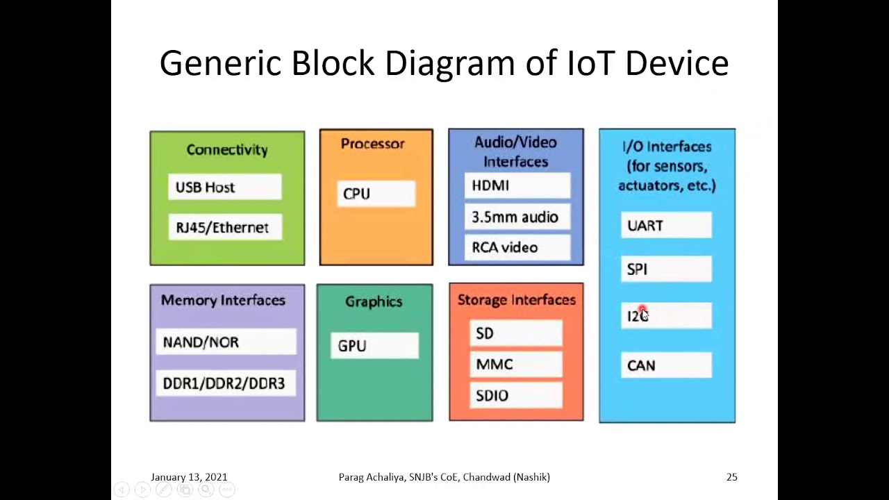

# Unit : 1

## 1) What is IoT, and what does 'Things' refer to in IoT? How does IoT work?

IoT, or the Internet of Things, refers to the network of physical objects or "things" embedded with sensors, software, and other technologies that enable them to connect and exchange data with other devices and systems over the internet. These things can range from simple household items like light bulbs and thermostats to more complex devices like industrial machines and vehicles.

The term "Things" in IoT refers to the physical objects or devices that are equipped with sensors, actuators, and communication interfaces. These devices can collect and exchange data with other devices and systems, enabling them to be monitored, controlled, and optimized remotely.

IoT works by connecting these devices to the internet or a local network, allowing them to communicate with each other and with centralized systems. The devices collect data from their environment using sensors, which is then processed and analyzed to extract meaningful information. This information can be used to automate processes, improve efficiency, and enable new services and applications.

IoT also often involves the use of cloud computing and data analytics to store and process the vast amounts of data generated by these devices. This allows for real-time monitoring and control of devices, as well as the ability to analyze historical data to identify trends and patterns.

Overall, IoT enables the creation of smart, interconnected systems that can improve productivity, efficiency, and convenience in a wide range of applications and industries.

## 2) Explain the evolution of IoT.

The evolution of the Internet of Things (IoT) can be traced back to the late 20th century and has evolved through several key stages:

1. **Early Concepts (Late 20th Century):** The concept of connecting devices and objects to the internet was first proposed in the late 20th century. The idea was to enable these devices to communicate and share data without human intervention.
2. **RFID and Sensor Networks (Early 2000s):** The early 2000s saw the development of technologies like Radio-Frequency Identification (RFID) and wireless sensor networks, which laid the foundation for IoT by enabling objects to be uniquely identified and for data to be collected from the physical world.
3. **M2M Communication (Mid-2000s):** Machine-to-Machine (M2M) communication became more prevalent in the mid-2000s, allowing machines and devices to communicate directly with each other without human intervention. This led to the development of more sophisticated IoT applications in industries like manufacturing, healthcare, and transportation.
4. **Smart Home and Consumer IoT (2010s):** The 2010s saw the rise of consumer IoT devices, such as smart thermostats, smart speakers, and connected appliances. These devices became increasingly popular due to their convenience and ability to improve energy efficiency and home automation.
5. **Industrial IoT (IIoT) and Big Data (2010s):** In parallel with consumer IoT, the industrial sector began adopting IoT technologies to improve efficiency, productivity, and safety. The use of big data analytics became more prevalent, enabling organizations to derive insights from the vast amounts of data generated by IoT devices.
6. **Edge Computing and 5G (2010s-2020s):** As IoT devices proliferated, the need for more efficient ways to process and analyze data led to the rise of edge computing, which allows data to be processed closer to the source. The rollout of 5G networks also promises to further enhance the capabilities of IoT by providing faster and more reliable connectivity.
7. **AI and IoT Integration (Present):** The integration of artificial intelligence (AI) technologies with IoT is becoming increasingly common, enabling IoT devices to become smarter and more autonomous. AI can be used to analyze IoT data in real-time, predict outcomes, and optimize processes.

Overall, the evolution of IoT has been driven by advancements in technology, such as wireless communication, sensors, and data analytics, as well as the increasing demand for connected and smart solutions in both consumer and industrial applications.

## 3) What is the current status and future prospects of IoT?

The current status of IoT is one of rapid growth and adoption across various industries and applications. Here are some key points:

1. **Adoption Across Industries:** IoT is being adopted across industries such as manufacturing, healthcare, transportation, agriculture, smart cities, and retail. Organizations are using IoT to improve efficiency, reduce costs, enhance customer experiences, and create new business models.
2. **Proliferation of Devices:** The number of IoT devices continues to grow rapidly, with estimates ranging from tens of billions to over 100 billion devices by 2030. These devices range from sensors and actuators to smartphones, wearables, and industrial machines.
3. **Data Explosion:** The proliferation of IoT devices is leading to a massive increase in data generation. This data, often referred to as the "IoT data tsunami," presents both opportunities and challenges in terms of data management, storage, and analysis.
4. **Edge Computing:** Edge computing has emerged as a key enabler of IoT, allowing data to be processed closer to the source, reducing latency and bandwidth requirements. This is particularly important for applications that require real-time processing, such as autonomous vehicles and industrial automation.
5. **Security and Privacy Concerns:** As IoT devices become more prevalent, security and privacy concerns have become more pronounced. Issues such as device vulnerabilities, data breaches, and privacy violations are areas of ongoing concern and focus for the IoT industry.
6. **Standardization and Interoperability:** Efforts are underway to standardize IoT technologies and ensure interoperability between devices and platforms. Standards such as MQTT, CoAP, and OPC UA are helping to facilitate communication and integration between IoT devices and systems.

Future prospects for IoT are promising, with several key trends and developments expected to shape the future of IoT:

1. **5G Connectivity:** The rollout of 5G networks is expected to greatly enhance the capabilities of IoT by providing faster, more reliable, and lower-latency connectivity. This will enable new applications and use cases that require high-bandwidth, real-time communication.
2. **AI and Machine Learning:** The integration of AI and machine learning with IoT is expected to drive significant advancements in IoT capabilities. AI can be used to analyze IoT data in real-time, predict outcomes, and optimize processes, enabling more intelligent and autonomous IoT systems.
3. **Edge AI:** Edge AI, which involves running AI algorithms on edge devices, is expected to become more prevalent. This will allow for real-time data analysis and decision-making at the edge, reducing the need to send data back to centralized servers.
4. **Blockchain:** Blockchain technology is being explored as a way to enhance the security, privacy, and trustworthiness of IoT systems. By providing a decentralized and tamper-proof ledger, blockchain can help secure IoT transactions and data exchanges.
5. **Sustainable IoT:** As concerns about environmental sustainability grow, there is a focus on developing IoT solutions that are energy-efficient and environmentally friendly. This includes the use of low-power devices, renewable energy sources, and sustainable manufacturing practices.

Overall, the future of IoT looks bright, with continued innovation and advancements expected to drive further growth and adoption across industries and applications.

## 4) What are the applications of IoT?

The applications of IoT are vast and diverse, spanning across various industries and sectors. Here are some key applications of IoT:

1. **Smart Home:** IoT devices are used in smart homes to automate and control various functions such as lighting, heating, security, and appliances. Examples include smart thermostats, smart lighting systems, and smart locks.
2. **Industrial IoT (IIoT):** In industries, IoT is used for remote monitoring, predictive maintenance, asset tracking, and optimization of processes. IIoT enables factories and plants to improve efficiency, reduce downtime, and enhance safety.
3. **Healthcare:** In healthcare, IoT devices are used for remote patient monitoring, medical asset tracking, and medication management. IoT enables healthcare providers to deliver more personalized and efficient care.
4. **Smart Cities:** IoT is used in smart cities for traffic management, waste management, energy management, and public safety. IoT sensors and devices help cities optimize resources and improve the quality of life for residents.
5. **Agriculture:** In agriculture, IoT is used for precision farming, monitoring soil conditions, crop health, and livestock tracking. IoT helps farmers optimize resources, increase yields, and reduce environmental impact.
6. **Retail:** In retail, IoT is used for inventory management, customer analytics, and personalized marketing. IoT enables retailers to enhance the shopping experience and improve operational efficiency.
7. **Transportation:** In transportation, IoT is used for vehicle tracking, fleet management, and traffic management. IoT helps improve safety, reduce congestion, and optimize transportation systems.
8. **Energy Management:** IoT is used for smart energy management in homes, buildings, and industries. IoT devices help monitor and control energy usage, leading to cost savings and reduced environmental impact.
9. **Environmental Monitoring:** IoT is used for environmental monitoring of air and water quality, pollution levels, and weather conditions. IoT enables better management of natural resources and early detection of environmental hazards.
10. **Supply Chain Management:** In supply chain management, IoT is used for asset tracking, inventory management, and logistics optimization. IoT helps streamline operations and improve transparency in the supply chain.

These are just a few examples of the wide range of applications of IoT. As IoT technology continues to evolve, we can expect to see even more innovative applications across various industries and sectors.

## 5) What are the challenges of IoT?

Despite its many benefits, IoT also presents several challenges that need to be addressed:

1. **Security:** Security is a major concern in IoT due to the large number of devices connected to the internet. IoT devices are often vulnerable to cyberattacks, which can lead to data breaches, privacy violations, and even physical harm.
2. **Privacy:** IoT devices collect and process vast amounts of data, raising concerns about privacy. There is a risk that sensitive information could be exposed or misused if proper privacy protections are not in place.
3. **Interoperability:** The lack of interoperability between different IoT devices and platforms can hinder the scalability and adoption of IoT solutions. Standardization efforts are underway to address this challenge.
4. **Complexity:** IoT systems can be complex, involving a wide range of devices, sensors, networks, and protocols. Managing and maintaining these systems can be challenging, especially for organizations with limited expertise.
5. **Scalability:** As the number of IoT devices continues to grow, scalability becomes a significant challenge. IoT solutions need to be able to scale to support large numbers of devices and users.
6. **Reliability:** IoT devices need to be reliable and available when needed. Downtime or failures can have serious consequences, especially in critical applications such as healthcare or industrial automation.
7. **Data Management:** IoT devices generate vast amounts of data, which can be challenging to manage, store, and analyze. Effective data management strategies are essential to derive meaningful insights from IoT data.
8. **Regulatory Compliance:** IoT solutions need to comply with various regulatory requirements and standards, which can vary depending on the industry and region. Ensuring compliance can be complex and time-consuming.
9. **Power Consumption:** Many IoT devices are powered by batteries, which can limit their lifespan and require frequent maintenance. Improving energy efficiency and optimizing power consumption are ongoing challenges in IoT.
10. **Cost:** Implementing and maintaining IoT solutions can be costly, especially for smaller organizations or in developing countries. Cost-effective solutions and business models are needed to ensure widespread adoption of IoT.

Addressing these challenges requires collaboration between industry stakeholders, policymakers, and researchers to develop standards, best practices, and technologies that can help realize the full potential of IoT while mitigating its risks.

## 6) What are the five characteristics of IoT? Explain them briefly.

The five characteristics of IoT are:

1. **Interconnectivity:** IoT devices are interconnected, allowing them to communicate and share data with each other and with other systems. This interconnectivity enables the creation of smart, interconnected systems.
2. **Sensing:** IoT devices are equipped with sensors that allow them to collect data from their environment. These sensors can measure various parameters such as temperature, humidity, light, motion, and more.
3. **Data Processing:** IoT devices can process the data they collect using onboard processing capabilities or by sending the data to a centralized system for processing. This data processing enables the extraction of meaningful insights from the data.
4. **Automation:** IoT enables automation of processes and tasks by allowing devices to communicate and act autonomously based on the data they collect. This automation can improve efficiency, reduce errors, and enable new capabilities.
5. **Remote Monitoring and Control:** IoT enables remote monitoring and control of devices and systems. This allows users to monitor and control IoT devices from anywhere, enabling new levels of convenience and efficiency.

## 7) What is the physical design of IoT?

The physical design of IoT systems can vary widely depending on the specific application and requirements. However, there are some common components and elements that are typically found in IoT devices and systems:

1. **Sensors and Actuators:** IoT devices are equipped with sensors that collect data from the physical world, such as temperature, humidity, light, motion, and more. Actuators are used to perform actions based on this data, such as turning on a light or opening a valve.
2. **Communication Interfaces:** IoT devices are equipped with communication interfaces that allow them to connect to other devices and systems. Common communication protocols used in IoT include Wi-Fi, Bluetooth, Zigbee, and LoRaWAN.
3. **Microcontrollers or Microprocessors:** IoT devices are powered by microcontrollers or microprocessors that control their operation and data processing. These components are responsible for running the device's firmware and handling data from sensors and communication interfaces.
4. **Power Source:** IoT devices are powered by batteries, solar panels, or other sources of power. Power management is critical in IoT design to ensure that devices can operate reliably for extended periods without requiring frequent battery replacements.
5. **Enclosure:** IoT devices are housed in enclosures that protect them from environmental factors such as moisture, dust, and temperature extremes. The enclosure also provides a physical interface for connecting sensors, actuators, and communication interfaces.
6. **Network Connectivity:** IoT devices are connected to the internet or a local network, allowing them to communicate with other devices and systems. The choice of network connectivity depends on factors such as range, bandwidth, and power consumption requirements.
7. **Data Storage:** IoT devices may have onboard storage for storing data locally or may send data to a centralized system for storage and analysis. The choice of data storage depends on factors such as the volume of data and the need for real-time processing.

Overall, the physical design of IoT systems is highly dependent on the specific requirements of the application and the environment in which the devices will be deployed. Designing an effective IoT system requires careful consideration of factors such as power consumption, communication range, data processing capabilities, and environmental conditions.

## 8) How do IoT devices exchange data with other connected devices and applications? What are the options for IoT devices to process data?

IoT devices exchange data with other connected devices and applications using various communication protocols and methods. Some common options include:

1. **Wi-Fi:** IoT devices can use Wi-Fi to connect to local networks and the internet. Wi-Fi provides high bandwidth and is suitable for applications that require fast data transfer speeds, such as video streaming or large file downloads.
2. **Bluetooth:** Bluetooth is commonly used for short-range communication between IoT devices and smartphones, tablets, or other Bluetooth-enabled devices. Bluetooth Low Energy (BLE) is often used in IoT devices due to its low power consumption.
3. **Zigbee:** Zigbee is a low-power, low-data-rate wireless communication protocol commonly used in IoT devices for home automation, smart lighting, and industrial applications. Zigbee devices form a mesh network, allowing for extended range and improved reliability.
4. **Z-Wave:** Z-Wave is another wireless communication protocol used in IoT devices for home automation and smart home applications. Z-Wave devices form a mesh network, similar to Zigbee, and operate in the sub-1GHz frequency band, providing good range and penetration through walls and floors.
5. **LoRaWAN:** LoRaWAN is a long-range, low-power wireless communication protocol used in IoT devices for applications that require long-distance communication, such as smart agriculture, smart cities, and industrial monitoring. LoRaWAN operates in the unlicensed radio frequency bands, providing coverage over several kilometers.
6. **Cellular Networks:** IoT devices can also communicate over cellular networks, such as 4G LTE or 5G, to connect to the internet. Cellular connectivity provides wide coverage and high reliability but may require a subscription plan and incur data costs.

Options for IoT devices to process data include:

1. **Onboard Processing:** IoT devices can process data locally using onboard microcontrollers or microprocessors. This allows devices to perform real-time data processing and make decisions autonomously without requiring constant communication with a central server.
2. **Edge Computing:** Edge computing involves processing data closer to the source, such as on a gateway device or edge server. Edge computing can reduce latency and bandwidth requirements by processing data locally before sending it to a centralized system for further analysis.
3. **Cloud Computing:** IoT devices can also send data to the cloud for processing and storage. Cloud computing allows for scalable data processing and analysis, enabling the extraction of insights from large volumes of data generated by IoT devices.

The choice of communication protocol and data processing method depends on factors such as the application requirements, power consumption constraints, communication range, and data processing capabilities of the IoT devices.

## 9) How do IoT devices handle data processing locally?

IoT devices can handle data processing locally using onboard microcontrollers or microprocessors. Here's how IoT devices handle data processing locally:

1. **Data Collection:** IoT devices collect data from sensors or other sources in their environment. This data can include temperature, humidity, motion, and more, depending on the sensors available on the device.
2. **Data Preprocessing:** Before processing the data, IoT devices may preprocess it to clean, filter, or aggregate the data. This preprocessing step helps reduce the amount of data that needs to be processed and can improve the accuracy of the analysis.
3. **Data Analysis:** IoT devices use their onboard processing capabilities to analyze the data. This analysis can involve performing calculations, running algorithms, or applying machine learning models to extract insights from the data.
4. **Decision Making:** Based on the results of the data analysis, IoT devices can make decisions autonomously. For example, a smart thermostat may use data from temperature sensors to adjust the temperature settings in a room without human intervention.
5. **Action:** Finally, IoT devices can take action based on the decisions made during the data processing step. This action can range from turning on a light to sending an alert or notification to a user.

By handling data processing locally, IoT devices can reduce the need for constant communication with a central server, which can help reduce latency, improve reliability, and conserve power. However, there are limitations to local data processing, such as limited processing power and storage capacity, which may require offloading some processing tasks to a centralized system or the cloud.

## 10) Draw & Explain generic block diagram of an IoT device.Explain function of each block.



Here's a generic block diagram of an IoT device:

1. **Sensors:** Sensors are used to collect data from the device's environment. These can include temperature sensors, humidity sensors, motion sensors, and more, depending on the application. Sensors convert physical phenomena into electrical signals that can be processed by the device.
2. **Microcontroller/Microprocessor:** The microcontroller or microprocessor is the brain of the IoT device. It processes data from sensors, controls actuators, and manages communication with other devices and systems. The choice of microcontroller or microprocessor depends on the processing power and connectivity requirements of the device.
3. **Memory:** Memory is used to store program code, data, and configurations. It includes both volatile memory (RAM) for temporary storage and non-volatile memory (e.g., flash memory) for permanent storage.
4. **Communication Interface:** The communication interface enables the IoT device to connect to other devices and systems. This can include wired interfaces such as Ethernet or USB, or wireless interfaces such as Wi-Fi, Bluetooth, Zigbee, or cellular.
5. **Power Management:** Power management circuitry manages the device's power supply. This includes regulating voltage levels, managing battery power, and implementing power-saving features to extend battery life.
6. **Actuators:** Actuators are used to perform actions based on data processed by the device. Examples include motors, valves, relays, and LEDs. Actuators convert electrical signals into physical actions.
7. **User Interface:** The user interface allows users to interact with the device. This can include buttons, switches, displays, and indicators. The user interface can also include interfaces for configuration and setup.
8. **Security:** Security features protect the device from unauthorized access, data breaches, and other security threats. This can include encryption, authentication, secure boot, and secure firmware update mechanisms.
9. **Real-Time Clock (RTC):** The RTC provides the device with an accurate sense of time. This is important for time-sensitive applications and for scheduling tasks.
10. **External Interfaces:** External interfaces allow the device to connect to external peripherals or expansion modules. Examples include GPIO (General Purpose Input/Output) pins, I2C, SPI, and UART interfaces.

Overall, the block diagram illustrates how an IoT device collects data from its environment, processes it, communicates with other devices and systems, and performs actions based on the processed data. Each block plays a crucial role in the functioning of the IoT device.

## 11) What are the building blocks of IoT ? Give examples of each.

The building blocks of IoT can be categorized into four main components:

1. **End Devices / Nodes:** These are the physical devices that collect data from the environment or perform actions based on received instructions. End devices include sensors, actuators, and other IoT devices. Examples include temperature sensors, smart lights, and industrial machines.
2. **Gateways / Local Processing Nodes:** Gateways are intermediary devices that provide connectivity between end devices and the broader network, such as the internet or a local network. Gateways often perform local data processing, aggregation, and protocol translation to reduce the amount of data sent over the network. They can also provide additional security and manageability features.
3. **Connectivity:** Connectivity refers to the various communication technologies used to connect IoT devices and gateways to the network. This includes wireless technologies such as Wi-Fi, Bluetooth, Zigbee, and cellular, as well as wired technologies like Ethernet and Power over Ethernet (PoE). The choice of connectivity technology depends on factors such as range, bandwidth, power consumption, and scalability requirements.
4. **Cloud-Based Application and Storage:** Cloud-based applications and storage provide the infrastructure for processing, analyzing, and storing data collected from IoT devices. Cloud services offer scalability, flexibility, and accessibility, allowing organizations to manage and analyze large volumes of IoT data. Examples of cloud-based IoT platforms include AWS IoT, Azure IoT, and Google Cloud IoT Core.

These building blocks work together to enable the collection, processing, and analysis of data from IoT devices, leading to insights and actionable information that can be used to improve processes, optimize resource utilization, and create new business opportunities.

# Programming Questions

## 1) Turn an LED on and off using Arduino's digital output pins

To turn an LED on and off using Arduino's digital output pins, you can use the following Arduino sketch:

```cpp
// Pin connected to the LED
const int ledPin = 13;

void setup() {
  // Initialize the digital pin as an output
  pinMode(ledPin, OUTPUT);
}

void loop() {
  // Turn the LED on
  digitalWrite(ledPin, HIGH);
  delay(1000); // Wait for 1 second

  // Turn the LED off
  digitalWrite(ledPin, LOW);
  delay(1000); // Wait for 1 second
}

```

In this sketch, we first define the `ledPin` variable to specify which digital pin the LED is connected to (in this case, pin 13). In the `setup()` function, we set the `ledPin` as an output using `pinMode(ledPin, OUTPUT)`.

In the `loop()` function, we use `digitalWrite(ledPin, HIGH)` to turn the LED on by setting the `ledPin` to HIGH, which provides 5V to the LED. We then use `delay(1000)` to wait for 1 second before turning the LED off.

We repeat the process by setting the `ledPin` to LOW with `digitalWrite(ledPin, LOW)` to turn the LED off and then wait for another 1 second using `delay(1000)`. This loop continues indefinitely, causing the LED to blink on and off every second.

## 2) Control an LED's state using a push button connected to an Arduino.

To control an LED's state using a push button connected to an Arduino, you can use the following Arduino sketch:

```cpp
// Pin connected to the LED
const int ledPin = 13;

// Pin connected to the push button
const int buttonPin = 2;

// Variable to store the current state of the button
int buttonState = 0;

// Variable to store the previous state of the button
int lastButtonState = 0;

void setup() {
  // Initialize the LED pin as an output
  pinMode(ledPin, OUTPUT);

  // Initialize the button pin as an input
  pinMode(buttonPin, INPUT);
}

void loop() {
  // Read the state of the button
  buttonState = digitalRead(buttonPin);

  // Check if the button state has changed
  if (buttonState != lastButtonState) {
    // If the button is pressed (LOW), turn the LED on
    if (buttonState == LOW) {
      digitalWrite(ledPin, HIGH);
    } else {
      // If the button is released (HIGH), turn the LED off
      digitalWrite(ledPin, LOW);
    }
    // Update the last button state
    lastButtonState = buttonState;
  }
}

```

In this sketch, we define the `ledPin` and `buttonPin` variables to specify which pins the LED and push button are connected to (pin 13 and pin 2, respectively, in this example).

In the `setup()` function, we set the `ledPin` as an output using `pinMode(ledPin, OUTPUT)` and the `buttonPin` as an input using `pinMode(buttonPin, INPUT)`.

In the `loop()` function, we continuously read the state of the button using `digitalRead(buttonPin)` and store it in the `buttonState` variable. We then check if the button state has changed since the last iteration. If it has, we check if the button is pressed (LOW state) and turn the LED on by setting the `ledPin` to HIGH using `digitalWrite(ledPin, HIGH)`. If the button is released (HIGH state), we turn the LED off by setting the `ledPin` to LOW using `digitalWrite(ledPin, LOW)`.

By doing this, the LED will turn on when the button is pressed and turn off when the button is released.

## 3) Make an LEDs blink in a particular pattern using Arduino.

To control an LED's state using a push button connected to an Arduino, you can use the following sketch:

```cpp
// Pin connected to the LED
const int ledPin = 13;

// Pin connected to the push button
const int buttonPin = 2;

// Variable to store the button state
int buttonState = 0;

void setup() {
  // Initialize the LED pin as an output
  pinMode(ledPin, OUTPUT);

  // Initialize the button pin as an input
  pinMode(buttonPin, INPUT);
}

void loop() {
  // Read the state of the button
  buttonState = digitalRead(buttonPin);

  // If the button is pressed, turn on the LED
  if (buttonState == HIGH) {
    digitalWrite(ledPin, HIGH);
  } else {
    // Otherwise, turn off the LED
    digitalWrite(ledPin, LOW);
  }
}

```

In this sketch, we define the `ledPin` and `buttonPin` variables to specify which digital pins the LED and push button are connected to, respectively. We also define a `buttonState` variable to store the state of the button (HIGH or LOW).

In the `setup()` function, we set the `ledPin` as an output using `pinMode(ledPin, OUTPUT)` and the `buttonPin` as an input using `pinMode(buttonPin, INPUT)`.

In the `loop()` function, we use `digitalRead(buttonPin)` to read the state of the button. If the button is pressed (i.e., the button state is `HIGH`), we turn on the LED by setting the `ledPin` to `HIGH` using `digitalWrite(ledPin, HIGH)`. Otherwise, we turn off the LED by setting the `ledPin` to `LOW` using `digitalWrite(ledPin, LOW)`.

This way, the LED will turn on when the button is pressed and turn off when the button is released.

## 4) Design and Implement a circuit using multiple Light Emitting Diodes (LEDs) and multiple Push Buttons.

To design and implement a circuit using multiple Light Emitting Diodes (LEDs) and multiple Push Buttons with an Arduino, you can follow this circuit diagram and code:

### Circuit Diagram:

```
          +5V
           │
           ▼
     ┌───────────────┐
     │               │
     │               │
     │               │
     │               │
     │               │
     │               │
     │               │
     │               │
     └───────────────┘
           │   │   │
           │   │   │
     ┌─────┘   │   └─────┐
     │         │         │
    LED       LED       LED
     │         │         │
     └─────────┘         │
           │             │
           ▼             │
     ┌───────────────────┘
     │
     │
     │
   Push Button
     │
     ▼
   GND

```

### Arduino Sketch:

```cpp
// Pin connected to the LEDs
const int ledPins[] = {2, 3, 4}; // Change these pins based on your circuit

// Pin connected to the push buttons
const int buttonPins[] = {5, 6, 7}; // Change these pins based on your circuit

void setup() {
  // Initialize the LED pins as outputs
  for (int i = 0; i < 3; i++) {
    pinMode(ledPins[i], OUTPUT);
  }

  // Initialize the push button pins as inputs
  for (int i = 0; i < 3; i++) {
    pinMode(buttonPins[i], INPUT);
    digitalWrite(buttonPins[i], HIGH); // Enable internal pull-up resistor
  }
}

void loop() {
  // Read the state of each push button
  for (int i = 0; i < 3; i++) {
    if (digitalRead(buttonPins[i]) == LOW) {
      // If the button is pressed, turn on the corresponding LED
      digitalWrite(ledPins[i], HIGH);
    } else {
      // Otherwise, turn off the LED
      digitalWrite(ledPins[i], LOW);
    }
  }
}

```

In this circuit, each push button is connected to a digital pin on the Arduino with the other terminal connected to ground (GND) to complete the circuit when pressed. Each LED is connected to a digital pin on the Arduino with a current-limiting resistor in series to limit the current flowing through the LED.

The Arduino sketch initializes the LED pins as outputs and the push button pins as inputs with the internal pull-up resistor enabled. In the `loop()` function, it continuously checks the state of each push button. If a button is pressed (i.e., its state is `LOW`), it turns on the corresponding LED by setting the LED pin to `HIGH`. Otherwise, it turns off the LED by setting the LED pin to `LOW`.

## 5) Design and Implementation of Arduino-Based Circuit for Generating Multiple Tones Using a single Piezo Buzzer.

To generate multiple tones using a single piezo buzzer with an Arduino, you can use the following circuit and code. The circuit includes a piezo buzzer connected to a digital pin of the Arduino and push buttons to select different tones.

### Circuit Diagram:

```
    +5V
     |
     \
     /
Piezo Buzzer (+)-------- Digital Pin 9
     \
     /
     |
    GND

```

### Arduino Sketch:

```cpp
// Define the pins for the piezo buzzer and push buttons
#define PIEZO_PIN 9
#define BUTTON1_PIN 2
#define BUTTON2_PIN 3
#define BUTTON3_PIN 4

// Define the frequencies for the tones
#define TONE1_FREQUENCY 262 // Middle C
#define TONE2_FREQUENCY 330 // E
#define TONE3_FREQUENCY 392 // G

void setup() {
  // Initialize the piezo buzzer and push button pins
  pinMode(PIEZO_PIN, OUTPUT);
  pinMode(BUTTON1_PIN, INPUT_PULLUP);
  pinMode(BUTTON2_PIN, INPUT_PULLUP);
  pinMode(BUTTON3_PIN, INPUT_PULLUP);
}

void loop() {
  // Check if button 1 is pressed
  if (digitalRead(BUTTON1_PIN) == LOW) {
    tone(PIEZO_PIN, TONE1_FREQUENCY);
    delay(200); // Delay for button debounce
  }

  // Check if button 2 is pressed
  if (digitalRead(BUTTON2_PIN) == LOW) {
    tone(PIEZO_PIN, TONE2_FREQUENCY);
    delay(200); // Delay for button debounce
  }

  // Check if button 3 is pressed
  if (digitalRead(BUTTON3_PIN) == LOW) {
    tone(PIEZO_PIN, TONE3_FREQUENCY);
    delay(200); // Delay for button debounce
  }

  // Stop the tone when no button is pressed
  noTone(PIEZO_PIN);
}

```

### Explanation:

- The piezo buzzer is connected to digital pin 9 of the Arduino.
- Three push buttons are connected to digital pins 2, 3, and 4 of the Arduino with pull-up resistors.
- Each button is associated with a different frequency, and when pressed, the corresponding tone is generated using the `tone()` function.
- The `delay(200)` is used for button debounce, ensuring that a single button press results in a single tone.
- The `noTone()` function is used to stop the tone when no button is pressed.

This circuit allows you to generate multiple tones using a single piezo buzzer and select different tones using push buttons connected to the Arduino.

## 6) Design and Implementation of Arduino-Based Circuit for Generating Multiple Tones Using a multiple Piezo Buzzer.

To generate multiple tones using multiple piezo buzzers with an Arduino, you can use the following circuit and code. The circuit includes multiple piezo buzzers connected to different digital pins of the Arduino, and push buttons to select different tones.

### Circuit Diagram:

```
    +5V
     |
     \
     /
Piezo Buzzer 1 (+)------ Digital Pin 9
     \
     /
     |
    GND

    +5V
     |
     \
     /
Piezo Buzzer 2 (+)------ Digital Pin 10
     \
     /
     |
    GND

    +5V
     |
     \
     /
Piezo Buzzer 3 (+)------ Digital Pin 11
     \
     /
     |
    GND

    +5V
     |
     \
     /
Push Button 1 -------- Digital Pin 2
     \
     /
     |
    GND

    +5V
     |
     \
     /
Push Button 2 -------- Digital Pin 3
     \
     /
     |
    GND

    +5V
     |
     \
     /
Push Button 3 -------- Digital Pin 4
     \
     /
     |
    GND

```

### Arduino Sketch:

```cpp
// Define the pins for the piezo buzzers and push buttons
#define PIEZO_PIN_1 9
#define PIEZO_PIN_2 10
#define PIEZO_PIN_3 11
#define BUTTON1_PIN 2
#define BUTTON2_PIN 3
#define BUTTON3_PIN 4

// Define the frequencies for the tones
#define TONE1_FREQUENCY 262 // Middle C
#define TONE2_FREQUENCY 330 // E
#define TONE3_FREQUENCY 392 // G

void setup() {
  // Initialize the piezo buzzer and push button pins
  pinMode(PIEZO_PIN_1, OUTPUT);
  pinMode(PIEZO_PIN_2, OUTPUT);
  pinMode(PIEZO_PIN_3, OUTPUT);
  pinMode(BUTTON1_PIN, INPUT_PULLUP);
  pinMode(BUTTON2_PIN, INPUT_PULLUP);
  pinMode(BUTTON3_PIN, INPUT_PULLUP);
}

void loop() {
  // Check if button 1 is pressed
  if (digitalRead(BUTTON1_PIN) == LOW) {
    tone(PIEZO_PIN_1, TONE1_FREQUENCY);
    delay(200); // Delay for button debounce
  } else {
    noTone(PIEZO_PIN_1);
  }

  // Check if button 2 is pressed
  if (digitalRead(BUTTON2_PIN) == LOW) {
    tone(PIEZO_PIN_2, TONE2_FREQUENCY);
    delay(200); // Delay for button debounce
  } else {
    noTone(PIEZO_PIN_2);
  }

  // Check if button 3 is pressed
  if (digitalRead(BUTTON3_PIN) == LOW) {
    tone(PIEZO_PIN_3, TONE3_FREQUENCY);
    delay(200); // Delay for button debounce
  } else {
    noTone(PIEZO_PIN_3);
  }
}

```

### Explanation:

- Three piezo buzzers are connected to digital pins 9, 10, and 11 of the Arduino.
- Three push buttons are connected to digital pins 2, 3, and 4 of the Arduino with pull-up resistors.
- Each button is associated with a different frequency, and when pressed, the corresponding tone is generated using the `tone()` function.
- The `delay(200)` is used for button debounce, ensuring that a single button press results in a single tone.
- The `noTone()` function is used to stop the tone when no button is pressed.

This circuit allows you to generate multiple tones using multiple piezo buzzers and select different tones using push buttons connected to the Arduino.

## 7) Design and implement an Arduino 7 Segment Display circuit using Tinkercad.

To design and implement an Arduino 7-segment display circuit using Tinkercad, follow these steps:

### Components Needed:

- Arduino Uno
- 7-segment display (common cathode)
- 220 ohm resistors (7 pieces)
- Jumper wires

### Arduino Sketch:

```cpp
const int SEGMENT_A = 2;
const int SEGMENT_B = 3;
const int SEGMENT_C = 4;
const int SEGMENT_D = 5;
const int SEGMENT_E = 6;
const int SEGMENT_F = 7;
const int SEGMENT_G = 8;

void setup() {
  pinMode(SEGMENT_A, OUTPUT);
  pinMode(SEGMENT_B, OUTPUT);
  pinMode(SEGMENT_C, OUTPUT);
  pinMode(SEGMENT_D, OUTPUT);
  pinMode(SEGMENT_E, OUTPUT);
  pinMode(SEGMENT_F, OUTPUT);
  pinMode(SEGMENT_G, OUTPUT);
}

void loop() {
  displayDigit(0);
  delay(1000);

  displayDigit(1);
  delay(1000);

  displayDigit(2);
  delay(1000);

  displayDigit(3);
  delay(1000);

  displayDigit(4);
  delay(1000);

  displayDigit(5);
  delay(1000);

  displayDigit(6);
  delay(1000);

  displayDigit(7);
  delay(1000);

  displayDigit(8);
  delay(1000);

  displayDigit(9);
  delay(1000);
}

void displayDigit(int digit) {
  switch (digit) {
    case 0:
      digitalWrite(SEGMENT_A, HIGH);
      digitalWrite(SEGMENT_B, HIGH);
      digitalWrite(SEGMENT_C, HIGH);
      digitalWrite(SEGMENT_D, HIGH);
      digitalWrite(SEGMENT_E, HIGH);
      digitalWrite(SEGMENT_F, HIGH);
      digitalWrite(SEGMENT_G, LOW);
      break;
    case 1:
      digitalWrite(SEGMENT_A, LOW);
      digitalWrite(SEGMENT_B, HIGH);
      digitalWrite(SEGMENT_C, HIGH);
      digitalWrite(SEGMENT_D, LOW);
      digitalWrite(SEGMENT_E, LOW);
      digitalWrite(SEGMENT_F, LOW);
      digitalWrite(SEGMENT_G, LOW);
      break;
    case 2:
      // Define segment states for digit 2
      break;
    // Define segment states for other digits
  }
}

```

### Explanation:

- Connect the common cathode pin of the 7-segment display to GND.
- Connect each segment pin (A-G) of the 7-segment display to the Arduino through a 220 ohm resistor.
- In the Arduino sketch, the `displayDigit()` function is used to display a digit (0-9) on the 7-segment display. Each digit is represented by turning on/off the corresponding segments (A-G).

You can modify the `displayDigit()` function to define the segment states for each digit and customize the display sequence as needed.

## 8) To control the color output of the RGB LED using an Arduino Uno in Tinkercad.

To control the color output of an RGB LED using an Arduino Uno in Tinkercad, follow these steps:

### Components Needed:

- Arduino Uno
- RGB LED
- 3 x 220 ohm resistors
- Jumper wires

### Circuit Diagram:

Connect the RGB LED to the Arduino Uno as follows:

- The longer leg (anode) of the RGB LED is connected to digital pins 9, 10, and 11 through 220 ohm resistors.
- The shorter leg (cathode) of the RGB LED is connected to GND.

### Arduino Sketch:

```cpp
int redPin = 9;    // Red LED connected to digital pin 9
int greenPin = 10;  // Green LED connected to digital pin 10
int bluePin = 11;   // Blue LED connected to digital pin 11

void setup() {
  pinMode(redPin, OUTPUT);    // sets the redPin to be an output
  pinMode(greenPin, OUTPUT);  // sets the greenPin to be an output
  pinMode(bluePin, OUTPUT);   // sets the bluePin to be an output
}

void loop() {
  setColor(255, 0, 0);  // red
  delay(1000);          // 1 second delay

  setColor(0, 255, 0);  // green
  delay(1000);          // 1 second delay

  setColor(0, 0, 255);  // blue
  delay(1000);          // 1 second delay
}

void setColor(int red, int green, int blue) {
  analogWrite(redPin, red);      // sets the intensity of red
  analogWrite(greenPin, green);  // sets the intensity of green
  analogWrite(bluePin, blue);    // sets the intensity of blue
}

```

### Explanation:

- In the circuit, the RGB LED's anode (longer leg) is connected to digital pins 9, 10, and 11 through 220 ohm resistors. The cathode (shorter leg) is connected to GND.
- The `setColor()` function takes three arguments (red, green, blue) representing the intensity of each color (0-255). These values are used with `analogWrite()` to set the PWM (Pulse Width Modulation) values for each color, controlling the brightness and thus the color of the LED.

This setup allows you to control the color output of the RGB LED by adjusting the intensity of each color component (red, green, blue) using the Arduino Uno in Tinkercad.

## 9) To Interface LCD (Liquid Crystal Display) with Arduino Uno in Tinkercad.

To interface an LCD (Liquid Crystal Display) with an Arduino Uno in Tinkercad, you can follow these steps:

### Components Needed:

- Arduino Uno
- LCD (16x2 or 20x4)
- Potentiometer (10k ohm)
- Jumper wires

### Circuit Diagram:

Connect the components as shown in the diagram below:

```
     +5V
      |
     __
    |   |
    |  -----
    | | LCD |   (16x2 or 20x4)
    | |     |
    |  -----
    |   | |
    |   | |
    |   | |
    |   | |
    |   | |
    |  |   |
    |  |___|
    |   | |
    |  _|_|_
    | |  |  |
    | |  |  |
    | |  |  |
    | |  |  |
    | |  |  |
    | |  |  |
    | |  |  |
    | |__|__|
    | |  |  |
    | |__|__|
    |   | |
   GND GND

```

### Arduino Sketch:

```cpp
#include <LiquidCrystal.h>

// Define the LCD pins
const int rs = 12, en = 11, d4 = 5, d5 = 4, d6 = 3, d7 = 2;
LiquidCrystal lcd(rs, en, d4, d5, d6, d7);

void setup() {
  // Set up the number of columns and rows on the LCD
  lcd.begin(16, 2);
}

void loop() {
  // Print a message on the LCD
  lcd.clear();
  lcd.setCursor(0, 0);
  lcd.print("Hello, World!");
  delay(1000);

  // Scroll the message
  for (int i = 0; i < 16; i++) {
    lcd.scrollDisplayLeft();
    delay(300);
  }
}

```

### Explanation:

- Connect the LCD's VSS pin to GND, VDD pin to +5V, and V0 pin to the center pin of the potentiometer.
- Connect the LCD's RS, EN, and D4-D7 pins to digital pins 12, 11, and 5-2 on the Arduino, respectively.
- In the Arduino sketch, include the `LiquidCrystal.h` library and define the LCD object with the pins connected to the Arduino.
- In the `setup()` function, initialize the LCD with the number of columns and rows (16x2 or 20x4).
- In the `loop()` function, clear the LCD and print a message. Then, scroll the message horizontally by shifting the display content.

## 10) To Connect an LED and an LCD to Arduino in Tinkercad to light up the LED and show a message on the LCD simultaneously.

To connect an LED and an LCD to an Arduino Uno in Tinkercad to light up the LED and show a message on the LCD simultaneously, you can use the following circuit and Arduino sketch:

### Circuit Diagram:

- Connect the positive (longer) leg of the LED to digital pin 13 of the Arduino Uno through a 220 ohm resistor.
- Connect the negative (shorter) leg of the LED to GND.
- Connect the LCD display to the Arduino Uno as follows:
  - VSS to GND
  - VDD to +5V
  - VO to a potentiometer's middle pin (for contrast adjustment)
  - RS to digital pin 7
  - RW to GND
  - E to digital pin 6
  - D4-D7 to digital pins 5, 4, 3, 2 respectively
  - A to +5V
  - K to GND

### Arduino Sketch:

```cpp
#include <LiquidCrystal.h>

// Initialize the LCD library with the numbers of the interface pins
LiquidCrystal lcd(7, 6, 5, 4, 3, 2);

const int ledPin = 13;

void setup() {
  // Set the LED pin as an output
  pinMode(ledPin, OUTPUT);

  // Set up the LCD's number of columns and rows
  lcd.begin(16, 2);

  // Print a message to the LCD
  lcd.print("Hello, Tinkercad!");
}

void loop() {
  // Turn on the LED
  digitalWrite(ledPin, HIGH);

  // Set the cursor to column 0, line 1
  // (note: line 1 is the second row, since counting begins with 0)
  lcd.setCursor(0, 1);

  // Print the number of seconds since reset
  lcd.print(millis() / 1000);

  // Delay for 1 second
  delay(1000);

  // Turn off the LED
  digitalWrite(ledPin, LOW);

  // Set the cursor to column 0, line 1
  lcd.setCursor(0, 1);

  // Clear the line
  lcd.print("        ");

  // Delay for 1 second
  delay(1000);
}

```

### Explanation:

- The sketch initializes the LCD library with the pin numbers for the RS, E, D4, D5, D6, and D7 pins of the LCD.
- In the `setup()` function, it sets the LED pin as an output and initializes the LCD with 16 columns and 2 rows.
- It then prints a message to the LCD.
- In the `loop()` function, it turns on the LED, prints the number of seconds since reset to the second line of the LCD, delays for 1 second, turns off the LED, clears the second line of the LCD, and delays for another second.
- This loop repeats, causing the LED to blink and the LCD to display the number of seconds since reset in the second line.
