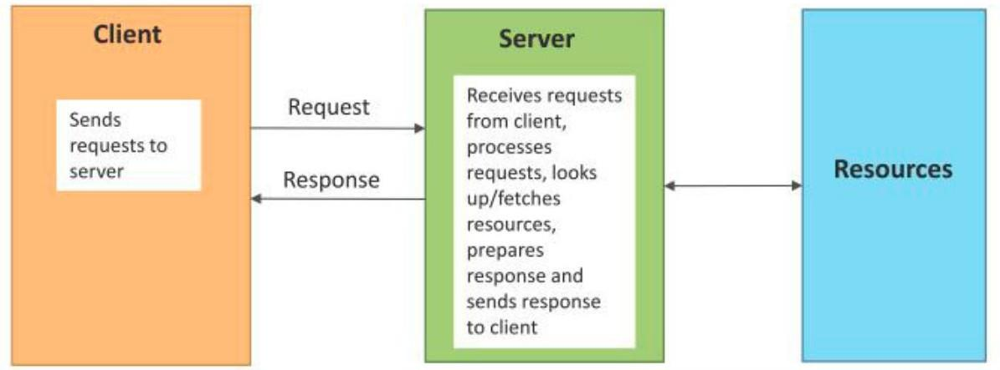
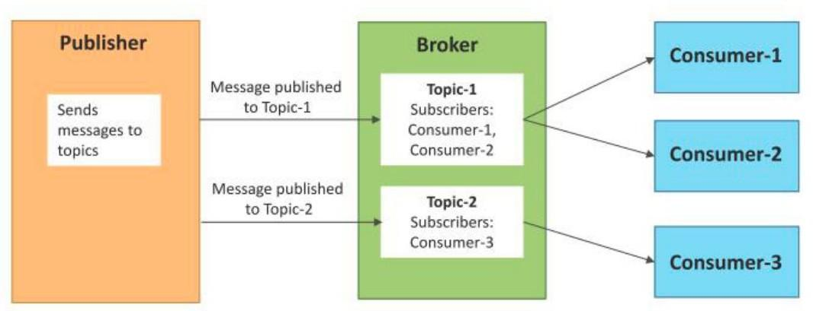
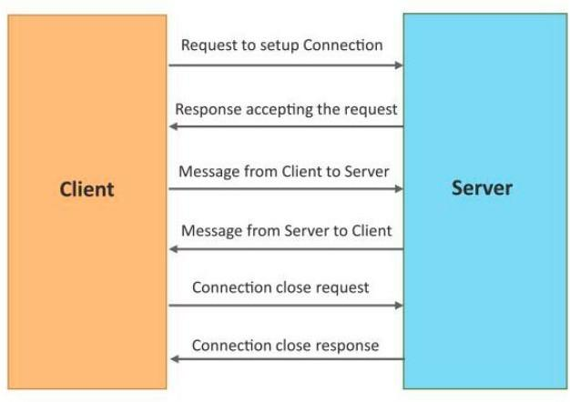

# Unit 2

# Unit : 2

## 1) Outline the logical design of an IoT device and detail the function of each block.

Logical design of an IoT System refers to an abstract representation of the entities and processes without going in to low level specifics of the implementation.

An IoT system comprises of a number of functional blocks that provide the system the capabilities for identification, sensing, actuation, communication and management.

**Function of blocks:**

- Application : Provides an interface that Users use to monitor or control device.
- Services : Services for data publishing, device discovery etc.
- Communication : Handles communication for the IoT System.
- Device : Provide Sensing, actuation, monitioring and control functions
- Management : Various Function to govern the IoT system.
- Security : Provide functions such as authentication, authorization, data security

## 2) List the essential functional components found in IoT devices and explain their respective functions. (IoT Functional block)

**IoT Functional Block:**

- Device : Provide Sensing, actuation, monitioring and control functions
- Communication : Handles communication for the IoT System.
- Services : Services for data publishing, device discovery etc.
- Management : Various Function to govern the IoT system.
- Security : Provide functions such as authentication, authorization, data security
- Application : Provides an interface that Users use to monitor or control device.

## 3) Discuss various communication models in IoT, including Request-Response, Publish-Subscribe, Push-Pull, and Exclusive Pair, with diagrams & descriptions.

**1. Request-Response Model:**

- Request-Response is a communication model in which the client sends requests to the server and the server responds to the requests.
- When the server receives a request, it decides how to respond, fetches the data,retrieves resource representations, prepares the response, and then sends the response to the client.

**2. Publish-Subscribe Model:**

- Publish-Subscribe is a communication model that involves publishers, brokers and consumers.
- Publishers are the source of data. Publishers send the data to the topics which are managed by the Publishersbroker.
- When the broker receives data for a topic from the publisher, it sends the data to all the subscribed consumers.

**3. Push-Pull Model:**

- Push-Pull is a communication model in which the data producers push the data to queues and the consumers pull the data from the queues. Producers do not need to be aware of the consumers.
- Qeues also act as a buffer which helps in situations when there is a mismatch between the rate at which the producers push data and the rate at which the customer pull data.

**4. Exclusive Pair Model:**

- Exclusive Pair is a bidirectional, fully duplex communication model that uses a persistent connection between the client and server.
- Once the connection is setup it remains open until the client sends a request to close the connection.
- Client and server can send messages to each other after connection setup.

## 4) Clarify how IoT devices establish communication with the network.

IoT devices establish communication with the network using various communication technologies, depending on the specific requirements of the application. Some common methods include:

1. **Wi-Fi:** IoT devices can connect to Wi-Fi networks, allowing them to communicate with other devices and the internet. Wi-Fi is suitable for applications where high data transfer rates and relatively short distances are required.
2. **Bluetooth:** Bluetooth is used for short-range communication between IoT devices and smartphones, tablets, or other Bluetooth-enabled devices. It is commonly used in applications such as wearable devices and smart home appliances.
3. **Zigbee:** Zigbee is a low-power, low-data-rate wireless communication technology used in IoT devices for home automation, industrial control, and smart energy applications. It operates on the 2.4 GHz frequency band and is known for its low power consumption and long battery life.
4. **LoRaWAN:** LoRaWAN (Long Range Wide Area Network) is a wireless communication technology that enables long-range communication between IoT devices and a LoRaWAN gateway. It is ideal for applications that require long-range communication and low power consumption, such as smart agriculture and asset tracking.
5. **Cellular:** IoT devices can also connect to cellular networks (e.g., 2G, 3G, 4G, or 5G) to communicate with other devices and the internet. Cellular connectivity is suitable for applications that require high-speed data transfer and wide coverage areas.
6. **Ethernet:** Some IoT devices use Ethernet connections to connect to local networks or the internet. Ethernet provides a reliable and high-speed connection, making it suitable for applications where data transfer speed is critical.
7. **NFC (Near Field Communication):** NFC is a short-range wireless communication technology that allows IoT devices to establish communication by bringing them close together. It is commonly used in contactless payment systems and access control applications.

The choice of communication technology depends on factors such as the range of communication required, power consumption constraints, data transfer rates, and the specific requirements of the IoT application.

## 5) Explain the necessity of IoT protocols and networks.

Communication Standardization: IoT protocols ensure that devices understand each other's messages. It's like having a common language that all devices agree upon, allowing them to share information and instructions without confusion.

Interoperability: Different IoT devices are made by different manufacturers, and they may use different technologies. IoT protocols ensure that devices from different brands can work together harmoniously, just like your TV remote can control your TV regardless of the brand.

Efficient Data Exchange: IoT protocols define how data is formatted and transmitted between devices. This ensures that information is sent and received in a way that is efficient, quick, and reliable, making your smart home or other IoT applications run smoothly.

Security: IoT protocols often include security measures to protect the data exchanged between devices. This is important to prevent unauthorized access and ensure the privacy and safety of the information being shared.

## 6) Elaborate on various types of Wireless Communication Protocols/Wireless IoT Networks.

- Zigbee
- BluetoothWi-Fi:
- LoRaWAN
- M2M – 2G, 3G, 4G & 5G networks
- NB-IoT

Sure, here's an elaboration on various types of wireless communication protocols and networks used in IoT:

1. **Zigbee:**
   - Zigbee is a low-power, low-data-rate wireless communication protocol used for short-range communication in IoT devices.
   - It operates on the IEEE 802.15.4 standard and is suitable for applications requiring low power consumption, such as smart home automation, industrial control, and healthcare monitoring.
   - Zigbee uses a mesh network topology, allowing devices to communicate with each other and extend the network's range by relaying data through neighboring devices.
2. **Bluetooth:**
   - Bluetooth is a short-range wireless communication protocol used for connecting IoT devices to smartphones, tablets, and other Bluetooth-enabled devices.
   - It is commonly used in wearable devices, smart home appliances, and healthcare devices.
   - Bluetooth Low Energy (BLE) is a variant of Bluetooth that consumes less power, making it suitable for IoT applications requiring low power consumption.
3. **Wi-Fi:**
   - Wi-Fi is a widely used wireless communication protocol that provides high-speed internet connectivity to IoT devices.
   - It is suitable for applications requiring high data transfer rates, such as video streaming, online gaming, and cloud-based applications.
   - Wi-Fi networks can be easily set up and configured, making them ideal for smart home and office environments.
4. **LoRaWAN:**
   - LoRaWAN (Long Range Wide Area Network) is a wireless communication protocol used for long-range communication between IoT devices and a LoRaWAN gateway.
   - It is suitable for applications requiring long-range communication, such as smart agriculture, asset tracking, and smart city deployments.
   - LoRaWAN is designed to operate in unlicensed frequency bands, enabling cost-effective deployment of IoT networks.
5. **M2M (Machine-to-Machine) – 2G, 3G, 4G & 5G networks:**
   - M2M communication refers to the direct communication between IoT devices using cellular networks (2G, 3G, 4G, or 5G).
   - These networks provide wide coverage and high data transfer rates, making them suitable for applications requiring real-time data transmission, such as industrial automation, remote monitoring, and fleet management.
6. **NB-IoT (Narrowband IoT):**
   - NB-IoT is a low-power, wide-area network (LPWAN) technology designed for IoT applications that require long battery life, extended coverage, and low data rates.
   - It is suitable for applications such as smart metering, smart agriculture, and asset tracking, where devices are deployed in remote or hard-to-reach locations.

These wireless communication protocols and networks offer a range of options for IoT deployments, allowing developers to choose the most suitable technology based on their specific requirements for range, power consumption, data transfer rates, and coverage.

## 7) Elaborate/Explain/Discuss on various types of Wired Communication Protocols for Wireless IoT Networks.

- MQTT (Message Queuing Telemetry Transport):
- CoAP (Constrained Application Protocol):
- HTTP/HTTPS
- DDS (Data Distribution Service)
- AMQP (Advanced Message Queuing Protocol)

Here's an explanation of various wired communication protocols commonly used in wireless IoT networks:

1. **MQTT (Message Queuing Telemetry Transport):**
   - MQTT is a lightweight publish-subscribe messaging protocol designed for constrained devices and low-bandwidth, high-latency, or unreliable networks.
   - It is widely used in IoT applications for its simplicity and efficiency in delivering messages between devices and servers.
   - MQTT uses a client-server architecture, where clients (IoT devices) publish messages to a broker (server), and other clients subscribe to topics to receive messages.
2. **CoAP (Constrained Application Protocol):**
   - CoAP is a specialized web transfer protocol for use with constrained nodes and constrained networks in IoT applications.
   - It is designed to be lightweight and efficient, suitable for devices with limited processing power and memory.
   - CoAP uses a client-server model similar to HTTP, with methods such as GET, POST, PUT, and DELETE for interacting with resources on IoT devices.
3. **HTTP/HTTPS:**
   - HTTP (Hypertext Transfer Protocol) and its secure variant HTTPS are widely used protocols for communication between web servers and clients.
   - While not specifically designed for IoT, HTTP/HTTPS are commonly used in IoT applications for their simplicity and compatibility with existing web technologies.
   - IoT devices can use HTTP/HTTPS to send data to and receive data from web servers, enabling integration with cloud services and web applications.
4. **DDS (Data Distribution Service):**
   - DDS is a standard for real-time, scalable, and high-performance data distribution middleware for IoT and other distributed systems.
   - It is designed to efficiently distribute data among devices in a network, with support for real-time data sharing, quality of service (QoS) policies, and data-centric publish-subscribe communication.
5. **AMQP (Advanced Message Queuing Protocol):**
   - AMQP is an open standard application layer protocol for message-oriented middleware.
   - It is designed for reliable, efficient, and secure messaging between applications and devices, making it suitable for IoT applications that require guaranteed message delivery and interoperability between different systems.

These wired communication protocols provide different options for transmitting data between IoT devices and servers or other devices, offering various features and capabilities to suit different IoT application requirements for reliability, efficiency, and scalability.

## 8) Enumerate IoT Enabling Technologies.

IoT enabling technologies are the foundational elements that make the Internet of Things possible. These technologies provide the infrastructure, protocols, and standards necessary for IoT devices to communicate, collect data, and perform actions. Some of the key IoT enabling technologies include:

1. **Wireless Communication Protocols:** These protocols enable wireless communication between IoT devices, allowing them to transmit data over short or long distances. Examples include Wi-Fi, Bluetooth, Zigbee, LoRaWAN, and NB-IoT.
2. **Wired Communication Protocols:** Wired protocols such as Ethernet and Power over Ethernet (PoE) provide reliable and high-speed communication for IoT devices that are connected via cables.
3. **Sensors and Actuators:** Sensors gather data from the physical environment, such as temperature, humidity, and motion. Actuators are devices that act upon the physical environment based on the data received from sensors.
4. **Embedded Systems:** Embedded systems are specialized computing systems designed to perform specific tasks within IoT devices. They often include microcontrollers, memory, and input/output interfaces.
5. **Cloud Computing:** Cloud computing provides the infrastructure and services necessary for storing, processing, and analyzing the vast amounts of data generated by IoT devices. Cloud platforms such as AWS IoT, Azure IoT, and Google Cloud IoT Core offer scalable solutions for IoT applications.
6. **Edge Computing:** Edge computing brings computation and data storage closer to the devices that generate data, reducing latency and bandwidth usage. It enables real-time data processing and decision-making at the edge of the network.
7. **IoT Platforms:** IoT platforms provide tools and services for developing, deploying, and managing IoT applications. They often include features such as device management, data analytics, and integration with other systems.
8. **Security Technologies:** Security is a critical aspect of IoT. Technologies such as encryption, authentication, access control, and secure communication protocols help protect IoT devices and data from unauthorized access and cyber threats.
9. **Data Analytics:** Data analytics technologies process and analyze the data generated by IoT devices to extract insights and enable informed decision-making. This includes techniques such as machine learning and artificial intelligence.
10. **Interoperability Standards:** Interoperability standards define common protocols and formats for IoT devices to ensure that they can communicate and work together seamlessly. Examples include MQTT, CoAP, and HTTP.

These IoT enabling technologies form the foundation of the Internet of Things, enabling the connectivity, intelligence, and automation that characterize IoT applications.

## 9) What are IoT Communication APIs? Define IoT Communication APIs and outline their advantages.

IoT Communication APIs (Application Programming Interfaces) are software interfaces that allow IoT devices, applications, and services to communicate and exchange data with each other. These APIs define the protocols, formats, and methods for interacting with IoT devices and networks, enabling developers to build IoT applications and integrate IoT functionality into existing systems.

Advantages of IoT Communication APIs include:

1. **Standardization:** IoT Communication APIs provide standardized interfaces for interacting with IoT devices and networks, making it easier for developers to build and integrate IoT solutions.
2. **Interoperability:** By using common communication protocols and standards, IoT Communication APIs enable interoperability between different IoT devices and platforms, allowing them to work together seamlessly.
3. **Simplification:** IoT Communication APIs abstract the complexity of IoT communication, providing developers with high-level interfaces that simplify the development process.
4. **Scalability:** IoT Communication APIs are designed to scale, allowing IoT applications to handle a large number of devices and data streams.
5. **Security:** Many IoT Communication APIs include security features such as encryption, authentication, and access control, ensuring that data exchanged between devices and services is secure.
6. **Flexibility:** IoT Communication APIs are flexible and can support a wide range of IoT use cases, from simple sensor data collection to complex control and automation applications.

Overall, IoT Communication APIs play a crucial role in enabling the development of IoT solutions by providing developers with the tools and interfaces they need to build connected and intelligent IoT applications.

## 10) Discuss various types of IoT Communication APIs and detail/explain elaborate their respective functionalities.

- WebSocket-based Communication APIs
- REST-based Communication APIs

**WebSocket-based Communication APIs:**

WebSocket is a communication protocol that provides full-duplex communication channels over a single TCP connection, allowing bi-directional communication between clients and servers. WebSocket-based Communication APIs are used in IoT for real-time communication between IoT devices and servers.

**Functionality:**

- **Real-time Data Exchange:** WebSocket APIs enable real-time data exchange between IoT devices and servers, allowing devices to send data to servers and receive updates or commands in real-time.
- **Efficient Communication:** WebSocket provides a persistent connection between devices and servers, reducing latency and overhead compared to traditional HTTP-based communication.
- **Push Notifications:** WebSocket APIs enable servers to push notifications or updates to IoT devices without the need for the device to poll the server repeatedly.
- **Bi-directional Communication:** WebSocket allows both IoT devices and servers to send messages to each other, enabling interactive and responsive applications.

**REST-based Communication APIs:**

Representational State Transfer (REST) is an architectural style for designing networked applications. REST-based Communication APIs in IoT are based on HTTP and follow the principles of REST, allowing IoT devices to interact with servers using standard HTTP methods (GET, POST, PUT, DELETE).

**Functionality:**

- **Uniform Interface:** REST APIs use standard HTTP methods and URIs to interact with resources, providing a uniform interface for IoT devices and servers.
- **Stateless Communication:** REST APIs are stateless, meaning each request from a client to a server contains all the information necessary to process the request, allowing for scalability and reliability.
- **Resource-based Interaction:** REST APIs interact with resources (e.g., sensors, actuators) as entities that can be manipulated using standard CRUD (Create, Read, Update, Delete) operations.
- **Caching:** REST APIs can leverage HTTP caching mechanisms to improve performance and reduce network traffic.
- **Platform Independence:** REST APIs are platform-independent and can be used with any programming language or framework that supports HTTP.

Both WebSocket-based and REST-based Communication APIs are widely used in IoT applications, each offering distinct advantages depending on the specific requirements of the application. WebSocket-based APIs are ideal for real-time applications that require low latency and bi-directional communication, while REST-based APIs are suitable for applications that follow the principles of REST and require a uniform and scalable communication interface.

## 11) What are IoT Levels & Deployment Templates, and why are they essential?

IoT Levels and Deployment Templates are frameworks used to categorize and organize IoT deployments based on their complexity, scale, and functionality. They are essential because they provide a structured approach to designing, deploying, and managing IoT solutions, helping organizations understand the requirements and challenges associated with different levels of IoT deployment.

**IoT Levels:**

- **Level 0 - Device:** The lowest level of IoT deployment, where devices collect data but have limited or no connectivity to the internet or other devices. Examples include standalone sensors or actuators.
- **Level 1 - Connectivity:** Devices at this level can communicate with each other or a gateway but may not have direct internet connectivity. They rely on local networks or protocols like Zigbee or Bluetooth.
- **Level 2 - Cloud:** Devices at this level can connect to the cloud, allowing for remote monitoring, control, and data storage. Cloud services like AWS IoT or Azure IoT are commonly used.
- **Level 3 - Analytics:** Devices at this level can perform data analytics at the edge or in the cloud, allowing for real-time insights and decision-making.
- **Level 4 - Automation:** The highest level of IoT deployment, where devices can autonomously make decisions and take actions based on predefined rules or AI algorithms.

**Deployment Templates:**

- **Home Automation:** Template for deploying IoT solutions in smart homes, including smart lighting, security cameras, thermostats, and appliances.
- **Industrial IoT (IIoT):** Template for deploying IoT solutions in industrial settings, including asset tracking, predictive maintenance, and process optimization.
- **Smart Cities:** Template for deploying IoT solutions in urban environments, including smart parking, waste management, traffic control, and environmental monitoring.
- **Healthcare:** Template for deploying IoT solutions in healthcare settings, including remote patient monitoring, medical device integration, and personalized medicine.

These frameworks help organizations plan and implement IoT solutions that meet their specific needs and objectives, ensuring that the deployment is scalable, secure, and interoperable with existing systems.

## 12) Explain Different IoT Levels with necessary diagrams & examples.

IoT Level- 1
IoT Level- 2
IoT Level- 3
IoT Level- 4
IoT Level- 5
IoT Level- 6

Certainly! Here's the full answer incorporating all six levels of IoT deployment:

1. **Disconnected Devices:** These devices are not connected to the internet or each other. They operate in isolation and do not have the capability to communicate with other devices or central systems.
2. **Connected Devices:** These devices are connected to the internet, enabling basic communication. They can send and receive data to/from central systems or other devices. Examples include basic IoT devices like smart home sensors or simple wearables.
3. **Intelligent Devices:** These devices have built-in intelligence for local processing and decision-making. They can analyze data locally, make decisions based on predefined rules or algorithms, and take actions without always relying on centralized systems. This level often involves edge computing capabilities to process data closer to the source, reducing latency and dependency on cloud services. Examples include smart thermostats that can adjust temperatures based on occupancy patterns or industrial sensors that can predict equipment failures.
4. **Autonomous Devices:** These devices operate independently in most situations, with limited need for human intervention. They can handle complex tasks and adapt to changing conditions autonomously. At this level, devices may utilize advanced AI and machine learning algorithms to make decisions, optimize operations, and respond to dynamic environments. Examples include autonomous drones that can navigate and perform tasks without constant human supervision or self-driving vehicles that can navigate traffic and road conditions without human intervention, though they may still require human intervention in certain situations.
5. **Fully Autonomous Devices:** These devices operate independently under any circumstances, without human intervention. They possess full autonomy and can handle all tasks, adapt to any situation, and make decisions without human oversight. These devices do not require any human intervention, even in exceptional or unforeseen circumstances. Examples include fully autonomous robots that can perform complex tasks in unstructured environments, such as warehouse automation or agricultural robotics.
6. **Universal Autonomous Integration:** At this level, IoT devices are seamlessly integrated into all aspects of life and work, operating in a unified ecosystem with minimal human intervention. These devices are fully autonomous, adaptive to any environment, and capable of performing complex tasks across various domains. They collaborate with each other and with human users in a harmonious and intelligent manner, enhancing productivity, efficiency, and quality of life on a global scale.

Each level represents a progression in the capabilities and autonomy of IoT devices, ultimately leading to a fully integrated and autonomous IoT ecosystem.

## 13) Differentiate different types of IoT Levels.(IoT Level- 1-6)

Differentiating the different types of IoT levels (1-6) involves understanding the capabilities and characteristics of each level. Here's a breakdown of each level:

1. **IoT Level 1 - Disconnected Devices:**
   - **Description:** Devices are not connected to the internet or other devices. They operate independently.
   - **Key Characteristics:** Isolated, no connectivity, limited functionality.
   - **Example:** Standalone sensors, basic actuators.
2. **IoT Level 2 - Connected Devices:**
   - **Description:** Devices are connected to the internet, enabling basic communication with other devices or central systems.
   - **Key Characteristics:** Basic connectivity, data exchange, limited intelligence.
   - **Example:** Smart home sensors, wearables.
3. **IoT Level 3 - Intelligent Devices:**
   - **Description:** Devices have built-in intelligence for local processing and decision-making. They can analyze data locally and take actions based on predefined rules.
   - **Key Characteristics:** Local processing, decision-making, edge computing.
   - **Example:** Smart thermostats, predictive maintenance sensors.
4. **IoT Level 4 - Autonomous Devices:**
   - **Description:** Devices operate independently in most situations, with limited need for human intervention. They can handle complex tasks and adapt to changing conditions autonomously.
   - **Key Characteristics:** Advanced AI, machine learning, adaptive behavior.
   - **Example:** Autonomous drones, self-driving vehicles.
5. **IoT Level 5 - Fully Autonomous Devices:**
   - **Description:** Devices operate independently under any circumstances, without human intervention. They can handle all tasks, adapt to any situation, and make decisions without human oversight.
   - **Key Characteristics:** Full autonomy, no human intervention required.
   - **Example:** Fully autonomous robots for warehouse automation.
6. **IoT Level 6 - Universal Autonomous Integration (Predicted):**
   - **Description:** This level represents the ultimate vision of IoT, where devices are seamlessly integrated into all aspects of life and work. They operate in a unified ecosystem with minimal human intervention, enhancing productivity, efficiency, and quality of life on a global scale.
   - **Key Characteristics:** Seamless integration, global impact, optimal efficiency.
   - **Example:** Predicted future scenarios where IoT is fully integrated into society.

These levels represent a progression in the capabilities and autonomy of IoT devices, with each level building upon the previous one to create more intelligent, autonomous, and integrated IoT solutions.

## OR

Certainly! Here's a side-by-side differentiation of the different types of IoT levels (1-6):

| IoT Level | Description                                  | Key Characteristics                  | Example                                              |
| --------- | -------------------------------------------- | ------------------------------------ | ---------------------------------------------------- |
| Level 1   | Disconnected Devices                         | Isolated, no connectivity            | Standalone sensors, basic actuators                  |
| Level 2   | Connected Devices                            | Basic connectivity, data exchange    | Smart home sensors, wearables                        |
| Level 3   | Intelligent Devices                          | Local processing, decision-making    | Smart thermostats, predictive maintenance            |
| Level 4   | Autonomous Devices                           | Advanced AI, adaptive behavior       | Autonomous drones, self-driving vehicles             |
| Level 5   | Fully Autonomous Devices                     | Full autonomy, no human intervention | Fully autonomous robots for warehouse automation     |
| Level 6   | Universal Autonomous Integration (Predicted) | Seamless integration, global impact  | Predicted future scenarios with fully integrated IoT |

Each level represents a progression in the capabilities and autonomy of IoT devices, with higher levels indicating more advanced functionality and integration.
