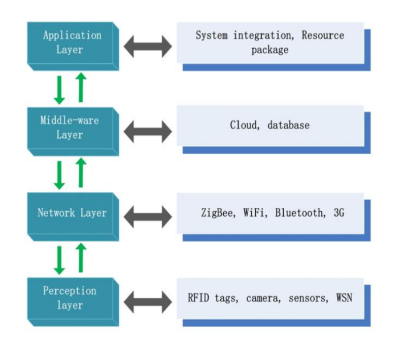

# Unit 3

## 1) Explain the IoT System Architecture with neat diagram.



### IoT System Architecture

The IoT (Internet of Things) system architecture typically consists of several layers that work together to collect, process, and transmit data. Here is an overview of the main layers:

1. **Perception Layer**:
   - **Function**: This is the physical layer that includes sensors and actuators.
   - **Components**: Sensors (temperature, humidity, pressure, etc.), RFID tags, actuators.
   - **Role**: Collects data from the environment and sends it to the network layer.
2. **Network Layer**:
   - **Function**: Responsible for transmitting data from the perception layer to the processing layer.
   - **Components**: Routers, gateways, communication protocols (Wi-Fi, Bluetooth, Zigbee, cellular networks).
   - **Role**: Ensures data is transmitted securely and efficiently.
3. **Processing Layer**:
   - **Function**: Processes and stores data received from the network layer.
   - **Components**: Data servers, cloud computing platforms, databases, data analytics tools.
   - **Role**: Performs data analysis, storage, and processing. It may involve real-time processing and big data analytics.
4. **Application Layer**:
   - **Function**: Provides application-specific services to the user.
   - **Components**: User interfaces, mobile apps, web applications, enterprise applications.
   - **Role**: Interprets processed data to provide meaningful information to users, supports decision-making.

### Explanation

- **Perception Layer**: At the bottom, this layer involves sensing physical parameters and converting them into digital signals.
- **Network Layer**: Above it, the network layer transmits these signals to the processing units.
- **Processing Layer**: This middle layer processes the data, often utilizing cloud services for extensive computation and storage.
- **Application Layer**: Data is then passed to the application layer, where it is used to provide services to the end-users.

This layered architecture ensures a systematic approach to designing and implementing IoT systems, enhancing scalability, security, and manageability.

## 2) Name different IoT Development boards. What are key features & advantages of ESP8266 development board.

### Different IoT Development Boards

1. **Arduino Uno**
   - **Key Features**: ATmega328P microcontroller, 14 digital I/O pins, 6 analog inputs, USB connection, power jack.
   - **Advantages**: Easy to use, extensive community support, wide range of shields and libraries.
2. **Raspberry Pi**
   - **Key Features**: Broadcom processor, GPIO pins, USB ports, HDMI output, Wi-Fi, Bluetooth.
   - **Advantages**: Full-fledged computer, capable of running Linux, extensive connectivity options, suitable for complex projects.
3. **ESP8266**
   - **Key Features**: 32-bit RISC CPU, 16 GPIO pins, integrated Wi-Fi, ADC, PWM.
   - **Advantages**: Low cost, built-in Wi-Fi, suitable for IoT applications, large community support.
4. **ESP32**
   - **Key Features**: Dual-core processor, Wi-Fi, Bluetooth, multiple GPIO pins, ADC, DAC, touch sensors.
   - **Advantages**: More powerful than ESP8266, supports both Wi-Fi and Bluetooth, versatile and powerful.
5. **Particle Photon**
   - **Key Features**: ARM Cortex M3 microcontroller, Wi-Fi, cloud integration.
   - **Advantages**: Easy cloud connectivity, compact size, good for remote IoT projects.
6. **BeagleBone Black**
   - **Key Features**: AM335x ARM Cortex-A8, multiple GPIO, USB, HDMI, Ethernet.
   - **Advantages**: High performance, extensive I/O options, suitable for industrial applications.

### Key Features and Advantages of ESP8266 Development Board

**Key Features:**

1. **Microcontroller**: 32-bit RISC CPU (Tensilica Xtensa LX106).
2. **Clock Speed**: 80 MHz (can be overclocked to 160 MHz).
3. **Memory**: 64 KB instruction RAM, 96 KB data RAM, 4 MB flash memory.
4. **GPIO**: Up to 16 general-purpose input/output pins.
5. **Wi-Fi**: IEEE 802.11 b/g/n, integrated TCP/IP protocol stack.
6. **Analog Input**: 10-bit ADC.
7. **Peripheral Interfaces**: SPI, I2C, I2S, UART.
8. **Power**: Operates at 3.3V with deep sleep mode for low power consumption.
9. **Programming**: Supports multiple development environments like Arduino IDE, MicroPython, NodeMCU.

**Advantages:**

1. **Cost-Effective**: The ESP8266 is one of the most affordable IoT development boards, making it accessible for hobbyists and developers.
2. **Integrated Wi-Fi**: Built-in Wi-Fi capability allows for easy network connectivity without the need for external modules.
3. **Compact Size**: Small form factor makes it suitable for embedding in various projects where space is a constraint.
4. **Community Support**: Large and active community providing libraries, tutorials, and forums for troubleshooting.
5. **Versatility**: Can be used for a wide range of applications, from simple sensor networks to complex IoT systems.
6. **Low Power Consumption**: Features like deep sleep mode help in creating energy-efficient devices, crucial for battery-operated IoT applications.
7. **Easy to Program**: Compatible with popular programming environments like the Arduino IDE, making it accessible for beginners and easy to integrate into existing workflows.

These features and advantages make the ESP8266 a popular choice for IoT development, providing a balance of performance, connectivity, and cost-efficiency.

## 3) Explain the function of following commands used for Arduino Programming:

● void setup()
● void loop()
● pinMode()
● analogRead()
● analogWrite()
● digitalRead()
● digitalWrite()
● Serial.begin()
● Serial.println()
● Serial.available()
● Serial.read()
● Serial.write();
● delay()
● delayMicroseconds()

### Arduino Programming Commands

### 1. `void setup()`

**Function**:

- `setup()` is a function that runs once when the Arduino board is powered on or reset.
- It is used to initialize variables, pin modes, start using libraries, and other setup configurations.

**Example**:

```cpp
void setup() {
  pinMode(LED_BUILTIN, OUTPUT); // initialize the LED pin as an output
}

```

### 2. `void loop()`

**Function**:

- `loop()` is a function that runs continuously after the `setup()` function.
- It contains the main code to be executed repeatedly.

**Example**:

```cpp
void loop() {
  digitalWrite(LED_BUILTIN, HIGH);   // turn the LED on
  delay(1000);                       // wait for a second
  digitalWrite(LED_BUILTIN, LOW);    // turn the LED off
  delay(1000);                       // wait for a second
}

```

### 3. `pinMode()`

**Function**:

- Configures the specified pin to behave either as an input or an output.

**Syntax**:

```cpp
pinMode(pin, mode);

```

- `pin`: The Arduino pin number.
- `mode`: `INPUT`, `OUTPUT`, or `INPUT_PULLUP`.

**Example**:

```cpp
pinMode(13, OUTPUT); // set pin 13 as an output

```

### 4. `analogRead()`

**Function**:

- Reads the value from the specified analog pin (A0 to A5) and returns a value between 0 and 1023.

**Syntax**:

```cpp
int value = analogRead(pin);

```

- `pin`: The analog pin number to read from.

**Example**:

```cpp
int sensorValue = analogRead(A0); // read the value from analog pin A0

```

### 5. `analogWrite()`

**Function**:

- Writes an analog value (PWM wave) to a pin. Can be used to dim LEDs or control motor speed.

**Syntax**:

```cpp
analogWrite(pin, value);

```

- `pin`: The pin to write to (must be a PWM pin).
- `value`: The duty cycle: between 0 (always off) and 255 (always on).

**Example**:

```cpp
analogWrite(9, 128); // set PWM value to 50% on pin 9

```

### 6. `digitalRead()`

**Function**:

- Reads the value from a specified digital pin, either HIGH or LOW.

**Syntax**:

```cpp
int value = digitalRead(pin);

```

- `pin`: The digital pin number to read from.

**Example**:

```cpp
int buttonState = digitalRead(2); // read the value from digital pin 2

```

### 7. `digitalWrite()`

**Function**:

- Sets the specified digital pin to either HIGH or LOW.

**Syntax**:

```cpp
digitalWrite(pin, value);

```

- `pin`: The digital pin number.
- `value`: `HIGH` or `LOW`.

**Example**:

```cpp
digitalWrite(13, HIGH); // set pin 13 to HIGH

```

### 8. `Serial.begin()`

**Function**:

- Sets the data rate in bits per second (baud) for serial data transmission.

**Syntax**:

```cpp
Serial.begin(speed);

```

- `speed`: The baud rate (e.g., 9600).

**Example**:

```cpp
Serial.begin(9600); // begin serial communication at 9600 baud

```

### 9. `Serial.println()`

**Function**:

- Prints data to the serial port as human-readable ASCII text followed by a newline character.

**Syntax**:

```cpp
Serial.println(data);

```

- `data`: The data to print.

**Example**:

```cpp
Serial.println("Hello, World!"); // print "Hello, World!" followed by a newline

```

### 10. `Serial.available()`

**Function**:

- Returns the number of bytes (characters) available for reading from the serial port.

**Syntax**:

```cpp
int numBytes = Serial.available();

```

**Example**:

```cpp
if (Serial.available() > 0) {
  int incomingByte = Serial.read(); // read the incoming byte
}

```

### 11. `Serial.read()`

**Function**:

- Reads the first byte of incoming serial data available (or -1 if no data is available).

**Syntax**:

```cpp
int byte = Serial.read();

```

**Example**:

```cpp
int incomingByte = Serial.read(); // read a byte from the serial port

```

### 12. `Serial.write()`

**Function**:

- Writes binary data to the serial port.

**Syntax**:

```cpp
Serial.write(data);

```

- `data`: The data to send (can be a single byte or an array of bytes).

**Example**:

```cpp
Serial.write(65); // send the byte value 65 (ASCII 'A')

```

### 13. `delay()`

**Function**:

- Pauses the program for the amount of time (in milliseconds) specified as parameter.

**Syntax**:

```cpp
delay(ms);

```

- `ms`: The number of milliseconds to pause.

**Example**:

```cpp
delay(1000); // wait for 1 second

```

### 14. `delayMicroseconds()`

**Function**:

- Pauses the program for the amount of time (in microseconds) specified as parameter.

**Syntax**:

```cpp
delayMicroseconds(us);

```

- `us`: The number of microseconds to pause.

**Example**:

```cpp
delayMicroseconds(100); // wait for 100 microseconds

```

These commands form the basis of Arduino programming and are essential for controlling hardware and interacting with sensors and actuators in your IoT projects.

## 4) Write a short note on following Serial Communication Protocols:

● UART
● I2C
● SPI

### Serial Communication Protocols

### 1. UART (Universal Asynchronous Receiver/Transmitter)

**Overview**:

- UART is a hardware communication protocol that uses asynchronous serial communication with configurable baud rates.
- It transmits data between two devices using just two wires: TX (transmit) and RX (receive).

**Key Features**:

- Asynchronous: No clock signal is used; instead, devices agree on a baud rate (e.g., 9600, 115200 bps).
- Simple: Requires only two wires for communication.
- Start and Stop Bits: Each data frame is surrounded by start and stop bits to indicate the beginning and end of transmission.
- Parity: Optional parity bit can be used for basic error checking.

**Advantages**:

- Widely used in serial communication between computers and peripherals.
- Simple implementation.
- Full-duplex communication (simultaneous send and receive).

**Disadvantages**:

- Limited to communication between two devices.
- Lower data transfer rates compared to synchronous protocols.

**Example Use Cases**:

- Debugging and data logging.
- Communication between microcontrollers and modules like GPS or Bluetooth.

### 2. I2C (Inter-Integrated Circuit)

**Overview**:

- I2C is a synchronous, multi-master, multi-slave communication protocol that uses two wires: SCL (clock) and SDA (data).

**Key Features**:

- Synchronous: Uses a clock signal (SCL) to synchronize data transfer.
- Multi-Master/Slave: Multiple master and slave devices can be connected to the same bus.
- Addressing: Each device on the bus has a unique address, allowing communication with multiple devices.
- Speed: Supports multiple data rates (standard mode: 100 kbps, fast mode: 400 kbps, high-speed mode: 3.4 Mbps).

**Advantages**:

- Supports multiple devices with only two wires, reducing complexity and wiring.
- Robust and reliable communication.
- Can handle multiple masters and slaves on the same bus.

**Disadvantages**:

- Limited data transfer rates compared to SPI.
- More complex protocol handling compared to UART.

**Example Use Cases**:

- Communication with sensors, EEPROMs, RTCs, and other peripheral devices.
- Interfacing microcontrollers with low-speed peripherals.

### 3. SPI (Serial Peripheral Interface)

**Overview**:

- SPI is a synchronous, full-duplex communication protocol used primarily for short-distance communication in embedded systems.
- It uses four main lines: SCK (clock), MOSI (master out slave in), MISO (master in slave out), and SS (slave select).

**Key Features**:

- Synchronous: Uses a clock signal (SCK) to synchronize data transfer.
- Full-Duplex: Allows simultaneous data transmission and reception.
- Speed: High data transfer rates (up to tens of Mbps).
- Multiple Slaves: Supports multiple slave devices using separate slave select lines.

**Advantages**:

- High-speed data transfer.
- Simple hardware connections for point-to-point communication.
- Full-duplex communication.

**Disadvantages**:

- Requires more wires than I2C and UART (4 wires).
- No standard acknowledgment mechanism for data integrity.
- Limited to point-to-point or one master with multiple slaves (each needing a separate SS line).

**Example Use Cases**:

- Communication with high-speed peripherals like flash memory, LCDs, and ADCs.
- Interfacing microcontrollers with sensors and modules requiring fast data transfer.

Each of these serial communication protocols has its own strengths and weaknesses, making them suitable for different applications based on speed, complexity, and the number of devices involved.

## 5) Differentiate between UART, I2C, SPI communication protocols.

### Differences Between UART, I2C, and SPI Communication Protocols

### 1. UART (Universal Asynchronous Receiver/Transmitter)

**Communication Type**:

- Asynchronous (no clock signal).

**Wires Required**:

- 2 wires (TX and RX).

**Data Transfer Mode**:

- Full-duplex (simultaneous send and receive).

**Speed**:

- Variable baud rates, typically up to 1 Mbps.

**Number of Devices**:

- Point-to-point (typically two devices).

**Error Checking**:

- Optional parity bit for basic error checking.

**Complexity**:

- Simple to implement and use.

**Applications**:

- Debugging, data logging, communication between microcontrollers and modules like GPS or Bluetooth.

**Advantages**:

- Simple and easy to implement.
- Requires minimal wiring.
- No clock signal required.

**Disadvantages**:

- Limited to communication between two devices.
- Lower data transfer rates compared to synchronous protocols.

### 2. I2C (Inter-Integrated Circuit)

**Communication Type**:

- Synchronous (uses a clock signal).

**Wires Required**:

- 2 wires (SCL and SDA).

**Data Transfer Mode**:

- Half-duplex (bidirectional communication but not simultaneous).

**Speed**:

- Standard mode: 100 kbps, Fast mode: 400 kbps, High-speed mode: 3.4 Mbps.

**Number of Devices**:

- Multi-master, multi-slave (multiple devices on the same bus).

**Error Checking**:

- Acknowledgment (ACK/NACK) for each byte transferred.

**Complexity**:

- More complex than UART, requires addressing and bus arbitration.

**Applications**:

- Communication with sensors, EEPROMs, RTCs, and other peripheral devices.

**Advantages**:

- Supports multiple devices with just two wires.
- Robust and reliable for short-distance communication.
- Flexible addressing scheme.

**Disadvantages**:

- Slower data transfer rates compared to SPI.
- More complex protocol handling.

### 3. SPI (Serial Peripheral Interface)

**Communication Type**:

- Synchronous (uses a clock signal).

**Wires Required**:

- 4 wires (SCK, MOSI, MISO, SS).

**Data Transfer Mode**:

- Full-duplex (simultaneous send and receive).

**Speed**:

- High data transfer rates, up to tens of Mbps.

**Number of Devices**:

- Single master with multiple slaves (each requiring a separate SS line).

**Error Checking**:

- No inherent error checking, relies on higher-level protocols.

**Complexity**:

- Simple hardware connections but requires more pins.

**Applications**:

- Communication with high-speed peripherals like flash memory, LCDs, and ADCs.

**Advantages**:

- Very high-speed data transfer.
- Full-duplex communication.
- Simple and efficient for short-distance communication.

**Disadvantages**:

- Requires more wires compared to UART and I2C.
- Limited to point-to-point or one master with multiple slaves (each needing a separate SS line).

### Summary

| Feature            | UART                                | I2C                               | SPI                                          |
| ------------------ | ----------------------------------- | --------------------------------- | -------------------------------------------- |
| Communication Type | Asynchronous                        | Synchronous                       | Synchronous                                  |
| Wires Required     | 2 (TX, RX)                          | 2 (SCL, SDA)                      | 4 (SCK, MOSI, MISO, SS)                      |
| Data Transfer Mode | Full-duplex                         | Half-duplex                       | Full-duplex                                  |
| Speed              | Up to 1 Mbps                        | Up to 3.4 Mbps                    | Up to tens of Mbps                           |
| Number of Devices  | Typically two                       | Multiple (multi-master/slave)     | One master, multiple slaves                  |
| Error Checking     | Optional parity bit                 | Acknowledgment (ACK/NACK)         | No inherent error checking                   |
| Complexity         | Simple                              | More complex                      | Simple hardware, more pins                   |
| Applications       | Debugging, data logging             | Sensor and peripheral comm.       | High-speed peripherals                       |
| Advantages         | Simple, minimal wiring              | Multiple devices on bus           | High speed, full-duplex                      |
| Disadvantages      | Limited to two devices, lower speed | Slower than SPI, complex handling | More wires, separate SS lines for each slave |

Each protocol serves different purposes and is selected based on the specific requirements of the application, such as the number of devices, speed, distance, and complexity.

## 6) Write a short note on following types of processing IoT data:

● Cloud computing
● Fog computing
● Edge computing

### Processing IoT Data: Cloud Computing, Fog Computing, and Edge Computing

### 1. Cloud Computing

**Overview**:

- Cloud computing involves processing and storing data on remote servers accessed over the internet. It provides scalable and flexible resources for handling large volumes of IoT data.

**Key Features**:

- **Scalability**: Easily scale up or down based on demand.
- **Resource Management**: Offloads storage and processing from local devices.
- **Data Accessibility**: Data and applications can be accessed from anywhere with an internet connection.
- **Services**: Offers various services like data storage, processing power, and machine learning.

**Advantages**:

- **Cost-Effective**: Pay-as-you-go pricing models.
- **High Availability**: Redundant systems ensure data and application availability.
- **Security**: Advanced security measures and compliance standards.
- **Advanced Analytics**: Access to powerful analytics and machine learning tools.

**Disadvantages**:

- **Latency**: Data must travel to and from the cloud, causing delays.
- **Bandwidth**: Requires significant bandwidth for data transmission.
- **Dependency**: Relies on internet connectivity.

**Example Use Cases**:

- Large-scale data analysis, centralized control systems, remote monitoring.

### 2. Fog Computing

**Overview**:

- Fog computing extends cloud computing to the edge of the network. It involves processing data closer to the source of data generation to reduce latency and bandwidth usage.

**Key Features**:

- **Decentralized Processing**: Data is processed on local devices or nodes closer to the source.
- **Reduced Latency**: Shortens the distance data must travel, leading to faster processing.
- **Improved Efficiency**: Reduces the amount of data sent to the cloud, saving bandwidth.

**Advantages**:

- **Low Latency**: Near real-time processing by minimizing data travel distance.
- **Bandwidth Savings**: Reduces data sent to the cloud, conserving bandwidth.
- **Resilience**: Local processing can continue even if cloud connectivity is lost.

**Disadvantages**:

- **Complexity**: Involves managing and coordinating multiple distributed nodes.
- **Security**: More points of vulnerability compared to centralized cloud.

**Example Use Cases**:

- Smart cities, industrial IoT (IIoT), autonomous vehicles, and real-time data processing applications.

### 3. Edge Computing

**Overview**:

- Edge computing pushes data processing closer to the IoT devices themselves, often directly on the devices generating the data or nearby edge devices.

**Key Features**:

- **Local Processing**: Data is processed at the edge of the network, on the devices or near them.
- **Real-Time Analytics**: Enables immediate data processing and decision-making.
- **Autonomy**: Devices can operate independently without relying on cloud or central systems.

**Advantages**:

- **Ultra-Low Latency**: Immediate processing due to proximity to data source.
- **Bandwidth Efficiency**: Minimizes data sent over the network, reducing bandwidth usage.
- **Enhanced Privacy**: Sensitive data can be processed locally, reducing exposure.

**Disadvantages**:

- **Limited Resources**: Edge devices typically have less computational power and storage compared to cloud resources.
- **Management**: More complex to manage and update a large number of distributed edge devices.

**Example Use Cases**:

- Wearable health monitors, smart home devices, real-time video processing in surveillance systems, and predictive maintenance in manufacturing.

### Summary

- **Cloud Computing**: Centralized, scalable, and flexible, but with higher latency and bandwidth requirements.
- **Fog Computing**: Decentralized processing closer to data sources, balancing latency reduction and bandwidth efficiency.
- **Edge Computing**: Processing at the data source for ultra-low latency and bandwidth efficiency, but with limited computational resources.

Each type of processing serves specific needs based on the application requirements for latency, bandwidth, computational power, and data privacy.

## 7) Differentiate between Cloud, Fog, and Edge Computing.

### Differences Between Cloud, Fog, and Edge Computing

| Feature                       | Cloud Computing                                                           | Fog Computing                                            | Edge Computing                                                           |
| ----------------------------- | ------------------------------------------------------------------------- | -------------------------------------------------------- | ------------------------------------------------------------------------ |
| **Location of Processing**    | Centralized (remote data centers)                                         | Decentralized (local network nodes)                      | Distributed (on or near IoT devices)                                     |
| **Latency**                   | High (data travels long distances)                                        | Medium (closer to data source)                           | Low (data processed at source)                                           |
| **Bandwidth Usage**           | High (large amounts of data transmitted)                                  | Medium (reduces data sent to cloud)                      | Low (minimal data sent over network)                                     |
| **Scalability**               | High (scalable resources)                                                 | Medium (local nodes can scale to an extent)              | Low (limited by edge device capabilities)                                |
| **Computational Power**       | High (powerful cloud servers)                                             | Medium (local servers/nodes)                             | Low (limited to edge device hardware)                                    |
| **Management Complexity**     | Low to Medium (centralized management)                                    | High (managing multiple local nodes)                     | High (managing numerous distributed devices)                             |
| **Real-Time Processing**      | Limited (higher latency)                                                  | Improved (reduced latency)                               | Excellent (minimal latency)                                              |
| **Data Privacy and Security** | Medium (data transmitted over internet)                                   | Medium to High (local processing can enhance security)   | High (local processing minimizes data exposure)                          |
| **Example Use Cases**         | Large-scale data analysis, centralized control systems, remote monitoring | Smart cities, industrial IoT (IIoT), autonomous vehicles | Wearable health monitors, smart home devices, real-time video processing |
| **Reliability**               | High (redundant systems)                                                  | Medium (local nodes provide resilience)                  | Variable (depends on device robustness)                                  |

### Detailed Comparison

### 1. **Cloud Computing**

**Location of Processing**:

- Processing and storage occur in centralized data centers accessed via the internet.

**Latency**:

- Higher latency due to the distance data must travel to the cloud.

**Bandwidth Usage**:

- High, as large volumes of data are transmitted to and from the cloud.

**Scalability**:

- Highly scalable, allowing easy adjustments to resource allocation based on demand.

**Computational Power**:

- High, leveraging powerful cloud servers with significant processing capabilities.

**Management Complexity**:

- Generally lower, with centralized management of resources and services.

**Real-Time Processing**:

- Limited real-time capabilities due to latency.

**Data Privacy and Security**:

- Medium, with data transmitted over the internet potentially exposed to risks.

**Example Use Cases**:

- Centralized data analysis, remote monitoring, large-scale applications requiring significant computational power.

**Reliability**:

- High reliability with built-in redundancy and failover mechanisms in cloud infrastructure.

### 2. **Fog Computing**

**Location of Processing**:

- Processing occurs on local nodes or gateways closer to the data source.

**Latency**:

- Medium, as data processing is closer to the source but not at the edge.

**Bandwidth Usage**:

- Medium, with reduced data sent to the cloud, conserving bandwidth.

**Scalability**:

- Medium, with local nodes providing some scalability, but not as extensive as cloud computing.

**Computational Power**:

- Medium, with local nodes having less computational power than cloud servers but more than edge devices.

**Management Complexity**:

- Higher, due to the need to manage and coordinate multiple local nodes.

**Real-Time Processing**:

- Improved real-time capabilities compared to cloud computing.

**Data Privacy and Security**:

- Medium to high, with local processing reducing data exposure.

**Example Use Cases**:

- Smart cities, industrial IoT applications, scenarios requiring quicker response times than cloud computing.

**Reliability**:

- Medium, with local nodes providing resilience and reducing dependency on continuous cloud connectivity.

### 3. **Edge Computing**

**Location of Processing**:

- Processing occurs directly on IoT devices or nearby edge devices.

**Latency**:

- Low, with data processed at or near the source.

**Bandwidth Usage**:

- Low, minimizing the amount of data transmitted over the network.

**Scalability**:

- Low, limited by the capabilities of individual edge devices.

**Computational Power**:

- Low, as edge devices typically have limited processing power.

**Management Complexity**:

- High, due to the need to manage and update numerous distributed devices.

**Real-Time Processing**:

- Excellent, with minimal latency enabling real-time data processing and decision-making.

**Data Privacy and Security**:

- High, as data can be processed locally, reducing the risk of exposure.

**Example Use Cases**:

- Wearable health monitors, smart home automation, real-time video processing in surveillance systems.

**Reliability**:

- Variable, depending on the robustness and redundancy of the edge devices.

### Summary

- **Cloud Computing**: Best for large-scale data processing and storage with high scalability but higher latency and bandwidth usage.
- **Fog Computing**: Balances between cloud and edge computing, providing lower latency and bandwidth usage, suitable for applications requiring faster response times.
- **Edge Computing**: Ideal for ultra-low latency, real-time processing at the data source, with limited scalability and computational power.

Each approach has its strengths and is chosen based on the specific requirements of the IoT application, such as latency, bandwidth, computational power, and data privacy.
