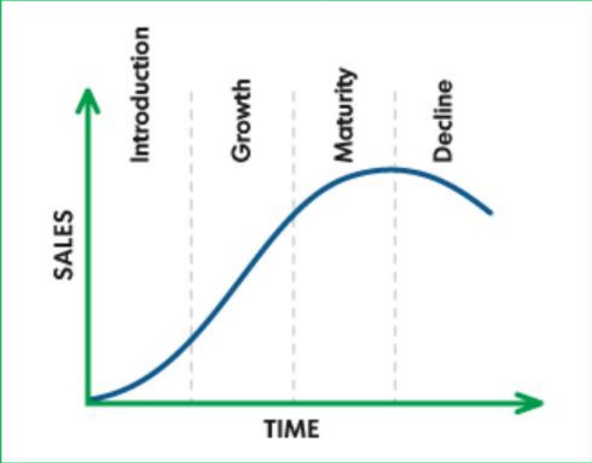

# Unit 3

## 1) Define and explain technology management. Explain technology management at national level and Enterprise level. What are the key task of MOT?

Technology management involves the integrated planning, design, optimization, operation, and control of technological products, processes, and services for human advantage. At the national level, technology management focuses on ensuring sustainable technological competitiveness in international markets and developing appropriate technology strategies, forecasting technological changes, and managing technology portfolios. On the other hand, at the enterprise level, technology management aims to maintain a strong position in core technologies relevant to the firm's product-market relationship and support competitive strategies. The key tasks of Management of Technology (MOT) at the enterprise level include technology planning, R&D management, innovation management, and strategic management of technology (SMOT) to manage technologies from a long-range perspective, impacting all levels and functions within the organization.

## 2) Explain SMOT and STMS.

Strategic Management of Technology (SMOT) means managing the product, service or process technologies of an organization from a long-range perspective, as these technologies have wide-ranging effects on all levels and functions within the organization.

Strategic Technology Management System (STMS) is a systems life cycle approach for strategic management of technology that includes eight phases:

1. **Technology Creation**: Involves creativity, invention, innovation, and developing a supportive corporate culture for promoting technology creation.
2. **Technology Monitoring**: Involves monitoring technology trends and changes before implementing new technology, including competitive analysis, customer/supplier interfaces, and people links.
3. **Technology Assessment**: Involves understanding market directions, integrating technology and business planning, assessing commercial feasibility, and assessing contributions to business strategy.
4. **Technology Transfer**: Involves entering strategic alliances, using product design teams, reducing functional barriers, and utilizing people links for successful technology transfer.
5. **Technology Acceptance**: Involves developing supportive organizational design, culture, management commitment, and assessing impacts of technological change.
6. **Technology Utilization**: Involves effective project management, supportive process technologies, and marketing strategies to maximize utilization.
7. **Technology Maturity**: Involves analyzing maturity through indicators like efficiency, market stability, substitutes, returns on investment, market share, and competitiveness.
8. **Technology Decline**: Involves moving to new technological opportunities as the current technology degrades and becomes obsolete.

## 3) Explain Phases of Strategic Technology management System. (STMS)

The Strategic Technology Management System (STMS) is a comprehensive approach for managing technology strategically over its life cycle. It consists of eight key phases:

1. **Technology Creation**: This phase involves the creation and generation of new technologies through activities like creativity, invention, innovation, and fostering a corporate culture that promotes technology creation.
2. **Technology Monitoring**: In this phase, technology trends and changes are monitored before implementing new technology. It includes activities such as installing information systems for monitoring trends, competitive analysis, and understanding market and technological changes.
3. **Technology Assessment**: This phase focuses on understanding market directions, integrating technology and business planning, assessing commercial feasibility, and evaluating the contributions of technology projects to the business strategy.
4. **Technology Transfer**: This phase involves transferring technology from external sources to the organization's Research and Development (R&D) and internally from R&D to production. It includes activities like forming strategic alliances, reducing barriers to technology transfer, and utilizing people links for successful technology transfer.
5. **Technology Acceptance**: This phase emphasizes accepting technology as a beneficial change and involves activities like creating supportive organizational structures, fostering a corporate culture that embraces change, and assessing the impacts of technological changes on the organization.
6. **Technology Utilization**: This phase focuses on maximizing technology utilization through effective project management, process technologies, and marketing strategies to support growth reflected in increased sales.
7. **Technology Maturity**: This phase involves analyzing the maturity of existing technology and related products/services/processes by studying indicators like efficiency, market stability, returns on investment, market share, and competitiveness.
8. **Technology Decline**: The final phase deals with technologies and related products/services/processes experiencing a decline in usage/sales, becoming obsolete. It emphasizes moving towards new technological opportunities and restarting the cycle of technology management.

These phases collectively form a structured approach to managing technology strategically over its life cycle, ensuring organizations effectively navigate technological changes and advancements.

## 4) What is product development. Explain product development process.

Product development refers to the entire process of bringing a new product from concept or idea to market release and beyond. It encompasses all the stages involved in creating and refining a product to meet market needs and achieve success. The product development process typically includes the following key steps:

1. **Idea Generation**: This initial step involves systematically searching for new product ideas. It includes creating, developing, and communicating abstract, concrete, or visual ideas, and constructing, innovating, and bringing these ideas to reality.
2. **Idea Screening**: In this step, good ideas are identified while poor ones are discarded early on. Idea screening involves evaluating innovative product ideas, strategies, and marketing trends against overall business objectives to determine their viability and potential return on investment.
3. **Concept Development and Testing**: Surviving ideas from the screening phase are developed into product concepts. This step involves defining product ideas, creating detailed product concepts in consumer terms, and testing these concepts with target consumers to gather feedback.
4. **Marketing Strategy Development**: This stage focuses on designing the initial marketing strategy for introducing the product to the market. It involves outlining target markets, production plans, positioning, sales goals, pricing, distribution, and marketing budgets.
5. **Business Analysis**: This step involves reviewing sales, cost, and profit projections to ensure they align with the company's objectives and financial goals.
6. **Product Development**: The research and development (R&D) or engineering department transforms the product concept into a physical product through design, prototyping, and testing.
7. **Test Marketing**: The product and marketing program are tested in a more realistic market setting to gather feedback and assess market response.
8. **Commercialization**: This final step involves introducing and marketing the product to the target market, including production, distribution, sales, and ongoing marketing efforts to drive product adoption and success.

The product development process is iterative and involves continuous refinement based on user feedback, market trends, and technological advancements to ensure the product meets customer needs and achieves business objectives.

## 5) Explain product life cycle with a diagram.

The product life cycle is a concept that describes the stages a product goes through from introduction to decline. It consists of four main stages:

1. **Introduction Stage**: This is the initial stage where the product is launched into the market. Sales are typically low as the product is being introduced, and marketing efforts focus on creating awareness and establishing a market for the product.
2. **Growth Stage**: In this stage, the product experiences rapid market acceptance and increasing profits. Sales increase as more customers adopt the product, and competitors may enter the market.
3. **Maturity Stage**: The product reaches a point of market saturation in the maturity stage. Sales growth slows down as the product has achieved acceptance by most potential buyers. Competition intensifies, and companies may focus on product differentiation and marketing strategies to maintain market share.
4. **Decline Stage**: In the decline stage, sales start to fall rapidly, and profits decrease. This decline can be due to changing consumer preferences, technological advancements, or market saturation. Companies may decide to discontinue the product or explore ways to revitalize it.

Here is a simple diagram illustrating the product life cycle:

This diagram visually represents the four stages of the product life cycle: Introduction, Growth, Maturity, and Decline.

## 6) Explain product innovation. Write its advantages.

Product innovation involves the development of new products, changes in the design of established products, or the use of new materials or components in the manufacture of existing products. It can be categorized into two main types: the development of new products and the improvement of existing products. Product innovation aims to introduce new products to the market or enhance the quality and performance of existing products.

Advantages of product innovation include:

1. **Growth and Expansion**: Product innovation can lead to growth and expansion for businesses by differentiating their products from competitors, attracting more customers, and increasing profits.
2. **Competitive Advantage**: By innovating products, businesses can differentiate themselves in the market, making their products more attractive to consumers and gaining a competitive edge over rivals.
3. **Brand Switching**: Successful product innovation can attract customers from competing brands, leading to brand switching as customers opt for the innovative and improved products.
4. **Increased Employment**: Product innovation can generate more employment opportunities as businesses expand to cater to new markets and meet the demands of various customer segments.
5. **Cost Efficiency**: Innovation can help businesses reduce costs, improve efficiency, and optimize production processes, leading to cost savings and improved profitability.
6. **Market Stability**: By introducing innovative products, businesses can reduce market fluctuations and maintain stable prices, ensuring a more predictable business environment.
7. **Utilization of Surplus Produce**: Through product innovation, companies can sell surplus products to other markets, generating additional revenue and utilizing excess production capacity effectively.
8. **Fosters Peace and Goodwill**: International trade fosters peace, goodwill, and mutual understanding among nations. Economic interdependence of countries often leads to close cultural relationships and helps avoid conflicts, contributing to global stability and cooperation.

## 7) Define and explain technical entrepreneurship.

Technical entrepreneurship refers to the process of starting and growing a new business venture that is based on the exploitation of technological innovations or the application of technology to create new products, services, or processes. It involves individuals with technical expertise, such as engineers or scientists, who identify and pursue opportunities to commercialize their knowledge and skills[1].

Key aspects of technical entrepreneurship include:

1. **Operating small businesses owned by engineers or scientists**: Technical entrepreneurs often start their own companies to bring their technical ideas to market[1].
2. **Finding problems or applications for a particular technology**: They identify unmet needs or opportunities that can be addressed using their technical knowledge and capabilities[1].
3. **Launching new ventures, introducing new applications, or exploiting opportunities that rely on scientific and technical knowledge**: Technical entrepreneurs leverage their technical expertise to create innovative solutions and bring them to market through new ventures[1].
4. **Working with others to produce technology change**: Technical entrepreneurship involves collaboration with various stakeholders, such as investors, partners, and employees, to drive technological change and create value[1].

The definition of technical entrepreneurship is based on four key elements[1]:

1. **Ultimate outcomes**: Value creation and capture are the primary goals of technical entrepreneurship.
2. **Target of the ultimate outcomes**: The firm is the main target organization for which value is created and captured.
3. **Mechanism used to deliver the ultimate outcomes**: Investment in a project is the mechanism used to create and capture value, where a project is a collection of specialized individuals and assets committed to delivering value for a specific period.
4. **Interdependence of this mechanism with scientific and technological advances**: The individuals involved in a project are influenced by and influence advances in relevant scientific and technological knowledge, and they co-produce the project's outputs with external and internal individuals and organizations.

Technical entrepreneurship plays a crucial role in fostering innovation, economic growth, and prosperity at the individual, firm, regional, and national levels[1].

## 8) Explain advantages and disadvantages of international trade.

International trade offers various advantages and disadvantages that impact economies, businesses, and consumers. Here are the advantages and disadvantages of international trade based on the provided sources:

### Advantages of International Trade:

1. **Greater Variety of Goods**: International trade brings in different varieties of products from different destinations, providing consumers with a wider array of choices and improving their quality of life.
2. **Efficient Allocation of Resources**: Countries tend to produce goods in which they have a comparative advantage, leading to efficient resource allocation and preventing wasteful duplication of resources.
3. **Promotes Efficiency in Production**: International trade encourages countries to adopt better production methods to remain competitive, promoting efficiency and higher product standards.
4. **More Employment Opportunities**: International trade can generate more employment by widening the market for goods and services, leading to the establishment of new industries to meet global demands.
5. **Consumption at Cheaper Cost**: Importing goods from other countries can provide consumers with products that are not produced domestically or are costly to produce locally, making consumption more affordable.

### Disadvantages of International Trade:

1. **Job Displacement and Outsourcing**: Increased international trade can lead to job displacement in domestic industries that cannot compete globally, resulting in job outsourcing to countries with lower costs.
2. **High Costs and Risk of Failure**: Innovating products for international trade can be costly and risky, with high capital investment and experimentation leading to potential failures and uncertain returns.
3. **Disruption of Relationships**: Changes in business operations for international trade can disrupt relationships with customers, suppliers, and partners, potentially damaging credibility and consistency.
4. **Impact on Traditional Economies**: Traditional economies may suffer as developed economies subsidize agribusiness, undercutting local farmers and affecting local farming bases.
5. **Trade Fluctuations**: International trade can reduce trade fluctuations by creating a large market with extensive supplies and demand, stabilizing prices, but it can also lead to dependency on global markets and currency fluctuations.

International trade offers significant benefits in terms of economic growth, job creation, and access to a wider range of goods, but it also poses challenges related to job displacement, cost implications, and potential disruptions in local economies and relationships.

## 9) Explain seven reasons for international trade.

Here are seven key reasons for countries to engage in international trade:

1. **Reduced dependence on local market**: Going global provides access to a wider range of customers in areas with more spending power. It also allows diversifying product range to cater to different cultural wants and needs[1].
2. **Increased chances of success**: Exporting goods increases sales volume and profitability. UK Trade and Investment (UKTI) claims companies that export are 12% more likely to survive and succeed compared to those that don't[1].
3. **Increased efficiency**: Exporting helps utilize excess capacity, smoothing production and avoiding seasonal fluctuations. It allows benefiting from economies of scale[1].
4. **Increased productivity**: Statistics show companies involved in international trade can improve productivity by 34% without increasing plant capacity[1].
5. **Economic advantage**: Exporting when the domestic currency is weak against other currencies provides real economic benefits. However, importers need to watch out for tariffs and sudden currency appreciation[1].
6. **Innovation**: Exporting exposes companies to a wider range of customer feedback, leading to innovative solutions to meet diverse customer needs. 53% of businesses believe exporting led to breakthrough product development[1].
7. **Growth**: Increased international trade provides greater growth opportunities for businesses and the overall economy[1].

In summary, international trade allows countries to leverage their comparative advantages, access larger markets, improve productivity and efficiency, drive innovation, and achieve economic growth. However, it also poses risks related to currency fluctuations and tariffs that need to be managed.

## 10) Explain Operations management and its functions.

Operations management is a crucial field in business that focuses on optimizing efficiency within an organization. It involves various functions overseen by an operations manager to ensure the successful conversion of inputs like materials, labor, and technology into outputs. Here are the key functions of operations management based on the provided sources:

1. **Product Design:** Operations managers are responsible for creating products that meet consumer needs and market trends. Quality is prioritized over quantity to ensure customer satisfaction.
2. **Forecasting:** This function involves predicting future events, especially consumer demand, based on historical data. It helps in determining the volume of products needed to meet market demand.
3. **Supply Chain Management:** Managing the production process from raw materials to the finished product, including production, shipping, distribution, and delivery. Efficient supply chain management leads to cost-effective production and timely product delivery.
4. **Delivery Management:** Operations managers oversee the timely delivery of goods to consumers, ensuring that products meet customer expectations. They handle feedback and address any issues raised by customers.

These functions highlight the diverse responsibilities of operations managers in planning, organizing, and optimizing processes to drive efficiency and profitability within an organization.

## 11) Explain the responsibilities in operations management.

The responsibilities in operations management encompass a wide range of strategic functions aimed at ensuring efficiency in project execution within a business. Based on the provided sources, here are the key responsibilities associated with operations management:

1. **Managing Operations:** Operations management involves overseeing and managing the operations and processes of an organization to ensure efficiency in project execution.
2. **Strategic Functions:** Individuals in charge of operations management are required to perform various strategic functions to optimize processes and achieve organizational goals effectively.
3. **Specific Responsibilities:** Some of the specific responsibilities in operations management include planning, organizing, and overseeing the organization's processes to balance revenues and costs, ensuring the successful conversion of inputs like materials, labor, and technology into outputs in an efficient manner.
4. **Functions Performed:** Operations managers are responsible for functions such as supply chain management, product design, forecasting, quality control, and delivery management to ensure smooth operations and customer satisfaction.

These responsibilities highlight the critical role of operations managers in driving efficiency, productivity, and profitability within an organization by effectively managing various aspects of the business processes.

## 12) Elaborate the skills of an operations manager.

Elaborating on the skills required for an operations manager, is crucial for success in overseeing and optimizing business processes. Here are the key skills that an operations manager should possess:

1. **Organizational Abilities:** An operations manager must have strong organizational skills to focus on multiple projects simultaneously without losing track. Effective planning, execution, and monitoring of projects are essential to ensure tasks are completed efficiently and on time.
2. **Coordination:** Good coordination skills are vital for integrating resources, activities, and time effectively to achieve organizational goals. This involves managing multiple activities simultaneously, handling interruptions, and swiftly returning to routine functions to prevent disruptions.
3. **People Skills:** Since operations management involves interactions with various stakeholders, an operations manager must possess excellent interpersonal skills. This includes effective communication, active listening, conflict resolution, and the ability to relate to employees, senior management, and external partners on both professional and personal levels.
4. **Tech-Savvy:** In today's tech-driven environment, being tech-savvy is crucial for an operations manager to design efficient and technology-compliant processes. Familiarity with the latest technological innovations allows for the implementation of automated and streamlined processes, enhancing operational efficiency and competitiveness in the market.

These skills collectively enable an operations manager to effectively plan, coordinate, and optimize business processes, ensuring smooth operations, high productivity, and successful achievement of organizational objectives.

## 13) Explain operations management strategies.

Operations management strategies are crucial for optimizing efficiency, productivity, and profitability within an organization. Here are some key strategies employed in operations management:

### Use of Data

Analytics are essential for strong planning, adjustments, and decision making. Two common types are efficiency metrics and effectiveness metrics[1].

### Inventory Analysis

To manage inventory in the supply chain, ABC analysis (also called Pareto analysis) is used. It divides inventory into three categories A, B, and C; "A" has the most value and tightest controls, and "C" has the least[1].

### Process Design

Researching, forecasting, and developing a sound process takes expertise and energy, but the results can be lasting[1].

### Forecasting and Goal Setting

The best forecasting often combines a look at historical data with analysis of changing conditions[1].

### Collaboration Among Departments

With good communication and collaboration, operations management can work effectively with finance, sales, marketing, human resources, and other departments[1].

### Being Green

Ecological soundness has become a strategic and legal necessity at companies nowadays, especially in manufacturing[1].

These strategies, when implemented effectively, help operations managers optimize processes, manage resources efficiently, and drive overall organizational success.

## 14) Explain principle of operations management.

The principles of operations management provide a foundation for effectively managing business processes and achieving organizational goals. Here are the key principles of operations management:

### Reality

There is no universal solution to the problems in your business. Each organization faces unique challenges that require tailored approaches[1].

### Organization

All aspects of production must be organized into a coherent whole. This involves integrating resources, activities, and time to ensure efficient utilization towards achieving organizational objectives[1].

### Fundamentals

Adhering to fundamentals, such as maintaining accurate inventory records, is crucial for smooth operations and decision-making[1].

### Accountability

Holding people accountable drives them to work harder and take ownership of their responsibilities[1].

### Variance

Variance is an inherent part of every process. Managers must anticipate and manage variations to maintain consistency[1].

### Causality

Problems are often symptoms of deeper underlying issues. Operations managers must identify and address root causes to prevent recurring problems[1].

### Managed Passion

Employees with a passion for their jobs are the driving force behind a company's success. Managers should foster an environment that nurtures and channels this passion[1].

### Humility

Operations managers don't need to have all the answers. Acknowledging limitations and seeking input from others can lead to better solutions[1].

### Success

Defining success metrics and adapting to market changes is essential for maintaining competitiveness[1].

By adhering to these principles, operations managers can create efficient, adaptable, and successful business processes that drive organizational growth and profitability.
