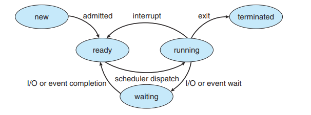
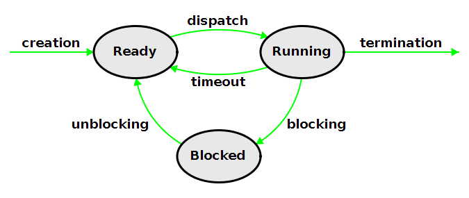

# Unit 1 & 2

## 1) What is Operating System? Explain different types of operating system.

An operating system (OS) is a software program that manages computer hardware and software resources, providing a platform for applications to run. It acts as an intermediary between users and the computer hardware, facilitating communication and resource allocation. Key functions of an operating system include process management, memory management, file management, device management, and security.

### Different Types of Operating Systems:

### Single-tasking and Multi-tasking Operating Systems:

1. **Single-tasking OS**: Allows only one program to run at a time, like MS-DOS.
2. **Multi-tasking OS**: Permits multiple programs to run concurrently, such as Windows, Linux, and macOS.

### Single-user and Multi-user Operating Systems:

1. **Single-user OS**: Intended for use by one user at a time, like Windows 10 Home.
2. **Multi-user OS**: Enables multiple users to access the system simultaneously, like Linux and Unix-based systems.

### Real-time Operating Systems (RTOS):

- RTOS are designed for time-critical applications needing immediate responses, like industrial control systems. Examples include VxWorks and QNX.

### Distributed Operating Systems:

- These manage multiple networked computers, like Hadoop and Kubernetes.

### Mobile Operating Systems:

- Designed for portable devices like smartphones and tablets, examples include Android, iOS, and Windows Phone.

### Embedded Operating Systems:

- Tailored for specific hardware devices like routers and smart home devices. Examples include VxWorks, QNX, and Linux.

Each type of operating system serves specific needs and has unique features, advantages, and disadvantages. Understanding these types helps in selecting the most suitable operating system for a particular computing environment.

## 2) Define operating system. Explain the different views of operating system.

An operating system (OS) is a software program that acts as an intermediary between the user and the computer hardware, providing a platform for applications to run on. It manages the hardware resources of a computer system and provides essential services for the execution of programs. The operating system is responsible for tasks such as process management, memory management, file management, device management, and security.

### Different Views of Operating System:

1. **User View**:
   - This view focuses on how the operating system interacts with users and applications.
   - Users interact with the OS through a graphical user interface (GUI) or a command-line interface (CLI).
   - The OS provides a platform for users to run applications, access files, and manage system resources.
2. **System View**:
   - This view emphasizes the internal workings and structure of the operating system.
   - It includes components such as the kernel, device drivers, file system, and system utilities.
   - The OS manages hardware resources, schedules tasks, and ensures system stability and security.
3. **Programmer View**:
   - This view is concerned with how programmers interact with the operating system to develop applications.
   - Programmers use application programming interfaces (APIs) provided by the OS to access system resources and services.
   - The OS abstracts hardware details, allowing programmers to focus on application development without worrying about low-level hardware interactions.
4. **Administrator View**:
   - This view focuses on system administration tasks and managing the overall system.
   - Administrators configure system settings, install software, manage users and permissions, and monitor system performance.
   - They ensure system security, backup data, and troubleshoot issues to maintain system reliability and availability.

Each view provides a different perspective on the operating system, highlighting its role in enabling users to interact with the computer system, supporting application development, managing system resources, and ensuring system stability and security.

## 3) Define process. Differentiate between a process and a program.

### Process Definition:

A process is an instance of a program that is being executed by a computer. It represents the current state of a running program, including its code, data, stack, and resources allocated by the operating system. Processes are managed by the operating system's process scheduler, which allocates CPU time and system resources to ensure efficient execution.

### Difference between a Process and a Program:

1. **Program**:
   - A program is a set of instructions stored in a file on disk, such as an executable file or a script.
   - It is a passive entity that resides on storage until loaded into memory for execution.
   - A program is static and does not perform any actions until it is executed.
2. **Process**:
   - A process is an active entity that represents the execution of a program.
   - It includes the program's code, data, stack, registers, and resources allocated by the operating system.
   - Processes are dynamic and can perform actions, interact with the system, and utilize system resources.
3. **Relationship**:
   - A program becomes a process when it is loaded into memory and executed by the CPU.
   - Multiple processes can be created from a single program, each running independently with its own memory space and resources.
   - Processes can communicate with each other and the operating system, while programs are standalone entities.
4. **Execution**:
   - A program is a passive set of instructions, while a process is an active entity that is being executed.
   - Programs are static and do not change during execution, whereas processes have a dynamic state that evolves as they run.

In summary, a program is a static set of instructions stored on disk, while a process is the dynamic execution of a program in memory. Processes are active entities that interact with the system, utilize resources, and can run concurrently with other processes, making them the fundamental units of execution in a computer system.

## 4) Explain different service provided by operating system.

### Different Services Provided by Operating Systems:

1. **Process Management**:
   - **Process Scheduling**: Allocating CPU time to processes efficiently.
   - **Creation and Termination**: Creating and terminating processes as needed.
   - **Synchronization**: Managing synchronization and communication between processes.
2. **Memory Management**:
   - **Memory Allocation**: Allocating and deallocating memory for processes.
   - **Virtual Memory**: Managing virtual memory to optimize memory usage.
   - **Memory Protection**: Ensuring processes do not interfere with each other's memory.
3. **File Management**:
   - **File System**: Organizing and managing files on storage devices.
   - **File Access**: Providing mechanisms for reading, writing, and modifying files.
   - **File Permissions**: Enforcing access control and permissions for files.
4. **Device Management**:
   - **Device Drivers**: Managing communication with hardware devices.
   - **I/O Operations**: Handling input and output operations to devices.
   - **Device Allocation**: Allocating devices to processes and managing device queues.
5. **Security**:
   - **User Authentication**: Verifying user identities for system access.
   - **Data Protection**: Ensuring data integrity and confidentiality.
   - **Access Control**: Enforcing permissions and restrictions on system resources.
6. **Network Management**:
   - **Network Protocols**: Managing network communication and protocols.
   - **Connection Management**: Establishing and maintaining network connections.
   - **Resource Sharing**: Facilitating resource sharing and communication over networks.
7. **Error Handling**:
   - **Fault Tolerance**: Handling errors and system failures gracefully.
   - **Error Recovery**: Recovering from system crashes and errors.
   - **Logging and Monitoring**: Logging system events and monitoring system health.
8. **User Interface**:
   - **Graphical User Interface (GUI)**: Providing a visual interface for users to interact with the system.
   - **Command-Line Interface (CLI)**: Allowing users to interact with the system through commands.
   - **Accessibility Features**: Providing features for users with disabilities to access the system.

Operating systems offer a wide range of services to manage hardware resources, facilitate communication between software and hardware components, ensure system stability and security, and provide a user-friendly interface for interacting with the computer system. These services are essential for the efficient operation and management of modern computing systems.

## 5) What is Batch operating System? Discuss its advantages and disadvantages.

### Batch Operating System:

A batch operating system is a type of operating system where similar jobs are grouped together into batches or blocks, and executed sequentially without user intervention. In a batch system, jobs are submitted to the computer through input devices like punched cards or magnetic tapes, and the operating system processes them in the order they are received.

### Advantages of Batch Operating System:

1. **Efficient Resource Utilization**: By grouping similar jobs together, the batch operating system can optimize the use of system resources, such as CPU, memory, and I/O devices, leading to higher throughput.
2. **Reduced Idle Time**: Batch processing helps minimize the idle time of the CPU by keeping it busy with a continuous stream of jobs, improving overall system efficiency.
3. **Reduced Operator Intervention**: With batch processing, the operator's involvement is reduced, as jobs are executed automatically without the need for constant monitoring or manual intervention.
4. **Improved Turnaround Time**: For jobs that require a long processing time, batch processing can provide better turnaround times compared to interactive systems, where users have to wait for their jobs to complete.

### Disadvantages of Batch Operating System:

1. **Lack of User Interaction**: In a batch operating system, users cannot interact with their jobs once they are submitted, as the system processes them in the order they are received. This can be a disadvantage for jobs that require user input or feedback during execution.
2. **Delayed Response Time**: For jobs that require immediate attention or have strict deadlines, batch processing may not be suitable, as jobs are executed in the order they are received, leading to delayed response times.
3. **Limited Error Handling**: If an error occurs during the execution of a job in a batch system, it may not be detected until the job completes, leading to wasted resources and delayed error correction.
4. **Lack of User Priority**: In a batch operating system, jobs are processed in the order they are received, without considering the priority or importance of individual jobs. This can be a disadvantage for users with time-sensitive or high-priority jobs.

Batch operating systems were commonly used in the early days of computing, particularly in mainframe environments, where large volumes of similar jobs needed to be processed efficiently. However, as computing needs have evolved, interactive and real-time operating systems have become more prevalent, addressing the limitations of batch processing.

## 6) What is Time-sharing operating System? Discuss its advantages and disadvantages.

### Time-Sharing Operating System:

A time-sharing operating system is a type of operating system that allows multiple users to access a computer system simultaneously, sharing its resources. In a time-sharing system, the CPU time is divided among multiple users, giving each user a slice of time to execute their programs. The operating system rapidly switches between users, creating the illusion of simultaneous execution.

### Advantages of Time-Sharing Operating System:

1. **Improved Resource Utilization**: Time-sharing systems can efficiently utilize system resources, such as CPU, memory, and I/O devices, by allowing multiple users to access them concurrently.
2. **Cost-Effective**: By allowing multiple users to share a single computer system, time-sharing systems can be more cost-effective compared to dedicating a separate computer to each user.
3. **Improved Response Time**: Time-sharing systems provide a better response time for interactive applications, as users can receive immediate feedback without waiting for their jobs to complete.
4. **Increased Productivity**: By allowing users to access the system simultaneously, time-sharing systems can increase overall productivity by enabling users to work on their tasks concurrently.

### Disadvantages of Time-Sharing Operating System:

1. **Complexity**: Time-sharing systems are more complex to design and implement compared to single-user systems, as they need to manage multiple users, ensure data security, and provide efficient resource allocation.
2. **Overhead**: The rapid switching between users in a time-sharing system can introduce overhead, as the operating system needs to save and restore the state of each user's process, which can impact overall system performance.
3. **Limited Resources**: If the number of users exceeds the available system resources, such as memory or CPU capacity, the performance of the time-sharing system may degrade, leading to longer response times and reduced throughput.
4. **Security Risks**: In a time-sharing system, there is a risk of unauthorized access or data breaches, as multiple users are sharing the same system resources. The operating system needs to implement robust security measures to protect user data and prevent interference between users.

Time-sharing operating systems were widely used in the era of mainframe computers and minicomputers, where multiple users could access a central computer system simultaneously. Today, time-sharing concepts are still relevant in modern operating systems, such as Unix-like systems and Windows, which support multiple users and provide mechanisms for resource sharing and protection.

## 7) What is distributed operating System? Discuss its advantages and disadvantages.

### Distributed Operating System:

A distributed operating system is a type of operating system that runs on a network of interconnected computers and coordinates their activities to provide users with a single, integrated computing environment. In a distributed system, resources such as files, printers, and applications are distributed across multiple nodes, allowing users to access them from any location on the network.

### Advantages of Distributed Operating System:

1. **Resource Sharing**: Distributed operating systems enable efficient sharing of resources such as files, printers, and storage devices across the network, improving resource utilization and reducing duplication.
2. **Reliability**: By distributing resources and services across multiple nodes, distributed operating systems can improve system reliability and fault tolerance. If one node fails, the system can continue to operate using resources from other nodes.
3. **Scalability**: Distributed systems can easily scale to accommodate growing numbers of users or increasing resource demands by adding more nodes to the network, making them suitable for large-scale applications.
4. **Performance**: Distributed operating systems can improve performance by distributing processing tasks across multiple nodes, reducing the load on individual systems and improving overall system responsiveness.

### Disadvantages of Distributed Operating System:

1. **Complexity**: Distributed operating systems are more complex to design, implement, and manage compared to centralized systems, as they involve coordinating activities across multiple nodes and ensuring data consistency and synchronization.
2. **Security Risks**: Distributed systems are more vulnerable to security risks such as unauthorized access, data breaches, and network attacks, as resources are distributed across multiple nodes and may be accessed remotely.
3. **Communication Overhead**: Communication between nodes in a distributed system can introduce overhead, as data needs to be transmitted over the network, leading to potential delays and reduced performance.
4. **Consistency and Synchronization**: Ensuring data consistency and synchronization across distributed nodes can be challenging, as updates made on one node need to be propagated to other nodes to maintain a coherent view of the system.

Distributed operating systems are commonly used in modern computing environments, such as cloud computing and large-scale data centers, where resources need to be shared and accessed from multiple locations. While they offer advantages in terms of resource sharing, reliability, and scalability, they also present challenges related to complexity, security, communication overhead, and data consistency. Proper design and management are essential to harness the benefits of distributed operating systems effectively.

## 8) What is Real-time operating System? Discuss its advantages and disadvantages.

### Real-Time Operating System (RTOS):

A real-time operating system (RTOS) is a type of operating system designed to handle time-critical applications that require immediate response and predictable execution times. RTOS are used in various domains, such as industrial automation, embedded systems, and real-time simulations, where the timeliness of responses is crucial.

### Advantages of Real-Time Operating System:

1. **Deterministic Behavior**: RTOS provide deterministic behavior, ensuring that tasks are executed within specified time constraints, making them suitable for time-critical applications.
2. **Responsiveness**: RTOS can respond to external events or interrupts quickly, minimizing latency and ensuring that critical tasks are executed promptly.
3. **Reliability**: RTOS are designed to be reliable, with features such as fault tolerance, error handling, and recovery mechanisms to ensure continuous operation even in the face of failures.
4. **Efficiency**: RTOS are optimized for real-time performance, with efficient scheduling algorithms and memory management techniques to minimize overhead and maximize throughput.

### Disadvantages of Real-Time Operating System:

1. **Limited Flexibility**: RTOS are designed for specific real-time applications and may have limited flexibility in accommodating general-purpose computing tasks or adapting to changing requirements.
2. **Resource Constraints**: RTOS often run on embedded systems with limited resources, such as memory and processing power, which can restrict the complexity of applications that can be supported.
3. **Development Complexity**: Developing applications for RTOS can be more complex compared to general-purpose operating systems, as developers need to consider timing constraints, resource allocation, and synchronization issues.
4. **Cost**: RTOS may have higher development and licensing costs compared to general-purpose operating systems, especially for commercial RTOS solutions.

Examples of real-time operating systems include VxWorks, QNX, FreeRTOS, and Windows CE. These systems are widely used in various industries, such as aerospace, automotive, medical devices, and industrial automation, where real-time performance and reliability are critical requirements.

## 9) Difference between process and thread.

Here is a side-by-side comparison of the differences between processes and threads:

| Process                                                                                              | Thread                                                                                                                  |
| ---------------------------------------------------------------------------------------------------- | ----------------------------------------------------------------------------------------------------------------------- |
| A process is an instance of a program being executed by a computer.                                  | A thread is a unit of execution within a process.                                                                       |
| Processes are independent and isolated from each other.                                              | Threads share the same memory space within a process.                                                                   |
| Processes have their own memory space and resources allocated by the operating system.               | Threads share the same memory space and resources of the process they belong to.                                        |
| Processes have their own address space.                                                              | Threads share the same address space as other threads within the same process.                                          |
| Processes are heavyweight and have higher overhead for creation, termination, and context switching. | Threads are lightweight and have lower overhead for creation, termination, and context switching compared to processes. |
| Processes are used for coarse-grained parallelism.                                                   | Threads are used for fine-grained parallelism within a process.                                                         |
| Processes are less efficient in communication and sharing data.                                      | Threads are more efficient in communication and sharing data due to shared memory.                                      |
| Processes are more secure as they are isolated from each other.                                      | Threads are less secure as they share the same memory space and resources, which can lead to potential security issues. |
| Processes are suitable for applications that require high isolation and security.                    | Threads are suitable for applications that require efficient communication and sharing of data within a process.        |

In summary, processes are heavyweight, independent units of execution with their own memory space and resources, while threads are lightweight units of execution that share the same memory space and resources within a process. The choice between using processes or threads depends on the specific requirements of the application, such as parallelism, communication, and security needs.

## 10) What is PCB? Discuss its major fields.

### Process Control Block (PCB):

A Process Control Block (PCB) is a data structure maintained by the operating system for each process. It contains all the information required by the operating system to manage and control the process. The PCB serves as a unique identifier for the process and is used by the operating system to perform various operations related to process management.

### Major Fields in a PCB:

1. **Process Identification (PID)**:
   - Unique identifier assigned to each process by the operating system.
   - Used to identify and manage the process throughout its lifetime.
2. **Process State**:
   - Indicates the current state of the process, such as ready, running, waiting, or terminated.
   - Determines the actions that can be performed on the process by the operating system.
3. **Program Counter (PC)**:
   - Stores the address of the next instruction to be executed by the process.
   - Used by the CPU to fetch and execute instructions.
4. **CPU Registers**:
   - Stores the contents of the CPU registers associated with the process.
   - Includes general-purpose registers, special-purpose registers, and the program counter.
5. **CPU Scheduling Information**:
   - Contains data used by the CPU scheduler to determine the order of process execution.
   - Includes priority, scheduling algorithms, and time slices.
6. **Memory Management Information**:
   - Stores information related to the process's memory allocation and protection.
   - Includes base and limit registers, page tables, and segment tables.
7. **Accounting Information**:
   - Records the amount of CPU time and other resources used by the process.
   - Used for accounting and billing purposes.
8. **I/O Status Information**:
   - Stores information about the I/O devices allocated to the process.
   - Includes open files, pending I/O operations, and I/O devices allocated to the process.
9. **Context**:
   - Represents the state of the process, including the contents of CPU registers, memory management information, and other relevant data.
   - Used for context switching between processes.

The PCB serves as a central repository for all the information related to a process, allowing the operating system to efficiently manage and control the execution of processes. It enables the operating system to perform tasks such as process scheduling, memory management, and I/O operations, ensuring the smooth and efficient execution of processes in a computer system.

## 11) Explain the microkernel system architecture in detail.

### Microkernel System Architecture:

The microkernel system architecture is a design approach for operating systems where the kernel is kept minimal, with core functionality implemented as a set of basic services, while additional services are implemented as user-space processes or modules. This architecture aims to improve system reliability, flexibility, and extensibility by moving non-essential functions out of the kernel and into user space.

### Components of a Microkernel System:

1. **Microkernel**:
   - The core component of the system that provides essential services such as process management, memory management, and inter-process communication.
   - Keeps the kernel minimal by delegating non-essential functions to user-space servers or modules.
2. **Servers**:
   - User-space processes or modules that provide additional services such as file systems, device drivers, and networking protocols.
   - Run in user space and communicate with the microkernel through well-defined interfaces.
3. **Inter-Process Communication (IPC)**:
   - Mechanism used for communication between user-space servers and the microkernel.
   - Facilitates message passing and data exchange between processes running in user space and the microkernel.
4. **Message Passing**:
   - Key mechanism for communication in a microkernel system.
   - Processes communicate by sending messages to each other or to the microkernel, enabling inter-process communication and coordination.
5. **Memory Protection**:
   - Ensures that user-space processes and servers are isolated from each other and the microkernel.
   - Prevents unauthorized access to memory regions and enhances system security and stability.
6. **Extensibility**:
   - Allows new services to be added or existing services to be replaced without modifying the core kernel.
   - Enhances system flexibility and adaptability to changing requirements.

### Advantages of Microkernel System Architecture:

1. **Modularity**:
   - Separation of core services from additional services improves system modularity and maintainability.
   - Easier to add, remove, or update services without affecting the core kernel.
2. **Reliability**:
   - Isolating non-essential functions in user space improves system reliability by reducing the impact of failures on the core kernel.
   - Faults in user-space servers are less likely to crash the entire system.
3. **Security**:
   - Enhanced security through memory protection mechanisms that isolate user-space processes and servers from each other and the microkernel.
   - Limits the impact of security vulnerabilities in user-space components.
4. **Scalability**:
   - Scalable architecture that allows for efficient resource utilization and performance optimization.
   - Enables the system to adapt to varying workloads and requirements.

The microkernel system architecture offers a flexible and modular approach to operating system design, emphasizing reliability, security, and extensibility. By keeping the kernel minimal and delegating additional services to user space, microkernel systems can achieve improved system stability, security, and adaptability to diverse computing environments.

## 12) Explain monolithic operating system structure.

### Monolithic Operating System Structure:

The monolithic operating system structure is a traditional approach to operating system design where the entire operating system is implemented as a single, large, and complex program. In a monolithic operating system, all the components, including the kernel, system libraries, and device drivers, are compiled into a single executable image that runs in a single address space.

### Key Characteristics of Monolithic Operating Systems:

1. **Single Address Space**:
   - The entire operating system, including the kernel and all its components, runs in a single address space.
   - This allows for efficient communication and direct function calls between different parts of the operating system.
2. **Tightly Coupled Components**:
   - The components of a monolithic operating system are tightly coupled and interdependent.
   - Changes or modifications to one component may affect the functioning of other components.
3. **Kernel Functionality**:
   - The kernel in a monolithic operating system is responsible for implementing all the core operating system functions, such as process management, memory management, file systems, and device drivers.
   - The kernel provides a set of system calls that allow user-level applications to interact with the operating system.
4. **Execution Modes**:
   - Monolithic operating systems typically have two execution modes: user mode and kernel mode.
   - User-level applications run in user mode, while the operating system kernel runs in kernel mode, with full access to system resources and hardware.
5. **Performance**:
   - Monolithic operating systems can provide good performance due to the efficient communication between components and the ability to optimize for specific hardware.
   - However, the performance can be affected by the complexity of the kernel and the need to switch between user mode and kernel mode.

### Examples of Monolithic Operating Systems:

1. **Unix and Unix-like systems**: Linux, macOS, and BSD are examples of monolithic operating systems.
2. **Windows**: Earlier versions of Windows, such as Windows 95 and Windows NT, were based on a monolithic architecture.

### Advantages and Disadvantages of Monolithic Operating Systems:

Advantages:

- Efficient communication between components due to direct function calls
- Good performance due to optimizations for specific hardware
- Simplicity in design and implementation

Disadvantages:

- Lack of modularity and flexibility due to tightly coupled components
- Complexity in maintaining and updating the operating system
- Potential for system instability if one component fails or contains bugs
- Limited protection between components running in kernel mode

Despite these limitations, monolithic operating systems remain widely used due to their simplicity, performance, and compatibility with existing hardware and software. However, alternative architectures, such as the microkernel approach, have been developed to address the limitations of monolithic operating systems and provide improved modularity, flexibility, and reliability.

## 13) Define a process. Explain the process state transition with a neat diagram.



### Process Definition:

A process is an instance of a program in execution. It represents the current state of a running program, including its code, data, stack, and resources allocated by the operating system. Processes are managed by the operating system's process scheduler, which allocates CPU time and system resources to ensure efficient execution.

### Process State Transition:

A process can exist in several states during its lifetime, transitioning between these states based on its execution and interactions with the operating system. The common process states include:

1. **New**: The process is being created but has not yet been admitted to the system.
2. **Ready**: The process is ready to run and waiting for CPU time.
3. **Running**: The process is currently being executed on the CPU.
4. **Blocked (Waiting)**: The process is waiting for an event or resource, such as I/O completion.
5. **Terminated (Exit)**: The process has finished execution and is being terminated.

The process state transitions are as follows:

1. **New → Ready**: When a new process is created, it enters the "New" state. Once the process is admitted to the system and is ready to execute, it transitions to the "Ready" state.
2. **Ready → Running**: When the process scheduler selects a process from the "Ready" queue to execute, the process transitions to the "Running" state.
3. **Running → Ready**: If a higher-priority process becomes ready or the currently running process exhausts its time slice, the running process may be preempted and moved back to the "Ready" state.
4. **Running → Blocked**: If a running process requires an event or resource that is not currently available, it transitions to the "Blocked" state. For example, if a process needs to perform I/O operations, it will be blocked until the I/O is complete.
5. **Blocked → Ready**: When the event or resource that the blocked process was waiting for becomes available, the process transitions from the "Blocked" state to the "Ready" state.
6. **Running → Terminated**: When a process finishes its execution or is terminated by the operating system, it transitions to the "Terminated" state.

The process state transitions are managed by the operating system's process scheduler, which uses various scheduling algorithms to determine the order in which processes are executed. The scheduler aims to ensure fair and efficient utilization of system resources while maintaining responsiveness and meeting the requirements of different processes.

## 14) Explain Thread Life Cycle with diagram.



### Thread Life Cycle:

A thread, which is a unit of execution within a process, goes through various states during its lifetime. The thread life cycle consists of the following states:

1. **New**: The thread is created but has not yet started execution.
2. **Runnable**: The thread is ready to run and is waiting for the CPU to be allocated to it by the scheduler. It can be in one of two sub-states:
   - Ready: The thread is ready to run but is not currently running.
   - Running: The thread is currently being executed by the CPU.
3. **Blocked**: The thread is not eligible to run because it is waiting for a resource, such as I/O completion or a lock. It can be in one of two sub-states:
   - Waiting: The thread is waiting for a specific event to occur, such as a timer expiration or a notification from another thread.
   - Timed Waiting: The thread is waiting for a specific amount of time to elapse before becoming eligible to run again.
4. **Terminated**: The thread has completed its execution or has been terminated by the operating system.

### Thread State Transitions:

The transitions between thread states are as follows:

1. **New → Runnable**: When a new thread is created, it enters the "New" state. Once the thread is started, it transitions to the "Runnable" state.
2. **Runnable → Running**: When the thread scheduler selects a thread from the "Ready" queue to execute, the thread transitions to the "Running" state.
3. **Running → Runnable**: If a higher-priority thread becomes ready or the currently running thread exhausts its time slice, the running thread may be preempted and moved back to the "Ready" queue.
4. **Running → Blocked**: If a running thread requires a resource that is not currently available or needs to wait for an event, it transitions to the "Blocked" state.
5. **Blocked → Runnable**: When the resource or event that the blocked thread was waiting for becomes available, the thread transitions from the "Blocked" state to the "Ready" queue.
6. **Runnable → Terminated**: When a thread finishes its execution or is terminated by the operating system, it transitions to the "Terminated" state.

The thread scheduler manages the transitions between thread states, ensuring that threads are allocated CPU time based on their priority and the scheduling algorithm used by the operating system. The thread life cycle allows for efficient utilization of system resources and enables concurrent execution of multiple threads within a process.

## 15) What is thread? Explain thread Structure? And explain any one type of thread in details.

### Thread Definition:

A thread is a unit of execution within a process. It represents a sequential flow of control within a program and is the basic unit of CPU utilization. Threads share the same memory space and resources of the process they belong to, allowing for efficient communication and sharing of data between threads.

### Thread Structure:

A thread consists of the following components:

1. **Thread ID**: A unique identifier assigned to each thread by the operating system.
2. **Program Counter**: Stores the address of the next instruction to be executed by the thread.
3. **Register Set**: Stores the current values of the CPU registers associated with the thread.
4. **Stack**: Stores the local variables and return addresses for the thread's function calls.
5. **State**: Indicates the current state of the thread, such as running, ready, or blocked.
6. **Priority**: Determines the order in which threads are scheduled for execution by the CPU scheduler.

### Types of Threads:

1. **User-Level Threads**:
   - User-level threads are managed by a thread library in user space, without the involvement of the operating system kernel.
   - The thread library is responsible for creating, scheduling, and managing user-level threads.
   - Examples of user-level thread libraries include POSIX Threads (Pthreads) and Windows Thread API.
2. **Kernel-Level Threads**:
   - Kernel-level threads are managed by the operating system kernel.
   - The kernel is responsible for creating, scheduling, and managing kernel-level threads.
   - Kernel-level threads are more efficient than user-level threads in terms of context switching and synchronization.
   - Examples of operating systems that support kernel-level threads include Linux, Windows, and macOS.

### Kernel-Level Threads:

Kernel-level threads are managed by the operating system kernel and are more efficient than user-level threads in terms of context switching and synchronization. Here's a more detailed explanation of kernel-level threads:

1. **Thread Creation**: When a new thread is created, the kernel allocates resources such as a thread ID, program counter, register set, and stack.
2. **Thread Scheduling**: The kernel's scheduler is responsible for selecting which thread to execute next based on factors such as priority, time slice, and resource availability.
3. **Context Switching**: When the scheduler decides to switch from one thread to another, it performs a context switch. This involves saving the state of the current thread and restoring the state of the new thread.
4. **Synchronization**: The kernel provides synchronization primitives such as locks, semaphores, and condition variables to allow threads to coordinate their access to shared resources.
5. **System Calls**: Kernel-level threads can make system calls to the operating system kernel to perform operations such as I/O, memory management, and process management.
6. **Advantages**:
   - Efficient context switching and synchronization due to kernel-level support.
   - Ability to take advantage of multiprocessor systems by running threads on different CPUs.
   - Transparent to user-level applications, which can use threads without worrying about the underlying implementation.
7. **Disadvantages**:
   - Overhead of switching between user mode and kernel mode when making system calls.
   - Complexity of implementing and maintaining the kernel-level thread implementation.

Kernel-level threads are widely used in modern operating systems to provide efficient concurrency and parallelism within processes. They allow for better utilization of system resources and improved responsiveness in applications that require concurrent execution.

## 16) What is thread and what are the differences between user-level threads and kernel supported threads?

### Thread Definition:

A thread is a unit of execution within a process. It represents a sequential flow of control within a program and is the basic unit of CPU utilization. Threads share the same memory space and resources of the process they belong to, allowing for efficient communication and sharing of data between threads.

### User-Level Threads vs. Kernel-Level Threads:

| User-Level Threads                                                                    | Kernel-Level Threads                                                            |
| ------------------------------------------------------------------------------------- | ------------------------------------------------------------------------------- |
| Managed by a thread library in user space, without kernel involvement.                | Managed by the operating system kernel.                                         |
| Thread creation, scheduling, and management are handled by the thread library.        | The kernel is responsible for creating, scheduling, and managing threads.       |
| Context switching and synchronization are performed by the thread library.            | The kernel provides efficient context switching and synchronization primitives. |
| Blocking a user-level thread blocks the entire process.                               | Blocking a kernel-level thread does not affect other threads in the process.    |
| User-level threads are faster to create and destroy compared to kernel-level threads. | Kernel-level threads have higher overhead for creation and destruction.         |
| User-level threads are not affected by kernel scheduling decisions.                   | Kernel-level threads are subject to kernel scheduling decisions.                |
| Examples include POSIX Threads (Pthreads) and Windows Thread API.                     | Examples include Linux, Windows, and macOS kernel-level threads.                |
| Suitable for applications with minimal blocking operations.                           | Suitable for applications with frequent blocking operations.                    |

### Advantages of User-Level Threads:

1. **Lower overhead**: User-level threads have lower overhead for creation, destruction, and context switching compared to kernel-level threads.
2. **Flexibility**: User-level threads can be tailored to specific application needs and scheduling policies.
3. **Portability**: User-level thread libraries can be implemented on top of different operating systems.

### Advantages of Kernel-Level Threads:

1. **Efficient context switching and synchronization**: The kernel provides optimized primitives for context switching and synchronization.
2. **Ability to take advantage of multiprocessor systems**: Kernel-level threads can run on different CPUs, utilizing multiple processors.
3. **Transparent to user-level applications**: Applications can use threads without worrying about the underlying implementation.

The choice between user-level threads and kernel-level threads depends on the specific requirements of the application, such as the frequency of blocking operations, the need for efficient synchronization, and the availability of kernel support for threads.

## 17) Define term Scheduler, Scheduling and Scheduling Algorithm with example.

### Scheduler:

A scheduler is a component of the operating system responsible for deciding which process or thread should be executed by the CPU at a given time. It determines the order in which processes or threads are assigned to the CPU, ensuring efficient utilization of system resources and meeting the requirements of different processes or threads.

### Scheduling:

Scheduling is the process of allocating CPU time to processes or threads based on specific criteria and policies defined by the operating system. The scheduler selects the next process or thread to be executed from the set of ready processes or threads and assigns it to the CPU.

### Scheduling Algorithms:

Scheduling algorithms are the rules and policies used by the scheduler to determine the order in which processes or threads are executed. Different scheduling algorithms have different goals and characteristics, such as fairness, responsiveness, throughput, and turnaround time. Here are some common scheduling algorithms:

1. **First-Come, First-Served (FCFS)**:
   - Processes or threads are executed in the order they arrive in the ready queue.
   - Simple to implement but can lead to long waiting times for some processes or threads.
   - Example: Scheduling print jobs in the order they are received.
2. **Shortest-Job-First (SJF)**:
   - Processes or threads with the shortest estimated burst time are executed first.
   - Can lead to starvation if longer processes or threads are continuously preempted.
   - Example: Scheduling batch jobs based on their estimated completion time.
3. **Round-Robin (RR)**:
   - Each process or thread is given a fixed time slice (quantum) to execute.
   - If a process or thread does not complete within its time slice, it is preempted and moved to the end of the ready queue.
   - Ensures fairness and prevents starvation but may lead to higher context switching overhead.
   - Example: Scheduling interactive processes or threads in a time-sharing system.
4. **Priority Scheduling**:
   - Processes or threads are assigned priorities, and the scheduler selects the highest-priority process or thread to execute.
   - Can lead to starvation if lower-priority processes or threads are continuously preempted.
   - Example: Scheduling real-time processes or threads with strict deadlines.
5. **Multilevel Queue Scheduling**:
   - Processes or threads are divided into different queues based on their priority or type.
   - Each queue has its own scheduling algorithm (e.g., FCFS, RR).
   - The scheduler selects a process or thread from the highest-priority queue that has a ready process or thread.
   - Example: Scheduling interactive processes, batch processes, and real-time processes separately.

The choice of scheduling algorithm depends on the specific requirements of the operating system and the applications it supports. Factors such as fairness, responsiveness, throughput, and turnaround time are considered when selecting an appropriate scheduling algorithm.

## 18) Define mutual exclusion. How mutual exclusion can be achieved?

### Mutual Exclusion:

Mutual exclusion is a synchronization technique used in concurrent programming to ensure that only one process or thread accesses a shared resource at a time. It prevents multiple processes or threads from simultaneously modifying the shared resource, avoiding data corruption, race conditions, and inconsistencies.

### Achieving Mutual Exclusion:

Mutual exclusion can be achieved using various synchronization mechanisms and algorithms. Here are some common methods:

1. **Locks**:
   - **Mutex (Mutual Exclusion)**: A mutex is a synchronization primitive that allows only one thread to access a resource at a time. Threads acquire the mutex before accessing the resource and release it when done.
   - **Spinlock**: A spinlock is a busy-waiting lock that repeatedly checks for the lock to become available. It is suitable for short critical sections but can waste CPU cycles if held for a long time.
2. **Semaphores**:
   - **Binary Semaphore**: A binary semaphore is a synchronization primitive with two states (0 or 1). It can be used to implement mutual exclusion by allowing only one thread to enter a critical section at a time.
   - **Counting Semaphore**: A counting semaphore can control access to a resource by limiting the number of threads that can access it simultaneously.
3. **Monitors**:
   - A monitor is a high-level synchronization construct that encapsulates shared data and the procedures that operate on it. It provides mutual exclusion by allowing only one thread to execute a procedure within the monitor at a time.
4. **Atomic Operations**:
   - Atomic operations are indivisible operations that are executed without interruption. They can be used to implement mutual exclusion by ensuring that critical sections are executed atomically.
5. **Read-Write Locks**:
   - Read-write locks allow multiple threads to read a shared resource concurrently but ensure that only one thread can write to the resource at a time. This can improve performance in scenarios where reads are more frequent than writes.
6. **Software Transactional Memory (STM)**:
   - STM is a concurrency control mechanism that allows multiple threads to execute transactions concurrently. It ensures that transactions are executed atomically and provides a way to achieve mutual exclusion in a transactional manner.
7. **Critical Section**:
   - A critical section is a part of the code that accesses shared resources and needs to be executed atomically. Mutual exclusion can be achieved by ensuring that only one thread can execute the critical section at a time.

By using these synchronization mechanisms and algorithms, developers can ensure mutual exclusion in concurrent programs, preventing conflicts and ensuring the integrity of shared resources in multi-threaded or multi-process environments.

## 19) Explain context switching.

### Context Switching:

Context switching is the process of storing the state of a currently running process or thread and restoring the state of another process or thread to resume its execution. It is a fundamental operation performed by the operating system's scheduler to enable multitasking and efficient utilization of system resources.

### Steps in Context Switching:

1. **Save the current process or thread's state**: The operating system saves the current process or thread's state, including the values of CPU registers, program counter, and any other relevant information.
2. **Update the process or thread control block (PCB)**: The PCB of the current process or thread is updated with the saved state information.
3. **Select the next process or thread to run**: The scheduler selects the next process or thread to be executed based on the scheduling algorithm and the state of the processes or threads in the system.
4. **Load the state of the selected process or thread**: The operating system loads the state of the selected process or thread from its PCB into the CPU registers and memory.
5. **Resume execution**: The selected process or thread resumes execution from the point where it was previously interrupted.

### Factors Affecting Context Switching:

1. **Hardware support**: Modern CPUs provide hardware support for context switching, such as privileged instructions and memory management units (MMUs), which can significantly reduce the overhead of context switching.
2. **Memory management**: The way memory is managed, such as the use of virtual memory and paging, can impact the performance of context switching.
3. **Scheduling algorithm**: The scheduling algorithm used by the operating system can affect the frequency and overhead of context switching.
4. **Process or thread state**: The size and complexity of the process or thread state can influence the time required for context switching.

### Advantages and Disadvantages of Context Switching:

Advantages:

1. **Enables multitasking**: Context switching allows multiple processes or threads to share the CPU, creating the illusion of concurrent execution.
2. **Improves resource utilization**: By switching between processes or threads, the CPU can be kept busy, maximizing its utilization.
3. **Provides fairness**: Context switching ensures that all processes or threads get a fair share of CPU time, preventing starvation.

Disadvantages:

1. **Overhead**: Context switching incurs overhead due to the need to save and restore the state of processes or threads, which can impact overall system performance.
2. **Latency**: Context switching can introduce latency, especially in real-time systems where timely execution is critical.
3. **Complexity**: Implementing and managing context switching can add complexity to the operating system design and implementation.

Context switching is a crucial mechanism that enables multitasking and efficient utilization of system resources in modern operating systems. While it introduces some overhead, the benefits of context switching, such as fairness and improved resource utilization, outweigh the drawbacks in most general-purpose computing environments.

## 20) What is System call? Discuss different types of system calls.

### System Call:

A system call is a fundamental interface provided by the operating system that allows user-mode applications to request services from the kernel. It enables applications to access system resources, such as file systems, devices, and memory management, in a controlled and secure manner. When an application makes a system call, it triggers a transition from user mode to kernel mode, where the operating system can handle the request and perform the necessary operations on behalf of the application.

### Types of System Calls:

System calls can be categorized into different types based on their functionality and purpose. Here are some common types of system calls:

1. **Process Control**:
   - **fork()**: Creates a new process by duplicating the calling process.
   - **exec()**: Replaces the current process image with a new process image.
   - **exit()**: Terminates the calling process.
   - **wait()**: Suspends the calling process until one of its child processes terminates.
2. **File Management**:
   - **open()**: Opens a file or device.
   - **read()**: Reads data from a file or device.
   - **write()**: Writes data to a file or device.
   - **close()**: Closes a file or device.
   - **lseek()**: Sets the file position indicator associated with a stream.
3. **Device Management**:
   - **ioctl()**: Performs a device-specific control operation.
   - **read()**: Reads data from a device.
   - **write()**: Writes data to a device.
4. **Information Maintenance**:
   - **getpid()**: Gets the process ID of the calling process.
   - **alarm()**: Sets a process alarm.
   - **sleep()**: Suspends execution of the calling thread for a specified time.
5. **Communication**:
   - **pipe()**: Creates a unidirectional data channel.
   - **shmget()**: Gets a shared memory segment.
   - **msgget()**: Gets a message queue.
   - **socket()**: Creates a communication endpoint for inter-process communication.
6. **Protection**:
   - **chmod()**: Changes the permissions of a file.
   - **umask()**: Sets the file mode creation mask.
   - **chown()**: Changes the owner and group of a file.
7. **Memory Management**:
   - **brk()**: Changes the location of the program break.
   - **mmap()**: Maps a file or device into memory.
   - **munmap()**: Unmaps a file or device from memory.

These system calls provide a wide range of functionality to user-mode applications, allowing them to interact with the operating system and access system resources in a controlled and secure manner. The specific set of system calls available may vary depending on the operating system and its version.

## 21) Write short note: 1) Semaphores 2) Monitors

### Semaphores

Semaphores are a synchronization mechanism used in concurrent programming to control access to shared resources. They are a generalization of binary semaphores, which can only have two states (0 or 1), to allow for more than one process to access a resource simultaneously.

A semaphore is an integer variable that represents the number of available resources. It provides two operations:

1. **wait()** (or **P()**): Decrements the semaphore value by 1 if it is positive, or blocks the process if the value is 0.
2. **signal()** (or **V()**): Increments the semaphore value by 1 and unblocks a waiting process if any.

Semaphores can be used to implement mutual exclusion and synchronization between processes. They are widely used in operating systems and concurrent programming to ensure that critical sections are accessed by only one process at a time and to coordinate the execution of multiple processes.

### Monitors

Monitors are a high-level synchronization construct that encapsulate shared data and the procedures that operate on it. They provide mutual exclusion by allowing only one thread to execute a procedure within the monitor at a time.

A monitor consists of:

1. **Shared variables**: Data structures that are shared among threads.
2. **Procedures**: Functions or methods that operate on the shared variables.
3. **Condition variables**: Used for synchronization between threads within the monitor.

Monitors ensure mutual exclusion by automatically acquiring a lock when a thread enters a monitor procedure and releasing the lock when the thread exits the monitor. This prevents multiple threads from accessing the shared data simultaneously.

Condition variables are used to synchronize the execution of threads within a monitor. Threads can wait on a condition variable using the **wait()** operation, which releases the monitor lock and suspends the thread until another thread signals the condition variable using the **signal()** operation.

Monitors provide a higher-level abstraction for synchronization compared to low-level primitives like semaphores and locks. They encapsulate the shared data and synchronization logic within the monitor, making it easier to reason about and maintain concurrent programs.

Monitors are implemented in various programming languages and operating systems, such as Java, C#, and Modula-3. They provide a structured and disciplined approach to synchronization, ensuring that critical sections are accessed in a safe and controlled manner.

## 22) Define : 1) Critical Section 2) Waiting Time 3) Race condition

### Critical Section

A critical section is a part of a program where shared resources are accessed. It is a code segment that can be executed by only one process or thread at a time to ensure data consistency and avoid race conditions.

In a critical section:

1. **Shared variables** can be accessed and modified.
2. **Invariants** related to shared variables must be maintained.
3. **Consistency** of shared data must be ensured.

Critical sections are protected by synchronization mechanisms like locks, semaphores, or monitors to ensure mutual exclusion. Only one process or thread can execute the critical section at a time, preventing race conditions and ensuring data integrity.

### Waiting Time

Waiting time is the amount of time a process or thread spends waiting for a resource or event before it can continue execution. It is an important metric in evaluating the performance and efficiency of a system.

Waiting time can be classified into two types:

1. **Waiting time in the ready queue**: The time a process spends in the ready queue before being selected for execution by the CPU scheduler.
2. **Waiting time for resources**: The time a process spends waiting for a resource, such as I/O devices or shared data, to become available.

The total waiting time of a process is the sum of these two waiting times. Minimizing the waiting time is crucial for improving system performance and responsiveness, especially in real-time systems where timely execution is critical.

### Race Condition

A race condition occurs when two or more processes or threads access a shared resource concurrently, and the final result depends on the relative timing or order of their execution. In other words, a race condition arises when the correctness of the program depends on the relative speed or execution order of the concurrent processes.

Race conditions can lead to data inconsistencies, incorrect program behavior, and unpredictable results. They are a common problem in concurrent programming and can be difficult to reproduce and debug.

To prevent race conditions, synchronization mechanisms like locks, semaphores, or monitors are used to ensure mutual exclusion and control access to shared resources. By properly synchronizing the execution of concurrent processes or threads, race conditions can be avoided, and data integrity can be maintained.

It is important to design and implement concurrent programs carefully to identify and eliminate potential race conditions, ensuring the correctness and reliability of the system.

## 23) Explain producer-consumer problem and solve it using semaphore. Write pseudo code for the same.

### Producer-Consumer Problem

The producer-consumer problem is a classic synchronization problem in computer science. It involves two processes: a producer and a consumer, who share a common, fixed-size buffer used as a queue.

The producer's job is to generate data, put it into the buffer, and then start again. At the same time, the consumer is consuming the data (i.e., removing it from the buffer), one piece at a time.

To ensure synchronization between the producer and consumer, the following constraints must be met:

1. The producer must wait if the buffer is full before producing more data.
2. The consumer must wait if the buffer is empty before consuming more data.
3. The buffer can only be accessed by the producer and consumer, not by any other process.

### Solving the Producer-Consumer Problem using Semaphores

We can solve the producer-consumer problem using semaphores to ensure synchronization between the producer and consumer. Here's a pseudocode implementation:

```
// Semaphores
semaphore mutex = 1;
semaphore empty = n;
semaphore full = 0;

// Producer Code
while (true) {
    // Produce an item
    item = produce_item();

    wait(empty);
    wait(mutex);

    // Add the item to the buffer
    add_to_buffer(item);

    signal(mutex);
    signal(full);
}

// Consumer Code
while (true) {
    wait(full);
    wait(mutex);

    // Remove an item from the buffer
    item = remove_from_buffer();

    signal(mutex);
    signal(empty);

    // Consume the item
    consume_item(item);
}

```

Explanation:

1. We define three semaphores:
   - `mutex`: Ensures mutual exclusion when accessing the buffer.
   - `empty`: Counts the number of empty slots in the buffer.
   - `full`: Counts the number of full slots in the buffer.
2. The producer waits on the `empty` semaphore to check if there is an empty slot available in the buffer. If not, it blocks until a slot becomes available.
3. The producer then waits on the `mutex` semaphore to ensure mutual exclusion when accessing the buffer.
4. The producer adds the produced item to the buffer.
5. The producer signals the `mutex` semaphore to release the lock on the buffer.
6. The producer signals the `full` semaphore to indicate that a new item has been added to the buffer.
7. The consumer waits on the `full` semaphore to check if there is a full slot available in the buffer. If not, it blocks until a full slot becomes available.
8. The consumer then waits on the `mutex` semaphore to ensure mutual exclusion when accessing the buffer.
9. The consumer removes an item from the buffer.
10. The consumer signals the `mutex` semaphore to release the lock on the buffer.
11. The consumer signals the `empty` semaphore to indicate that a slot has become empty in the buffer.
12. The consumer consumes the removed item.

By using semaphores, we ensure that the producer and consumer synchronize their access to the buffer, avoiding race conditions and satisfying the constraints of the producer-consumer problem.

## 24) Explain the IPC Problem known as Dining Philosopher Problem.

### Dining Philosophers Problem

The Dining Philosophers Problem is a classic synchronization problem in computer science that illustrates the challenges of resource sharing and deadlock avoidance in concurrent programming. The problem is framed as follows:

- There are five philosophers sitting around a dining table, each with a plate of spaghetti and a fork between each pair of adjacent philosophers.
- The philosophers alternate between thinking and eating. To eat, a philosopher must pick up both forks next to them.
- The challenge arises when multiple philosophers attempt to pick up the forks simultaneously, potentially leading to a deadlock if each philosopher picks up one fork and waits indefinitely for the other.

### Key Constraints:

1. A philosopher can only pick up both forks simultaneously.
2. A philosopher cannot be interrupted while eating.
3. A philosopher must put down both forks before thinking again.

### Solutions to the Dining Philosophers Problem:

Several solutions have been proposed to address the Dining Philosophers Problem and ensure that the philosophers can dine without deadlocks. Some common solutions include:

1. **Resource Hierarchy**: Assign a unique number to each fork and have the philosophers pick up the lower-numbered fork first. This prevents circular wait conditions.
2. **Chandy/Misra Solution**: Introduce a central arbiter that grants permission to philosophers to pick up forks. This ensures that only one philosopher can eat at a time.
3. **Semaphore Solution**: Use semaphores to control access to the forks, allowing philosophers to pick up both forks only if they are available.
4. **Monitor Solution**: Implement a monitor that encapsulates the shared forks and enforces mutual exclusion, ensuring that only one philosopher can access a fork at a time.
5. **Asymmetric Solution**: Designate one of the philosophers as left-handed, requiring them to pick up the left fork first, breaking symmetry and preventing deadlocks.

### Challenges and Considerations:

- Deadlocks: Ensuring that no philosopher is indefinitely blocked from eating due to resource contention.
- Starvation: Preventing a philosopher from being consistently deprived of access to forks.
- Efficiency: Designing a solution that minimizes contention and maximizes throughput.

The Dining Philosophers Problem serves as a fundamental example in concurrent programming, highlighting the complexities of resource sharing, synchronization, and deadlock avoidance in multi-threaded environments. By exploring various solutions to this problem, programmers can gain insights into designing robust and efficient synchronization mechanisms in concurrent systems.

## 25) Explain IPC Problem – Readers & Writers Problem.

### Readers-Writers Problem

The Readers-Writers Problem is a classic synchronization problem in computer science that involves multiple readers and writers accessing a shared resource concurrently. The problem is framed as follows:

- Multiple readers can read the shared resource simultaneously without any issues.
- Writers must have exclusive access to the shared resource to modify it. Only one writer can access the resource at a time, and no readers can access it while a writer is modifying it.
- Readers and writers must be synchronized to prevent race conditions, data inconsistencies, and deadlock situations.

### Key Constraints:

1. Multiple readers can access the shared resource simultaneously.
2. Writers must have exclusive access to the shared resource for writing.
3. Readers and writers must be synchronized to prevent conflicts and ensure data integrity.

### Solutions to the Readers-Writers Problem:

Several solutions have been proposed to address the Readers-Writers Problem and ensure that readers and writers can access the shared resource safely. Some common solutions include:

1. **Reader-Writer Locks**:
   - Use a reader-writer lock that allows multiple readers to acquire the lock simultaneously but grants exclusive access to writers.
   - Readers increment a reader count, while writers block if there are readers or writers accessing the resource.
2. **Priority for Writers**:
   - Give priority to writers over readers to prevent writers from being starved.
   - Once a writer requests access, no new readers are allowed to access the resource until the writer has finished.
3. **Semaphore Solution**:
   - Use semaphores to control access to the shared resource, allowing multiple readers or a single writer to access it at a time.
   - Implement a mechanism to prioritize writers over readers to prevent writers from being blocked indefinitely.
4. **Monitor Solution**:
   - Implement a monitor that encapsulates the shared resource and enforces mutual exclusion between readers and writers.
   - Use condition variables to signal when the resource is available for reading or writing.
5. **Database Locking**:
   - Implement database-style locking mechanisms, such as shared locks for readers and exclusive locks for writers, to control access to the resource.

### Challenges and Considerations:

- **Concurrency**: Ensuring that readers and writers can access the shared resource concurrently without conflicts.
- **Fairness**: Providing fair access to the resource for both readers and writers to prevent starvation.
- **Data Consistency**: Maintaining data consistency and integrity when multiple readers and writers are accessing the resource.

By exploring various solutions to the Readers-Writers Problem, programmers can gain insights into designing efficient and robust synchronization mechanisms for managing shared resources in multi-threaded environments. These solutions help prevent race conditions, ensure data integrity, and optimize resource utilization in concurrent systems.

## 26) What is Mutex? Write a pseudo code to achieve mutual exclusion using mutex.

### Mutex (Mutual Exclusion)

A mutex (mutual exclusion) is a synchronization primitive used to ensure that only one thread or process can access a shared resource at a time. It is a binary semaphore that can be in one of two states: locked or unlocked.

The basic operations on a mutex are:

1. **Lock**: Acquires the mutex if it is unlocked, or blocks the calling thread if the mutex is already locked by another thread.
2. **Unlock**: Releases the mutex, allowing another waiting thread to acquire it.

Mutexes are used to implement mutual exclusion, ensuring that critical sections are accessed by only one thread at a time, preventing race conditions and ensuring data consistency.

### Pseudocode for Mutual Exclusion using Mutex

Here's a pseudocode example of how to achieve mutual exclusion using a mutex:

```
// Mutex initialization
mutex = create_mutex()

// Thread 1
while (true) {
    // Non-critical section
    // ...

    lock(mutex)

    // Critical section
    // ...

    unlock(mutex)
}

// Thread 2
while (true) {
    // Non-critical section
    // ...

    lock(mutex)

    // Critical section
    // ...

    unlock(mutex)
}

```

Explanation:

1. A mutex is created and initialized to the unlocked state.
2. Two threads are executing concurrently.
3. Each thread has a critical section that accesses shared resources.
4. Before entering the critical section, a thread attempts to acquire the mutex using the `lock()` operation.
   - If the mutex is unlocked, the thread acquires it and proceeds to the critical section.
   - If the mutex is already locked by another thread, the calling thread is blocked until the mutex becomes available.
5. Inside the critical section, the thread can safely access and modify the shared resources without interference from other threads.
6. After the critical section, the thread releases the mutex using the `unlock()` operation, allowing other waiting threads to acquire it.

By using a mutex to protect the critical section, mutual exclusion is achieved, ensuring that only one thread can access the shared resources at a time. This prevents race conditions and ensures data consistency.

It is important to properly acquire and release mutexes to avoid deadlocks and ensure fairness in thread scheduling. Mutexes should be acquired in a well-defined order and released in the reverse order to prevent circular wait conditions.

## 27) What do you mean by Deadlock Avoidance? Explain the use of Banker’s Algorithm for Deadlock Avoidance with illustration.

### Deadlock Avoidance

Deadlock avoidance is a technique used to prevent the occurrence of deadlocks in concurrent systems. It involves dynamically examining the resource allocation state to ensure that there is no possibility of a future deadlock. If the system state may lead to a deadlock, the resource request is denied.

One of the most well-known algorithms for deadlock avoidance is the Banker's Algorithm, which is used in operating systems to ensure safe resource allocation.

### Banker's Algorithm

The Banker's Algorithm is used to determine a safe state in a system and ensure that resource allocation does not lead to a deadlock. It assumes that each process declares its maximum resource needs in advance.

The algorithm works as follows:

1. **Resource Allocation**: Each process is allocated a certain number of resources.
2. **Maximum Demand**: Each process declares its maximum resource needs.
3. **Available Resources**: The system keeps track of the available resources.
4. **Safety Check**: The system checks if the current resource allocation is in a safe state, meaning that there exists at least one sequence of processes that can complete execution without deadlocking.

### Illustration of Banker's Algorithm

Consider the following example:

Suppose there are 5 processes (P0 to P4) and 3 resource types (A, B, and C). The maximum resource needs and current allocation for each process are given in the following tables:

Maximum Demand:

| Process | A   | B   | C   |
| ------- | --- | --- | --- |
| P0      | 7   | 5   | 3   |
| P1      | 3   | 2   | 2   |
| P2      | 9   | 0   | 2   |
| P3      | 2   | 2   | 2   |
| P4      | 4   | 3   | 3   |

Current Allocation:

| Process | A   | B   | C   |
| ------- | --- | --- | --- |
| P0      | 0   | 1   | 0   |
| P1      | 2   | 0   | 0   |
| P2      | 3   | 0   | 2   |
| P3      | 2   | 1   | 1   |
| P4      | 0   | 0   | 2   |

Available Resources:

| A   | B   | C   |
| --- | --- | --- |
| 3   | 3   | 2   |

To check if the current state is safe, we need to find a safe sequence of processes that can complete execution without deadlocking. We can do this by applying the following steps:

1. Look for a process Pi that can complete execution if allocated the remaining resources.
2. If such a process is found, allocate the remaining resources to Pi and remove Pi from consideration.
3. Repeat steps 1 and 2 until either all processes have completed or no such process can be found.

By applying these steps, we can find a safe sequence of processes: P1, P3, P4, P2, P0.

If a resource request cannot be satisfied without leading to an unsafe state, the Banker's Algorithm denies the request, preventing the system from entering a deadlock state.

The Banker's Algorithm ensures that resource allocation is done in a safe manner, avoiding deadlocks and ensuring that the system remains in a safe state throughout its execution.

## 28) Consider the snapshot of the system with Five Processes and Four types of resources A,B,C,D. Currently Available set of resources is (1,5,2,0). Find the content of Need Matrix. Is the System in Safe State?

|        | **Allocated Resources** | **Allocated Resources** | **Allocated Resources** | **Allocated Resources** | **Max. Requirement** | **Max. Requirement** | **Max. Requirement** | **Max. Requirement** |
| ------ | ----------------------- | ----------------------- | ----------------------- | ----------------------- | -------------------- | -------------------- | -------------------- | -------------------- |
|        | **A**                   | **B**                   | **C**                   | **D**                   | **A**                | **B**                | **C**                | **D**                |
| **P0** | **0**                   | **0**                   | **1**                   | **2**                   | **0**                | **0**                | **1**                | **2**                |
| **P1** | **1**                   | **0**                   | **0**                   | **0**                   | **1**                | **7**                | **5**                | **0**                |
| **P2** | **1**                   | **3**                   | **5**                   | **4**                   | **2**                | **3**                | **5**                | **6**                |
| **P3** | **0**                   | **6**                   | **3**                   | **2**                   | **0**                | **6**                | **5**                | **2**                |
| **P4** | **0**                   | **0**                   | **1**                   | **4**                   | **0**                | **6**                | **5**                | **2**                |

To find the content of the Need Matrix and determine if the system is in a safe state, we need to calculate the remaining resources required by each process to complete its execution.

The Need Matrix is calculated as:
Need[i, j] = Max[i, j] - Allocation[i, j]

Where:

- Need[i, j] is the remaining resources of type j required by process i
- Max[i, j] is the maximum resources of type j required by process i
- Allocation[i, j] is the currently allocated resources of type j to process i

Need Matrix:

|     | A   | B   | C   | D   |
| --- | --- | --- | --- | --- |
| P0  | 0   | 0   | 0   | 0   |
| P1  | 0   | 7   | 5   | 0   |
| P2  | 1   | 0   | 0   | 2   |
| P3  | 0   | 0   | 2   | 0   |
| P4  | 0   | 6   | 4   | 0   |

Available Resources:

- A: 1
- B: 5
- C: 2
- D: 0

To check if the system is in a safe state, we need to find a safe sequence of processes that can complete execution without deadlocking. We can do this by applying the following steps:

1. Look for a process Pi that can complete execution if allocated the remaining resources.
2. If such a process is found, allocate the remaining resources to Pi and remove Pi from consideration.
3. Repeat steps 1 and 2 until either all processes have completed or no such process can be found.

By applying these steps, we can find a safe sequence of processes: P0, P1, P2, P3, P4.

Since we were able to find a safe sequence of processes, the system is in a safe state.

## 29) Which are the necessary conditions for Deadlock? Explain Deadlock recovery in brief.

### Necessary Conditions for Deadlock:

For a deadlock to occur in a system, the following four necessary conditions must hold simultaneously:

1. **Mutual Exclusion**: At least one resource must be held in a non-sharable mode, meaning only one process can use it at a time.
2. **Hold and Wait**: Processes must hold resources while waiting for others. A process can request additional resources without releasing the ones it already holds.
3. **No Preemption**: Resources cannot be forcibly taken from a process; they must be released voluntarily by the process holding them.
4. **Circular Wait**: A circular chain of two or more processes exists, where each process is waiting for a resource held by the next process in the chain.

### Deadlock Recovery:

Deadlock recovery involves strategies to detect and resolve deadlocks once they occur. Some common approaches to deadlock recovery include:

1. **Process Termination**:
   - Identify and terminate one or more processes involved in the deadlock to break the circular wait condition.
   - Reclaim the resources held by the terminated processes and allocate them to other processes.
2. **Resource Preemption**:
   - Temporarily preempt resources from one or more processes to break the deadlock.
   - Select a victim process based on predefined criteria, such as priority or resource usage, and forcibly reclaim its resources.
   - Roll back the preempted process to a safe state and restart its execution once the deadlock is resolved.
3. **Wait-Die and Wound-Wait**:
   - In the Wait-Die scheme, older processes wait for younger processes to release resources. If a younger process requests a resource held by an older process, the older process is rolled back to an earlier state.
   - In the Wound-Wait scheme, younger processes wait for older processes to release resources. If an older process requests a resource held by a younger process, the younger process is preempted.
4. **Timeouts**:
   - Set timeouts for resource requests to prevent processes from waiting indefinitely.
   - If a process exceeds its timeout while waiting for a resource, it is considered deadlocked and appropriate recovery actions are taken.
5. **Graph-Based Approaches**:
   - Use resource allocation graphs to detect deadlocks and identify the processes involved in the deadlock.
   - Apply graph algorithms to analyze the resource allocation graph and determine the processes to be terminated or preempted for deadlock recovery.

Deadlock recovery strategies aim to break the deadlock condition, release resources, and restore system functionality without compromising data integrity or system stability. By implementing effective deadlock recovery mechanisms, systems can minimize the impact of deadlocks and ensure continued operation in the event of a deadlock occurrence.

## 30) What is Deadlock? List the conditions that lead to deadlock. How Deadlock can be prevented?

### Deadlock

Deadlock is a situation that can occur in concurrent systems when two or more processes are waiting for each other to release resources, and none of them can proceed. In other words, a deadlock occurs when a set of processes are blocked because each process is holding one or more resources that are being requested by another process in the set.

### Conditions Leading to Deadlock

For a deadlock to occur, the following four necessary conditions must hold simultaneously:

1. **Mutual Exclusion**: At least one resource must be held in a non-sharable mode, meaning only one process can use it at a time.
2. **Hold and Wait**: Processes must hold resources while waiting for others. A process can request additional resources without releasing the ones it already holds.
3. **No Preemption**: Resources cannot be forcibly taken from a process; they must be released voluntarily by the process holding them.
4. **Circular Wait**: A circular chain of two or more processes exists, where each process is waiting for a resource held by the next process in the chain.

### Deadlock Prevention

Deadlock prevention involves ensuring that at least one of the four necessary conditions for deadlock cannot occur. Here are some strategies for deadlock prevention:

1. **Mutual Exclusion**:
   - Ensure that at least one resource is not held in a non-sharable mode.
   - Use sharable resources whenever possible to avoid mutual exclusion.
2. **Hold and Wait**:
   - Require processes to request all resources they need before starting execution.
   - If a process is holding a resource and requests another resource that is not available, it must release all the resources it is currently holding.
3. **No Preemption**:
   - Allow resources to be taken away from a process. If a process is holding resources and requests another resource that cannot be immediately allocated to it, the operating system can preempt the necessary resources from the process.
   - The preempted resources are temporarily assigned to the requesting process, and a rollback mechanism is used to restore the state of the process from which the resources were taken.
4. **Circular Wait**:
   - Impose a total ordering of resource types and require that processes request resources in an increasing order of their indices.
   - Assign a unique number to each resource type and require that processes request resources in increasing order of their numbers.

By ensuring that at least one of the four necessary conditions for deadlock cannot occur, deadlock prevention techniques can effectively prevent the occurrence of deadlocks in concurrent systems.

It's important to note that deadlock prevention techniques may impose restrictions on the system and may not always be practical or efficient. In such cases, deadlock avoidance and deadlock detection and recovery techniques can be used to manage deadlocks.

## 31) Difference between deadlock and starvation.

Sure, here's a side-by-side comparison of deadlock and starvation:

| Aspect                     | Deadlock                                                                                                                                                             | Starvation                                                                                                                     |
| -------------------------- | -------------------------------------------------------------------------------------------------------------------------------------------------------------------- | ------------------------------------------------------------------------------------------------------------------------------ |
| Definition                 | A situation where a set of processes are blocked because each process is holding a resource and waiting for another resource acquired by another process in the set. | A situation where a process is perpetually denied necessary resources to proceed, even though the resources are available.     |
| Cause                      | Circular wait among processes for resources.                                                                                                                         | Inadequate resource allocation policies or unfair scheduling algorithms.                                                       |
| Necessary Conditions       | 1. Mutual Exclusion<br>2. Hold and Wait<br>3. No Preemption<br>4. Circular Wait                                                                                      | Not specifically defined by conditions, but typically involves resource allocation policies.                                   |
| Detection                  | Requires detection algorithms, such as wait-for-graph or resource allocation graph with cycles.                                                                      | Detected by monitoring the waiting times of processes; no complex algorithms needed.                                           |
| Prevention/ Avoidance      | Strategies include deadlock prevention (breaking one of the necessary conditions) or deadlock avoidance (using algorithms like Banker's Algorithm).                  | Improved scheduling policies, such as aging, to ensure that all processes eventually get resources.                            |
| Resource Allocation Impact | Processes hold resources while waiting, potentially leading to inefficient resource utilization.                                                                     | Some processes may suffer indefinitely while others proceed, leading to potential inefficiencies.                              |
| Recovery                   | Requires terminating processes or preempting resources to break the deadlock cycle.                                                                                  | Adjusting priorities or modifying scheduling policies to ensure the affected process gets resources.                           |
| Example                    | Two processes each holding one resource and waiting for the other to release its resource.                                                                           | A low-priority process in a priority scheduling system that never gets CPU time because higher-priority processes keep coming. |

In summary, deadlock involves a cycle of processes each waiting for a resource held by another, leading to a complete standstill. Starvation involves a process waiting indefinitely due to resource allocation policies, without necessarily involving a cycle. Both are resource management issues but have different causes and solutions.

## 32) What is RAG? Explain briefly.

RAG stands for Resource Allocation Graph, which is a graphical representation used to detect and prevent deadlocks in operating systems. It is a directed graph that consists of two types of nodes: process nodes and resource nodes.

### Components of a Resource Allocation Graph:

1. **Process Nodes**: Represented by circles, each process node corresponds to a process in the system.
2. **Resource Nodes**: Represented by squares, each resource node corresponds to a resource in the system. The number inside the square indicates the number of instances of that resource type.
3. **Request Edges**: Represented by arrows pointing from a process node to a resource node, a request edge indicates that a process is requesting an instance of a resource.
4. **Allocation Edges**: Represented by arrows pointing from a resource node to a process node, an allocation edge indicates that a resource instance has been allocated to a process.

### Using RAG for Deadlock Detection:

1. **Construct the Resource Allocation Graph**: Based on the current state of the system, create the resource allocation graph by adding process nodes, resource nodes, request edges, and allocation edges.
2. **Detect Cycles**: Analyze the graph for the presence of cycles. If a cycle exists in the graph, it indicates a deadlock situation.
3. **Identify Deadlocked Processes**: The processes involved in the cycle are considered deadlocked, as they are waiting for resources held by other processes in the cycle.

### Advantages of Using RAG:

1. **Simplicity**: Resource Allocation Graphs provide a simple and intuitive way to visualize and understand resource allocation and deadlock situations.
2. **Deadlock Detection**: By detecting cycles in the graph, RAG can effectively identify deadlock situations in the system.
3. **Deadlock Resolution**: Once a deadlock is detected, the graph can be used to determine which processes and resources are involved, facilitating deadlock resolution strategies.
4. **Deadlock Avoidance**: RAG can be used to implement deadlock avoidance algorithms, such as the Banker's Algorithm, by analyzing the graph to ensure that resource allocation does not lead to an unsafe state.

Resource Allocation Graphs are a valuable tool in operating systems for understanding resource allocation, detecting deadlocks, and implementing deadlock prevention and avoidance strategies. By providing a graphical representation of resource allocation, RAG simplifies the analysis and management of deadlock situations in concurrent systems.

## 33) Find average waiting time for Shortest job first scheduling, and Round robin scheduling algorithm.

| **Process** | **CPU burst time** |
| ----------- | ------------------ |
| **P1**      | **6**              |
| **P2**      | **8**              |
| **P3**      | **5**              |
| **P4**      | **2**              |

To find the average waiting time for Shortest Job First (SJF) scheduling and Round Robin (RR) scheduling algorithms, let's consider the given set of processes with their CPU burst times.

| Processes | CPU burst time |
| --------- | -------------- |
| P1        | 6 ms           |
| P2        | 8 ms           |
| P3        | 5 ms           |
| P4        | 2 ms           |

Time quantum for Round Robin scheduling is 4 ms.

### Shortest Job First (SJF) Scheduling:

In SJF scheduling, the processes are executed in the order of their burst times, from shortest to longest.

Waiting Times:

- P1: 11 ms (P3 and P4 complete first)
- P2: 21 ms (P1, P3, P4 complete first)
- P3: 6 ms (P4 completes first)
- P4: 0 ms (no waiting)

Total Waiting Time = 11 + 21 + 6 + 0 = 38 ms

Average Waiting Time = Total Waiting Time / Number of Processes
Average Waiting Time = 38 ms / 4 = 9.5 ms

### Round Robin (RR) Scheduling:

In RR scheduling, the processes are executed in a circular fashion, with each process getting a time slice of 4 ms.

Waiting Times:

- P1: 8 ms (4 ms for P2, 4 ms for P3)
- P2: 12 ms (4 ms for P3, 4 ms for P4, 4 ms for P1)
- P3: 4 ms (4 ms for P4, 4 ms for P1)
- P4: 0 ms (4 ms for P1, 4 ms for P2, 4 ms for P3)

Total Waiting Time = 8 + 12 + 4 + 0 = 24 ms

Average Waiting Time = Total Waiting Time / Number of Processes
Average Waiting Time = 24 ms / 4 = 6 ms

In this example:

- The average waiting time for Shortest Job First (SJF) scheduling is 9.5 ms.
- The average waiting time for Round Robin (RR) scheduling with a time quantum of 4 ms is 6 ms.

The average waiting time is lower in the Round Robin scheduling algorithm compared to the Shortest Job First scheduling algorithm for this particular set of processes. This is because Round Robin provides a more fair distribution of CPU time, while Shortest Job First prioritizes shorter jobs, which can lead to longer waiting times for some processes.

The choice between SJF and RR scheduling depends on the specific requirements of the system and the trade-offs between average waiting time, fairness, and other performance metrics.

## 34) Solve following by SJF preemptive and non-preemptive. Draw Gantt Chart, Average Waiting Time and Average Turnaround Time. Which one is better as per average turnaround time?

| **Process** | **Arrival Time** | **Burst Time** |
| ----------- | ---------------- | -------------- |
| **P1**      | **0**            | **7**          |
| **P2**      | **2**            | **4**          |
| **P3**      | **4**            | **2**          |
| **P4**      | **7**            | **1**          |

To solve this problem using Shortest Job First (SJF) scheduling, we'll consider both the preemptive and non-preemptive versions.

### SJF (Non-Preemptive)

Gantt Chart:

```
0       2       4       7       9       16
|-------|-------|-------|-------|-------|
       P2       P3       P4       P1

```

Waiting Times:

- P1: 9 - 0 = 9 ms
- P2: 2 - 2 = 0 ms
- P3: 7 - 4 = 3 ms
- P4: 9 - 7 = 2 ms

Turnaround Times:

- P1: 16 - 0 = 16 ms
- P2: 6 - 2 = 4 ms
- P3: 9 - 4 = 5 ms
- P4: 10 - 7 = 3 ms

Average Waiting Time = (9 + 0 + 3 + 2) / 4 = 3.5 ms
Average Turnaround Time = (16 + 4 + 5 + 3) / 4 = 7 ms

### SJF (Preemptive)

Gantt Chart:

```
0       2       4       6       7       9       16
|-------|-------|-------|-------|-------|-------|
       P2       P3       P4       P1

```

Waiting Times:

- P1: 9 - 0 = 9 ms
- P2: 2 - 2 = 0 ms
- P3: 4 - 4 = 0 ms
- P4: 7 - 7 = 0 ms

Turnaround Times:

- P1: 16 - 0 = 16 ms
- P2: 6 - 2 = 4 ms
- P3: 6 - 4 = 2 ms
- P4: 9 - 7 = 2 ms

Average Waiting Time = (9 + 0 + 0 + 0) / 4 = 2.25 ms
Average Turnaround Time = (16 + 4 + 2 + 2) / 4 = 6 ms

Comparison:

- The SJF (Preemptive) algorithm has a lower average turnaround time of 6 ms compared to the SJF (Non-Preemptive) algorithm's average turnaround time of 7 ms.
- Therefore, the SJF (Preemptive) algorithm is better in terms of average turnaround time.

The key differences between the two approaches are:

- In the non-preemptive version, once a process starts executing, it runs to completion without interruption.
- In the preemptive version, the scheduler can interrupt a running process if a shorter job arrives, and switch to the shorter job.

The preemptive version is more efficient in this case because it can immediately start the shorter jobs, reducing the overall turnaround time.

## 35) Consider the following set of processes with the length of CPU burst time given in the milliseconds.

| **Process** | **Arrival Time** | **Burst time** | **Priority** |
| ----------- | ---------------- | -------------- | ------------ |
| **P1**      | **0**            | **8**          | **3**        |
| **P2**      | **1**            | **1**          | **1**        |
| **P3**      | **2**            | **3**          | **2**        |
| **P4**      | **3**            | **2**          | **3**        |
| **P5**      | **4**            | **6**          | **4**        |

## Calculate average turnaround time and average waiting time for First-come first served scheduling, Shortest job first scheduling and Priority scheduling algorithm.

To calculate the average turnaround time and average waiting time for the given set of processes under First-Come First-Served (FCFS), Shortest Job First (SJF), and Priority scheduling algorithms, let's solve each case step by step.

### First-Come First-Served (FCFS) Scheduling

Gantt Chart:

```
0       1       2       3       5       11      19
|-------|-------|-------|-------|-------|-------|
       P2       P3       P4       P5       P1

```

Waiting Times:

- P1: 11 - 0 = 11 ms
- P2: 1 - 1 = 0 ms
- P3: 5 - 2 = 3 ms
- P4: 8 - 3 = 5 ms
- P5: 11 - 4 = 7 ms

Turnaround Times:

- P1: 19 - 0 = 19 ms
- P2: 2 - 1 = 1 ms
- P3: 8 - 2 = 6 ms
- P4: 11 - 3 = 8 ms
- P5: 15 - 4 = 11 ms

Average Waiting Time = (11 + 0 + 3 + 5 + 7) / 5 = 5.2 ms
Average Turnaround Time = (19 + 1 + 6 + 8 + 11) / 5 = 9 ms

### Shortest Job First (SJF) Scheduling

Gantt Chart:

```
0       1       2       3       5       11      19
|-------|-------|-------|-------|-------|-------|
       P2       P4       P3       P1       P5

```

Waiting Times:

- P1: 11 - 0 = 11 ms
- P2: 1 - 1 = 0 ms
- P3: 8 - 2 = 6 ms
- P4: 3 - 3 = 0 ms
- P5: 19 - 4 = 15 ms

Turnaround Times:

- P1: 19 - 0 = 19 ms
- P2: 2 - 1 = 1 ms
- P3: 11 - 2 = 9 ms
- P4: 5 - 3 = 2 ms
- P5: 19 - 4 = 15 ms

Average Waiting Time = (11 + 0 + 6 + 0 + 15) / 5 = 6.4 ms
Average Turnaround Time = (19 + 1 + 9 + 2 + 15) / 5 = 9.2 ms

### Priority Scheduling (Preemptive)

Gantt Chart:

```
0       1       2       3       4       5       11      19
|-------|-------|-------|-------|-------|-------|-------|
       P2       P3       P4       P1       P5

```

Waiting Times:

- P1: 4 - 0 = 4 ms
- P2: 1 - 1 = 0 ms
- P3: 2 - 2 = 0 ms
- P4: 3 - 3 = 0 ms
- P5: 11 - 4 = 7 ms

Turnaround Times:

- P1: 11 - 0 = 11 ms
- P2: 2 - 1 = 1 ms
- P3: 5 - 2 = 3 ms
- P4: 4 - 3 = 1 ms
- P5: 15 - 4 = 11 ms

Average Waiting Time = (4 + 0 + 0 + 0 + 7) / 5 = 2.2 ms
Average Turnaround Time = (11 + 1 + 3 + 1 + 11) / 5 = 5.4 ms

Comparison:

- FCFS has the highest average turnaround time of 9 ms.
- SJF has the second-highest average turnaround time of 9.2 ms.
- Priority scheduling has the lowest average turnaround time of 5.4 ms.

Therefore, Priority scheduling is the best among the three algorithms in terms of average turnaround time for the given set of processes.

## 36) Write a Shell Script to find factorial of given number.

Here's a shell script to find the factorial of a given number:

```bash
#!/bin/bash

# Function to calculate factorial
factorial() {
    local n=$1
    local result=1

    if [ $n -lt 0 ]; then
        echo "Error: Factorial is not defined for negative numbers."
        return 1
    elif [ $n -eq 0 ]; then
        echo 1
        return 0
    else
        for ((i=1; i<=n; i++)); do
            result=$((result * i))
        done
        echo $result
        return 0
    fi
}

# Get the number from the user
read -p "Enter a number: " num

# Call the factorial function and print the result
factorial $num

```

Here's how the script works:

1. The script defines a function called `factorial` that takes a single argument `n`, which is the number whose factorial needs to be calculated.
2. Inside the `factorial` function, the script first checks if the input number is negative. If so, it prints an error message and returns 1 to indicate an error.
3. If the input number is 0, the script prints 1 (the factorial of 0) and returns 0 to indicate success.
4. If the input number is positive, the script initializes a `result` variable to 1 and then uses a `for` loop to multiply the `result` by each number from 1 to `n`. The final result is then printed and the function returns 0 to indicate success.
5. The script then prompts the user to enter a number and calls the `factorial` function with the user's input.
6. The output of the `factorial` function is then printed to the console.

To use the script, save it to a file (e.g., `factorial.sh`) and make it executable with the command `chmod +x factorial.sh`. Then, you can run the script with the command `./factorial.sh`.

When you run the script, it will prompt you to enter a number, and then it will calculate and print the factorial of that number.

## 37) Explain following Commands in UNIX : man, cat, sort, grep, chmod, head, tail, ls, mkdir, rmdir

### `man`

- **Description**: The `man` command in UNIX is used to display the manual pages for various commands, system calls, library functions, and file formats.
- **Syntax**: `man [command]`
- **Example**: `man ls` displays the manual page for the `ls` command.

### `cat`

- **Description**: The `cat` command is used to concatenate and display the contents of files.
- **Syntax**: `cat [file]`
- **Example**: `cat file.txt` displays the contents of `file.txt`.

### `sort`

- **Description**: The `sort` command is used to sort the lines of a text file in ascending or descending order.
- **Syntax**: `sort [options] [file]`
- **Example**: `sort file.txt` sorts the lines of `file.txt` in ascending order.

### `grep`

- **Description**: The `grep` command is used to search for patterns in text files.
- **Syntax**: `grep [options] [pattern] [file]`
- **Example**: `grep "error" log.txt` searches for the word "error" in `log.txt`.

### `chmod`

- **Description**: The `chmod` command is used to change the permissions of files and directories.
- **Syntax**: `chmod [options] mode file`
- **Example**: `chmod +x script.sh` adds execute permission to `script.sh`.

### `head`

- **Description**: The `head` command is used to display the beginning lines of a text file.
- **Syntax**: `head [options] [file]`
- **Example**: `head -n 10 file.txt` displays the first 10 lines of `file.txt`.

### `tail`

- **Description**: The `tail` command is used to display the ending lines of a text file.
- **Syntax**: `tail [options] [file]`
- **Example**: `tail -n 5 file.txt` displays the last 5 lines of `file.txt`.

### `ls`

- **Description**: The `ls` command is used to list files and directories in a directory.
- **Syntax**: `ls [options] [directory]`
- **Example**: `ls -l` lists files and directories in long format.

### `mkdir`

- **Description**: The `mkdir` command is used to create directories.
- **Syntax**: `mkdir [options] directory_name`
- **Example**: `mkdir new_directory` creates a directory named `new_directory`.

### `rmdir`

- **Description**: The `rmdir` command is used to remove empty directories.
- **Syntax**: `rmdir [options] directory_name`
- **Example**: `rmdir old_directory` removes the directory named `old_directory`.

These commands are fundamental in UNIX/Linux systems and are used for various file and directory operations, text processing, and system management tasks.

## 38) Write a shell script to find greater number out of 3 numbers.

Here's a shell script to find the greater number out of three numbers:

```bash
#!/bin/bash

# Prompt the user to enter three numbers
read -p "Enter the first number: " num1
read -p "Enter the second number: " num2
read -p "Enter the third number: " num3

# Function to find the greater number
find_greater() {
    local a=$1
    local b=$2
    local c=$3

    if [ $a -gt $b ] && [ $a -gt $c ]; then
        echo "$a is greater."
    elif [ $b -gt $a ] && [ $b -gt $c ]; then
        echo "$b is greater."
    elif [ $c -gt $a ] && [ $c -gt $b ]; then
        echo "$c is greater."
    else
        echo "Two or more numbers are equal."
    fi
}

# Call the function with the user's input
find_greater $num1 $num2 $num3

```

Here's how the script works:

1. The script prompts the user to enter three numbers using the `read` command.
2. The script defines a function called `find_greater` that takes three arguments: `a`, `b`, and `c`, which represent the three numbers.
3. Inside the `find_greater` function, the script uses a series of `if-elif-else` statements to compare the three numbers and determine the greater number.
   - If `a` is greater than both `b` and `c`, it prints "$a is greater."
   - If `b` is greater than both `a` and `c`, it prints "$b is greater."
   - If `c` is greater than both `a` and `b`, it prints "$c is greater."
   - If none of the above conditions are met, it means two or more numbers are equal, so it prints "Two or more numbers are equal."
4. The script calls the `find_greater` function with the user's input (`num1`, `num2`, and `num3`) as arguments.
5. The output of the `find_greater` function is then printed to the console.

To use the script, save it to a file (e.g., `greater.sh`) and make it executable with the command `chmod +x greater.sh`. Then, you can run the script with the command `./greater.sh`.

When you run the script, it will prompt you to enter three numbers, and then it will determine and print the greater number among the three.

## 39) Solve following by Round Robin process scheduling algorithm. Draw Gantt Chart, Average Waiting Time and Average Turnaround Time for time slice=4 and time slice=2.

| **Process** | **Arrival Time** | **Burst Time** |
| ----------- | ---------------- | -------------- |
| **P1**      | **0**            | **7**          |
| **P2**      | **2**            | **4**          |
| **P3**      | **3**            | **2**          |
| **P4**      | **9**            | **1**          |

To solve the given processes using the Round Robin scheduling algorithm with time slices of 4 and 2, we will calculate the Gantt chart, average waiting time, and average turnaround time for each case.

### Time Slice = 4

### Gantt Chart:

```
0       2       4       6       7       9       10      11      12
|-------|-------|-------|-------|-------|-------|-------|-------|-------|
P1      P2      P3      P1      P2      P1      P2      P1      P1

```

### Waiting Times:

- P1: 6 ms
- P2: 0 ms
- P3: 4 ms
- P4: 0 ms

### Turnaround Times:

- P1: 12 ms
- P2: 8 ms
- P3: 6 ms
- P4: 1 ms

### Average Waiting Time:

- (6 + 0 + 4 + 0) / 4 = 2.5 ms

### Average Turnaround Time:

- (12 + 8 + 6 + 1) / 4 = 6.75 ms

### Time Slice = 2

### Gantt Chart:

```
0       2       4       6       7       9       10      11      12
|-------|-------|-------|-------|-------|-------|-------|-------|-------|
P1      P2      P3      P1      P2      P1      P2      P1      P1

```

### Waiting Times:

- P1: 6 ms
- P2: 0 ms
- P3: 4 ms
- P4: 0 ms

### Turnaround Times:

- P1: 12 ms
- P2: 8 ms
- P3: 6 ms
- P4: 1 ms

### Average Waiting Time:

- (6 + 0 + 4 + 0) / 4 = 2.5 ms

### Average Turnaround Time:

- (12 + 8 + 6 + 1) / 4 = 6.75 ms

In this scenario, the Round Robin scheduling algorithm with time slices of 4 and 2 results in the same average waiting time and average turnaround time. The choice of time slice can impact the efficiency and responsiveness of the scheduling algorithm, with shorter time slices potentially leading to more context switches but better responsiveness for interactive tasks.
