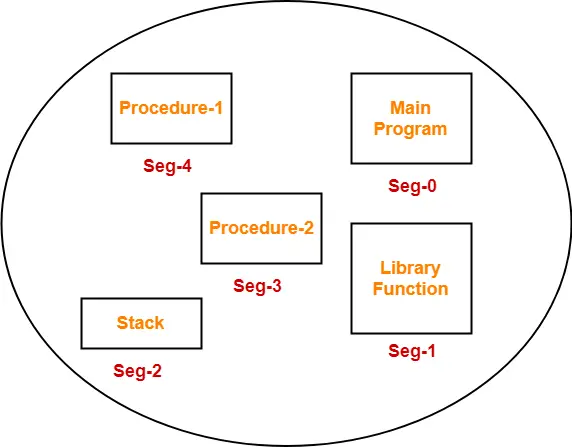
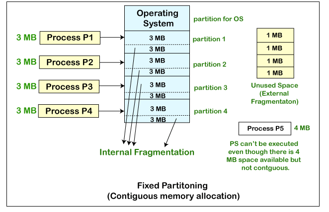
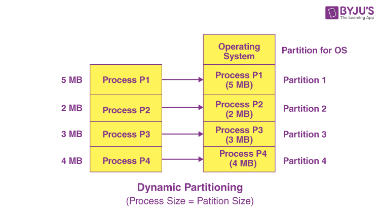

# Unit 3

## 1) Explain fragmentation in detail.

### Fragmentation in Operating Systems

Fragmentation in operating systems refers to the phenomenon where the available memory or disk space becomes divided into small, non-contiguous blocks, leading to inefficiencies in resource utilization and performance degradation. There are two main types of fragmentation:

### 1. **Memory Fragmentation**:

### a. **Internal Fragmentation**:

- **Description**: Internal fragmentation occurs when a process is allocated more memory than it actually needs, leading to wasted space within memory blocks.
- **Causes**: It is typically caused by fixed-size memory allocation schemes where memory blocks are divided into fixed-size partitions, and a process may not fully utilize the allocated space.
- **Impact**: Internal fragmentation reduces the overall efficiency of memory usage and can lead to a decrease in the number of processes that can be accommodated in memory.

### b. **External Fragmentation**:

- **Description**: External fragmentation occurs when free memory blocks are scattered throughout memory, making it challenging to allocate contiguous blocks of memory to processes.
- **Causes**: It is caused by a series of allocations and deallocations that leave small blocks of free memory scattered throughout the memory space.
- **Impact**: External fragmentation can lead to inefficient memory allocation, increased overhead in memory management, and potentially prevent larger processes from being allocated memory even if enough total free memory exists.

### 2. **Disk Fragmentation**:

### a. **File Fragmentation**:

- **Description**: File fragmentation occurs when files are stored in non-contiguous blocks on a disk, leading to slower read and write operations.
- **Causes**: It is caused by frequent file modifications, deletions, and creations that result in files being stored in scattered locations on the disk.
- **Impact**: File fragmentation can result in increased disk access times, reduced system performance, and increased wear and tear on the disk drive.

### b. **Free Space Fragmentation**:

- **Description**: Free space fragmentation occurs when free disk space is divided into small, non-contiguous blocks, making it challenging to allocate contiguous space for new files.
- **Causes**: It is caused by the allocation and deallocation of disk space, leading to small gaps between allocated blocks of data.
- **Impact**: Free space fragmentation can reduce the efficiency of disk space utilization, increase file fragmentation, and lead to slower file access times.

### Fragmentation Solutions:

1. **Compaction**: In memory management, compaction involves moving processes to consolidate free memory blocks and reduce fragmentation.
2. **Defragmentation**: In disk management, defragmentation involves rearranging files and free space to create contiguous blocks of data.
3. **Dynamic Memory Allocation**: Using dynamic memory allocation techniques that can adjust memory block sizes based on process requirements to reduce internal fragmentation.
4. **File System Optimization**: Implementing file system optimization tools that can defragment files and free space on disks to improve performance.

By understanding and addressing fragmentation issues in memory and disk management, operating systems can optimize resource utilization, improve system performance, and enhance overall system reliability.

## 2) If FIFO page replacement algorithm is used with 4 page frames and 8 pages, how many page faults will occur with reference string 0, 1, 2, 4, 7, 2, 0, 3, 4, 7 if four page frames are initially empty? Solve the same problem for LRU page replacement algorithm.

To solve this problem, we need to apply the FIFO (First-In-First-Out) and LRU (Least Recently Used) page replacement algorithms to the given reference string with 4 page frames.

Given:

- Number of page frames: 4
- Reference string: 0, 1, 2, 4, 7, 2, 0, 3, 4, 7
- Initially, all page frames are empty.

### FIFO Page Replacement Algorithm

| Reference | Page Frames | Page Fault |
| --------- | ----------- | ---------- |
| 0         | 0           | Yes        |
| 1         | 0, 1        | Yes        |
| 2         | 0, 1, 2     | Yes        |
| 4         | 0, 1, 2, 4  | Yes        |
| 7         | 0, 1, 2, 7  | Yes        |
| 2         | 1, 2, 4, 7  | No         |
| 0         | 2, 4, 7, 0  | Yes        |
| 3         | 4, 7, 0, 3  | Yes        |
| 4         | 7, 0, 3, 4  | Yes        |
| 7         | 0, 3, 4, 7  | No         |

Total page faults: 9

### LRU Page Replacement Algorithm

| Reference | Page Frames | Page Fault |
| --------- | ----------- | ---------- |
| 0         | 0           | Yes        |
| 1         | 0, 1        | Yes        |
| 2         | 0, 1, 2     | Yes        |
| 4         | 0, 1, 2, 4  | Yes        |
| 7         | 0, 1, 2, 7  | Yes        |
| 2         | 0, 1, 2, 7  | No         |
| 0         | 0, 1, 2, 7  | No         |
| 3         | 1, 2, 7, 3  | Yes        |
| 4         | 1, 2, 3, 4  | Yes        |
| 7         | 1, 2, 3, 7  | Yes        |

Total page faults: 9

In both cases, the FIFO and LRU page replacement algorithms result in 9 page faults for the given reference string and number of page frames.

The main difference between FIFO and LRU is the way they choose the page to be replaced when a page fault occurs. FIFO replaces the page that has been in the memory for the longest time, while LRU replaces the page that has not been used for the longest time.

In this specific example, the page replacement decisions made by FIFO and LRU are the same, leading to the same number of page faults. However, in general, LRU tends to perform better than FIFO because it takes into account the recency of page references, which is a good approximation of future page references.

## 3) What is called TLB? How does it help to speed up paging?

### Translation Lookaside Buffer (TLB)

The Translation Lookaside Buffer (TLB) is a small, high-speed cache in the memory management unit of a computer's CPU that stores recently used virtual-to-physical address translations. The TLB is a hardware cache that accelerates the translation of virtual memory addresses to physical memory addresses during the process of memory access.

### How TLB Helps Speed Up Paging:

1. **Faster Address Translation**:
   - When a program accesses memory, the CPU generates virtual addresses that need to be translated to physical addresses. The TLB stores recently used translations, allowing the CPU to quickly retrieve the corresponding physical address without accessing the slower main memory or page table.
2. **Reduced Memory Access Time**:
   - By storing frequently accessed translations in the TLB, the CPU can avoid accessing the page table in main memory for every memory access. This reduces the time required for address translation and speeds up memory access.
3. **Improved Performance**:
   - The TLB acts as a cache for address translations, similar to how a data cache speeds up data access. By storing frequently used translations, the TLB minimizes the latency associated with address translation, improving overall system performance.
4. **Efficient Paging**:
   - In a paging system, the TLB helps speed up the translation of virtual page numbers to physical frame numbers. By caching these translations, the TLB reduces the overhead of accessing the page table and improves the efficiency of the paging mechanism.
5. **Optimized Virtual Memory Management**:
   - TLB plays a crucial role in optimizing virtual memory management by providing fast access to frequently used address translations. This helps reduce the impact of memory access latency on system performance.
6. **Reduction in Page Table Lookups**:
   - The TLB reduces the number of page table lookups required for address translation by storing recently used translations. This minimizes the time spent on memory access operations and contributes to faster data retrieval.

In summary, the TLB is a critical component in modern computer systems that accelerates memory access by caching frequently used address translations, reducing the latency associated with virtual-to-physical address translation, and improving overall system performance.

## 4) What is called segmentation? Define Segmentation. How it differs from paging?

### Segmentation

Segmentation is a memory management technique used in operating systems to divide the logical address space of a process into variable-sized segments. Each segment represents a logical unit of a program, such as code, data, stack, or heap. Segmentation allows programs to be organized into logically meaningful segments, simplifying memory management and providing protection and sharing mechanisms.

### Definition of Segmentation:

- **Segments**: Segments are logical units of a program, such as code, data, stack, and heap, each with its own size and purpose.
- **Segment Table**: A segment table is used to map logical addresses to physical addresses for each segment.
- **Protection**: Segmentation provides protection by assigning different access rights to different segments, preventing unauthorized access.
- **Sharing**: Segmentation allows sharing of segments among multiple processes, enabling efficient memory utilization.

### Differences Between Segmentation and Paging:

1. **Unit of Division**:
   - **Segmentation**: Divides the logical address space into variable-sized segments based on the program's structure.
   - **Paging**: Divides the logical address space and physical memory into fixed-sized pages.
2. **Address Translation**:
   - **Segmentation**: Uses a segment table to map logical addresses to physical addresses for each segment.
   - **Paging**: Uses a page table to map logical page numbers to physical frame numbers.
3. **Memory Allocation**:
   - **Segmentation**: Allows each segment to grow or shrink dynamically, providing flexibility in memory allocation.
   - **Paging**: Allocates memory in fixed-sized pages, which may lead to internal fragmentation.
4. **Fragmentation**:
   - **Segmentation**: Can lead to external fragmentation due to variable-sized segments.
   - **Paging**: Can lead to internal fragmentation due to fixed-sized pages.
5. **Protection**:
   - **Segmentation**: Provides protection at the segment level, allowing different access rights for different segments.
   - **Paging**: Provides protection at the page level, allowing different access rights for different pages.
6. **Sharing**:
   - **Segmentation**: Facilitates sharing of segments among processes, enhancing memory utilization.
   - **Paging**: Does not inherently support sharing of pages between processes.

In summary, segmentation divides the logical address space into variable-sized segments based on the program's structure, providing flexibility in memory allocation, protection, and sharing mechanisms. Paging, on the other hand, divides the address space into fixed-sized pages, simplifying memory management but potentially leading to internal fragmentation. Both techniques have their advantages and are used in combination in modern operating systems to optimize memory management.

## 5) Explain the following allocation algorithms: 1) First-fit 2) Best-fit 3) Worst-fit

### 1. First-Fit Allocation Algorithm

The first-fit allocation algorithm is a memory allocation technique used in operating systems to assign blocks of memory to processes. It works as follows:

- The algorithm searches the free memory blocks in the order they appear in memory.
- It allocates the first block that is large enough to accommodate the requested memory size.
- If no single free block is large enough, the process is not allocated memory.

Advantages:

- Simple to implement and fast.
- Minimizes the number of memory searches.

Disadvantages:

- Can lead to increased external fragmentation over time.
- Allocated blocks may be larger than the requested size, leading to internal fragmentation.

### 2. Best-Fit Allocation Algorithm

The best-fit allocation algorithm is another memory allocation technique that aims to find the best-fitting free block for a given memory request. It works as follows:

- The algorithm searches all free memory blocks to find the one that is closest in size to the requested memory size.
- If a block is found that is exactly the same size as the requested memory, it is allocated to the process.
- If no exact match is found, the smallest block that is larger than the requested size is allocated.

Advantages:

- Minimizes internal fragmentation by allocating the smallest possible block.
- Reduces the likelihood of large free blocks being left unused.

Disadvantages:

- Requires searching all free blocks, which can be time-consuming.
- Can lead to increased external fragmentation over time.

### 3. Worst-Fit Allocation Algorithm

The worst-fit allocation algorithm is a memory allocation technique that aims to find the largest free block for a given memory request. It works as follows:

- The algorithm searches all free memory blocks to find the largest block.
- If the largest block is larger than the requested memory size, it is allocated to the process.
- If the largest block is smaller than the requested size, the process is not allocated memory.

Advantages:

- Maintains larger free blocks, which can be useful for future allocations.
- Reduces the likelihood of small free blocks being left unused.

Disadvantages:

- Requires searching all free blocks, which can be time-consuming.
- Can lead to increased external fragmentation over time.
- Allocates the largest possible block, which may result in more internal fragmentation compared to best-fit.

The choice of allocation algorithm depends on the specific requirements of the system and the trade-offs between internal fragmentation, external fragmentation, and allocation time. In practice, a combination of these algorithms may be used to optimize memory utilization and performance.

## 6) Explain Swapping in Detail.

### Swapping in Operating Systems

Swapping is a memory management technique used in operating systems to temporarily move pages or segments of a process from main memory (RAM) to secondary storage (usually a hard disk) when they are not actively being used. Swapping allows the operating system to free up physical memory by transferring less frequently accessed data to disk, making room for other processes and improving overall system performance.

### How Swapping Works:

1. **Page Replacement**:
   - When a process is not actively using a page in memory, the operating system can swap it out to disk to make room for other processes.
2. **Page Faults**:
   - If a process tries to access a page that has been swapped out, a page fault occurs, and the operating system brings the required page back into memory from disk.
3. **Swapping Process**:
   - The operating system maintains a swap space on disk where swapped-out pages are stored.
   - When a page needs to be swapped out, the OS copies the page to the swap space and updates the page table to reflect its new location.
4. **Swapping Policies**:
   - The operating system uses swapping policies to determine which pages to swap out based on factors like page access frequency, priority, and memory pressure.
5. **Swapping vs. Paging**:
   - Swapping involves moving entire processes or segments to disk, while paging involves moving individual pages.
   - Swapping is a higher-level concept that includes paging as one of its mechanisms.

### Benefits of Swapping:

1. **Increased Memory Capacity**:
   - Swapping allows the system to run more processes than can fit in physical memory by using disk space as an extension of RAM.
2. **Improved System Performance**:
   - Swapping helps prevent memory exhaustion and allows the system to efficiently manage memory resources, reducing the likelihood of out-of-memory errors.
3. **Dynamic Memory Management**:
   - Swapping enables dynamic allocation and deallocation of memory, optimizing memory usage and improving system responsiveness.
4. **Process Isolation**:
   - Swapping helps isolate processes by moving them to disk when they are not actively running, ensuring that each process has sufficient memory resources.

### Drawbacks of Swapping:

1. **Performance Overhead**:
   - Swapping data between disk and memory can introduce latency and overhead, impacting system performance.
2. **Disk I/O Bottleneck**:
   - Excessive swapping can lead to increased disk I/O operations, potentially causing disk thrashing and slowing down the system.
3. **Fragmentation**:
   - Swapping can contribute to disk fragmentation as pages are written and read from different locations on the disk.

Overall, swapping is a crucial memory management technique that allows operating systems to efficiently utilize memory resources, manage multiple processes, and maintain system stability and performance. Proper tuning and optimization of swapping policies are essential to ensure efficient memory management and optimal system performance.

## 7) Explain the Segmentation in detail with suitable diagram.

Segmentation is a memory management technique used in operating systems to divide the logical address space of a process into variable-sized segments. Each segment represents a logical unit of a program, such as code, data, stack, or heap. Segmentation allows programs to be organized into logically meaningful segments, simplifying memory management and providing protection and sharing mechanisms.

### Components of Segmentation:

1. **Segments**:
   - Segments are logical units of a program, such as code, data, stack, and heap, each with its own size and purpose.
2. **Segment Table**:
   - A segment table is used to map logical addresses to physical addresses for each segment. It stores the base address and limit of each segment.
3. **Logical Address**:
   - In segmentation, a logical address consists of two parts: a segment number and an offset within the segment.
4. **Segment Number**:
   - The segment number identifies which segment the logical address belongs to.
5. **Offset**:
   - The offset specifies the location within the identified segment.
6. **Protection**:
   - Segmentation provides protection by assigning different access rights to different segments, preventing unauthorized access.
7. **Sharing**:
   - Segmentation allows sharing of segments among multiple processes, enabling efficient memory utilization and inter-process communication.

### Address Translation in Segmentation:

1. **Logical Address Formation**:
   - A logical address is formed by specifying a segment number and an offset.
2. **Segment Table Lookup**:
   - The segment number is used as an index to the segment table to find the base address and limit of the corresponding segment.
3. **Bounds Check**:
   - The offset is checked against the segment limit to ensure that it falls within the segment boundaries. If the offset exceeds the segment limit, a segmentation fault occurs.
4. **Physical Address Calculation**:
   - If the offset is within the segment limit, the physical address is calculated by adding the segment base address to the offset.

### Advantages of Segmentation:

1. **Logical Organization**:
   - Segmentation allows programs to be organized into logically meaningful units, simplifying memory management and program development.
2. **Protection**:
   - Segmentation provides protection by assigning different access rights to different segments, preventing unauthorized access.
3. **Sharing**:
   - Segments can be shared among multiple processes, enabling efficient memory utilization and inter-process communication.
4. **Flexibility**:
   - Segments can grow or shrink dynamically, providing flexibility in memory allocation.

### Disadvantages of Segmentation:

1. **External Fragmentation**:
   - Segmentation can lead to external fragmentation due to variable-sized segments.
2. **Complexity**:
   - Segmentation is more complex than paging, as it requires maintaining a segment table and performing bounds checks during address translation.
3. **Overhead**:
   - The additional overhead of segment table lookups and bounds checks can impact performance compared to paging.

In summary, segmentation is a memory management technique that divides the logical address space into variable-sized segments, providing logical organization, protection, sharing, and flexibility in memory allocation. However, it can lead to external fragmentation and incur additional overhead compared to paging.

## 8) Explain the Multiprogramming with fixed partitions in detail with suitable diagram.

Multiprogramming with fixed partitions is a memory management technique used in operating systems to allow multiple processes to reside in memory simultaneously. In this approach, the available memory is divided into a fixed number of partitions, each with a predetermined size. The partitions remain fixed in size throughout the execution of the processes.

### Components of Multiprogramming with Fixed Partitions:

1. **Memory Partitions**:
   - The available memory is divided into a fixed number of partitions, each with a predetermined size.
   - The partitions remain fixed in size and are not resized during the execution of processes.
2. **Partition Allocation**:
   - When a process arrives, it is assigned to a partition based on its size requirements and the availability of partitions.
   - If a partition is available that can accommodate the process, the process is loaded into that partition.
3. **Partition Deallocation**:
   - When a process completes its execution, the partition it occupied is deallocated and becomes available for other processes.
4. **External Fragmentation**:
   - External fragmentation can occur when processes are loaded and unloaded from partitions, leaving gaps between occupied partitions.
   - This can lead to situations where there is enough total free memory, but no single partition is large enough to accommodate a new process.
5. **Compaction**:
   - To address external fragmentation, compaction can be performed by moving processes within partitions to consolidate free space.
   - Compaction involves shifting processes to adjacent partitions to create larger contiguous free spaces.
6. **Swapping**:
   - In some cases, a process may need to be swapped out of memory to make room for a higher-priority process.
   - Swapping involves temporarily moving a process from memory to secondary storage (e.g., disk) and then bringing it back when needed.

### Advantages of Multiprogramming with Fixed Partitions:

1. **Simplicity**:
   - The fixed partition approach is relatively simple to implement and manage compared to other memory management techniques.
2. **Predictability**:
   - The fixed size of partitions provides predictability in memory allocation and can be useful for real-time systems with specific memory requirements.

### Disadvantages of Multiprogramming with Fixed Partitions:

1. **External Fragmentation**:
   - The fixed partition approach can lead to external fragmentation, reducing the effective utilization of available memory.
2. **Inefficient Memory Utilization**:
   - If processes do not fit exactly into the available partitions, internal fragmentation can occur, leading to wasted memory within partitions.
3. **Lack of Flexibility**:
   - The fixed partition approach lacks flexibility in memory allocation, as processes are limited to the predefined partition sizes.
4. **Potential for Underutilization**:
   - If the partition sizes are not chosen carefully, some partitions may remain underutilized while others are overloaded, leading to inefficient memory usage.

Multiprogramming with fixed partitions is a simple and predictable memory management technique, but it can suffer from external fragmentation and inefficient memory utilization. More advanced techniques, such as variable partitions or paging, are often used to address these limitations and improve overall memory management efficiency.

## 9) Explain the Multiprogramming with Dynamic or Variable partitions in detail with suitable diagram.

Multiprogramming with dynamic or variable partitions is a memory management technique used in operating systems to allow multiple processes to reside in memory simultaneously. In this approach, the available memory is divided into variable-sized partitions that can adjust dynamically based on the size of the processes being loaded. This flexibility allows for efficient memory utilization and reduces internal fragmentation compared to fixed partitioning schemes.

### Components of Multiprogramming with Dynamic Partitions:

1. **Dynamic Partitioning**:
   - Memory is divided into variable-sized partitions that can adjust based on the size of the processes being loaded.
   - Partitions are created and resized dynamically to accommodate processes of varying sizes.
2. **Partition Allocation**:
   - When a process arrives, it is allocated a partition that is large enough to accommodate its memory requirements.
   - Partitions are allocated and deallocated as processes enter and exit the system.
3. **Internal Fragmentation**:
   - Internal fragmentation is minimized in dynamic partitioning as partitions are sized to match the memory requirements of processes, reducing wasted memory within partitions.
4. **Partition Table**:
   - A partition table is used to track the status of each partition, including whether it is free or allocated and the size of the partition.
5. **Memory Compaction**:
   - To address fragmentation and optimize memory utilization, memory compaction may be performed by moving processes within partitions to consolidate free space.
6. **Swapping**:
   - Swapping may be used to temporarily move processes out of memory to make room for other processes when memory becomes constrained.

### Advantages of Multiprogramming with Dynamic Partitions:

1. **Efficient Memory Utilization**:
   - Dynamic partitioning reduces internal fragmentation by allocating partitions based on the actual memory requirements of processes.
2. **Flexibility**:
   - The ability to adjust partition sizes dynamically allows for efficient memory allocation and utilization, accommodating processes of varying sizes.
3. **Optimized Memory Management**:
   - Dynamic partitioning optimizes memory usage by allocating memory based on actual process requirements, reducing wasted memory and improving system performance.

### Disadvantages of Multiprogramming with Dynamic Partitions:

1. **Fragmentation**:
   - Dynamic partitioning can still suffer from external fragmentation if processes are loaded and unloaded in a way that leaves gaps between partitions.
2. **Overhead**:
   - Managing dynamic partitions requires additional overhead compared to fixed partitioning schemes, as the system needs to track and adjust partition sizes dynamically.
3. **Complexity**:
   - Dynamic partitioning is more complex to implement and manage than fixed partitioning schemes, requiring efficient algorithms for partition allocation and deallocation.

Multiprogramming with dynamic partitions offers improved memory utilization and flexibility compared to fixed partitioning schemes. By dynamically adjusting partition sizes based on process requirements, this approach optimizes memory management and enhances system performance by reducing internal fragmentation and improving memory utilization efficiency.

## 10) For the following page reference string: 7, 0, 1, 2, 0, 3, 0, 4, 2, 3, 0, 3, 2, 1, 2, 0, 1, 7, 0, 1. Calculate the page faults applying the following Page Replacement Algorithms for a memory with three frames: (i) Optimal (ii) LRU (iii) FIFO

To calculate the page faults for the given page reference string using the Optimal, LRU (Least Recently Used), and FIFO (First-In-First-Out) page replacement algorithms, we'll apply each algorithm step by step.

Given:

- Page reference string: 7, 0, 1, 2, 0, 3, 0, 4, 2, 3, 0, 3, 2, 1, 2, 0, 1, 7, 0, 1
- Number of frames: 3

### (i) Optimal Page Replacement Algorithm

| Reference | Frames  | Fault |
| --------- | ------- | ----- |
| 7         | 7       | Yes   |
| 0         | 7, 0    | Yes   |
| 1         | 7, 0, 1 | Yes   |
| 2         | 7, 0, 2 | Yes   |
| 0         | 0, 2, 0 | No    |
| 3         | 2, 0, 3 | Yes   |
| 0         | 0, 3, 0 | No    |
| 4         | 3, 0, 4 | Yes   |
| 2         | 0, 4, 2 | Yes   |
| 3         | 4, 2, 3 | Yes   |
| 0         | 2, 3, 0 | Yes   |
| 3         | 3, 0, 3 | No    |
| 2         | 0, 3, 2 | Yes   |
| 1         | 3, 2, 1 | Yes   |
| 2         | 2, 1, 2 | No    |
| 0         | 1, 2, 0 | Yes   |
| 1         | 2, 0, 1 | Yes   |
| 7         | 0, 1, 7 | Yes   |
| 0         | 1, 7, 0 | Yes   |
| 1         | 7, 0, 1 | No    |

Total page faults: 15

### (ii) LRU Page Replacement Algorithm

| Reference | Frames  | Fault |
| --------- | ------- | ----- |
| 7         | 7       | Yes   |
| 0         | 7, 0    | Yes   |
| 1         | 7, 0, 1 | Yes   |
| 2         | 7, 0, 2 | Yes   |
| 0         | 0, 2, 0 | No    |
| 3         | 2, 0, 3 | Yes   |
| 0         | 0, 3, 0 | No    |
| 4         | 3, 0, 4 | Yes   |
| 2         | 0, 4, 2 | Yes   |
| 3         | 4, 2, 3 | Yes   |
| 0         | 2, 3, 0 | Yes   |
| 3         | 0, 3    | No    |
| 2         | 3, 2    | Yes   |
| 1         | 2, 1    | Yes   |
| 2         | 1, 2    | No    |
| 0         | 2, 0    | Yes   |
| 1         | 0, 1    | Yes   |
| 7         | 1, 7    | Yes   |
| 0         | 7, 0    | Yes   |
| 1         | 0, 1    | No    |

Total page faults: 15

### (iii) FIFO Page Replacement Algorithm

| Reference | Frames  | Fault |
| --------- | ------- | ----- |
| 7         | 7       | Yes   |
| 0         | 7, 0    | Yes   |
| 1         | 7, 0, 1 | Yes   |
| 2         | 7, 0, 2 | Yes   |
| 0         | 0, 2, 0 | No    |
| 3         | 2, 0, 3 | Yes   |
| 0         | 0, 3, 0 | No    |
| 4         | 3, 0, 4 | Yes   |
| 2         | 0, 4, 2 | Yes   |
| 3         | 4, 2, 3 | Yes   |
| 0         | 2, 3, 0 | Yes   |
| 3         | 3, 0, 3 | No    |
| 2         | 0, 3, 2 | Yes   |
| 1         | 3, 2, 1 | Yes   |
| 2         | 2, 1, 2 | No    |
| 0         | 1, 2, 0 | Yes   |
| 1         | 2, 0, 1 | Yes   |
| 7         | 0, 1, 7 | Yes   |
| 0         | 1, 7, 0 | No    |
| 1         | 7, 0, 1 | No    |

Total page faults: 16

In this example:

- The Optimal and LRU algorithms result in 15 page faults each.
- The FIFO algorithm results in 16 page faults.

The Optimal algorithm performs the best because it replaces the page that will be used farthest in the future, minimizing the number of page faults. LRU is also efficient because it replaces the page that has not been used for the longest time, which is a good approximation of future page references.

FIFO performs slightly worse than Optimal and LRU because it replaces the page that has been in memory for the longest time, which may not always be the best choice.

## 11) Explain TLB and Virtual Memory.

### Translation Lookaside Buffer (TLB)

The Translation Lookaside Buffer (TLB) is a small, high-speed cache in the memory management unit of a computer's CPU that stores recently used virtual-to-physical address translations. The TLB is a critical component in virtual memory systems, as it accelerates the translation of virtual memory addresses to physical memory addresses during the process of memory access.

### How TLB Works:

1. **Virtual Address**:
   - The CPU generates a virtual address, which is the address used by the program to access memory.
2. **TLB Lookup**:
   - The virtual address is sent to the TLB, which checks if the translation is already cached.
3. **Cache Hit**:
   - If the translation is found in the TLB, the physical address is returned directly to the CPU.
4. **Cache Miss**:
   - If the translation is not found in the TLB, the CPU accesses the page table in memory to retrieve the physical address.
5. **Page Table Access**:
   - The page table contains the virtual-to-physical address translations for the process.
6. **TLB Update**:
   - The retrieved physical address is stored in the TLB for future use.

### Virtual Memory

Virtual memory is a memory management technique that allows a computer to use more memory than is physically available in the system. It combines the physical RAM with a reserved space on the hard disk, known as the page file or swap space, to provide a larger address space for programs to run.

### How Virtual Memory Works:

1. **Virtual Address Space**:
   - Each process has its own virtual address space, which is the range of addresses that the process can use.
2. **Memory Allocation**:
   - When a process requests memory, the operating system allocates a portion of the virtual address space.
3. **Page Table**:
   - The page table maps the virtual addresses used by the process to physical addresses in RAM or the page file.
4. **Page Fault**:
   - If a process accesses a page that is not in physical RAM, a page fault occurs.
5. **Page Replacement**:
   - The operating system replaces a page in RAM with a page from the page file to free up space.
6. **Page File**:
   - The page file is a reserved space on the hard disk that stores pages that are not currently in RAM.

### Benefits of Virtual Memory:

1. **Memory Efficiency**:
   - Virtual memory allows multiple processes to share the same physical RAM, improving memory utilization.
2. **Memory Flexibility**:
   - Virtual memory enables programs to use more memory than is physically available, allowing for larger programs and data sets.
3. **Memory Protection**:
   - Virtual memory provides memory protection by preventing processes from accessing each other's memory.

In summary, the TLB is a critical component in virtual memory systems, as it accelerates the translation of virtual memory addresses to physical memory addresses. Virtual memory allows computers to use more memory than is physically available, improving memory efficiency, flexibility, and protection.

## 12) Give the name of technique used for overcoming external fragmentation.

There are a few techniques used to overcome external fragmentation in memory management:

1. **Compaction**:
   - Compaction is a technique used to overcome external fragmentation by moving processes within memory to consolidate free space into larger contiguous blocks.
   - It involves shifting processes to adjacent partitions or pages to create larger free spaces, making it easier to allocate memory to new processes.
2. **Coalescing**:
   - Coalescing is a technique used in dynamic memory allocation to overcome external fragmentation by merging adjacent free blocks into larger blocks.
   - When a process is deallocated, the memory manager checks if the freed block is adjacent to any other free blocks. If so, it merges them into a single larger block, reducing fragmentation.
3. **Buddy System**:
   - The buddy system is a memory allocation technique that divides memory into equal-sized blocks called buddies.
   - When a process requests memory, the system allocates the smallest available block that satisfies the request. If no such block exists, the system recursively splits the next larger block into two equal-sized buddies until a suitable block is found.
   - When a process is deallocated, the system checks if its buddy is also free. If so, it merges the two buddies into a larger block, reducing fragmentation.
4. **Segregated Free Lists**:
   - Segregated free lists is a technique used in dynamic memory allocation where free blocks are organized into separate lists based on their sizes.
   - Each list contains free blocks of a specific size range, making it easier to find a suitable block for a given request and reducing external fragmentation.
5. **Slab Allocation**:
   - Slab allocation is a memory management technique used in the Linux kernel to improve memory utilization and reduce fragmentation.
   - It involves pre-allocating and caching objects of a specific size, reducing the need for dynamic allocation and deallocation, which can lead to fragmentation.

These techniques help overcome external fragmentation by efficiently managing and organizing free memory blocks, making it easier to allocate memory to new processes and reducing the amount of wasted space due to fragmentation.

## 13) What is paging? Explain Paging mechanism in MMU with example.

Paging is a memory management technique used in operating systems to overcome the limitations of segmentation and provide a more efficient way of managing memory. In paging, the physical memory is divided into fixed-size blocks called frames, while the logical memory is divided into blocks of the same size called pages.

### Paging Mechanism in MMU (Memory Management Unit):

1. **Virtual Address Formation**:
   - The virtual address is divided into two parts: page number and page offset.
   - The page number is used to index into the page table, while the page offset specifies the location within the page.
2. **Page Table**:
   - The page table is a data structure maintained by the operating system that maps virtual pages to physical frames.
   - Each entry in the page table contains the base address of the corresponding physical frame and additional information, such as access rights and validity bits.
3. **Page Table Base Register (PTBR)**:
   - The PTBR stores the starting address of the page table in memory.
4. **Page Table Entry (PTE)**:
   - A PTE contains the physical frame number and other information, such as protection bits and valid/invalid bits.
5. **Address Translation**:
   - When the CPU generates a virtual address, the MMU performs the following steps:
     a. The page number is used to index into the page table using the PTBR.
     b. The corresponding PTE is retrieved, which contains the physical frame number.
     c. The physical frame number is combined with the page offset to form the final physical address.
6. **Valid/Invalid Bit**:
   - The valid/invalid bit in the PTE indicates whether the page is currently in physical memory (valid) or not (invalid).
   - If the bit is invalid, a page fault occurs, and the operating system must bring the required page from secondary storage (e.g., disk) into physical memory.
7. **Page Replacement**:
   - When a page fault occurs, the operating system must select a page to be replaced from physical memory to make room for the new page.
   - Various page replacement algorithms, such as FIFO (First-In-First-Out), LRU (Least Recently Used), and Optimal, can be used to determine which page to replace.

### Example:

Let's assume we have a virtual address space of 16 pages and a physical memory of 4 frames. The page size is 1 KB, and the frame size is also 1 KB.

Virtual Address: 0x1234 (page number: 0x1, page offset: 0x234)

Page Table:

| Page Number | Frame Number |
| ----------- | ------------ |
| 0           | 2            |
| 1           | 1            |
| 2           | 3            |
| 3           | 0            |

Address Translation:

1. The page number (0x1) is used to index into the page table, retrieving the frame number (1).
2. The physical frame number (1) is combined with the page offset (0x234) to form the final physical address: 0x1234.

In this example, the virtual address 0x1234 is translated to the physical address 0x1234 by using the page table to map the page number to the corresponding frame number.

Paging provides several advantages over segmentation, such as simplified memory management, reduced external fragmentation, and efficient utilization of physical memory. However, it can still suffer from internal fragmentation due to the fixed size of pages and frames.

## 14) What is called device driver? Explain its function in brief.

A device driver is a software component that allows the operating system to communicate with and control hardware devices such as printers, graphics cards, network adapters, and storage devices. Device drivers act as intermediaries between the hardware device and the operating system, enabling the OS to send commands to the device, receive data from it, and manage its operations effectively.

### Functions of Device Drivers:

1. **Hardware Communication**:
   - Device drivers facilitate communication between the operating system and hardware devices by translating high-level commands from the OS into low-level commands that the device can understand.
2. **Device Initialization**:
   - Device drivers initialize hardware devices during system startup, configuring them to operate within the system environment.
3. **Data Transfer**:
   - Device drivers manage the transfer of data between the operating system and hardware devices, ensuring efficient and reliable data exchange.
4. **Error Handling**:
   - Device drivers handle errors and exceptions that may occur during device operation, providing error messages and taking appropriate actions to recover from errors.
5. **Resource Management**:
   - Device drivers manage system resources such as memory, interrupts, and I/O ports to ensure that hardware devices operate efficiently and do not conflict with other devices.
6. **Power Management**:
   - Device drivers implement power management features to control the power state of devices, enabling energy-saving modes and optimizing power consumption.
7. **Interrupt Handling**:
   - Device drivers handle hardware interrupts generated by devices to notify the CPU of events that require immediate attention, such as data arrival or device errors.
8. **Device Configuration**:
   - Device drivers provide configuration options for hardware devices, allowing users to customize device settings and optimize performance.
9. **Compatibility**:
   - Device drivers ensure that hardware devices are compatible with the operating system by providing the necessary software interfaces and protocols for device operation.
10. **Security**:
    - Device drivers implement security measures to protect against unauthorized access to devices and ensure the integrity and confidentiality of data transmitted to and from devices.

In summary, device drivers play a crucial role in enabling the operating system to interact with hardware devices, ensuring seamless communication, efficient data transfer, and optimal performance of devices within the system. They act as essential components that bridge the gap between software and hardware, allowing users to utilize and control a wide range of devices effectively.

## 15) What is RAID? Explain in brief.

RAID (Redundant Array of Independent Disks) is a technology used in computer storage systems to improve performance, increase reliability, and provide fault tolerance. RAID combines multiple disk drives (or solid-state drives) into a logical unit to achieve these benefits.

### Types of RAID:

1. **RAID 0 (Striping)**:
   - RAID 0 stripes data across multiple disks, improving read and write performance.
   - It does not provide any data redundancy, so if one disk fails, all data is lost.
2. **RAID 1 (Mirroring)**:
   - RAID 1 creates an exact copy (mirror) of data on two or more disks.
   - It provides data redundancy and fault tolerance, as data can be accessed from any of the mirrored disks.
3. **RAID 5 (Striping with Distributed Parity)**:
   - RAID 5 stripes data across multiple disks and distributes parity information across all disks.
   - It provides data redundancy and can tolerate the failure of one disk.
4. **RAID 6 (Striping with Double Distributed Parity)**:
   - RAID 6 is similar to RAID 5, but it uses two independent parity calculations.
   - It can tolerate the failure of up to two disks.
5. **RAID 10 (Mirroring and Striping)**:
   - RAID 10 combines RAID 0 and RAID 1, striping data across mirrored sets of disks.
   - It provides both performance and data redundancy, but requires a minimum of four disks.

### Benefits of RAID:

1. **Improved Performance**:
   - RAID can improve read and write performance by striping data across multiple disks.
2. **Increased Reliability**:
   - RAID provides data redundancy, ensuring that data can be recovered in case of disk failures.
3. **Fault Tolerance**:
   - RAID can tolerate the failure of one or more disks, depending on the RAID level used.
4. **Scalability**:
   - RAID allows for easy expansion of storage capacity by adding more disks to the array.
5. **Data Availability**:
   - RAID ensures that data remains accessible even in the event of a disk failure, minimizing downtime and data loss.

RAID is commonly used in servers, storage area networks (SANs), and high-performance computing environments to provide reliable and efficient data storage solutions. The choice of RAID level depends on the specific requirements of the system, such as performance, storage capacity, and fault tolerance.

## 16) Disk requests come in to the disk driver for cylinders 10, 22, 20, 2, 40, 6, and 38, in that order. A seek takes 6 msec per cylinder moved. How much seek time is needed for FCFS, Elevator algo. In all cases, the arm is initially at cylinder 20.

To calculate the seek time needed for the First-Come-First-Serve (FCFS) and Elevator (SCAN) disk scheduling algorithms for the given disk requests, we will consider the initial position of the disk arm at cylinder 20 and the time it takes to move the arm between cylinders.

Given:

- Initial position of the disk arm: Cylinder 20
- Disk requests: 10, 22, 20, 2, 40, 6, 38
- Time taken for a seek: 6 msec per cylinder moved

### FCFS (First-Come-First-Serve) Algorithm:

1. **FCFS Seek Sequence**:
   - 20 → 10 → 22 → 20 → 2 → 40 → 6 → 38
2. **FCFS Seek Time Calculation**:
   - Total seek time = (20-10) + (22-10) + (22-20) + (20-2) + (40-2) + (40-6) + (40-38)
   - Total seek time = 10 + 12 + 2 + 18 + 38 + 34 + 2
   - Total seek time = 116 msec

### Elevator (SCAN) Algorithm:

1. **Elevator Seek Sequence**:
   - 20 → 22 → 38 → 40 → 2 → 6 → 10
2. **Elevator Seek Time Calculation**:
   - Total seek time = (22-20) + (38-22) + (40-38) + (40-2) + (6-2) + (10-6)
   - Total seek time = 2 + 16 + 2 + 38 + 4 + 4
   - Total seek time = 66 msec

### Summary:

- **FCFS Seek Time**: 116 msec
- **Elevator (SCAN) Seek Time**: 66 msec

In this scenario, the Elevator (SCAN) algorithm results in a shorter total seek time compared to the FCFS algorithm. Elevator (SCAN) optimizes seek time by moving the disk arm in one direction until reaching the last requested cylinder, then reversing direction to serve requests in the opposite direction. This minimizes the total seek time by reducing unnecessary back-and-forth movements of the disk arm.

## 17) Write short note: RAID levels.

RAID (Redundant Array of Independent Disks) levels are configurations that define how data is distributed and protected across multiple disks in a storage system. Each RAID level offers a different balance of performance, data redundancy, and storage efficiency. Some common RAID levels include:

1. **RAID 0 (Striping)**:
   - Data is striped across multiple disks for improved performance.
   - No data redundancy; if one disk fails, all data is lost.
   - Best suited for applications requiring high performance but not data protection.
2. **RAID 1 (Mirroring)**:
   - Data is mirrored across two or more disks for redundancy.
   - Provides data redundancy; if one disk fails, data can be accessed from the mirror.
   - Offers high data protection but reduces storage efficiency by 50%.
3. **RAID 5 (Striping with Distributed Parity)**:
   - Data is striped across multiple disks with distributed parity for data protection.
   - Provides data redundancy and can tolerate the failure of one disk.
   - Offers a good balance of performance, data protection, and storage efficiency.
4. **RAID 6 (Striping with Double Distributed Parity)**:
   - Similar to RAID 5 but with dual parity for increased fault tolerance.
   - Can tolerate the failure of up to two disks.
   - Offers higher data protection at the cost of reduced storage efficiency.
5. **RAID 10 (Mirroring and Striping)**:
   - Combines RAID 1 (mirroring) and RAID 0 (striping) for performance and redundancy.
   - Data is striped across mirrored sets of disks.
   - Provides high performance, data redundancy, and fault tolerance but requires a minimum of four disks.
6. **RAID 50 and RAID 60**:
   - Hybrid RAID levels that combine RAID 5 or RAID 6 with RAID 0 for improved performance and fault tolerance.
   - RAID 50 combines RAID 5 with RAID 0, while RAID 60 combines RAID 6 with RAID 0.

Each RAID level offers unique benefits and trade-offs, allowing organizations to choose the most suitable configuration based on their performance, data protection, and storage efficiency requirements. RAID levels play a crucial role in designing resilient and high-performance storage solutions for various applications and environments.

## 18) Explain SSTF and LOOK disk scheduling algorithms.

SSTF (Shortest Seek Time First) and LOOK are two disk scheduling algorithms used to optimize the order in which disk requests are serviced, aiming to minimize the total seek time and improve overall disk performance.

### SSTF (Shortest Seek Time First) Algorithm:

1. **Description**:
   - SSTF selects the disk request that is closest to the current position of the disk arm.
   - It always chooses the request that requires the shortest seek time from the current position.
2. **Seek Time Calculation**:
   - The seek time is calculated as the absolute difference between the current cylinder and the requested cylinder.
3. **Advantages**:
   - Reduces the total seek time by servicing requests that are closest to the current position.
   - Provides good average response time for requests.
4. **Disadvantages**:
   - Can lead to starvation for requests that are far from the current position, as they may never be serviced if new requests are continuously added closer to the current position.
   - Requires maintaining a sorted queue of requests based on their proximity to the current position, which can be computationally expensive for large request queues.

### LOOK Algorithm:

1. **Description**:
   - LOOK is a variation of the SCAN algorithm, also known as the "elevator" algorithm.
   - It moves the disk arm in one direction, servicing requests until it reaches the last request in that direction.
   - The disk arm then reverses direction and services requests in the opposite direction until it reaches the last request in that direction.
2. **Seek Time Calculation**:
   - The seek time is calculated based on the distance the disk arm needs to travel to service each request.
3. **Advantages**:
   - Avoids unnecessary movement of the disk arm beyond the last request in a given direction, reducing the total seek time.
   - Provides better fairness compared to SSTF by ensuring that all requests are eventually serviced.
4. **Disadvantages**:
   - May still lead to some starvation for requests that are far from the current position, as they may be serviced last in each direction.
   - Requires maintaining a sorted queue of requests based on their cylinder numbers to determine the last request in each direction.

Both SSTF and LOOK aim to optimize disk performance by minimizing the total seek time and providing good average response times for requests. The choice between these algorithms depends on the specific requirements of the system, such as the importance of fairness, the size of the request queue, and the computational resources available for maintaining sorted queues.

## 19) Explain the goals of I/O software.

The main goals of I/O (Input/Output) software in an operating system are:

1. **Device Independence**:
   - Provide a uniform interface for applications to interact with various I/O devices, abstracting away the details of each device.
   - Allow applications to use I/O devices without knowing their specific characteristics or how they are connected to the system.
2. **Uniform Naming**:
   - Establish a consistent naming scheme for I/O devices, such as file names or device names, to simplify their identification and access.
   - Ensure that all I/O devices can be accessed using the same naming conventions.
3. **Buffering**:
   - Temporarily store data in memory buffers to compensate for speed differences between the CPU and I/O devices.
   - Improve I/O performance by allowing data to be transferred in larger blocks and reducing the number of system calls.
4. **Spooling and Device Sharing**:
   - Enable multiple processes to share I/O devices by spooling their requests and executing them in a specific order.
   - Provide fairness and prevent conflicts when multiple processes attempt to access the same device simultaneously.
5. **Error Handling**:
   - Detect and handle errors that may occur during I/O operations, such as device failures, timeouts, or invalid requests.
   - Provide appropriate error messages and recovery mechanisms to ensure the reliability and robustness of the system.
6. **Synchronization and Scheduling**:
   - Coordinate the execution of I/O operations to ensure that they are performed in the correct order and at the appropriate times.
   - Implement scheduling algorithms to determine the order in which I/O requests are serviced, optimizing for factors such as fairness, response time, or throughput.
7. **Protection and Security**:
   - Enforce access control policies to prevent unauthorized access to I/O devices and protect sensitive data.
   - Ensure that I/O operations do not violate the security boundaries of the system or compromise the integrity of data.
8. **Efficiency and Performance**:
   - Optimize I/O performance by minimizing overhead, reducing context switches, and leveraging hardware features such as direct memory access (DMA).
   - Continuously monitor and improve I/O performance based on workload characteristics and system requirements.

By achieving these goals, the I/O software in an operating system enables efficient, reliable, and secure access to I/O devices, allowing applications to focus on their core functionality without worrying about the underlying hardware details.

## 20) Explain any three Disk Arm Scheduling algorithms with suitable illustrations.

### Disk Arm Scheduling Algorithms:

Disk arm scheduling algorithms are used to optimize the order in which disk requests are serviced, aiming to minimize seek time and improve overall disk performance. Three common disk arm scheduling algorithms are:

1. **FCFS (First-Come-First-Serve)**:
   - **Description**: FCFS services disk requests in the order they arrive.
   - **Illustration**:
     - Disk Arm: 20
     - Requests: 10, 22, 20, 2, 40, 6, 38
     - Seek Sequence: 20 → 10 → 22 → 20 → 2 → 40 → 6 → 38
     - FCFS Disk Scheduling
2. **SSTF (Shortest Seek Time First)**:
   - **Description**: SSTF selects the request closest to the current disk arm position.
   - **Illustration**:
     - Disk Arm: 20
     - Requests: 10, 22, 20, 2, 40, 6, 38
     - Seek Sequence: 20 → 22 → 38 → 40 → 2 → 6 → 10
     - SSTF Disk Scheduling
3. **SCAN (Elevator)**:
   - **Description**: SCAN moves the disk arm in one direction, servicing requests until the end, then reverses direction.
   - **Illustration**:
     - Disk Arm: 20
     - Requests: 10, 22, 20, 2, 40, 6, 38
     - Seek Sequence: 20 → 22 → 38 → 40 → 2 → 6 → 10
     - SCAN Disk Scheduling

These algorithms aim to optimize disk performance by minimizing seek time and efficiently servicing disk requests. FCFS processes requests in arrival order, SSTF prioritizes the closest request, and SCAN moves the disk arm in a sweeping motion to service requests effectively. Each algorithm has its strengths and limitations, making them suitable for different system requirements and workloads.

## 20) Define: rotational latency

Rotational latency is a measure of the time it takes for the desired sector on a disk to rotate into a position where it can be read or written by the disk head. It is one of the key factors that determines the overall access time for a disk operation, along with seek time (the time it takes for the disk head to move to the correct track) and transfer time (the time it takes to read or write the data).

Rotational latency is determined by the speed at which the disk platter rotates, which is typically measured in revolutions per minute (RPM). The higher the RPM, the lower the rotational latency. For example, a disk that rotates at 7,200 RPM has an average rotational latency of about 4.17 milliseconds, while a disk that rotates at 15,000 RPM has an average rotational latency of about 2 milliseconds.

Rotational latency is an important consideration in disk performance, as it can significantly impact the overall access time for small, random I/O operations. In applications that require low-latency access to data, such as databases or real-time systems, reducing rotational latency is a key priority in disk selection and configuration.

To minimize rotational latency, some storage technologies, such as solid-state drives (SSDs), do not have any moving parts and therefore do not experience rotational latency. This is one of the reasons why SSDs can often provide faster access times than traditional hard disk drives (HDDs) for certain workloads.

## 21) Write a short note on DMA.

Direct Memory Access (DMA) is a feature of computer systems that allows certain hardware devices to transfer data to and from the system memory without involving the CPU. DMA improves system performance by offloading data transfer tasks from the CPU, allowing it to focus on other processing tasks while data is being transferred.

### Key Points about DMA:

1. **Data Transfer Efficiency**:
   - DMA enables high-speed data transfers between peripherals (such as disk drives, network interfaces, and GPUs) and system memory without CPU intervention.
   - By bypassing the CPU for data transfer tasks, DMA reduces latency and improves overall system performance.
2. **DMA Controller**:
   - A DMA controller manages the data transfer process, coordinating communication between the device and memory.
   - The DMA controller is programmed with the source and destination addresses, transfer size, and transfer direction.
3. **Types of DMA**:
   - **Single Transfer DMA**: Involves a one-time data transfer between a device and memory.
   - **Block Transfer DMA**: Transfers a block of data between a device and memory in a single operation.
   - **Cycle Stealing DMA**: Allows the DMA controller to temporarily pause the CPU and take control of the system bus to perform data transfers.
4. **Benefits of DMA**:
   - **Improved Performance**: DMA reduces CPU overhead and allows for concurrent data transfers, enhancing system performance.
   - **Efficient Data Movement**: DMA enables efficient data movement between devices and memory, reducing bottlenecks and latency.
   - **Multitasking Support**: DMA facilitates multitasking by enabling devices to transfer data independently of CPU operations.
5. **Applications of DMA**:
   - **Storage Devices**: DMA accelerates data transfers to and from storage devices, improving read/write speeds.
   - **Networking**: DMA enhances network data transfer rates by offloading packet processing tasks from the CPU.
   - **Graphics Processing**: DMA supports high-speed data transfers for graphics processing units (GPUs) to render complex graphics and multimedia content.
6. **Challenges**:
   - **Resource Contention**: DMA requires careful resource management to prevent conflicts with CPU and other DMA transfers.
   - **Security Concerns**: Improperly configured DMA transfers can pose security risks, such as unauthorized memory access.

In summary, DMA is a critical technology that enhances system performance by enabling efficient data transfers between devices and memory. By reducing CPU involvement in data transfer tasks, DMA optimizes system resources and supports high-speed data processing in modern computer systems.

## 22) Suppose Disk drive has 300 cylinders. The current position of head is 90. The queue of pending request is 36,79,15,120,199,270,89,170 Calculate head movement for FCFS and SSTF algorithms.

To calculate the head movement for the FCFS (First-Come-First-Serve) and SSTF (Shortest Seek Time First) disk scheduling algorithms, we need to consider the current position of the disk head and the queue of pending requests.

Given:

- Number of cylinders: 300
- Current position of the disk head: 90
- Queue of pending requests: 36, 79, 15, 120, 199, 270, 89, 170

### FCFS (First-Come-First-Serve) Algorithm:

1. **FCFS Seek Sequence**:
   - 90 → 36 → 79 → 15 → 120 → 199 → 270 → 89 → 170
2. **FCFS Seek Distance Calculation**:
   - |90 - 36| + |36 - 79| + |79 - 15| + |15 - 120| + |120 - 199| + |199 - 270| + |270 - 89| + |89 - 170|
   - = 54 + 43 + 64 + 105 + 79 + 71 + 181 + 81
   - = 678 cylinders

### SSTF (Shortest Seek Time First) Algorithm:

1. **SSTF Seek Sequence**:
   - 90 → 89 → 79 → 120 → 170 → 199 → 270 → 36
2. **SSTF Seek Distance Calculation**:
   - |90 - 89| + |89 - 79| + |79 - 120| + |120 - 170| + |170 - 199| + |199 - 270| + |270 - 36|
   - = 1 + 10 + 41 + 50 + 29 + 71 + 234
   - = 436 cylinders

### Comparison:

- **FCFS Total Seek Distance**: 678 cylinders
- **SSTF Total Seek Distance**: 436 cylinders

In this scenario, the SSTF algorithm results in a shorter total seek distance compared to the FCFS algorithm. SSTF optimizes seek distance by always choosing the request that is closest to the current position of the disk head, minimizing the total distance traveled by the disk arm.

FCFS, on the other hand, services requests in the order they arrive, which may not always be the most efficient in terms of seek distance. However, FCFS is simpler to implement and provides fairness by servicing requests in the order they are received.

The choice between FCFS and SSTF depends on the specific requirements of the system, such as the importance of fairness, the size of the request queue, and the computational resources available for maintaining a sorted queue of requests in SSTF.
