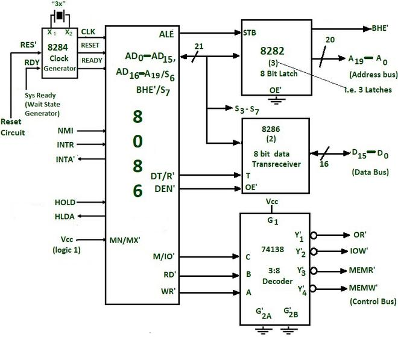

## Assignment 1

## 1) Draw the internal architecture of the 8086 microprocessor and explain the function of BIU and EU.

- **BIU (Bus Interface Unit)**: Handles data transfer between the microprocessor and external devices (memory, I/O) by managing bus requests and controlling data flow.
- **EU (Execution Unit)**: Performs operations on data, including:
  - Arithmetic Logic Unit (ALU): Carries out arithmetic and logical operations.
  - Program Counter (PC): Keeps track of the address of the next instruction to be fetched.
  - Memory Address Register (MAR) and Memory Buffer Register (MBR): Temporary storage for memory addresses and data during operations.

## 2) Explain the memory bank in the 8086 microprocessor and discuss the even address byte transfer, odd address byte transfer,even address word transfer and odd address word transfer scenario.

The 8086 microprocessor has a unique memory architecture that includes the concept of memory banks, which allows for efficient data transfer and access. Understanding how the 8086 handles memory transfers, particularly in terms of even and odd address scenarios, is crucial for grasping its operation.

### Memory Bank Architecture

The 8086 microprocessor can address up to **1 MB of memory** (2^20 bytes) using a 20-bit address bus. The memory is organized into **16-bit words**, and the architecture supports both byte and word transfers. The memory is divided into **two banks**:

1. **Even Bank**: Addresses that are even numbers (0, 2, 4, ...).
2. **Odd Bank**: Addresses that are odd numbers (1, 3, 5, ...).

#### Memory Access Modes

The 8086 can perform different types of memory accesses based on the address being accessed. Here’s how it handles the various scenarios:

### 1. Even Address Byte Transfer

- **Description**: When a byte is accessed at an even address (e.g., 0x0000, 0x0002), it is fetched from the even memory bank.
- **Operation**: The 8086 reads the byte directly from the even bank without any additional overhead.
- **Example**: Accessing memory at address 0x0000 retrieves the byte stored at that location.

### 2. Odd Address Byte Transfer

- **Description**: When a byte is accessed at an odd address (e.g., 0x0001, 0x0003), it is fetched from the odd memory bank.
- **Operation**: The 8086 reads the byte from the odd bank, which may involve additional cycles since it may also need to access the even bank to maintain word alignment.
- **Example**: Accessing memory at address 0x0001 retrieves the byte stored at that location, but it may require a wait cycle if the previous operation was a word transfer.

### 3. Even Address Word Transfer

- **Description**: When a word (2 bytes) is accessed at an even address (e.g., 0x0000, 0x0002), both bytes are fetched from the even memory bank.
- **Operation**: The 8086 can read both bytes in a single memory access cycle since they are aligned in the even bank.
- **Example**: Accessing memory at address 0x0000 retrieves the word consisting of the bytes at addresses 0x0000 and 0x0001.

### 4. Odd Address Word Transfer

- **Description**: When a word is accessed at an odd address (e.g., 0x0001, 0x0003), the 8086 must access both the odd and even banks to retrieve the two bytes.
- **Operation**: The first byte is fetched from the odd bank, and the second byte is fetched from the even bank. This requires two memory accesses, resulting in additional cycles.
- **Example**: Accessing memory at address 0x0001 retrieves the word consisting of the bytes at addresses 0x0001 (odd) and 0x0002 (even).

### Summary of Transfer Scenarios

| Transfer Type              | Address Type | Memory Access      | Description                                |
| -------------------------- | ------------ | ------------------ | ------------------------------------------ |
| Even Address Byte Transfer | Even         | Even Bank          | Direct access to the even bank.            |
| Odd Address Byte Transfer  | Odd          | Odd Bank           | Access may involve wait cycles.            |
| Even Address Word Transfer | Even         | Even Bank          | Both bytes fetched in one cycle.           |
| Odd Address Word Transfer  | Odd          | Odd and Even Banks | Requires two accesses, one from each bank. |

## 3) Draw the interface diagram of the 8086 microprocessor in minimum mode and explain it.

**8086 Interface Diagram (Minimal):**

- **Data Bus (D0-D7):** 8-bit bidirectional, connects to memory and I/O devices.
- **Address Bus (A0-A19):** 20-bit unidirectional, connects to memory and I/O devices.
- **Control Signals:**
  - **M/IO:** Memory (M=1) or I/O (IO=1) selection.
  - **RD:** Read (active low).
  - **WR:** Write (active low).
  - **INTA:** Interrupt acknowledge.
  - **RESET:** Asynchronous reset.
- **Clock (CLK):** Input for synchronizing internal operations.
- **Interrupt Request (IRQ0-IRQ7):** Seven external interrupt request inputs.
- **Bus Control (BC1-BC3):** Used for bus control and priority.
- **Trailing Edge of Clock (TEC):** Input for synchronizing control signals.

## 4) Draw the interface diagram of the 8086 microprocessor in maximum mode and explain it.

**8086 Interface Diagram (Maximal):**

- **Data Bus (D0-D15):** 16-bit bidirectional.
- **Address Bus (A0-A19):** 20-bit unidirectional.
- **Control Signals:**
  - **M/IO, RD, WR, INTA, RESET, TEC**
  - **DEN:** Data enable (active low).
  - **ACK:** Acknowledge (active low).
  - **HOLD, HLDA:** Bus request and acknowledge.
  - **BHE:** High byte enable.
- **Clock (CLK), IRQ0-IRQ7, BC1-BC3**
- **Ready (RDY):** Memory/IO device ready (active low).
- **Bus Request (BUSRQ):** External bus request.

## 5) Explain the following pin functions of 8086 microprocessor.

- M/IO’
- DEN’
- QS0,QS1
- MN/MX’
- LOCK’
- TEST’

The 8086 microprocessor has several pins that serve important functions in its operation. Let's discuss the pin functions you mentioned:

### 1. M/IO' (Memory/Input-Output)

- This pin indicates whether the current bus cycle is a memory access or an I/O access.
- When M/IO' is low, it signifies a memory access cycle.
- When M/IO' is high, it indicates an I/O access cycle.

### 2. DEN' (Data Enable)

- The DEN' pin is used to enable the data bus transceivers during a bus cycle.
- It is active low, meaning it is enabled when the pin is at a low logic level.
- DEN' is used to control the direction of data flow during read and write operations.

### 3. QS0, QS1 (Queue Status)

- These pins provide information about the status of the instruction queue in the Bus Interface Unit (BIU).
- QS0 and QS1 together form a 2-bit status code that indicates the current state of the queue.
- The status codes are used for debugging and synchronization purposes.

### 4. MN/MX' (Minimum/Maximum Mode)

- This pin selects the operating mode of the 8086 microprocessor.
- When MN/MX' is high, it selects the minimum mode, which is suitable for single-processor systems.
- When MN/MX' is low, it selects the maximum mode, which is used in multiprocessor systems.

### 5. LOCK' (Lock)

- The LOCK' pin is used to ensure atomic operations during bus cycles.
- When LOCK' is active low, it prevents other bus masters from gaining control of the bus until the current bus cycle is completed.
- This is useful for implementing critical sections in multitasking or multiprocessor environments.

### 6. TEST' (Test)

- The TEST' pin is used for synchronizing external events with the execution of certain instructions.
- It is typically used for implementing software-controlled wait states or for connecting external hardware for debugging purposes.
- The 8086 executes a WAIT instruction only when the TEST' pin is low.

These pin functions play a crucial role in the operation and interfacing of the 8086 microprocessor with external devices, memory, and other system components. Understanding their purpose is essential for designing and programming systems based on the 8086 architecture.

## 6) Draw the following timing diagrams

- Memory Write cycle minimum mode
- I/O read cycle minimum mode
- Memory Read Cycle maximum mode
- I/O Write cycle maximum mode
