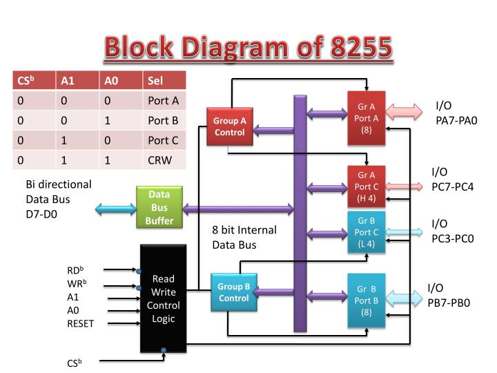
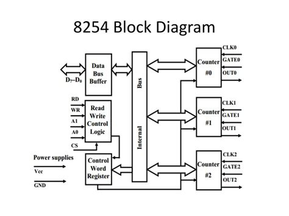

# Assignment 2

## 1) Define following terms

- Interrupt
- Interrupt Vector Table
- Interrupt Priority
- Interrupt service routine / Interrupt handler
- Polling

### Interrupt

An **interrupt** is a signal to the processor emitted by hardware or software indicating an event that needs immediate attention. It temporarily halts the current execution of a program, allowing the processor to execute a special routine, known as an interrupt service routine (ISR), to address the event.

### Interrupt Vector Table

The **Interrupt Vector Table (IVT)** is a data structure used by the processor to determine the address of the interrupt service routine associated with each interrupt. Each entry in the table corresponds to a specific interrupt and contains the address of the ISR that should be executed when that interrupt occurs.

### Interrupt Priority

**Interrupt priority** refers to the hierarchy assigned to different interrupts. In systems where multiple interrupts can occur simultaneously, the priority determines which interrupt will be serviced first. Higher-priority interrupts can preempt lower-priority ones, ensuring that critical tasks are addressed promptly.

### Interrupt Service Routine / Interrupt Handler

An **Interrupt Service Routine (ISR)**, also known as an **interrupt handler**, is a special block of code executed in response to an interrupt. The ISR processes the interrupt, performs necessary tasks (like handling input/output operations), and then returns control to the interrupted program.

### Polling

**Polling** is a technique used to check the status of an input/output device at regular intervals. Unlike interrupts, where the device signals the processor, polling involves the processor actively querying devices to determine if they require attention. This method can be less efficient than interrupts, as it may waste processing time checking devices that do not need servicing.

## 2) Explain the procedure followed by an 8086 microprocessor whenever any interrupt arrives.

When an interrupt occurs in the 8086 microprocessor, a specific sequence of steps is followed to handle the interrupt efficiently. Here’s a detailed explanation of the procedure:

### Procedure Followed by the 8086 Microprocessor for Interrupt Handling

#### 1. **Interrupt Signal Detection**

- The 8086 continuously checks for interrupt signals during its instruction execution cycle. If an interrupt signal is detected, the current instruction execution is paused.

#### 2. **Saving the Current State**

- The microprocessor saves the current state of the program, including:
  - The **Instruction Pointer (IP)**: This indicates the address of the next instruction to execute.
  - The **Flags Register**: This contains the status of the processor.
- This information is pushed onto the **stack** to ensure that the program can resume correctly after the interrupt is serviced.

#### 3. **Determining the Interrupt Type**

- The 8086 uses the **Interrupt Vector Table (IVT)** to determine the type of interrupt. The IVT is a fixed table located at the beginning of memory, containing addresses of the ISRs for different interrupts.
- The processor uses the interrupt number (usually provided by the hardware) to index into the IVT and retrieve the address of the corresponding ISR.

#### 4. **Jumping to the Interrupt Service Routine (ISR)**

- The 8086 then loads the **Instruction Pointer (IP)** with the address of the ISR obtained from the IVT. This effectively transfers control to the ISR.

#### 5. **Executing the ISR**

- The ISR executes, performing the necessary operations to handle the interrupt. This could involve reading input, processing data, or sending output.

#### 6. **Restoring the Previous State**

- Once the ISR completes its execution, the microprocessor restores the previous state by popping the saved IP and Flags Register from the stack. This ensures that the program can continue from where it left off.

#### 7. **Resuming Normal Execution**

- The control is returned to the main program, and execution resumes from the point where it was interrupted.

#### 8. **Handling Nested Interrupts (if applicable)**

- If the system allows for nested interrupts (higher-priority interrupts can occur while servicing a lower-priority one), the same procedure can be followed recursively, with each interrupt being handled in turn.

## 3) Draw interface diagram and find address range of following memory chips interfaced with 8086 microprocessor.Two chips of 64KB ROM and two chips of 64KB RAM.

## 4) Draw block diagram of 8255 and explain it.

Here's a detailed explanation of the **8255 Programmable Peripheral Interface (PPI)** along with a block diagram.

### Block Diagram of 8255

### Explanation of Key Components

#### 1. **Control Logic**

- The control logic manages the operation of the 8255. It interprets control signals from the CPU to configure the ports and manage data flow.

#### 2. **Ports**

- **Port A**: An 8-bit bidirectional data port that can be used for input or output operations.
- **Port B**: Similar to Port A, it is also an 8-bit bidirectional data port.
- **Port C**: An 8-bit port used primarily for control signals. It can be divided into two 4-bit ports (C1 and C2) for more granular control.

#### 3. **Data Bus**

- The 8255 connects to the data bus (D0-D7) of the microprocessor, allowing it to send and receive data.

#### 4. **Address Bus**

- The address bus (A0-A1) is used to select the specific port or control register within the 8255. The 8255 uses two address lines, allowing for four different addresses (for Port A, Port B, Port C, and Control Register).

#### 5. **Read/Write Control Signals**

- These signals dictate whether the 8255 is in read or write mode. The microprocessor sends control signals to read data from the ports or write data to them.

### Functionality of 8255

The 8255 PPI is designed to interface with the microprocessor and manage input/output operations with peripheral devices. It operates in three modes:

#### 1. **Mode 0 (Basic Input/Output Mode)**

- Ports A, B, and C function as simple input or output ports. Data can be read from or written to the ports without any additional control signals.

#### 2. **Mode 1 (Strobed Input/Output Mode)**

- This mode allows for handshaking signals to be used, enabling more complex communication with peripherals. It uses the control signals to manage data transfer.

#### 3. **Mode 2 (Bidirectional Bus Mode)**

- This mode is used for bidirectional data transfer on Port A. It allows data to be sent and received simultaneously, making it suitable for applications requiring two-way communication.

### Applications of 8255

- **Microcontroller Interfacing**: It is commonly used in microcontroller systems to interface with various peripherals.
- **Data Acquisition Systems**: The 8255 can be used to collect data from sensors and send it to the microprocessor.
- **Control Systems**: It can control motors, lights, and other devices in automation systems.

The 8255 PPI is a versatile interface that simplifies communication between the CPU and peripheral devices, making it an essential component in many microprocessor-based systems. If you have further questions or need more details about specific aspects, feel free to ask!

## 5) Draw block diagram of 8254 and explain it.

Here’s a detailed explanation of the **8254 Programmable Interval Timer (PIT)** along with a block diagram.

### Block Diagram of 8254

### Explanation of Key Components

#### 1. **Control Logic**

- The control logic manages the operation of the 8254. It interprets control signals from the CPU to configure the timer channels, set modes of operation, and manage data flow.

#### 2. **Channels**

- The 8254 has **three independent channels** (Channel 0, Channel 1, and Channel 2), each functioning as a 16-bit counter. These channels can be programmed to operate in various modes, allowing for different timing and counting functions.
- Each channel can generate interrupts based on the counting operation, making it suitable for timing applications.

#### 3. **Data Bus**

- The 8254 connects to the data bus (D0-D7) of the microprocessor, allowing it to send and receive data.

#### 4. **Address Bus**

- The address bus (A0-A1) is used to select the specific channel or control register within the 8254. The 8254 uses two address lines, allowing for four different addresses (for Channel 0, Channel 1, Channel 2, and Control Register).

#### 5. **Read/Write Control Signals**

- These signals dictate whether the 8254 is in read or write mode. The microprocessor sends control signals to read data from the channels or write data to them.

### Functionality of 8254

The 8254 is designed to provide timing and counting functions in microprocessor systems. It operates in various modes:

#### 1. **Mode 0 (Interrupt on Terminal Count)**

- The counter counts down to zero and generates an interrupt when it reaches zero. This mode is commonly used for generating time delays.

#### 2. **Mode 1 (Programmable One-Shot)**

- In this mode, the timer generates a single pulse of a specified width when triggered. This is useful for generating precise timing signals.

#### 3. **Mode 2 (Rate Generator)**

- The counter is continuously reloaded with a specified value, allowing it to generate a series of pulses at a defined rate.

#### 4. **Mode 3 (Square Wave Generator)**

- This mode generates a square wave output. The frequency of the square wave is determined by the initial count value.

#### 5. **Mode 4 (Software Triggered Strobe)**

- The counter generates a strobe pulse when triggered by software. This mode is useful for synchronizing operations.

#### 6. **Mode 5 (Hardware Triggered Strobe)**

- Similar to Mode 4, but the trigger is hardware-based, allowing for more complex timing operations.

### Applications of 8254

- **Timing Operations**: Used in applications requiring precise timing intervals.
- **Event Counting**: Can count events in various applications, such as measuring time between events.
- **Frequency Generation**: Used to generate specific frequencies for clock signals in digital circuits.

The 8254 Programmable Interval Timer is a versatile device that simplifies timing and counting operations in microprocessor-based systems. If you have further questions or need more details about specific aspects, feel free to ask!
