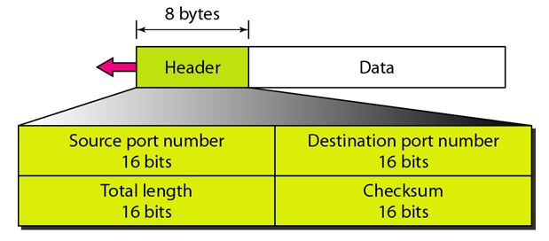

# Unit 4

## <mark> 1) Define the socket. List the types of sockets. </mark>

### Definition of a Socket

A **socket** is an endpoint for sending and receiving data across a computer network. It provides a mechanism for communication between two processes, which can be on the same machine or on different machines connected via a network. Sockets are used in various network protocols, most commonly in TCP/IP based communication.

### Key Components of a Socket

1. **IP Address**: Identifies the host on the network.
2. **Port Number**: Identifies the specific application or service on the host that is using the socket.
3. **Protocol**: Specifies the communication protocol being used (e.g., TCP or UDP).

A socket is typically defined by a combination of an IP address, a port number, and a protocol. For example, a TCP socket might be defined as `192.168.1.2:80`, where `192.168.1.2` is the IP address, `80` is the port number, and TCP is the protocol.

### Types of Sockets

1. **Stream Sockets (TCP Sockets)**:

   - **Description**: These sockets provide a reliable, connection-oriented communication channel. They use the Transmission Control Protocol (TCP) for data transmission.
   - **Characteristics**:
     - Ensure that data is delivered in order and without errors.
     - Suitable for applications requiring a reliable connection, such as web browsers and email clients.

2. **Datagram Sockets (UDP Sockets)**:

   - **Description**: These sockets provide a connectionless communication channel using the User Datagram Protocol (UDP).
   - **Characteristics**:
     - Do not guarantee the order of delivery or error correction.
     - Suitable for applications where speed is more critical than reliability, such as video streaming, online gaming, and VoIP.

3. **Raw Sockets**:

   - **Description**: These sockets allow direct access to lower-layer protocols, enabling developers to manipulate the header fields of the packet.
   - **Characteristics**:
     - Typically used for network diagnostics and custom protocol implementations.
     - Require administrative privileges to create and use.

4. **Unix Domain Sockets**:
   - **Description**: These sockets allow communication between processes on the same host using a file system path as the address.
   - **Characteristics**:
     - Provide a faster communication mechanism compared to network sockets since they do not involve network protocol overhead.
     - Commonly used in inter-process communication (IPC) on UNIX-like operating systems.

### Summary

Sockets play a crucial role in enabling network communication between processes. By understanding the different types of sockets—stream sockets (TCP), datagram sockets (UDP), raw sockets, and Unix domain sockets—developers can choose the appropriate socket type for their networking needs.

## <mark> 2) List the duties of the transport layer and explain each in brief. </mark>

### Duties of the Transport Layer

The transport layer is a crucial component of the OSI (Open Systems Interconnection) model and the TCP/IP model. It is responsible for providing end-to-end communication services for applications. Here are the key duties of the transport layer, along with brief explanations of each:

1. **Segmentation and Reassembly**:

   - **Explanation**: The transport layer divides large messages into smaller segments for transmission across the network. At the destination, it reassembles these segments into the original message. This process ensures that large data units can be transmitted efficiently without overloading the network.

2. **Connection Control**:

   - **Explanation**: The transport layer can establish, maintain, and terminate connections between devices. This can be either connection-oriented (e.g., TCP) or connectionless (e.g., UDP). In connection-oriented communication, a reliable connection is established before data transmission, while in connectionless communication, data is sent without establishing a connection.

3. **Flow Control**:

   - **Explanation**: Flow control mechanisms regulate the rate of data transmission between sender and receiver to prevent overwhelming the receiving device. This is crucial for maintaining data integrity and ensuring that the sender does not send data faster than the receiver can process it.

4. **Error Detection and Recovery**:

   - **Explanation**: The transport layer implements error detection techniques (such as checksums) to identify corrupted data during transmission. If errors are detected, the transport layer can request retransmission of lost or corrupted segments, ensuring reliable data delivery.

5. **Multiplexing and Demultiplexing**:

   - **Explanation**: The transport layer allows multiple applications to communicate concurrently over the same network connection. It uses port numbers to distinguish between different application data streams (multiplexing) and ensures that data is delivered to the correct application at the destination (demultiplexing).

6. **Quality of Service (QoS)**:

   - **Explanation**: Some transport layer protocols provide mechanisms for ensuring a certain level of performance, such as bandwidth, latency, and reliability. QoS is important for applications that require guaranteed performance, such as video streaming and online gaming.

7. **End-to-End Communication**:
   - **Explanation**: The transport layer facilitates end-to-end communication between applications running on hosts across a network. It ensures that data sent from one application is received correctly by the intended application on another host.

### Conclusion

The transport layer plays a vital role in ensuring reliable, efficient, and orderly data transmission across networks. Its functions, including segmentation, connection control, flow control, error detection, multiplexing, QoS, and end-to-end communication, are essential for the smooth operation of networked applications.

## <mark> 3) Compare UDP & TCP. </mark>

### Comparison of UDP and TCP

User Datagram Protocol (UDP) and Transmission Control Protocol (TCP) are two fundamental transport layer protocols used in networking. They serve different purposes and have distinct characteristics. Below is a comparison of UDP and TCP based on several key factors:

| Feature                 | UDP (User Datagram Protocol)                                                                                                           | TCP (Transmission Control Protocol)                                                                         |
| ----------------------- | -------------------------------------------------------------------------------------------------------------------------------------- | ----------------------------------------------------------------------------------------------------------- |
| **Connection Type**     | Connectionless                                                                                                                         | Connection-oriented                                                                                         |
| **Reliability**         | Unreliable (no guarantee of delivery)                                                                                                  | Reliable (ensures delivery of packets)                                                                      |
| **Transmission Method** | Datagram-based (sends messages individually)                                                                                           | Stream-based (sends a continuous stream of data)                                                            |
| **Ordering**            | No guarantee of order                                                                                                                  | Guarantees order (segments are reassembled in the correct order)                                            |
| **Flow Control**        | No flow control                                                                                                                        | Implements flow control mechanisms                                                                          |
| **Error Handling**      | No error recovery mechanisms                                                                                                           | Includes error detection and recovery via checksums                                                         |
| **Header Size**         | 8 bytes                                                                                                                                | 20-60 bytes (variable, depending on options)                                                                |
| **Speed**               | Faster (less overhead due to simplicity)                                                                                               | Slower (more overhead due to connection management)                                                         |
| **Use Cases**           | Suitable for applications like video streaming, online gaming, and VoIP where speed is critical and occasional data loss is acceptable | Used for applications like web browsing, file transfer, and email where reliability and order are essential |
| **Port Usage**          | Can use multiple ports for different applications                                                                                      | Uses specific ports for well-known services (e.g., HTTP on port 80)                                         |

### Key Differences Explained

1. **Connection Type**:

   - **UDP**: Does not establish a connection before sending data, which makes it faster but less reliable.
   - **TCP**: Establishes a connection (using a three-way handshake) before data transmission begins, ensuring that both sender and receiver are ready.

2. **Reliability**:

   - **UDP**: Does not guarantee delivery; packets may be lost, duplicated, or arrive out of order. It is suitable for applications where speed is more critical than reliability.
   - **TCP**: Guarantees reliable delivery through acknowledgments and retransmissions of lost packets.

3. **Transmission Method**:

   - **UDP**: Sends independent packets (datagrams) without establishing a connection. Each packet is treated separately.
   - **TCP**: Sends a continuous stream of data, allowing for better management of large data transfers.

4. **Ordering**:

   - **UDP**: Does not guarantee the order of packet delivery, so application-level logic must handle any necessary ordering.
   - **TCP**: Ensures that packets are received in the order they were sent, reordering them if necessary.

5. **Flow Control**:

   - **UDP**: No flow control mechanisms; it is up to the application to manage data flow.
   - **TCP**: Implements flow control using a sliding window protocol to prevent overwhelming the receiver.

6. **Error Handling**:

   - **UDP**: Basic error checking is done using checksums, but there is no recovery mechanism for lost packets.
   - **TCP**: Uses checksums for error detection and has mechanisms for retransmitting lost or corrupted packets.

7. **Speed**:

   - **UDP**: Generally faster due to its lightweight protocol and lack of connection overhead.
   - **TCP**: Slower due to connection establishment, flow control, and error recovery processes.

8. **Use Cases**:
   - **UDP**: Commonly used in applications like real-time video streaming, online gaming, and VoIP, where low latency is critical, and some data loss is acceptable.
   - **TCP**: Used in applications requiring reliable communication, such as web browsing (HTTP), file transfers (FTP), and email (SMTP).

### Conclusion

In summary, the choice between UDP and TCP depends on the specific requirements of the application. If speed and low latency are critical and some data loss is acceptable, UDP is the better choice. Conversely, if reliable data delivery and ordered transmission are essential, TCP is the preferred protocol. Understanding these differences helps developers and network engineers design effective communication systems based on application needs.

## <mark> 4) What is meant by congestion? </mark>

### What is Meant by Congestion?

**Congestion** in networking refers to a situation where the demand for network resources exceeds the available capacity, leading to performance degradation. This can occur in various scenarios, such as during peak usage times when many users are trying to access the network simultaneously or when there are bottlenecks in the network infrastructure.

### Causes of Congestion:

1. **High Traffic Volume**: When too many packets are sent into the network, it can overwhelm routers and switches, causing delays and packet loss.

2. **Limited Bandwidth**: If the network has limited bandwidth, it cannot handle the increased data load, leading to congestion.

3. **Network Topology**: Poorly designed network topologies can create bottlenecks, where data paths converge, causing delays and congestion.

4. **Faulty Equipment**: Malfunctioning routers, switches, or links can lead to packet loss and increased retransmissions, exacerbating congestion.

5. **Application Behavior**: Some applications may generate bursts of data traffic or require constant connections, which can lead to congestion if many users are active simultaneously.

### Effects of Congestion:

- **Increased Latency**: As devices wait longer to send or receive data, overall response times increase.
- **Packet Loss**: Excessive congestion can cause routers to drop packets, leading to retransmissions and further delays.
- **Decreased Throughput**: The overall amount of successful data transmission decreases as congestion increases.
- **Quality of Service (QoS) Degradation**: Applications that require real-time data transfer (like VoIP and video conferencing) may suffer significantly due to congestion.

### Congestion Control Mechanisms:

To mitigate congestion, various techniques can be employed, including:

1. **Traffic Shaping**: Regulating the flow of traffic to ensure that the network does not become overwhelmed.
2. **Congestion Avoidance Algorithms**: Implementing algorithms that detect early signs of congestion and adjust data transmission rates accordingly.
3. **Queue Management**: Using various queuing techniques (like FIFO, priority queuing) to manage data packets in routers and switches effectively.
4. **Load Balancing**: Distributing data traffic across multiple paths or links to prevent any single point from becoming a bottleneck.

### Conclusion

Congestion is a critical issue in network management that can significantly impact performance and user experience. Understanding its causes, effects, and potential solutions is essential for network administrators to maintain efficient and reliable network operations.

## <mark> 5) What is function of transport layer? </mark>

### Functions of the Transport Layer

The transport layer is a crucial component of the OSI (Open Systems Interconnection) model and the TCP/IP model. It provides various services to facilitate communication between applications running on hosts across a network. Here are the primary functions of the transport layer:

1. **Segmentation and Reassembly**:

   - The transport layer divides large data streams from applications into smaller segments for transmission over the network. Upon reaching the destination, these segments are reassembled into the original message. This function allows for efficient data transmission without overwhelming the network.

2. **Connection Control**:

   - The transport layer can operate in two modes: connection-oriented and connectionless. In connection-oriented communication (like TCP), a connection is established before data transmission. In connectionless communication (like UDP), data is sent without establishing a connection.

3. **Flow Control**:

   - Flow control mechanisms prevent the sender from overwhelming the receiver with too much data at once. This is crucial for maintaining efficient data transmission and ensuring that the receiving application can process incoming data without loss or delay.

4. **Error Detection and Recovery**:

   - The transport layer implements error detection techniques (such as checksums) to identify corrupted segments during transmission. If errors are detected, the transport layer can request retransmission of lost or corrupted segments to ensure reliable data delivery.

5. **Multiplexing and Demultiplexing**:

   - The transport layer allows multiple applications to communicate simultaneously over the same network connection. It uses port numbers to identify different application data streams (multiplexing) and directs incoming segments to the correct application based on these port numbers (demultiplexing).

6. **Quality of Service (QoS)**:

   - Some transport layer protocols provide quality of service mechanisms to ensure that critical applications receive the necessary bandwidth and low latency. QoS is particularly important for applications like video conferencing and online gaming, where performance is crucial.

7. **End-to-End Communication**:
   - The transport layer facilitates end-to-end communication between applications on different hosts. It ensures that data sent from one application reaches the intended application on another host accurately and reliably.

### Conclusion

The transport layer plays a vital role in ensuring reliable, efficient, and orderly data transmission across networks. Its functions, including segmentation, connection control, flow control, error detection, multiplexing, QoS, and end-to-end communication, are essential for the smooth operation of networked applications.

## <mark> 6) Give the structure of UDP header. </mark>

### UDP Header Structure

The User Datagram Protocol (UDP) header is a simple structure that consists of four fields, each with a fixed size. The total size of the UDP header is 8 bytes. Here is the detailed structure of the UDP header:

| Field                | Size (Bytes) | Description                                                                                                                       |
| -------------------- | ------------ | --------------------------------------------------------------------------------------------------------------------------------- |
| **Source Port**      | 2            | The port number of the application sending the data.                                                                              |
| **Destination Port** | 2            | The port number of the application receiving the data.                                                                            |
| **Length**           | 2            | The length of the UDP header and the encapsulated data, in bytes. This includes the 8 bytes of the header.                        |
| **Checksum**         | 2            | A checksum used for error-checking the header and data. This field is optional in some implementations but is highly recommended. |

### Breakdown of Each Field:

1. **Source Port (2 bytes)**:

   - This field indicates the port number used by the source application. It helps the receiving application determine where the data came from.

2. **Destination Port (2 bytes)**:

   - This field indicates the port number where the data is to be sent. It directs the data to the appropriate application on the receiving host.

3. **Length (2 bytes)**:

   - This field specifies the total length of the UDP header and the data payload. Since the minimum length of a UDP packet is 8 bytes (header only), the length can range from 8 to 65,535 bytes (the maximum size of an IP packet).

4. **Checksum (2 bytes)**:
   - The checksum is used to verify the integrity of the header and data. It is calculated by the sender and can be checked by the receiver to detect errors during transmission. If no errors are found, the checksum indicates successful reception of the data.

### Summary of UDP Header Structure

- The UDP header is straightforward and efficient, allowing for quick data transmission without the overhead of connection establishment and management (as seen in TCP). This makes UDP suitable for applications that prioritize speed over reliability, such as streaming media, online gaming, and voice over IP (VoIP).

### Conclusion

Understanding the structure of the UDP header is essential for developers and network engineers working with network protocols. The simplicity of the UDP header allows for efficient data transmission, making UDP a valuable protocol for specific applications.

## <mark> 7) Explain TCP header and the working of the TCP protocol. </mark>

### TCP Header Structure

The Transmission Control Protocol (TCP) header is a critical component of TCP communication, which is a connection-oriented protocol used for reliable data transmission. The TCP header consists of various fields that control the flow of data and ensure accurate delivery. The header is a minimum of 20 bytes long, but it can be larger if options are included. Here is the structure of the TCP header:

| Field                     | Size (Bytes) | Description                                                                                        |
| ------------------------- | ------------ | -------------------------------------------------------------------------------------------------- |
| **Source Port**           | 2            | The port number of the sending application.                                                        |
| **Destination Port**      | 2            | The port number of the receiving application.                                                      |
| **Sequence Number**       | 4            | The sequence number of the first byte of data in this segment (used for ordering).                 |
| **Acknowledgment Number** | 4            | The sequence number of the next byte that the sender expects to receive (used for acknowledgment). |
| **Data Offset**           | 4            | The size of the TCP header in 32-bit words (indicates where the data begins).                      |
| **Reserved**              | 3            | Reserved for future use; should be set to zero.                                                    |
| **Flags**                 | 9            | Control flags (e.g., SYN, ACK, FIN, RST, PSH, URG) that indicate the state of the connection.      |
| **Window Size**           | 2            | The size of the sender's receive window (used for flow control).                                   |
| **Checksum**              | 2            | Used for error-checking the header and data.                                                       |
| **Urgent Pointer**        | 2            | Indicates the end of urgent data (if the URG flag is set).                                         |
| **Options**               | Variable     | Optional field that can be used for various TCP features (e.g., maximum segment size).             |
| **Data**                  | Variable     | The actual data being transmitted.                                                                 |

### Working of the TCP Protocol

TCP operates using a set of processes to ensure reliable and ordered delivery of data. Here are the key functionalities and processes involved in TCP operation:

1. **Connection Establishment**:

   - TCP uses a three-way handshake to establish a connection between a client and a server.
   - The process involves:
     1. **SYN**: The client sends a SYN (synchronize) packet to the server to initiate a connection.
     2. **SYN-ACK**: The server responds with a SYN-ACK (synchronize-acknowledge) packet to acknowledge receipt of the SYN.
     3. **ACK**: The client sends an ACK (acknowledge) packet back to the server, completing the handshake.

2. **Data Transmission**:

   - After the connection is established, data can be transmitted in segments. Each segment includes sequence numbers and acknowledgment numbers to track the data.
   - TCP ensures that segments are delivered in order and retransmits any lost segments based on acknowledgment numbers.
   - The sender and receiver manage flow control using the window size, which indicates how much data can be sent before waiting for an acknowledgment.

3. **Error Detection**:

   - TCP uses checksums to detect errors in the header and data. If an error is detected, the segment is discarded, and the sender is prompted to retransmit it.

4. **Connection Termination**:
   - When the communication is complete, TCP terminates the connection using a four-way handshake:
     1. One side sends a FIN (finish) packet to indicate it is done sending data.
     2. The other side acknowledges with an ACK and then sends its own FIN packet.
     3. The first side acknowledges the FIN, completing the termination process.

### Summary

TCP is a robust protocol that provides reliable, ordered, and error-checked delivery of data between applications. Its header structure and mechanisms for connection establishment, data transmission, error detection, and connection termination are essential for ensuring high-quality communication over networks.

## <mark> 8) Explain world wide web. </mark>

### The World Wide Web (WWW)

**Definition**:
The World Wide Web (WWW), commonly referred to as the Web, is a system of interlinked hypertext documents and multimedia content that is accessed via the Internet. It allows users to view and interact with a vast array of information through web browsers.

### Key Components of the World Wide Web:

1. **Web Pages**:

   - Web pages are the fundamental building blocks of the Web. They contain text, images, videos, and other multimedia elements. Web pages are written in Hypertext Markup Language (HTML) and can be linked to other pages, creating a network of information.

2. **Web Browsers**:

   - Web browsers are software applications that enable users to access and navigate the Web. Popular browsers include Google Chrome, Mozilla Firefox, Safari, and Microsoft Edge. Browsers interpret HTML, CSS, and JavaScript to display web content.

3. **Hyperlinks**:

   - Hyperlinks are clickable links that connect one web page to another. They allow users to navigate between different pages and sites effortlessly, creating a non-linear browsing experience.

4. **URLs (Uniform Resource Locators)**:

   - A URL is the address used to access a specific resource on the Web. It specifies the location of a web page and the protocol used to retrieve it (e.g., HTTP or HTTPS).

5. **Web Servers**:

   - Web servers are computers that host websites and serve web content to users. When a browser requests a web page, the server processes the request and sends the appropriate HTML document back to the browser.

6. **Protocols**:
   - The Web operates using various protocols, with the most important being Hypertext Transfer Protocol (HTTP) and its secure version, HTTPS. These protocols define how data is transmitted over the Internet.

### How the World Wide Web Works:

1. **Request and Response**:

   - When a user enters a URL in a web browser, the browser sends an HTTP request to the web server hosting that URL.
   - The server processes the request and sends back an HTTP response, which includes the requested web page and associated resources.

2. **Rendering**:

   - The web browser receives the HTML content and renders it for display. It interprets the HTML code along with CSS for styling and JavaScript for interactivity, presenting the information to the user as a visual web page.

3. **Navigation**:
   - Users can navigate the Web by clicking on hyperlinks, which may lead to other web pages or websites. This interconnected structure creates an expansive network of information.

### Conclusion

The World Wide Web has transformed the way we access information, communicate, and conduct business. It serves as a platform for sharing knowledge and connecting people worldwide. Understanding its components and functionality is essential for anyone looking to navigate or develop for the Web.

## <mark> 9) Explain HyperText Transfer Protocol. </mark>

### Hypertext Transfer Protocol (HTTP)

**Definition**:
The Hypertext Transfer Protocol (HTTP) is an application-layer protocol used for transmitting hypertext via the World Wide Web. It facilitates communication between web clients (typically browsers) and web servers, allowing users to access web pages and other resources.

### Key Features of HTTP:

1. **Request-Response Model**:

   - HTTP operates on a request-response model, where a client sends an HTTP request to a server, and the server responds with the requested resource or an error message.

2. **Stateless Protocol**:

   - Each HTTP request is independent; the server does not retain any information about previous requests. This statelessness simplifies server design but can necessitate additional mechanisms (like cookies or sessions) for tracking user sessions.

3. **Methods**:

   - HTTP defines various methods (also known as verbs) to indicate the desired action on a resource. Common methods include:
     - **GET**: Retrieves data from the server without modifying it.
     - **POST**: Sends data to the server, often to create or update a resource.
     - **PUT**: Updates a resource or creates it if it does not exist.
     - **DELETE**: Removes a resource from the server.
     - **HEAD**: Similar to GET, but retrieves only the headers, not the body of the response.

4. **Status Codes**:

   - HTTP responses include status codes that indicate the result of the request. Common status codes include:
     - **200 OK**: The request was successful.
     - **404 Not Found**: The requested resource could not be found.
     - **500 Internal Server Error**: The server encountered an error while processing the request.

5. **Headers**:

   - Both requests and responses can include headers that provide additional information about the message. Common headers include:
     - **Content-Type**: Specifies the media type of the resource (e.g., text/html, application/json).
     - **User-Agent**: Identifies the client software making the request.
     - **Authorization**: Contains credentials for authenticating the client.

6. **HTTPS**:
   - HTTP can be secured using Transport Layer Security (TLS) to create HTTPS (HTTP Secure). This encrypts the data exchanged between the client and server, enhancing security and privacy.

### How HTTP Works:

1. **Client Request**:

   - When a user enters a URL in a web browser, the browser generates an HTTP request for the corresponding resource.

2. **Server Response**:

   - The web server processes the request and sends back an HTTP response containing the requested resource (such as an HTML page) or an error message.

3. **Rendering**:
   - The browser receives the response, processes the content, and renders the web page for the user to view.

### Conclusion

HTTP is the foundation of data communication on the World Wide Web, enabling users to access and interact with online content. Understanding HTTP is essential for web developers, network engineers, and anyone involved in the creation and maintenance of web applications.

## <mark> 10) Explain the SMTP. </mark>

### Simple Mail Transfer Protocol (SMTP)

**Definition**:
The Simple Mail Transfer Protocol (SMTP) is a protocol used for sending and receiving email messages over the Internet. It is a text-based protocol that operates on the application layer of the Internet Protocol Suite. SMTP is designed primarily for sending messages from a client to a server and between servers.

### Key Features of SMTP:

1. **Client-Server Model**:

   - SMTP operates using a client-server model. The email client (the sender) connects to the SMTP server to send emails, while the server processes and forwards them to the recipient's mail server.

2. **Text-Based Protocol**:

   - SMTP commands and responses are in plain text, making it easy for administrators to understand and debug issues. Common commands include `HELO`, `MAIL FROM`, `RCPT TO`, and `DATA`.

3. **Port Numbers**:

   - SMTP typically uses port 25 for sending emails between servers. Secure SMTP (SMTPS) operates over port 465 or 587, often using TLS/SSL encryption for secure transmissions.

4. **Message Format**:

   - SMTP messages include headers and a body. Headers contain metadata about the email, such as the sender, recipient, subject, and date. The body contains the actual content of the email.

5. **Relay Functionality**:
   - SMTP servers can relay messages to other servers, enabling emails to be sent across different domains. This is essential for delivering emails to recipients who are not on the same server.

### How SMTP Works:

1. **Establishing a Connection**:

   - The client establishes a TCP connection with the SMTP server, typically using port 25.

2. **Sending Commands**:

   - The client sends a series of commands to the server:
     - **HELO/EHLO**: Introduces the sender to the server.
     - **MAIL FROM**: Specifies the sender's email address.
     - **RCPT TO**: Specifies the recipient's email address.
     - **DATA**: Indicates that the client will send the email content.

3. **Sending Email Content**:

   - After the `DATA` command, the client sends the email headers followed by the body of the message. The message is terminated by a single line containing only a period (`.`).

4. **Server Processing**:

   - The SMTP server processes the email, checks for errors, and then either delivers the message to the recipient's mail server or relays it to another SMTP server if necessary.

5. **Closing the Connection**:
   - Once the message is sent, the client sends a `QUIT` command to end the session.

### Conclusion

SMTP is a fundamental protocol for email communication on the Internet. Its simple design and effectiveness in transmitting messages make it a critical component of modern email systems. Understanding how SMTP works is essential for anyone involved in email management or network administration.

## <mark> 11) Write a note on DNS. </mark>

### Domain Name System (DNS)

**Definition**:
The Domain Name System (DNS) is a hierarchical and decentralized naming system used to translate user-friendly domain names (like www.example.com) into numerical IP addresses (like 192.0.2.1) that computers use to identify each other on the network. DNS is a fundamental component of the Internet, enabling users to access websites and services without needing to remember complex numerical addresses.

### Key Features of DNS:

1. **Domain Name Hierarchy**:

   - DNS operates in a hierarchical structure, with the root domain at the top, followed by top-level domains (TLDs) like .com, .org, and .net, and further down to second-level domains (e.g., example.com) and subdomains (e.g., www.example.com).

2. **DNS Records**:

   - DNS databases contain various types of records that provide information about domain names. Common DNS record types include:
     - **A Record**: Maps a domain name to its corresponding IPv4 address.
     - **AAAA Record**: Maps a domain name to its corresponding IPv6 address.
     - **CNAME Record**: Aliases one domain name to another.
     - **MX Record**: Specifies the mail exchange server for the domain.
     - **NS Record**: Indicates the authoritative name servers for the domain.

3. **Resolution Process**:

   - When a user enters a domain name in a web browser, the DNS resolution process begins:
     1. The browser checks its cache for the IP address corresponding to the domain.
     2. If not found, it sends a query to a DNS resolver (usually provided by the user's Internet Service Provider).
     3. The resolver may query other DNS servers, starting from the root servers, then TLD servers, and finally the authoritative name server for the domain.
     4. Once the IP address is found, it is returned to the browser, which can then establish a connection to the web server.

4. **Caching**:

   - To improve performance and reduce latency, DNS responses are cached by resolvers and clients. Cached entries have a Time-to-Live (TTL) value that determines how long they remain valid before requiring a new query.

5. **Redundancy and Reliability**:
   - DNS is designed to be redundant and resilient. Multiple DNS servers can provide the same information, ensuring that if one server fails, others can still respond to queries.

### Security Considerations:

- **DNS Spoofing**: Attackers may attempt to corrupt DNS records to redirect users to malicious sites. Techniques like DNSSEC (Domain Name System Security Extensions) are used to enhance security by providing authentication for DNS data.
- **DDoS Attacks**: DNS servers can be targets for Distributed Denial of Service (DDoS) attacks, overwhelming them with traffic and disrupting the resolution process.

### Conclusion

The Domain Name System (DNS) is an essential part of the Internet infrastructure, providing a crucial service that enables users to access websites and services using human-readable domain names. Its hierarchical structure, caching mechanisms, and redundancy contribute to its efficiency and reliability. Understanding DNS is vital for network administrators, web developers, and anyone involved in managing Internet resources.

## <mark> 12) Explain about HTTP. </mark>

### Hypertext Transfer Protocol (HTTP)

**Definition**:
The Hypertext Transfer Protocol (HTTP) is an application-layer protocol used for transmitting hypertext content, such as web pages, over the Internet. It is the foundation of data communication on the World Wide Web, allowing web clients (like browsers) and web servers to communicate effectively.

### Key Features of HTTP:

1. **Request-Response Model**:

   - HTTP operates on a request-response model where a client sends an HTTP request to a server, and the server responds with the requested resource or an error message.

2. **Stateless Protocol**:

   - HTTP is stateless, meaning each request from a client to a server is treated as an independent transaction, with no stored context or session information between requests. This simplifies server design but requires additional mechanisms (like cookies or sessions) for tracking user sessions.

3. **Methods**:

   - HTTP defines several methods (also known as verbs) to indicate the desired action on a resource:
     - **GET**: Retrieves data from the server without making any changes.
     - **POST**: Sends data to the server, often to create or update a resource.
     - **PUT**: Updates a resource or creates it if it does not exist.
     - **DELETE**: Removes a specified resource from the server.
     - **HEAD**: Similar to GET but retrieves only the headers, not the body of the response.

4. **Status Codes**:

   - HTTP responses include status codes that indicate the result of the request. Common status codes include:
     - **200 OK**: The request was successful, and the server returned the requested resource.
     - **404 Not Found**: The requested resource could not be found on the server.
     - **500 Internal Server Error**: The server encountered an error while processing the request.

5. **Headers**:

   - Both requests and responses can include headers that provide additional information about the message. Common headers include:
     - **Content-Type**: Specifies the media type of the resource (e.g., `text/html`, `application/json`).
     - **User-Agent**: Identifies the client software making the request.
     - **Authorization**: Contains credentials for authenticating the client.

6. **HTTPS**:
   - HTTP can be secured using Transport Layer Security (TLS) to create HTTPS (HTTP Secure). This encryption protects the data exchanged between the client and server, enhancing security and privacy.

### How HTTP Works:

1. **Client Request**:

   - When a user enters a URL in a web browser, the browser generates an HTTP request for the corresponding resource.

2. **Server Response**:

   - The web server processes the request and sends back an HTTP response containing the requested resource (such as an HTML page) or an error message.

3. **Rendering**:
   - The browser receives the response, processes the content, and renders the web page for the user to view.

### Conclusion

HTTP is fundamental to the functioning of the World Wide Web, enabling users to access and interact with online content. Its request-response model, stateless nature, and support for various methods and status codes make it a versatile protocol for web communication. Understanding HTTP is essential for web developers, network engineers, and anyone involved in web technology.

## <mark> 13) Write short notes on FTP. </mark>

### File Transfer Protocol (FTP)

**Definition**:
The File Transfer Protocol (FTP) is a standard network protocol used for transferring files between a client and a server over a TCP/IP network. It enables users to upload, download, delete, and manage files on remote servers.

### Key Features of FTP:

1. **Client-Server Architecture**:

   - FTP operates on a client-server model, where the client initiates requests to the server. Users typically access FTP servers using FTP client software, which provides a user-friendly interface for file operations.

2. **Modes of Operation**:

   - FTP supports two modes of data transfer:
     - **Active Mode**: The client opens a random port and informs the server, which then connects back to the client for data transfer.
     - **Passive Mode**: The server opens a random port and informs the client, which then connects to the server for data transfer. Passive mode is often used to overcome issues with firewalls.

3. **Authentication**:

   - FTP usually requires users to authenticate with a username and password, although it can also operate in an anonymous mode, allowing users to connect without credentials.

4. **Data Transfer Types**:

   - FTP supports two types of data transfer:
     - **ASCII**: Used for transferring text files, ensuring that line endings are handled appropriately across different operating systems.
     - **Binary**: Used for transferring non-text files (e.g., images, executables), ensuring that the data is transferred exactly as is.

5. **Control and Data Connections**:

   - FTP uses two separate connections: one for control commands (typically over port 21) and one for transferring files. This separation allows for more efficient data handling.

6. **File Management**:
   - FTP allows users to perform various file management operations, such as creating directories, renaming files, deleting files, and changing file permissions.

### How FTP Works:

1. **Establishing Connection**:

   - The client establishes a connection to the FTP server using the control connection (port 21). The client sends authentication credentials if required.

2. **Command and Response**:

   - The client sends commands (such as `USER`, `PASS`, `LIST`, `RETR`, `STOR`) to the server, which responds with status codes indicating the result of each command.

3. **Data Transfer**:

   - Once a file transfer command is issued, a separate data connection is established for the actual transfer of the file. The file is transferred in the specified mode (ASCII or binary).

4. **Closing Connection**:
   - After the file transfer is complete, the client can terminate the session by sending a command to close the connection.

### Conclusion

FTP is a widely used protocol for transferring files over the Internet, offering a robust solution for file management and exchange. Despite its popularity, FTP has some security concerns, as data, including credentials, is transmitted in plain text. Secure alternatives such as FTPS (FTP Secure) and SFTP (SSH File Transfer Protocol) are often recommended for enhanced security.

## <mark> 14) Explain internet transport protocol. </mark>

### Internet Transport Protocols

Internet transport protocols are a set of protocols that operate at the transport layer of the Internet Protocol Suite. They are responsible for facilitating communication between applications running on different hosts over the Internet. The two most widely used transport protocols are the Transmission Control Protocol (TCP) and the User Datagram Protocol (UDP). Below is an overview of each protocol, including their characteristics, features, and use cases.

#### 1. Transmission Control Protocol (TCP)

**Definition**:  
TCP is a connection-oriented transport protocol that provides reliable, ordered, and error-checked delivery of a stream of data between applications.

**Key Features**:

- **Connection-Oriented**: TCP establishes a connection using a three-way handshake before data transmission begins.
- **Reliability**: It ensures data is delivered accurately and in the correct order. If packets are lost, TCP retransmits them.
- **Flow Control**: TCP uses flow control mechanisms (such as windowing) to manage data transmission rates between sender and receiver, preventing overwhelming the recipient.
- **Congestion Control**: It includes congestion control algorithms to avoid network congestion and packet loss.

**Common Use Cases**:

- Web browsing (HTTP/HTTPS)
- File transfers (FTP)
- Email (SMTP, POP3, IMAP)

#### 2. User Datagram Protocol (UDP)

**Definition**:  
UDP is a connectionless transport protocol that allows for the transmission of messages (datagrams) without establishing a connection or ensuring delivery.

**Key Features**:

- **Connectionless**: UDP does not establish a connection before sending data, which reduces overhead and latency.
- **Unreliable**: It does not guarantee delivery, order, or error checking. If packets are lost or received out of order, there is no retransmission.
- **Lightweight**: The UDP header is smaller than the TCP header, making it more efficient for sending small amounts of data quickly.

**Common Use Cases**:

- Streaming media (audio and video)
- Online gaming
- Voice over IP (VoIP)

### Conclusion

The Internet transport protocols, primarily TCP and UDP, serve different purposes based on application requirements. TCP is suitable for applications that require reliable communication, while UDP is ideal for applications where speed is crucial, and some data loss is acceptable. Understanding these protocols is essential for network engineers, developers, and anyone involved in designing and managing network applications.

## <mark> 15) Explain TCP segment header. </mark>

### TCP Segment Header Structure

The Transmission Control Protocol (TCP) segment header is an essential component of TCP communication. It contains critical information needed for the reliable transmission of data between applications. The TCP header has a minimum size of 20 bytes, but it can be larger if options are included. Here is a breakdown of the TCP segment header structure:

| Field                     | Size (Bytes) | Description                                                                                        |
| ------------------------- | ------------ | -------------------------------------------------------------------------------------------------- |
| **Source Port**           | 2            | The port number of the application sending the data.                                               |
| **Destination Port**      | 2            | The port number of the application receiving the data.                                             |
| **Sequence Number**       | 4            | The sequence number of the first byte of data in this segment (used for ordering).                 |
| **Acknowledgment Number** | 4            | The sequence number of the next byte that the sender expects to receive (used for acknowledgment). |
| **Data Offset**           | 4            | The size of the TCP header in 32-bit words (indicates where the data begins).                      |
| **Reserved**              | 3            | Reserved for future use; should be set to zero.                                                    |
| **Flags**                 | 9            | Control flags (e.g., SYN, ACK, FIN, RST, PSH, URG) that indicate the state of the connection.      |
| **Window Size**           | 2            | The size of the sender's receive window (used for flow control).                                   |
| **Checksum**              | 2            | Used for error-checking the header and data.                                                       |
| **Urgent Pointer**        | 2            | Indicates the end of urgent data (if the URG flag is set).                                         |
| **Options**               | Variable     | Optional field that can be used for various TCP features (e.g., maximum segment size).             |
| **Data**                  | Variable     | The actual data being transmitted.                                                                 |

### Breakdown of Each Field:

1. **Source Port (2 bytes)**:

   - This field specifies the port number used by the application sending the data, allowing the receiving application to identify the source of the data.

2. **Destination Port (2 bytes)**:

   - This field indicates the port number where the data is to be sent, directing the data to the appropriate application on the receiving host.

3. **Sequence Number (4 bytes)**:

   - The sequence number identifies the first byte of data in the segment. This is crucial for ensuring that segments are processed in the correct order.

4. **Acknowledgment Number (4 bytes)**:

   - The acknowledgment number specifies the next byte that the sender expects to receive. This is used for confirming receipt of data.

5. **Data Offset (4 bits)**:

   - Also known as the header length, this field indicates the size of the TCP header in 32-bit words. It tells the receiver where the actual data begins.

6. **Reserved (3 bits)**:

   - This field is reserved for future use and should be set to zero in the current implementation.

7. **Flags (9 bits)**:

   - Control flags indicate the state of the connection:
     - **URG**: Urgent data present.
     - **ACK**: Acknowledgment field significant.
     - **PSH**: Push function, indicating that the data should be pushed to the receiving application immediately.
     - **RST**: Reset the connection.
     - **SYN**: Synchronize sequence numbers (used in connection establishment).
     - **FIN**: No more data from the sender (used in connection termination).

8. **Window Size (2 bytes)**:

   - This field specifies the size of the sender's receive window, which is used for flow control. It indicates how much data the sender can send before waiting for an acknowledgment.

9. **Checksum (2 bytes)**:

   - The checksum is used for error detection in the TCP header and data. It allows the receiver to verify the integrity of the received segment.

10. **Urgent Pointer (2 bytes)**:

- This field is used if the URG flag is set; it indicates the end of urgent data within the segment.

11. **Options (Variable)**:

- The options field is optional and can include various parameters, such as maximum segment size (MSS), timestamp, and selective acknowledgment (SACK).

12. **Data (Variable)**:

- This field contains the actual data being transmitted in the segment.

### Conclusion

The TCP segment header is vital for ensuring reliable communication over networks. Its structure provides the necessary information for managing data flow, maintaining order, and verifying data integrity. Understanding the TCP header is essential for network engineers, developers, and anyone involved in working with TCP/IP networks.

## <mark> 16) Difference between absolute domain name and relative domain name. </mark>

### Difference Between Absolute Domain Name and Relative Domain Name

**Domain names** are essential for identifying resources on the Internet. They can be classified as either absolute (or fully qualified) domain names or relative domain names. Here’s a breakdown of the differences between the two:

#### 1. Absolute Domain Name

- **Definition**: An absolute domain name, also known as a fully qualified domain name (FQDN), specifies the complete path to a resource on the Internet, including all levels of the domain hierarchy.
- **Structure**: An absolute domain name includes the entire domain name starting from the host to the top-level domain (TLD). For example:
  - `www.example.com`
  - `mail.google.com`
- **Characteristics**:
  - Always ends with a dot (.) to signify the root of the DNS hierarchy (although the trailing dot is often omitted in practical use).
  - Provides a unique address for a specific resource and is unambiguous.
  - Can be used directly to access the resource without reference to any other domain.

#### 2. Relative Domain Name

- **Definition**: A relative domain name does not specify the complete path to a resource and is relative to a particular domain or context.
- **Structure**: It typically omits the top-level domain and may refer to a specific subdomain or host within a larger domain. For example:
  - `about` (relative to `example.com` would be `about.example.com`)
  - `images/logo.png` (relative to the current domain where the user is)
- **Characteristics**:
  - Requires context to resolve to an absolute domain name.
  - Useful for internal links within a website or for referring to resources that are already within the same domain.
  - Makes it easier to manage links and resources when moving a site to a different domain.

### Summary of Key Differences

| Feature        | Absolute Domain Name                    | Relative Domain Name                   |
| -------------- | --------------------------------------- | -------------------------------------- |
| **Definition** | Fully qualified domain name (FQDN)      | Part of a domain that requires context |
| **Structure**  | Complete path (e.g., `www.example.com`) | Partial path (e.g., `about`)           |
| **Context**    | Unambiguous and self-contained          | Needs context to resolve               |
| **Usage**      | Directly used to access resources       | Used for internal navigation           |

### Conclusion

Understanding the difference between absolute and relative domain names is crucial for web development, networking, and managing resources on the Internet. Absolute domain names provide clarity and uniqueness, while relative domain names offer flexibility and ease of use within a specific context.

If you need more detailed information or references, you can explore networking textbooks or resources like:

1. **Computer Networks, EBook, Global Edition** (Tanenbaum, Andrew Wetherall, David)
2. **Data and Computer Communications, International Edition** (William Stallings)

## <mark> 17) What is domain name system? </mark>

### Domain Name System (DNS)

**Definition**:  
The Domain Name System (DNS) is a hierarchical and decentralized naming system used for translating user-friendly domain names (like www.example.com) into numerical IP addresses (like 192.0.2.1) that computers use to identify each other on a network. DNS is an essential component of the Internet infrastructure, enabling users to access websites and services without needing to remember complex numerical addresses.

### Key Features of DNS:

1. **Hierarchical Structure**:

   - DNS operates in a hierarchical manner, starting from the root domain at the top, followed by top-level domains (TLDs) such as .com, .org, and .net, then second-level domains (like example.com), and finally subdomains (like www.example.com).

2. **DNS Records**:

   - DNS databases contain different types of records that provide information about domain names. Common DNS record types include:
     - **A Record**: Maps a domain name to its corresponding IPv4 address.
     - **AAAA Record**: Maps a domain name to its corresponding IPv6 address.
     - **CNAME Record**: Aliases one domain name to another.
     - **MX Record**: Specifies the mail exchange server for the domain.
     - **NS Record**: Indicates the authoritative name servers for the domain.

3. **Resolution Process**:

   - When a user enters a domain name in a web browser, the DNS resolution process begins:
     1. The browser checks its cache for the IP address corresponding to the domain.
     2. If not found, it sends a query to a DNS resolver (usually provided by the user's Internet Service Provider).
     3. The resolver may query other DNS servers, starting from the root servers, then TLD servers, and finally the authoritative name server for the domain.
     4. Once the IP address is found, it is returned to the browser, which can then establish a connection to the web server.

4. **Caching**:

   - To improve performance and reduce latency, DNS responses are cached by resolvers and clients. Cached entries have a Time-to-Live (TTL) value that determines how long they remain valid before requiring a new query.

5. **Redundancy and Reliability**:
   - DNS is designed to be redundant and resilient. Multiple DNS servers can provide the same information, ensuring that if one server fails, others can still respond to queries.

### Security Considerations:

- **DNS Spoofing**: Attackers may attempt to corrupt DNS records to redirect users to malicious sites. Techniques like DNSSEC (Domain Name System Security Extensions) are used to enhance security by providing authentication for DNS data.
- **DDoS Attacks**: DNS servers can be targets for Distributed Denial of Service (DDoS) attacks, overwhelming them with traffic and disrupting the resolution process.

### Conclusion

The Domain Name System (DNS) is a crucial part of the Internet infrastructure, providing a vital service that enables users to access websites and services using human-readable domain names. Its hierarchical structure, caching mechanisms, and redundancy contribute to its efficiency and reliability. Understanding DNS is important for network administrators, web developers, and anyone involved in managing Internet resources.

## <mark> 18) Explain about MIME. </mark>

### Multipurpose Internet Mail Extensions (MIME)

**Definition**:  
Multipurpose Internet Mail Extensions (MIME) is an Internet standard that extends the format of email messages beyond simple text to support a variety of media types. It allows email clients to send and receive multimedia content such as images, audio, video, and application files, as well as text in character sets other than ASCII.

### Key Features of MIME:

1. **Content-Type**:

   - MIME defines a `Content-Type` header that specifies the media type of the content being sent. This allows email clients to understand how to process the content. Common MIME types include:
     - `text/plain`: Plain text
     - `text/html`: HTML format
     - `image/jpeg`: JPEG images
     - `application/pdf`: PDF documents
     - `audio/mpeg`: MP3 audio

2. **Content-Disposition**:

   - The `Content-Disposition` header indicates how the content should be displayed or handled. It can suggest whether the content should be displayed inline or treated as an attachment.

3. **Multipart Messages**:

   - MIME supports multipart messages, allowing a single email to contain multiple parts, each with its own content type. For example, a message might include both a text part and an image part. Common multipart types include:
     - `multipart/mixed`: A combination of different types.
     - `multipart/alternative`: Different versions of the same content (e.g., plain text and HTML).
     - `multipart/related`: Content that is related, such as an HTML document with embedded images.

4. **Character Sets**:

   - MIME allows the use of character sets other than ASCII, enabling support for international characters and scripts. The `Content-Type` header can specify the character set used, such as UTF-8.

5. **Encoding**:
   - MIME defines mechanisms for encoding binary and non-ASCII data into text formats that can be safely transmitted over email. Common encoding methods include:
     - **Base64**: Converts binary data into ASCII text, which is safe for email transmission.
     - **Quoted-Printable**: Encodes data so that it remains mostly human-readable, suitable for text data with limited non-ASCII characters.

### Importance of MIME

MIME plays a crucial role in modern email communication, allowing users to share a wide range of media types seamlessly. It is also used in other Internet protocols, such as HTTP, to specify the type of files being transferred.

### Conclusion

MIME has significantly enhanced the functionality of email and other Internet applications by allowing for the transmission of diverse types of content. Understanding MIME is essential for developers and anyone involved in email systems, web development, and content management.

## <mark> 19) Explain Principle of Congestion Control. </mark>

### Principle of Congestion Control

**Definition**:  
Congestion control refers to the mechanisms and strategies used in computer networks to prevent network congestion, which occurs when the demand for network resources exceeds the available capacity. It aims to ensure smooth data transmission and maintain network performance by adjusting the rate of data transmission.

### Key Principles of Congestion Control:

1. **Feedback Mechanism**:

   - Congestion control relies on feedback from the network to adjust the sending rate. This can be achieved through acknowledgments, router signals, or explicit congestion notification (ECN). When congestion is detected, the sender reduces its transmission rate.

2. **Window-Based Flow Control**:

   - Many congestion control algorithms use a sliding window mechanism to manage the number of packets that can be sent without receiving an acknowledgment. The size of the window can be adjusted based on network conditions.

3. **Additive Increase/Multiplicative Decrease (AIMD)**:

   - This common algorithm increases the sending rate additively until congestion is detected (e.g., by packet loss) and then decreases the rate multiplicatively to stabilize the flow. This approach allows for efficient bandwidth utilization while responding quickly to congestion.

4. **Congestion Avoidance**:

   - Algorithms are designed to avoid congestion before it happens rather than reacting to it. Techniques may involve monitoring round-trip times (RTTs) and adjusting the sending rate to maintain optimal throughput.

5. **Random Early Detection (RED)**:

   - RED is a queue management algorithm that preemptively drops packets before the queue becomes full. By dropping packets randomly when the queue is nearing capacity, it signals senders to reduce their transmission rates, helping to prevent congestion.

6. **Fairness**:

   - Congestion control mechanisms aim to ensure fair allocation of network resources among multiple users and applications. This prevents any single connection from monopolizing bandwidth and degrading performance for others.

7. **Scalability**:
   - Effective congestion control must be scalable to handle varying levels of traffic and network size. Approaches should work efficiently across different network conditions and capacities.

### Conclusion

The principle of congestion control is fundamental to maintaining the performance and reliability of computer networks. By implementing effective congestion control mechanisms, networks can optimize data transmission, minimize delays, and ensure that resources are fairly allocated among users. Understanding these principles is crucial for network engineers and developers involved in designing and managing network systems.

## <mark> 20) Draw and explain TCP Header. </mark>

### TCP Header Structure

The Transmission Control Protocol (TCP) header is a critical component of TCP communication, providing necessary information for reliable data transmission between applications. Below is a diagram depicting the TCP header structure, followed by a detailed explanation of each field.


### Breakdown of TCP Header Fields

1. **Source Port (16 bits)**:

   - This field indicates the port number of the application that is sending the data. It allows the receiving application to identify where the data came from.

2. **Destination Port (16 bits)**:

   - This field specifies the port number where the data is to be sent. It directs the data to the appropriate application on the receiving host.

3. **Sequence Number (32 bits)**:

   - The sequence number identifies the first byte of data in the segment. This is crucial for ensuring that segments are processed in the correct order.

4. **Acknowledgment Number (32 bits)**:

   - This field contains the sequence number of the next byte that the sender expects to receive. It is used for acknowledging the receipt of data.

5. **Data Offset (4 bits)**:

   - Also known as the header length, this field indicates the size of the TCP header in 32-bit words. It tells the receiver where the actual data begins.

6. **Reserved (3 bits)**:

   - This field is reserved for future use and should be set to zero in the current implementation.

7. **Control Flags (9 bits)**:

   - Control flags indicate the state of the connection. Common flags include:
     - **URG**: Urgent pointer field significant.
     - **ACK**: Acknowledgment field significant.
     - **PSH**: Push function, indicating that the data should be pushed to the receiving application immediately.
     - **RST**: Reset the connection.
     - **SYN**: Synchronize sequence numbers (used in connection establishment).
     - **FIN**: No more data from the sender (used in connection termination).

8. **Window Size (16 bits)**:

   - This field specifies the size of the sender's receive window, which is used for flow control. It indicates how much data the sender can send before waiting for an acknowledgment.

9. **Checksum (16 bits)**:

   - The checksum is used for error detection in the TCP header and data. It allows the receiver to verify the integrity of the received segment.

10. **Urgent Pointer (16 bits)**:

    - This field is used if the URG flag is set; it indicates the end of urgent data within the segment.

11. **Options (Variable length)**:

    - The options field is optional and can include various parameters, such as maximum segment size (MSS), timestamp, and selective acknowledgment (SACK).

12. **Data (Variable length)**:
    - This field contains the actual data being transmitted in the segment.

### Conclusion

Understanding the TCP header is essential for comprehending how reliable data transmission is achieved in TCP connections. The structure of the TCP header provides the necessary information for managing data flow, maintaining order, and verifying data integrity. This knowledge is crucial for network engineers, developers, and anyone involved in working with TCP/IP networks.

## <mark> 21) Draw and explain UDP Header. </mark>

### UDP Header Structure

The User Datagram Protocol (UDP) header is a simple structure that consists of four fields, each with a fixed size. The total size of the UDP header is 8 bytes. Below is a diagram representing the UDP header structure, followed by an explanation of each field.



### Breakdown of UDP Header Fields

1. **Source Port (16 bits)**:

   - This field indicates the port number of the application that is sending the data. It helps the receiving application identify where the data originated.

2. **Destination Port (16 bits)**:

   - This field specifies the port number to which the data is being sent. It directs the data to the appropriate application on the receiving host.

3. **Length (16 bits)**:

   - This field specifies the total length of the UDP header and the encapsulated data in bytes. The minimum length of a UDP packet is 8 bytes (header only), and it can be up to 65,535 bytes, which is the maximum size of an IP packet.

4. **Checksum (16 bits)**:

   - The checksum is used for error-checking the header and data. It helps to verify the integrity of the packet during transmission. If the checksum indicates an error, the packet is discarded.

5. **Data (Variable length)**:
   - This field contains the actual data being transmitted. The length of this field is determined by the value in the Length field, which includes the UDP header and the data.

### Characteristics of UDP Header

- **Simplicity**: The UDP header is straightforward and requires less overhead than TCP, making it faster and more efficient for applications that need quick delivery of data.
- **Connectionless**: UDP does not establish a connection before sending data, allowing for faster transmission. However, this also means there is no built-in error recovery or guarantee of delivery.
- **Use Cases**: UDP is ideal for applications where speed is more critical than reliability, such as streaming media, online gaming, and voice over IP (VoIP).

### Conclusion

The UDP header is a concise structure that allows for efficient transmission of data without the overhead associated with connection-oriented protocols like TCP. Understanding the UDP header and its fields is essential for developers and network engineers working with applications that utilize this protocol.

## <mark> 22) Difference between leaky bucket and token bucket. </mark>

### Difference Between Leaky Bucket and Token Bucket

Leaky Bucket and Token Bucket are two popular algorithms used for network traffic shaping and congestion control. Both methods are designed to control data transmission rates and manage traffic flows in a network, but they operate based on different principles and have distinct characteristics. Here’s a comparison of the two:

| Feature             | Leaky Bucket                                                                                                                            | Token Bucket                                                                                                                                             |
| ------------------- | --------------------------------------------------------------------------------------------------------------------------------------- | -------------------------------------------------------------------------------------------------------------------------------------------------------- |
| **Basic Concept**   | Data packets are sent at a constant rate, similar to water leaking from a bucket. Excess packets are discarded if the bucket overflows. | Data packets can be sent when tokens are available. Tokens are generated at a constant rate, allowing bursts of data when enough tokens are accumulated. |
| **Traffic Shaping** | Provides a smooth and steady output rate, ensuring a consistent flow of packets.                                                        | Allows for bursty traffic, where data can be sent quickly when tokens are available, followed by periods of lower transmission rates.                    |
| **Output Rate**     | The output rate is fixed, determined by how quickly the bucket leaks (constant rate).                                                   | The output rate varies, allowing bursts of data to be transmitted up to a certain limit defined by the number of tokens.                                 |
| **Handling Bursts** | Does not handle bursts well; any excess packets are dropped if the bucket is full.                                                      | Effectively handles bursts; if enough tokens are available, packets can be sent rapidly, making it more flexible.                                        |
| **Statefulness**    | Maintains a fixed state based on the amount of data in the bucket.                                                                      | Maintains state based on the number of tokens available, adapting to changing network conditions.                                                        |
| **Use Cases**       | Suitable for applications requiring a steady flow of data, such as voice over IP (VoIP) or video conferencing.                          | Ideal for applications that can tolerate bursts of data, such as file transfers or web browsing.                                                         |

### Detailed Explanation:

1. **Leaky Bucket Algorithm**:

   - **How It Works**: The leaky bucket algorithm uses a metaphorical bucket that leaks water at a constant rate. Incoming packets are added to the bucket. If the bucket is full and new packets arrive, they are dropped, ensuring that the output rate does not exceed a specified limit.
   - **Advantages**: Provides a predictable and constant output rate, which is beneficial for real-time applications that require consistent data delivery.
   - **Disadvantages**: Cannot accommodate bursts of traffic; any sudden increase in data can lead to packet loss.

2. **Token Bucket Algorithm**:
   - **How It Works**: The token bucket algorithm uses tokens to control the transmission of data. Tokens are generated at a fixed rate and stored in a bucket. Each packet sent requires a token. If tokens are available, packets can be sent immediately; if not, they must wait. The bucket can hold a maximum number of tokens, allowing for bursts of transmission when enough tokens are accumulated.
   - **Advantages**: Allows for bursty traffic and provides flexibility in how data is transmitted, making it suitable for a variety of applications.
   - **Disadvantages**: The variable output rate can lead to unpredictable traffic patterns, which may not be suitable for all types of applications.

### Conclusion

In summary, the leaky bucket and token bucket algorithms serve as effective traffic management techniques in networking, each with its own strengths and weaknesses. The leaky bucket algorithm is ideal for applications requiring a consistent data flow, while the token bucket algorithm is better suited for applications that can benefit from bursty transmissions. Understanding these mechanisms is essential for network engineers and developers aiming to optimize data transmission and manage network congestion.

## <mark> 23) Explain with example working of DHCP. </mark>

### Dynamic Host Configuration Protocol (DHCP)

**Definition**:  
Dynamic Host Configuration Protocol (DHCP) is a network management protocol used to automatically assign IP addresses and other configuration settings to devices on a network. This simplifies the process of managing IP addresses, especially in environments with many devices that frequently connect and disconnect from the network.

### How DHCP Works

DHCP operates through a client-server model and involves a series of steps that enable devices to obtain their network configuration dynamically. The main steps in the DHCP process are:

1. **DHCP Discover**:

   - When a device (DHCP client) connects to a network, it sends out a broadcast message called a DHCP Discover packet. This packet is sent to the local network to find available DHCP servers.

2. **DHCP Offer**:

   - Upon receiving the DHCP Discover message, any DHCP server on the network responds with a DHCP Offer packet. This packet contains an available IP address, the subnet mask, the lease duration, and other configuration information.

3. **DHCP Request**:

   - The client receives one or more DHCP Offers and selects one. It then sends a DHCP Request packet back to the chosen DHCP server to request the offered IP address. This packet is also broadcast to inform other DHCP servers that the client has accepted one offer.

4. **DHCP Acknowledgment (ACK)**:

   - The DHCP server responds with a DHCP Acknowledgment (ACK) packet, confirming that the IP address has been assigned to the client. The client can now configure its network interface with the provided IP address and other settings.

5. **Lease Renewal**:
   - The assigned IP address is leased for a specific period. Before the lease expires, the client must renew it by sending another DHCP Request. The server can then respond with a new lease or allow the client to continue using the same IP address.

### Example Scenario

#### Scenario: A Laptop Connecting to a Wi-Fi Network

1. **DHCP Discover**:

   - A laptop connects to a Wi-Fi network for the first time. It does not have an IP address, so it broadcasts a DHCP Discover message to the network.

2. **DHCP Offer**:

   - The DHCP server on the network receives the Discover message and responds with a DHCP Offer, suggesting an IP address (e.g., 192.168.1.10) and other configuration details.

3. **DHCP Request**:

   - The laptop receives the Offer and sends back a DHCP Request to the DHCP server, indicating that it wants to accept the offered IP address.

4. **DHCP Acknowledgment**:

   - The DHCP server sends a DHCP Acknowledgment (ACK) to the laptop, confirming that the IP address 192.168.1.10 is now assigned to it. The laptop configures its network interface with this IP address.

5. **Lease Renewal**:
   - As the lease time approaches expiration, the laptop sends a DHCP Request to renew its lease. The DHCP server responds with a DHCP Acknowledgment, extending the lease for another period.

### Conclusion

DHCP simplifies the management of IP addresses in networks by automating the assignment process. By using DHCP, network administrators can reduce manual configuration errors, streamline device connectivity, and efficiently manage IP address allocation, especially in dynamic environments like corporate networks, schools, and home networks.

## <mark> 24) Explain Leaky Bucket algorithm. </mark>

### Leaky Bucket Algorithm

**Definition**:  
The Leaky Bucket algorithm is a traffic shaping mechanism used in computer networks to control the rate of data transmission. It helps manage network congestion by ensuring a steady, consistent flow of data, similar to how water leaks from a bucket at a constant rate.

### How the Leaky Bucket Algorithm Works

1. **Concept**:

   - Imagine a bucket with a small hole at the bottom. Water (data packets) can be poured into the bucket (incoming traffic) at any rate, but it leaks out at a fixed rate (output rate). If the bucket is full (the queue is full), any additional water poured in (incoming packets) is discarded (dropped).

2. **Mechanism**:

   - **Incoming Packets**: When packets arrive at the bucket, they are added to it. If the bucket reaches its capacity, any excess packets are dropped.
   - **Outgoing Packets**: At regular intervals, packets are sent out (leaked) from the bucket at a constant rate, regardless of how fast they were added. This ensures that the output rate is predictable and controlled.

3. **Diagram**:
   ```
   +--------+
   |        |
   |        |   <-- Incoming Packets
   |        |
   |        |   <-- Bucket
   |        |
   +--------+
      |   <-- Leaking at a constant rate
      |
   +--------+
   |        |   <-- Outgoing Packets
   |        |
   +--------+
   ```

### Advantages of the Leaky Bucket Algorithm

- **Output Rate Control**: It provides a constant output rate, which is beneficial for real-time applications that require a steady flow of data.
- **Simplicity**: The algorithm is easy to implement and understand.
- **Predictability**: Ensures that the network traffic is predictable, which can help in maintaining quality of service (QoS).

### Disadvantages of the Leaky Bucket Algorithm

- **No Burst Handling**: The algorithm does not handle bursts of traffic well. If a large number of packets arrive simultaneously, those that exceed the bucket's capacity will be dropped, leading to potential data loss.
- **Inefficiency in Certain Scenarios**: For applications that can tolerate bursts, the fixed output rate may lead to underutilization of available bandwidth.

### Use Cases

- **Real-Time Applications**: The Leaky Bucket algorithm is often used for applications such as voice over IP (VoIP) and video conferencing, where consistent data flow is critical.
- **Network Traffic Management**: It can also be applied in routers and switches to manage outgoing traffic and prevent congestion.

### Conclusion

The Leaky Bucket algorithm is an effective method for controlling data transmission rates in a network. By regulating the flow of packets, it helps maintain network stability and performance. Understanding this algorithm is crucial for network engineers and developers involved in traffic management and QoS implementation.
