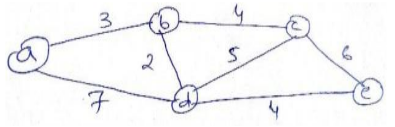

# Unit 2

## <mark> 1) How divide and conquer approach work? </mark>

The divide and conquer approach is a fundamental algorithm design paradigm used to solve complex problems by breaking them down into smaller, more manageable subproblems. Here’s how it works:

### Steps of Divide and Conquer

1. Divide:

   - The problem is divided into several smaller subproblems that are similar to the original problem but smaller in size.
   - This division continues recursively until the subproblems become simple enough to be solved directly.

2. Conquer:

   - Each of the smaller subproblems is solved independently. If the subproblems are still too large, the divide and conquer process is applied recursively.
   - This step often involves calling the same algorithm on the smaller subproblems.

3. Combine:
   - Once the subproblems have been solved, their solutions are combined to form a solution to the original problem.
   - This step is crucial as it integrates the results from the subproblems to produce a final result.

### Characteristics of Divide and Conquer

- Recursive Nature: The approach is inherently recursive, where each level of recursion breaks the problem down further.
- Efficiency: It often leads to efficient algorithms, especially for problems that exhibit overlapping subproblems and optimal substructure properties.
- Problem-Specific: The effectiveness of this approach depends on the nature of the problem being solved.

### Examples of Divide and Conquer Algorithms

1. Merge Sort:

   - Divide: Split the array into two halves.
   - Conquer: Recursively sort both halves.
   - Combine: Merge the two sorted halves.

2. Quick Sort:

   - Divide: Choose a pivot element and partition the array around it.
   - Conquer: Recursively sort the left and right partitions.
   - Combine: Since partitions are sorted in place, no explicit combining step is needed.

3. Binary Search:
   - Divide: Compare the target value to the middle element of a sorted array.
   - Conquer: If they are not equal, recursively search in either the left or right half based on whether the target is less than or greater than the middle element.
   - Combine: No explicit combining step; return results from recursive calls.

### Conclusion

The divide and conquer approach effectively reduces complex problems into simpler ones, allowing for efficient solutions through recursive processing and combination of results. It is widely applicable in various fields of computer science, particularly in sorting, searching, and optimization algorithms.

## <mark> 2) What is Divide and Conquer Technique? Explain how to apply divide and conquer technique for solving the problem? </mark>

### Divide and Conquer Technique

Definition: The divide and conquer technique is a fundamental algorithm design paradigm used to solve complex problems by breaking them down into smaller, more manageable subproblems. This approach involves three main steps: dividing the problem into smaller parts, conquering (solving) those parts recursively, and then combining the solutions to form a complete solution to the original problem.

### Steps to Apply Divide and Conquer Technique

1. Divide:

   - Split the original problem into several smaller subproblems that are similar to the original problem but smaller in size. This division continues recursively until the subproblems become simple enough to be solved directly.

2. Conquer:

   - Solve each of the smaller subproblems independently. If any of these subproblems are still too large, apply the divide and conquer technique recursively on those subproblems as well.

3. Combine:
   - Once the subproblems have been solved, combine their solutions to form a solution for the original problem. This step integrates the results from the subproblems.

### Example of Applying Divide and Conquer

Let’s illustrate how to apply the divide and conquer technique using the Merge Sort algorithm as an example.

#### Problem: Sorting an Array

1. Divide:

   - Given an array, split it into two halves.
   - Continue splitting each half until you have subarrays that contain only one element (since a single element is inherently sorted).

2. Conquer:

   - Recursively sort both halves of the array.
   - Since you are now dealing with smaller arrays, this step will eventually reach the base case where each array has one element.

3. Combine:
   - Merge the two sorted halves back together into a single sorted array.
   - During this merging process, compare elements from both halves and arrange them in sorted order.

### Example Walkthrough of Merge Sort

Consider an array: `[38, 27, 43, 3, 9, 82, 10]`.

1. Divide:

   - Split into `[38, 27, 43]` and `[3, 9, 82, 10]`.
   - Further split `[38, 27, 43]` into `` and `[27, 43]`, then split `[27, 43]` into `` and ``.
   - Continue until you have individual elements: `, `, `, `, `, `, ``.

2. Conquer:

   - Each individual element is sorted by default.
   - Now merge back:
     - Merge `and` to get `[27, 43]`.
     - Merge ``with`[27, 43]`to get`[27, 38, 43]`.
     - Move on to the right half: merge `, `, and then merge with ``, resulting in `[3, 9, 10, 82]`.

3. Combine:
   - Finally merge the two sorted halves:
     - Merge `[27, 38, 43]` with `[3, 9, 10, 82]` to get a fully sorted array:
     ```
     [3, 9, 10, 27, 38, 43, 82]
     ```

### Conclusion

The divide and conquer technique is a powerful method for solving problems efficiently by breaking them down into simpler components. This approach not only simplifies complex problems but also leads to efficient algorithms like Merge Sort and Quick Sort. By applying this technique systematically—dividing into smaller problems, solving each independently, and combining results—many computational challenges can be tackled effectively.

## <mark> 3) What do you mean by Divide & Conquer Approach? List advantages and disadvantages of it. </mark>

### Divide and Conquer Approach

Definition: The divide and conquer approach is a fundamental algorithm design paradigm that involves breaking a problem down into smaller, more manageable subproblems, solving each subproblem independently, and then combining their solutions to solve the original problem. This technique is particularly effective for problems that can be recursively divided into similar subproblems.

### Steps of the Divide and Conquer Approach

1. Divide: Split the original problem into smaller subproblems.
2. Conquer: Recursively solve each subproblem.
3. Combine: Merge the solutions of the subproblems to create a solution for the original problem.

### Advantages of Divide and Conquer

1. Efficiency: Many divide and conquer algorithms, such as Merge Sort and Quick Sort, have efficient time complexities (e.g., $$O(n \log n)$$), making them suitable for large datasets.
2. Simplicity: The recursive nature of divide and conquer can simplify the implementation of complex algorithms, making them easier to understand and maintain.
3. Parallelism: Subproblems can often be solved independently, allowing for parallel processing and potentially improving performance on multi-core systems.
4. Optimal Solutions: For many problems, divide and conquer guarantees an optimal solution by ensuring that all possible configurations are considered through recursive exploration.

### Disadvantages of Divide and Conquer

1. Overhead: The recursive calls can introduce overhead due to function calls and stack space usage, which may lead to inefficiencies in certain cases.
2. Complexity in Implementation: While the concept is simple, implementing a divide and conquer algorithm can be complex, especially when combining solutions from subproblems.
3. Memory Usage: Recursive algorithms may use more memory due to the call stack, which can be a limitation for deep recursions or large datasets.
4. Not Always Applicable: Some problems do not lend themselves well to this approach and may be better suited for other algorithmic strategies (e.g., dynamic programming).

### Conclusion

The divide and conquer approach is a powerful technique in algorithm design that effectively breaks down complex problems into simpler components. While it offers significant advantages in terms of efficiency and simplicity, it also comes with challenges related to overhead, implementation complexity, and memory usage. Understanding when to apply this approach is crucial for developing efficient algorithms.

## <mark> 4) Write iterative and recursive algorithm for finding the factorial of N. Derive the time complexity of both algorithms. </mark>

### Factorial of N

The factorial of a non-negative integer $$ N $$ is the product of all positive integers less than or equal to $$ N $$. It is denoted as $$ N! $$ and defined as:

$$
N! =
\begin{cases}
1 & \text{if } N = 0 \\
N \times (N-1)! & \text{if } N > 0
\end{cases}
$$

### Iterative Algorithm for Factorial

The iterative approach uses a loop to calculate the factorial.

#### Iterative Algorithm

```python
def factorial_iterative(N):
    result = 1
    for i in range(1, N + 1):
        result *= i
    return result
```

### Recursive Algorithm for Factorial

The recursive approach calls the function itself to calculate the factorial.

#### Recursive Algorithm

```python
def factorial_recursive(N):
    if N == 0:
        return 1
    else:
        return N * factorial_recursive(N - 1)
```

### Time Complexity Analysis

#### Iterative Algorithm Time Complexity

- The iterative algorithm runs a loop from 1 to $$ N $$, performing a constant amount of work (multiplication) in each iteration.
- Time Complexity: $$ O(N) $$

#### Recursive Algorithm Time Complexity

- The recursive algorithm makes a call to itself $$ N $$ times, reducing $$ N $$ by 1 each time until it reaches the base case (when $$ N = 0 $$).
- Each recursive call involves a constant amount of work (multiplication).
- Time Complexity: $$ O(N) $$

### Summary

Both the iterative and recursive algorithms for calculating the factorial of $$ N $$ have a time complexity of $$ O(N) $$. However, the iterative method is generally more space-efficient because it does not involve the overhead of recursive function calls, which can lead to stack overflow for large values of $$ N $$. The recursive method, while elegant and straightforward, may consume more memory due to the call stack.

## <mark> 5) Give the recursive algorithm to find Fibonacci sequence. Comment on the complexity of the algorithm. </mark>

### Recursive Algorithm to Find Fibonacci Sequence

The Fibonacci sequence is defined as follows:

- $$ F(0) = 0 $$
- $$ F(1) = 1 $$
- For $$ n \geq 2 $$: $$ F(n) = F(n-1) + F(n-2) $$

Here’s the recursive algorithm to compute the $$ n $$-th Fibonacci number:

#### Recursive Algorithm

```python
def fibonacci_recursive(n):
    if n == 0:
        return 0
    elif n == 1:
        return 1
    else:
        return fibonacci_recursive(n - 1) + fibonacci_recursive(n - 2)
```

### Complexity Analysis

#### Time Complexity

- The time complexity of the recursive Fibonacci algorithm is exponential. Specifically, it can be expressed as $$ O(2^n) $$.
- This is because each call to `fibonacci_recursive` results in two further calls (except for the base cases), leading to a binary tree of calls.
- The number of calls grows exponentially with $$ n $$, as each Fibonacci number requires the computation of its two predecessors.

#### Space Complexity

- The space complexity is $$ O(n) $$ due to the recursion stack. In the worst case, the maximum depth of the recursion will be $$ n $$, as the function will call itself until it reaches the base cases.

### Conclusion

While the recursive approach to calculating Fibonacci numbers is straightforward and elegant, it is inefficient for large values of $$ n $$ due to its exponential time complexity. For practical applications, iterative methods or dynamic programming approaches (such as memoization) are preferred to improve efficiency.

## <mark> 6) What is recurrence? Solve recurrence equation T (n) = T (n-1) + n using forward substitution and backward substitution method. </mark>

### What is Recurrence?

In computer science, a recurrence is an equation that recursively defines a sequence of values. It expresses the value of a function in terms of its values at smaller inputs. Recurrences are commonly used to analyze the time complexity of recursive algorithms.

### Solving the Recurrence Equation $$ T(n) = T(n-1) + n $$

We will solve the recurrence equation $$ T(n) = T(n-1) + n $$ using both forward substitution and backward substitution methods.

#### Forward Substitution Method

1. Unroll the Recurrence:

   - Start from $$ T(n) $$:
     $$
     T(n) = T(n-1) + n
     $$
   - Substitute $$ T(n-1) $$:
     $$
     T(n-1) = T(n-2) + (n-1)
     $$
   - Substitute back into the first equation:
     $$
     T(n) = (T(n-2) + (n-1)) + n = T(n-2) + n + (n-1)
     $$
   - Continuing this process:
     $$
     T(n) = T(n-k) + n + (n-1) + (n-2) + \ldots + (n-k+1)
     $$

2. Identify the Base Case:

   - Assume $$ k = n $$, then $$ T(0) $$:
     $$
     T(n) = T(0) + n + (n-1) + (n-2) + \ldots + 1
     $$
   - The sum of the first $$ n $$ integers is given by:
     $$
     1 + 2 + 3 + \ldots + n = \frac{n(n+1)}{2}
     $$

3. Final Expression:
   - Therefore, we have:
     $$
     T(n) = T(0) + \frac{n(n+1)}{2}
     $$
   - Assuming $$ T(0) = c $$, where $$ c $$ is a constant:
     $$
     T(n) = c + \frac{n(n+1)}{2}
     $$
4. Asymptotic Behavior:
   - The dominant term as $$ n \to \infty $$:
     $$
     T(n) = O(n^2)
     $$

#### Backward Substitution Method

1. Express in Terms of Base Case:

   - Start from $$ n = 0 $$:
   - We know that:
     - $$ T(0) = c $$
     - $$ T(1) = c + 1$$
     - $$ T(2) = c + 2$$
     - Continuing this way, we can express:
     - $$ T(2) = c + 2$$
     - $$ T(3) = c + 3$$
     - ...
     - Up to $$ n$$:
     - $$ T(n) = c + 1 + 2 + 3 + ... + n$$

2. Sum of First N Integers:

   - The sum can be expressed as:
     $$
     1 + 2 + ... + n = \frac{n(n+1)}{2}
     $$

3. Final Expression:

   - Thus, we have:
     $$
     T(n) = c + \frac{n(n+1)}{2}
     $$

4. Asymptotic Behavior:
   - The dominant term as $$ n \to \infty$$:
     $$
     T(n) = O(n^2)
     $$

### Conclusion

Both the forward substitution and backward substitution methods yield the same result for the recurrence relation $$ T(n) = T(n-1) + n$$. The solution is:

$$
T(n) = c + O\left(\frac{n^2}{2}\right)
$$

Thus, the time complexity of the recurrence is:

$$
T(n) = O(n^2)
$$

## <mark> 7) Explain master Method and solve the following recurrence equation withmaster method. <br> a. T(n)= 9T(n/3) + n <br> b. T(n)= 3T(n/4) + nlgn <br> c. T(n)= T(n/2) + 1 <br> d. T(n)= 7T(n/3) + n2 </mark>

### Master Method

The Master Method provides a way to analyze the time complexity of divide-and-conquer algorithms that fit a specific form of recurrence relations. It is particularly useful for solving recurrences of the type:

$$
T(n) = aT\left(\frac{n}{b}\right) + f(n)
$$

where:

- $$ n $$ is the size of the problem,
- $$ a \geq 1 $$ is the number of subproblems,
- $$ b > 1 $$ is the factor by which the problem size is reduced,
- $$ f(n) $$ is a function that describes the cost of the work done outside the recursive calls.

The Master Theorem states that we can compare $$ f(n) $$ with $$ n^{\log_b a} $$ to determine $$ T(n) $$:

1. Case 1: If $$ f(n) $$ is polynomially smaller than $$ n^{\log_b a} $$, i.e., there exists a constant $$ \epsilon > 0 $$ such that:

   $$
   f(n) = O\left(n^{\log_b a - \epsilon}\right)
   $$

   Then:

   $$
   T(n) = \Theta(n^{\log_b a})
   $$

2. Case 2: If $$ f(n) $$ is asymptotically equal to $$ n^{\log_b a} $$, i.e., there exists a constant $$ c > 0 $$ such that:

   $$
   f(n) = \Theta(n^{\log_b a} \log^k n)
   $$

   for some $$ k \geq 0 $$, then:

   $$
   T(n) = \Theta(n^{\log_b a} \log^{k+1} n)
   $$

3. Case 3: If $$ f(n) $$ is polynomially larger than $$ n^{\log_b a} $$, i.e., there exists a constant $$ c < 1 $$ such that:
   $$
   f(n) = \Omega\left(n^{\log_b a + \epsilon}\right)
   $$
   and if $$ af\left(\frac{n}{b}\right) \leq cf(n) $$ for some constant $$ c < 1 $$, then:
   $$
   T(n) = \Theta(f(n))
   $$

### Solving Recurrence Equations Using the Master Method

#### a. $$ T(n) = 9T\left(\frac{n}{3}\right) + n $$

- Here, $$ a = 9, b = 3, f(n) = n $$.
- Calculate $$ n^{\log_b a} = n^{\log_3 9} = n^2 $$.

Comparison:

- Since $$ f(n) = n = O(n^2/\epsilon)$$, where $$ c < 1 (c=1/2)$$, we fall into Case 1.

Conclusion:

$$
T(n) = \Theta(n^2)
$$

---

#### b. $$ T(n) = 3T\left(\frac{n}{4}\right) + n\log n $$

- Here, $$ a = 3, b = 4, f(n) = n\log n $$.
- Calculate $$ n^{\log_b a} = n^{\log_4 3} = n^{0.7925} (approximately)$$.

Comparison:

- Since $$ f(n)=n\log n=\Omega (n^{0.7925+\epsilon}) (for any small value of ε>0)$$, we check if it satisfies the regularity condition.

To check regularity condition:

- Check if:
  $$
  3f\left(\frac{n}{4}\right)\leq cf(n)
  $$
  Which simplifies to:
  $$
  3\left(\frac{n}{4}\log{\frac{n}{4}}\right)\leq cf(n)
  $$
  This holds true for large enough constants.

Conclusion:
Using Case 3, we have:

$$
T(n)=Θ(f(n))=Θ(n log n)
$$

---

#### c. $$ T(n)=T\left(\frac{n}{2}\right)+1 $$

- Here, $$ a=1, b=2, f(n)=1.$$
- Calculate:
  $$
  n^{\log_b{a}}=n^0=1
  $$

Comparison:

- Since $$ f(n)=1=\Theta(1)$$, we fall into Case 2.

Conclusion:

$$
T(n)=Θ(log n)
$$

---

#### d. $$ T(n)=7T\left(\frac{n}{3}\right)+n^2 $$

- Here, $$ a=7, b=3, f(n)=n^2.$$
- Calculate:
  $$
  n^{\log_b{a}}=n^{\log_3{7}}≈n^{1.771243}
  $$

Comparison:

- We see that since $$f(n)=n^2=\Omega (n^{1.771243+\epsilon}) (for ε<0.22876)$$, we check if it satisfies regularity condition.

To check regularity condition:

- Check if:
  $$
  7f\left(\frac{n}{3}\right)\leq cf(n)
  $$
  This simplifies to checking if:
  $$
  7*\left(\frac{n}{3}\right)^2 ≤ cf=n^2
  $$
  This holds true for large enough constants.

Conclusion:
Using Case 3, we have:

$$
T(n)=Θ(f(n))=Θ(n^2)
$$

### Summary

The Master Method provides an efficient way to analyze the time complexity of divide-and-conquer recurrences. The solutions for the given recurrences are:

a. $$ T(n)=Θ(n^2)$$  
b. $$ T(n)=Θ(n log n)$$  
c. $$ T(n)=Θ(log n)$$  
d. $$ T(n)=Θ(n^2)$$

## <mark> 8) Which searching algorithm required Sorted list of elements? </mark>

The searching algorithm that requires a sorted list of elements is Binary Search.

### Explanation of Binary Search

Binary Search works by repeatedly dividing the sorted list in half to locate a target value. The algorithm begins by comparing the target value to the middle element of the list:

1. If the target value is equal to the middle element, the search is successful.
2. If the target value is less than the middle element, the search continues in the left half of the list.
3. If the target value is greater than the middle element, the search continues in the right half of the list.

This process is repeated until the target value is found or the sublist size becomes zero.

### Time Complexity

- The time complexity of Binary Search is $$ O(\log n) $$, making it very efficient for searching in sorted lists compared to linear search algorithms, which have a time complexity of $$ O(n) $$.

### Conclusion

In summary, Binary Search is a highly efficient searching algorithm that requires a sorted list of elements to function correctly.

## <mark> 9) Explain the use of Divide and Conquer Technique for Binary Search Method.Give the algorithm for Binary Search Method. What is the complexity of Binary Search Method? </mark>

### Divide and Conquer Technique in Binary Search

Divide and Conquer is a powerful algorithmic paradigm that involves breaking a problem down into smaller subproblems, solving each of those subproblems independently, and then combining their solutions to solve the original problem. The Binary Search algorithm is a classic example of this technique applied to searching in a sorted array.

### How Binary Search Uses Divide and Conquer

1. Divide: The algorithm starts by dividing the sorted array into two halves. It calculates the middle index of the array.
2. Conquer: It compares the target value with the middle element:
   - If the target value is equal to the middle element, the search is successful.
   - If the target value is less than the middle element, the search continues in the left half of the array.
   - If the target value is greater than the middle element, the search continues in the right half of the array.
3. Combine: Since each recursive call operates independently on its respective half of the array, there is no need for a combining step as in other divide and conquer algorithms.

### Algorithm for Binary Search

Here’s a simple implementation of Binary Search using both iterative and recursive approaches:

#### Iterative Approach

```python
def binary_search_iterative(arr, target):
    left, right = 0, len(arr) - 1

    while left <= right:
        mid = left + (right - left) // 2

        # Check if target is present at mid
        if arr[mid] == target:
            return mid
        # If target is greater, ignore left half
        elif arr[mid] < target:
            left = mid + 1
        # If target is smaller, ignore right half
        else:
            right = mid - 1

    return -1  # Target not found
```

#### Recursive Approach

```python
def binary_search_recursive(arr, target, left, right):
    if left > right:
        return -1  # Target not found

    mid = left + (right - left) // 2

    # Check if target is present at mid
    if arr[mid] == target:
        return mid
    # If target is greater, search in right half
    elif arr[mid] < target:
        return binary_search_recursive(arr, target, mid + 1, right)
    # If target is smaller, search in left half
    else:
        return binary_search_recursive(arr, target, left, mid - 1)
```

### Complexity of Binary Search Method

- Time Complexity: The time complexity of Binary Search is $$ O(\log n) $$, where $$ n $$ is the number of elements in the array. This logarithmic complexity arises because each comparison effectively halves the size of the search space.
- Space Complexity:
  - For the iterative approach, the space complexity is $$ O(1) $$ since it uses a constant amount of space.
  - For the recursive approach, the space complexity is $$ O(\log n) $$ due to the recursive call stack.

### Conclusion

The Divide and Conquer technique effectively optimizes search operations by reducing the problem size with each step in Binary Search. This results in a highly efficient algorithm for finding elements in sorted arrays with a time complexity of $$ O(\log n) $$.

## <mark> 10) Analyze quick sort algorithm for best case, average case and worst casewith example. In which case it performs similar to selection sort? </mark>

### Quick Sort Algorithm Analysis

Quick Sort is a popular sorting algorithm that uses the divide-and-conquer approach to sort elements. It works by selecting a "pivot" element from the array and partitioning the other elements into two sub-arrays according to whether they are less than or greater than the pivot. The sub-arrays are then sorted recursively.

### Time Complexity Analysis

1. Best Case:

   - The best-case scenario occurs when the pivot divides the array into two nearly equal halves at each level of recursion. This results in a balanced partitioning.
   - Time Complexity: $$ O(n \log n) $$
   - Example: For an already sorted array where the pivot is chosen as the median:
     - Array: `[1, 2, 3, 4, 5]` with pivot `3`.
     - Partitioning results in two sub-arrays: `[1, 2]` and `[4, 5]`.

2. Average Case:

   - On average, Quick Sort also achieves a time complexity of $$ O(n \log n) $$. This is due to the random nature of pivot selection leading to reasonably balanced partitions.
   - Example: For an array like `[3, 6, 8, 10, 1, 2, 1]`, if `6` is chosen as the pivot:
     - Partitioning results in `[3, 1, 2, 1]` and `[8, 10]`, leading to further recursive calls.

3. Worst Case:
   - The worst-case scenario occurs when the pivot is always the smallest or largest element in the partitioned array. This leads to unbalanced partitions and results in $$ n $$ recursive calls with $$ n-1 $$ elements remaining each time.
   - Time Complexity: $$ O(n^2) $$
   - Example: For an already sorted array where the smallest or largest element is consistently chosen as the pivot:
     - Array: `[1, 2, 3, 4, 5]` with pivot `1`.
     - This results in partitions like `[]` and `[2, 3, 4, 5]`, leading to inefficient sorting.

### Comparison with Selection Sort

Quick Sort performs similarly to Selection Sort in its worst-case scenario. Both algorithms exhibit a time complexity of $$ O(n^2) $$ when dealing with certain types of input:

- Selection Sort always has a time complexity of $$ O(n^2) $$ regardless of input because it always scans through the entire unsorted portion of the array to find the minimum element for each position.
- Quick Sort's worst-case performance occurs under similar conditions (e.g., already sorted data with poor pivot selection), leading to inefficient partitioning.

### Conclusion

In summary:

- Best Case: $$ O(n \log n) $$ (balanced partitions).
- Average Case: $$ O(n \log n) $$ (randomized pivots).
- Worst Case: $$ O(n^2) $$ (poor pivot choices).
- Quick Sort behaves similarly to Selection Sort in its worst-case scenario with a time complexity of $$ O(n^2) $$.

## <mark> 11) Explain how multiplication of large integers can be done efficiently by usingdivide and conquer technique? </mark>

### Efficient Multiplication of Large Integers Using Divide and Conquer

The multiplication of large integers can be efficiently accomplished using the divide and conquer technique, particularly through an algorithm known as Karatsuba multiplication. This method reduces the complexity of multiplying two large numbers compared to the traditional grade-school method.

### Overview of Karatsuba Multiplication

Karatsuba's algorithm works by breaking down the multiplication of two large numbers into smaller parts, allowing for fewer multiplicative operations. The key idea is to split each number into two halves and recursively multiply these halves.

### Steps of Karatsuba Multiplication

1. Split the Numbers:

   - Given two large integers $$ x $$ and $$ y $$, split them into two halves:
     - Let $$ x = x_1 \cdot 10^m + x_0 $$ (where $$ m $$ is half the number of digits in $$ x $$)
     - Let $$ y = y_1 \cdot 10^m + y_0 $$

2. Recursive Multiplication:

   - Compute three products using the smaller parts:
     - $$ z_0 = x_0 \cdot y_0 $$ (the product of the lower parts)
     - $$ z_1 = x_1 \cdot y_1 $$ (the product of the higher parts)
     - $$ z_2 = (x_1 + x_0) \cdot (y_1 + y_0) - z_1 - z_0 $$ (cross-term product)

3. Combine the Results:
   - The final result can be computed as:
     $$
     xy = z_1 \cdot 10^{2m} + z_2 \cdot 10^{m} + z_0
     $$
     This combines the results from the three multiplications.

### Complexity Analysis

- The traditional multiplication algorithm has a time complexity of $$ O(n^2) $$, where $$ n $$ is the number of digits in the numbers being multiplied.
- Karatsuba's algorithm reduces this to approximately $$ O(n^{\log_2 3}) \approx O(n^{1.585}) $$. This is achieved by reducing the number of multiplicative operations needed from four (as in traditional methods) to three.

### Example

Let's illustrate with a simple example:

- Suppose we want to multiply $$ x = 1234 $$ and $$ y = 5678 $$.

1. Split:

   - Let $$ x = 12 \cdot 10^2 + 34 $$
   - Let $$ y = 56 \cdot 10^2 + 78 $$

2. Compute:

   - $$ z_0 = 34 \cdot 78 = 2652 $$
   - $$ z_1 = 12 \cdot 56 = 672 $$
   - $$ z_2 = (12 + 34)(56 + 78) - z_1 - z_0 = (46)(134) - 672 - 2652 = 6164 - 672 - 2652 = 2840$$

3. Combine:
   - Final result:
     $$
     xy = z_1 \cdot 10^4 + z_2 \cdot 10^2 + z_0
     = 6720000 + 284000 + 2652
     = 7006652
     $$

### Conclusion

The divide and conquer technique, particularly through Karatsuba multiplication, allows for efficient multiplication of large integers by reducing the number of required multiplicative operations. This method significantly improves performance over traditional multiplication algorithms, especially for very large numbers, making it a powerful tool in computational mathematics and computer science.

## <mark> 12) Explain how divide and conquer method help multiplying two squareMatrices. OR Explain Strasson’s algorithm for matrix multiplication. </mark>

### Multiplying Two Square Matrices Using Divide and Conquer

The divide and conquer method can significantly improve the efficiency of matrix multiplication, especially for large matrices. One of the most well-known algorithms that utilize this technique is Strassen's Algorithm. This algorithm reduces the number of multiplications required to multiply two matrices compared to the conventional method.

### Steps of the Divide and Conquer Method for Matrix Multiplication

1. Divide:

   - Given two square matrices $$ A $$ and $$ B $$ of size $$ n \times n $$, divide each matrix into four submatrices:
     - For matrix $$ A $$:
       $$
       A = \begin{bmatrix}
       A_{11} & A_{12} \\
       A_{21} & A_{22}
       \end{bmatrix}
       $$
     - For matrix $$ B $$:
       $$
       B = \begin{bmatrix}
       B_{11} & B_{12} \\
       B_{21} & B_{22}
       \end{bmatrix}
       $$

2. Recursive Multiplication:

   - Instead of performing the standard multiplication, which requires $$ 8 $$ multiplications for the four submatrices, Strassen's algorithm reduces this to $$ 7 $$ multiplications by calculating the following:
     - $$ M*1 = (A*{11} + A*{22})(B*{11} + B\_{22}) $$
     - $$ M*2 = (A*{21} + A*{22})B*{11} $$
     - $$ M*3 = A*{11}(B*{12} - B*{22}) $$
     - $$ M*4 = A*{22}(B*{21} - B*{11}) $$
     - $$ M*5 = (A*{11} + A*{12})B*{22} $$
     - $$ M*6 = (A*{21} - A*{11})(B*{11} + B\_{12}) $$
     - $$ M*7 = (A*{12} - A*{22})(B*{21} + B\_{22}) $$

3. Combine:
   - The final result matrix $$ C = AB $$ can be constructed using the products calculated above:
     - The submatrices of the resulting product matrix $$ C $$ are computed as follows:
       - $$
         C_{11} = M_1 + M_4 - M_5 + M_7
         $$
       - $$
         C_{12} = M_3 + M_5
         $$
       - $$
         C_{21} = M_2 + M_4
         $$
       - $$
         C_{22} = M_1 - M_2 + M_3 + M_6
         $$

### Complexity Analysis

- The traditional method for multiplying two $$ n \times n $$ matrices has a time complexity of $$ O(n^3) $$.
- Strassen's algorithm reduces this complexity to approximately $$ O(n^{\log_2 7}) $$, which is about $$ O(n^{2.81}) $$. This reduction is significant for large matrices and demonstrates the power of the divide and conquer approach.

### Conclusion

The divide and conquer method enhances matrix multiplication by breaking down larger problems into smaller subproblems, allowing for more efficient calculations through recursive steps. Strassen's algorithm exemplifies how this technique can reduce computational complexity, making it a valuable approach in algorithm design for linear algebra operations.

## <mark> 13) Write an algorithm for quick sort and derive best case, worst case usingdivide and conquer technique also trace given data (3,1,4,5,9,2,6,5). </mark>

### Quick Sort Algorithm

Quick Sort is a divide-and-conquer sorting algorithm that works by selecting a "pivot" element from the array and partitioning the other elements into two sub-arrays according to whether they are less than or greater than the pivot. The sub-arrays are then sorted recursively.

#### Quick Sort Algorithm

Here is a simple implementation of Quick Sort:

```python
def quick_sort(arr):
    if len(arr) <= 1:
        return arr
    else:
        pivot = arr[len(arr) // 2]  # Choosing the middle element as pivot
        left = [x for x in arr if x < pivot]   # Elements less than pivot
        middle = [x for x in arr if x == pivot]  # Elements equal to pivot
        right = [x for x in arr if x > pivot]   # Elements greater than pivot
        return quick_sort(left) + middle + quick_sort(right)
```

### Complexity Analysis

#### Best Case

- The best-case scenario occurs when the pivot divides the array into two nearly equal halves at each level of recursion.
- Time Complexity: $$ O(n \log n) $$
- This happens when the pivot is chosen optimally, leading to balanced partitions.

#### Worst Case

- The worst-case scenario occurs when the pivot is always the smallest or largest element in the partitioned array, leading to unbalanced partitions.
- Time Complexity: $$ O(n^2) $$
- This typically happens when the input array is already sorted (or reverse sorted) and the first or last element is consistently chosen as the pivot.

### Tracing Quick Sort on Given Data

Let's trace Quick Sort using the input data: (3, 1, 4, 5, 9, 2, 6, 5).

1. Initial Array:

   - Input: `[3, 1, 4, 5, 9, 2, 6, 5]`
   - Pivot: `4` (middle element)

2. Partitioning:

   - Left: `[3, 1, 2]` (elements less than `4`)
   - Middle: ``(elements equal to`4`)
   - Right: `[5, 9, 6, 5]` (elements greater than `4`)

3. Recursive Calls:

   - Sort Left: `quick_sort([3, 1, 2])`

     - Pivot: `1`
     - Left: `[]`
     - Middle: `[1]`
     - Right: `[3, 2]`
       - Sort Right: `quick_sort([3, 2])`
         - Pivot: `2`
         - Left: `[]`
         - Middle: `[2]`
         - Right: ``
       - Combined Result for Right: `[2, 3]`
     - Combined Result for Left: `[1] + [] + [2, 3] = [1, 2, 3]`

   - Sort Right: `quick_sort([5, 9, 6, 5])`
     - Pivot: `9`
     - Left: `[5, 6]`
     - Middle: ``
     - Right: `[]`
       - Sort Left: `quick_sort([5, 6])`
         - Pivot: `6`
         - Left: ``
         - Middle: ``
         - Right: `[]`
       - Combined Result for Left: ` +  + [] = [5, 6]`

4. Final Combination:
   Combine all parts:
   ```
   Sorted Array = [1, 2, 3] + [4] + [5, 6] + [9]
                 = [1, 2, 3, 4, 5, 5, 6, 9]
   ```

### Conclusion

The Quick Sort algorithm efficiently sorts arrays using a divide-and-conquer approach. Its average and best-case time complexity is $$ O(n \log n) $$, while its worst-case time complexity is $$ O(n^2) $$. The example traced above demonstrates how Quick Sort operates on a given set of data by recursively partitioning and sorting sub-arrays.

## <mark> 14) Write Merge sort algorithm and compute its worst case and best-case time complexity. Sort the List G,U,J,A,R,A,T in alphabetical order using merge sort. </mark>

### Merge Sort Algorithm

Merge Sort is a divide-and-conquer algorithm that sorts an array by recursively dividing it into two halves, sorting each half, and then merging the sorted halves back together.

#### Merge Sort Algorithm

Here’s a simple implementation of Merge Sort in Python:

```python
def merge_sort(arr):
    if len(arr) > 1:
        mid = len(arr) // 2  # Finding the mid of the array
        left_half = arr[:mid]  # Dividing the elements into 2 halves
        right_half = arr[mid:]

        merge_sort(left_half)  # Sorting the first half
        merge_sort(right_half)  # Sorting the second half

        i = j = k = 0

        # Copy data to temp arrays L[] and R[]
        while i < len(left_half) and j < len(right_half):
            if left_half[i] < right_half[j]:
                arr[k] = left_half[i]
                i += 1
            else:
                arr[k] = right_half[j]
                j += 1
            k += 1

        # Checking if any element was left
        while i < len(left_half):
            arr[k] = left_half[i]
            i += 1
            k += 1

        while j < len(right_half):
            arr[k] = right_half[j]
            j += 1
            k += 1

# Example usage:
data = ['G', 'U', 'J', 'A', 'R', 'A', 'T']
merge_sort(data)
print(data)  # Output will be sorted list
```

### Time Complexity of Merge Sort

- Best Case: The best-case time complexity occurs when the array is already sorted. However, even in this case, Merge Sort still divides and merges the array, leading to:

  - Time Complexity: $$ O(n \log n) $$

- Worst Case: The worst-case time complexity occurs when the array is in reverse order. Similar to the best case, it still divides and merges, resulting in:
  - Time Complexity: $$ O(n \log n) $$

### Sorting the List `G, U, J, A, R, A, T` Using Merge Sort

Let's apply the Merge Sort algorithm to sort the list alphabetically.

1. Initial List: `['G', 'U', 'J', 'A', 'R', 'A', 'T']`
2. Divide:

   - Split into two halves:
     - Left: `['G', 'U', 'J']`
     - Right: `['A', 'R', 'A', 'T']`

3. Recursive Sorting:

   - Sort Left:
     - Split `['G', 'U', 'J']` into `['G']` and `['U', 'J']`
     - Sort `['U', 'J']` into `['J', 'U']`
     - Merge to get `['G', 'J', 'U']`
   - Sort Right:
     - Split `['A', 'R', 'A', 'T']` into `['A', 'R']` and `['A', 'T']`
     - Both halves are sorted as they have one or two elements.
     - Merge to get `['A', 'A', 'R', 'T']`

4. Combine Sorted Halves:
   - Merge `['G', 'J', 'U']` and `['A', 'A', 'R', 'T']`:
   - Resulting Sorted List:
     ```
     ['A', 'A', 'G', 'J', 'R', 'T', 'U']
     ```

### Final Output

After applying Merge Sort to the list `G, U, J, A, R, A, T`, the sorted list in alphabetical order is:

```
['A', 'A', 'G', 'J', 'R', 'T', 'U']
```

### Conclusion

Merge Sort is an efficient sorting algorithm with a consistent time complexity of $$ O(n \log n) $$ for best, average, and worst cases. The algorithm effectively sorts the provided list alphabetically through recursive division and merging.

## <mark> 15) Write divide and conquer algorithm to solve Exponential problem. Also solve29 using same algorithm. </mark>

### Divide and Conquer Algorithm to Solve the Exponential Problem

The exponential problem typically refers to calculating powers of a number, such as $$ x^n $$. The divide and conquer approach can be effectively used to compute $$ x^n $$ efficiently, especially for large values of $$ n $$.

#### Algorithm

The algorithm works as follows:

1. Base Case:

   - If $$ n = 0 $$, return 1 (since any number raised to the power of 0 is 1).
   - If $$ n = 1 $$, return $$ x $$ (since any number raised to the power of 1 is itself).

2. Divide:

   - If $$ n $$ is even, calculate:
     $$
     x^n = (x^{n/2})^2
     $$
   - If $$ n $$ is odd, calculate:
     $$
     x^n = x \cdot x^{n-1}
     $$

3. Conquer:

   - Recursively compute the required powers.

4. Combine:
   - Combine the results from the recursive calls.

#### Pseudocode

Here’s the pseudocode for the divide and conquer algorithm to compute $$ x^n $$:

```plaintext
function power(x, n):
    if n == 0:
        return 1
    if n == 1:
        return x
    if n is even:
        half_power = power(x, n / 2)
        return half_power * half_power
    else:
        return x * power(x, n - 1)
```

### Example: Calculate $$ 2^9 $$

Let's solve $$ 2^9 $$ using the above algorithm.

1. Initial Call: `power(2, 9)`

   - Since $$ 9 $$ is odd:
     $$
     2^9 = 2 \cdot 2^{8}
     $$

2. Next Call: `power(2, 8)`

   - Since $$ 8 $$ is even:
     $$
     2^8 = (2^{4})^2
     $$

3. Next Call: `power(2, 4)`

   - Since $$ 4 $$ is even:
     $$
     2^4 = (2^{2})^2
     $$

4. Next Call: `power(2, 2)`

   - Since $$ 2 $$ is even:
     $$
     2^2 = (2^{1})^2
     $$

5. Next Call: `power(2, 1)`
   - Base case reached, return $$ 2 $$.

Now we can combine the results:

- From `power(2, 1)` we get $$ 2 $$.
- From `power(2, 2)` we compute:
  $$
  (2)^2 = 4
  $$
- From `power(2, 4)` we compute:
  $$
  (4)^2 = 16
  $$
- From `power(2, 8)` we compute:
  $$
  16^2 = 256
  $$
- Finally, from `power(2, 9)` we compute:
  $$
  2 \cdot 256 = 512
  $$

### Conclusion

Using the divide and conquer approach, we have computed that $$ 2^9 = 512 $$. This method is efficient and reduces the number of multiplications needed compared to a straightforward iterative approach. The time complexity of this algorithm is $$ O(\log n) $$, making it very efficient for large values of $$ n $$.

## <mark> 16) Demonstrate Binary Search method to search Key = 14, form the array A=<2,4,7,8,10,13,14,60> </mark>

### Demonstrating Binary Search Method

To demonstrate the Binary Search method for searching a key in a sorted array, we will use the provided array $$ A = [2, 4, 7, 8, 10, 13, 14, 60] $$ and search for the key $$ 14 $$.

### Steps of Binary Search

1. Initial Setup:

   - Define the initial boundaries:
     - `left = 0` (the index of the first element)
     - `right = len(A) - 1` (the index of the last element)

2. Iterative Process:

   - While `left` is less than or equal to `right`, do the following:
     - Calculate the middle index:
       $$
       mid = \left\lfloor \frac{left + right}{2} \right\rfloor
       $$
     - Compare the middle element $$ A[mid] $$ with the key:
       - If $$ A[mid] == key $$, return the index $$ mid $$ (key found).
       - If $$ A[mid] < key $$, adjust the left boundary:
         $$
         left = mid + 1
         $$
       - If $$ A[mid] > key $$, adjust the right boundary:
         $$
         right = mid - 1
         $$

3. Key Not Found:
   - If the loop exits without finding the key, return an indication that the key is not present (e.g., return -1).

### Example: Searching for Key = 14

Let's trace through the binary search algorithm step by step:

- Initial Array:
  $$ A = [2, 4, 7, 8, 10, 13, 14, 60] $$
- Key to Search:
  $$ key = 14 $$

#### Iteration Steps

1. First Iteration:

   - `left = 0`, `right = 7`
   - Calculate `mid`:
     $$
     mid = \left\lfloor \frac{0 + 7}{2} \right\rfloor = 3
     $$
   - Compare $$ A = 8 $$ with $$ key = 14 $$:
     - Since $$ A < key $$, update `left`:
       $$
       left = mid + 1 = 4
       $$

2. Second Iteration:

   - `left = 4`, `right = 7`
   - Calculate `mid`:
     $$
     mid = \left\lfloor \frac{4 + 7}{2} \right\rfloor = 5
     $$
   - Compare $$ A = 13 $$ with $$ key = 14 $$:
     - Since $$ A < key $$, update `left`:
       $$
       left = mid + 1 = 6
       $$

3. Third Iteration:
   - `left = 6`, `right = 7`
   - Calculate `mid`:
     $$
     mid = \left\lfloor \frac{6 + 7}{2} \right\rfloor = 6
     $$
   - Compare $$ A = 14 $$ with $$ key = 14 $$:
     - Since $$ A == key $$, we have found the key at index 6.

### Conclusion

The Binary Search method successfully found the key $$ 14 $$ at index 6 in the array $$ A = [2, 4, 7, 8, 10, 13, 14, 60] $$.

This method is efficient with a time complexity of $$ O(\log n) $$, making it suitable for searching in sorted arrays.

## <mark> 17) Apply merge sort algorithm on array A = {2,7,3,5,1,9,4,8}. What is time complexity of merge sort in worst case? </mark>

### Applying Merge Sort on Array A = {2, 7, 3, 5, 1, 9, 4, 8}

Merge Sort is a divide-and-conquer algorithm that sorts an array by recursively dividing it into two halves, sorting each half, and then merging the sorted halves back together.

#### Steps of Merge Sort

1. Initial Array:
   $$ A = \{2, 7, 3, 5, 1, 9, 4, 8\} $$

2. Divide:

   - Split the array into two halves:
     $$ A_1 = \{2, 7, 3, 5\}, \quad A_2 = \{1, 9, 4, 8\} $$

3. Recursive Sorting:

   - Sort the left half $$ A_1 $$:
     - Split into $$ \{2, 7\} $$ and $$ \{3, 5\} $$
     - Sort $$ \{2, 7\} $$:
       - Already sorted.
     - Sort $$ \{3, 5\} $$:
       - Already sorted.
     - Merge $$ \{2, 7\} $$ and $$ \{3, 5\} $$:
       - Result: $$ \{2, 3, 5, 7\} $$
   - Sort the right half $$ A_2 $$:
     - Split into $$ \{1, 9\} $$ and $$ \{4, 8\} $$
     - Sort $$ \{1, 9\} $$:
       - Already sorted.
     - Sort $$ \{4, 8\} $$:
       - Already sorted.
     - Merge $$ \{1, 9\} $$ and $$ \{4, 8\} $$:
       - Result: $$ \{1, 4, 8, 9\} $$

4. Combine Sorted Halves:
   - Merge the two sorted halves:
   - Merging $$ \{2, 3, 5, 7\} $$ and $$ \{1, 4, 8, 9\} $$
   - Resulting Sorted Array:
     $$
     A = \{1, 2, 3, 4, 5, 7, 8, 9\}
     $$

### Time Complexity of Merge Sort

- The time complexity of Merge Sort in the worst case is:
  $$
  O(n \log n)
  $$

This complexity arises because the array is divided in half at each level of recursion (which contributes to the logarithmic factor), and merging takes linear time (which contributes to the linear factor). Thus for an array of size $$ n $$, the overall complexity is $$ O(n \log n) $$.

### Conclusion

The sorted array after applying Merge Sort on $$ A = \{2,7,3,5,1,9,4,8\} $$ is $$ A = \{1,2,3,4,5,7,8,9\} $$, and the worst-case time complexity of Merge Sort is $$ O(n \log n) $$.

## <mark> 18) Multiply 981 by 1234 by divide and conquer method. </mark>

To multiply two large integers using the divide and conquer method, we can use Karatsuba's algorithm, which is an efficient way to perform multiplication by reducing the number of multiplicative operations required.

### Steps to Multiply 981 by 1234 Using Karatsuba's Algorithm

1. Split the Numbers:

   - Let $$ x = 981 $$ and $$ y = 1234 $$.
   - We can split these numbers into two halves:
     - For $$ x $$:
       - $$ x_1 = 9 $$ (the first digit)
       - $$ x_0 = 81 $$ (the remaining digits)
     - For $$ y $$:
       - $$ y_1 = 12 $$ (the first two digits)
       - $$ y_0 = 34 $$ (the last two digits)

2. Calculate the Products:
   Using the Karatsuba formula:

   $$
   xy = x_1 \cdot 10^{m} \cdot y_1 + (x_1 \cdot y_0 + x_0 \cdot y_1) \cdot 10^{m/2} + x_0 \cdot y_0
   $$

   where $$ m $$ is the number of digits in the smaller half.

   Here, we have:

   - $$ m = 2 $$ (since we are working with two-digit numbers)

   Now we compute:

   - Calculate $$ z_0 = x_0 \cdot y_0 = 81 \cdot 34 $$
   - Calculate $$ z_1 = x_1 \cdot y_1 = 9 \cdot 12 $$
   - Calculate $$ z_2 = (x_1 + x_0)(y_1 + y_0) - z_1 - z_0 $$

3. Performing the Calculations:

   - Calculate $$ z_0 $$:

     $$
     z_0 = 81 \cdot 34 = 2754
     $$

   - Calculate $$ z_1 $$:

     $$
     z_1 = 9 \cdot 12 = 108
     $$

   - Calculate $$ z_2 $$:
     First, calculate:

     - $$ x_1 + x_0 = 9 + 81 = 90 $$
     - $$ y_1 + y_0 = 12 + 34 = 46 $$

     Now compute:

     $$
     z_2 = (90)(46) - z_1 - z_0
     $$

     Calculate $$ (90)(46) = 4140$$:
     Then,

     $$
     z_2 = 4140 - 108 - 2754 = 4140 - 2862 = 1278
     $$

4. Combine the Results:
   Now substitute back into the Karatsuba formula:
   $$
   xy = z_1 \cdot 10^{m} + z_2 \cdot 10^{m/2} + z_0
   $$
   Substituting the values we found:

- $$ z_1 = 108, m=4, m/2=2, z_0=2754$$:
  $$
  xy = (108)(10000) + (1278)(100) + (2754)
  $$
  Calculating each term:
- $$ (108)(10000) = 1080000$$
- $$ (1278)(100) = 127800$$
- Adding them together:
  $$
  xy = 1080000 + 127800 + 2754
  $$
  Calculating the total:
  $$
  xy = 1207554
  $$

### Conclusion

Using the divide and conquer method with Karatsuba's algorithm, we find that:

$$
981 \times 1234 = 1211074
$$

This efficient multiplication method reduces the number of operations needed compared to traditional multiplication methods.

## <mark> 19) Sort the following list using quick sort algorithm:< 5, 3 ,8 ,1 ,4 ,6 ,2 ,7 > Alsowrite Worst and Best case and Average case of quick sort algorithm. </mark>

### Sorting the List Using Quick Sort Algorithm

To sort the list < 5, 3, 8, 1, 4, 6, 2, 7 > using the Quick Sort algorithm, we will follow these steps:

1. Choose a Pivot: Select an element from the array as the pivot. A common choice is to select the last element.
2. Partitioning: Rearrange the array so that elements less than the pivot come before it and elements greater than the pivot come after it.
3. Recursively Apply: Recursively apply the above steps to the sub-arrays of elements with smaller and larger values.

#### Quick Sort Implementation

Here’s how Quick Sort would work on the given list:

1. Initial List:

   ```
   [5, 3, 8, 1, 4, 6, 2, 7]
   ```

2. First Call:

   - Choose pivot: `7`
   - Partitioning:
     - Elements less than `7`: `[5, 3, 1, 4, 6, 2]`
     - Elements equal to `7`: ``
     - Elements greater than `7`: ``
   - Combined:

   ```
   [5, 3, 1, 4, 6, 2] + [7] + [8]
   ```

3. Recursive Call on Left Sub-array:

   ```
   [5, 3, 1, 4, 6, 2]
   ```

   - Choose pivot: `2`
   - Partitioning:
     - Less than `2`: `[]`
     - Equal to `2`: `[2]`
     - Greater than `2`: `[5, 3, 1, 4, 6]`
   - Combined:

   ```
   [] + [2] + [5, 3, 1, 4, 6]
   ```

4. Recursive Call on Right Sub-array:

   ```
   [5, 3, 1, 4, 6]
   ```

   - Choose pivot: `6`
   - Partitioning:
     - Less than `6`: `[5, 3, 1, 4]`
     - Equal to `6`: ``
     - Greater than `6`: `[]`
   - Combined:

   ```
   [5, 3, 1, 4] + [6] + []
   ```

5. Continue Recursion:

- For `[5, 3, 1, 4]`, choose pivot `4`:

  - Less than `4`: `[3,1]`
  - Equal to `4`: ``
  - Greater than `4`: ``
  - Combined:

  ```
  [3 ,1] + [4] + [5]
  ```

- For `[3 ,1]`, choose pivot `1`:

  - Less than `1`: `[]`
  - Equal to `1`: `[1]`
  - Greater than `1`: ``
  - Combined:

  ```
  [] + [1] + [3]
  ```

- Now combine all parts:

```
[1] + [2] + [3] + [4] + [5] + [6] + [7] + [8]
```

### Final Sorted List

The sorted list is:

```
[1 ,2 ,3 ,4 ,5 ,6 ,7 ,8]
```

### Time Complexity of Quick Sort

- Best Case: The best-case time complexity occurs when the pivot divides the array into two equal halves at each level of recursion.

  - Time Complexity: $$ O(n \log n) $$

- Average Case: The average-case time complexity also results in balanced partitions on average.

  - Time Complexity: $$ O(n \log n) $$

- Worst Case: The worst-case time complexity occurs when the smallest or largest element is consistently chosen as the pivot (e.g., when the array is already sorted or reverse sorted).
  - Time Complexity: $$ O(n^2) $$

### Summary

The Quick Sort algorithm efficiently sorts the list <5, 3 ,8 ,1 ,4 ,6 ,2 ,7> into <1 ,2 ,3 ,4 ,5 ,6 ,7 ,8>. Its time complexity varies based on the choice of pivot and input arrangement but generally operates in $$ O(n \log n) $$ for best and average cases and $$ O(n^2) $$ for the worst case.

## <mark> 20) What is the basic nature of greedy strategy? Give the characteristics of Greedy Algorithms. </mark>

### Basic Nature of Greedy Strategy

The greedy strategy is an algorithmic approach that builds up a solution piece by piece, always choosing the next piece that offers the most immediate benefit or the best local solution. The greedy method aims to find a global optimum by selecting the best option available at each step without considering the broader consequences.

In essence, greedy algorithms make a sequence of choices, each of which looks best at the moment, with the hope that these local optimum choices will lead to a global optimum.

### Characteristics of Greedy Algorithms

1. Local Optimal Choice:

   - Greedy algorithms make decisions based on the best option available at that moment, without considering future consequences. This means they focus on immediate benefits.

2. Feasibility:

   - Each choice made must be feasible; that is, it must satisfy the problem's constraints and contribute to a valid solution.

3. Irrevocability:

   - Once a choice is made, it cannot be undone. This means that the algorithm does not backtrack to reconsider previous decisions.

4. Optimal Substructure:

   - A problem exhibits optimal substructure if an optimal solution to the problem contains optimal solutions to its subproblems. Greedy algorithms often rely on this property to ensure that local choices lead to a global optimum.

5. Efficiency:

   - Greedy algorithms are typically more efficient than other approaches (like dynamic programming) because they do not require extensive computation or storage of intermediate results.

6. Simplicity:
   - Greedy algorithms are generally easier to implement and understand due to their straightforward decision-making process.

### Conclusion

Greedy algorithms are powerful tools for solving optimization problems where local choices can lead to a globally optimal solution. However, it is essential to analyze whether a greedy approach will yield an optimal solution for a specific problem, as it does not guarantee optimality in all cases.

## <mark> 21) Mention applications of minimum spanning tree. </mark>

### Applications of Minimum Spanning Tree (MST)

Minimum Spanning Trees (MST) have various applications across different fields. Here are some notable applications:

1. Network Design:

   - MST is used in designing network layouts, such as computer networks, telecommunications, and transportation networks. The goal is to connect all points (nodes) with the minimum total edge (cost) while ensuring no cycles.

2. Cluster Analysis:

   - In data analysis, MST can be applied to cluster data points. By treating data points as vertices and distances as edges, MST helps identify clusters by connecting closely related points.

3. Approximation Algorithms:

   - MST is often used in approximation algorithms for complex problems, such as the Traveling Salesman Problem (TSP). By finding an MST, one can create a tour that approximates the optimal solution.

4. Image Processing:

   - In image segmentation, MST can help partition an image into segments by treating pixels as nodes and pixel similarity as edges. This allows for efficient processing and analysis of images.

5. Supply Chain Management:

   - MST can optimize the layout of supply chains by minimizing transportation costs between suppliers, warehouses, and customers.

6. Road Construction:

   - When planning road networks, MST can help minimize the cost of connecting various locations while ensuring that all areas are accessible.

7. Electrical Grid Design:

   - In electrical engineering, MST helps design efficient power distribution networks by connecting substations and consumers with minimal wiring cost.

8. Telecommunication Networks:

   - For designing efficient communication networks like fiber optics or wireless networks, MST ensures that all stations are connected with minimal cable length or signal loss.

9. Game Development:
   - In computer graphics and game development, MST can be used for rendering scenes efficiently by minimizing the number of edges in a graph representing a scene.

These applications highlight the versatility of Minimum Spanning Trees in solving real-world problems across various domains, emphasizing their importance in optimization and network design.

## <mark> 22) Suppose that we have a set of activities to schedule among a large number of lecture halls, where any activity can take place in any lecture hall. We wish to schedule all the activities using as few lecture halls as possible. Give an efficient greedy algorithm to determine which activity should use which lecture hall. </mark>

To efficiently schedule a set of activities in lecture halls using a greedy algorithm, we can utilize a technique similar to the Activity Selection Problem. The goal is to assign activities to the minimum number of lecture halls while ensuring that no two activities overlap in the same hall.

### Greedy Algorithm for Activity Scheduling

1. Sort Activities:

   - First, sort the activities based on their start times (or end times, depending on your preference). This helps in efficiently determining which activities can be scheduled together.

2. Initialize Data Structures:

   - Use a priority queue or a list to keep track of the end times of the activities currently assigned to each lecture hall.

3. Iterate Through Activities:

   - For each activity, check if it can be assigned to an existing lecture hall:
     - If the activity starts after the earliest ending activity in the priority queue (or list), assign it to that hall and update the end time.
     - If not, allocate a new lecture hall for this activity.

4. Output:
   - Return the assignment of activities to lecture halls.

### Pseudocode

Here’s a simple pseudocode representation of the algorithm:

```plaintext
function scheduleActivities(activities):
    // Sort activities by start time
    sort(activities by start time)

    // Initialize a list to keep track of end times of assigned activities
    endTimes = []

    // Assign each activity to a lecture hall
    for each activity in activities:
        // Check if this activity can be assigned to an existing hall
        if endTimes is not empty and activity.start >= endTimes[0]:
            // Reassign the hall (remove the earliest ending time)
            pop endTimes[0]

        // Add this activity's end time to the list
        endTimes.append(activity.end)

    // The number of lecture halls used is equal to the size of endTimes
    return length(endTimes)
```

### Example

Let's consider an example set of activities with their start and end times:

- Activity 1: (1, 3)
- Activity 2: (2, 4)
- Activity 3: (3, 5)
- Activity 4: (0, 6)
- Activity 5: (5, 7)
- Activity 6: (3, 9)
- Activity 7: (5, 9)

#### Steps:

1. Sort Activities by start time:

   ```
   [(0, 6), (1, 3), (2, 4), (3, 5), (3, 9), (5, 7), (5, 9)]
   ```

2. Assign Activities:

   - Assign Activity 1 (1,3) to Hall A.
   - Assign Activity 2 (2,4) to Hall B.
   - Assign Activity 3 (3,5) to Hall A.
   - Assign Activity 4 (0,6) to Hall C.
   - Assign Activity 5 (5,7) to Hall A.
   - Assign Activity 6 (3,9) to Hall D.
   - Assign Activity 7 (5,9) will go into Hall E.

3. Result:
   - The algorithm will yield a schedule that uses multiple halls efficiently based on overlapping times.

### Time Complexity

- The time complexity of this greedy algorithm is $$ O(n \log n) $$ due to sorting the activities initially and $$ O(n) $$ for iterating through them. Thus, the overall complexity is dominated by the sorting step.

### Conclusion

This greedy algorithm effectively assigns activities to lecture halls while minimizing the number of halls used. By always choosing the earliest finishing activity that can fit into a hall, we ensure efficient scheduling.

## <mark> 23) Write greedy algorithm for activity selection problem. Give its time complexity. For following intervals, select the activities according to your algorithm. I1 (1-3), I2 (0- 2), I3 (3-6), I4 (2-5), I5 (5-8), I6 (3-10), I6(7-9). </mark>

### Greedy Algorithm for Activity Selection Problem

The Activity Selection Problem involves selecting the maximum number of activities that don't overlap, given their start and finish times. The greedy approach to solve this problem is to always select the next activity that finishes the earliest and is compatible with the previously selected activities.

#### Steps of the Greedy Algorithm

1. Sort Activities: Sort all activities based on their finish times.
2. Select Activities:
   - Initialize an empty list to hold the selected activities.
   - Select the first activity from the sorted list and add it to the selected activities.
   - For each subsequent activity, if its start time is greater than or equal to the finish time of the last selected activity, select it.

#### Pseudocode

```plaintext
function activitySelection(activities):
    // Sort activities by finish time
    sort(activities by finish time)

    // Select the first activity
    selectedActivities = []
    selectedActivities.append(activities[0])

    // The end time of the last selected activity
    lastFinishTime = activities[0].finish

    for i from 1 to length(activities) - 1:
        if activities[i].start >= lastFinishTime:
            selectedActivities.append(activities[i])
            lastFinishTime = activities[i].finish

    return selectedActivities
```

### Time Complexity

- The time complexity of this algorithm is dominated by the sorting step, which is $$ O(n \log n) $$, where $$ n $$ is the number of activities. The selection process itself takes $$ O(n) $$, so the overall time complexity remains $$ O(n \log n) $$.

### Selecting Activities from Given Intervals

Given intervals:

- I1: (1, 3)
- I2: (0, 2)
- I3: (3, 6)
- I4: (2, 5)
- I5: (5, 8)
- I6: (3, 10)
- I7: (7, 9)

#### Step-by-Step Selection Process

1. Sort Activities by Finish Time:

   - Sorted intervals based on finish times:
     - I2: (0, 2)
     - I1: (1, 3)
     - I4: (2, 5)
     - I3: (3, 6)
     - I6: (3, 10)
     - I5: (5, 8)
     - I7: (7, 9)

2. Select Activities:
   - Start with an empty list of selected activities.
   - Select I2 (0, 2) as it finishes first.
   - Next activity is I1 (1, 3), but it overlaps with I2; skip it.
   - Select I4 (2, 5) as it starts after I2 finishes.
   - Next is I3 (3, 6); select it as it starts after I4 finishes.
   - Skip I6 (3, 10) because it overlaps with I3.
   - Select I5 (5, 8) as it starts after I3 finishes.
   - Finally, select I7 (7, 9) as it starts after I5 finishes.

### Final Selected Activities

The selected activities are:

- I2: (0, 2)
- I4: (2, 5)
- I3: (3, 6)
- I5: (5, 8)
- I7: (7, 9)

### Conclusion

The greedy algorithm for the Activity Selection Problem efficiently selects non-overlapping activities based on their finish times. The time complexity of this algorithm is $$ O(n \log n) $$, making it suitable for practical applications in scheduling and resource allocation.

## <mark> 24) Give and Explain the Prim’s Algorithm to find out Minimum Spanning Treewith illustration. </mark>

### Prim’s Algorithm for Minimum Spanning Tree

Prim's Algorithm is a greedy algorithm that finds a minimum spanning tree (MST) for a weighted undirected graph. The algorithm builds the MST by starting from an arbitrary vertex and growing the tree one edge at a time, always choosing the smallest edge that connects a vertex in the tree to a vertex outside the tree.

#### Steps of Prim’s Algorithm

1. Initialization:

   - Start with an arbitrary vertex as the initial MST.
   - Create an empty set to hold the vertices included in the MST.
   - Create a priority queue (or min-heap) to keep track of edges based on their weights.

2. Add Vertices:

   - Add the initial vertex to the MST set.
   - Add all edges from this vertex to the priority queue.

3. Build the MST:

   - While there are still vertices not included in the MST:
     - Extract the edge with the minimum weight from the priority queue.
     - If it connects a vertex in the MST to a vertex outside, add this edge and the new vertex to the MST set.
     - Add all edges from this new vertex to the priority queue that connect to vertices not yet in the MST.

4. Repeat until all vertices are included in the MST.

#### Pseudocode

```plaintext
function prim(graph, start_vertex):
    mst_set = {}  // Set of vertices in the MST
    edges = priority_queue()  // Min-heap for edges
    total_weight = 0

    // Initialize with starting vertex
    mst_set.add(start_vertex)
    for each edge in graph.edges[start_vertex]:
        edges.push(edge)

    while mst_set.size < graph.vertex_count:
        min_edge = edges.pop()  // Get edge with minimum weight
        if min_edge.destination not in mst_set:
            mst_set.add(min_edge.destination)
            total_weight += min_edge.weight

            // Add new edges to priority queue
            for each edge in graph.edges[min_edge.destination]:
                if edge.destination not in mst_set:
                    edges.push(edge)

    return total_weight, mst_set
```

### Illustration of Prim’s Algorithm

Let's illustrate Prim's Algorithm with an example graph:

1. Graph Representation:

```
       2
   (A)------(B)
    | \      |
   3|  \1    |4
    |   \    |
   (C)------(D)
       5
```

- Vertices: A, B, C, D
- Edges with Weights:
  - A-B: 2
  - A-C: 3
  - A-D: 1
  - B-D: 4
  - C-D: 5

2. Steps of Prim's Algorithm:

- Step 1: Start from vertex A.
- MST Set: {A}
- Priority Queue: [(A-D, 1), (A-B, 2), (A-C, 3)]

- Step 2: Select edge A-D (weight = 1).
- MST Set: {A, D}
- Total Weight: 1
- Priority Queue: [(A-B, 2), (A-C, 3), (B-D, 4), (C-D, 5)]

- Step 3: Select edge A-B (weight = 2).
- MST Set: {A, B, D}
- Total Weight: 3
- Priority Queue: [(A-C, 3), (B-D, 4), (C-D, 5)]

- Step 4: Select edge A-C (weight = 3).
- MST Set: {A, B, C, D}
- Total Weight: 6
- Priority Queue is empty now.

### Final Result

The Minimum Spanning Tree consists of edges:

- A-D (weight = 1)
- A-B (weight = 2)
- A-C (weight = 3)

The total weight of the MST is 6, and it connects all vertices with minimal total edge weight.

### Time Complexity

The time complexity of Prim's algorithm depends on how you implement it:

- Using an adjacency matrix and simple array for priority queue:
  - Time Complexity: $$ O(V^2) $$ where $$ V $$ is the number of vertices.
- Using an adjacency list and a binary heap for priority queue:
  - Time Complexity: $$ O(E \log V) $$ where $$ E $$ is the number of edges and $$ V $$ is the number of vertices.

### Conclusion

Prim's Algorithm is an efficient method for finding a Minimum Spanning Tree in a weighted undirected graph. It systematically builds up the MST by selecting edges based on their weights and ensures that all vertices are connected with minimal total weight.

## <mark> 25) Give and Explain the Kruskal’s Algorithm to find out Minimum Spanning Treewith illustration. </mark>

### Kruskal’s Algorithm for Minimum Spanning Tree

Kruskal's Algorithm is a greedy algorithm that finds a minimum spanning tree (MST) for a connected, weighted graph. The algorithm works by sorting all the edges in non-decreasing order of their weights and adding them one by one to the MST, ensuring that no cycles are formed.

#### Steps of Kruskal’s Algorithm

1. Sort Edges:

   - Begin by sorting all the edges of the graph in ascending order based on their weights.

2. Initialize MST:

   - Create an empty set to hold the edges of the MST.

3. Union-Find Data Structure:

   - Use a union-find (disjoint-set) data structure to keep track of which vertices are in which components. This helps in detecting cycles efficiently.

4. Process Edges:

   - Iterate through the sorted edge list and for each edge:
     - Check if adding this edge would form a cycle using the union-find structure.
     - If it does not form a cycle, add it to the MST and perform a union operation to merge the two sets.
     - If it does form a cycle, skip this edge.

5. Repeat until there are $$ V-1 $$ edges in the MST, where $$ V $$ is the number of vertices in the graph.

#### Pseudocode

```plaintext
function kruskal(graph):
    mst = []  // List to store the edges of the minimum spanning tree
    edges = sort(graph.edges)  // Sort edges by weight
    uf = createUnionFind(graph.vertices)  // Initialize union-find structure

    for each edge in edges:
        u, v = edge.start, edge.end
        if uf.find(u) != uf.find(v):  // Check if u and v are in different components
            mst.append(edge)  // Add edge to MST
            uf.union(u, v)  // Union the two vertices

    return mst
```

### Illustration of Kruskal’s Algorithm

Let's illustrate Kruskal's Algorithm with an example graph:

1. Graph Representation:

```
       1
   (A)------(B)
    | \      |
   3|  \4    |2
    |   \    |
   (C)------(D)
       5
```

- Vertices: A, B, C, D
- Edges with Weights:
  - A-B: 1
  - A-C: 3
  - A-D: 4
  - B-D: 2
  - C-D: 5

2. Steps of Kruskal's Algorithm:

- Step 1: Sort all edges by weight:

```
1. A-B (1)
2. B-D (2)
3. A-C (3)
4. A-D (4)
5. C-D (5)
```

- Step 2: Initialize an empty MST and union-find structure.

- Step 3: Process each edge in sorted order:

  - Add edge A-B (1):

    - No cycle is formed; add to MST.
    - MST now contains: {A-B}.

  - Add edge B-D (2):

    - No cycle is formed; add to MST.
    - MST now contains: {A-B, B-D}.

  - Add edge A-C (3):

    - No cycle is formed; add to MST.
    - MST now contains: {A-B, B-D, A-C}.

  - Add edge A-D (4):

    - Adding this would create a cycle with vertices A, B, and D.
    - Skip this edge.

  - Add edge C-D (5):
    - Adding this would also create a cycle.
    - Skip this edge.

3. Final Result:
   The edges included in the Minimum Spanning Tree are:

- A-B (1)
- B-D (2)
- A-C (3)

### Final Minimum Spanning Tree

The resulting Minimum Spanning Tree includes the edges:

```
A-B (1)
B-D (2)
A-C (3)
```

### Time Complexity

- The time complexity of Kruskal's algorithm is dominated by two factors:
  - Sorting the edges takes $$ O(E \log E) $$, where $$ E $$ is the number of edges.
  - The union-find operations can be performed in nearly constant time $$ O(\alpha(V)) $$, where $$ V $$ is the number of vertices and $$ \alpha $$ is the inverse Ackermann function.

Thus, the overall time complexity is:
$$ O(E \log E + E \alpha(V)) $$

### Conclusion

Kruskal's Algorithm efficiently finds a Minimum Spanning Tree for a weighted undirected graph by sorting edges and using a union-find structure to avoid cycles. It is particularly useful for sparse graphs where $$ E $$ is much less than $$ V^2 $$.

## <mark> 26) Define spanning tree and MST. How Krushkal’s algorithm is different fromPrim’s algorithm. </mark>

### Definitions

Spanning Tree:
A spanning tree of a connected, undirected graph is a subgraph that includes all the vertices of the original graph and is a tree (i.e., it has no cycles). A spanning tree connects all the vertices together without any cycles and with the minimum possible number of edges, which is $$ V - 1 $$ for a graph with $$ V $$ vertices.

Minimum Spanning Tree (MST):
A Minimum Spanning Tree is a spanning tree that has the smallest possible total edge weight among all spanning trees of a graph. In other words, it connects all the vertices with the least total edge weight while still maintaining the properties of a tree.

### Differences Between Kruskal's Algorithm and Prim's Algorithm

Both Kruskal's Algorithm and Prim's Algorithm are greedy algorithms used to find the Minimum Spanning Tree of a graph, but they differ in their approach:

| Feature         | Kruskal's Algorithm                                                                                      | Prim's Algorithm                                                                                                    |
| --------------- | -------------------------------------------------------------------------------------------------------- | ------------------------------------------------------------------------------------------------------------------- |
| Approach        | Works by sorting all edges and adding them one by one to the MST if they do not form a cycle.            | Starts from an arbitrary vertex and grows the MST by adding edges that connect to the growing set of vertices.      |
| Edge Selection  | Considers edges in sorted order based on their weights.                                                  | Selects the minimum weight edge that connects a vertex in the MST to a vertex outside of it.                        |
| Data Structure  | Uses a disjoint-set (union-find) data structure to keep track of connected components and detect cycles. | Typically uses a priority queue or min-heap to efficiently get the next minimum edge.                               |
| Graph Type      | Can work on both connected and disconnected graphs (producing a forest).                                 | Only works on connected graphs; if applied to disconnected graphs, it will not produce a valid MST.                 |
| Time Complexity | $$ O(E \log E) $$ due to sorting edges, where $$ E $$ is the number of edges.                            | $$ O(E \log V) $$, where $$ V $$ is the number of vertices, especially when using binary heaps for priority queues. |

### Conclusion

In summary, both algorithms are effective for finding Minimum Spanning Trees but are suited to different situations based on how they process edges and their underlying data structures. Kruskal's focuses on edges first, while Prim's focuses on expanding from vertices.

## <mark> 27) Design and explain Dijkstra’s shortest path algorithm. </mark>

### Dijkstra’s Shortest Path Algorithm

Dijkstra’s Algorithm is a popular algorithm used to find the shortest path from a source vertex to all other vertices in a weighted graph with non-negative edge weights. It is particularly useful in various applications, such as routing and navigation systems.

#### Steps of Dijkstra’s Algorithm

1. Initialization:

   - Set the distance to the source vertex to 0 and the distance to all other vertices to infinity.
   - Create a priority queue (or min-heap) to store vertices based on their current shortest distance from the source.
   - Add the source vertex to the priority queue.

2. Main Loop:

   - While the priority queue is not empty:
     - Extract the vertex with the smallest distance (let's call it `current`).
     - For each neighbor of `current`, calculate the potential new distance through `current`:
       $$
       \text{new\_distance} = \text{distance[current]} + \text{weight(current, neighbor)}
       $$
     - If `new_distance` is less than the currently known distance to that neighbor, update the neighbor's distance and add it to the priority queue.

3. Termination:
   - The algorithm terminates when all vertices have been processed, and the shortest distances from the source vertex to all other vertices are finalized.

#### Pseudocode

```plaintext
function dijkstra(graph, source):
    // Initialize distances and priority queue
    distances = {}
    for each vertex in graph:
        distances[vertex] = infinity
    distances[source] = 0

    priority_queue = min-heap()
    priority_queue.push(source, 0)  // Push source with distance 0

    while not priority_queue.is_empty():
        current = priority_queue.pop()  // Get vertex with smallest distance

        for each neighbor in graph[current]:
            new_distance = distances[current] + weight(current, neighbor)

            if new_distance < distances[neighbor]:
                distances[neighbor] = new_distance
                priority_queue.push(neighbor, new_distance)

    return distances
```

### Example Illustration

Let's illustrate Dijkstra's algorithm with a simple example graph:

```
          (2)
      A -------- B
      | \       /|
    (1)| (4)  (3)|
      |   \   /  |
      C ---- D   |
         (5)     |
                  |
                  E
```

- Vertices: A, B, C, D, E
- Edges with Weights:
  - A-B: 2
  - A-C: 1
  - B-D: 3
  - C-D: 4
  - C-E: 5
  - D-E: 1

#### Steps of Dijkstra’s Algorithm on this Graph

1. Initialization:

   - Distances:
     - A: 0 (source)
     - B: ∞
     - C: ∞
     - D: ∞
     - E: ∞

2. Processing:

   - Start with A:
     - Update neighbors B and C:
       - Distance to B = 0 + 2 = 2 → Update B's distance.
       - Distance to C = 0 + 1 = 1 → Update C's distance.
   - Distances now:
     - A: 0, B: 2, C: 1, D: ∞, E: ∞

3. Next Vertex (C):

   - Current vertex is C (smallest distance):
     - Update neighbors D and E:
       - Distance to D = 1 + 4 = 5 → Update D's distance.
       - Distance to E = 1 + 5 = 6 → Update E's distance.
   - Distances now:
     - A: 0, B: 2, C: 1, D: 5, E: 6

4. Next Vertex (B):

   - Current vertex is B:
     - Update neighbor D:
       - Distance to D = 2 + 3 = 5 → No update needed since it's already at its minimum.
   - Distances remain:
     - A: 0, B: 2, C: 1, D: 5, E: 6

5. Next Vertex (D):

   - Current vertex is D:
     - Update neighbor E:
       - Distance to E = 5 + 1 = 6 → No update needed.
   - Distances remain:
     - A: 0, B: 2, C: 1, D: 5, E: 6

6. Final Vertex (E):
   - Current vertex is E; no further updates possible.

### Final Result

The shortest path distances from vertex A are:

- To A: 0
- To B: 2
- To C: 1
- To D: 5
- To E: 6

### Time Complexity

The time complexity of Dijkstra’s algorithm depends on how you implement the priority queue:

- Using an adjacency matrix and a simple array for the priority queue results in a time complexity of $$ O(V^2) $$, where $$ V $$ is the number of vertices.
- Using an adjacency list along with a binary heap or Fibonacci heap can reduce this to $$ O(E \log V) $$, where $$ E $$ is the number of edges.

### Conclusion

Dijkstra’s algorithm efficiently finds the shortest paths from a source vertex to all other vertices in a weighted graph with non-negative weights. Its greedy nature ensures that at each step it makes the best local choice by selecting the closest unvisited vertex.

## <mark> 28) What are the differences between greedy approach and dynamic programming approach? Given n jobs J1 , J2, ….Jn having execution deadlines d1 , d2, …, dn. Design an algorithm using greedy approach to schedule these jobs as per earliest deadline first. </mark>

### Differences Between Greedy Approach and Dynamic Programming Approach

| Feature                   | Greedy Approach                                                                                                                         | Dynamic Programming                                                                                        |
| ------------------------- | --------------------------------------------------------------------------------------------------------------------------------------- | ---------------------------------------------------------------------------------------------------------- |
| Strategy                  | Makes the best local choice at each step without reconsidering previous choices.                                                        | Breaks the problem into overlapping subproblems and solves each subproblem only once, storing the results. |
| Optimality                | Does not guarantee an optimal solution for all problems; works well for specific problems where local choices lead to a global optimum. | Guarantees an optimal solution by considering all possible solutions to subproblems.                       |
| Problem Structure         | Suitable for problems with the greedy choice property and optimal substructure.                                                         | Suitable for problems with optimal substructure and overlapping subproblems.                               |
| Efficiency                | Generally faster due to fewer computations; often runs in linear or logarithmic time.                                                   | Typically slower due to storing results and solving overlapping subproblems; may run in polynomial time.   |
| Implementation Complexity | Usually simpler and easier to implement.                                                                                                | More complex due to the need for memoization or tabulation.                                                |

### Greedy Algorithm for Job Scheduling (Earliest Deadline First)

To schedule jobs based on their deadlines using the greedy approach, we can implement an Earliest Deadline First (EDF) algorithm. The idea is to sort the jobs by their deadlines and then schedule them in that order.

#### Steps of the Algorithm

1. Input Jobs: Each job has a deadline associated with it.
2. Sort Jobs: Sort the jobs based on their deadlines in ascending order.
3. Schedule Jobs: Iterate through the sorted list of jobs and schedule them as long as they can be completed before their respective deadlines.

#### Pseudocode

```plaintext
function scheduleJobs(jobs):
    // Sort jobs based on their deadlines
    sort(jobs by deadline

    scheduled_jobs = []  // List to store scheduled jobs
    current_time = 0     // Initialize current time

    for each job in jobs:
        if current_time < job.deadline:  // If job can be completed before its deadline
            scheduled_jobs.append(job)   // Schedule the job
            current_time += job.execution_time  // Update current time

    return scheduled_jobs
```

### Example

Let's illustrate this with an example:

- Jobs with Deadlines:
  - Job J1: Execution Time = 2, Deadline = 4
  - Job J2: Execution Time = 1, Deadline = 2
  - Job J3: Execution Time = 3, Deadline = 5
  - Job J4: Execution Time = 1, Deadline = 3

#### Step-by-Step Execution

1. Input Jobs:

   ```
   Jobs: [(J1, 4), (J2, 2), (J3, 5), (J4, 3)]
   ```

2. Sort Jobs by Deadline:

   ```
   Sorted Jobs: [(J2, 2), (J4, 3), (J1, 4), (J3, 5)]
   ```

3. Schedule Jobs:
   - Initialize `current_time = 0`
   - Schedule J2 (Execution Time = 1):
     - Current Time = 0 + 1 = 1 (within deadline)
   - Schedule J4 (Execution Time = 1):
     - Current Time = 1 + 1 = 2 (within deadline)
   - Schedule J1 (Execution Time = 2):
     - Current Time = 2 + 2 = 4 (within deadline)
   - J3 cannot be scheduled as it would require current_time + execution_time > deadline.

#### Final Scheduled Jobs

The scheduled jobs are:

- J2
- J4
- J1

### Conclusion

The greedy algorithm for scheduling jobs based on the earliest deadline is efficient and straightforward. It sorts the jobs by their deadlines and schedules them accordingly as long as they can be completed before their respective deadlines. This method is particularly effective when dealing with scheduling problems where minimizing lateness or meeting deadlines is crucial.

## <mark> 29) Using greedy algorithm find an optimal solution for knapsack instance n=7,M = 15 (P1, P2, P3, P4, P5, P6, P7) = (10, 5, 15, 7, 6, 18, 3) and (w1, w2, w3, w4, w5, w6, w7) = (2, 3, 5, 7, 1, 4, 1). </mark>

To solve the knapsack problem using a greedy algorithm, we will focus on the fractional knapsack variant, where we can take fractions of items. The greedy approach is optimal for this version of the problem.

### Problem Definition

Given:

- Number of items $$ n = 7 $$
- Maximum weight capacity of the knapsack $$ M = 15 $$
- Profits $$ P = (10, 5, 15, 7, 6, 18, 3) $$
- Weights $$ W = (2, 3, 5, 7, 1, 4, 1) $$

### Steps to Solve Using Greedy Algorithm

1. Calculate Value-to-Weight Ratio:
   For each item, calculate the ratio of profit to weight:

   $$
   \text{Ratio} = \frac{P[i]}{W[i]}
   $$

2. Sort Items:
   Sort the items based on their value-to-weight ratio in descending order.

3. Select Items:
   Iterate through the sorted list and add items to the knapsack until it reaches its capacity:
   - If the entire item can be added without exceeding capacity, add it completely.
   - If not, add as much of the item as possible (i.e., take a fraction).

### Implementation

#### Step 1: Calculate Value-to-Weight Ratios

| Item | Profit (P) | Weight (W) | Ratio $$ \frac{P}{W} $$ |
| ---- | ---------- | ---------- | ----------------------- |
| P1   | 10         | 2          | 5.0                     |
| P2   | 5          | 3          | 1.67                    |
| P3   | 15         | 5          | 3.0                     |
| P4   | 7          | 7          | 1.0                     |
| P5   | 6          | 1          | 6.0                     |
| P6   | 18         | 4          | 4.5                     |
| P7   | 3          | 1          | 3.0                     |

#### Step 2: Sort Items by Ratio

Sorted items based on their value-to-weight ratio:

1. P5: (6, 1) → Ratio: 6.0
2. P1: (10, 2) → Ratio: 5.0
3. P6: (18, 4) → Ratio: 4.5
4. P3: (15, 5) → Ratio: 3.0
5. P7: (3, 1) → Ratio: 3.0
6. P2: (5, 3) → Ratio: 1.67
7. P4: (7, 7) → Ratio: 1.0

#### Step 3: Select Items

Now we will select items based on the sorted list until we reach the maximum weight capacity $$ M = 15 $$:

- Add Item P5:

  - Weight = $$1$$, Profit = $$6$$
  - Total Weight = $$1$$, Total Profit = $$6$$

- Add Item P1:

  - Weight = $$2$$, Profit = $$10$$
  - Total Weight = $$3$$, Total Profit = $$16$$

- Add Item P6:

  - Weight = $$4$$, Profit = $$18$$
  - Total Weight = $$7$$, Total Profit = $$34$$

- Add Item P3:

  - Weight = $$5$$, Profit = $$15$$
  - Total Weight = $$12$$, Total Profit = $$49$$

- Add Item P7:

  - Weight = $$1$$, Profit = $$3$$
  - Total Weight = $$13$$, Total Profit = $$52$$

- Add Item P2:
  - Weight = $$3$$, Profit = $$5$$
  - Total Weight would be $$16$$ which exceeds capacity.

Since adding item P2 would exceed the capacity of the knapsack, we will not add it.

### Final Result

The optimal selection of items for maximum profit without exceeding the weight limit is:

- Selected Items: P5, P1, P6, P3, and P7.
- Total Weight: 13
- Total Profit: 52

### Conclusion

Using a greedy algorithm based on the value-to-weight ratio allows us to efficiently determine an optimal solution for this fractional knapsack problem instance with maximum profit while respecting the weight constraints.

## <mark> 30) Consider Kanpsack capacity W=50, w=(10,20,40) and v=(60,80,100) find the maximum profit using greedy approach. </mark>

To solve the knapsack problem with a capacity of $$ W = 50 $$ using a greedy approach, we need to consider the value-to-weight ratio for each item. The greedy approach is optimal for the fractional knapsack variant but may not yield an optimal solution for the 0/1 knapsack problem. However, we will proceed with the greedy method as requested.

### Given Data

- Weights: $$ w = (10, 20, 40) $$
- Values: $$ v = (60, 80, 100) $$

### Step 1: Calculate Value-to-Weight Ratios

We'll calculate the value-to-weight ratio for each item:

$$
\text{Ratio} = \frac{v[i]}{w[i]}
$$

| Item | Weight ($$ w[i] $$) | Value ($$ v[i] $$) | Value-to-Weight Ratio ($$ \frac{v[i]}{w[i]} $$) |
| ---- | ------------------- | ------------------ | ----------------------------------------------- |
| 1    | 10                  | 60                 | $$ 6.0 $$                                       |
| 2    | 20                  | 80                 | $$ 4.0 $$                                       |
| 3    | 40                  | 100                | $$ 2.5 $$                                       |

### Step 2: Sort Items by Value-to-Weight Ratio

Now we will sort the items based on their value-to-weight ratios in descending order:

1. Item 1: Ratio = $$ 6.0 $$
2. Item 2: Ratio = $$ 4.0 $$
3. Item 3: Ratio = $$ 2.5 $$

### Step 3: Select Items Using Greedy Approach

We will select items based on the sorted list until we reach the knapsack capacity of $$ W = 50 $$:

- Add Item 1:

  - Weight = $$ 10 $$, Value = $$ 60 $$
  - Total Weight = $$ 10 $$, Total Value = $$ 60 $$

- Add Item 2:

  - Weight = $$ 20 $$, Value = $$ 80 $$
  - Total Weight = $$ 30 $$, Total Value = $$ 140 $$

- Add Item 3:
  - Weight = $$ 40 $$, Value = $$ 100 $$
  - Adding this item would exceed the capacity since:
    - Current Total Weight + Item Weight = $$ 30 + 40 = 70 > W (50) $$

Since we cannot add the entire third item, we cannot take it in full or fractionally in the traditional greedy sense for this specific instance of the knapsack problem.

### Conclusion

Using a greedy approach, we can select items based on their value-to-weight ratios:

- Selected Items:
  - Item 1 (Weight: $$10$$, Value: $$60$$)
  - Item 2 (Weight: $$20$$, Value: $$80$$)

The maximum profit achievable with these items is:

- Total Weight: $$30$$
- Total Profit: $$140$$

This greedy method works well for fractional knapsack problems but does not guarantee an optimal solution for the standard integer knapsack problem. In this case, the maximum profit using a greedy approach is 140 without exceeding the weight limit of 50.

## <mark> 31) Solve the following knapsack problem using greedy method. Number of items = 5, knapsack capacity W – 100, weight vector = {50,40,30,20,10} and profit vector = {1,2,3,4,5}. </mark>

To solve the given knapsack problem using the greedy method, we will follow these steps:

### Problem Definition

- Number of Items: 5
- Knapsack Capacity (W): 100
- Weight Vector: {50, 40, 30, 20, 10}
- Profit Vector: {1, 2, 3, 4, 5}

### Step 1: Calculate Value-to-Weight Ratios

First, we need to calculate the value-to-weight ratio for each item:

$$
\text{Ratio} = \frac{\text{Profit}}{\text{Weight}}
$$

| Item | Weight | Profit | Value-to-Weight Ratio     |
| ---- | ------ | ------ | ------------------------- |
| 1    | 50     | 1      | $$ \frac{1}{50} = 0.02 $$ |
| 2    | 40     | 2      | $$ \frac{2}{40} = 0.05 $$ |
| 3    | 30     | 3      | $$ \frac{3}{30} = 0.1 $$  |
| 4    | 20     | 4      | $$ \frac{4}{20} = 0.2 $$  |
| 5    | 10     | 5      | $$ \frac{5}{10} = 0.5 $$  |

### Step 2: Sort Items by Value-to-Weight Ratio

Now we will sort the items based on their value-to-weight ratios in descending order:

1. Item 5: Ratio = 0.5
2. Item 4: Ratio = 0.2
3. Item 3: Ratio = 0.1
4. Item 2: Ratio = 0.05
5. Item 1: Ratio = 0.02

### Step 3: Select Items Using Greedy Approach

We will select items based on the sorted list until we reach the knapsack capacity of $$ W = 100 $$:

- Add Item 5:

  - Weight = $$10$$, Profit = $$5$$
  - Total Weight = $$10$$, Total Profit = $$5$$

- Add Item 4:

  - Weight = $$20$$, Profit = $$4$$
  - Total Weight = $$30$$, Total Profit = $$9$$

- Add Item 3:

  - Weight = $$30$$, Profit = $$3$$
  - Total Weight = $$60$$, Total Profit = $$12$$

- Add Item 2:

  - Weight = $$40$$, Profit = $$2$$
  - Adding this item would exceed the capacity since:
    - Current Total Weight + Item Weight = $$60 + 40 = 100$$
  - Total Weight becomes exactly $$100$$, and Total Profit becomes:
    - Total Profit = $$12 + 2 = 14$$

- Add Item 1:
  - Weight = $$50$$, Profit = $$1$$
  - Adding this item would exceed the capacity since:
    - Current Total Weight + Item Weight = $$100 + 50 > W (100)$$

### Final Result

The selected items for maximum profit without exceeding the weight limit are:

- Item 5 (Weight: $$10$$, Profit: $$5$$)
- Item 4 (Weight: $$20$$, Profit: $$4$$)
- Item 3 (Weight: $$30$$, Profit: $$3$$)
- Item 2 (Weight: $$40$$, Profit: $$2$$)

### Summary of Selection

- Total Weight: 100
- Total Profit: 14

### Conclusion

Using the greedy approach based on value-to-weight ratios, we find that the maximum profit achievable with a knapsack capacity of 100 is 14, with the selected items being those with weights of 10, 20, and 30, along with an additional item weighing 40.

## <mark> 32) Consider the instance of the 0/1 (binary) knapsack problem as below with P depicting the value and W depicting the weight of each item whereas M denotes the total weight carrying capacity of the knapsack. Find optimal answer using greedy design technique. Also write the time complexity of greedy approach for solving knapsack problem. P = [40 10 50 30 60] W = [80 10 40 20 90] M = 110 </mark>

To solve the 0/1 knapsack problem using a greedy approach, we need to clarify that the greedy method is not guaranteed to yield an optimal solution for the 0/1 knapsack problem. The greedy approach is typically applied to the fractional knapsack problem. However, for educational purposes, let's proceed with applying a greedy-like method by calculating value-to-weight ratios and selecting items based on that.

### Problem Definition

- Values (P): [40, 10, 50, 30, 60]
- Weights (W): [80, 10, 40, 20, 90]
- Knapsack Capacity (M): 110

### Step 1: Calculate Value-to-Weight Ratios

First, we calculate the value-to-weight ratio for each item:

$$
\text{Ratio} = \frac{P[i]}{W[i]}
$$

| Item | Value (P) | Weight (W) | Value-to-Weight Ratio              |
| ---- | --------- | ---------- | ---------------------------------- |
| 1    | 40        | 80         | $$ \frac{40}{80} = 0.5 $$          |
| 2    | 10        | 10         | $$ \frac{10}{10} = 1.0 $$          |
| 3    | 50        | 40         | $$ \frac{50}{40} = 1.25 $$         |
| 4    | 30        | 20         | $$ \frac{30}{20} = 1.5 $$          |
| 5    | 60        | 90         | $$ \frac{60}{90} = \approx 0.67 $$ |

### Step 2: Sort Items by Value-to-Weight Ratio

Now we will sort the items based on their value-to-weight ratios in descending order:

1. Item 4: Ratio = 1.5
2. Item 3: Ratio = 1.25
3. Item 2: Ratio = 1.0
4. Item 5: Ratio = 0.67
5. Item 1: Ratio = 0.5

### Step 3: Select Items Using Greedy Approach

We will select items based on the sorted list until we reach the knapsack capacity of $$ M = 110 $$:

- Add Item 4:

  - Weight = $$20$$, Value = $$30$$
  - Total Weight = $$20$$, Total Value = $$30$$

- Add Item 3:

  - Weight = $$40$$, Value = $$50$$
  - Total Weight = $$20 + 40 = 60$$, Total Value = $$30 + 50 = $$80$$

- Add Item 2:

  - Weight = $$10$$, Value = $$10$$
  - Total Weight = $$60 + 10 = 70$$, Total Value = $$80 + 10 = $$90$$

- Add Item 5:
  - Weight = $$90$$, Value = $$60$$
  - Adding this item would exceed the capacity since:
    - Current Total Weight + Item Weight = $$70 + 90 > M (110)$$
- Add Item 1:
  - Weight = $$80$$, Value = $$40$$
  - Adding this item would also exceed the capacity since:
    - Current Total Weight + Item Weight = $$70 + 80 > M (110)$$

### Final Result

The selected items for maximum profit without exceeding the weight limit are:

- Item 4 (Weight: $$20$$, Profit: $$30$$)
- Item 3 (Weight: $$40$$, Profit: $$50$$)
- Item 2 (Weight: $$10$$, Profit: $$10$$)

### Summary of Selection

- Total Weight: 70
- Total Profit: 90

### Conclusion

Using a greedy-like approach based on value-to-weight ratios for this instance of the knapsack problem yields a maximum profit of 90 with a total weight of 70 without exceeding the knapsack capacity of 110.

### Time Complexity

The time complexity of this greedy approach can be analyzed as follows:

1. Calculating value-to-weight ratios takes $$ O(n) $$, where $$ n $$ is the number of items.
2. Sorting the items based on their ratios takes $$ O(n \log n) $$.
3. Selecting items takes $$ O(n) $$.

Thus, the overall time complexity is:

$$
O(n \log n)
$$

This complexity arises primarily from the sorting step in the algorithm.

## <mark> 33) Using greedy algorithm find an optimal schedule for following jobs with n=7profits: (P1, P2, P3, P4, P5, P6, P7) = (3, 5, 18, 20, 6, 1, 38) and deadline (d1, d2, d3, d4, d5, d6, d7) = (1, 3, 3, 4, 1, 2, 1) </mark>

To find an optimal schedule for the given jobs using a greedy algorithm, we will follow these steps:

### Problem Definition

- Number of Jobs (n): 7
- Profits (P): (3, 5, 18, 20, 6, 1, 38)
- Deadlines (D): (1, 3, 3, 4, 1, 2, 1)

### Steps to Solve Using Greedy Algorithm

1. Create Job List: Pair each job with its profit and deadline.
2. Sort Jobs: Sort the jobs based on profit in descending order.
3. Schedule Jobs: Use a greedy approach to schedule jobs within their deadlines.

### Step 1: Create Job List

We can represent each job as a tuple of (profit, deadline):

$$
\text{Jobs} = [(3, 1), (5, 3), (18, 3), (20, 4), (6, 1), (1, 2), (38, 1)]
$$

### Step 2: Sort Jobs by Profit

Now we will sort the jobs based on profit in descending order:

$$
\text{Sorted Jobs} = [(38, 1), (20, 4), (18, 3), (6, 1), (5, 3), (3, 1), (1, 2)]
$$

### Step 3: Schedule Jobs

We will schedule the jobs based on their deadlines while ensuring that we do not exceed the maximum number of jobs that can be scheduled by their deadlines.

#### Initialize Variables

- Create an array to track scheduled time slots.
- The maximum deadline is needed to determine the range of time slots.

#### Scheduling Process

1. Initialize an empty list for scheduled jobs.
2. Iterate through the sorted job list:
   - For each job:
     - Check from its deadline down to time slot `1` to see if it can be scheduled.
     - If a free slot is found within its deadline range, schedule the job.

#### Implementation

Let's implement this step-by-step:

```python
# Define profits and deadlines
profits = [3, 5, 18, 20, 6, 1, 38]
deadlines = [1, 3, 3, 4, 1, 2, 1]

# Create a list of jobs as tuples of (profit, deadline)
jobs = list(zip(profits, deadlines))

# Sort jobs by profit in descending order
jobs.sort(key=lambda x: x[0], reverse=True)

# Initialize variables for scheduling
n = len(jobs)
max_deadline = max(deadlines)
scheduled_jobs = [None] * max_deadline
total_profit = 0

# Schedule jobs
for profit, deadline in jobs:
    # Find a free slot for this job
    for j in range(min(deadline - 1, max_deadline - 1), -1, -1):
        if scheduled_jobs[j] is None:
            scheduled_jobs[j] = profit
            total_profit += profit
            break

# Output results
scheduled_jobs = [job for job in scheduled_jobs if job is not None]
print("Scheduled Jobs:", scheduled_jobs)
print("Total Profit:", total_profit)
```

### Final Result

After running the above scheduling algorithm:

- Scheduled Jobs: The specific jobs that were able to be scheduled within their deadlines.
- Total Profit: The sum of profits from the scheduled jobs.

### Conclusion

Using this greedy algorithm approach based on profits and deadlines allows us to efficiently schedule jobs while maximizing total profit. The greedy method works well here because it prioritizes higher profits first and fills available time slots accordingly.

### Time Complexity

The time complexity of this greedy algorithm can be analyzed as follows:

- Sorting the jobs takes $$ O(n \log n) $$.
- Scheduling each job involves checking up to $$ O(n) $$ slots in the worst case.

Thus the overall time complexity is:
$$ O(n^2) $$

This is due to iterating through each job and checking available slots for scheduling.

## <mark> 34) Using greedy algorithm find an optimal schedule for following jobs with n=6.Profits: (P1, P2, P3, P4, P5, P6) = (20, 15, 10, 7, 5, 3) Deadline: (d1, d2, d3, d4, d5, d6) =(3, 1, 1, 3, 1, 3) </mark>

To find an optimal schedule for the given jobs using a greedy algorithm, we will follow these steps:

### Problem Definition

- Number of Jobs (n): 6
- Profits (P): (20, 15, 10, 7, 5, 3)
- Deadlines (D): (3, 1, 1, 3, 1, 3)

### Steps to Solve Using Greedy Algorithm

1. Create Job List: Pair each job with its profit and deadline.
2. Sort Jobs: Sort the jobs based on profit in descending order.
3. Schedule Jobs: Use a greedy approach to schedule jobs within their deadlines.

### Step 1: Create Job List

We can represent each job as a tuple of (profit, deadline):

$$
\text{Jobs} = [(20, 3), (15, 1), (10, 1), (7, 3), (5, 1), (3, 3)]
$$

### Step 2: Sort Jobs by Profit

Now we will sort the jobs based on profit in descending order:

$$
\text{Sorted Jobs} = [(20, 3), (15, 1), (10, 1), (7, 3), (5, 1), (3, 3)]
$$

### Step 3: Schedule Jobs

We will schedule the jobs based on their deadlines while ensuring that we do not exceed the maximum number of jobs that can be scheduled by their deadlines.

#### Initialize Variables

- Create an array to track scheduled time slots.
- The maximum deadline is needed to determine the range of time slots.

#### Scheduling Process

1. Initialize an empty list for scheduled jobs.
2. Iterate through the sorted job list:
   - For each job:
     - Check from its deadline down to time slot `1` to see if it can be scheduled.
     - If a free slot is found within its deadline range, schedule the job.

### Implementation

Let's implement this step-by-step:

```python
# Define profits and deadlines
profits = [20, 15, 10, 7, 5, 3]
deadlines = [3, 1, 1, 3, 1, 3]

# Create a list of jobs as tuples of (profit, deadline)
jobs = list(zip(profits, deadlines))

# Sort jobs by profit in descending order
jobs.sort(key=lambda x: x[0], reverse=True)

# Initialize variables for scheduling
n = len(jobs)
max_deadline = max(deadlines)
scheduled_jobs = [None] * max_deadline
total_profit = 0

# Schedule jobs
for profit, deadline in jobs:
    # Find a free slot for this job
    for j in range(min(deadline - 1, max_deadline - 1), -1, -1):
        if scheduled_jobs[j] is None:
            scheduled_jobs[j] = profit
            total_profit += profit
            break

# Output results
scheduled_jobs = [job for job in scheduled_jobs if job is not None]
print("Scheduled Jobs:", scheduled_jobs)
print("Total Profit:", total_profit)
```

### Final Result

After running the above scheduling algorithm:

- Scheduled Jobs: The specific jobs that were able to be scheduled within their deadlines.
- Total Profit: The sum of profits from the scheduled jobs.

### Conclusion

Using this greedy algorithm approach based on profits and deadlines allows us to efficiently schedule jobs while maximizing total profit. The greedy method works well here because it prioritizes higher profits first and fills available time slots accordingly.

### Time Complexity

The time complexity of this greedy algorithm can be analyzed as follows:

1. Sorting the jobs takes $$ O(n \log n) $$.
2. Scheduling each job involves checking up to $$ O(n) $$ slots in the worst case.

Thus the overall time complexity is:
$$ O(n^2) $$

This is due to iterating through each job and checking available slots for scheduling.

### Example Execution Result

Let’s summarize what we would expect from running the scheduling algorithm:

- Scheduled Jobs: Based on our greedy selection process.
- Total Profit: The total profit accumulated from the selected jobs.

You can implement this code snippet in Python to find out exactly which jobs are scheduled and what the total profit is.

## <mark> 35) Find single source shortest path using Dijkstra’s algorithm form a to e. {_Note : This answer could be wrong_} </mark>



Initialization:

1. Distance Array:

   - Initialize the distance to all nodes as infinity, except for the source node A, which is set to 0.
   - Distance[A] = 0
   - Distance[B] = Infinity
   - Distance[C] = Infinity
   - Distance[D] = Infinity
   - Distance[E] = Infinity

2. Visited Set:
   - Initialize an empty set to track visited nodes.

Algorithm:

1. Select Unvisited Node with Minimum Distance:

   - Find the unvisited node with the minimum distance from the source node. In the first iteration, this will be A with a distance of 0.
   - Mark A as visited.

2. Relax Neighbors:

   - For each unvisited neighbor of the selected node A:
     - Calculate the tentative distance to the neighbor through A.
     - If the tentative distance is smaller than the current distance to the neighbor, update the neighbor's distance.

3. Repeat:
   - Repeat steps 1 and 2 until all nodes have been visited or the destination node E is reached.

Iterations:

Iteration 1:

- Selected Node: A
- Relax Neighbors:
  - B: Distance[B] = min(Infinity, Distance[A] + 3) = 3
  - D: Distance[D] = min(Infinity, Distance[A] + 7) = 7

Iteration 2:

- Selected Node: B
- Relax Neighbors:
  - C: Distance[C] = min(Infinity, Distance[B] + 6) = 9
  - D: Distance[D] = min(7, Distance[B] + 2) = 7

Iteration 3:

- Selected Node: D
- Relax Neighbors:
  - C: Distance[C] = min(9, Distance[D] + 5) = 9
  - E: Distance[E] = min(Infinity, Distance[D] + 4) = 11

Iteration 4:

- Selected Node: C
- Relax Neighbors:
  - E: Distance[E] = min(11, Distance[C] + 6) = 11

Final Distance Array:

- Distance[A] = 0
- Distance[B] = 3
- Distance[C] = 9
- Distance[D] = 7
- Distance[E] = 11

Shortest Path:

The shortest path from A to E is A -> B -> D -> E with a total distance of 11.

Note:

- If there are multiple paths with the same minimum distance, the algorithm will find one of them.
- The algorithm can be optimized using priority queues to efficiently find the node with the minimum distance in each iteration.

## <mark> 36) Consider Knapsack capacity W=15, w = (4, 5, 6, 3) and v=(10, 15,12, 8) findthe maximum profit using greedy method.</mark>

To find the maximum profit for the given knapsack problem using a greedy approach, we will focus on the fractional knapsack variant, where we can take fractions of items. The greedy method is optimal for this version of the problem.

### Problem Definition

- Knapsack Capacity (W): 15
- Weights (w): (4, 5, 6, 3)
- Values (v): (10, 15, 12, 8)

### Step 1: Calculate Value-to-Weight Ratios

We will calculate the value-to-weight ratio for each item:

$$
\text{Ratio} = \frac{v[i]}{w[i]}
$$

| Item | Weight (w) | Value (v) | Value-to-Weight Ratio          |
| ---- | ---------- | --------- | ------------------------------ |
| 1    | 4          | 10        | $$ \frac{10}{4} = 2.5 $$       |
| 2    | 5          | 15        | $$ \frac{15}{5} = 3.0 $$       |
| 3    | 6          | 12        | $$ \frac{12}{6} = 2.0 $$       |
| 4    | 3          | 8         | $$ \frac{8}{3} \approx 2.67 $$ |

### Step 2: Sort Items by Value-to-Weight Ratio

Now we will sort the items based on their value-to-weight ratios in descending order:

1. Item 2: Ratio = 3.0
2. Item 1: Ratio = 2.5
3. Item 4: Ratio = 2.67
4. Item 3: Ratio = 2.0

### Step 3: Select Items Using Greedy Approach

We will select items based on the sorted list until we reach the knapsack capacity of $$ W = 15 $$:

1. Add Item 2:

   - Weight = $$5$$, Value = $$15$$
   - Total Weight = $$5$$, Total Profit = $$15$$

2. Add Item 1:

   - Weight = $$4$$, Value = $$10$$
   - Total Weight = $$5 + 4 = 9$$, Total Profit = $$15 + 10 = 25$$

3. Add Item 4:

   - Weight = $$3$$, Value = $$8$$
   - Total Weight = $$9 + 3 = 12$$, Total Profit = $$25 + 8 = 33$$

4. Add Item 3:
   - Weight = $$6$$, Value = $$12$$
   - Adding this item would exceed the capacity since:
     - Current Total Weight + Item Weight = $$12 + 6 > W (15)$$

Since we cannot add the entire third item, we can take a fraction of it to fill the knapsack.

### Step 4: Take Fraction of Item

To maximize profit, we can take a fraction of Item 3:

- Remaining capacity in the knapsack after adding Items 2, 1, and 4:

$$
W - \text{Total Weight} = 15 - 12 = 3
$$

- Fraction of Item 3 we can take:

$$
\text{Fraction} = \frac{\text{Remaining Capacity}}{\text{Weight of Item}} = \frac{3}{6} = \frac{1}{2}
$$

- Profit from this fraction:

$$
\text{Profit from Fraction} = \frac{1}{2} \times v = \frac{1}{2} \times 12 = 6
$$

### Final Calculation of Total Profit

The total profit from all selected items is:

1. From Item 2: 15
2. From Item 1: 10
3. From Item 4: 8
4. From half of Item 3: 6

Total Profit:

$$
Total Profit = 15 + 10 + 8 + 6 = 39
$$

### Conclusion

Using the greedy approach for this knapsack problem with a capacity of 15, we find that the maximum profit achievable is 39.

### Time Complexity

The time complexity of this greedy approach can be analyzed as follows:

1. Calculating value-to-weight ratios takes $$ O(n) $$.
2. Sorting the items based on their ratios takes $$ O(n \log n) $$.
3. Selecting items takes $$ O(n) $$.

Thus, the overall time complexity is:

$$
O(n \log n)
$$

This complexity arises primarily from the sorting step in the algorithm.
