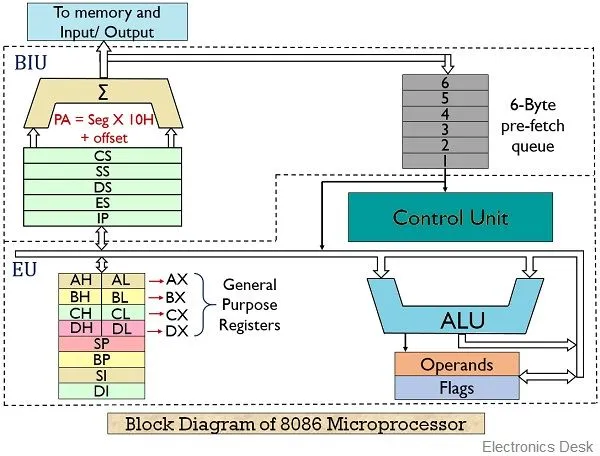
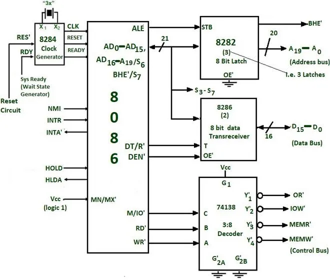
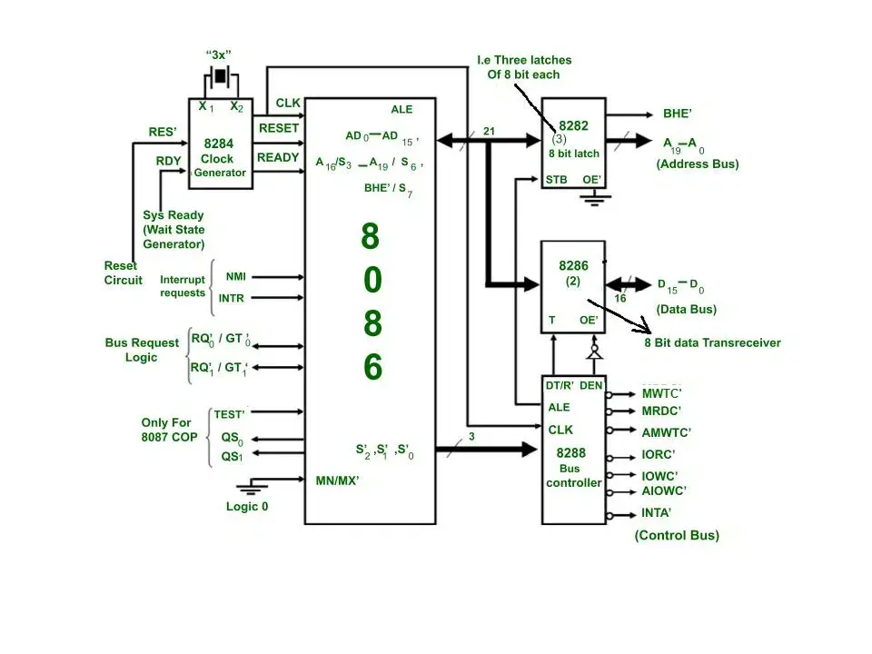
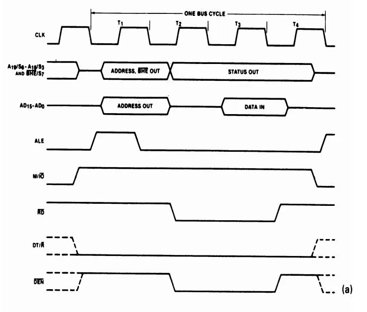
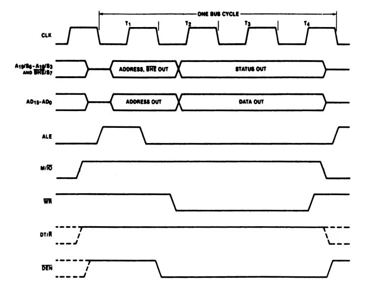
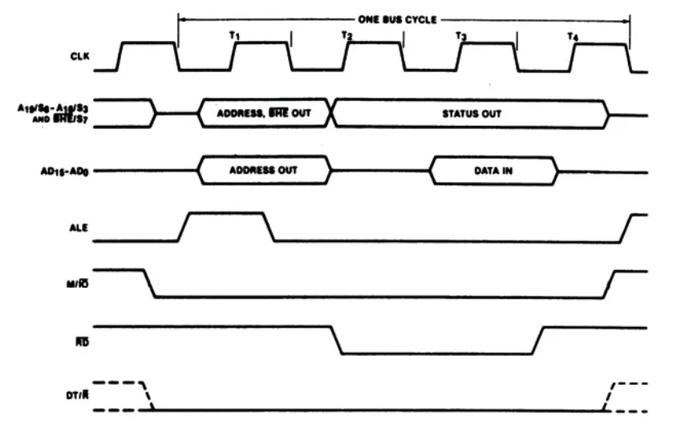
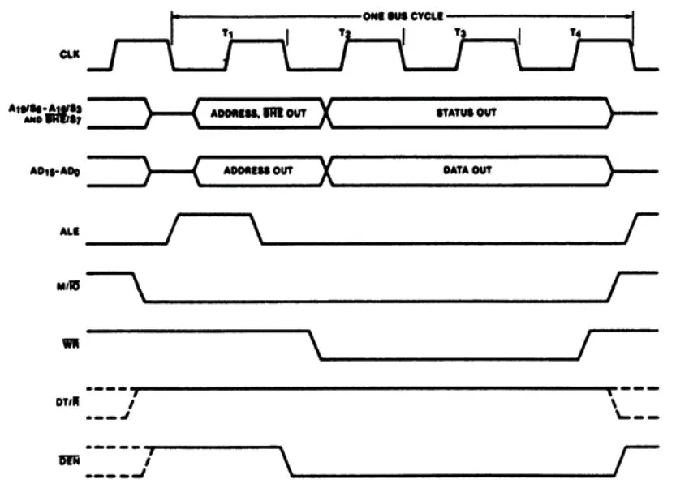
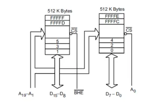
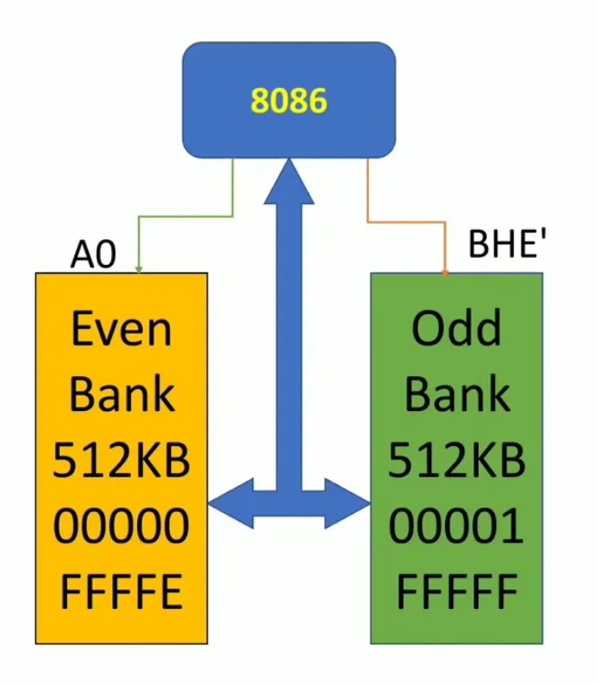

# Unit 1

## 1) Draw and explain Internal Architecture of 8086 microprocessor.

#### Internal Architecture of the 8086 Microprocessor

The **8086 microprocessor** is a 16-bit microprocessor that was designed by Intel and introduced in 1978. Its architecture is characterized by a segmented memory model, which allows for efficient memory management and access. Below is a detailed explanation of the internal architecture of the 8086 microprocessor, including its main components.



#### Components of the 8086 Microprocessor

1. **Bus Interface Unit (BIU)**:
    - The BIU is responsible for all data transfer between the microprocessor and memory or I/O devices.
    - It manages the address bus, data bus, and control signals.
    - The BIU fetches instructions from memory and stores them in an instruction queue (up to six bytes) to allow for pipelining, which improves execution speed.
2. **Execution Unit (EU)**:
    - The EU executes instructions fetched by the BIU.
    - It contains the Arithmetic Logic Unit (ALU), which performs arithmetic and logical operations.
    - The EU also includes various registers that store operands and intermediate results.
3. **Control Unit**:
    - The control unit orchestrates the operations of the microprocessor by directing data flow between the BIU and the EU.
    - It decodes instructions fetched from memory and generates control signals to execute them.
4. **Arithmetic Logic Unit (ALU)**:
    - The ALU is responsible for performing arithmetic operations (addition, subtraction, etc.) and logical operations (AND, OR, NOT).
    - It takes inputs from various registers and produces outputs that are then stored back in registers or memory.
5. **Register File**:
    - The 8086 has several registers used for different purposes:
        - **General-Purpose Registers**: AX (Accumulator), BX (Base), CX (Count), DX (Data) – each can hold 16 bits.
        - **Segment Registers**: CS (Code Segment), DS (Data Segment), SS (Stack Segment), ES (Extra Segment) – used to access different segments of memory.
        - **Pointer Registers**: SP (Stack Pointer), BP (Base Pointer) – used for managing stack operations.
        - **Index Registers**: SI (Source Index), DI (Destination Index) – used for indexed addressing modes.

#### Memory Segmentation

- The 8086 uses a segmented memory model, which divides memory into segments:
    - **Code Segment**: Contains executable code.
    - **Data Segment**: Holds variables and data used by programs.
    - **Stack Segment**: Used for temporary storage of data such as function parameters, return addresses, and local variables.
    - **Extra Segment**: Used for additional data storage.

#### Addressing Mechanism

- The 8086 uses a combination of segment and offset addressing to access memory locations. Each address in memory is specified using a segment address and an offset within that segment:
    - **Physical Address Calculation**:
    $$
    \text{Physical Address} = (\text{Segment} \times 16) + \text{Offset}
    $$
- This allows the microprocessor to access up to **1 MB** of memory space.

#### Conclusion

The internal architecture of the 8086 microprocessor consists of a Bus Interface Unit, Execution Unit, Control Unit, Arithmetic Logic Unit, and various registers. Its segmented memory model enhances flexibility in memory management, allowing efficient access to instructions and data. Understanding this architecture is crucial for programming and interfacing with the 8086 microprocessor effectively.

## 2) Explain the general purpose register of 8086 in detail.

The 8086 microprocessor has four 16-bit general purpose registers that can be used for storing data or addresses. These registers are:

1. **AX (Accumulator Register)**:
    - Can be accessed as a 16-bit register (AX) or as two 8-bit registers (AH and AL)
    - Often used for input/output operations and arithmetic/logic operations
    - Special functions include multiply, divide, and string operations
2. **BX (Base Register)**:
    - Used for base address calculations in memory addressing
    - Can be used as a general purpose register
3. **CX (Count Register)**:
    - Used for loop counting in string operations and shift/rotate instructions
    - Can be used as a general purpose register
4. **DX (Data Register)**:
    - Used for extended precision in multiply and divide operations
    - Used for I/O port addressing
    - Can be used as a general purpose register

Some key points about the general purpose registers:

- They are 16-bit wide, but can be accessed as two 8-bit registers (e.g. AX can be accessed as AH and AL)
- They can be used to hold data or addresses
- They have some dedicated functions (e.g. CX for loop counting) but can also be used generically
- They allow fast access to operands compared to accessing memory directly
- They provide flexibility in addressing modes and operations

So in summary, the general purpose registers are a crucial part of the 8086 architecture, providing fast access to data and addresses, while also supporting some specialized functions. Their flexibility allows efficient use in a wide variety of 8086 assembly language programs.

## 3) Explain Flag Register of 8086 microprocessor.

### Flag Register of the 8086 Microprocessor

The Flag Register, also known as the Status Register, is a crucial component of the 8086 microprocessor. It is a 16-bit register that contains various flags that provide information about the status of the processor and the results of operations. These flags can influence the flow of control in a program, particularly in conditional branching and arithmetic operations.

#### Structure of the Flag Register

The Flag Register is divided into several individual flags, each serving a specific purpose. Here’s a breakdown of the flags in the 8086 Flag Register:

| **Flag** | **Bit Position** | **Description** |
| --- | --- | --- |
| **CF** (Carry Flag) | Bit 0 | Set if there is a carry out from the most significant bit (for addition) or a borrow (for subtraction). |
| **PF** (Parity Flag) | Bit 2 | Set if the number of set bits in the result is even. This flag is used for error checking. |
| **AF** (Auxiliary Carry Flag) | Bit 4 | Set if there is a carry from the lower nibble (4 bits) to the higher nibble during arithmetic operations. |
| **ZF** (Zero Flag) | Bit 6 | Set if the result of an operation is zero. |
| **SF** (Sign Flag) | Bit 7 | Set if the result of an operation is negative (i.e., the most significant bit is 1). |
| **TF** (Trap Flag) | Bit 8 | Used for debugging; if set, it enables single-step mode, allowing the processor to generate an interrupt after each instruction. |
| **IF** (Interrupt Enable Flag) | Bit 9 | Controls the response of the processor to maskable interrupts. If set, the processor will recognize interrupts. |
| **DF** (Direction Flag) | Bit 10 | Determines the direction in which string operations are performed. If set, operations proceed from high memory to low memory. |
| **OF** (Overflow Flag) | Bit 11 | Set if the result of a signed operation is too large to be represented in the destination operand. |

#### Functions of the Flags

1. **Control Flow**: The flags are essential for making decisions in programs. For example, the Zero Flag (ZF) can be used to determine if a loop should continue or if a conditional jump should be taken.
2. **Arithmetic Operations**: The Carry Flag (CF) and Overflow Flag (OF) are particularly important in arithmetic operations, helping to detect overflow conditions and manage multi-byte arithmetic.
3. **Error Checking**: The Parity Flag (PF) can be used for error detection in data transmission, ensuring that the data integrity is maintained.
4. **Interrupt Handling**: The Interrupt Enable Flag (IF) allows the processor to respond to external events, making it a critical component in real-time applications.

#### Example Usage

Consider a simple assembly language snippet that utilizes the flags:

```
MOV AX, 5
ADD AX, 3
JZ ZeroLabel  ; Jump to ZeroLabel if ZF is set

```

In this example, after adding 5 and 3, the Zero Flag (ZF) will not be set (since the result is 8), and the jump will not occur. However, if the operation resulted in zero, the program would jump to `ZeroLabel`.

#### Summary

The Flag Register in the 8086 microprocessor is a powerful tool that provides critical information about the state of the processor and the results of operations. By understanding and utilizing these flags, programmers can control program flow, manage errors, and optimize performance in their applications.

## 4) Explain segment registers of the 8086 processor.

The 8086 microprocessor has four 16-bit segment registers that are used to provide access to 1 MB of memory:

1. **Code Segment (CS)** register:
    - Holds the base address of the current code segment
    - Used to fetch instructions from memory
    - CS is automatically updated by hardware during jumps, calls, and returns
2. **Data Segment (DS)** register:
    - Holds the base address of the current data segment
    - Used to access data operands in memory
    - DS can be explicitly changed by software
3. **Stack Segment (SS)** register:
    - Holds the base address of the current stack segment
    - Used to access the stack in memory
    - SS is automatically updated by hardware during stack operations
4. **Extra Segment (ES)** register:
    - Holds the base address of an extra data segment
    - Used to access additional data in memory
    - ES can be explicitly changed by software

Some key points about the segment registers:

- They provide access to 1 MB of memory by selecting 64 KB segments
- CS, DS, SS, and ES can be loaded with different values to access different memory areas
- CS is updated automatically, while DS, SS, and ES can be changed by software
- Segments can be contiguous, adjacent, disjointed, or overlapping in memory
- The 16-bit value in a segment register is multiplied by 16 to get the actual 20-bit segment base address

So in summary, the segment registers are a crucial part of the 8086 memory architecture, allowing access to 1 MB of memory by selecting different 64 KB segments. The CS register is used for code, DS and ES for data, and SS for the stack.

## 5) Explain the concept of pipelining and its advantages.

### Pipelining in Microprocessors

#### Concept of Pipelining

Pipelining is a technique used in the design of microprocessors that allows multiple instruction phases to overlap in execution, effectively increasing the throughput of the processor. The basic idea is to divide the instruction execution process into several stages, where each stage performs a part of the instruction processing. This approach allows the processor to work on multiple instructions simultaneously, much like an assembly line in a factory.

#### Stages of Pipelining

The typical stages involved in pipelining include:

1. **Fetch**: Retrieve the instruction from memory.
2. **Decode**: Interpret the instruction and prepare the necessary operands.
3. **Execute**: Perform the operation specified by the instruction.
4. **Memory Access**: Read from or write to memory if needed.
5. **Write Back**: Store the result back into the register file.

#### Example of Pipelining

Consider a simple scenario where three instructions are executed sequentially:

- **Instruction 1**: Load data from memory.
- **Instruction 2**: Add two registers.
- **Instruction 3**: Store the result back to memory.

In a non-pipelined architecture, each instruction would complete all stages before the next instruction begins. This means that if each instruction takes 5 cycles to complete, the total time for three instructions would be 15 cycles.

In a pipelined architecture, while Instruction 1 is in the Execute stage, Instruction 2 can be in the Decode stage, and Instruction 3 can be in the Fetch stage. This overlap allows the processor to complete an instruction every cycle after the pipeline is filled. Thus, the total time for the same three instructions could be reduced to 7 cycles (5 cycles to fill the pipeline + 2 cycles for the last two instructions).

#### Advantages of Pipelining

1. **Increased Throughput**: Pipelining allows multiple instructions to be processed simultaneously, significantly increasing the number of instructions completed in a given time frame.
2. **Improved Performance**: By reducing the time taken to execute each instruction, pipelining enhances the overall performance of the microprocessor.
3. **Efficient Resource Utilization**: Pipelining makes better use of the processor's resources by keeping various parts of the CPU busy with different tasks at the same time.
4. **Reduced Latency**: Once the pipeline is filled, the time between the completion of consecutive instructions is reduced, leading to lower latency for instruction execution.
5. **Scalability**: Pipelining can be scaled to accommodate more stages, allowing for even greater performance improvements in advanced microprocessor designs.

#### Challenges of Pipelining

While pipelining offers significant advantages, it also introduces challenges such as:

- **Data Hazards**: Situations where instructions depend on the results of previous instructions can lead to delays.
- **Control Hazards**: Occur when the flow of instruction execution is altered (e.g., due to branching).
- **Structural Hazards**: Arise when hardware resources are insufficient to support all concurrent operations in the pipeline.

#### Conclusion

Pipelining is a fundamental concept in modern microprocessor design that enhances performance by allowing multiple instruction phases to overlap. Its advantages in throughput, performance, and resource utilization make it a key feature in the architecture of contemporary processors, despite the challenges it presents. Understanding pipelining is essential for grasping how modern CPUs achieve high efficiency and speed in executing complex instruction sets.

## 6) Explain memory segmentation in detail. What are the advantages of segmentation?

### Memory Segmentation in the 8086 Microprocessor

Memory segmentation is a method used in the 8086 microprocessor architecture to manage memory efficiently. This approach divides the memory into smaller, manageable segments, allowing for easier access and organization of data and code. The 8086 microprocessor supports a segmented memory model, which allows it to address up to 1 MB of memory using a combination of segment registers and offset addresses.

#### Overview of Segmentation

In the 8086 architecture, memory is divided into segments, each of which can be up to 64 KB in size. The main segments used are:

1. **Code Segment (CS)**:
    - Contains the executable code of the program.
    - The processor fetches instructions from this segment.
2. **Data Segment (DS)**:
    - Used to store data variables that the program uses.
    - This segment is where the program accesses its data.
3. **Stack Segment (SS)**:
    - Used for stack operations, such as function calls and local variables.
    - It stores return addresses, parameters, and local variables.
4. **Extra Segment (ES)**:
    - Provides an additional data segment for storing data.
    - Often used for string operations and other data manipulations.

#### How Segmentation Works

Each segment is identified by a segment register (CS, DS, SS, ES), which holds the base address of the segment. The actual address of a memory location is calculated using the formula:

 $\text{Physical Address} = (\text{Segment} \times 16) + \text{Offset}$ 

- The segment value is multiplied by 16 (or shifted left by 4 bits) to align it to a 16-byte boundary, which is necessary due to the architecture of the 8086.
- The offset is added to this base address to access specific locations within the segment.

#### Example of Memory Segmentation

If the CS register holds the value `0x1234` and the instruction pointer (IP) holds `0x0002`, the physical address from which the instruction will be fetched is calculated as follows:

 $\text{Physical Address} = (0x1234 \times 16) + 0x0002 = 0x12340 + 0x0002 = 0x12342$ 

#### Advantages of Segmentation

1. **Modularity**: Segmentation allows programs to be divided into logical segments, making it easier to manage and organize code and data. This modularity supports better programming practices.
2. **Memory Protection**: Each segment can have different access rights, which helps in protecting data and code from being accessed or modified improperly.
3. **Efficient Use of Memory**: By dividing memory into segments, the 8086 can utilize memory more efficiently, allowing for better organization of data and code.
4. **Simplified Addressing**: With segmentation, programmers can use logical addresses (segment:offset) instead of physical addresses, simplifying the programming model and making it easier to write and maintain code.
5. **Dynamic Memory Allocation**: Segments can be easily modified or reallocated, allowing for dynamic memory management, which is particularly useful in multitasking environments.
6. **Facilitates Sharing**: Segmentation allows different programs to share the same memory space without interfering with each other, as each program can operate in its own segment.

#### Conclusion

Memory segmentation in the 8086 microprocessor is a powerful feature that enhances the efficiency and organization of memory usage. By dividing memory into segments, the architecture allows for modular programming, better memory protection, and simplified addressing, making it easier for programmers to manage and utilize memory effectively. This approach laid the groundwork for more advanced memory management techniques in later microprocessors.

## 7) How is the physical address calculated? Explain with an example.

### Calculation of Physical Address in the 8086 Microprocessor

In the 8086 microprocessor, the physical address is calculated using a combination of segment registers and an offset. This method allows the processor to access a larger memory space than what can be directly addressed by a single 16-bit address. The segmented memory model enables the 8086 to address up to 1 MB of memory (2^20 bytes).

#### Address Calculation Formula

The physical address is computed using the following formula:

$\text{Physical Address} = (\text{Segment} \times 16) + \text{Offset}$

Where:

- **Segment** is the value in one of the segment registers (CS, DS, SS, ES).
- **Offset** is the address within that segment.

#### Example of Physical Address Calculation

Let's go through an example to illustrate how to calculate the physical address.

**Given:**

- **Code Segment (CS)** = `0x1234`
- **Instruction Pointer (IP)** = `0x0002`

**Step 1: Calculate the Segment Base Address**

The segment base address is obtained by multiplying the value in the segment register by 16 (or shifting left by 4 bits).

For the given CS value:

$\text{Base Address} = 0x1234 \times 16 = 0x12340$

**Step 2: Add the Offset**

Now, add the offset (IP value) to the segment base address:

$\text{Physical Address} = 0x12340 + 0x0002 = 0x12342$

#### Summary of the Example

In this example, the physical address calculated is `0x12342`. This address is where the processor will fetch the next instruction to execute.

#### Conclusion

The segmented memory model of the 8086 microprocessor allows for efficient memory management and access to a larger address space. By using segment registers and offsets, the 8086 can calculate physical addresses dynamically, facilitating complex program execution and memory organization. This approach not only enhances the capability of the processor but also simplifies programming by allowing logical organization of code and data.

## 8) Draw and explain architecture of 8086 microprocessor.

### Architecture of the 8086 Microprocessor

The architecture of the 8086 microprocessor is designed to support a segmented memory model, allowing it to address up to 1 MB of memory. The architecture consists of several key components that work together to execute instructions efficiently. Below is a detailed explanation of the architecture along with a simplified diagram.

#### Diagram of the 8086 Microprocessor Architecture

```
+---------------------------------------------------+
|                   8086 Microprocessor             |
|                                                   |
|  +----------------+    +-----------------------+  |
|  |   Bus Interface |    |   Execution Unit      | |
|  |      Unit      |    |                       |  |
|  +----------------+    +-----------------------+  |
|          |                       |                |
|          |                       |                |
|  +-------+-------+       +-------+-------+        |
|  |   Instruction  |       |   General    |        |
|  |      Queue     |       |   Purpose    |        |
|  |                |       |   Registers  |        |
|  +----------------+       +-------+------+        |
|          |                       |                |
|          |                       |                |
|  +-------+-------+       +-------+-------+        |
|  |   Segment      |       |   ALU         |       |
|  |   Registers    |       |               |       |
|  +----------------+       +---------------+       |
|          |                                        |
|          |                                        |
|  +-------+-------+                                |
|  |   Control Unit |                               |
|  +----------------+                               |
+---------------------------------------------------+

```

#### Components of the 8086 Architecture

1. **Bus Interface Unit (BIU)**:
    - Responsible for all data and address bus operations.
    - It fetches instructions from memory and handles data transfers.
    - Contains a 6-byte instruction queue that allows pre-fetching of instructions, improving execution speed by overlapping instruction fetch with execution.
2. **Execution Unit (EU)**:
    - Responsible for decoding and executing instructions.
    - Contains the Arithmetic Logic Unit (ALU), which performs arithmetic and logical operations.
    - Works with general-purpose registers and manages the execution of instructions.
3. **General Purpose Registers**:
    - The 8086 has several 16-bit general-purpose registers, including:
        - **AX** (Accumulator Register)
        - **BX** (Base Register)
        - **CX** (Count Register)
        - **DX** (Data Register)
    - These registers can also be accessed as 8-bit registers (e.g., AL, AH).
4. **Segment Registers**:
    - There are four segment registers that define the starting addresses of different memory segments:
        - **CS (Code Segment)**: Points to the segment containing the currently executing code.
        - **DS (Data Segment)**: Points to the segment where data is stored.
        - **SS (Stack Segment)**: Points to the segment used for the stack.
        - **ES (Extra Segment)**: Used for additional data storage.
5. **Instruction Queue**:
    - A FIFO (First In, First Out) buffer that holds the pre-fetched instructions from memory, allowing the processor to execute instructions without waiting for the next instruction fetch.
6. **Control Unit**:
    - Manages the operations of the microprocessor by generating control signals.
    - Coordinates the activities of the BIU and EU, ensuring that instructions are executed in the correct order.

#### How the Architecture Works

1. **Instruction Fetch**: The BIU fetches instructions from memory and stores them in the instruction queue.
2. **Instruction Decode**: The EU decodes the instructions from the queue and prepares to execute them.
3. **Execution**: The ALU performs the necessary calculations or operations based on the decoded instructions, using the general-purpose registers and segment registers as needed.
4. **Result Storage**: The results of operations are stored back in the registers or written to memory as required.

#### Advantages of the 8086 Architecture

- **Segmentation**: The segmented memory model allows for efficient memory management and organization, enabling programs to be modular and easier to manage.
- **Pipelining**: The instruction queue allows for instruction pre-fetching, which enhances performance by allowing overlapping of instruction fetch and execution.
- **Versatility**: The architecture supports various data types and operations, making it suitable for a wide range of applications.

#### Conclusion

The architecture of the 8086 microprocessor is a sophisticated design that combines various components to facilitate efficient instruction processing and memory management. Its segmented memory model, instruction queue, and control mechanisms make it a powerful processor for its time, laying the groundwork for subsequent generations of microprocessors. Understanding this architecture is essential for grasping the fundamentals of microprocessor design and operation.

## 9) Explain the function of the following pins of 8086 microprocessor:
- AD0 – AD15
- A19/S6, A18/S5, A17/S4, A16/S3
- BHE / S7
- RD (Read)
- READY
- RESET
- INTR
- NMI
- TEST
- CLK
- MN / MX
- DEN
- M / IO
- HOLD
- RQ/GT1 and RQ/GT0

Here is an explanation of the key pins and their functions on the 8086 microprocessor:

### Address/Data Bus (AD0 - AD15)

- Multiplexed address and data bus
- Provides 16 bits of address during T1 state of bus cycle
- Provides 16 bits of data during T2, T3, Tw and T4 states of bus cycle

### High Order Address Bus (A19/S6, A18/S5, A17/S4, A16/S3)

- Provides upper 4 bits of 20-bit address when ALE is high
- Provides status information when ALE is low:
    - A16/S3: M/IO## status
    - A17/S4: IO/M## status
    - A18/S5: DT/R## status
    - A19/S6: DEN status

### Bus High Enable (BHE / S7)

- Indicates a byte transfer on the higher order (D8-D15) data bus
- Combines with A0 to define which byte(s) of the memory or I/O byte is accessed:
    - A0 = 0, BHE## = 1 → access D8-D15 (upper byte)
    - A0 = 1, BHE## = 0 → access D0-D7 (lower byte)
    - A0 = 0, BHE## = 0 → access D0-D15 (word)

### Read (RD#)

- Indicates that the processor is performing a memory or I/O read operation

### Ready

- Indicates that the current bus cycle can be completed with zero wait states
- Used to synchronize fast processors with slow memories or I/O

### Reset

- Allows the processor to be initialized to a known state
- Causes the processor to terminate operations and enter a wait state

### Interrupt Request (INTR)

- Used to request a maskable interrupt
- Processor responds at the end of the current instruction if interrupt flag is enabled

### Non-Maskable Interrupt (NMI)

- Requests a non-maskable interrupt
- Causes the processor to immediately terminate the current instruction stream

### Test (TEST)

- Allows the processor to synchronize with external events
- Causes the processor to enter the "wait for TEST" state until the TEST pin goes inactive

### Clock (CLK)

- Provides the fundamental timing for the processor and bus controller

### Minimum/Maximum (MN/MX)

- Selects minimum (MN) or maximum (MX) mode
- Minimum mode uses external bus controller
- Maximum mode uses internal bus controller

### Data Enable (DEN)

- Indicates that the processor is performing a data transfer
- Enables transceivers for data bus

### Memory/IO (M/IO#)

- Distinguishes memory access cycles from I/O access cycles
- Indicates a memory access cycle when high, I/O access cycle when low

### Hold

- Allows a DMA controller to request control of the address/data bus
- Causes the processor to relinquish the bus at the end of the current bus cycle

### Request/Grant (RQ/GT1, RQ/GT0)

- Used to control access to the local bus in multiprocessor configurations
- RQ/GT0 is used for DMA transfers
- RQ/GT1 is used for other processors

So in summary, these pins provide the necessary signals for the 8086 to interface with memory, I/O devices, interrupts, DMA controllers, and other processors in a microcomputer system. The multiplexed address/data bus, status signals, and control signals allow the 8086 to access memory and I/O efficiently.

## 10) What is pipelining concept? What is the Instruction queue?

Pipelining is a technique used in microprocessor design to increase throughput by allowing multiple instructions to be executed concurrently. The basic idea is to divide the instruction execution process into several stages, with each stage performing a part of the instruction processing.

The key components related to pipelining in the 8088/8086 architecture are:

1. **Bus Interface Unit (BIU)**: Responsible for fetching instructions from memory and handling data transfers over the system bus. It contains an instruction queue.
2. **Instruction Queue**: A FIFO buffer that holds pre-fetched instructions from memory. The BIU can prefetch up to 4 bytes (6 bytes for 8086) of instruction code into this queue whenever there is room and the Execution Unit is not requesting data from memory.
3. **Execution Unit (EU)**: Decodes and executes instructions. It reads instructions from the output of the instruction queue.

The pipelining works as follows:

- The BIU fetches instructions from memory and stores them in the instruction queue.
- The EU reads instructions from the output of the queue, decodes them, and executes them.
- While the EU is executing one instruction, the BIU can prefetch the next instructions into the queue.

This allows instruction fetch and execution to overlap, increasing throughput. If the queue is full and the EU is not requesting memory access, the BIU can enter an idle state without needing to fetch more instructions.

So in summary, the instruction queue enables pipelining by allowing the BIU to prefetch instructions in parallel with the EU executing instructions from the queue. This overlapping of fetch and execute stages is a key performance enhancement of the 8088/8086 architecture.

## 11) Explain Programming model of 8086 microprocessor.

The programming model of the 8086 microprocessor consists of various registers and memory organization that allow the programmer to interact with the processor. Here are the key components of the 8086 programming model:

### Registers

1. **General Purpose Registers**:
    - AX (Accumulator Register)
    - BX (Base Register)
    - CX (Count Register)
    - DX (Data Register)
    - These 16-bit registers can be accessed as 8-bit registers (AH/AL, BH/BL, CH/CL, DH/DL)
2. **Pointer and Index Registers**:
    - SP (Stack Pointer)
    - BP (Base Pointer)
    - SI (Source Index)
    - DI (Destination Index)
3. **Segment Registers**:
    - CS (Code Segment)
    - DS (Data Segment)
    - SS (Stack Segment)
    - ES (Extra Segment)
    - These 16-bit registers hold the base addresses of memory segments
4. **Instruction Pointer (IP)**:
    - 16-bit register that points to the next instruction in the code segment
5. **Flags Register**:
    - Contains status and control flags (e.g. carry, zero, sign, overflow, direction, interrupt enable)

### Memory Organization

- 1 MB address space (20-bit addresses)
- Memory is byte-addressable, but can be accessed as 16-bit words
- Memory is divided into 64KB segments identified by segment registers
- Segments can be contiguous, adjacent, disjointed or overlapping

### Data Types

- Unsigned and signed integers (byte, word)
- Binary-coded decimal (BCD)
- Strings
- Packed and unpacked BCD

### Addressing Modes

- Register
- Immediate
- Direct memory
- Register indirect
- Based
- Indexed
- Based indexed

The programming model allows the programmer to access memory, perform arithmetic/logic operations, control program flow, and interface with I/O using assembly language instructions. The combination of registers, memory organization, data types and addressing modes provides a powerful set of tools for low-level programming of the 8086 microprocessor.

## 12) Explain the function of Instruction pointer and stack pointer register.

The **Instruction Pointer (IP)** and **Stack Pointer (SP)** are two critical registers in the 8086 microprocessor architecture, each serving distinct functions in program execution and memory management.

### Instruction Pointer (IP)

#### Function

- The Instruction Pointer (IP) is a 16-bit register that holds the offset address of the next instruction to be executed within the current code segment (CS).
- It acts similarly to a program counter in other architectures, keeping track of where the processor is in the instruction sequence.

#### Operation

- The IP is automatically updated by the processor as instructions are fetched. When an instruction is executed, the IP is incremented to point to the next instruction.
- The actual physical address for fetching the instruction is computed using the combination of the Code Segment (CS) and the IP, following the formula:
    
    
    $\text{Physical Address} = (\text{CS} \times 16) + \text{IP}$
    

#### Example

If the CS register holds `0x1234` and the IP holds `0x0002`, the physical address for the next instruction would be calculated as follows:

$\text{Physical Address} = (0x1234 \times 16) + 0x0002 = 0x12340 + 0x0002 = 0x12342$

#### Importance

- The IP is crucial for the sequential execution of instructions and for branching operations, such as jumps and calls, which modify its value to change the flow of execution.

### Stack Pointer (SP)

#### Function

- The Stack Pointer (SP) is also a 16-bit register that points to the top of the stack in the current stack segment (SS).
- It keeps track of the last used location in the stack, which is a special area of memory used for temporary storage of data, such as function parameters, return addresses, and local variables.

#### Operation

- The SP is automatically adjusted during push and pop operations. When data is pushed onto the stack, SP is decremented (since the stack grows downward), and when data is popped off, SP is incremented.
- The effective address of the stack is calculated using the formula:
    
    
    $\text{Physical Address} = (\text{SS} \times 16) + \text{SP}$
    

#### Example

If the SS register holds `0x2000` and the SP holds `0x0010`, the physical address for the top of the stack would be:

$\text{Physical Address} = (0x2000 \times 16) + 0x0010 = 0x20000 + 0x0010 = 0x20010$

#### Importance

- The SP is essential for function calls and returns, allowing the processor to manage nested function calls and local variables efficiently.
- It also plays a critical role in maintaining the execution context during interrupts and exceptions.

### Summary

- **Instruction Pointer (IP)**: Holds the offset of the next instruction to be executed within the current code segment. It is crucial for the sequential execution of instructions and for controlling the flow of a program.
- **Stack Pointer (SP)**: Points to the top of the stack in the current stack segment. It is vital for managing temporary data storage during program execution, particularly for function calls and local variable management.

Both registers are fundamental to the operation of the 8086 microprocessor, enabling structured program execution and efficient memory management.

## 13) Describe Pointer & Index Registers.

The **Pointer and Index Registers** in the 8086 microprocessor are essential components that facilitate efficient memory addressing and data manipulation. They are used to store offset addresses, which represent the displacement of a storage location in memory relative to a segment base address. Here’s a detailed explanation of these registers:

### Pointer Registers

#### 1. Stack Pointer (SP)

- **Function**: The Stack Pointer (SP) is a 16-bit register that points to the top of the stack in the current stack segment (SS).
- **Operation**:
    - SP is automatically adjusted during stack operations. When data is pushed onto the stack, SP is decremented, and when data is popped off, SP is incremented.
    - The effective address of the stack is calculated as:
        
        
        $\text{Physical Address} = (\text{SS} \times 16) + \text{SP}$
        
- **Importance**:
    - SP is crucial for managing function calls, local variables, and return addresses in a program. It allows the processor to maintain the execution context during subroutine calls and interrupts.

#### 2. Base Pointer (BP)

- **Function**: The Base Pointer (BP) is also a 16-bit register that is primarily used to access parameters and local variables in the stack segment.
- **Operation**:
    - BP can be used as an offset from the stack segment (SS) to reference data stored in the stack. It is particularly useful for accessing parameters passed to a subroutine.
    - The effective address is calculated similarly to SP:
        
        
        $\text{Physical Address} = (\text{SS} \times 16) + \text{BP}$
        
- **Importance**:
    - BP provides a stable reference point for accessing data within the stack, especially in complex programs with multiple nested subroutine calls.

### Index Registers

#### 1. Source Index (SI)

- **Function**: The Source Index (SI) is a 16-bit register used primarily for indexed addressing modes, particularly in string operations.
- **Operation**:
    - SI holds the offset address of the source data in the data segment (DS) or extra segment (ES) during data transfer operations.
    - When performing operations such as string copying or comparison, the value in SI is automatically combined with the segment register to form the effective address.

#### 2. Destination Index (DI)

- **Function**: The Destination Index (DI) is a 16-bit register used similarly to SI, but for the destination address in memory.
- **Operation**:
    - DI holds the offset address of the destination data in the data segment (DS) or extra segment (ES).
    - Like SI, DI is used in string operations to specify where the data should be written.

### Summary of Functions

| **Register** | **Type** | **Primary Use** |
| --- | --- | --- |
| SP | Pointer Register | Points to the top of the stack; used for stack operations |
| BP | Pointer Register | Accesses parameters and local variables in the stack |
| SI | Index Register | Holds the source address for data operations |
| DI | Index Register | Holds the destination address for data operations |

### Conclusion

The Pointer and Index Registers in the 8086 microprocessor play vital roles in memory addressing and data manipulation. The Stack Pointer (SP) and Base Pointer (BP) are essential for managing the stack and function calls, while the Source Index (SI) and Destination Index (DI) facilitate efficient data transfer and manipulation in memory. Understanding these registers is crucial for programming and optimizing performance in assembly language and low-level applications.

## 14) How many memory segments are there in 8086 processor? Explain them in detail.

The 8086 microprocessor supports a segmented memory model, which divides memory into distinct segments, allowing for efficient organization and access of data and instructions. There are **four primary memory segments** in the 8086 architecture:

### 1. Code Segment (CS)

- **Description**: The Code Segment holds the executable code of a program. It contains the instructions that the CPU will execute.
- **Size**: Each code segment can be a maximum of 64 KB.
- **Access**: The CS register points to the base address of the code segment, and the Instruction Pointer (IP) register indicates the offset of the next instruction within that segment.
- **Purpose**: This segmentation allows for better organization of code, enabling the program to be divided into logical sections, which can enhance maintainability and readability.

### 2. Data Segment (DS)

- **Description**: The Data Segment is used to store the variables and data that the program manipulates. This includes constants, arrays, and other data types.
- **Size**: Like the code segment, the data segment can also be a maximum of 64 KB.
- **Access**: The DS register points to the base address of the data segment. The offset can be specified in instructions to access specific data items.
- **Purpose**: By separating data from code, the microprocessor can manage data more efficiently, allowing for easier data manipulation and access.

### 3. Stack Segment (SS)

- **Description**: The Stack Segment is used for stack operations, which include function calls, local variables, and return addresses. The stack grows downwards in memory.
- **Size**: The stack segment can also be a maximum of 64 KB.
- **Access**: The SS register points to the base address of the stack segment, while the Stack Pointer (SP) register points to the top of the stack.
- **Purpose**: The stack is essential for managing function calls and local data, allowing for nested calls and recursion. It also helps in handling interrupts and exceptions.

### 4. Extra Segment (ES)

- **Description**: The Extra Segment can be used as an additional data segment for data storage. It is often utilized for string operations and additional data manipulation.
- **Size**: Like the other segments, the extra segment can also be a maximum of 64 KB.
- **Access**: The ES register points to the base address of the extra segment and can be used in conjunction with the DS register for more complex data structures.
- **Purpose**: The extra segment provides flexibility in data handling, allowing for more complex data structures and operations without interfering with the primary data segment.

### Summary of Memory Segments

| **Segment** | **Register** | **Purpose** | **Size** |
| --- | --- | --- | --- |
| Code Segment | CS | Holds executable code | 64 KB |
| Data Segment | DS | Stores program variables and data | 64 KB |
| Stack Segment | SS | Manages stack operations (function calls, etc.) | 64 KB |
| Extra Segment | ES | Provides additional space for data | 64 KB |

### Advantages of Segmentation

- **Modularity**: Segmentation allows programs to be organized into logical sections, improving readability and maintainability.
- **Memory Protection**: Different segments can have different access rights, enhancing security and stability.
- **Efficient Use of Memory**: Segments can be loaded and unloaded independently, allowing for better memory management.
- **Dynamic Memory Allocation**: Segments can be resized or moved in memory, enabling more flexible memory usage.

In conclusion, the segmented memory model of the 8086 microprocessor enhances the efficiency and organization of memory usage, allowing for better program structure and management. This model is fundamental to the operation of the 8086 and its ability to handle complex applications effectively.

## 15) What is physical and logical (Effective) address in the 8086 Processor? How is it calculated? Explain with an example.

In the 8086 microprocessor architecture, the concepts of **physical address** and **logical (effective) address** are fundamental to understanding how the CPU accesses memory. Here’s a detailed explanation of both types of addresses, including how they are calculated, along with an example.

### Physical Address

#### Definition

The **physical address** is the actual address in the memory hardware where data or instructions are stored. It is a 20-bit address that allows the 8086 processor to access up to 1 MB (2^20 bytes) of memory.

#### Calculation

The physical address is calculated using the formula:

$\text{Physical Address} = (\text{Segment} \times 16) + \text{Offset}$

- **Segment**: This is the value from one of the segment registers (CS, DS, SS, or ES).
- **Offset**: This is the offset address within that segment.

### Logical (Effective) Address

#### Definition

The **logical address** (also known as the effective address) consists of two parts: the **segment** and the **offset**. It is used by the programmer to specify where in memory an operation should take place. The logical address does not directly correspond to a physical location in memory until it is translated by the processor.

#### Structure

- **Segment**: A 16-bit value that specifies the starting point of a segment in memory.
- **Offset**: A 16-bit value that specifies the distance from the segment base.

#### Example of Address Calculation

Let’s go through an example to illustrate the calculation of both physical and logical addresses.

**Given:**

- **Segment Register (CS)**: `0x1234` (for the Code Segment)
- **Offset (IP)**: `0x0002` (Instruction Pointer)

#### Step 1: Calculate the Physical Address

Using the formula for calculating the physical address:

1. **Convert the Segment to Physical Address**:
    - Multiply the segment value by 16 (or shift left by 4 bits):
    
    $\text{Segment Base Address} = 0x1234 \times 16 = 0x12340$
2. **Add the Offset**:
    - Now, add the offset (IP):
    
    $\text{Physical Address} = 0x12340 + 0x0002 = 0x12342$

#### Summary of the Example

- **Logical Address**:
    - Segment: `0x1234`
    - Offset: `0x0002`
- **Physical Address**: `0x12342`

#### Conclusion

In summary, the **logical address** in the 8086 microprocessor is a combination of a segment and an offset, which allows for a flexible and organized way to access memory. The **physical address** is the actual address used by the hardware to access memory locations. The translation from logical to physical address is a key feature of the segmented memory model utilized by the 8086 architecture, enabling efficient memory management and access.

## 16) The contents of the following registers are:
- CS = 1111 H 
- DS = 3333 H
- SS = 2526 H
- IP = 1232 H
- SP = 1100 H
- DI = 0020 H
Calculate the corresponding physical addresses for the address bytes in CS, DS, and SS.

To calculate the physical addresses corresponding to the address bytes in CS, DS, and SS, we need to use the formula:

Physical Address = (Segment Register × 16) + Offset

### Code Segment (CS)

CS = 1111H
Offset = 0 (since we are calculating the base address of the segment)

Physical Address = (CS × 16) + 0
= (1111H × 16) + 0
= 11110H + 0
= 11110H

### Data Segment (DS)

DS = 3333H
Offset = 0 (since we are calculating the base address of the segment)

Physical Address = (DS × 16) + 0
= (3333H × 16) + 0
= 33330H + 0
= 33330H

### Stack Segment (SS)

SS = 2526H
Offset = 0 (since we are calculating the base address of the segment)

Physical Address = (SS × 16) + 0
= (2526H × 16) + 0
= 25260H + 0
= 25260H

Therefore, the physical addresses corresponding to the address bytes in CS, DS, and SS are:

- CS: 11110H
- DS: 33330H
- SS: 25260H

## 17) Discuss Demultiplexing of buses with a necessary diagram.

### Demultiplexing of Buses

#### Overview

Demultiplexing is a technique used in digital circuits to route signals from a single source to multiple destinations. In the context of microprocessors, demultiplexing is often applied to address and data buses, allowing a single bus to be shared among multiple devices or memory locations. This is particularly important in microprocessors like the 8086, where the address and data lines are multiplexed (combined) to save physical space and reduce the number of pins required.

#### Concept of Demultiplexing

In a multiplexed bus system, multiple signals share the same physical lines. For example, the 8086 microprocessor uses a multiplexed address/data bus (AD0-AD15) where the lower 16 bits of the address and the data are transmitted over the same lines at different times. To separate these signals and direct them to the appropriate destinations, demultiplexing is required.

#### Demultiplexer Functionality

A demultiplexer (demux) takes a single input signal and routes it to one of several output lines based on the values of select lines. In the 8086 architecture, demultiplexing is used to separate the address and data signals for proper communication with memory and I/O devices.

#### Diagram of Demultiplexing

Here’s a simplified diagram illustrating the concept of demultiplexing in the context of a microprocessor:

```
                +----------------+
                |                |
                | Microprocessor |
                |                |
                +------|---------+
                       |
                 AD0 - AD15 (Multiplexed Bus)
                       |
                +------|---------+
                |                |
                | Demultiplexer  |
                |                |
                +------+----------+
                       |
         +-------------+-------------+
         |             |             |
      Memory        I/O Device 1   I/O Device 2

```

#### Explanation of the Diagram

1. **Microprocessor**: The central processing unit (CPU) that generates multiplexed address and data signals on the AD0-AD15 lines.
2. **Multiplexed Bus (AD0 - AD15)**: A single bus that carries both address and data signals. The bus can either carry an address or data, but not both at the same time.
3. **Demultiplexer**: This component takes the multiplexed signals from the bus and routes them to the appropriate destination based on control signals. The demultiplexer uses select lines to determine which output line to activate.
4. **Memory and I/O Devices**: The destinations for the routed signals. The demultiplexer directs the signals to either memory or various I/O devices based on the current operation being performed by the microprocessor.

#### Advantages of Demultiplexing

1. **Reduced Pin Count**: By multiplexing address and data lines, the number of physical pins required on the microprocessor is reduced, which is beneficial for chip design.
2. **Efficient Use of Bus**: Demultiplexing allows the bus to be used more efficiently by enabling the same lines to carry different types of information at different times.
3. **Flexibility**: Multiple devices can share the same bus, allowing for easier expansion of the system without requiring additional bus lines.
4. **Cost-Effectiveness**: Fewer physical connections can lead to lower manufacturing costs and simpler circuit designs.

#### Conclusion

Demultiplexing is a crucial technique in microprocessor design, particularly for systems like the 8086 that utilize multiplexed address/data buses. By efficiently routing signals to multiple destinations, demultiplexing enhances the functionality of the microprocessor while minimizing hardware complexity. Understanding this concept is essential for grasping how microprocessors communicate with memory and I/O devices in a compact and efficient manner.

## 18) Draw and explain the minimum mode diagram of 8086.



### Minimum Mode Diagram of the 8086 Microprocessor

#### Overview

The 8086 microprocessor can operate in two modes: minimum mode and maximum mode. The **minimum mode** is designed for systems where a single processor controls all bus operations. In this mode, the 8086 microprocessor directly controls all the buses and manages all the system operations without needing additional control logic.

#### Minimum Mode Operation

In minimum mode, the 8086 microprocessor generates all the necessary control signals for memory and I/O operations. This mode is suitable for simpler, single-processor systems. The control signals generated by the 8086 in minimum mode are used to read and write data to memory and I/O devices.

#### Key Components of the Minimum Mode Diagram

1. **8086 CPU**: The central processing unit that executes instructions and controls the overall operation of the system.
2. **Control Signals**: The 8086 generates control signals for memory and I/O operations. This includes signals for reading (RD#), writing (WR#), memory access (MEMR#), and I/O access (IO/M#).
3. **Address Bus**: The 20-bit address bus is used to specify the address of the memory or I/O device being accessed. The address is generated by the CPU based on the segment registers and the instruction pointer.
4. **Data Bus**: The 16-bit data bus is used for transferring data between the CPU, memory, and I/O devices. It carries data to and from the specified address.
5. **Memory (RAM/ROM)**: The memory unit stores the program code and data. The 8086 can access up to 1 MB of memory.
6. **I/O Devices**: The input/output devices are connected to the data bus and can be accessed by the CPU through the control signals.

#### Control Signals in Minimum Mode

In minimum mode, the following control signals are generated by the 8086 microprocessor:

- **ALE (Address Latch Enable)**: Indicates that the address is valid and should be latched by external circuitry.
- **DEN (Data Enable)**: Indicates that valid data is present on the data bus.
- **DT/R (Data Transmit/Receive)**: Indicates the direction of data transfer (whether data is being sent to or received from memory/I/O).
- **MEMR (Memory Read)**: Indicates that a read operation is being performed on memory.
- **MEMW (Memory Write)**: Indicates that a write operation is being performed on memory.
- **IOR (I/O Read)**: Indicates that a read operation is being performed on an I/O device.
- **IOW (I/O Write)**: Indicates that a write operation is being performed on an I/O device.

#### Conclusion

The minimum mode of the 8086 microprocessor is designed for simple, single-processor systems where the CPU directly controls all bus operations. The minimum mode diagram illustrates how the 8086 interacts with memory and I/O devices using control signals generated by the CPU. Understanding this mode is essential for designing and implementing systems based on the 8086 architecture.

## 19) Draw and explain the maximum mode diagram of 8086.



### Maximum Mode Diagram of the 8086 Microprocessor

#### Overview

The **maximum mode** of the 8086 microprocessor is designed for systems that use multiple processors or coprocessors, such as the 8087 Math Coprocessor or the 8089 I/O Processor. In this mode, the 8086 does not generate control signals directly; instead, it relies on an external bus controller (the 8288 Bus Controller) to manage the bus operations. This allows for more complex system configurations and better resource sharing among processors.

#### Maximum Mode Operation

In maximum mode, the 8086 microprocessor operates in conjunction with the 8288 Bus Controller, which generates the necessary control signals for memory and I/O operations based on signals from the 8086. This configuration allows for a more flexible and scalable system architecture.

#### Key Components of the Maximum Mode Diagram

1. **8086 CPU**: The central processing unit that executes instructions and manages system operations.
2. **Control Signals**: In maximum mode, the 8086 generates specific signals (such as QS1, QS0, S0, S1, S2) that inform the 8288 Bus Controller about the current operation being performed (read, write, interrupt acknowledge, etc.).
3. **Address Bus**: The 20-bit address bus is used to specify the address of the memory or I/O device being accessed. The address is generated by the CPU based on the segment registers and the instruction pointer.
4. **Data Bus**: The 16-bit data bus is used for transferring data between the CPU, memory, and I/O devices. It carries data to and from the specified address.
5. **Memory (RAM/ROM)**: The memory unit stores the program code and data. The 8086 can access up to 1 MB of memory.
6. **I/O Devices**: The input/output devices are connected to the data bus and can be accessed by the CPU through the control signals.
7. **8288 Bus Controller**: This external controller interprets the control signals from the 8086 and generates the necessary control signals for memory and I/O operations. It coordinates the data transfers and manages the bus arbitration in a multiprocessor environment.

#### Control Signals in Maximum Mode

In maximum mode, the following control signals are generated by the 8086 and interpreted by the 8288 Bus Controller:

- **QS1 and QS0 (Queue Status)**: Indicate the status of the instruction queue (whether the queue is empty, full, or partially filled).
- **S0, S1, S2 (Status Signals)**: These signals indicate the type of operation being performed (memory read, memory write, I/O read, I/O write, interrupt acknowledge, etc.).
- **DEN (Data Enable)**: Indicates that valid data is present on the data bus.
- **ALE (Address Latch Enable)**: Indicates that the address is valid and should be latched by external circuitry.

#### Conclusion

The maximum mode of the 8086 microprocessor is designed for complex systems that utilize multiple processors. The diagram illustrates how the 8086 interacts with memory, I/O devices, and the 8288 Bus Controller to manage bus operations. Understanding this mode is essential for designing and implementing systems that require multiple processors or coprocessors, enabling better performance and resource sharing in advanced computing environments.

## 20) Draw and explain the timing diagram of Memory Read cycle for minimum mode interface.



The timing diagram of the **Memory Read cycle** for the **8086 microprocessor in minimum mode** describes the sequence of control and address/data signals when the processor reads data from memory. Here's the breakdown:

#### Steps in the Memory Read Cycle:

1. **T1 (Clock Cycle 1)**:
    - **Address Latch Enable (ALE)**: The ALE signal goes high to indicate that a valid address is present on the address bus.
    - **Address Bus (A15–A0)**: The 8086 places the lower 16 bits of the address on the address bus.
    - **Address/Data Bus (AD15-AD0)**: The multiplexed address/data bus contains the lower 16 bits of the address during this cycle.
2. **T2 (Clock Cycle 2)**:
    - **Address Bus (A15–A0)**: The address remains stable on the bus.
    - **Read Signal (RD)**: The RD signal goes low, indicating the start of the read operation.
    - **Data Bus (D15–D0)**: The data lines are now prepared to receive data from memory.
3. **T3 (Clock Cycle 3)**:
    - **Wait States (optional)**: If memory is slow, wait states (Tw) may be inserted to give memory more time to respond.
    - **Valid Data**: By the end of T3, the data from memory should be available on the data bus (D15–D0).
4. **T4 (Clock Cycle 4)**:
    - **Read Complete**: The RD signal goes high again, indicating the end of the read operation.
    - **Data Bus (D15–D0)**: The processor reads the data from the data bus and latches it internally.
    - **Bus Idle**: The bus becomes idle, and the data is latched.

#### Signals involved:

- **ALE**: Address Latch Enable; goes high during T1 to latch the address.
- **RD**: Read control signal; goes low to initiate the read operation.
- **Address/Data Bus (AD15-AD0)**: Multiplexed to carry both address and data.
- **Memory Address (A15–A0)**: Carries the memory address to be read.

This cycle ensures that data from memory is read in sync with the clock and timing signals of the 8086 microprocessor in minimum mode.

## 21) Draw and explain the timing diagram of Memory Write cycle for minimum mode interface.



The **Memory Write cycle** for the **8086 microprocessor in minimum mode** describes the sequence of signals used when the processor writes data to memory. Here's an explanation of the timing diagram:

#### Steps in the Memory Write Cycle:

1. **T1 (Clock Cycle 1)**:
    - **Address Latch Enable (ALE)**: The ALE signal goes high, indicating that a valid address is available on the multiplexed address/data bus (AD15–AD0).
    - **Address Bus (A15–A0)**: During this time, the lower 16 bits of the memory address are placed on the address/data bus (AD15–AD0).
    - **Address/Data Bus (AD15–AD0)**: The 8086 places the lower 16 bits of the memory address on the bus.
2. **T2 (Clock Cycle 2)**:
    - **ALE**: ALE goes low after the address is latched.
    - **Address Bus (A15–A0)**: The address remains on the bus.
    - **Write Signal (WR)**: The WR signal goes low, indicating the start of the write cycle.
    - **Data Bus (D15–D0)**: The 8086 places the data to be written on the data bus (D15–D0).
3. **T3 (Clock Cycle 3)**:
    - **Wait States (optional)**: If the memory is slower, wait states (Tw) can be inserted here to give it more time to accept the data.
    - **Data Bus (D15–D0)**: The data remains stable on the data bus and is written to the memory location.
4. **T4 (Clock Cycle 4)**:
    - **Write Complete**: The WR signal goes high, indicating the end of the write operation.
    - **Data Bus (D15–D0)**: The data bus is released and goes into a high-impedance state.

#### Signals involved:

- **ALE**: Address Latch Enable; goes high in T1 to indicate a valid address is on the bus.
- **WR**: Write control signal; goes low to indicate the start of the write operation.
- **Address/Data Bus (AD15–AD0)**: Multiplexed to carry the lower 16 bits of the address during T1 and data during T2 and T3.
- **Address Bus (A15–A0)**: Carries the memory address.

The memory write cycle allows the processor to output data onto the bus, stabilize it, and store it in the specified memory location.

## 22) Draw and explain the timing diagram of I/O Read cycle for minimum mode interface.



The **I/O Read cycle** for the **8086 microprocessor in minimum mode** describes the sequence of signals when the processor reads data from an I/O port. The 8086 uses a similar process to the memory read cycle but interacts with I/O devices instead of memory.

#### Steps in the I/O Read Cycle:

1. **T1 (Clock Cycle 1)**:
    - **Address Latch Enable (ALE)**: The ALE signal goes high to indicate that a valid I/O address is present on the multiplexed address/data bus (AD15–AD0).
    - **Address Bus (A7–A0)**: The lower 8 bits of the I/O address are placed on the multiplexed address/data bus (AD7–AD0). In I/O operations, the address is usually 16 bits wide, but only the lower 8 bits are used for I/O addressing.
    - **IO/M**: This signal is high to indicate an I/O operation (different from memory operations, where IO/M is low).
2. **T2 (Clock Cycle 2)**:
    - **ALE**: ALE goes low after the address is latched.
    - **Read Signal (RD)**: The RD signal goes low, indicating the start of the read operation.
    - **Data Bus (D15–D0)**: The processor prepares to receive data from the I/O port on the data bus (D7–D0 for an 8-bit port or D15–D0 for a 16-bit port).
3. **T3 (Clock Cycle 3)**:
    - **Wait States (optional)**: If the I/O device is slow, wait states (Tw) may be inserted to give it time to respond.
    - **Valid Data**: By the end of T3, the I/O device should provide the requested data on the data bus (D7–D0 or D15–D0).
4. **T4 (Clock Cycle 4)**:
    - **Read Complete**: The RD signal goes high, indicating the end of the read operation.
    - **Data Bus (D15–D0)**: The processor latches the data from the data bus internally.
    - **Bus Idle**: The bus is released and goes into a high-impedance state, preparing for the next operation.

#### Signals involved:

- **ALE**: Address Latch Enable; goes high during T1 to latch the I/O address.
- **RD**: Read control signal; goes low to initiate the read operation.
- **Address/Data Bus (AD15–AD0)**: Carries both the I/O address and the data.
- **IO/M**: This signal is high to distinguish I/O operations from memory operations.
- **Data Bus (D15–D0)**: Carries the data read from the I/O device.

#### Key Differences from Memory Read Cycle:

- **IO/M signal**: This is high in an I/O cycle, whereas it is low in a memory cycle.
- **Address size**: I/O operations typically use an 8-bit address (A7–A0), but the full 16-bit data bus (D15–D0) may still be used to transfer data.

## 23) Draw and explain the timing diagram of I/O Write cycle for minimum mode interface.



The **I/O Write cycle** for the **8086 microprocessor in minimum mode** is used when the processor writes data to an I/O port. The sequence of signals is similar to the memory write cycle, but it interacts with an I/O device instead of memory.

#### Steps in the I/O Write Cycle:

1. **T1 (Clock Cycle 1)**:
    - **Address Latch Enable (ALE)**: The ALE signal goes high to indicate that a valid I/O address is present on the multiplexed address/data bus (AD15–AD0).
    - **Address Bus (A7–A0)**: The lower 8 bits of the I/O address are placed on the multiplexed address/data bus (AD7–AD0). In I/O operations, the address is typically 8 bits wide.
    - **IO/M**: This signal goes high to indicate that this is an I/O operation, distinguishing it from memory operations (where IO/M is low).
2. **T2 (Clock Cycle 2)**:
    - **ALE**: ALE goes low after the address is latched.
    - **Write Signal (WR)**: The WR signal goes low, indicating the start of the write operation.
    - **Data Bus (D15–D0)**: The processor places the data to be written on the data bus (D7–D0 for an 8-bit port or D15–D0 for a 16-bit port).
3. **T3 (Clock Cycle 3)**:
    - **Wait States (optional)**: If the I/O device is slow, wait states (Tw) can be inserted to give it more time to process the data.
    - **Data Bus (D15–D0)**: The data remains stable on the data bus, and the I/O port latches the data being written.
4. **T4 (Clock Cycle 4)**:
    - **Write Complete**: The WR signal goes high, indicating the end of the write operation.
    - **Data Bus (D15–D0)**: The data bus is released and goes into a high-impedance state, freeing the bus for the next operation.
    - **Bus Idle**: The bus becomes idle after the write operation completes.

#### Signals involved:

- **ALE**: Address Latch Enable; goes high in T1 to indicate that a valid I/O address is available on the bus.
- **WR**: Write control signal; goes low to initiate the write operation.
- **Address/Data Bus (AD15–AD0)**: Multiplexed to carry the I/O address during T1 and the data during T2 and T3.
- **IO/M**: This signal goes high to distinguish I/O operations from memory operations.
- **Data Bus (D15–D0)**: Carries the data to be written to the I/O device.

#### Key Differences from Memory Write Cycle:

- **IO/M signal**: This is high in I/O write cycles, indicating an I/O operation, whereas it is low for memory operations.
- **Address size**: I/O operations typically use an 8-bit address (A7–A0), but 16-bit data can be transferred.

This cycle ensures that data is transferred from the processor to the I/O port synchronously with the clock and control signals.

## 24) Explain the function of 8284A clock generator IC and 8288 bus controller.

#### 8284A Clock Generator IC

#### Function

The **8284A Clock Generator** is a critical component used in microprocessor systems, particularly with the 8086 and 8088 microprocessors. Its primary function is to generate the clock signals required for the operation of the CPU and to provide the necessary timing signals for synchronization among various components of the system.

#### Key Features

- **Clock Generation**: The 8284A takes an external crystal oscillator input and generates the required clock signals for the CPU. It produces two clock signals: a system clock (CLK) and a control clock (CTRL).
- **Control Signals**: It also generates control signals such as **ALE (Address Latch Enable)** and **DEN (Data Enable)**, which are essential for managing data transfer between the CPU and memory or I/O devices.
- **Stability**: The 8284A provides stable clock signals, which are crucial for the reliable operation of the microprocessor and the overall system.

#### Pin Configuration

The 8284A typically has the following pins:

- **X1 and X2**: Input pins for connecting the crystal oscillator.
- **CLK**: Output pin providing the clock signal to the CPU.
- **ALE**: Output pin for the Address Latch Enable signal.
- **DEN**: Output pin for the Data Enable signal.
- **RESET**: Input pin for resetting the system.

#### 8288 Bus Controller

#### Function

The **8288 Bus Controller** is used in the maximum mode of the 8086 microprocessor to manage the control signals for memory and I/O operations. It acts as an intermediary between the CPU and the external memory and I/O devices, generating the necessary control signals based on the status signals from the CPU.

#### Key Features

- **Control Signal Generation**: The 8288 generates control signals such as **MEMR (Memory Read)**, **MEMW (Memory Write)**, **IOR (I/O Read)**, and **IOW (I/O Write)** based on the status signals from the 8086.
- **Multiprocessor Support**: It allows for the connection of multiple processors in a system, facilitating communication and resource sharing among them.
- **Bus Arbitration**: The 8288 can manage bus arbitration, allowing multiple devices to share the bus without conflict.

#### Pin Configuration

The 8288 typically has the following pins:

- **S0, S1, S2**: Status inputs from the 8086 that indicate the type of operation being performed (read, write, interrupt acknowledge, etc.).
- **QS0 and QS1**: Queue status inputs that indicate the status of the instruction queue.
- **DEN, ALE, DT/R**: Output pins for control signals that manage data transfer.
- **MEMR, MEMW, IOR, IOW**: Output pins for memory and I/O control signals.

#### Summary

- **8284A Clock Generator**: Generates clock signals and control signals for the 8086 microprocessor, ensuring proper timing and synchronization in the system.
- **8288 Bus Controller**: Manages control signals for memory and I/O operations in maximum mode, facilitating communication between the CPU and external devices, and supporting multiprocessor configurations.

Both the 8284A and 8288 are essential for the effective operation of systems based on the 8086 microprocessor, enhancing performance and enabling complex configurations.

## 25) Discuss 8086 Memory Organization/Memory Bank of 8086 microprocessor with a necessary diagram.

### 8086 Memory Organization

The **8086 microprocessor** has a segmented memory architecture that allows it to address up to **1 MB** of memory. This memory is organized into segments, each of which can be a maximum of **64 KB**. The segmented memory model provides flexibility and efficiency in accessing memory, allowing different types of data and code to be stored in separate segments.

#### Memory Segments in 8086

The 8086 architecture divides memory into four primary segments:

1. **Code Segment (CS)**:
    - Contains the executable code of the program.
    - The processor fetches instructions from this segment.
    - The CS register points to the base address of the code segment.
2. **Data Segment (DS)**:
    - Used to store data variables that the program uses.
    - The DS register points to the base address of the data segment.
    - This segment is where the program accesses its data.
3. **Stack Segment (SS)**:
    - Holds the stack, which is used for function calls, local variables, and return addresses.
    - The SS register points to the base address of the stack segment.
    - The stack grows downwards in memory.
4. **Extra Segment (ES)**:
    - Provides an additional data segment for storing data.
    - The ES register points to the base address of the extra segment.
    - Often used for string operations and additional data manipulations.

#### Memory Addressing

The 8086 uses a **20-bit address bus**, which allows it to address **1 MB** of memory (from **00000H** to **FFFFFH**). Each segment can be accessed using a combination of a **segment register** and an **offset**. The physical address is calculated using the formula:

$\text{Physical Address} = (\text{Segment} \times 16) + \text{Offset}$

#### Diagram of 8086 Memory Organization

Below is a simplified diagram illustrating the memory organization of the 8086 microprocessor:



#### Summary of Memory Organization

- The **8086 microprocessor** utilizes a segmented memory model to efficiently manage memory access.
- **Four primary segments** (Code, Data, Stack, and Extra) allow for organized storage of instructions and data.
- The **20-bit address space** enables addressing of **1 MB** of memory, with each segment being a maximum of **64 KB**.
- The combination of segment registers and offsets allows for flexible memory addressing, enhancing the capability of the processor.

This segmented memory organization is a fundamental aspect of the 8086 architecture, providing both efficiency and flexibility in handling diverse programming needs.

## 26) What is even & odd memory bank of 8086 microprocessor? What is the need for a memory bank?

#### Even and Odd Memory Banks in the 8086 Microprocessor

The **8086 microprocessor** uses a memory organization that includes **even and odd memory banks**. This organization is crucial for optimizing memory access and improving performance, particularly in systems where the 8086 is used in conjunction with other components.

#### Even and Odd Memory Banks

1. **Even Memory Bank**:
    - The even memory bank consists of the lower half of the memory addresses.
    - It includes all memory locations with even addresses (e.g., 0000H, 0002H, 0004H, etc.).
    - This bank allows for accessing data in a word format (16 bits) by combining two adjacent bytes.
2. **Odd Memory Bank**:
    - The odd memory bank consists of the upper half of the memory addresses.
    - It includes all memory locations with odd addresses (e.g., 0001H, 0003H, 0005H, etc.).
    - Similar to the even bank, this bank also supports word access by combining two adjacent bytes.

#### Need for Memory Banks

The concept of even and odd memory banks is essential for several reasons:

1. **Improved Data Throughput**:
    - By organizing memory into even and odd banks, the 8086 can read or write data more efficiently. When accessing a word (16 bits), the processor can retrieve data from both banks simultaneously, effectively doubling the data throughput.
2. **Efficient Use of Memory**:
    - This organization allows for better utilization of available memory. It maximizes the use of the data bus by enabling simultaneous access to two bytes from different banks.
3. **Support for Word Operations**:
    - The ability to access data in a word format (16 bits) is crucial for many applications. The even and odd banks facilitate this by allowing the processor to fetch two bytes at once.
4. **Simplified Addressing**:
    - The separation into even and odd banks simplifies the addressing scheme for word operations, making it easier for programmers to manage memory effectively.

#### Diagram of Even and Odd Memory Banks

Below is a simplified diagram illustrating the concept of even and odd memory banks in the 8086 microprocessor:



#### Conclusion

The organization of memory into **even and odd banks** in the **8086 microprocessor** enhances performance by improving data throughput and enabling efficient word operations. This design allows for simultaneous access to two bytes from different banks, optimizing memory usage and simplifying addressing schemes. Understanding this organization is crucial for programming and designing systems based on the architecture of the 8086 microprocessor.