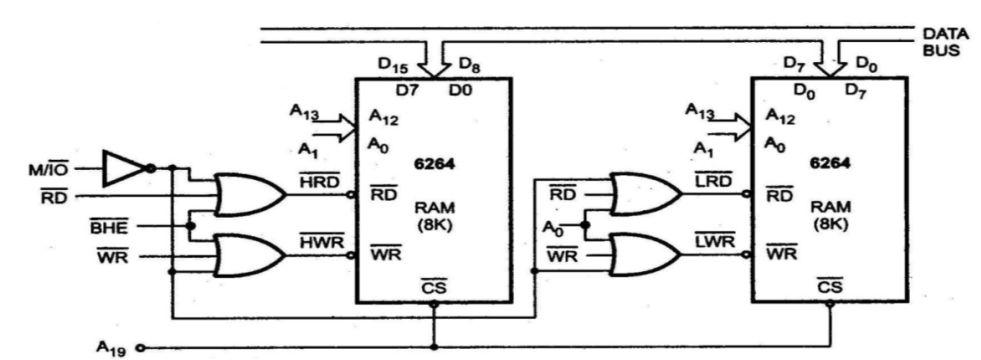
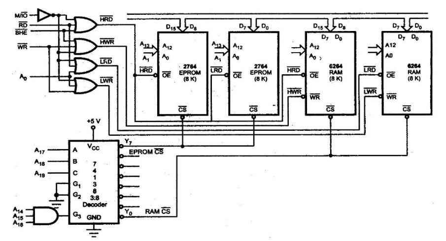

# Unit 3

## 1) Define following terms related to interrupts.   a. ISR   b. IVT   c. Interrupt Priority   d. Interrupt Handler

Here are the definitions for the terms related to interrupts:

#### a. ISR (Interrupt Service Routine)

An **Interrupt Service Routine (ISR)** is a special block of code that is executed in response to an interrupt signal. When an interrupt occurs, the processor stops executing the current program and jumps to the ISR associated with that interrupt. The ISR handles the specific task related to the interrupt, such as processing input from a device or handling an error condition. After the ISR completes its task, control is returned to the interrupted program.

#### b. IVT (Interrupt Vector Table)

The **Interrupt Vector Table (IVT)** is a data structure used by the processor to manage interrupts. It is a table of pointers (addresses) that point to the ISRs for each interrupt type. Each entry in the IVT corresponds to a specific interrupt number, allowing the processor to quickly locate and execute the appropriate ISR when an interrupt occurs. In x86 architecture, the IVT is typically located at the beginning of memory, starting at address `0000:0000`.

#### c. Interrupt Priority

**Interrupt Priority** refers to the order in which multiple interrupts are handled by the processor when they occur simultaneously or in quick succession. Each interrupt can be assigned a priority level, which determines how it is processed relative to other interrupts. Higher priority interrupts can preempt lower priority ones, ensuring that critical tasks are addressed promptly. This prioritization helps manage system responsiveness and ensures that important events are not delayed by less critical ones.

#### d. Interrupt Handler

An **Interrupt Handler** is another term for an Interrupt Service Routine (ISR). It refers to the specific code that runs in response to an interrupt signal. The term "interrupt handler" emphasizes its role in managing and processing interrupts, ensuring that appropriate actions are taken based on the type of interrupt received.

#### Summary

- **ISR**: Code executed in response to an interrupt.
- **IVT**: Table of pointers to ISRs for each interrupt type.
- **Interrupt Priority**: Order of handling multiple interrupts based on their importance.
- **Interrupt Handler**: Code that manages and processes interrupts, synonymous with ISR.

These concepts are fundamental in understanding how microprocessors handle asynchronous events and manage system resources effectively through interrupts.

## 2) Give difference between Interrupt and polling.

#### Difference Between Interrupt and Polling

Interrupts and polling are two methods used by a processor to manage events or signals from hardware devices. Here’s a comparison of the two:

| Feature           | Interrupt                                                                                                                        | Polling                                                                                                                            |
| ----------------- | -------------------------------------------------------------------------------------------------------------------------------- | ---------------------------------------------------------------------------------------------------------------------------------- |
| **Definition**    | An interrupt is a signal that temporarily halts the CPU's current operations to allow it to respond to an event.                 | Polling is a method where the CPU repeatedly checks the status of an I/O device at regular intervals to see if it needs attention. |
| **Efficiency**    | More efficient for handling infrequent events because the CPU can perform other tasks until an interrupt occurs.                 | Less efficient, especially if the event occurs infrequently, as it wastes CPU cycles checking devices that may not need attention. |
| **CPU Usage**     | The CPU can be idle or perform other tasks while waiting for an interrupt signal.                                                | The CPU is actively checking devices, which can lead to wasted processing time and resources.                                      |
| **Response Time** | Typically allows for faster response times since the CPU can react immediately when an interrupt occurs.                         | Response time can be slower, especially if the polling interval is long, leading to potential delays in handling events.           |
| **Complexity**    | More complex to implement due to the need for an interrupt vector table and handling routines (ISRs).                            | Simpler to implement as it involves straightforward looping and checking conditions.                                               |
| **Use Cases**     | Commonly used in real-time systems, device drivers, and scenarios where immediate attention is necessary (e.g., keyboard input). | Often used in simpler systems or where hardware does not support interrupts (e.g., basic embedded systems).                        |

#### Summary

- **Interrupts** are signals that allow devices to notify the CPU when they need processing, enabling efficient multitasking.
- **Polling** involves the CPU continuously checking devices for status updates, which can lead to inefficiencies.

Both methods have their use cases depending on system requirements, complexity, and performance considerations.

## 3) Classify Interrupt based on their types.

#### Classification of Interrupts Based on Their Types

Interrupts can be classified into several categories based on their source, nature, and handling. Here are the primary classifications:

#### 1. Based on Source

- **Hardware Interrupts**: Generated by hardware devices (e.g., keyboard, mouse, disk drives) to signal the CPU that they require attention. Hardware interrupts can be further classified into:
  - **Maskable Interrupts**: These can be ignored or "masked" by the CPU if it is busy or if a higher-priority interrupt occurs.
  - **Non-Maskable Interrupts (NMI)**: These cannot be ignored and are used for critical events (e.g., power failure).
- **Software Interrupts**: Generated by programs when they request services from the operating system or when an error occurs. These can include:
  - **System Calls**: Requests made by a program to the operating system for services.
  - **Exceptions**: Generated by the CPU itself in response to errors (e.g., division by zero).

#### 2. Based on Timing

- **Synchronous Interrupts**: Occur as a direct result of executing an instruction in a program. For example, an exception due to an invalid operation (like dividing by zero).
- **Asynchronous Interrupts**: Occur independently of the current instruction being executed, usually triggered by external hardware events.

#### 3. Based on Priority

- **Prioritized Interrupts**: Some systems assign priority levels to interrupts, allowing higher-priority interrupts to preempt lower-priority ones. This classification is crucial in real-time systems where certain tasks must be addressed immediately.

#### 4. Based on Functionality

- **I/O Interrupts**: Triggered by I/O devices to indicate that they are ready for data transfer (e.g., a keyboard interrupt when a key is pressed).
- **Timer Interrupts**: Generated by a timer within the CPU to allow the operating system to perform regular tasks like scheduling.
- **Debugging Interrupts**: Used during debugging sessions to halt execution and allow inspection of program state.

#### Summary

Interrupts are classified based on their source (hardware vs. software), timing (synchronous vs. asynchronous), priority levels, and functionality (I/O, timer, debugging). Understanding these classifications helps in designing efficient systems that can respond promptly to events while managing resources effectively.

## 4) Explain the procedure followed by an 8086 microprocessor when any interrupt arrives.

When an interrupt arrives at the **8086 microprocessor**, the processor follows a specific sequence of steps to handle the interrupt. Here’s a detailed explanation of the procedure:

#### Procedure Followed by the 8086 Microprocessor When an Interrupt Arrives

1. **Interrupt Signal Detection**:
   - The 8086 continuously checks for interrupt signals during its instruction execution cycle. If an interrupt signal is detected, the processor will respond to it according to its priority level.
2. **Completion of Current Instruction**:
   - The processor completes the execution of the current instruction before responding to the interrupt. This ensures that the system remains in a consistent state.
3. **Disable Further Interrupts (Optional)**:
   - Depending on the configuration and type of interrupt, the CPU may disable further interrupts by clearing the Interrupt Flag (IF) in the FLAGS register. This prevents other interrupts from being serviced while the current interrupt is being handled.
4. **Save Context**:
   - The processor saves the current context (state) of the running program. This includes:
     - The contents of the registers (general-purpose registers, segment registers, and FLAGS register).
     - The Instruction Pointer (IP), which points to the next instruction to be executed.
   - This context is usually saved on the stack.
5. **Determine Interrupt Vector**:
   - The processor uses the interrupt vector number (usually provided by the hardware or specified in a specific register) to locate the appropriate Interrupt Service Routine (ISR).
   - It does this by accessing the **Interrupt Vector Table (IVT)**, which contains pointers to ISRs for each possible interrupt.
6. **Load Segment and Offset**:
   - The processor retrieves the segment and offset address of the ISR from the IVT. This information tells it where to find the ISR in memory.
7. **Jump to ISR**:
   - The CPU jumps to the address of the ISR specified in the IVT and begins executing it. At this point, control is transferred from the main program to the ISR.
8. **Execute ISR**:
   - The ISR executes its designated tasks, which may include handling device requests, processing data, or performing error handling.
9. **Restore Context**:
   - Once the ISR has completed its tasks, it must restore the saved context from the stack. This includes restoring all registers and flags that were saved before handling the interrupt.
10. **Return from Interrupt**:
    - The CPU executes a special instruction (usually `IRET` for return from interrupt) that restores control back to the main program at the point where it was interrupted.
    - If interrupts were disabled at step 3, they are re-enabled at this point.
11. **Resume Execution**:
    - The processor resumes execution of the main program as if no interruption had occurred.

#### Summary

The 8086 microprocessor handles interrupts through a well-defined sequence: detecting an interrupt, completing current instructions, saving context, determining and executing an ISR, restoring context, and resuming normal operation. This mechanism allows for efficient management of asynchronous events while maintaining system stability and performance.

## 5) Explain how the address of ISR is calculated in an 8086 microprocessor.

In the 8086 microprocessor, the address of the Interrupt Service Routine (ISR) is calculated using the Interrupt Vector Table (IVT). Here’s a detailed explanation of how this process works:

#### Steps to Calculate the Address of ISR in the 8086 Microprocessor

1. **Interrupt Vector Table (IVT)**:
   - The IVT is a table located at the beginning of memory, specifically at address `0000:0000` in the 8086 architecture.
   - The IVT contains 256 entries (for 256 possible interrupt types), with each entry being 4 bytes long. Each entry consists of a segment address and an offset address for the corresponding ISR.
2. **Interrupt Type**:
   - When an interrupt occurs, it is assigned a specific interrupt type number (ranging from `0` to `255`).
   - This number identifies which ISR to execute.
3. **Calculating the Address**:
   - To find the address of the ISR corresponding to an interrupt type, the processor uses the following formula:
     - **Address of ISR = IVT Base Address + (Interrupt Type Number × Size of Each Entry)**
   - In the case of the 8086, since each entry in the IVT is 4 bytes (2 bytes for segment and 2 bytes for offset), the formula becomes:
     - **Address of ISR = 0x0000:0000 + (Interrupt Type Number × 4)**
4. **Accessing the IVT**:
   - The processor retrieves the segment and offset from the IVT using this calculated address.
   - For example, if an interrupt type number is `5`, then:
     - **Address = 0x0000 + (5 × 4) = 0x0000 + 20 = 0x0014**
   - The processor then reads the segment and offset from this calculated address:
     - The first two bytes at `0x0014` provide the segment address.
     - The next two bytes at `0x0016` provide the offset address.
5. **Jumping to ISR**:
   - Once it has both segment and offset addresses, the CPU can jump to that location in memory to execute the ISR.
   - The instruction pointer (IP) is set to this new address, allowing execution to continue from there.

#### Summary

The address of an ISR in an 8086 microprocessor is calculated by accessing the Interrupt Vector Table (IVT), using a specific interrupt type number to find its corresponding entry. Each entry contains a segment and offset that points to the ISR. This mechanism allows for efficient handling of interrupts by directing control flow to appropriate service routines based on specific events or conditions.

## 6) Explain the different types of decoding techniques in memory interfacing.

In memory interfacing, decoding techniques are essential for determining how the microprocessor interacts with memory and I/O devices. Here are the different types of decoding techniques commonly used:

#### 1. **Direct Decoding**

- **Description**: In direct decoding, the address lines from the microprocessor are directly connected to the address lines of the memory or I/O devices.
- **Characteristics**:
  - Simple and straightforward implementation.
  - Each device or memory chip is assigned a unique address range.
  - Suitable for systems with a limited number of devices.
- **Example**: If a microprocessor has an address bus of 16 bits, it can directly address up to 65,536 memory locations or I/O ports.

#### 2. **Partial Decoding**

- **Description**: In partial decoding, only a subset of the address lines is used to select a device or memory location.
- **Characteristics**:
  - Reduces the number of required address lines for larger systems.
  - Allows multiple devices to share an address range, which can lead to more efficient use of address space.
  - It may lead to overlapping addresses if not carefully managed.
- **Example**: Using only the higher-order address lines (e.g., A8-A15) to select among several devices while using lower-order lines for specific addressing within those devices.

#### 3. **Full Decoding**

- **Description**: Full decoding uses all available address lines to uniquely identify each device or memory location.
- **Characteristics**:
  - Ensures that each device has a unique address with no overlap.
  - More complex than direct or partial decoding due to additional logic circuits required.
  - Suitable for systems with many devices needing distinct addresses.
- **Example**: In a system with multiple memory chips, full decoding ensures that each chip responds only when its specific address range is accessed.

#### 4. **Memory-Mapped I/O**

- **Description**: In this technique, both memory and I/O devices share the same address space.
- **Characteristics**:
  - Simplifies programming since I/O operations can be performed using standard memory instructions.
  - Requires careful management of address space to avoid conflicts between memory and I/O devices.
- **Example**: A system where both RAM and peripheral devices like printers and displays are addressed in the same range (e.g., addresses from `0000H` to `FFFFH`).

#### 5. **I/O Mapped I/O (Port-Mapped I/O)**

- **Description**: This technique uses separate address spaces for memory and I/O devices.
- **Characteristics**:
  - Allows for more straightforward implementation since memory and I/O operations are distinctly handled.
  - The processor uses specific instructions (like `IN` and `OUT`) to access I/O ports.
- **Example**: A system where RAM is addressed from `0000H` to `FFFFH`, while I/O devices are addressed from `FF00H` to `FFFFH`.

#### Summary

Decoding techniques in memory interfacing include direct decoding, partial decoding, full decoding, memory-mapped I/O, and I/O mapped I/O. Each technique has its advantages and disadvantages depending on system requirements, complexity, and the number of devices being interfaced. Understanding these techniques is crucial for designing efficient microprocessor-based systems.

## 7) Explain following decoding techniques.   a. Absolute decoding   b. Partial decoding   c. Block decoding

Here’s an explanation of the three decoding techniques in memory interfacing: **Absolute Decoding**, **Partial Decoding**, and **Block Decoding**.

#### a. Absolute Decoding

- **Definition**: Absolute decoding involves connecting the address lines of the microprocessor directly to the address lines of the memory or I/O devices. Each device is assigned a unique address, and the microprocessor can access each device directly through its specific address.
- **Characteristics**:
  - **Simplicity**: The implementation is straightforward since each device has a dedicated address.
  - **Address Space**: The entire address space is utilized, which means that if a device is not present at its assigned address, it will simply not respond.
  - **Limitations**: This method can become impractical when the number of devices increases, as it requires more address lines and can lead to wasted address space if devices are not fully populated.
- **Example**: If a system has 16 address lines, it can directly address up to 65,536 (2^16) different memory locations or I/O ports.

#### b. Partial Decoding

- **Definition**: In partial decoding, only a subset of the address lines is used to select a device or memory location. This technique allows multiple devices to share an address range.
- **Characteristics**:
  - **Efficiency**: Reduces the number of required address lines and allows for more efficient use of the available address space.
  - **Address Overlap**: Since multiple devices may respond to the same address range, careful management is required to avoid conflicts.
  - **Complexity**: Implementation can be more complex than absolute decoding due to the need for additional logic to manage overlapping addresses.
- **Example**: If a system uses only the higher-order address lines (e.g., A8-A15) for device selection, multiple devices could be assigned addresses within the same range but would need additional logic to determine which device should respond.

#### c. Block Decoding

- **Definition**: Block decoding divides the entire address space into blocks and assigns each block to a specific device or group of devices. This technique uses a combination of both absolute and partial decoding.
- **Characteristics**:
  - **Flexibility**: Allows for larger systems with many devices by grouping them into blocks, which can simplify addressing.
  - **Reduced Complexity**: Compared to absolute decoding, it reduces complexity by limiting the number of unique addresses that need to be managed directly.
  - **Potential for Waste**: Similar to partial decoding, there may be unused addresses within blocks if not all devices are present.
