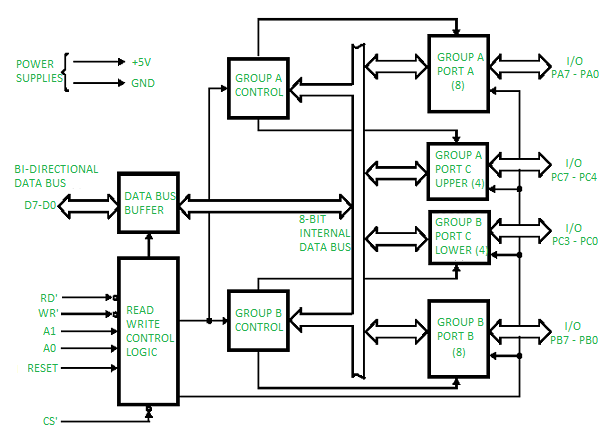
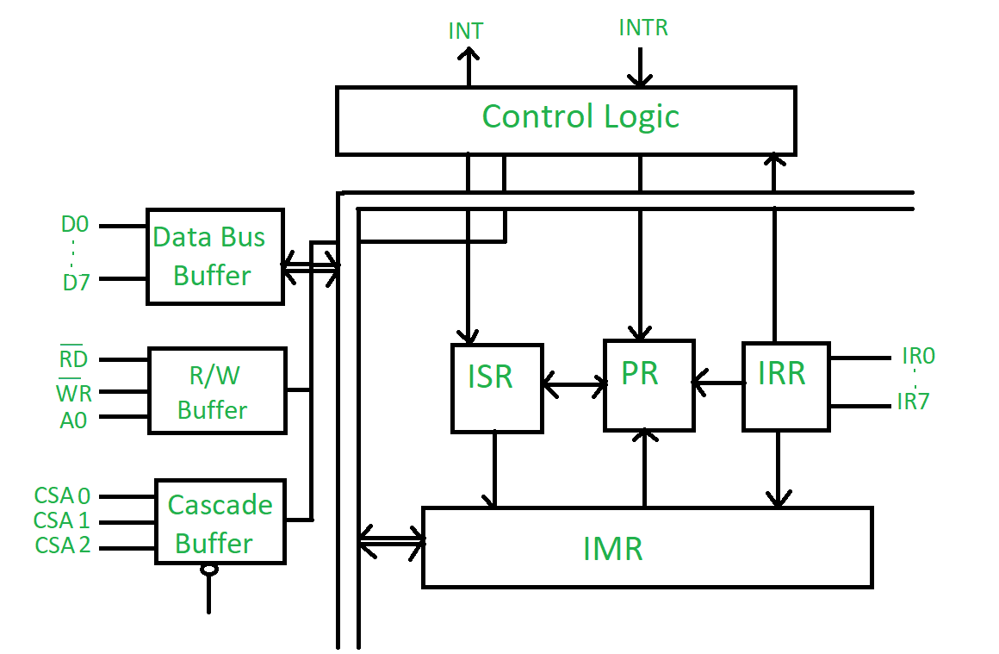
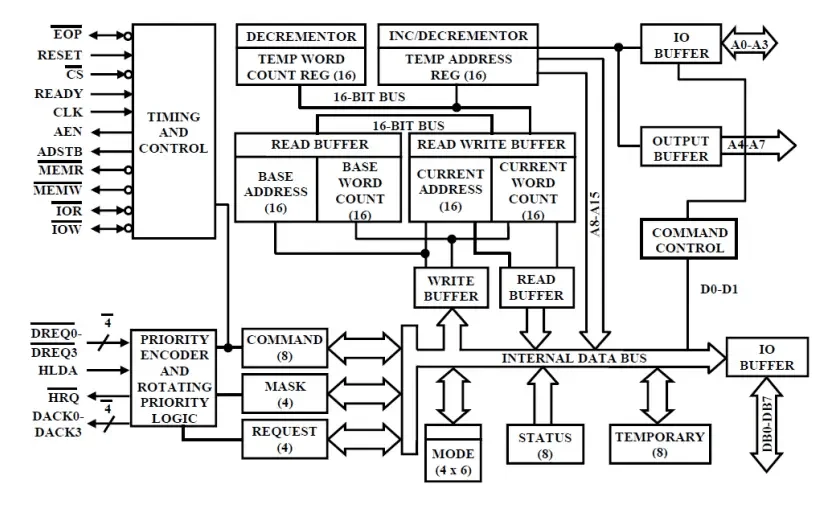
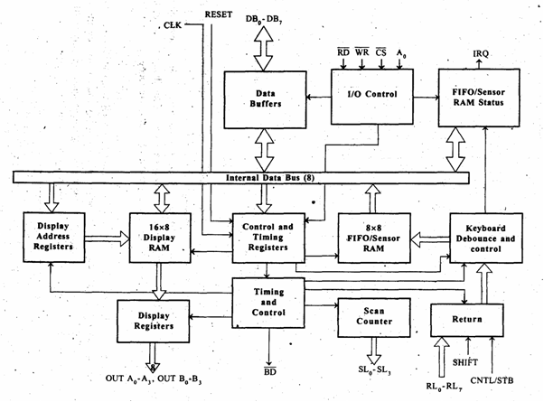
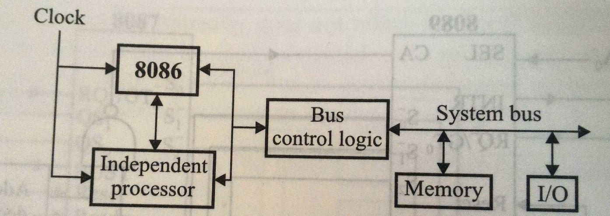
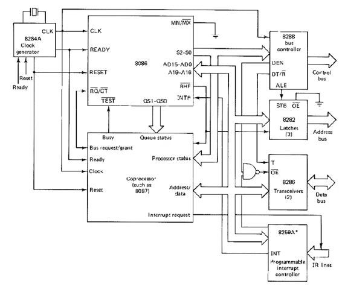
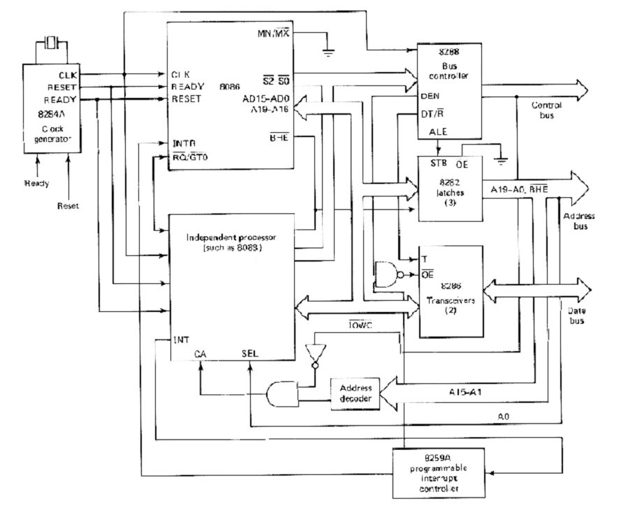
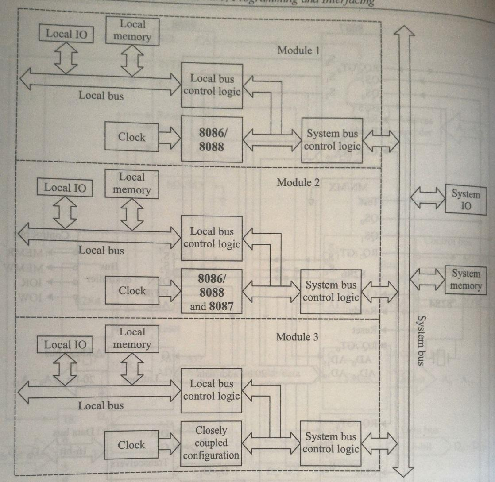

# Unit 4

## 1) Give the difference between memory mapped I/O and peripheral mapped I/O technique.

Memory-mapped I/O and peripheral-mapped I/O (also known as I/O-mapped or port-mapped I/O) are two techniques used to interface with input/output devices in computer systems. Here’s a detailed comparison of the two:

### Memory-Mapped I/O

#### Definition

In memory-mapped I/O, the I/O devices are assigned specific addresses in the same address space as the program memory. This means that both memory and I/O devices can be accessed using the same set of instructions.

#### Characteristics

- Unified Address Space: I/O devices and memory share the same address space, allowing for a larger number of devices to be addressed.
- Instruction Set: Standard memory instructions (like LOAD, STORE) can be used for I/O operations, simplifying the instruction set.
- Addressing: Each I/O device is assigned a unique address in the memory map, and the CPU accesses them using memory addressing techniques.
- Hardware Complexity: It may require more complex hardware and address decoding because both memory and I/O devices share the same address lines.

#### Advantages

- Simplicity of Programming: Programmers can use the same instructions for both memory and I/O operations.
- Faster Access: Direct access to devices can potentially lead to faster data transfer rates.

#### Disadvantages

- Address Space Limitation: Since memory and I/O share the same address space, the total addressable memory is reduced.
- Complexity in System Design: More complex hardware design may be required to manage the unified address space.

### Peripheral-Mapped I/O (I/O-Mapped I/O)

#### Definition

In peripheral-mapped I/O, I/O devices are assigned addresses that are separate from the main memory address space. This technique uses specific I/O instructions to access the devices.

#### Characteristics

- Separate Address Space: I/O devices have their own dedicated address space, distinct from the memory addresses.
- Special Instructions: Specific I/O instructions (like IN and OUT) are used to communicate with the devices, requiring a different set of operations compared to memory access.
- Addressing: Each device is assigned an address in a different range from memory, allowing for dedicated I/O addressing.

#### Advantages

- Larger Addressable Memory: The main memory address space is not reduced because I/O devices use a separate address space.
- Simplicity of I/O Control: Dedicated I/O instructions can simplify the control of devices.

#### Disadvantages

- Additional Instructions Needed: Requires different instructions for I/O operations, which can complicate programming.
- Potentially Slower: Accessing I/O devices can be slower compared to memory-mapped I/O due to the need for different instruction cycles.

### Summary of Differences

| Feature                     | Memory-Mapped I/O                   | Peripheral-Mapped I/O                 |
| --------------------------- | ----------------------------------- | ------------------------------------- |
| Address Space               | Unified (shared with memory)        | Separate (dedicated for I/O)          |
| Instruction Set             | Uses standard memory instructions   | Uses specific I/O instructions        |
| Addressing                  | Memory addressing techniques        | I/O addressing techniques             |
| Hardware Complexity         | More complex due to shared space    | Simpler due to separate spaces        |
| Programming                 | Simpler (same instructions)         | More complex (different instructions) |
| Memory Address Availability | Reduced due to shared I/O addresses | Larger addressable memory space       |

---

Both techniques have their use cases, and the choice between them often depends on the specific requirements of the hardware architecture and the needs of the application. If you have any further questions or need additional details, feel free to ask!

## 2) Draw and explain block diagram of 8255 programmable peripheral chip.

Here’s a detailed explanation of the 8255 Programmable Peripheral Interface (PPI) along with a block diagram.

### Block Diagram of 8255

### Explanation of Key Components

#### 1. Control Logic

- The control logic manages the operation of the 8255. It interprets control signals from the CPU to configure the ports and manage data flow.

#### 2. Ports

- Port A: An 8-bit bidirectional data port that can be used for input or output operations.
- Port B: Similar to Port A, it is also an 8-bit bidirectional data port.
- Port C: An 8-bit port used primarily for control signals. It can be divided into two 4-bit ports (C1 and C2) for more granular control.

#### 3. Data Bus

- The 8255 connects to the data bus (D0-D7) of the microprocessor, allowing it to send and receive data.

#### 4. Address Bus

- The address bus (A0-A1) is used to select the specific port or control register within the 8255. The 8255 uses two address lines, allowing for four different addresses (for Port A, Port B, Port C, and Control Register).

#### 5. Read/Write Control Signals

- These signals dictate whether the 8255 is in read or write mode. The microprocessor sends control signals to read data from the ports or write data to them.

### Functionality of 8255

The 8255 PPI is designed to interface with the microprocessor and manage input/output operations with peripheral devices. It operates in three modes:

#### 1. Mode 0 (Basic Input/Output Mode)

- Ports A, B, and C function as simple input or output ports. Data can be read from or written to the ports without any additional control signals.

#### 2. Mode 1 (Strobed Input/Output Mode)

- This mode allows for handshaking signals to be used, enabling more complex communication with peripherals. It uses the control signals to manage data transfer.

#### 3. Mode 2 (Bidirectional Bus Mode)

- This mode is used for bidirectional data transfer on Port A. It allows data to be sent and received simultaneously, making it suitable for applications requiring two-way communication.

### Applications of 8255

- Microcontroller Interfacing: It is commonly used in microcontroller systems to interface with various peripherals.
- Data Acquisition Systems: The 8255 can be used to collect data from sensors and send it to the microprocessor.
- Control Systems: It can control motors, lights, and other devices in automation systems.

The 8255 PPI is a versatile interface that simplifies communication between the CPU and peripheral devices, making it an essential component in many microprocessor-based systems. If you have further questions or need more details about specific aspects, feel free to ask!

## 3) Draw and explain block diagram of 8254 programmable timer IC.

Here’s a detailed explanation of the 8254 Programmable Interval Timer (PIT) along with a block diagram.

### Block Diagram of 8254

### Explanation of Key Components

#### 1. Control Logic

- The control logic manages the operation of the 8254. It interprets control signals from the CPU to configure the timer channels, set modes of operation, and manage data flow.

#### 2. Channels

- The 8254 has three independent channels (Channel 0, Channel 1, and Channel 2), each functioning as a 16-bit counter. These channels can be programmed to operate in various modes, allowing for different timing and counting functions.
- Each channel can generate interrupts based on the counting operation, making it suitable for timing applications.

#### 3. Data Bus

- The 8254 connects to the data bus (D0-D7) of the microprocessor, allowing it to send and receive data. This bus is used for data transfer between the microprocessor and the timer.

#### 4. Address Bus

- The address bus (A0-A1) is used to select the specific channel or control register within the 8254. The 8254 uses two address lines, allowing for four different addresses (for Channel 0, Channel 1, Channel 2, and Control Register).

#### 5. Read/Write Control Signals

- These signals dictate whether the 8254 is in read or write mode. The microprocessor sends control signals to read data from the channels or write data to them.

### Functionality of 8254

The 8254 is designed to provide timing and counting functions in microprocessor systems. It operates in various modes:

#### 1. Mode 0 (Interrupt on Terminal Count)

- The counter counts down to zero and generates an interrupt when it reaches zero. This mode is commonly used for generating time delays.

#### 2. Mode 1 (Programmable One-Shot)

- In this mode, the timer generates a single pulse of a specified width when triggered. This is useful for generating precise timing signals.

#### 3. Mode 2 (Rate Generator)

- The counter is continuously reloaded with a specified value, allowing it to generate a series of pulses at a defined rate.

#### 4. Mode 3 (Square Wave Generator)

- This mode generates a square wave output. The frequency of the square wave is determined by the initial count value.

#### 5. Mode 4 (Software Triggered Strobe)

- The counter generates a strobe pulse when triggered by software. This mode is useful for synchronizing operations.

#### 6. Mode 5 (Hardware Triggered Strobe)

- Similar to Mode 4, but the trigger is hardware-based, allowing for more complex timing operations.

### Applications of 8254

- Timing Operations: Used in applications requiring precise timing intervals.
- Event Counting: Can count events in various applications, such as measuring time between events.
- Frequency Generation: Used to generate specific frequencies for clock signals in digital circuits.

The 8254 Programmable Interval Timer is a versatile device that simplifies timing and counting operations in microprocessor-based systems. If you have further questions or need more details about specific aspects, feel free to ask!

## 4) Explain any two mode of operation of 8254 programmable timer IC.

The 8254 Programmable Interval Timer (PIT) has several modes of operation, each designed for specific timing and counting tasks. Here, I will explain two of these modes: Mode 0 (Interrupt on Terminal Count) and Mode 1 (Programmable One-Shot).

### Mode 0: Interrupt on Terminal Count

#### Description

In Mode 0, the 8254 operates as a simple counter that counts down from a specified value until it reaches zero. When the counter reaches zero, it generates an interrupt signal, which can be used to notify the CPU that a specified time interval has elapsed.

#### Characteristics

- Counting Direction: The counter counts downwards (from the initial value to zero).
- Interrupt Generation: An interrupt is generated when the counter reaches zero, allowing the CPU to perform a specific task or action.
- Configuration: The initial count value is loaded into the counter by writing to the control register. The width of the pulse generated can be defined by the initial count value.

#### Applications

- Timer Events: Mode 0 is commonly used for generating time delays, such as in scheduling tasks in real-time systems.
- Event Counting: It can also be used to count events, such as the number of pulses received from an external signal.

### Mode 1: Programmable One-Shot

#### Description

In Mode 1, the 8254 operates as a one-shot timer, generating a single output pulse of a specified duration when triggered. This mode is useful for generating precise timing signals.

#### Characteristics

- Triggering: The mode is activated by a trigger signal, which causes the counter to start counting down from the loaded value.
- Single Pulse Output: Once the counter reaches zero, it generates a single output pulse. The duration of this pulse is determined by the initial count value.
- Re-Triggering: The timer can be retriggered while it is counting down, allowing for multiple pulses to be generated in response to subsequent triggers.

#### Applications

- Pulse Generation: Mode 1 is used in applications requiring precise pulse generation, such as clock signals for synchronous devices.
- Timing Control: It can be employed in systems that require specific timing control for events, such as in data sampling or synchronization tasks.

These two modes of operation of the 8254 timer IC highlight its versatility in handling various timing and counting tasks in microprocessor-based systems. If you have additional questions or need further details about other modes or applications, feel free to ask!

## 5) Draw and explain block diagram 8259 programmable interrupt controller.

Here’s a detailed explanation of the 8259 Programmable Interrupt Controller (PIC) along with a block diagram.

### Block Diagram of 8259

### Explanation of Key Components

#### 1. Control Logic

- The control logic manages the overall operation of the 8259. It interprets control signals from the CPU and manages the flow of interrupt requests.

#### 2. Interrupt Request Lines (IR0-IR7)

- The 8259 has 8 interrupt request lines (IR0 to IR7) that receive interrupt requests from various devices. Each line corresponds to a different interrupt source. When a device needs attention, it sends a signal through one of these lines.

#### 3. Interrupt Vector Address Register

- This register holds the base address of the interrupt vector table. When an interrupt request is acknowledged, the 8259 uses this address to identify the appropriate interrupt service routine (ISR).

#### 4. Priority Resolver

- The priority resolver determines the highest-priority interrupt that is currently being requested. If multiple interrupts occur simultaneously, the priority resolver ensures that the one with the highest priority is serviced first.

#### 5. Mask Register

- The mask register is used to enable or disable specific interrupt lines. By masking certain interrupts, the system can control which devices can generate interrupts, allowing for prioritized processing.

#### 6. Command Register

- This register is used to configure the 8259, including setting the operating mode (such as fully nested mode or specific priority configurations) and controlling the initialization sequence.

#### 7. Status Register

- The status register holds information about the current state of the interrupt controller, including which interrupts are currently active and which are masked.

#### 8. Data Bus and Address Bus

- The 8259 connects to the microprocessor’s data bus (D0-D7) and address bus (A0-A1). This allows data transfer and addresses to be communicated between the PIC and the CPU.

#### 9. Read/Write Control Signals

- These signals are used to control the read and write operations to and from the 8259. They dictate whether the CPU is reading from or writing to the control and status registers of the PIC.

### Functionality of 8259

The 8259 PIC is designed to manage multiple interrupt sources efficiently. It allows the CPU to handle interrupts in a prioritized manner, facilitating better control over system resources and improving responsiveness. Here are some key functions:

- Interrupt Handling: The PIC receives interrupt requests, prioritizes them, and sends the appropriate interrupt vector address to the CPU when an interrupt is acknowledged.
- Masking: The PIC can enable or disable interrupt lines through the mask register, allowing the system to ignore certain interrupts based on operational requirements.
- Cascading: Multiple 8259s can be cascaded to handle more than 8 interrupt requests, allowing for a larger number of devices to be connected.

### Applications of 8259

- Real-Time Systems: Used in systems where timely responses to multiple interrupt sources are critical.
- General Purpose Computing: Commonly found in computer systems to manage keyboard, mouse, disk I/O, and other peripheral interrupts.

The 8259 Programmable Interrupt Controller is an essential component for managing interrupts in a microprocessor-based system, enhancing efficiency and responsiveness. If you have further questions or need more details about specific aspects, feel free to ask!

## 6) Draw and explain block diagram 8237 DMA controller.

Here’s a detailed explanation of the 8237 Direct Memory Access (DMA) Controller along with a block diagram.

### Block Diagram of 8237 DMA Controller

### Explanation of Key Components

#### 1. Control Logic

- The control logic manages the overall operation of the 8237 DMA controller. It interprets signals from the CPU and the peripheral devices to coordinate data transfers.

#### 2. Address Register

- The address register holds the memory address where data will be transferred during a DMA operation. This address is provided by the CPU and specifies the starting point for the data transfer.

#### 3. Count Register

- The count register specifies the number of bytes to be transferred. It decrements during each data transfer cycle until it reaches zero, signaling the completion of the DMA operation.

#### 4. Status Register

- The status register indicates the current state of the DMA controller. It provides information about whether a transfer is active, if there are errors, and other status flags.

#### 5. Mode Register

- The mode register is used to configure the operation of the DMA controller. It defines the mode of transfer (such as single transfer, block transfer, or burst transfer) and other operational parameters.

#### 6. Request Register

- The request register is used to hold the interrupt request signals from peripheral devices. It determines which device is requesting a DMA transfer and prioritizes requests based on the configured parameters.

#### 7. Data Bus and Address Bus

- The 8237 connects to the system's data bus (D0-D7) and address bus (A0-A15). This allows it to read data from and write data to memory, as well as communicate with peripheral devices.

#### 8. Read/Write Control Signals

- These control signals dictate whether the DMA controller is performing a read or write operation. The control signals help manage the flow of data between the CPU, memory, and peripheral devices.

#### 9. Peripheral Devices

- The 8237 DMA controller interfaces with various peripheral devices (e.g., disk drives, keyboards, network cards) that may need to transfer large amounts of data directly to or from memory without CPU intervention.

### Functionality of 8237 DMA Controller

The primary function of the 8237 DMA controller is to facilitate direct memory access for data transfers between peripheral devices and system memory, bypassing the CPU for efficiency. Here are some key functionalities:

- Data Transfer: The 8237 allows devices to transfer data to and from memory without continuous CPU involvement, reducing CPU load and increasing overall system performance.
- Configurable Transfer Modes: It supports various modes of operation, including single transfer mode (one byte at a time) and block transfer mode (multiple bytes in a single operation).
- Priority Management: The DMA controller can manage multiple DMA requests from different devices, prioritizing them based on their importance and ensuring efficient data flow.

### Applications of 8237 DMA Controller

- High-Speed Data Transfer: Used in scenarios where large amounts of data need to be transferred quickly (e.g., from disk drives to memory).
- I/O Operations: Commonly found in systems requiring efficient I/O operations, such as video and audio processing applications.

The 8237 DMA controller plays a crucial role in modern computer systems by enabling efficient data transfers and optimizing CPU resources. If you have further questions or need more details about specific aspects, feel free to ask!

## 7) Draw and explain block diagram of 8279 display controller.

The 8279 is a programmable keyboard and display controller designed for microprocessor-based systems. It allows for easy interfacing of keyboards and displays, particularly seven-segment displays. Below is a block diagram of the 8279 along with an explanation of its components.

### Block Diagram of 8279 Display Controller

### Explanation of Key Components

#### 1. Control Logic

- The control logic manages the overall operation of the 8279. It interprets commands from the CPU and coordinates the activities of the keyboard interface and display output.

#### 2. Keyboard Interface

- This component handles the connection to a keyboard. It debounces key presses (to eliminate noise from mechanical switches) and processes the input signals from the keyboard. The keyboard interface can recognize multiple key presses and supports various keyboard layouts.

#### 3. Display Memory (RAM)

- The display memory is a FIFO (First In, First Out) buffer that temporarily holds the data to be displayed on the output device. It can accommodate up to 16 characters, allowing for easy management of the display output.

#### 4. Output Control Logic

- This logic controls the data output to the display devices. It manages the multiplexing of display outputs, ensuring that the correct data is sent to the corresponding segments of the display at the right time.

#### 5. Data Bus

- The 8279 connects to the data bus (D0-D7) of the microprocessor, allowing for data transfer between the microprocessor and the 8279. The data bus carries the data being sent to or received from the 8279.

#### 6. Address Bus

- The address bus (A0-A3) is used to select specific registers within the 8279. It allows the microprocessor to communicate with various components of the 8279 by providing the relevant address.

#### 7. Read/Write Control Signals

- These signals dictate whether the 8279 is in read or write mode. They are essential for controlling data transfers between the CPU and the 8279.

#### 8. Interrupt Request Output (IRQ)

- The IRQ line is used to signal the CPU when an interrupt condition occurs. For instance, if a key is pressed on the keyboard, the 8279 can generate an interrupt to notify the CPU.

#### 9. Status Register

- The status register provides information about the current state of the 8279, including whether a key has been pressed and what mode the controller is operating in.

#### 10. Command Register

- The command register is used to configure the operation of the 8279. It contains commands for setting the display mode, keyboard mode, and other operational parameters.

### Functionality of 8279

The 8279 provides a straightforward interface for connecting keyboards and display devices to a microprocessor. Key functionalities include:

- Keyboard Input Handling: The 8279 can manage multiple keys pressed simultaneously and debounces the inputs for reliable operation.
- Display Management: It supports multiplexed outputs for driving seven-segment displays, allowing for efficient use of pins on the microprocessor.
- Interrupt Generation: It can generate interrupts for key presses, enabling responsive input handling in applications.
- Configuration Flexibility: The controller can be configured to operate in various modes, including different keyboard layouts and display configurations.

### Applications of 8279

- Embedded Systems: Commonly used in embedded systems that require user input through a keyboard and display output.
- Consumer Electronics: Utilized in devices like calculators, home appliances, and other consumer electronics with keypad interfaces.
- Industrial Control Systems: Employed in industrial applications for controlling machinery and processes with user interfaces.

The 8279 display controller simplifies the integration of keyboards and display devices in microprocessor systems, enhancing user interaction and overall functionality. If you have any further questions or need more details about specific features or applications, feel free to ask!

## 8) Draw and describe the block diagram of co processor configuration.

### Co-Processor Configuration: Block Diagram and Description

#### Overview of Co-Processor Configuration

A co-processor configuration is a system architecture that enhances a primary processor's capabilities by integrating a secondary processor (the co-processor) designed to handle specific tasks. This configuration is particularly useful for offloading complex computations, such as floating-point operations, to the co-processor, allowing the host (primary) processor to maintain efficiency in executing its own instructions.

#### Block Diagram of Co-Processor Configuration

The block diagram of a co-processor configuration typically includes the following components:

Co-Processor Configuration Block Diagram :

1. **Host Processor (e.g., 8086)**:

   - The primary processor that executes general instructions and manages system resources.

2. **Co-Processor (e.g., 8087)**:

   - A secondary processor specifically designed for performing mathematical calculations, such as floating-point arithmetic.

3. **Shared Memory**:

   - Both the host processor and the co-processor access a common memory, allowing them to read and write data as needed.

4. **I/O Bus**:

   - A communication pathway that connects the host processor and the co-processor to input/output devices.

5. **Bus Control Logic**:

   - Manages data flow between the processors and memory, ensuring that access to shared resources is coordinated.

6. **Clock Generator (e.g., 8284A)**:

   - Provides timing signals to synchronize operations between the host processor and the co-processor.

7. **Control Signals**:

   - **TEST**: Indicates if the co-processor is busy.
   - **RQ/GT**: Request/Grant signal for bus access.
   - **QS1, QS0**: Queue status signals that manage instruction queues for both processors.

8. **Interrupt Controller (e.g., 8259)**:
   - Manages interrupt signals, allowing the host processor to respond to events generated by the co-processor.

#### Working Mechanism

1. **Instruction Fetching**:

   - Instructions are fetched by the host processor and are loaded into the instruction queues of both the host and the co-processor.

2. **Execution**:

   - The host processor executes its own instructions while delegating specific tasks to the co-processor. The co-processor operates independently on its assigned instructions.

3. **Communication**:

   - The processors communicate through shared memory, where the host can place tasks for the co-processor, which retrieves and processes them.

4. **Escape Instructions**:
   - These special instructions signal the co-processor to perform a specific operation, containing an operation code that defines the task.

#### Advantages of Co-Processor Configuration

- **Increased Performance**: Offloading complex computations to a co-processor frees up the host processor to continue executing other tasks, enhancing overall system throughput.
- **Specialized Processing**: Co-processors are optimized for particular types of calculations, such as floating-point operations, which can be performed more efficiently than on a general-purpose CPU.
- **Shared Resources**: The configuration allows both processors to utilize the same memory and I/O systems, simplifying the architecture and reducing the need for additional components.

#### Conclusion

The co-processor configuration represents a significant advancement in computing architecture, particularly for applications requiring intensive mathematical computations. By leveraging the strengths of both the host processor and the co-processor, systems can achieve higher efficiency and performance. Understanding this configuration is essential for computer engineering students and professionals in the field of system architecture and design.

## 9) Draw the block diagram of closely coupled configuration.

## 10) Multiprocessor and Multiprogramming

### Multiprocessor and Multiprogramming: An Overview

#### Definitions

1. **Multiprocessing**:

   - Multiprocessing refers to the use of two or more processors within a single computer system. These processors can concurrently execute multiple processes, sharing the system's resources, such as memory and I/O devices. Multiprocessing enhances performance by enabling parallel processing, which allows more tasks to be completed in a given time frame.

2. **Multiprogramming**:
   - Multiprogramming is a technique that enables multiple programs to reside in memory at the same time and be executed by a single processor. The operating system manages the execution of these programs, switching between them to maximize CPU utilization. This approach minimizes idle CPU time by ensuring that while one program is waiting for I/O operations to complete, another program can use the CPU.

#### Key Configurations in Multiprocessing

Multiprocessing systems can be categorized into different configurations, primarily:

##### 1. Co-Processor Configuration

- **Description**: In this configuration, the host processor and a co-processor (like the 8087 for floating-point calculations) share the same memory, I/O, bus, and clock generator. The co-processor assists the host in performing complex calculations, effectively offloading work from the main processor.
- **Communication**: The host and co-processor communicate through specific control signals (e.g., TEST, RQ/GT, QS1, QS0), which help manage task execution and resource sharing.

##### 2. Closely Coupled Configuration

- **Description**: Similar to co-processor configurations, closely coupled systems consist of a host processor and independent processors that share memory and I/O resources. However, these independent processors can fetch and execute their own instructions, allowing them to operate autonomously.
- **Communication**: The host processor communicates with the independent processor through shared memory, sending messages that the independent processor can retrieve and act upon.

##### 3. Loosely Coupled Configuration

- **Description**: This configuration consists of several independent modules, each potentially configured as a co-processor or closely coupled system. Each module has its own memory and clock but shares the system bus and I/O.
- **Advantages**: Loosely coupled systems can be expanded modularly, providing high system throughput and fault tolerance, as a failure in one module typically does not disrupt the entire system.

#### Bus Allocation Schemes

In a loosely coupled configuration, multiple modules may attempt to access the shared system bus. Bus control logic is essential for managing access, and several allocation schemes can be employed:

1. **Daisy Chaining**:

   - A simple scheme where all bus masters share a single bus request line. The bus controller grants access sequentially, propagating the bus grant signal until it reaches the requesting bus master.

2. **Polling**:

   - This method involves a bus controller that generates a sequence of addresses in response to bus requests. Each bus master listens for its address to activate the bus. Polling allows dynamic priority adjustments.

3. **Independent Request Scheme**:
   - Each module has its own bus request and grant lines, allowing for parallel resolution of requests. A priority decoder selects the highest priority request for bus access, making this the fastest allocation scheme.

#### Conclusion

Understanding the distinctions between multiprocessing and multiprogramming, along with their configurations and bus allocation schemes, is crucial for computer engineering students and professionals. These concepts are foundational for designing efficient and robust computing systems, particularly in environments requiring high performance and reliability.

## 11) Loosely coupled configuration.

### Definition

A loosely coupled configuration refers to a system architecture in which multiple independent modules (or processors) are connected through a shared system bus, shared memory, and shared I/O devices. Each module has its own local memory and clock, allowing them to function independently while still being able to communicate with one another.

Block Diagram :

### Characteristics of Loosely Coupled Configuration

1. **Independence**:

   - Each module can operate independently, allowing for parallel processing. This independence means that one module can fail without affecting the entire system.

2. **Shared Resources**:

   - Although each module has its own memory, they share the system bus and input/output (I/O) devices. This shared architecture facilitates communication and data exchange between the modules.

3. **Modular Design**:

   - The loosely coupled configuration is designed to be modular, meaning that additional modules can be added easily to increase system capacity and performance. This makes the architecture scalable for medium to large multiprocessor systems.

4. **Clock Synchronization**:

   - Each module maintains its own clock, but synchronization mechanisms are often implemented to ensure that operations across modules can be coordinated effectively.

5. **High System Throughput**:

   - By allowing multiple modules to operate in parallel, loosely coupled configurations can achieve high throughput, making them suitable for demanding computational tasks.

6. **Bus Arbitration**:
   - Since multiple modules may need to access the shared system bus simultaneously, bus control logic is essential for resolving access conflicts. This typically involves various bus allocation schemes, such as daisy chaining, polling, and independent requesting.

### Advantages of Loosely Coupled Configuration

- **Fault Tolerance**: The failure of one module typically does not disrupt the operation of the overall system, enhancing reliability.
- **Scalability**: New modules can be added without significant redesign, making it easy to expand system capabilities.
- **Specialization**: Modules can be specialized to perform different tasks, optimizing resource usage.

## 12) Bus allocation schemes.

### Bus Allocation Schemes

In a loosely coupled configuration, several bus masters may attempt to access the shared system bus. Common bus allocation schemes include:

1. **Daisy Chaining**:

   - A simple method where all bus masters share a single bus request line. The bus controller grants access sequentially, propagating the bus grant signal until it reaches the first requesting bus master.

2. **Polling**:

   - A bus controller generates a sequence of addresses in response to bus requests. Each bus master listens for its address; upon recognition, it activates the busy line to begin using the bus. This method allows dynamic priority adjustments.

3. **Independent Request Scheme**:
   - Each module has its own bus request and grant lines, allowing for parallel resolution of requests. A priority decoder selects the highest priority request for bus access, making this scheme the fastest among the three.
