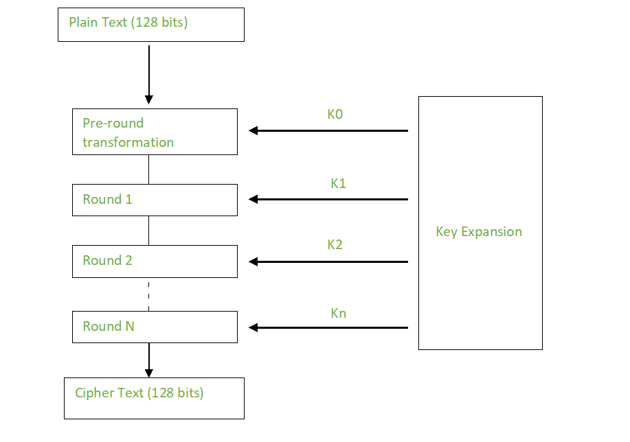

# Assignment 1

## <mark> 1) Explain all key objectives of cryptography. </mark>

The key objectives of cryptography, often referred to as the "CIA triad" and sometimes expanded, are:

- **Confidentiality:** This ensures that only authorized parties can access and read the data. It prevents unauthorized disclosure of sensitive information. Cryptography achieves this through encryption, transforming plaintext into ciphertext that is unreadable without the correct decryption key.

- **Integrity:** This guarantees that data is not altered or tampered with during transmission or storage. It ensures that the data received is exactly the same as the data sent. Cryptographic hash functions are often used to provide integrity. These functions create a unique "fingerprint" of the data, and any change to the data will result in a different fingerprint.

- **Authentication:** This verifies the identity of the sender or user. It ensures that the data originates from the claimed source and not from an imposter. Digital signatures and certificates are commonly used for authentication.

- **Non-Repudiation:** This prevents a sender from denying that they sent a message or a recipient from denying that they received it. It provides undeniable proof of the origin and delivery of data. Digital signatures also play a crucial role in non-repudiation.

Sometimes, these are also considered objectives:

- **Access Control:** While related to confidentiality, access control specifically restricts access to information based on user privileges. It determines who is allowed to access what data and what they are allowed to do with it.

- **Availability:** This ensures that authorized users can access the data and systems when needed. While not strictly a cryptographic objective, it's often considered alongside the CIA triad as a crucial security goal. Cryptography can indirectly contribute to availability by protecting systems from attacks that could disrupt service.

In summary, cryptography aims to protect information and systems by ensuring confidentiality, integrity, authentication, and non-repudiation, and often contributes to access control and availability. These objectives work together to provide a comprehensive security framework.

## <mark> 2) Encrypt using HILL CIPHER the P.T “ATTACK CHINAA” using the key=GYDNSKURT </mark>

To encrypt the plaintext "ATTACK CHINAA" using the Hill Cipher with the key "GYDNSKURT", follow these steps:

### Key Matrix Setup

1. **Convert Key Letters to Numbers** (A=0, B=1, ..., Z=25):
   - G=6, Y=24, D=3, N=13, S=18, K=10, U=20, R=17, T=19
2. **Arrange into a 3x3 Matrix**:
   ```
   [ 6  24   3 ]
   [13  18  10 ]
   [20  17  19 ]
   ```

### Plaintext Preparation

1. **Remove Spaces**: "ATTACKCHINAA" (12 letters).
2. **Convert to Numbers**:
   - A=0, T=19, T=19, A=0, C=2, K=10, C=2, H=7, I=8, N=13, A=0, A=0
3. **Group into 3-letter Blocks**:
   - [0, 19, 19], [0, 2, 10], [2, 7, 8], [13, 0, 0]

### Encryption Process (Matrix Multiplication mod 26)

1. **First Block [0, 19, 19]**:

   - Calculations:
     - (6×0 + 24×19 + 3×19) mod 26 = 513 mod 26 = **19 (T)**
     - (13×0 + 18×19 + 10×19) mod 26 = 532 mod 26 = **12 (M)**
     - (20×0 + 17×19 + 19×19) mod 26 = 684 mod 26 = **8 (I)**
   - Result: **T M I**

2. **Second Block [0, 2, 10]**:

   - Calculations:
     - (6×0 + 24×2 + 3×10) mod 26 = 78 mod 26 = **0 (A)**
     - (13×0 + 18×2 + 10×10) mod 26 = 136 mod 26 = **6 (G)**
     - (20×0 + 17×2 + 19×10) mod 26 = 224 mod 26 = **16 (Q)**
   - Result: **A G Q**

3. **Third Block [2, 7, 8]**:

   - Calculations:
     - (6×2 + 24×7 + 3×8) mod 26 = 204 mod 26 = **22 (W)**
     - (13×2 + 18×7 + 10×8) mod 26 = 232 mod 26 = **24 (Y)**
     - (20×2 + 17×7 + 19×8) mod 26 = 311 mod 26 = **25 (Z)**
   - Result: **W Y Z**

4. **Fourth Block [13, 0, 0]**:
   - Calculations:
     - (6×13 + 24×0 + 3×0) mod 26 = 78 mod 26 = **0 (A)**
     - (13×13 + 18×0 + 10×0) mod 26 = 169 mod 26 = **13 (N)**
     - (20×13 + 17×0 + 19×0) mod 26 = 260 mod 26 = **0 (A)**
   - Result: **A N A**

### Final Ciphertext

Combine all blocks: **TMIAGQWYZANA**

**Answer:**  
The encrypted ciphertext is $\boxed{TMIAGQWYZANA}$.

## <mark> 3) Differentiate between a block cipher and a stream cipher. </mark>

| Feature           | Block Cipher                                | Stream Cipher                            |
| ----------------- | ------------------------------------------- | ---------------------------------------- |
| Data Unit         | Fixed-size blocks (e.g., 128 bits)          | Bits or bytes                            |
| Operation         | Complex transformations on blocks           | Keystream generation and XOR operation   |
| Security          | Generally higher, well-studied algorithms   | Relies heavily on keystream randomness   |
| Speed             | Slower, especially for small data amounts   | Faster, suitable for real-time apps      |
| Error Propagation | Can affect multiple blocks (in some modes)  | Limited to affected bits/bytes           |
| Implementation    | More complex, requires padding              | Simpler to implement                     |
| Memory Usage      | Can require more memory for block buffering | Typically less memory intensive          |
| Examples          | AES, DES, Blowfish, Twofish                 | RC4 (insecure), Salsa20, ChaCha20, Grain |
| Use Cases         | File encryption, data at rest, bulk data    | Real-time communication, data in transit |

## <mark> 4) Define Active and Passive attacks with Examples. </mark>

You got it! Here's a breakdown of active and passive attacks with examples:

**Passive Attacks**

- **Nature:** The attacker observes or monitors the communication or data without altering it in any way. Think of it like eavesdropping. The goal is to gather information without being detected.
- **Impact:** Primarily affects confidentiality. The attacker might steal sensitive data, but the system or data remains intact.
- **Detection:** Difficult to detect since the attacker leaves no trace of modification.
- **Examples:**
  - **Eavesdropping:** Intercepting network traffic to capture usernames, passwords, or other sensitive information.
  - **Traffic Analysis:** Monitoring network communication patterns to infer information about the communicating parties, even if the content is encrypted.
  - **Network Scanning:** Using tools to probe a network for vulnerabilities without actively exploiting them.

**Active Attacks**

- **Nature:** The attacker actively modifies the data or system, or disrupts the communication. They interact with the target system.
- **Impact:** Affects integrity, availability, and potentially confidentiality. The attacker might alter data, disrupt services, or gain unauthorized access.
- **Detection:** Easier to detect compared to passive attacks, as they often leave evidence of their actions.
- **Examples:**
  - **Denial-of-Service (DoS) attack:** Flooding a system with traffic to make it unavailable to legitimate users.
  - **Man-in-the-Middle (MitM) attack:** Intercepting communication between two parties and potentially altering the messages.
  - **Masquerade attack:** Impersonating a legitimate user to gain unauthorized access to a system.
  - **Data Modification:** Changing data in transit or storage, such as altering financial records.
  - **Replay attack:** Capturing and re-sending legitimate data to cause an unwanted action.

**Here's a table summarizing the key differences:**

| Feature         | Passive Attack        | Active Attack                            |
| --------------- | --------------------- | ---------------------------------------- |
| **Goal**        | Information gathering | Modification or disruption               |
| **Impact**      | Confidentiality       | Integrity, availability, confidentiality |
| **Detection**   | Difficult             | Easier                                   |
| **Interaction** | Observation           | Interaction and modification             |

**Key Takeaway:**

- Passive attacks are about "listening in" without being noticed.
- Active attacks are about "doing something" that changes the system or data.

It's important to remember that passive attacks can sometimes be a precursor to active attacks. The information gathered passively might be used to plan and execute a more damaging active attack.

## <mark> 5) Explain Transposition Technique. </mark>

A transposition technique is a type of encryption where the _order_ of the plaintext characters is rearranged to create the ciphertext. The characters themselves are not substituted with other characters, but their positions are shuffled according to a specific rule. This makes it a form of _permutation cipher_.

Here's a breakdown of how transposition works:

**Basic Principle:**

Transposition ciphers work by rearranging the plaintext characters according to a key. This key determines the specific permutation or shuffling of the characters.

**Common Methods:**

1. **Columnar Transposition:**

   - The plaintext is written into a grid, row by row, under a keyword.
   - The columns are then rearranged based on the alphabetical order of the keyword letters.
   - The ciphertext is read column by column.

   _Example:_

   Plaintext: "ATTACKATDAWN"
   Keyword: "ZEBRA"

   ```
   Z E B R A
   A T T A C
   K A T D A
   W N
   ```

   Rearrange columns based on keyword order (Z=5, E=2, B=1, R=4, A=3):

   ```
   B E A R Z
   T T C A A
   A D A T K
   N   W
   ```

   Ciphertext: "TTANADCTATAKW"

2. **Rail Fence Cipher:**

   - The plaintext is written diagonally downwards and then upwards, resembling a fence.
   - The ciphertext is formed by reading the characters row by row.

   _Example:_

   Plaintext: "ATTACKATDAWN"
   Rails: 3

   ```
   A . . C . . D . .
   . T . A . T . A . N
   . . K . . K . . W
   ```

   Ciphertext: "ACDTATAN" + "TAATN" + "KKW" (or combined: "ACDTATANTAATNKKW")

3. **Route Cipher:**

   - The plaintext is written into a grid in a specific pattern (e.g., spiral, diagonal).
   - The ciphertext is read out in a different pattern.

**Key Points about Transposition:**

- **Key is Crucial:** The security of a transposition cipher depends entirely on the secrecy of the key. A weak or easily guessed key makes the cipher vulnerable.
- **Simple but Not Very Secure:** Transposition ciphers alone are generally not considered very secure, especially against frequency analysis. They are often used in combination with substitution ciphers to create stronger encryption.
- **Easy to Implement:** Transposition techniques are relatively simple to implement, both manually and using computers.

**Example of Combining Transposition and Substitution:**

A common approach is to first apply a transposition cipher and then follow it with a substitution cipher (like a Caesar cipher). This combination makes the encryption significantly stronger.

In summary, transposition is a valuable cryptographic technique, but it is most effective when combined with other methods like substitution. It provides a way to scramble the order of characters, adding another layer of complexity to the encryption process.

## <mark> 6) Elaborate AES encryption with neat sketches. </mark>

The Advanced Encryption Standard (AES) is a symmetric block cipher widely used for securing sensitive data. It operates on 128-bit blocks of data and supports key sizes of 128, 192, and 256 bits. Here's a breakdown of the AES encryption process with sketches:

**1. Overall Structure**

AES encryption involves multiple rounds of operations. The number of rounds depends on the key size:

- 128-bit key: 10 rounds
- 192-bit key: 12 rounds
- 256-bit key: 14 rounds

Each round consists of four main transformations:

**2. Detailed Steps**

**a) AddRoundKey**

- The input data (plaintext or output from the previous round) is XORed with a round key derived from the main encryption key.
- This is the only step that involves the key directly.

**b) SubBytes**

- Each byte of the data is substituted with another byte using a substitution table called the S-box.
- This is a non-linear transformation that provides confusion, making it difficult to analyze the relationship between the plaintext and ciphertext.

**c) ShiftRows**

- The rows of the data matrix are cyclically shifted to the left.
- The first row is not shifted, the second row is shifted by one byte, the third row by two bytes, and the fourth row by three bytes.
- This step provides diffusion, spreading the influence of each byte across the entire data block.

**d) MixColumns**

- Each column of the data matrix is transformed using a matrix multiplication in GF(2^8).
- This step further contributes to diffusion by mixing the bytes within each column.
- This step is skipped in the last round.

**3. Key Schedule**

- The main encryption key is used to generate a set of round keys, one for each round.
- The key schedule involves a series of operations, including rotations, substitutions, and XOR operations.

**4. AES Encryption Process**



**5. Security of AES**

- AES is considered highly secure and has not been cryptanalyzed successfully.
- Its resistance to attacks is due to its combination of substitution and permutation operations, as well as the key schedule.
- The use of multiple rounds and different key sizes provides flexibility and strength.

**6. Applications of AES**

- AES is used in a wide range of applications, including:
  - Data at rest encryption (disk encryption, database encryption)
  - Data in transit encryption (TLS/SSL, VPNs)
  - Wireless security (Wi-Fi Protected Access)
  - File encryption
  - Secure storage of passwords

**In summary,** AES is a robust and versatile encryption algorithm that provides strong protection for sensitive data. Its combination of substitution, permutation, and key mixing operations makes it highly resistant to cryptanalysis.

## <mark> 7) Explain any four Block cipher Mode operations. </mark>

Let's explore four common block cipher modes of operation:

**1. Electronic Codebook (ECB)**

- **How it works:** The plaintext is divided into blocks, and each block is encrypted independently with the same key. Think of it like using the same codebook entry for every message.
- **Advantages:** Simple to implement, parallel encryption of blocks is possible.
- **Disadvantages:** Identical plaintext blocks will produce identical ciphertext blocks. This can reveal patterns in the data, making it vulnerable to analysis. ECB is generally _not recommended_ for most applications due to this weakness.
- **Use Cases:** Only suitable for very short data or situations where patterns don't matter (e.g., encrypting a small, random key).

**2. Cipher Block Chaining (CBC)**

- **How it works:** Each plaintext block is XORed with the ciphertext of the _previous_ block before encryption. An Initialization Vector (IV) is used for the first block.
- **Advantages:** Identical plaintext blocks will produce different ciphertext blocks, enhancing security. CBC is widely used and generally considered secure.
- **Disadvantages:** Encryption is sequential (cannot be parallelized). An error in one block will affect subsequent blocks.
- **Use Cases:** Widely used for general-purpose encryption, including file encryption and secure communication.

**3. Cipher Feedback (CFB)**

- **How it works:** A shift register is used to generate a keystream. The keystream is XORed with the plaintext block to produce the ciphertext. The ciphertext block is then fed back into the shift register.
- **Advantages:** Can encrypt data in smaller units than a full block (e.g., bytes or bits). Useful for streaming data.
- **Disadvantages:** Encryption is sequential. An error in one block will affect subsequent blocks.
- **Use Cases:** Streaming data encryption, situations where block size is inconvenient.

**4. Output Feedback (OFB)**

- **How it works:** Similar to CFB, a shift register generates a keystream. However, instead of feeding the ciphertext back into the register, the _output_ of the shift register is fed back.
- **Advantages:** Keystream generation can be done independently of the plaintext, allowing for parallel keystream generation. Errors are limited to the affected block.
- **Disadvantages:** Encryption is still sequential.
- **Use Cases:** Similar to CFB, but OFB is sometimes preferred when error propagation is a major concern. Less common than CFB in modern practice.

**Summary Table:**

| Mode | Description                                         | Advantages                                               | Disadvantages                                             | Use Cases                                      |
| ---- | --------------------------------------------------- | -------------------------------------------------------- | --------------------------------------------------------- | ---------------------------------------------- |
| ECB  | Each block encrypted independently                  | Simple, parallel encryption                              | Identical plaintext gives identical ciphertext (insecure) | Not recommended for most uses                  |
| CBC  | Each block XORed with previous ciphertext           | Strong security, different ciphertext for same plaintext | Sequential encryption, error propagation                  | General-purpose encryption                     |
| CFB  | Keystream XORed with plaintext, ciphertext fed back | Can encrypt smaller units                                | Sequential encryption, error propagation                  | Streaming data                                 |
| OFB  | Keystream XORed with plaintext, keystream fed back  | Parallel keystream generation, limited error propagation | Sequential encryption                                     | Situations where error propagation is critical |

**Important Note:** Modern cryptography tends to favor authenticated encryption modes (like GCM or CCM) which combine confidentiality with integrity and authentication. While these modes are built upon the underlying block cipher modes, they provide stronger security guarantees. So, while understanding the basic modes is important, for most real-world applications, you should consider authenticated encryption.
