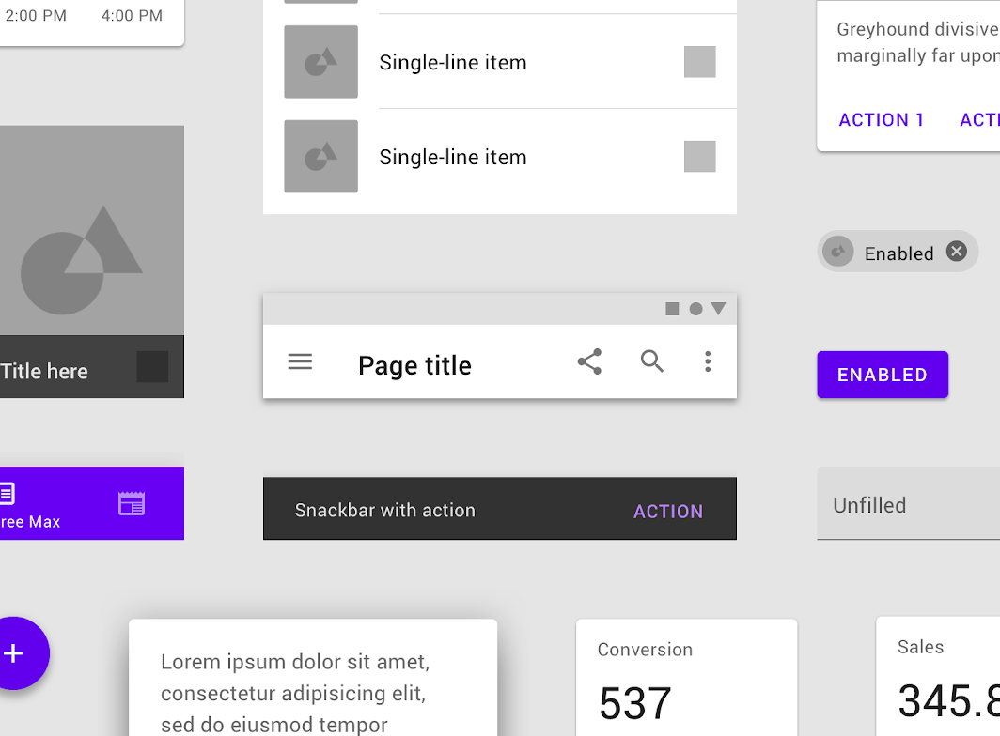

# Assignment 2

## <mark> 1) Explain menu and their types.

**Menus in Android**

In Android, menus are a crucial part of the user interface, providing users with options and actions within your application. They offer a structured way to present choices and functionalities.

**Types of Menus in Android:**

1. **Options Menu:**

   - **Location:** Located in the app bar (usually at the top of the screen).
   - **Access:** Accessed by tapping the three vertical dots (overflow menu) in the app bar.
   - **Purpose:** Provides general app-level options, such as settings, help, and about.

2. **Context Menu:**

   - **Location:** Appears when you long-press on a specific item or view within an Activity.
   - **Purpose:** Offers actions specific to the selected item, such as "Copy," "Paste," "Delete," or "Share."

3. **Popup Menu:**

   - **Location:** Appears as a floating menu anchored to a specific View (e.g., a button).
   - **Purpose:** Provides a list of options related to that particular View.

4. **Navigation Drawer:**
   - **Location:** A panel that slides in from the edge of the screen (usually the left side).
   - **Purpose:** Offers a navigation menu with a list of major sections or activities within the app.

**Creating Menus in Android**

- **XML Files:** Menus are typically defined in XML files (e.g., `menu/my_menu.xml`).
- **Inflating Menus:** You inflate the menu XML file in your Activity's `onCreateOptionsMenu()` method.
- **Handling Menu Selections:** You override the `onOptionsItemSelected()` method to handle menu item selections.

**Example (Options Menu):**

**menu/my_menu.xml:**

```xml
<?xml version="1.0" encoding="utf-8"?>
<menu xmlns:android="http://schemas.android.com/apk/res/android">
    <item
        android:id="@+id/action_settings"
        android:title="@string/action_settings"
        app:showAsAction="never" />
</menu>
```

**Activity Code:**

```java
@Override
public boolean onCreateOptionsMenu(Menu menu) {
    getMenuInflater().inflate(R.menu.my_menu, menu);
    return true;
}

@Override
public boolean onOptionsItemSelected(MenuItem item) {
    int id = item.getItemId();
    if (id == R.id.action_settings) {
        // Handle settings action
        return true;
    }
    return super.onOptionsItemSelected(item);
}
```

**Key Points:**

- Menus provide a structured and user-friendly way to present options and actions within your app.
- Choose the appropriate menu type based on your specific needs and the user experience.
- Follow Android's design guidelines for consistent and intuitive menu usage.

## <mark> 2) Explain screen navigation.

**Screen Navigation in Android**

Screen navigation in Android refers to the way users move between different screens or activities within an application. It's a crucial aspect of the user experience, as it directly impacts how easily users can interact with and understand the app's structure.

**Key Concepts:**

- **Activities:** In Android, each screen is typically represented by an Activity. Activities are the fundamental building blocks of an Android application.
- **Intents:** Intents are messages that allow you to communicate between different components within your application or even with components in other applications. They are used to start new Activities.
- **Back Stack:** The Android system maintains a back stack of Activities. When a new Activity is started, it's pushed onto the top of the stack. The Back button navigates through this stack, allowing users to return to previously visited Activities.

**Common Navigation Patterns:**

1. **Hierarchical Navigation:**

   - **Structure:** Activities are organized in a hierarchical structure, like a tree.
   - **Example:** A settings screen might have sub-screens for Wi-Fi, Bluetooth, and other settings.
   - **Navigation:** Users typically navigate forward through the hierarchy and use the Back button to return to previous screens.

2. **Tab Navigation:**

   - **Structure:** Multiple Activities or fragments are grouped under tabs at the bottom or top of the screen.
   - **Example:** A news app might have tabs for "Top Stories," "Local News," and "Business."
   - **Navigation:** Users can easily switch between tabs to access different sections of the app.

3. **Drawer Navigation:**

   - **Structure:** A panel that slides in from the edge of the screen, typically containing a list of navigation options.
   - **Example:** A social media app might use a drawer to access features like profile, settings, and messages.
   - **Navigation:** Users can open the drawer to access different sections of the app.

4. **Bottom Navigation:**
   - **Structure:** A bar at the bottom of the screen with icons representing different sections of the app.
   - **Example:** Many apps use bottom navigation for core sections like Home, Search, and Profile.
   - **Navigation:** Users can tap on the icons to quickly switch between sections.

**Best Practices for Screen Navigation:**

- **Clear and Consistent:** Use consistent navigation patterns throughout the app to make it easier for users to understand and navigate.
- **Predictable:** Users should be able to easily predict the outcome of their navigation actions.
- **Back Button Behavior:** Ensure that the Back button behaves as expected, taking users back to the previous screen in the navigation hierarchy.
- **Avoid Deep Nesting:** Keep the navigation hierarchy relatively shallow to prevent users from getting lost.
- **Provide Feedback:** Use visual cues and animations to provide feedback to the user during navigation transitions.

By following these best practices, you can create a seamless and intuitive navigation experience for your users, making your Android app more enjoyable and user-friendly.

## <mark> 3) Explain material design with example.

**Material Design** is a comprehensive design language developed by Google that provides a unified and modern visual, motion, and interaction guide for building digital experiences across various platforms. It's inspired by the principles of paper and ink, aiming to bring the tactile qualities of physical materials into the digital realm.

**Key Principles of Material Design:**

1. **Material as Metaphor:**

   - The core concept is that digital elements behave like physical materials, such as paper and ink.
   - This creates a sense of depth and realism, making the interface more intuitive and engaging.

2. **Bold, Graphic, and Intentional:**

   - Material Design emphasizes bold colors, strong typography, and clear visual hierarchy to guide the user's attention.
   - The design is intentional, with every element serving a purpose and contributing to the overall user experience.

3. **Motion:**
   - Motion is used to provide visual feedback and create a sense of fluidity and responsiveness.
   - Transitions and animations are carefully designed to be subtle and meaningful, enhancing the user experience.

**Key Elements of Material Design:**

1. **Material:**

   - The fundamental building block of Material Design, representing a physical surface with depth and dimension.
   - Materials can be layered, cast shadows, and interact with light and motion.

2. **Layout:**

   - A grid-based system for organizing content, creating a sense of order and consistency.
   - Uses keylines and margins to ensure visual consistency across different screen sizes.

3. **Color:**

   - A vibrant and expressive color palette that evokes emotion and guides the user's attention.
   - Uses a primary color palette for branding and accent colors for emphasis.

4. **Typography:**

   - Clear and legible typography that enhances readability and creates a consistent visual hierarchy.
   - Uses a limited set of font families for a cohesive look and feel.

5. **Icons:**
   - Simple, meaningful icons that communicate information quickly and effectively.
   - Adhere to a consistent style and size for a unified visual language.

**Example: Google Maps**

- **Material as Metaphor:** The map itself is presented as a material surface, with layers of information (roads, buildings, points of interest) appearing to be overlaid on top.
- **Bold, Graphic, and Intentional:** The interface is clean and uncluttered, with bold colors and clear typography guiding the user's attention to the map.
- **Motion:** Smooth transitions and animations are used to enhance the user experience, such as when zooming in or out on the map.
- **Layout:** The map is organized using a grid-based layout, with keylines and margins ensuring a consistent and visually appealing presentation.

**In essence, Material Design is a comprehensive system that combines aesthetics, functionality, and user experience to create beautiful and intuitive digital products.** It has had a significant impact on the design of Android apps and has influenced the design of many other digital products across various platforms.



**(Just for reference, no need to draw in assignment)**

## <mark> 4) Explain localization with example.

**Localization in Android**

Localization in Android involves adapting your app to specific languages and regions. This ensures a better user experience for users worldwide by presenting content in their native language, respecting cultural norms, and considering regional preferences.

**Key Aspects of Localization:**

1. **Language Translation:**

   - **Strings:** Translate all user-facing text, including labels, buttons, messages, and menu items.
   - **Plurals:** Handle plural forms correctly for different languages (e.g., "1 apple" vs. "2 apples").

2. **Date, Time, and Number Formatting:**

   - **Formats:** Adjust date, time, and number formats according to regional conventions (e.g., date formats, currency symbols).

3. **Currency:**

   - **Symbols and Formats:** Display currency symbols and amounts correctly for different regions.

4. **Images and Graphics:**

   - **Cultural Sensitivity:** Avoid images or graphics that may be culturally insensitive or inappropriate in certain regions.
   - **Text in Images:** Translate text within images if necessary.

5. **Layout and Design:**
   - **Text Direction:** Support languages that are written right-to-left (e.g., Arabic, Hebrew).
   - **Layout Adjustments:** Adjust layout to accommodate longer or shorter translations in different languages.

**Example: Localizing a Simple App**

Let's say you have a simple Android app with a "Hello, World!" message.

1. **Create Resource Files:**

   - Create a `strings.xml` file in the `res/values` folder (this is the default language, usually English).
   - Create a `strings.xml` file in `res/values-fr` for French translations.
   - Create a `strings.xml` file in `res/values-es` for Spanish translations.

2. **Add Translations:**

   - **`strings.xml` (default):**
     ```xml
     <resources>
         <string name="hello_world">Hello, World!</string>
     </resources>
     ```
   - **`strings.xml` (French):**
     ```xml
     <resources>
         <string name="hello_world">Bonjour le monde!</string>
     </resources>
     ```
   - **`strings.xml` (Spanish):**
     ```xml
     <resources>
         <string name="hello_world">¡Hola, Mundo!</string>
     </resources>
     ```

3. **Use Translated Strings in Your Code:**

   - In your Activity's layout file (e.g., `activity_main.xml`):
     ```xml
     <TextView
         android:layout_width="wrap_content"
         android:layout_height="wrap_content"
         android:text="@string/hello_world" />
     ```

4. **Run the App:**
   - When the app runs on a device with the language set to French or Spanish, it will automatically load the corresponding translations.

**Key Considerations:**

- **Testing:** Thoroughly test your localized app on devices with different languages and locales.
- **Tools:** Utilize translation tools and services to streamline the translation process.
- **Cultural Sensitivity:** Always be mindful of cultural nuances and sensitivities when localizing your app.

By following these steps and considering the key aspects of localization, you can create an Android app that provides a seamless and enjoyable experience for users worldwide.

## <mark> 5) Explain recycler view with example.

**RecyclerView in Android**

In Android, a RecyclerView is a powerful and flexible view that's designed to efficiently display large lists of data. It's a significant improvement over the older ListView component, offering better performance and greater flexibility.

**Key Features of RecyclerView:**

- **Efficiency:**

  - Recycles views that are no longer visible on the screen, improving performance and reducing memory usage.
  - Uses a LayoutManager to efficiently position and measure items.

- **Flexibility:**

  - Supports various layout managers, such as LinearLayoutManager, GridLayoutManager, and StaggeredGridLayoutManager, allowing you to display data in different layouts.
  - Highly customizable: You can easily customize the appearance of items using custom ViewHolders.

- **Item Animations:**
  - Supports built-in item animations (like fade, slide, etc.) for smooth and visually appealing transitions.
  - Allows you to create custom item animations.

**Basic Structure:**

1. **Data Source:** A list or array containing the data to be displayed in the RecyclerView.
2. **RecyclerView:** The main view that displays the list of items.
3. **LayoutManager:** Controls the layout and positioning of items within the RecyclerView (e.g., LinearLayoutManager, GridLayoutManager).
4. **Adapter:** An adapter that connects the data source to the RecyclerView. It's responsible for creating ViewHolders for each item and binding data to those views.
5. **ViewHolder:** A class that holds the views for a single item in the RecyclerView.

**Example (Simple List):**

**1. Data Source:**

```java
List<String> data = Arrays.asList("Item 1", "Item 2", "Item 3", "Item 4", "Item 5");
```

**2. Adapter:**

```java
public class MyAdapter extends RecyclerView.Adapter<MyAdapter.MyViewHolder> {

    private List<String> mData;

    public MyAdapter(List<String> data) {
        this.mData = data;
    }

    @NonNull
    @Override
    public MyViewHolder onCreateViewHolder(@NonNull ViewGroup parent, int viewType) {
        View view = LayoutInflater.from(parent.getContext()).inflate(R.layout.item_layout, parent, false);
        return new MyViewHolder(view);
    }

    @Override
    public void onBindViewHolder(@NonNull MyViewHolder holder, int position) {
        String item = mData.get(position);
        holder.textView.setText(item);
    }

    @Override
    public int getItemCount() {
        return mData.size();
    }

    public static class MyViewHolder extends RecyclerView.ViewHolder {
        TextView textView;

        public MyViewHolder(@NonNull View itemView) {
            super(itemView);
            textView = itemView.findViewById(R.id.textView);
        }
    }
}
```

**3. Layout File (item_layout.xml):**

```xml
<?xml version="1.0" encoding="utf-8"?>
<LinearLayout xmlns:android="http://schemas.android.com/apk/res/android"
    android:layout_width="match_parent"
    android:layout_height="wrap_content"
    android:padding="16dp">

    <TextView
        android:id="@+id/textView"
        android:layout_width="match_parent"
        android:layout_height="wrap_content" />

</LinearLayout>
```

**4. Activity Code:**

```java
public class MainActivity extends AppCompatActivity {

    private RecyclerView recyclerView;
    private MyAdapter adapter;

    @Override
    protected void onCreate(Bundle savedInstanceState) {
        super.onCreate(savedInstanceState);
        setContentView(R.layout.activity_main);

        recyclerView = findViewById(R.id.recyclerView);
        recyclerView.setLayoutManager(new LinearLayoutManager(this));
        adapter = new MyAdapter(data);
        recyclerView.setAdapter(adapter);
    }
}
```

**Key Points:**

- RecyclerView is a powerful and efficient way to display lists of data in Android.
- It offers flexibility in terms of layout and customization.
- Understanding the basic components (RecyclerView, LayoutManager, Adapter, ViewHolder) is crucial for using RecyclerView effectively.

This is a basic example. You can customize it further by:

- Implementing different LayoutManagers (GridLayoutManager, StaggeredGridLayoutManager).
- Adding item animations.
- Creating more complex item layouts.
- Handling item clicks and long presses.
