# Assignment 1

## <mark> 1) What is Software Engineering? Explain the Evolving role of software with software crisis on the horizon and software myths. </mark>

### Software Engineering, Evolving Role of Software, and Software Crisis

**Software Engineering** is a systematic and disciplined approach to designing, developing, testing, and maintaining software systems. It involves applying engineering principles, techniques, and tools to ensure the quality, reliability, and efficiency of software products.

#### Evolving Role of Software

- **Ubiquity:** Software is increasingly pervasive in our lives, from smartphones and computers to automobiles, healthcare, and critical infrastructure.
- **Complexity:** Software systems are becoming more complex, with interconnected components and intricate functionalities.
- **Velocity:** The demand for new software and updates is constantly growing, requiring faster development cycles.

#### Software Crisis

The software crisis refers to the challenges and difficulties faced in the development and maintenance of software systems. These challenges include:

- **Cost Overruns:** Software projects often exceed their budgeted costs due to unforeseen complexities and delays.
- **Schedule Slippages:** Projects frequently miss their deadlines, leading to disruptions and missed opportunities.
- **Poor Quality:** Software products may contain bugs, errors, or security vulnerabilities, impacting user experience and reliability.
- **Lack of Maintainability:** Software systems can become difficult to modify or update over time, hindering their adaptability.

#### Software Myths

- **Myth:** "Adding more programmers to a late project will make it finish sooner."
- **Reality:** Adding more programmers can increase communication overhead and coordination challenges, potentially slowing down the project.
- **Myth:** "Early in the lifecycle, we should focus on writing code."
- **Reality:** Early planning, requirements analysis, and design are crucial for a successful software project.
- **Myth:** "We can fix any problems later."
- **Reality:** Defects and issues are more expensive and difficult to fix later in the development lifecycle.

By understanding the evolving role of software, recognizing the challenges of the software crisis, and debunking common myths, software engineers can adopt effective practices to develop high-quality, reliable, and maintainable software systems.

## <mark> 2) Explain Software Engineering as a Layered Technology. </mark>

### Software Engineering as a Layered Technology

**Software engineering** can be visualized as a layered technology, with each layer building upon the foundation of the previous one. This layered approach ensures a structured and systematic development process, leading to robust and maintainable software systems.

#### The Layers of Software Engineering

1. **The Process Layer:**

   - **Foundation:** Defines the framework for the entire software development lifecycle.
   - **Components:** Includes activities like requirements gathering, design, implementation, testing, and maintenance.
   - **Example:** Agile methodologies, waterfall model, iterative development.

2. **The Methods Layer:**

   - **Building on the Process Layer:** Provides specific techniques and tools for each stage of the software development process.
   - **Components:** Involves methodologies like object-oriented programming, structured programming, and design patterns.
   - **Example:** UML diagrams, data flow diagrams, use case diagrams.

3. **The Tools Layer:**
   - **Supporting the Methods Layer:** Offers software tools that aid in the implementation and management of the development process.
   - **Components:** Includes integrated development environments (IDEs), version control systems, testing frameworks, and project management tools.
   - **Example:** Visual Studio, Eclipse, Git, Jira.

#### Visual Representation

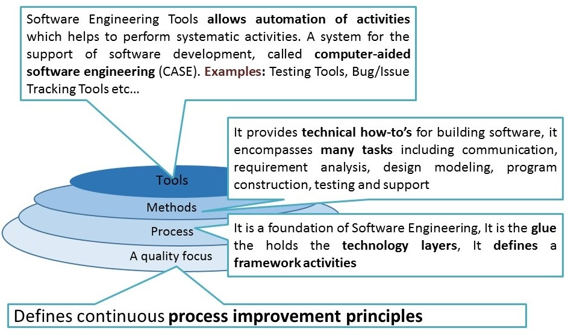

#### Key Benefits of the Layered Approach

- **Modularity:** Each layer has a specific function, making the development process more organized and manageable.
- **Flexibility:** Changes in one layer can be made without affecting the entire system.
- **Reusability:** Tools and methods can be reused across different projects.
- **Scalability:** The layered approach can be adapted to projects of varying sizes and complexities.

By understanding the layered structure of software engineering, developers can adopt a more structured and efficient approach to building high-quality software systems.

## <mark> 3) Define Software Development Life Cycle (Software Process Model) with suitable diagram. </mark>

**Software Development Life Cycle (SDLC)**

The Software Development Life Cycle (SDLC) is a systematic process used by software engineers to design, develop, test, and maintain software applications. It provides a structured framework that ensures the development process is efficient, effective, and produces high-quality software that meets user requirements.

**Key Phases of the SDLC:**

1. **Planning:**

   - Define project scope, goals, and objectives.
   - Conduct feasibility studies.
   - Estimate costs and resources.
   - Create a project plan.

2. **Requirements Analysis:**

   - Gather and analyze user requirements.
   - Create use cases and user stories.
   - Document requirements in a clear and concise manner.

3. **Design:**

   - Create a software architecture.
   - Design user interface and database.
   - Develop detailed design specifications.

4. **Implementation (Coding):**

   - Write code based on the design specifications.
   - Conduct unit testing to ensure individual components work correctly.

5. **Testing:**

   - Perform various types of testing, including integration testing, system testing, and user acceptance testing.
   - Identify and fix defects.

6. **Deployment:**

   - Release the software to the market or end-users.
   - Provide user support and training.

7. **Maintenance:**
   - Fix bugs and issues reported by users.
   - Add new features and enhancements.
   - Provide ongoing support and maintenance.

**Diagram of a Typical SDLC:**

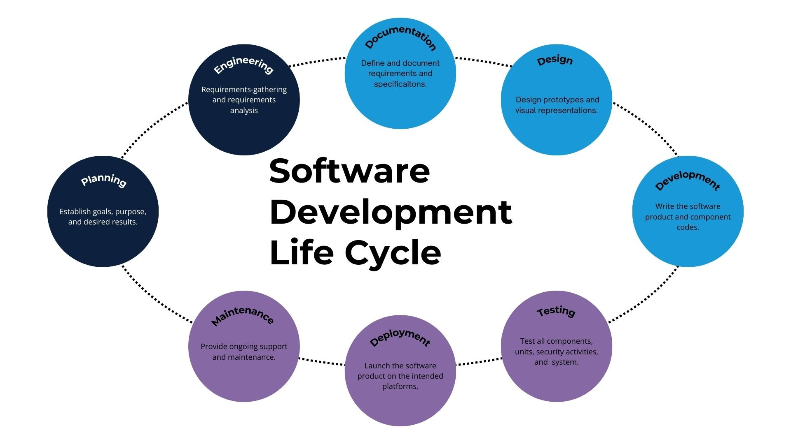

**Common SDLC Models:**

- **Waterfall Model:** A linear and sequential approach where each phase is completed before moving to the next.
- **Agile Model:** An iterative and incremental approach that emphasizes flexibility and collaboration.
- **Iterative Model:** Involves repeated cycles of development, allowing for feedback and improvement in each iteration.
- **Spiral Model:** Combines elements of the waterfall and iterative models, with an emphasis on risk management.
- **V-Model:** A variation of the waterfall model that emphasizes testing at each stage of development.

The choice of SDLC model depends on various factors, including project size, complexity, team expertise, and project constraints.

## <mark> 4) Explain Linear Sequential Model (Waterfall Model) with all the steps. </mark>

**Linear Sequential Model (Waterfall Model)**

The Waterfall Model is a classic software development approach that follows a linear, sequential flow, much like a cascading waterfall. In this model, each phase of the development process must be completed before moving on to the next, with minimal overlap between phases.

**Steps in the Waterfall Model:**

1. **Requirements Gathering and Analysis:**

   - This is the initial phase where the software's purpose, goals, and objectives are defined.
   - Detailed requirements are gathered from stakeholders, including users, customers, and other relevant parties.
   - These requirements are then analyzed, documented, and validated to ensure a clear understanding of the project's scope.

2. **System Design:**

   - Based on the gathered requirements, a high-level system design is created.
   - This involves defining the software's architecture, components, modules, and interfaces.
   - Detailed design specifications are created for each component, outlining its functionality, inputs, outputs, and behavior.

3. **Implementation (Coding):**

   - The actual coding of the software begins based on the design specifications.
   - Developers write code, conduct unit testing, and integrate individual components.
   - This phase focuses on translating the design into executable code.

4. **Testing:**

   - Once the coding is complete, rigorous testing is performed to identify and fix defects.
   - Different types of testing may be conducted, including unit testing, integration testing, system testing, and user acceptance testing.
   - The goal is to ensure the software meets the specified requirements and is free from major errors.

5. **Deployment:**

   - The tested software is deployed to the production environment or delivered to the end-users.
   - This may involve installation, configuration, and user training.
   - The software is made available for use by the intended audience.

6. **Maintenance:**
   - After deployment, ongoing maintenance is required to address bugs, issues, and enhancements.
   - This may involve bug fixes, performance tuning, and adding new features based on user feedback.
   - The software is continuously monitored and updated to ensure its continued functionality and reliability.

**Diagram of the Waterfall Model:**

**Advantages of the Waterfall Model:**

- Simple and easy to understand.
- Provides a clear structure and well-defined milestones.
- Suitable for smaller projects with well-defined requirements.

**Disadvantages of the Waterfall Model:**

- **Rigid:** Once a phase is completed, it's difficult to go back and make changes.
- **Risk of errors:** If requirements are not clearly defined upfront, it can lead to costly rework later in the process.
- **Limited flexibility:** The model is not well-suited for projects with evolving requirements or iterative development.

The Waterfall Model, while a classic approach, is often less suitable for complex projects with changing requirements or iterative development. More flexible models like Agile have gained popularity in recent years to address the limitations of the Waterfall Model.

## <mark> 5) Write short notes on Evolutionary Process Model and Concurrent Development Model. </mark>

### Short Notes on Evolutionary Process Model and Concurrent Development Model

#### Evolutionary Process Model

- **Core Concept:** Iterative and incremental development approach.
- **Process:**
  1. **Initial Planning:** Define basic requirements and goals.
  2. **Rapid Prototyping:** Develop a working prototype with core functionalities.
  3. **Customer Feedback:** Gather feedback from users on the prototype.
  4. **Refinement:** Refine and enhance the prototype based on feedback.
  5. **Repeat:** Repeat steps 3 and 4 until the final product is achieved.
- **Advantages:**
  - Adaptable to changing requirements.
  - Early user feedback leads to better product fit.
  - Reduced risk of major failures.
- **Disadvantages:**
  - Potential for scope creep if not managed well.
  - Requires strong user involvement.

#### Concurrent Development Model

- **Core Concept:** Multiple activities occur concurrently rather than sequentially.
- **Process:**
  - **Workflows:** Different activities (e.g., design, coding, testing) are represented as workflows.
  - **States:** Each activity can be in different states (e.g., new, in progress, completed).
  - **Triggers:** Events or conditions that trigger transitions between states.
- **Advantages:**
  - Better visualization of project status.
  - Increased flexibility and responsiveness to changes.
  - Improved communication and coordination.
- **Disadvantages:**
  - Complexity in managing multiple concurrent activities.
  - Requires specialized tools and training.

**In essence, the Evolutionary Process Model focuses on iterative development and user feedback, while the Concurrent Development Model emphasizes parallel activities and workflow management.**

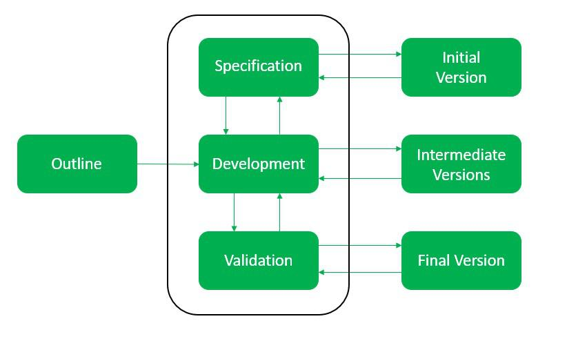

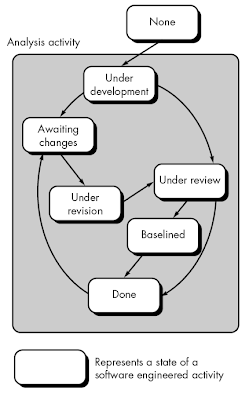

## <mark> 6) Explain RAD model and Incremental Model with Suitable Diagrams. </mark>

### RAD Model

**Rapid Application Development (RAD)** is a software development methodology that emphasizes rapid prototyping and iterative development. It aims to deliver functional systems quickly by using pre-built components and focusing on user feedback.

**Key Phases of RAD:**

1. **Business Modeling:** Define the business needs and processes.
2. **Data Modeling:** Identify and model the data required for the system.
3. **Process Modeling:** Define the business processes and how they will be automated.
4. **Application Generation:** Use tools to automatically generate code based on the models.
5. **Testing and Turnover:** Thoroughly test the system and deploy it to users.

**Diagram of RAD Model:**

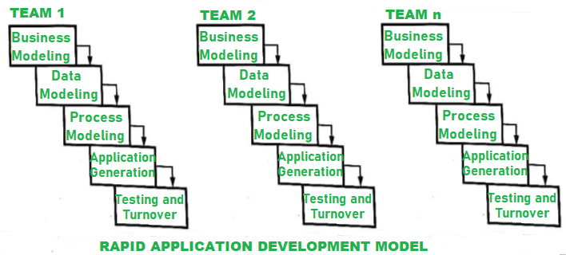

**Advantages of RAD:**

- **Rapid development:** Faster delivery of functional systems.
- **Increased user involvement:** Early and continuous user feedback.
- **Reduced development costs:** Re-use of existing components.
- **Flexibility:** Adaptable to changing requirements.

**Disadvantages of RAD:**

- **Requires skilled developers:** Expertise in RAD tools and techniques is essential.
- **Not suitable for all projects:** Best suited for projects with well-defined requirements and modular design.
- **Potential for scope creep:** If not managed well, the project scope may expand.

### Incremental Model

**Incremental Model** is a software development methodology where the product is developed in increments, with each increment delivering a portion of the required functionality. Each increment undergoes the complete software development cycle (requirements, design, implementation, testing).

**Key Phases of Incremental Model:**

1. **Identify and prioritize requirements:** Divide the requirements into smaller increments.
2. **Plan and design the first increment:** Develop the first increment in detail.
3. **Develop and test the first increment:** Implement and test the first increment.
4. **Deliver and gather feedback:** Deliver the first increment to users and gather feedback.
5. **Plan and develop the next increment:** Based on feedback, plan and develop the next increment.
6. **Repeat:** Repeat steps 3-5 until all requirements are implemented.

**Diagram of Incremental Model:**

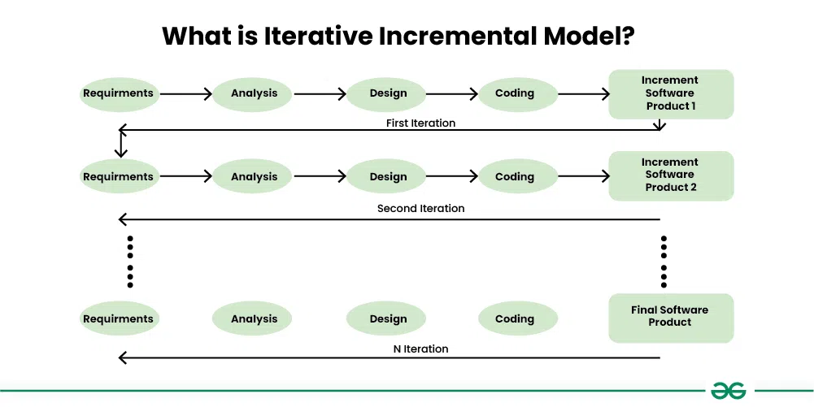

**Advantages of Incremental Model:**

- **Early delivery of functionality:** Users can start using the software early on.
- **Reduced risk:** Early identification and mitigation of risks.
- **Flexibility:** Adaptable to changing requirements.
- **Improved user satisfaction:** Regular feedback and updates.

**Disadvantages of Incremental Model:**

- **Requires careful planning:** Proper planning and prioritization of requirements is essential.
- **Potential for integration issues:** Integrating increments can be challenging.
- **Well-defined interfaces are crucial:** Clear interfaces between increments are necessary.

Both RAD and Incremental models are iterative and incremental approaches that emphasize user involvement and rapid delivery. The choice between them depends on factors such as project complexity, team expertise, and user requirements.

## <mark> 7) Explain the following models: (a) Prototype Model (b) Spiral Model </mark>

**a) Prototype Model**

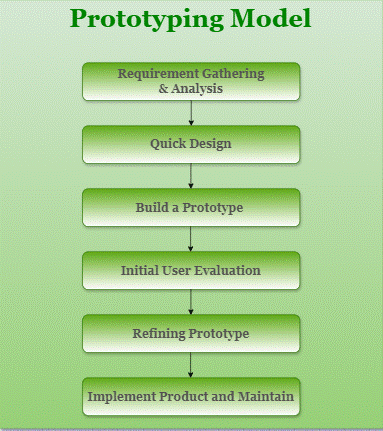

- **Core Concept:** This model focuses on building a working model (prototype) of the software quickly to get early user feedback and refine requirements.
- **Process:**
  1. **Requirements Gathering:** Gather initial requirements from users, which may be incomplete or ambiguous.
  2. **Rapid Prototyping:** Develop a quick prototype to demonstrate the basic functionalities.
  3. **User Evaluation:** Get feedback from users on the prototype.
  4. **Refinement:** Refine the prototype based on user feedback and iterate through steps 2 and 3 until the final product is achieved.
- **Advantages:**
  - Reduced risk of misunderstanding requirements.
  - Early user feedback leads to better product fit.
  - Increased user involvement and satisfaction.
- **Disadvantages:**
  - Potential for scope creep if not managed well.
  - May lead to overlooking important non-functional requirements.

**b) Spiral Model**

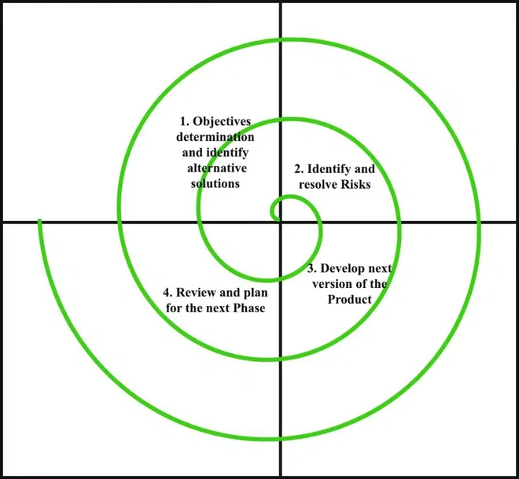

- **Core Concept:** Combines the iterative nature of prototyping with the controlled and systematic aspects of the waterfall model. It emphasizes risk management throughout the development process.
- **Process:**
  1. **Planning:** Define goals, alternatives, and constraints.
  2. **Risk Analysis:** Identify and assess potential risks.
  3. **Engineering:** Develop and verify the next level of the product.
  4. **Customer Evaluation:** Evaluate the progress and gather feedback.
- **Advantages:**
  - High risk management capability.
  - Adaptable to changing requirements.
  - Suitable for large and complex projects.
- **Disadvantages:**
  - Can be complex to manage.
  - Requires experienced personnel to assess and manage risks effectively.

## <mark> 8) Explain Component Based Development with an example. </mark>

### Component-Based Development (CBD)

**Component-Based Development (CBD)** is a software development approach that focuses on building software systems by assembling pre-existing, independent software components. These components are like modular building blocks that can be easily integrated and reused across different applications.

**Key Principles of CBD:**

- **Modularity:** Components are self-contained units with well-defined interfaces.
- **Independence:** Components can be developed and tested independently of other components.
- **Reusability:** Components can be reused in multiple applications, reducing development time and effort.
- **Standardization:** Components adhere to agreed-upon standards and interfaces.

**Benefits of CBD:**

- **Faster Development:** Reusing existing components speeds up the development process.
- **Reduced Costs:** Reduced development effort and increased productivity lead to lower costs.
- **Improved Quality:** Reusing proven components can lead to more reliable and robust systems.
- **Increased Flexibility:** Components can be easily replaced or upgraded, making the system more adaptable to change.

**Example: Building a Web Application**

Imagine you're building an e-commerce website. Instead of writing all the code from scratch, you can use pre-built components for common functionalities:

- **User Authentication:** A component for user login, registration, and password management.
- **Payment Gateway Integration:** A component for integrating with payment providers like PayPal or Stripe.
- **Shopping Cart:** A component for managing products in the shopping cart, calculating taxes, and applying discounts.
- **Search Functionality:** A component for implementing search capabilities on the website.

By using these pre-built components, you can significantly reduce development time and effort, as you don't need to reinvent the wheel for common functionalities.

**Diagram of Component-Based Development:**

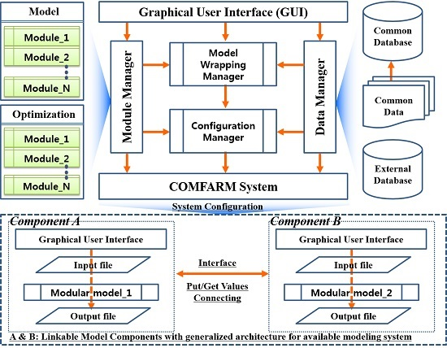

**In essence, CBD promotes a modular and efficient approach to software development by leveraging pre-built components, leading to faster development, reduced costs, and improved software quality.**

## <mark> 9) Differentiate between Product and Process. </mark>

**Product vs. Process**

| Feature        | Product                                           | Process                                                           |
| -------------- | ------------------------------------------------- | ----------------------------------------------------------------- |
| **Definition** | The tangible or intangible output of an activity. | A series of steps or actions taken to achieve a specific outcome. |
| **Focus**      | The final result or deliverable.                  | The method or approach used to create the product.                |
| **Nature**     | Concrete and measurable.                          | Abstract and often iterative.                                     |
| **Examples**   | Car, software, book, service                      | Manufacturing, software development, customer service             |

**In essence:**

- **Product:** What is being created.
- **Process:** How it is being created.

**Analogy:**

Imagine baking a cake:

- **Product:** The finished cake.
- **Process:** The recipe, the steps involved in mixing ingredients, baking, and decorating.

Understanding the distinction between product and process is crucial in various fields, including software engineering, manufacturing, and business management.

## <mark> 10) Describe Agile Process Model with example. </mark>

**Agile Process Model**

The Agile process model is a software development approach that emphasizes iterative development, customer collaboration, and flexible response to change. It breaks down projects into small, manageable iterations called "sprints," typically lasting 1-4 weeks.

**Key Principles of Agile:**

- **Individuals and interactions** over processes and tools
- **Working software** over comprehensive documentation
- **Customer collaboration** over contract negotiation
- **Responding to change** over following a plan

**Core Practices of Agile:**

- **Iteration:** Projects are divided into short iterations, allowing for frequent feedback and adjustments.
- **Incremental Development:** Software is delivered in small, incremental releases, providing early value to customers.
- **Daily Stand-up Meetings:** Brief daily meetings to discuss progress, challenges, and plans for the day.
- **Sprint Planning:** Meetings to plan the work for the upcoming sprint.
- **Sprint Review:** Demonstrations of the completed work to stakeholders.
- **Sprint Retrospective:** Meetings to reflect on the sprint and identify areas for improvement.

**Example: Developing a Mobile App**

Imagine a team developing a mobile app for ordering food. Using the Agile approach, they would:

1. **Break the project into sprints:** Each sprint might focus on a specific feature, such as user registration, restaurant search, or order placement.
2. **Develop and test incrementally:** At the end of each sprint, a working version of the app with the new features is delivered.
3. **Gather feedback:** User feedback is collected after each sprint and used to refine the product roadmap.
4. **Adapt to changes:** If market trends or user needs change, the team can quickly adjust the development plan accordingly.

**Diagram of Agile Process Model:**

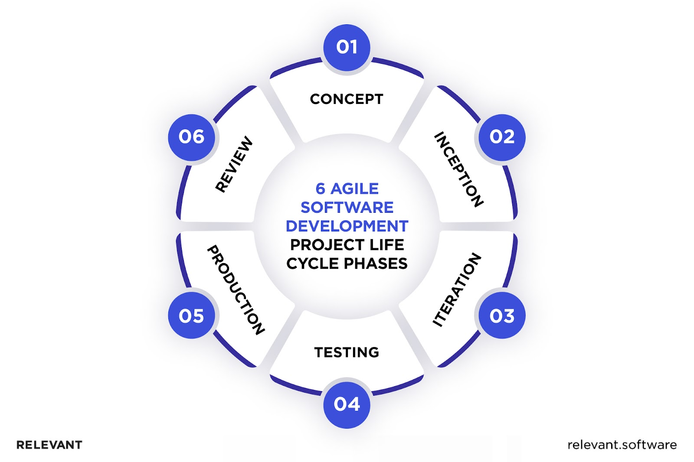

**Benefits of Agile:**

- **Flexibility:** Adaptable to changing requirements.
- **Early delivery of value:** Customers receive working software early on.
- **Increased customer satisfaction:** Continuous feedback and collaboration.
- **Improved team morale:** Empowers teams to make decisions and take ownership.

**In essence, the Agile process model provides a flexible and iterative approach to software development, enabling teams to deliver high-quality products that meet the evolving needs of customers.**

## <mark> 11) Explain Requirement analysis, specification and requirement modelling. </mark>

**1. Requirement Analysis**

- **Definition:** The process of identifying, documenting, and validating the specific needs and expectations of the stakeholders (users, customers, etc.) for a software system.
- **Key Activities:**
  - **Elicitation:** Gathering requirements from various sources (interviews, surveys, workshops, document analysis).
  - **Analysis:** Studying and understanding the gathered requirements, identifying conflicts, ambiguities, and inconsistencies.
  - **Negotiation:** Resolving conflicts and prioritizing requirements based on feasibility, cost, and value.
  - **Documentation:** Recording the agreed-upon requirements in a clear, concise, and unambiguous manner.

**2. Requirement Specification**

- **Definition:** A formal document that precisely describes the required functionalities, features, and constraints of a software system. It serves as a contract between the development team and the stakeholders.
- **Key Characteristics:**
  - **Complete:** All necessary requirements are included.
  - **Consistent:** No contradictions or ambiguities exist.
  - **Correct:** Accurately reflects the needs of the stakeholders.
  - **Unambiguous:** Clear and easy to understand.
  - **Verifiable:** Can be objectively tested and validated.
  - **Traceable:** Links between requirements and other project documents (e.g., design, test cases) can be established.

**3. Requirement Modeling**

- **Definition:** The process of creating visual representations of the software requirements using various modeling techniques.
- **Common Techniques:**
  - **Use Case Diagrams:** Illustrate the interactions between users and the system.
  - **Data Flow Diagrams (DFDs):** Show the flow of data through the system.
  - **Entity-Relationship Diagrams (ERDs):** Model the data entities and their relationships.
  - **State Diagrams:** Represent the different states of a system and the transitions between them.
- **Benefits:**
  - **Improved communication:** Visual models help stakeholders understand the requirements more easily.
  - **Early identification of issues:** Potential problems can be identified and addressed early in the development cycle.
  - **Better documentation:** Visual models provide a clear and concise representation of the requirements.

**In summary:**

- Requirement analysis is the process of gathering, analyzing, and documenting the needs of stakeholders.
- Requirement specification is the formal document that describes these requirements in detail.
- Requirement modeling involves creating visual representations of the requirements using various techniques.

By effectively performing requirement analysis, specification, and modeling, software development teams can ensure that they build systems that meet the needs of their users and achieve project success.

## <mark> 12) What are the characteristics of SRS? Write down the steps to write an SRS document. </mark>

**Characteristics of a Good SRS**

- **Correctness:** The requirements must accurately reflect the needs of the stakeholders.
- **Completeness:** All necessary requirements should be included, with no missing information.
- **Unambiguousness:** Requirements should be clearly stated and avoid ambiguity or vagueness.
- **Consistency:** No contradictions or conflicts should exist within the requirements.
- **Verifiability:** Requirements should be testable and measurable to ensure they are met.
- **Modifiability:** The SRS should be easy to update and change as requirements evolve.
- **Traceability:** Links between requirements and other project documents (e.g., design, test cases) should be maintained.
- **Clarity:** The SRS should be written in clear, concise, and easy-to-understand language.
- **Feasibility:** Requirements should be technically and economically feasible to implement.

**Steps to Write an SRS Document**

1. **Inception:**

   - **Identify Stakeholders:** Determine who will be using the software and who will be affected by it.
   - **Define Scope:** Clearly define the boundaries of the project, including what is and is not included.
   - **Gather Information:** Collect information from various sources, such as interviews, surveys, and existing documentation.

2. **Elicitation:**

   - **Conduct Interviews:** Interview stakeholders to understand their needs and expectations.
   - **Conduct Workshops:** Facilitate workshops to gather requirements from multiple stakeholders.
   - **Use Questionnaires and Surveys:** Collect data from a larger group of stakeholders.
   - **Analyze Existing Documentation:** Review existing documents, such as business plans and user manuals.

3. **Analysis:**

   - **Identify and Document Requirements:** Categorize requirements (functional, non-functional, user, system).
   - **Prioritize Requirements:** Determine the importance and urgency of each requirement.
   - **Resolve Conflicts:** Identify and resolve any conflicting requirements.
   - **Validate Requirements:** Ensure that requirements are accurate, complete, and consistent.

4. **Specification:**

   - **Write Clear and Concise Statements:** Use precise language and avoid ambiguity.
   - **Use Diagrams and Models:** Employ visual aids like use case diagrams, data flow diagrams, and state diagrams to illustrate requirements.
   - **Create a Table of Contents and Index:** Organize the document for easy navigation.
   - **Review and Approve:** Obtain approval from stakeholders on the final version of the SRS.

5. **Maintenance:**
   - **Track Changes:** Maintain a record of all changes made to the SRS.
   - **Regularly Review and Update:** Update the SRS as requirements evolve or change.

By following these steps and adhering to the characteristics of a good SRS, you can create a valuable document that serves as a foundation for successful software development.

## <mark> 13) What is the Requirement Engineering Process? List and explain requirement engineering tasks. </mark>

**Requirement Engineering Process**

Requirement Engineering is the systematic process of identifying, analyzing, documenting, and managing the needs and expectations of stakeholders for a software system. It's a crucial step in the software development lifecycle, as it ensures that the final product meets the needs of the users and achieves the project objectives.

**Key Tasks in Requirement Engineering**

1. **Feasibility Study:**

   - **Purpose:** To determine if the proposed software system is technically and economically feasible.
   - **Activities:**
     - Analyze project scope and objectives.
     - Assess technical feasibility (available technology, skills, etc.).
     - Evaluate economic feasibility (cost-benefit analysis, ROI).
     - Identify potential risks and challenges.

2. **Requirements Elicitation:**

   - **Purpose:** To gather information about the needs and expectations of stakeholders.
   - **Techniques:**
     - Interviews
     - Surveys
     - Focus groups
     - Workshops
     - Document analysis
     - Observation

3. **Requirements Analysis:**

   - **Purpose:** To analyze the gathered information, identify conflicts, ambiguities, and inconsistencies.
   - **Activities:**
     - Study and understand the requirements.
     - Identify and resolve conflicts among stakeholders.
     - Prioritize requirements based on importance and feasibility.
     - Create models (e.g., use case diagrams, data flow diagrams) to visualize requirements.

4. **Requirements Specification:**

   - **Purpose:** To document the agreed-upon requirements in a clear, concise, and unambiguous manner.
   - **Output:** Software Requirements Specification (SRS) document.
   - **Characteristics of a good SRS:** Correctness, completeness, consistency, unambiguity, verifiability, traceability, modifiability, clarity, feasibility.

5. **Requirements Validation:**

   - **Purpose:** To ensure that the requirements are correct, complete, and consistent.
   - **Techniques:**
     - Reviews and inspections
     - Prototyping
     - Walkthroughs
     - User feedback

6. **Requirements Management:**
   - **Purpose:** To track and manage changes to requirements throughout the project lifecycle.
   - **Activities:**
     - Maintain the SRS document.
     - Track and resolve change requests.
     - Communicate changes to stakeholders.

**Importance of Requirement Engineering**

- **Reduced Costs:** Early identification and resolution of issues can save significant costs later in the development cycle.
- **Improved Quality:** Ensures that the software meets the needs of users and achieves project objectives.
- **Increased Customer Satisfaction:** Better understanding of user needs leads to higher customer satisfaction.
- **Reduced Risk:** Early identification and mitigation of risks.
- **Improved Communication:** Provides a common understanding of requirements among stakeholders.

By following these steps and best practices, organizations can effectively conduct requirement engineering and ensure the successful development of high-quality software systems.

## <mark> 14) Describe Software design concepts and principles. </mark>

**Software Design Concepts**

- **Abstraction:**

  - Simplifying complex systems by focusing on essential features and ignoring irrelevant details.
  - Examples:
    - Defining a car as a vehicle without concerning yourself with its internal mechanics.
    - Creating a user interface that hides the underlying complexity of the system.

- **Encapsulation:**

  - Bundling data (attributes) and methods (operations) that operate on that data within a single unit (e.g., a class or object).
  - Hides the internal implementation details from the outside world.
  - Improves maintainability and reduces the impact of changes.

- **Modularity:**

  - Breaking down a large system into smaller, more manageable modules (components).
  - Each module has a specific responsibility and well-defined interfaces.
  - Improves code reusability, maintainability, and testability.

- **Inheritance:**

  - Creating new classes (subclasses) from existing ones (superclasses).
  - Subclasses inherit properties and behaviors from their parent classes.
  - Promotes code reusability and reduces redundancy.

- **Polymorphism:**
  - The ability of objects of different classes to be treated as objects of a common type.
  - Enables flexibility and extensibility in software design.

**Software Design Principles**

- **SOLID Principles:**

  - **Single Responsibility Principle (SRP):** A class should have only one reason to change.
  - **Open/Closed Principle (OCP):** Software entities should be open for extension but closed for modification.
  - **Liskov Substitution Principle (LSP):** Subtypes must be substitutable for their base types without altering the correctness of the program.
  - **Interface Segregation Principle (ISP):** Clients should not be forced to depend on interfaces they don't use.
  - **Dependency Inversion Principle (DIP):** High-level modules should not depend on low-level modules. Both should depend on abstractions.

- **DRY (Don't Repeat Yourself):** Avoid code duplication by extracting common logic into reusable components.

- **KISS (Keep It Simple, Stupid):** Favor simple and straightforward solutions over complex ones.

- **YAGNI (You Ain't Gonna Need It):** Avoid implementing features that are not currently required.

- **Law of Demeter:** An object should have limited knowledge of the objects it collaborates with.

**Key Considerations in Software Design**

- **Usability:** How easy is the software to use and learn?
- **Maintainability:** How easy is it to modify and update the software?
- **Reusability:** Can components of the software be reused in other projects?
- **Performance:** How efficiently does the software perform its tasks?
- **Testability:** How easily can the software be tested?

By following these concepts and principles, software developers can create well-structured, maintainable, and efficient software systems.

## <mark> 15) Define module coupling and cohesion. Explain different types of coupling and Cohesion. </mark>

**Coupling**

- **Definition:** Coupling refers to the degree of interdependence between software modules.
- **High Coupling:** Modules are highly dependent on each other. Changes in one module often necessitate changes in other modules. This makes the system difficult to maintain, understand, and test.
- **Low Coupling:** Modules are relatively independent. Changes in one module have minimal impact on other modules. This promotes modularity, reusability, and maintainability.

**Types of Coupling (from high to low):**

1. **Content Coupling:** One module directly modifies the internal data of another module. (Worst type)
2. **Common Coupling:** Two modules share the same global data area.
3. **Stamp Coupling:** One module passes a data structure to another module, and the receiving module uses only a portion of it.
4. **Data Coupling:** Modules communicate by passing simple data parameters.
5. **Message Coupling:** Modules communicate through well-defined interfaces using messages. (Best type)

**Cohesion**

- **Definition:** Cohesion measures the degree to which the elements within a single module are functionally related and work together to achieve a common goal.
- **High Cohesion:** All elements within a module are closely related and work together to achieve a single, well-defined function.
- **Low Cohesion:** A module performs unrelated tasks or has elements that are not closely related to its primary function.

**Types of Cohesion (from low to high):**

1. **Coincidental Cohesion:** Elements within a module are completely unrelated.
2. **Logical Cohesion:** Elements within a module are grouped together based on a logical association, but they don't necessarily belong together functionally.
3. **Temporal Cohesion:** Elements within a module are grouped together because they are executed at the same time, not because they are functionally related.
4. **Procedural Cohesion:** Elements within a module are grouped together because they are part of the same procedure or sequence of steps.
5. **Communicational Cohesion:** Elements within a module operate on the same data or use the same input/output.
6. **Functional Cohesion:** All elements within a module work together to achieve a single, well-defined function. (Best type)

**In summary:**

- **Strive for low coupling:** This promotes modularity, maintainability, and reusability.
- **Strive for high cohesion:** This makes modules more focused, easier to understand, and less prone to errors.

By carefully considering coupling and cohesion during the design phase, software developers can create more maintainable, flexible, and robust systems.

## <mark> 16) Explain Different Symbols of E-R Diagrams. Draw E-R diagram for University Examination System. </mark>

**Symbols Used in E-R Diagrams**

- **Entity:** Represented by a rectangle. An entity is a real-world object or concept that you want to track in your database. For example, "Student," "Course," "Department."
- **Attribute:** Represented by an oval or circle connected to an entity. Attributes are the properties or characteristics of an entity. For example, "Student_ID," "Name," "Course_Name," "Credits."
- **Relationship:** Represented by a diamond shape. A relationship shows how two or more entities are associated with each other. For example, "enrolled_in" between "Student" and "Course."
- **Cardinality:** Represented by symbols (0, 1, or N) on the lines connecting entities to relationships. It defines the number of instances of one entity that can be associated with instances of another entity.
  - **1:1:** One-to-one relationship (e.g., one student can have only one student ID).
  - **1:N:** One-to-many relationship (e.g., one instructor can teach many courses).
  - **N:M:** Many-to-many relationship (e.g., many students can enroll in many courses).
- **Primary Key:** Underlined attribute within an entity. It uniquely identifies each instance of that entity.
- **Foreign Key:** An attribute in one entity that references the primary key of another entity. It establishes a link between the two entities.

**E-R Diagram for University Examination System**

Here's a simplified E-R diagram for a University Examination System:

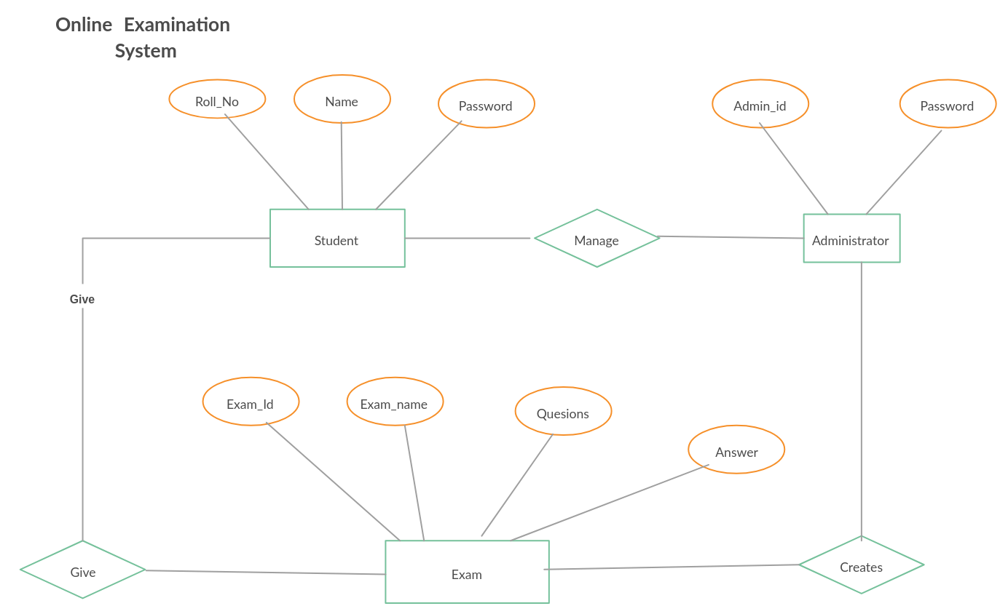

**Entities:**

- **Student:**
  - Attributes: Student_ID (Primary Key), Name, Address, Contact_No
- **Course:**
  - Attributes: Course_ID (Primary Key), Course_Name, Credits
- **Instructor:**
  - Attributes: Instructor_ID (Primary Key), Name, Department
- **Exam:**
  - Attributes: Exam_ID (Primary Key), Course_ID, Date, Time
- **Result:**
  - Attributes: Result_ID (Primary Key), Student_ID, Course_ID, Marks

**Relationships:**

- **Teaches:** Instructor 1:N Course
- **Enrolled_In:** Student N:M Course
- **Conducts:** Instructor 1:N Exam
- **Appears_In:** Student N:M Exam
- **Obtains:** Student 1:1 Result
- **Belongs_To:** Result 1:1 Exam

**Note:** This is a simplified representation. A real-world system would likely have more entities, attributes, and relationships, such as departments, subjects, grades, etc.

This E-R diagram visually represents the entities, attributes, and relationships involved in a university examination system, providing a foundation for designing the database schema.

## <mark> 17) List out all architectural design styles and explain any one in detail. </mark>

**List of Architectural Design Styles:**

- **Layered Architecture:**
- **Client-Server Architecture:**
- **Three-Tier Architecture:**
- **Peer-to-Peer Architecture:**
- **Event-Driven Architecture:**
- **Microservices Architecture:**
- **Service-Oriented Architecture (SOA):**
- **Cloud-Native Architecture:**
- **Data-Centric Architecture:**
- **Pipe and Filter Architecture:**
- **Model-View-Controller (MVC) Architecture:**

**Detailed Explanation: Client-Server Architecture**

**Client-Server Architecture** is a distributed software architecture where the application is divided into two main parts:

- **Client:** The client is the user interface or application that interacts with the user. It sends requests to the server and receives responses.
- **Server:** The server is a central computer or system that provides services to the clients. It manages data, processes requests, and sends responses back to the clients.

**Key Characteristics:**

- **Centralized Control:** The server controls access to data and resources.
- **Scalability:** Can be scaled by adding more servers to handle increased load.
- **Flexibility:** Clients can be located anywhere with network access.
- **Maintainability:** Easier to maintain and update the server than individual client applications.

**Examples:**

- **Web Applications:** Web browsers (clients) request web pages from web servers.
- **Email Systems:** Email clients send and receive emails through email servers.
- **Database Systems:** Client applications connect to a database server to access and manipulate data.

**Advantages:**

- **Centralized Data Management:** Ensures data consistency and security.
- **Improved Resource Sharing:** Allows efficient sharing of resources among multiple clients.
- **Enhanced Scalability:** Can easily accommodate a growing number of users.

**Disadvantages:**

- **Single Point of Failure:** If the server fails, all clients are affected.
- **Performance Bottlenecks:** Can experience performance issues if the server is overloaded.
- **Security Concerns:** The server can be a target for attacks.

**In summary:** Client-Server Architecture is a widely used and versatile architectural style that provides a robust and scalable solution for many software applications.

## <mark> 18) Draw Data Flow Diagram (DFD) of Level-0, Level-1 and Level-2 for Airlines Reservation System. </mark>

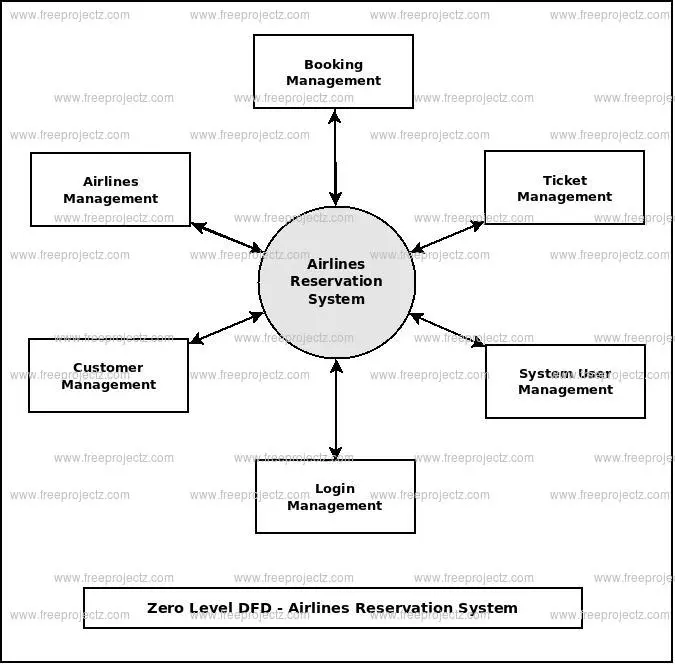

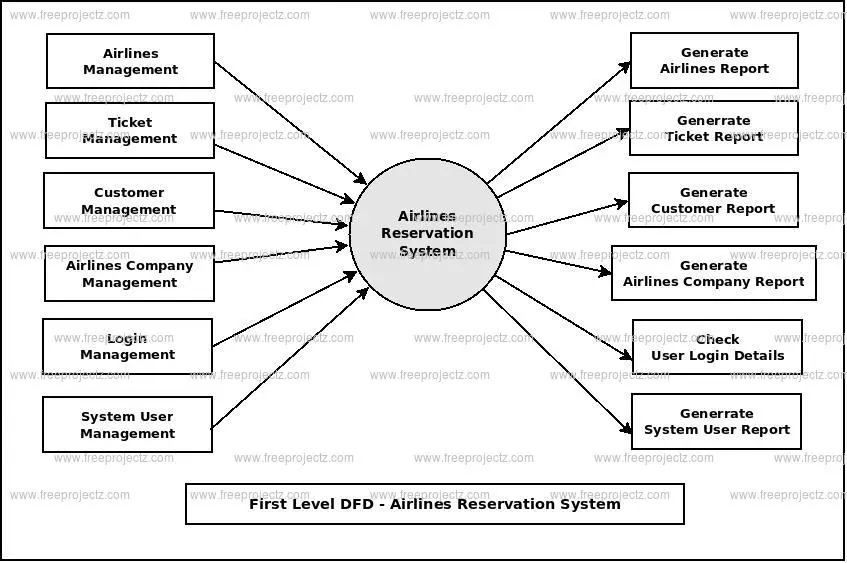

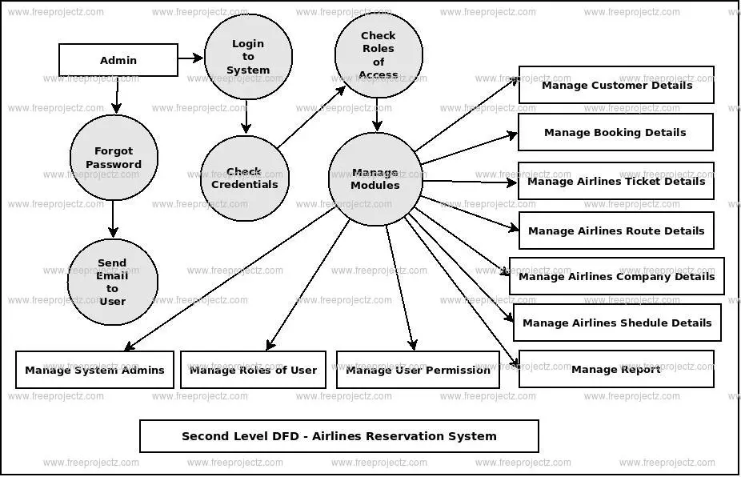

## <mark> 19) Explain functional oriented Design Approach. </mark>

**Functional Oriented Design Approach**

In functional-oriented design, the software system is decomposed into a set of interacting units or modules, where each unit has a clearly defined function. This approach focuses on identifying and organizing the system's functionalities.

**Key Concepts:**

- **Functions:** The core building blocks of the system. Each function performs a specific task and has well-defined inputs and outputs.
- **Data Flow:** The movement of data between functions. Data flows from one function to another as input and is transformed into output.
- **Modules:** Groups of related functions that work together to achieve a specific sub-goal of the system.
- **Decomposition:** The process of breaking down the overall system into smaller, more manageable functions and modules.

**Steps in Functional Oriented Design:**

1. **Problem Definition:** Clearly define the problem and the desired functionality of the system.
2. **Functional Decomposition:** Break down the system into a hierarchy of functions, starting with high-level functions and gradually refining them into more detailed sub-functions.
3. **Data Flow Analysis:** Identify the data flow between functions and determine the data structures required for input and output.
4. **Module Design:** Design the individual modules, specifying their inputs, outputs, and internal logic.
5. **Interface Design:** Define the interfaces between modules, including the data formats and communication protocols.

**Techniques Used in Functional Oriented Design:**

- **Data Flow Diagrams (DFDs):** Graphical representation of the flow of data through a system.
- **Structured English:** A formal language for describing the logic of a function.
- **Decision Tables:** Tabular representation of complex decision-making logic.

**Advantages of Functional Oriented Design:**

- **Modularity:** Enhances code reusability, maintainability, and testability.
- **Clarity:** Improves the understanding of the system's functionality.
- **Efficiency:** Can lead to efficient implementations.

**Disadvantages of Functional Oriented Design:**

- **Data-centric:** Can sometimes lead to data redundancy and inconsistencies.
- **Limited flexibility:** May not be as flexible as object-oriented design for handling complex interactions and evolving requirements.

**In summary:**

Functional-oriented design is a classic approach to software design that emphasizes the decomposition of the system into well-defined functions. While it has its limitations, it remains a valuable technique for designing modular and efficient software systems, particularly in domains where data flow and functional transformations are central.

## <mark> 20) What is the importance of component level design? Using an appropriate example. </mark>

**Importance of Component-Level Design**

Component-level design is a crucial phase in the software development process. It focuses on defining the internal details of each software component identified during the architectural design. This includes specifying data structures, algorithms, interface characteristics, and communication mechanisms.

**Key Importance:**

- **Modularity and Reusability:**

  - Well-designed components are self-contained units with well-defined interfaces.
  - This promotes modularity, making the system easier to understand, maintain, and modify.
  - Reusable components can be used in multiple projects, saving time and effort.

- **Improved Maintainability:**

  - Changes to one component have minimal impact on other components.
  - This makes it easier to fix bugs, add new features, and adapt to changing requirements.

- **Enhanced Testability:**

  - Components with well-defined interfaces are easier to test independently.
  - This allows for more thorough testing and earlier detection of defects.

- **Improved Communication:**
  - Clear component specifications facilitate better communication among developers.
  - This reduces misunderstandings and improves team coordination.

**Example: E-commerce Website**

Imagine designing an e-commerce website. At the component level, you might define components such as:

- **User Management:**

  - Data structures: User profiles (username, password, address, etc.)
  - Algorithms: User registration, login, password recovery
  - Interface: Methods for user registration, login, and profile updates

- **Product Catalog:**

  - Data structures: Product information (name, description, price, image, etc.)
  - Algorithms: Search, filtering, sorting products
  - Interface: Methods for retrieving product information, adding products to the cart

- **Shopping Cart:**
  - Data structures: Cart items (product ID, quantity)
  - Algorithms: Adding/removing items, calculating total price, applying discounts
  - Interface: Methods for adding items to the cart, removing items from the cart, checking out

By carefully designing these components, you ensure that they are well-structured, reusable, and easy to maintain. This leads to a more robust, efficient, and maintainable e-commerce system.

In summary, component-level design is a critical step in the software development process that directly impacts the quality, maintainability, and success of the final product. By focusing on creating well-defined, modular, and reusable components, developers can build more robust, flexible, and adaptable software systems.
