# Unit 1

## <mark> 1) What is a compiler?Explain the phases of a compiler with an example and for a statement given below, write output of all phases of a compiler. [a=a+b*c*2;a,b,c=float] </mark>

### What is a Compiler?

A **compiler** is a software program that translates a high-level programming language (like C, Java, Python) into machine code (binary) that a computer’s processor can execute. The process of compilation involves multiple phases to ensure correct and optimized translation of the source code.

---

### Phases of a Compiler

A compiler operates in several sequential **phases**, each performing a specific task. These phases are:

#### 1. Lexical Analysis (Scanning)

- Converts source code into **tokens** (smallest meaningful units).
- Removes whitespace and comments.

#### 2. Syntax Analysis (Parsing)

- Checks for **grammatical structure** using a syntax tree.
- Ensures the correct order of tokens.

#### 3. Semantic Analysis

- Ensures **type checking**, variable declaration, and correct usage.

#### 4. Intermediate Code Generation

- Converts high-level code into an intermediate representation (**IR**) for optimization.

#### 5. Code Optimization

- Improves efficiency by reducing redundant calculations and optimizing loops.

#### 6. Code Generation

- Converts optimized intermediate code into **assembly code** or machine code.

#### 7. Symbol Table and Error Handling

- Symbol table stores variable names and types.
- Error handling identifies and reports errors.

---

### Example Statement:

#### Given:

```c
a = a + b * c * 2;
a, b, c are float;
```

#### 1. Lexical Analysis (Tokenization)

| Token | Type                |
| ----- | ------------------- |
| `a`   | Identifier          |
| `=`   | Assignment Operator |
| `a`   | Identifier          |
| `+`   | Operator            |
| `b`   | Identifier          |
| `*`   | Operator            |
| `c`   | Identifier          |
| `*`   | Operator            |
| `2`   | Constant            |
| `;`   | Terminator          |

#### 2. Syntax Analysis (Parse Tree)

```
Assignment
├── Identifier: a
└── Expression
    ├── Identifier: a
    ├── Operator: +
    ├── Multiplication (*)
    │   ├── Identifier: b
    │   ├── Identifier: c
    ├── Constant: 2
```

#### 3. Semantic Analysis

- Ensures `a`, `b`, `c` are declared as `float`.
- Validates operation `b * c * 2` is correct for floats.

#### 4. Intermediate Code Generation (Three-Address Code)

```assembly
t1 = b * c
t2 = t1 * 2
t3 = a + t2
a = t3
```

#### 5. Code Optimization

Optimized version:

```assembly
t1 = b * c * 2
a = a + t1
```

(The multiplication of `b*c` and `2` is combined into a single operation.)

#### 6. Code Generation (Assembly Output - Hypothetical)

```assembly
LOAD R1, b
MUL R1, c
MUL R1, #2
LOAD R2, a
ADD R2, R1
STORE a, R2
```

---

### Final Output at Each Phase

| Phase             | Output                                    |
| ----------------- | ----------------------------------------- |
| Lexical Analysis  | Tokens identified                         |
| Syntax Analysis   | Parse Tree                                |
| Semantic Analysis | Type checking, No Errors                  |
| Intermediate Code | `t1 = b * c * 2; a = a + t1;`             |
| Optimization      | `t1 = b * c * 2; a = a + t1;` (Optimized) |
| Code Generation   | Assembly instructions                     |

This is how a compiler processes the statement step by step.

## <mark> 2) What is a pass in a compiler? Compare one pass and two pass compilers. What is the effect of reducing the number of passes? </mark>

### What is a Pass in a Compiler?

A **pass** in a compiler refers to a complete scan of the source code or intermediate representation to analyze and transform it into another form (e.g., machine code, intermediate code). Each pass may perform specific tasks like lexical analysis, parsing, optimization, or code generation.

---

### Comparison: One-Pass vs. Two-Pass Compilers

| Feature               | **One-Pass Compiler**                                             | **Two-Pass Compiler**                                                           |
| --------------------- | ----------------------------------------------------------------- | ------------------------------------------------------------------------------- |
| **Definition**        | Processes the source code in a single pass (one read-through).    | Processes the source code twice: first for analysis and second for translation. |
| **Memory Usage**      | Requires less memory as it does not store the complete structure. | Requires more memory to store information from the first pass.                  |
| **Efficiency**        | Faster compilation since it reads the code once.                  | Slower due to multiple passes, but more accurate.                               |
| **Error Handling**    | Limited error detection since it processes code line-by-line.     | Better error handling as it builds a full understanding of the code.            |
| **Optimizations**     | Limited optimization due to lack of a full view of the program.   | Allows better optimizations since it has a complete picture.                    |
| **Example Languages** | Pascal, older versions of C.                                      | Modern compilers like GCC, Java.                                                |

---

### Effect of Reducing the Number of Passes

- **Speed Improvement**: Fewer passes reduce processing time, leading to faster compilation.
- **Limited Optimization**: Some optimizations (like global analysis, register allocation) may not be possible in a single pass.
- **Error Detection Issues**: A one-pass compiler may fail to detect certain errors until later, making debugging harder.
- **Memory Efficiency**: Fewer passes reduce memory requirements, making it suitable for embedded systems.

Modern compilers balance speed and optimization by using **multi-pass strategies with efficient caching**.

## <mark> 3) Explain the roles of linker, loader and preprocessor. </mark>

OK, I'll explain the roles of the linker, loader, and preprocessor, drawing from concepts in the textbook.

### 1. Preprocessor

- **Role:** The preprocessor is the first tool to act on source code. It handles directives (commands that start with `#`) before the actual compilation begins.
- **Functions (Reference textbook section 1.2):**
  - **Includes Header Files:** `#include` directives insert the contents of other files (usually header files containing declarations) into your source code.
  - **Macro Substitution:** `#define` directives create macros, where the preprocessor replaces occurrences of a macro name with its defined value or code.
  - **Conditional Compilation:** `#ifdef`, `#ifndef`, `#else`, and `#endif` directives allow you to include or exclude sections of code based on whether certain symbols are defined. This is useful for writing code that can be compiled for different platforms or with different features.
- **Example:**

  ```c
  #include      // Includes the standard input/output library

  #define PI 3.14159   // Defines a macro for PI

  int main() {
      float radius = 5.0;
      float area = PI * radius * radius;  // PI will be replaced by 3.14159
      printf("Area: %f\n", area);
      return 0;
  }
  ```

### 2. Linker

- **Role:** The linker combines object code files (the output of the compiler) and libraries into a single executable program.
- **Functions (Reference Appendix C):**
  - **Resolves Symbols:** Object files contain symbols representing functions, variables, and labels. The linker resolves references between these symbols, connecting code in different object files.
  - **Combines Object Files:** It takes multiple object files and merges them into one.
  - **Links Libraries:** It includes code from libraries (pre-compiled collections of functions and data) that your program uses, such as the standard C library. There are static and dynamic libraries (See Appendix C).
  - **Relocation:** The linker adjusts addresses in the code to their final locations in memory.
- **Example:**

  - Imagine you have two source files, `main.c` and `functions.c`. Each is compiled into an object file (`main.o` and `functions.o`). The linker takes these `.o` files, resolves calls from `main.o` to functions defined in `functions.o`, and creates the final executable.
  - **Textbook Figure C.1** shows the linking process.

### 3. Loader

- **Role:** The loader takes the executable file produced by the linker and loads it into memory, preparing it for execution.
- **Functions (Reference Appendix C):**
  - **Loads Code and Data:** Copies the code and data from the executable file into the computer's memory.
  - **Resolves Addresses:** Performs any final address adjustments needed to make the program run correctly in its allocated memory space.
  - **Initializes Registers:** Sets up the program's initial execution environment, including setting the program counter to the starting address.
- **Example:**

  - When you run a program, the operating system's loader is responsible for:

    1.  Allocating memory for the program.
    2.  Loading the executable code and data into that memory.
    3.  Setting up the program's stack and heap.
    4.  Starting the program's execution.

- **Textbook Reference:** Appendix C (Linkers and Loaders).

**In Summary:**

- **Preprocessor:** Text-based manipulation of source code _before_ compilation.
- **Linker:** Combines compiled object files and libraries into a single executable.
- **Loader:** Loads the executable into memory and prepares it for execution.

They work together in a sequence to transform your source code into a running program. 👍

## <mark> 4) What is the difference between parse tree and syntax tree? Write appropriate grammar and draw parse as well as syntax tree for a\*(a-a^a) </mark>

### Difference Between Parse Tree and Syntax Tree

| Feature            | **Parse Tree**                                                                     | **Syntax Tree**                                                                                           |
| ------------------ | ---------------------------------------------------------------------------------- | --------------------------------------------------------------------------------------------------------- |
| **Definition**     | A hierarchical structure showing the entire derivation of a string from a grammar. | A simplified version of a parse tree, removing unnecessary nodes like single productions and parentheses. |
| **Representation** | Includes **all** grammar symbols (terminals & non-terminals).                      | Only **essential** syntactic elements (no redundant nodes).                                               |
| **Size**           | Larger and more complex.                                                           | Smaller and more abstract.                                                                                |
| **Use Case**       | Used in syntax analysis (parsing).                                                 | Used in semantic analysis and code generation.                                                            |

---

### Given Expression:

$$ a \* (a - a^a) $$

### Grammar Rules:

```
E → E + E | E - E | E * E | E ^ E | (E) | id
```

Where:

- `E` represents an expression.
- `id` represents an identifier (variable `a` in this case).
- Operators have precedence: `^` (highest), `*`, `-` (lowest).
- Parentheses ensure correct grouping.

---

### 1. Parse Tree (Full Representation with Grammar Rules)

The parse tree follows the exact **derivation steps**, keeping all grammar rules.

```
         E
        ├── E
        │   ├── id (a)
        ├── *
        ├── E
            ├── (
            ├── E
            │   ├── E
            │   │   ├── id (a)
            │   ├── -
            │   ├── E
            │       ├── E
            │       │   ├── id (a)
            │       ├── ^
            │       ├── E
            │           ├── id (a)
            ├── )
```

---

### 2. Syntax Tree (Optimized Abstract Representation)

The syntax tree removes unnecessary symbols (like parentheses and single non-terminals).

```
        (*)
       /   \
      a     (-)
          /     \
         a       (^)
               /   \
              a     a
```

---

### Key Observations:

- **Parse Tree** represents every step of derivation, including parentheses and intermediate rules.
- **Syntax Tree** removes redundant information and keeps only the **essential operations**.

Thus, **syntax trees** are more useful for **semantic analysis and code generation** in compilers. 🚀

## <mark> 5) Define lexeme, token and pattern. Identify the lexemes that make up the tokens in the following program segment. Indicate corresponding token and pattern. 1)void swap (int a, int b) { int k; k = a; a = b; b = k; } </mark>

Let's break down the fundamental concepts and analyze the program segment:

### Definitions

| Term    | Definition                                                                                                  |
| ------- | ----------------------------------------------------------------------------------------------------------- |
| Lexeme  | A sequence of characters in source code that forms a basic unit of meaning (e.g., `void`, `int`, `a`)       |
| Token   | A meaningful symbol in source code identified during lexical analysis (e.g., keyword, identifier, operator) |
| Pattern | A regular expression or rule that defines how lexemes are recognized as specific token types                |

### Program Analysis

Let's examine each line of the program segment:

1. `void swap (int a, int b)`

   Lexemes and Tokens: - `void` → Keyword token

- `swap` → Identifier token
- `(int a, int b)` → Parameter list containing: - `int` → Keyword token
  - `a` → Identifier token
  - `,` → Comma operator token
  - `int` → Keyword token
  - `b` → Identifier token

2. `int k;`

   Lexemes and Tokens: - `int` → Keyword token

- `k` → Identifier token
- `;` → Statement terminator token

3. `k = a;`

   Lexemes and Tokens: - `k` → Identifier token

- `=` → Assignment operator token
- `a` → Identifier token
- `;` → Statement terminator token

4. `a = b;`

   Lexemes and Tokens: - `a` → Identifier token

- `=` → Assignment operator token
- `b` → Identifier token
- `;` → Statement terminator token

5. `b = k;`

   Lexemes and Tokens: - `b` → Identifier token

- `=` → Assignment operator token
- `k` → Identifier token
- `;` → Statement terminator token

### Token Patterns

Each token type follows specific recognition patterns:

1. Keywords (like `void`, `int`):

- Fixed strings recognized by the lexer
- Exact matches required

2. Identifiers (like `swap`, `k`, `a`, `b`):

- Pattern: [letter|underscore][letter|digit]\*
- Must start with letter or underscore
- Can contain letters and digits

3. Operators (like `=`):

- Single character symbols
- Exact matches required

4. Punctuation (like `(`, `)`, `;`):

- Single character symbols
- Exact matches required

## <mark> 6) Write a brief note on input buffering techniques. </mark>

Input buffering is a memory management technique used to optimize data transfer between devices or processes operating at different speeds. Here's a comprehensive overview of input buffering techniques:

### Types of Input Buffers

1. **Single Buffer**

- Uses one fixed-size buffer
- Simple implementation
- Limited performance due to sequential operation
- Example: Basic file reading operations

2. **Double Buffer**

- Uses two alternating buffers
- One buffer receives data while other is being processed
- Provides continuous operation
- Example: Video frame buffering

3. **Circular Buffer**

- Fixed-size buffer with wrap-around capability
- First-in-first-out (FIFO) ordering
- Efficient for streaming data
- Example: Network packet queues

### Key Characteristics

1. **Buffer Size Considerations**

- Small buffers: Frequent transfers, lower memory usage
- Large buffers: Fewer transfers, higher memory usage
- Optimal size depends on application requirements

2. **Performance Benefits**

- Reduces disk/network access frequency
- Improves system responsiveness
- Minimizes data transfer overhead
- Provides data rate matching

3. **Common Applications**

- File systems
- Network protocols
- Video processing
- Keyboard input handling
- Print queues

### Implementation Considerations

1. **Buffer Management**

- Buffer allocation strategies
- Overflow handling
- Synchronization mechanisms
- Memory management techniques

2. **Error Handling**

- Buffer overflow protection
- Data corruption detection
- Recovery mechanisms
- Resource cleanup procedures

Input buffering remains a fundamental technique in system design, providing efficient data transfer and processing capabilities while managing resource constraints effectively.

## <mark> 7) Differentiate between compiler and interpreter. </mark>

Compilers and interpreters are two distinct approaches to executing programming languages, each with its own advantages and characteristics. Let's explore their key differences:

### Core Differences

| Aspect               | Compiler                            | Interpreter                    |
| -------------------- | ----------------------------------- | ------------------------------ |
| Translation Approach | Translates entire program at once   | Translates line by line        |
| Output               | Generates executable file           | No intermediate file           |
| Execution Speed      | Faster execution                    | Slower execution               |
| Memory Usage         | Higher initial memory               | Lower continuous memory        |
| Error Detection      | All errors detected at compile time | Errors detected during runtime |
| Examples             | C, C++, Fortran                     | Python, JavaScript, Ruby       |

### Process Flow Comparison


The diagram above illustrates the fundamental difference in processing approaches:

- The compiler process involves multiple stages (preprocessing, compilation, linking) to create an executable file
- The interpreter process directly executes the code line by line without intermediate files
- Notice how the compiler creates multiple intermediate files, while the interpreter maintains a simpler, more direct flow

### Detailed Comparison

1. **Translation Process**

- Compiler: Converts entire program to machine code before execution
- Interpreter: Translates and executes code line by line

2. **Execution Speed**

- Compiler: Faster execution after compilation
- Interpreter: Slower execution due to continuous translation

3. **Memory Usage**

- Compiler: Requires memory for compilation but executes independently
- Interpreter: Needs constant memory for translation process

4. **Error Handling**

- Compiler: Detects syntax errors during compilation
- Interpreter: Detects errors during runtime

### Modern Hybrid Approaches

Many modern languages combine elements of both approaches:

- Just-In-Time (JIT) compilation
- Bytecode interpretation (Java)
- Pre-compilation with runtime optimization

### Practical Implications

1. **Development Cycle**

- Compiler: Edit → Compile → Test cycle
- Interpreter: Direct edit and execute

2. **Platform Independence**

- Compiler: Platform-specific executables
- Interpreter: Platform-independent execution

3. **Debugging Support**

- Compiler: Compile-time error detection
- Interpreter: Runtime debugging capabilities

Understanding these differences helps developers choose the right approach for their programming needs and understand the trade-offs involved in language implementation choices.

## <mark> 8) Write a note on cousins of compiler. </mark>

### Cousins of the Compiler

The term "cousins of the compiler" refers to other translation-related tools or programs that perform tasks similar to or complementary to those of a traditional compiler. These tools often work closely with compilers or are used in similar contexts to transform or process code and data.

1.  **Preprocessors:** _(Mentioned previously, Section 1.2)_

    - Although technically a part of the compilation process, preprocessors can be considered a "cousin" because they perform initial transformations on the source code before the main compilation begins. They handle tasks like macro substitution, including header files, and conditional compilation.

2.  **Assemblers:** _(Described in Appendix B)_

    - Assemblers translate assembly language code into machine code. While a compiler translates from a high-level language, an assembler translates from a symbolic representation of machine instructions. Assemblers are essential for creating object files that can be linked into executable programs.

3.  **Linkers:** _(Described in Appendix C)_

    - Linkers combine multiple object files (produced by compilers or assemblers) and libraries into a single executable program. They resolve external references, relocate code and data, and perform other tasks to create a final executable.

4.  **Loaders:** _(Described in Appendix C)_

    - Loaders load executable programs into memory and prepare them for execution. They allocate memory, resolve addresses, and initialize registers. Loaders are typically part of the operating system.

5.  **Interpreters:** _(Mentioned in Section 1.3)_

    - Interpreters execute source code directly, without first compiling it into machine code. They read and execute the code line by line. Examples include Python and Perl.

6.  **Macro Processors:** _(Described in Appendix B)_

    - Macro processors expand macros in source code, replacing macro calls with their defined sequences of instructions or code fragments. They are similar to preprocessors but can be used in more general contexts.

7.  **Source-to-Source Translators (Transpilers):**
    - These tools translate code from one high-level language to another. For example, a transpiler might convert code from TypeScript to JavaScript.

**In essence**: These "cousins" play different but related roles in the overall process of transforming, preparing, and executing code. They often work in conjunction with compilers to provide a complete software development toolchain. 👍

## <mark> 9) Write a note on cross compiler and incremental compiler </mark>

### Cross Compiler vs. Incremental Compiler

#### 1. Cross Compiler

**Definition**: A cross compiler is a compiler that generates machine code for a **different platform** (CPU/OS) than the one it is running on.

- **Purpose**: Used when the target device (e.g., embedded systems, IoT devices) lacks the resources to run a compiler.
- **How it works**: Runs on a **host machine** (e.g., x86 PC) but produces executable code for a **target machine** (e.g., ARM microcontroller).
- **Example**: Developing firmware for a Raspberry Pi on a Windows PC.

**Key Features**:

- Requires a **target-specific toolchain** (assembler, linker).
- Common in embedded systems development (e.g., Arduino, ARM Cortex-M).
- Textbook Reference: Discussed in **Appendix B (Assemblers)** and **Chapter 9 (Code Generation)** for platform-specific optimizations.

---

#### **2. Incremental Compiler**

**Definition**: An incremental compiler recompiles **only modified parts** of the source code, avoiding full recompilation.

- **Purpose**: Saves time during development by reducing rebuild time.
- **How it works**: Tracks changes in files and recompiles affected modules.

**Key Features**:

- Used in IDEs (e.g., Eclipse, Visual Studio).
- Maintains dependencies between code segments.
- Example: Changing a single function in a large project triggers recompilation of just that function.

**Textbook Reference**: Similar concepts in **Chapter 7 (Run-Time Environments)** for managing code updates efficiently.

---

### Comparison Table

| **Aspect**          | **Cross Compiler**           | **Incremental Compiler**       |
| ------------------- | ---------------------------- | ------------------------------ |
| **Target Platform** | Different from host          | Same as host                   |
| **Use Case**        | Embedded systems, firmware   | Rapid software development     |
| **Speed**           | Full compilation             | Partial recompilation          |
| **Example Tools**   | GCC cross-compiler, Keil IDE | Java’s JIT, Python interpreter |

**In Short**:

- **Cross compiler** = Compile for a different device.
- **Incremental compiler** = Compile only what’s changed.

## <mark> 10) Explain Semantic Analysis and Syntax Analysis phases of the compiler with A suitable example. Also explain the reporting errors by these two phases. </mark>

OK, I will explain the Semantic Analysis and Syntax Analysis phases of a compiler, provide examples, and discuss error reporting, based on the textbook "Compilers: Principles and Practice."

### 1. Syntax Analysis (Parsing)

- **What it does:** Checks if the sequence of tokens from the lexical analyzer (scanner) conforms to the grammar of the programming language. It builds a parse tree (or syntax tree) to represent the syntactic structure of the code.
- **How it works:**

  - Uses grammar rules to recognize valid program structures.
  - Can be top-down (e.g., recursive descent parsing) or bottom-up (e.g., LR parsing).
  - The textbook describes these methods in detail in Chapter 4.

- **Example:**
  - **Input:** `int x = y + 5;`
  - **Tokens from Lexical Analysis:** `INT`, `ID (x)`, `ASSIGN`, `ID (y)`, `PLUS`, `NUM (5)`, `SEMICOLON`
  - **Parse Tree:** The syntax analyzer would build a tree that represents the statement as a declaration of an integer variable `x`, assigned the value of the expression `y + 5`.
- **Error Reporting:**

  - **Syntax Errors:** Occur when the token sequence violates the grammar rules.
  - **Examples:**
    - Missing semicolon.
    - Unbalanced parentheses.
    - Incorrect order of tokens (e.g., `x + = 5;`).
  - **Error Messages:** The parser generates error messages indicating the location and type of syntax error. For instance, "Syntax error: missing semicolon at line 5." (See Chapter 3.4)

### 2. Semantic Analysis

- **What it does:** Checks the meaning and consistency of the code after the syntax has been verified. It ensures that the program is logically sound and adheres to the language's semantic rules.
- **How it works:**

  - **Type Checking:** Verifies that variables and expressions are used with compatible data types.
  - **Symbol Table Management:** Maintains information about variables, functions, and their attributes (e.g., type, scope). (See Chapter 3.2)
  - **Scope Resolution:** Determines the scope of variables and ensures that they are properly declared and accessed.

- **Example:**

  - **Input:**

    ```c
    int x = "hello";  // Type mismatch: assigning a string to an integer
    int y = z + 5;    // z is undeclared
    ```

  - **Semantic Checks:**
    - The semantic analyzer detects the type mismatch in the assignment to `x`.
    - It also identifies that `z` is undeclared.

- **Error Reporting:**

  - **Semantic Errors:** Occur when the program violates semantic rules.
  - **Examples:**
    - Type errors (e.g., assigning a string to an integer).
    - Undeclared variables.
    - Function call with incorrect number or types of arguments.
  - **Error Messages:** The semantic analyzer generates error messages that describe the semantic error and its location. For example, "Type error: cannot assign string to integer at line 10" or "Error: undeclared variable 'z' at line 12." (See Chapter 6)

### Combined Example

Let's consider the statement `a = b[i] * 5;` where `a` and `b` are declared as follows:

```c
int a;
int b[10];
float i;
```

1.  **Syntax Analysis:** The syntax analyzer verifies that the statement follows the grammar rules for assignment, array access, and multiplication.
2.  **Semantic Analysis:**
    - **Type Checking:** Checks if the types are compatible for the operations performed.
      - `b[i]` attempts to access an array `b` with index `i`.
      - Since `i` is a `float`, this is a type error (array indices should be integers).
      - The result of `b[i]` (if `i` were an integer) is an `int`.
      - The multiplication `... * 5` is valid since `5` can be implicitly converted to an `int`.
      - The assignment to `a` is valid since both sides are `int`.
    - **Error Reporting:** The semantic analyzer reports a type error: "Error: array index must be an integer at line X."

In summary, syntax analysis checks the structure of the code, while semantic analysis checks its meaning and consistency. Both phases are essential for ensuring that the program is valid and can be correctly compiled. 👍

## <mark> 11) Write a short note on Symbol Table Management. </mark>

OK, based on the textbook "Compilers: Principles and Practice," here's a short note on Symbol Table Management.

### Symbol Table Management

The symbol table is a crucial data structure used in a compiler to store information about identifiers (variables, function names, etc.) encountered in the source code. It's a key component of the semantic analysis phase, as described in **Chapter 3.2**.

**Purpose**:

- **Storage:** Stores information about each identifier, such as its name, type, scope, memory location, and other relevant attributes.
- **Lookup:** Provides a mechanism to quickly retrieve information about an identifier when it's used in the program.
- **Scope Management:** Helps manage the scope of identifiers, ensuring that variables are properly declared and accessed within their defined regions.

**Key Operations**:

- **Insert:** Adds a new identifier and its attributes to the symbol table. This is typically done when a declaration is encountered.
- **Lookup:** Searches the symbol table for an identifier and retrieves its associated information. This is done when an identifier is used in an expression or statement.
- **Delete:** Removes an identifier from the symbol table (e.g., when exiting a scope).

**Implementation Techniques**:

- **Linear Lists**: Simple but inefficient for large symbol tables (O(n) lookup time).
- **Hash Tables**: Provide fast average-case lookup time (O(1)), making them a popular choice. The textbook specifically recommends this.
- **Binary Search Trees**: Offer a good balance between performance and implementation complexity (O(log n) lookup time).

**Scope Management**:

- **Nested Scopes**: Programming languages often allow nested scopes (e.g., functions within functions, blocks within loops).
- **Symbol Table Organization**: To handle nested scopes, symbol tables can be organized hierarchically, with a separate symbol table for each scope.
- **Scope Resolution**: When looking up an identifier, the compiler searches the symbol tables in the appropriate order (e.g., starting with the innermost scope and working outwards).

**Importance**:

- **Semantic Analysis**: Enables type checking, scope resolution, and other semantic checks.
- **Code Generation**: Provides information needed to allocate memory, generate code for accessing variables, and perform other code generation tasks.

**In short**: Symbol table management is essential for efficient and accurate compilation. It provides a centralized repository of information about identifiers, enabling the compiler to perform semantic analysis and generate correct code. 👍

## <mark> 12) Construction of a NFA from Regular expression (Thompson’s Construction). Apply subset construction method to convert into DFA <br> 1) a\*b <br> 2) (a | b) \*abb or (a + b)\*abb </mark>

Let's solve this problem step by step, starting with constructing NFAs for both regular expressions using Thompson's Construction.

### Part 1: Converting a\*b to NFA

Using Thompson's Construction- Start with empty string ε

- Add Kleene star \*
- Concatenate with literal 'a'
- Concatenate with literal 'b'

Initial NFA States- q₀: Initial state

- q₁: After reading 'a'
- q₂: Final accepting state


This completes our NFA for a\*b. Each state represents a set of possible positions in the regular expression where we could be after reading certain inputs.

### Converting NFA to DFA Using Subset Construction

We'll apply the subset construction algorithm:

1. Start with initial state {q₀}
2. For each state S and input symbol c: - Compute ε-closure of all states reachable from S on c

- Add new states to D-states
- Create transition δ(S,c) to new state

Let's visualize the resulting DFA:


### Part 2: Converting (a | b)\*abb to NFA

Using Thompson's Construction:

1. Build NFA for (a | b)\*: - Union operator creates parallel paths

- Kleene star wraps the union

2. Concatenate with abb: - Sequential concatenation of literal symbols

Here's the NFA:

```mermaid
stateDiagram-v2
    [*] --> q0
    q0 --> q1: ε
    q1 --> q2: a
    q1 --> q3: b
    q2 --> q1: ε
    q3 --> q1: ε
    q1 --> q4: a
    q4 --> q5: b
    q5 --> q6: b
    q6 --> [*]

    note right of q0: Initial state
    note right of q6: Accepting state
```



The NFA shows the union structure through parallel paths (states q₂ and q₃) representing choices between 'a' and 'b', while ε-transitions allow returning to the decision state q₁. The final sequence abb is represented by states q₄, q₅, and q₆.

### Converting Second NFA to DFA

Applying subset construction:

1. Initial D-state D₀ = {q₀}
2. Following transitions: - On 'a': Move to D₁ = {q₁,q₂}

- On 'b': Move to D₂ = {q₁,q₃}
- Continue processing until closure

Resulting DFA:


Both DFAs accept exactly the languages specified by their regular expressions, with the second DFA handling the more complex pattern of repeated a's or b's followed by abb.

## <mark> 13) Construct an NFA for following regular expression and then convert it to DFA. <br> a + (c | d) b\* f </mark>

Let's construct an NFA for the regular expression `a+(c|d)b*f#` and then convert it to a DFA. We'll break this down step by step.

### Step 1: Breaking Down the Expression

The expression consists of several parts:

- `a+` : One or more occurrences of 'a'
- `(c|d)` : Either 'c' or 'd'
- `b*` : Zero or more occurrences of 'b'
- `#` : Literal '#' symbol

### Step 2: Constructing the NFA

Using Thompson's Construction method, we build the NFA by combining smaller NFAs for each component:



```mermaid
stateDiagram-v2
    [*] --> q0
    q0 --> q1: ε
    q1 --> q2: a
    q2 --> q2: a
    q2 --> q3: ε
    q3 --> q4: c
    q3 --> q5: d
    q4 --> q6: ε
    q5 --> q6: ε
    q6 --> q7: b
    q7 --> q7: b
    q7 --> q8: ε
    q8 --> q9: #
    q9 --> [*]

    note right of q0: Initial state
    note right of q9: Accepting state
```

The NFA above shows:

- States q₀-q₂ handle `a+` with self-loop on 'a'
- States q₃-q₆ implement `(c|d)` through parallel paths
- States q₇-q₈ manage `b*` with self-loop on 'b'
- States q₈-q₉ handle the final '#' symbol
- ε-transitions connect components while preserving language semantics

### Step 3: Converting to DFA

Using the subset construction method:

1. Start with initial state D₀ = {q₀}
2. Process each state and input symbol: - Follow all possible transitions

- Include ε-closures
- Create new states for each unique subset

Here's the resulting DFA:


### Summary

The constructed DFA accepts exactly the same language as the original regular expression `a+(c|d)b*f#`. Key features include:

- State D₁ handles one or more 'a's through self-transition
- States D₂ and D₃ represent the choice between 'c' and 'd'
- State D₄ manages zero or more 'b's through self-transition
- Final state D₅ accepts the '#' symbol
- All transitions preserve the required sequence of symbols

This DFA is minimal and can be verified by checking that it accepts strings like "aacdb#", "addbb#", but rejects invalid strings like "ac#", "aab#", or "abc".

## <mark> 14) Convert the (a|b|c)\*d\*(a\*|b)ac+# regular expression to DFA. </mark>

Let's convert the regular expression `(a|b|c)*d*(a*|b)ac+#` to a DFA. First, let's understand the structure:

1. `(a|b|c)*` : Zero or more occurrences of 'a', 'b', or 'c'
2. `d*` : Zero or more occurrences of 'd'
3. `(a*|b)` : Either zero or more 'a's or single 'b'
4. `ac+` : Single 'a' followed by one or more 'c's
5. `#` : Literal '#' symbol

Let's visualize the NFA construction:

```mermaid
stateDiagram-v2
    [*] --> q0
    q0 --> q1: ε
    q1 --> q2: a
    q1 --> q3: b
    q1 --> q4: c
    q2 --> q1: ε
    q3 --> q1: ε
    q4 --> q1: ε
    q1 --> q5: d
    q5 --> q6: ε
    q6 --> q7: d
    q7 --> q7: d
    q7 --> q8: ε
    q8 --> q9: a
    q9 --> q10: ε
    q9 --> q11: b
    q11 --> q12: ε
    q10 --> q13: c
    q13 --> q13: c
    q13 --> q14: ε
    q14 --> q15: #
    q15 --> [*]

    note right of q0: Initial state
    note right of q15: Accepting state
```



The NFA above shows several key components:

- States q₀-q₄ implement `(a|b|c)*` with self-loops through ε-transitions
- States q₅-q₇ handle `d*` with self-loop on 'd'
- States q₈-q₁₁ represent the choice between `a*` and 'b'
- States q₁₂-q₁₃ manage `c+` with self-loop on 'c'
- Final states q₁₄-q₁₅ process '#'

Now, let's convert this NFA to a DFA using subset construction:

1. Start with initial state D₀ = {q₀}
2. Process each state and input symbol: - Follow all possible transitions

- Include ε-closures
- Create new states for each unique subset

Here's the resulting DFA:


The constructed DFA accepts exactly the same language as the original regular expression. Some valid strings include:

- "acdac#" (matches pattern directly)
- "bbddaaccc#" (uses repetition in first and third parts)
- "dabacc#" (minimal valid string)

Invalid strings include:

- "abc" (missing '#' terminator)
- "abdac#" (incorrect final sequence)
- "dab#" (missing required 'c+' segment)

This DFA is minimal and preserves all the requirements of the original regular expression while providing efficient string recognition.

## <mark> 15) Draw Deterministic Finite Automata for : <br> 1. (0+1)\*101(0+1)\* <br> 2. 10(0+1)\*1 <br> 3 .(010+00)\*(10)\* </mark>

Let's draw the DFAs for each regular expression:

### 1. (0+1)\*101(0+1)\*

This regular expression matches:

- Zero or more occurrences of 0 or 1 (`(0+1)*`)
- Followed by 101
- Followed by zero or more occurrences of 0 or 1 (`(0+1)*`)


### 2. 10(0+1)\*1

This regular expression matches:

- Starts with 10
- Followed by zero or more occurrences of 0 or 1
- Ends with 1


### 3. (010+00)\*(10)\*

This regular expression matches:

- Zero or more occurrences of either 010 or 00
- Followed by zero or more occurrences of 10


Each DFA above correctly recognizes its corresponding regular expression pattern, with proper state transitions and acceptance conditions.

## <mark> 16) Construct DFA for following Regular expression. Use firstpos, lastpos and followpos functions to construct DFA. ( a \* | b \* ) \* </mark>

Let's construct a DFA for the regular expression `(a*|b*)*` using position functions. First, let's understand the structure:

1. `a*` : Zero or more occurrences of 'a'
2. `b*` : Zero or more occurrences of 'b'
3. `|` : Choice between the two patterns
4. `*` : Zero or more repetitions of the chosen pattern

Let's visualize the NFA:

```mermaid
stateDiagram-v2
    [*] --> q0
    q0 --> q1: ε
    q1 --> q2: a
    q2 --> q2: a
    q2 --> q1: ε
    q1 --> q3: ε
    q3 --> q4: b
    q4 --> q4: b
    q4 --> q1: ε
    q1 --> [*]

    note right of q0: Initial state
    note right of q1: Accepting state
```



Now let's calculate the position functions:

1. firstpos(q₀) = ∅ (initial state)
2. firstpos(q₁) = {1,3} (entry states for a* and b*)
3. firstpos(q₂) = {2} (state after 'a')
4. firstpos(q₃) = {4} (state after 'b')
5. firstpos(q₄) = {5} (state after 'b\*')

lastpos(q) for each state q:

- lastpos(q₀) = ∅
- lastpos(q₁) = {1,3}
- lastpos(q₂) = {2}
- lastpos(q₃) = {4}
- lastpos(q₄) = {5}

followpos(i,j) transitions:

- followpos(1,2) = {1} (a → a\*)
- followpos(2,1) = {1} (a\* → a)
- followpos(3,4) = {3} (b → b\*)
- followpos(4,3) = {3} (b\* → b)
- followpos(1,3) = {3} (a* → b*)
- followpos(3,1) = {1} (b* → a*)

Using these position functions, let's construct the DFA:


The constructed DFA correctly recognizes strings matching `(a*|b*)*`. Some valid strings include:

- ε (empty string)
- "a"
- "aaa"
- "b"
- "bb"
- "ababa"

Invalid strings include:

- "c" (contains forbidden symbol)
- "abc" (mixed pattern without repetition)
- "ab" (partial pattern)

This DFA is minimal and efficiently recognizes all strings consisting of zero or more repetitions of either zero or more 'a's or zero or more 'b's.

## <mark> 17) Construct DFA by syntax tree construction method. <br> a\*b\*a(a|b)\*b\*a# <br> Optimize the resultant DFA </mark>

Let's construct a DFA for the regular expression `a*b*a(a|b)*b*a#` using the syntax tree construction method.

### Step 1: Parse the Regular Expression

The expression can be broken down as:

- `a*` : Zero or more 'a's
- `b*` : Zero or more 'b's
- `a` : Single 'a'
- `(a|b)*` : Zero or more of either 'a' or 'b'
- `b*` : Zero or more 'b's
- `a` : Single 'a'
- `#` : Literal '#'

### Step 2: Build Syntax Tree


### Step 3: Construct NFA

Using Thompson's Construction method, we build the NFA by combining smaller NFAs for each component:


### Step 4: Convert to DFA Using Subset Construction

Applying the subset construction algorithm:

1. Start with initial state D₀ = {q₀}
2. Process each state and input symbol: - Follow all possible transitions

- Include ε-closures
- Create new states for each unique subset

Resulting DFA:


### Step 5: Optimization

The DFA can be optimized by:

1. Removing redundant states
2. Merging equivalent states
3. Eliminating unreachable states

Optimized DFA:


The optimized DFA correctly recognizes strings matching `a*b*a(a|b)*b*a#`. Some valid strings include:

- "aaaabbbaa#"
- "abba#"
- "aaaaabbbaa#"

Invalid strings include:

- "abba" (missing '#')
- "abbba#" (missing final 'a')
- "abbaa#" (missing 'b\*' segment)

This DFA is minimal and efficiently recognizes all strings consisting of zero or more 'a's, followed by zero or more 'b's, followed by 'a', followed by zero or more of either 'a' or 'b', followed by zero or more 'b's, followed by 'a', and ending with '#'.

## <mark> 18) Construct DFA by syntax tree construction method. <br> a + b \* ( c | d ) f # <br> Convert the ( a | b | c ) \* d \* ( a \* | b | a c + ) # regular expression to DFA directly and draw its DFA. </mark>

Let's construct the DFAs for both regular expressions using the syntax tree construction method.

### First Expression: `a+ b* (c |d) f #`

Let's break down the expression:

- `a+` : One or more 'a's
- `b*` : Zero or more 'b's
- `(c|d)` : Either 'c' or 'd'
- `f` : Single 'f'
- `#` : Literal '#'

First, let's visualize the syntax tree:


Using Thompson's Construction method, let's build the NFA:


Now, let's convert this NFA to a DFA using the subset construction method:

```mermaid
stateDiagram-v2
    [*] --> D0
    D0 --> D1: a
    D1 --> D1: a
    D1 --> D2: b
    D2 --> D2: b
    D2 --> D3: c
    D2 --> D4: d
    D3 --> D5: f
    D4 --> D5: f
    D5 --> D6: #
    D6 --> [*]

    note right of D0: Initial state
    note right of D6: Accepting state
```

The DFA correctly recognizes strings matching `a+ b* (c |d) f #`. Some valid strings include:

- "abcf#"
- "aabdf#"
- "abbcdf#"

Invalid strings include:

- "abcf" (missing '#')
- "abc#" (missing 'f')
- "abcf#" (missing required 'd')

### Second Expression: `(a|b|c)*d*(a*|b|ac+)#`

Let's break down this expression:

- `(a|b|c)*` : Zero or more occurrences of 'a', 'b', or 'c'
- `d*` : Zero or more occurrences of 'd'
- `(a*|b|ac+)` : Either zero or more 'a's, single 'b', or one or more 'a's followed by 'c' plus
- `#` : Literal '#'

First, let's visualize the syntax tree:

```mermaid
flowchart TD
    A["Root"] --> B["Concat"]
    B --> C["(a|b|c)*"]
    B --> D["d*"]
    B --> E["Concat"]
    E --> F["(a*|b|ac+)"]
    E --> G["#"]

    style A fill:#f9f,stroke:#333,color:#000
    style B fill:#bbf,stroke:#333,color:#000
    style E fill:#bbf,stroke:#333,color:#000
```

Using Thompson's Construction method, let's build the NFA:

```mermaid
stateDiagram-v2
    [*] --> q0
    q0 --> q1: ε
    q1 --> q2: a
    q1 --> q3: b
    q1 --> q4: c
    q2 --> q1: ε
    q3 --> q1: ε
    q4 --> q1: ε
    q1 --> q5: d
    q5 --> q6: ε
    q6 --> q7: d
    q7 --> q7: d
    q7 --> q8: ε
    q8 --> q9: a
    q8 --> q10: b
    q9 --> q9: a
    q9 --> q11: c
    q11 --> q11: c
    q11 --> q12: ε
    q10 --> q12: ε
    q12 --> q13: #
    q13 --> [*]

    note right of q0: Initial state
    note right of q13: Accepting state
```

Now, let's convert this NFA to a DFA using the subset construction method:

```mermaid
stateDiagram-v2
    [*] --> D0
    D0 --> D1: a,b,c
    D1 --> D1: a,b,c
    D1 --> D2: d
    D2 --> D2: d
    D2 --> D3: a
    D2 --> D4: b
    D3 --> D3: a
    D3 --> D5: c
    D5 --> D5: c
    D5 --> D6: ε
    D4 --> D6: ε
    D6 --> D7: #
    D7 --> [*]

    note right of D0: Initial state
    note right of D7: Accepting state
```

The DFA correctly recognizes strings matching `(a|b|c)*d*(a*|b|ac+)#`. Some valid strings include:

- "abd#"
- "bbddaaac#"
- "ccdddabcc#"

Invalid strings include:

- "abd" (missing '#')
- "ab#" (missing required 'd')
- "abb#" (missing final pattern)

Both DFAs are minimal and efficiently recognize their respective regular expressions while maintaining all required pattern constraints.

## <mark> 19) Construct minimum state DFA for following Regular Expression. <br> 1) ( a | b ) \* a ( a | b ) <br> 2) ( a | b ) \* a ( a | b ) ( a | b ) </mark>

Let's construct minimum state DFAs for both regular expressions.

### 1. `(a|b)*a(a|b)`

This expression matches:

- Zero or more occurrences of 'a' or 'b'
- Followed by a single 'a'
- Followed by a single 'a' or 'b'

Let's visualize the syntax tree:

```mermaid
flowchart TD
    A["Root"] --> B["Concat"]
    B --> C["(a|b)*"]
    B --> D["a"]
    B --> E["(a|b)"]

    style A fill:#f9f,stroke:#333,color:#000
    style B fill:#bbf,stroke:#333,color:#000
```

Using Thompson's Construction method, let's build the NFA:

```mermaid
stateDiagram-v2
    [*] --> q0
    q0 --> q1: ε
    q1 --> q2: a,b
    q2 --> q2: a,b
    q2 --> q3: ε
    q3 --> q4: a
    q4 --> q5: ε
    q5 --> q6: a,b
    q6 --> [*]

    note right of q0: Initial state
    note right of q6: Accepting state
```

Now, let's convert this NFA to a DFA using the subset construction method:

```mermaid
stateDiagram-v2
    [*] --> D0
    D0 --> D1: a,b
    D1 --> D1: a,b
    D1 --> D2: a
    D2 --> D3: a,b
    D3 --> [*]

    note right of D0: Initial state
    note right of D3: Accepting state
```

The DFA correctly recognizes strings matching `(a|b)*a(a|b)`. Some valid strings include:

- "aa"
- "aba"
- "baa"
- "baba"

Invalid strings include:

- "ab" (missing final 'a' or 'b')
- "a" (missing final 'a' or 'b')
- "aaa" (extra 'a')

### 2. `(a|b)*a(a|b)(a|b)`

This expression matches:

- Zero or more occurrences of 'a' or 'b'
- Followed by a single 'a'
- Followed by two consecutive 'a's or 'b's

Let's visualize the syntax tree:

```mermaid
flowchart TD
    A["Root"] --> B["Concat"]
    B --> C["(a|b)*"]
    B --> D["a"]
    B --> E["Concat"]
    E --> F["(a|b)"]
    E --> G["(a|b)"]

    style A fill:#f9f,stroke:#333,color:#000
    style B fill:#bbf,stroke:#333,color:#000
    style E fill:#bbf,stroke:#333,color:#000
```

Using Thompson's Construction method, let's build the NFA:

```mermaid
stateDiagram-v2
    [*] --> q0
    q0 --> q1: ε
    q1 --> q2: a,b
    q2 --> q2: a,b
    q2 --> q3: ε
    q3 --> q4: a
    q4 --> q5: ε
    q5 --> q6: a,b
    q6 --> q7: a,b
    q7 --> [*]

    note right of q0: Initial state
    note right of q7: Accepting state
```

Now, let's convert this NFA to a DFA using the subset construction method:

```mermaid
stateDiagram-v2
    [*] --> D0
    D0 --> D1: a,b
    D1 --> D1: a,b
    D1 --> D2: a
    D2 --> D3: a,b
    D3 --> D4: a,b
    D4 --> [*]

    note right of D0: Initial state
    note right of D4: Accepting state
```

The DFA correctly recognizes strings matching `(a|b)*a(a|b)(a|b)`. Some valid strings include:

- "aaa"
- "aba"
- "baa"
- "baba"
- "babb"

Invalid strings include:

- "ab" (missing final 'a' or 'b')
- "a" (missing final 'a' or 'b')
- "aa" (missing final 'a' or 'b')

Both DFAs are minimal and efficiently recognize their respective regular expressions while maintaining all required pattern constraints.
