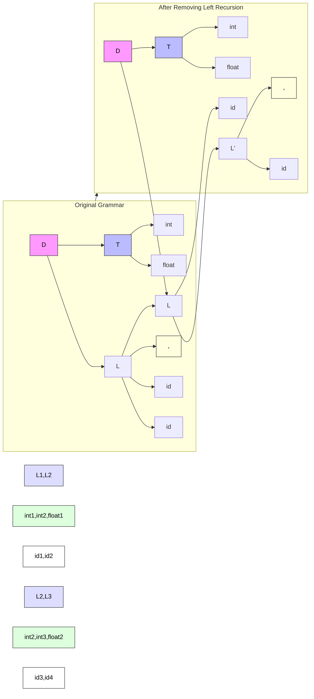
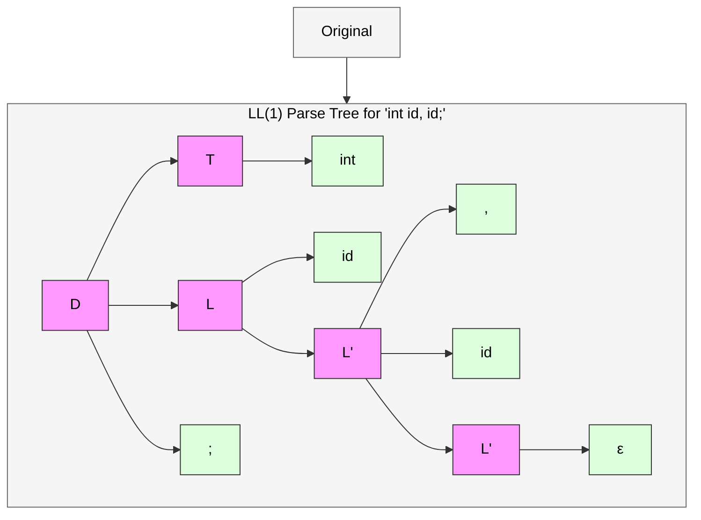
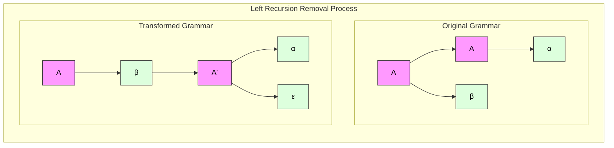
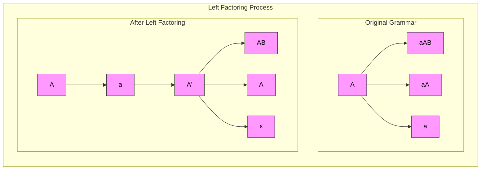
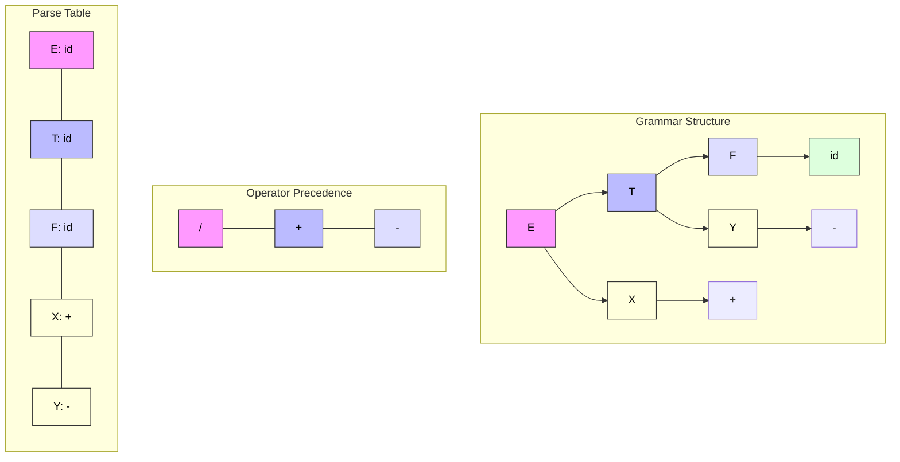
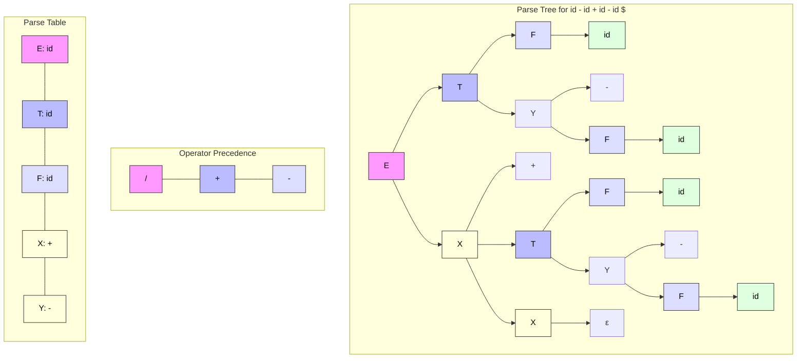

# Unit 2

# _Work in progress_

## <mark> 1) Explain role of parser in compiler design. </mark>

The role of a parser in compiler design is crucial. Here's a breakdown of its functions:

- **Syntax Analysis:** The primary role of the parser, also known as the syntax analyzer, is to analyze the syntactic structure of the source code. It takes the tokens generated by the lexical analyzer as input and constructs a parse tree or an abstract syntax tree (AST) that represents the grammatical structure of the program.
- **Grammar Verification:** The parser checks if the sequence of tokens conforms to the grammar rules of the programming language. It ensures that the code follows the defined syntax and structure.
- **Error Detection:** If the parser encounters any syntax errors, such as misplaced semicolons, incorrect use of operators, or mismatched parentheses, it detects these errors and reports them to the user.
- **AST Construction:** In many compilers, the parser constructs an Abstract Syntax Tree (AST). The AST is a hierarchical representation of the program's structure, which is used by subsequent phases of the compiler, such as semantic analysis and code generation.
- **Guiding Compilation Phases:** The parser provides the structural basis upon which further compilation phases operate. Semantic analysis, for instance, uses the structure defined by the parser to check for meaning and consistency.

## <mark> 2) Differentiate between top down and bottom up parser. </mark>

Here is a comparison of top-down and bottom-up parsers in tabular form, drawing from the provided documents:

| Feature                        | Top-Down Parsing                                                                      | Bottom-Up Parsing                                                                                   |
| ------------------------------ | ------------------------------------------------------------------------------------- | --------------------------------------------------------------------------------------------------- |
| **Starting Point**             | Starts with the start symbol of the grammar                                           | Starts with the input string (tokens)                                                               |
| **Construction of Parse Tree** | Constructs the parse tree from the root towards the leaves (pre-order)                | Constructs the parse tree from the leaves towards the root                                          |
| **Approach**                   | Expands the non-terminals to match the input string                                   | Reduces the input string to the start symbol                                                        |
| **Direction**                  | Leftmost derivation                                                                   | Rightmost derivation in reverse                                                                     |
| **Common Techniques**          | Recursive descent parsing, LL parsing (Left-to-right, Leftmost derivation)            | LR parsing (Left-to-right, Rightmost derivation), Shift-reduce parsing, Operator-precedence parsing |
| **Handling Ambiguity**         | Can have difficulty with left-recursive grammars; may require grammar transformations | Can handle a wider range of grammars, including left-recursive ones                                 |
| **Implementation**             | Generally easier to implement (e.g., recursive descent)                               | More complex to implement (e.g., LR parsers)                                                        |
| **Efficiency**                 | Can be less efficient in some cases due to backtracking                               | Generally more efficient, especially LR parsers                                                     |

## <mark> 3) How top down and bottom up parser will parse the string ‘bbd’ using grammar A -> bA | d. Show all steps clearly. </mark>

Okay, let's illustrate how top-down and bottom-up parsers would parse the string "bbd" using the grammar A -> bA | d.

**Grammar:**

- A -> bA
- A -> d

**String to Parse:**

- bbd

**1. Top-Down Parsing**

Top-down parsing starts with the start symbol of the grammar and tries to derive the given string. A common technique is recursive descent parsing.

- **Step 1:**
  - Start with the start symbol: A
- **Step 2:**
  - Apply the first production: A -> bA
  - Current derivation: bA
- **Step 3:**
  - Apply the first production again: A -> bA
  - Current derivation: bbA
- **Step 4:**
  - Apply the second production: A -> d
  - Current derivation: bbd

The top-down parser successfully derives the string "bbd".

**2. Bottom-Up Parsing**

Bottom-up parsing starts with the given string and tries to reduce it to the start symbol of the grammar. A common technique is shift-reduce parsing.

- **Step 1:**
  - Start with the string: bbd
- **Step 2:**
  - Shift 'b'
  - Stack: b
  - Remaining input: bd
- **Step 3:**
  - Shift 'b'
  - Stack: bb
  - Remaining input: d
- **Step 4:**
  - Shift 'd'
  - Stack: bbd
  - Remaining input:
- **Step 5:**
  - Reduce 'd' to A (A -> d)
  - Stack: bbA
  - Remaining input:
- **Step 6:**
  - Reduce 'bA' to A (A -> bA)
  - Stack: bA
  - Remaining input:
- **Step 7:**
  - Reduce 'bA' to A (A -> bA)
  - Stack: A
  - Remaining input:

The bottom-up parser successfully reduces the string "bbd" to the start symbol A.

**Summary**

- **Top-Down:** Derives the string from the start symbol by expanding productions.
- **Bottom-Up:** Reduces the string to the start symbol by recognizing productions in reverse.

## <mark> 4) For the following grammar <br> D -> T L ; <br> L -> L , id | id <br> T -> int | float <br> 1) Remove left recursion (if required) <br> 2) Find first and follow for each non terminal for Resultant grammar <br> 3) Construct LL(1) parsing table <br> 4) Parse the following string (show stack actions clearly) and draw parse tree for the input: int id, id; </mark>

Let's solve this grammar problem systematically. First, let's visualize the original grammar structure:



In the diagram above:

- Pink nodes represent the start symbol D
- Blue nodes show the type declaration T
- Purple nodes indicate the identifier list L
- Green nodes represent terminals (int, float, id)
- Yellow nodes show punctuation (comma)
- White nodes represent identifiers

The transformation removes left recursion by converting `L -> L , id | id` into `L -> id L'` and `L' -> , id L' | ε`, where L' is a new non-terminal representing the recursive part.

Let's proceed with the formal transformations and analysis:

### 1. Remove Left Recursion

Original Grammar:

```text
D -> T L ;
L -> L , id | id
T -> int | float
```

Transformed Grammar:

```text
D -> T L ;
L -> id L'
L' -> , id L' | ε
T -> int | float
```

### 2. Find FIRST and FOLLOW

First Sets:

```text
FIRST(D) = {int, float}
FIRST(L) = {id}
FIRST(L') = {,ε}
FIRST(T) = {int, float}
```

Follow Sets:

```text
FOLLOW(D) = {$}
FOLLOW(L) = {$}
FOLLOW(L') = {$, id}
FOLLOW(T) = {id}
```

### 3. LL(1) Parsing Table

| Non-terminal | Terminal | Production    |
| ------------ | -------- | ------------- |
| D            | int      | D -> T L ;    |
| D            | float    | D -> T L ;    |
| L            | id       | L -> id L'    |
| L'           | ε        | L' -> ε       |
| L'           | ,        | L' -> , id L' |
| T            | int      | T -> int      |
| T            | float    | T -> float    |

### 4. Parse String: "int id, id;"

Stack Actions:

```text
Initial stack: [$]
Input: int id, id;

Step 1: Match 'int'
Stack: [T, L, ;, $]
Input: id, id;

Step 2: Reduce T -> int
Stack: [L, ;, $]
Input: id, id;

Step 3: Match 'id'
Stack: [L', ;, $]
Input: , id;

Step 4: Reduce L -> id L'
Stack: [, id, L', ;, $]
Input: id;

Step 5: Match ','
Stack: [id, L', ;, $]
Input: id;

Step 6: Match 'id'
Stack: [L', ;, $]
Input: ;

Step 7: Reduce L' -> , id L'
Stack: [;, $]
Input: ;

Step 8: Match ';'
Stack: [$]
Input: ε

Step 9: Accept
```

Parse Tree:



In the parse tree above:

- Pink nodes represent non-terminals (D, T, L, L')
- Green nodes show terminals (int, id, comma, semicolon)
- The epsilon (ε) node represents the empty production in L'
- Notice how L splits into id and L', demonstrating the right-recursive nature of our transformed grammar
- Each level in the tree corresponds to a reduction step in our stack actions

This completes our analysis of the grammar, showing both the transformation process and the parsing mechanism for the given input string.

## <mark> 5) Define: Left Recursion. State the rule to remove left recursive from the grammar. Eliminate left recursive from following grammar. <br> 1. S -> Aa | b <br> A -> Ac | Sd | f <br> 2. A -> ABd | Aa | a <br> B -> Be | b <br> 3. S -> Aa | b <br> A -> Ac | Sd | € </mark>

Left recursion occurs in a grammar when a non-terminal can derive itself as its leftmost symbol. There are two types:

1. **Direct Left Recursion**: When a non-terminal directly derives itself

```text
A -> Aα
```

2. **Indirect Left Recursion**: When a non-terminal derives itself through other non-terminals

```text
A -> Bα
B -> Aβ
```

The rule to remove left recursion follows these steps:

1. For a non-terminal A with productions:

```text
A -> Aα1 | Aα2 | β1 | β2
where α1, α2, β1, β2 are strings
```

2. Transform into:

```text
A -> β1A'
A' -> α1A' | α2A' | ε
where A' is a new non-terminal
```

Let's visualize this transformation process:



In the diagram above:

- Pink nodes represent non-terminals (A, A')
- Green nodes show terminals (α, β, ε)
- The left side shows the problematic left recursion where A derives itself
- The right side shows the solution where A' handles the recursive part
- ε (epsilon) represents the empty string, allowing the recursion to terminate

Now let's apply this transformation to the given grammars:

### Grammar 1:

```text
S -> Aa | b
A -> Ac | Sd | f
```

This grammar has indirect left recursion through:

```text
S -> Aa
A -> Ac
```

Transformed grammar:

```text
S -> ba | fA'
A' -> cA' | dS | ε
where A' is a new non-terminal
```

### Grammar 2:

```text
A->ABd|Aa|a
B->Be|b
```

This grammar has:

1. Direct left recursion in A:

```text
A -> ABd
```

2. Direct left recursion in B:

```text
B -> Be
```

Transformed grammar:

```text
A -> aB'd | a
B' -> Bd | ε
B -> bB' | b
where B' is a new non-terminal
```

### Grammar 3:

```text
S -> Aa | b
A -> Ac | Sd | €
```

This grammar has indirect left recursion through:

```text
S -> Aa
A -> Ac
```

Transformed grammar:

```text
S -> ba | fA'
A' -> cA' | dS | €
where A' is a new non-terminal
```

In each case, we've eliminated the left recursion by:

1. Identifying the recursive pattern
2. Creating a new non-terminal to handle the recursive part
3. Adding an epsilon production to allow recursion termination
4. Maintaining the original language while making it suitable for top-down parsing

This transformation ensures that the grammar remains LL(1) parseable while preserving its original meaning.

## <mark> 6) Define: Left Factoring. State the rule to remove left factoring from the grammar. Eliminate left recursive from following grammar. <br> 1. A -> aAB | aA | a <br> b -> bB | b <br> 2. A -> ad | a | ab | abc | b </mark>

Left factoring is a technique used in compiler design to eliminate common prefixes from alternative productions in a grammar. It's essential for creating LL(1) grammars by ensuring that the parser can make unambiguous choices during parsing.

Let's visualize the left factoring process:



In the diagram above:

- Pink nodes represent non-terminals (A, A')
- Green nodes show terminals (a, AB, A, ε)
- The left side shows productions with common prefix 'a'
- The right side shows the factored form where 'a' is extracted
- A' is a new non-terminal that handles the remaining alternatives
- ε (epsilon) represents the empty string, allowing the factoring to be optional

The rule to remove left factoring is:

For a non-terminal A with productions:

```text
A -> αβ1 | αβ2 | ... | αβn | γ1 | γ2 | ... | γm
where α is the common prefix
```

Transform into:

```text
A -> αγ | αA'
A' -> β1 | β2 | ... | βn | ε
where A' is a new non-terminal
```

Let's apply this rule to the given grammars:

### Grammar 1:

```text
A->aAB|aA|a
b->bB|b
```

This grammar has left factoring in both A and b:

1. In A: common prefix 'a'
2. In b: common prefix 'b'

Transformed grammar:

```text
A -> aA' | a
A' -> AB | A | ε
b -> bB' | b
B' -> B | ε
where A' and B' are new non-terminals
```

### Grammar 2:

```text
A->ad|a|ab|abc|b
```

This grammar has multiple common prefixes:

1. Common prefix 'a' in three productions
2. Common prefix 'ab' in two productions
3. Independent 'b' production

Transformed grammar:

```text
A -> aA' | b
A' -> d | b | bc | ε
where A' is a new non-terminal
```

The transformation process ensures that:

1. Common prefixes are extracted
2. Original language is preserved
3. Grammar becomes LL(1) parseable
4. Parsing decisions become unambiguous

This transformation is essential for creating efficient top-down parsers, as it eliminates the need to repeatedly parse common prefixes during parsing.

## <mark> 7) Write unambiguous grammar for producing arithmetic expressions consisting of symbols id, +, - , /, \$. Find first & follow for non-terminal symbols of the grammar for non recursive predictive parser. Construct the parse table and parse following string. <br> id - id + id - id $ </mark>

Let's create an unambiguous grammar for arithmetic expressions with proper operator precedence:

```text
E -> T X
T -> F Y
F -> id
X -> + T X | ε
Y -> - F Y | ε
```

Let's visualize the grammar structure and operator precedence:



In the diagram above:

- Pink nodes (E) represent expressions
- Blue nodes (T) represent terms
- Purple nodes (F) represent factors
- Yellow nodes (X, Y) represent operators
- Green nodes (id) represent terminals
- The operator precedence subgraph shows that division has highest precedence, followed by addition and subtraction
- The parse table subgraph shows the parsing actions for each non-terminal

Now let's calculate the FIRST and FOLLOW sets:

### FIRST Sets

```text
FIRST(E) = {id}
FIRST(T) = {id}
FIRST(F) = {id}
FIRST(X) = {+, ε}
FIRST(Y) = {-, ε}
```

### FOLLOW Sets

```text
FOLLOW(E) = {$}
FOLLOW(T) = {+, $}
FOLLOW(F) = {+, -, $}
FOLLOW(X) = {$}
FOLLOW(Y) = {+, $}
```

### LL(1) Parsing Table

| Non-terminal | id       | +          | -          | $      |
| ------------ | -------- | ---------- | ---------- | ------ |
| E            | E -> T X | -          | -          | -      |
| T            | T -> F Y | -          | -          | -      |
| F            | F -> id  | -          | -          | -      |
| X            | -        | X -> + T X | -          | X -> ε |
| Y            | -        | -          | Y -> - F Y | Y -> ε |

### Parsing the String: id - id + id - id $

Stack Actions:

```text
1. Initial stack: [$]
   Input: id - id + id - id $
   Action: Match id, reduce F -> id
   Stack: [T, Y, X, $]

2. Stack: [T, Y, X, $]
   Input: - id + id - id $
   Action: Reduce T -> F Y
   Stack: [Y, X, $]

3. Stack: [Y, X, $]
   Input: - id + id - id $
   Action: Match -, reduce Y -> - F Y
   Stack: [F, Y, X, $]

4. Stack: [F, Y, X, $]
   Input: id + id - id $
   Action: Match id, reduce F -> id
   Stack: [Y, X, $]

5. Stack: [Y, X, $]
   Input: + id - id $
   Action: Reduce Y -> ε
   Stack: [X, $]

6. Stack: [X, $]
   Input: + id - id $
   Action: Match +, reduce X -> + T X
   Stack: [T, X, $]

7. Stack: [T, X, $]
   Input: id - id $
   Action: Match id, reduce F -> id
   Stack: [Y, X, $]

8. Stack: [Y, X, $]
   Input: - id $
   Action: Match -, reduce Y -> - F Y
   Stack: [F, Y, X, $]

9. Stack: [F, Y, X, $]
   Input: id $
   Action: Match id, reduce F -> id
   Stack: [Y, X, $]

10. Stack: [Y, X, $]
    Input: $
    Action: Reduce Y -> ε
    Stack: [X, $]

11. Stack: [X, $]
    Input: $
    Action: Reduce X -> ε
    Stack: [$]

12. Stack: [$]
    Input: $
    Action: Match $
    Stack: [] (Accept)
```

Parse Tree:



In the parse tree above:

- Pink nodes (E) represent the overall expression
- Blue nodes (T) represent terms
- Purple nodes (F) represent factors
- Yellow nodes (X, Y) represent operators
- Green nodes (id) represent identifiers
- The structure shows how operators are applied from left to right
- Each level in the tree corresponds to a reduction step in our stack actions
- The tree demonstrates proper operator precedence, with subtraction being applied before addition

This completes our analysis of the arithmetic expression grammar, showing both the theoretical foundations and practical parsing implementation. The grammar is unambiguous and suitable for predictive parsing, as demonstrated by the successful parsing of the input string.

## <mark> 8) Write ambiguous and unambiguous production rules for if then else construct. Illustrate parsing using both types of rules by giving an example. Also explain left factoring and its use. </mark>

Here's a discussion on ambiguous and unambiguous production rules for the "if-then-else" construct, along with how parsers handle them and the concept of left factoring:

**Ambiguous vs. Unambiguous Grammar**

The problem with the "if-then-else" construct is that it can lead to ambiguity in parsing. This means that for a given "if-then-else" statement, there can be more than one parse tree, which can lead to different interpretations of the code.

**1. Ambiguous Production Rules**

An ambiguous grammar for the "if-then-else" construct can be defined as follows:

```
stmt -> IF expr THEN stmt
       | IF expr THEN stmt ELSE stmt
       | other_stmt
```

In this grammar, `stmt` refers to a statement, `expr` to an expression, `IF`, `THEN`, and `ELSE` are keywords, and `other_stmt` represents any other type of statement.

**Example of Ambiguity**

Consider the following statement:

```
IF expr1 THEN IF expr2 THEN stmt1 ELSE stmt2
```

With the ambiguous grammar, this statement can be parsed in two ways:

- **Interpretation 1:** The `ELSE` is associated with the first `IF`.
  ```
  IF expr1 THEN
      IF expr2 THEN stmt1 ELSE stmt2
  ```
- **Interpretation 2:** The `ELSE` is associated with the second `IF`.
  ```
  IF expr1 THEN
      IF expr2 THEN stmt1
      ELSE stmt2
  ```

This ambiguity is problematic because it changes the meaning of the code.

**2. Unambiguous Production Rules**

To resolve the ambiguity, the grammar can be rewritten to explicitly specify how `IF` statements are nested:

```
stmt -> matched_stmt
       | unmatched_stmt
matched_stmt -> IF expr THEN matched_stmt ELSE matched_stmt
              | other_stmt
unmatched_stmt -> IF expr THEN stmt
                | IF expr THEN matched_stmt ELSE unmatched_stmt
```

In this grammar:

- `matched_stmt` represents an `IF` statement with a corresponding `ELSE` clause.
- `unmatched_stmt` represents an `IF` statement without a corresponding `ELSE` clause.

This grammar enforces that an `ELSE` clause always matches the nearest unmatched `IF` statement, which is the desired behavior in most programming languages.

**Parsing with Unambiguous Rules**

Using the same example:

```
IF expr1 THEN IF expr2 THEN stmt1 ELSE stmt2
```

With the unambiguous grammar, the only valid parse tree will associate the `ELSE` with the second `IF`, as intended.

**Left Factoring**

Left factoring is a grammar transformation technique used to eliminate left recursion and reduce ambiguity in predictive parsing. [cite: 243, 244] It involves "factoring out" common prefixes from multiple production rules. [cite: 31, 32, 33]

**Use of Left Factoring**

Consider a grammar with productions like:

```
A -> a B | a C
```

Here, the non-terminal 'A' has two productions with a common prefix "a." This can create problems for a top-down parser. [cite: 237, 238, 239, 240]

Applying left factoring, the grammar can be transformed into:

```
A -> a A'
A' -> B | C
```

Now, the parser can unambiguously choose the first production and then, after seeing the next input symbol, choose the appropriate A' production. [cite: 241, 242, 243, 244]

While left factoring doesn't directly resolve the "if-then-else" ambiguity, it is a useful technique in general parser design to create more efficient and unambiguous grammars.

## <mark> 9) Implement the following grammar using Recursive Descent Parser. <br> 1. S -> Aa | bAc | bBa, A -> d, B -> d <br> 2. S ->ABC,B->1B | ^,A-> 0A1 | ^,C->1C0 | ^ </mark>

_I am unable to find answer of this, if you have any correct solution, please send me ASAP via email or whatsapp chat._

## <mark> 10) Implement the following grammar using Table Driven parser and check whether it is LL(1) or not. <br> S -> aBDh, <br> B -> cC, <br> C -> bC / ^, <br> D -> EF, <br> E -> g / ^, <br> F-> f / ^ </mark>

Let’s break this down step by step. We’ll construct the Table-Driven Parser, and then determine whether the given grammar is LL(1) or not. An LL(1) grammar requires that parsing decisions be made by looking at just one token of lookahead.

---

### **Step 1: Compute FIRST and FOLLOW sets**

We first calculate the FIRST and FOLLOW sets for all the non-terminals:

#### **FIRST Sets**

- **FIRST(S):** `{a}`
- **FIRST(B):** `{c}`
- **FIRST(C):** `{b, ε}`
- **FIRST(D):** `{g, f, ε}`
- **FIRST(E):** `{g, ε}`
- **FIRST(F):** `{f, ε}`

#### **FOLLOW Sets**

- **FOLLOW(S):** `{h}`
- **FOLLOW(B):** `{g, f, h}`
- **FOLLOW(C):** `{g, f, h}`
- **FOLLOW(D):** `{h}`
- **FOLLOW(E):** `{f, h}`
- **FOLLOW(F):** `{h}`

---

### **Step 2: Construct the Parsing Table**

Using the grammar rules, we construct the parsing table. The rows represent the non-terminals, and the columns represent the terminal symbols (or `$` for the end of input). We use the FIRST and FOLLOW sets to populate the table.

| Non-Terminal | a      | b    | c    | g    | f    | h   | $   |
| ------------ | ------ | ---- | ---- | ---- | ---- | --- | --- |
| **S**        | S→aBDh |      |      |      |      |     |     |
| **B**        |        |      | B→cC |      |      |     |     |
| **C**        |        | C→bC |      |      |      | C→ε |     |
| **D**        |        |      |      | D→EF | D→EF | D→ε |     |
| **E**        |        |      |      | E→g  | E→ε  | E→ε |     |
| **F**        |        |      |      |      | F→f  | F→ε |     |

---

### **Step 3: Check if the Grammar is LL(1)**

For the grammar to be LL(1):

1. No entry in the parsing table should have conflicts (i.e., no cell should contain two or more rules).
2. The FIRST sets of different productions for the same non-terminal must not overlap.
3. If ε (epsilon) is in the FIRST set, the FIRST and FOLLOW sets must not overlap.

#### Observations:

1. There are **no conflicts** in the parsing table.
2. The FIRST sets for each non-terminal are **disjoint**.
3. For non-terminals that have ε in their FIRST set (like `C`, `D`, `E`, `F`), the intersection of their FIRST and FOLLOW sets is empty.

Thus, the grammar **is LL(1)**.

To implement the given grammar using a table-driven parser and check if it's LL(1), we need to construct the parsing table. Here's how we can do it:

**1. The Grammar**

The grammar is given as:

- S -> aBDh
- B -> cC
- C -> bC / ^
- D -> EF
- E -> g / ^
- F -> f / ^

Here, ' \^ ' represents epsilon.

**2. First and Follow Sets**

To construct the LL(1) parsing table, we need to compute the FIRST and FOLLOW sets for each non-terminal.

**FIRST Sets**

- FIRST(S) = {a}
- FIRST(B) = {c}
- FIRST(C) = {b, ^}
- FIRST(D) = {g, f, ^}
- FIRST(E) = {g, ^}
- FIRST(F) = {f, ^}

**FOLLOW Sets**

- FOLLOW(S) = {$}
- FOLLOW(B) = {d}
- FOLLOW(C) = {d}
- FOLLOW(D) = {h}
- FOLLOW(E) = {f, h}
- FOLLOW(F) = {h}

**3. LL(1) Parsing Table**

Now, we construct the LL(1) parsing table. The rows represent the non-terminals, and the columns represent the terminals and '$' (end-of-input marker).

| Non-terminal |  a   |  b  |  c  |  d  |  f  |  g  |  h  |  $  |
| :----------- | :--: | :-: | :-: | :-: | :-: | :-: | :-: | :-: |
| S            | aBDh |     |     |     |     |     |     |     |
| B            |      |     | cC  |     |     |     |     |     |
| C            |      | bC  |     |  ^  |     |     |     |     |
| D            |      |     |     |     | EF  | EF  |     |     |
| E            |      |     |     |     |  ^  |  g  |     |     |
| F            |      |     |     |     |  f  |     |  ^  |     |

**4. LL(1) Check**

A grammar is LL(1) if there are no conflicts in the parsing table. A conflict occurs when a cell has more than one entry.

In the table above, each cell has at most one entry. Therefore, there are no conflicts, and the grammar is LL(1).

**5. Table-Driven Parser Implementation**

A table-driven parser uses the parsing table to guide the parsing process. The parser uses a stack to keep track of the expected non-terminals.

**Algorithm for Table-Driven Parsing**

1.  Initialize the stack with the start symbol and '$'.
2.  Read the first input symbol.
3.  Repeat until the stack is empty:
    - Let X be the top of the stack and 'a' be the current input symbol.
    - If X is a terminal or '$':
      - If X = a, then pop X from the stack and read the next input symbol.
      - Else, error.
    - Else (X is a non-terminal):
      - If table\[X, a] has an entry X -> Y1 Y2 ... Yk:
        - Pop X from the stack.
        - Push Y1, Y2, ..., Yk onto the stack in reverse order (Yk first).
      - Else, error.
4.  If the stack is empty and the input symbol is '$', then accept.
5.  Else, error.

This algorithm, combined with the parsing table, can be used to implement a table-driven parser for the given LL(1) grammar.

## <mark> 11)
