# Unit 1

## <mark> 1) Explain all key objectives of cryptography. </mark>

Cryptography serves several fundamental objectives that form the foundation of secure communication and data protection. These objectives work together to create a comprehensive security system that protects data throughout its lifecycle.

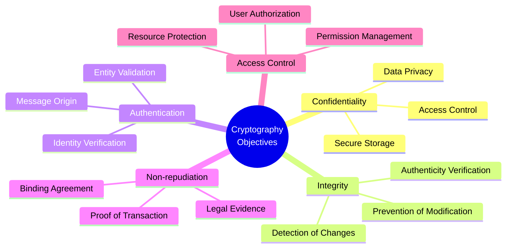

The diagram above illustrates the five primary objectives of cryptography, branching out into their key aspects. Each main branch represents a fundamental security goal, with its sub-branches showing specific implementation areas. Let's explore each of these objectives in detail:

### 1. Confidentiality

- Ensures that information remains accessible only to authorized parties
- Protects against unauthorized disclosure or exposure
- Achieved through encryption techniques that transform plaintext into unreadable ciphertext
- Critical for sensitive data transmission and storage

### 2. Integrity

- Guarantees that data hasn't been modified during transmission or storage
- Ensures authenticity of information
- Prevents tampering without detection
- Uses hash functions and digital signatures to verify data consistency

### 3. Authentication

- Verifies the identity of communicating parties
- Ensures messages come from claimed senders
- Validates the authenticity of data origin
- Prevents impersonation attacks

### 4. Non-repudiation

- Provides proof of sending/receiving messages
- Prevents denial of involvement in transactions
- Creates legally binding evidence
- Uses digital signatures to establish irrefutable proof

### 5. Access Control

- Manages who can perform what operations on protected data
- Implements permission-based security systems
- Controls resource utilization
- Enforces security policies consistently

### Practical Implementation Example

Consider online banking transactions:

- Confidentiality protects account details during transmission
- Integrity ensures transaction amounts aren't altered
- Authentication verifies both customer and bank identities
- Non-repudiation proves transaction occurrence
- Access control limits operations based on user privileges

### Modern Applications

1. Secure Web Communications (HTTPS)
2. Digital Payment Systems
3. Cloud Storage Security
4. Secure Email Communication
5. Virtual Private Networks (VPNs)
6. Blockchain Transactions

## <mark> 2) Draw and Explain OSI Architecture. </mark>

The OSI (Open Systems Interconnection) model is a conceptual framework that divides network communications into seven distinct layers 4:0. Each layer serves a specific purpose and communicates with adjacent layers to facilitate seamless data transmission across networks.

Let's explore the OSI architecture through a visual representation:

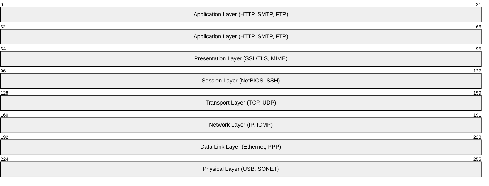

In the diagram above, each layer is represented by a segment of bytes (shown by the numbers 0-63, 64-95, etc.), illustrating how data is encapsulated as it moves through the OSI stack. The protocols listed in parentheses for each layer are common examples used in modern networking.

### Detailed Breakdown of Each Layer

#### 1. Physical Layer (Layer 1)

- Handles physical transmission of raw bits over network medium
- Manages electrical/optical signals
- Controls bit synchronization and timing
- Examples: USB, SONET/SDH, Ethernet cables 4:2

#### 2. Data Link Layer (Layer 2)

- Ensures error-free transfer of frames between two devices
- Manages MAC addresses for device identification
- Controls access to physical medium
- Consists of LLC (Logical Link Control) and MAC (Media Access Control) sublayers 4:4

#### 3. Network Layer (Layer 3)

- Routes data between different networks
- Handles logical addressing (IP addresses)
- Manages congestion control
- Determines best path for data transmission 4:6

#### 4. Transport Layer (Layer 4)

- Ensures reliable data delivery
- Provides error detection and correction
- Manages flow control and segmentation
- Uses protocols like TCP (reliable) and UDP (fast) 4:8

#### 5. Session Layer (Layer 5)

- Establishes, maintains, and terminates connections
- Controls dialogue between applications
- Manages synchronization points
- Handles authentication and security 4:11

#### 6. Presentation Layer (Layer 6)

- Converts data into compatible formats
- Handles encryption/decryption
- Performs compression/decompression
- Manages data representation standards 4:13

#### 7. Application Layer (Layer 7)

- Provides services to end-user applications
- Supports functions like email, file transfer, and web browsing
- Manages resource allocation
- Interfaces directly with software applications 4:15

### Data Flow Through OSI Layers

When data moves through the OSI model, each layer adds its own header information to the original data. Here's how it works:

1. Data starts at the Application Layer
2. Each layer down adds its own header
3. At Physical Layer, data is transmitted as bits
4. At receiving end, headers are stripped off in reverse order
5. Original data reaches the destination application 4:17

### Practical Applications

Understanding the OSI model helps in:

- Troubleshooting network problems systematically
- Designing network architectures
- Developing network protocols
- Understanding security measures at different levels
- Managing network communications effectively 6:1

## <mark> 3) Differentiate symmetric and asymmetric encryption. </mark>

Symmetric and asymmetric encryption represent two fundamentally different approaches to securing data. Let's examine their key differences:

| Feature        | Symmetric Encryption              | Asymmetric Encryption              |
| -------------- | --------------------------------- | ---------------------------------- |
| Key Type       | Single shared secret key          | Pair of keys (public + private)    |
| Speed          | Very fast                         | Slower (1000x slower)              |
| Usage          | Bulk data encryption              | Key exchange, digital signatures   |
| Security       | High (if key secure)              | Higher (mathematically proven)     |
| Key Management | Complex (secure sharing required) | Simpler (public key freely shared) |
| Examples       | AES, DES                          | RSA, Elliptic Curve                |
| Authentication | No built-in authentication        | Built-in authentication            |
| Key Length     | 256-bit typical                   | 2048-bit typical                   |

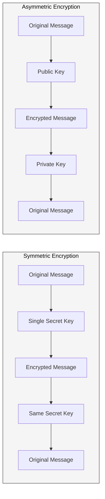

As shown in the diagram above, symmetric encryption uses the same secret key for both encryption and decryption, while asymmetric encryption uses a public key for encryption and a private key for decryption. This fundamental difference explains why asymmetric encryption provides stronger security guarantees, though at the cost of speed.

### Practical Example

Consider secure email communication:

- Symmetric Encryption: Used for encrypting the entire email body (fast)
- Asymmetric Encryption: Used for exchanging the symmetric key (secure)

This hybrid approach combines the best of both worlds:

1. Sender encrypts email body with symmetric key (fast)
2. Encrypts symmetric key with recipient's public key (secure)
3. Recipient decrypts key with private key
4. Uses decrypted key to read email body

### Real-World Applications

Symmetric Encryption:

- Database encryption
- File storage protection
- Secure messaging apps
- VPN data transmission

Asymmetric Encryption:

- SSL/TLS certificates
- Digital signatures
- Key exchange protocols
- Cryptocurrencies

### Important Considerations

- Symmetric encryption requires secure key distribution
- Asymmetric encryption is typically used for initial key exchange
- Modern systems often combine both methods
- Choice depends on specific security requirements and performance needs

## <mark> 4) Define Active and Passive attacks with Example. </mark>

Network attacks can be categorized into two fundamental types: active and passive attacks. Understanding these categories is crucial for implementing effective network security measures.

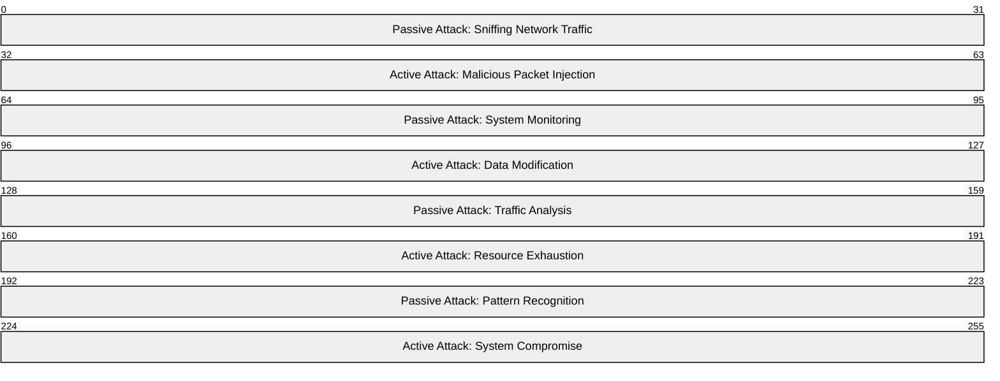

In the diagram above, each segment represents different aspects of passive and active attacks, showing how they interact with network systems. Passive attacks observe and monitor (bottom segments), while active attacks inject and modify data (top segments). This visualization demonstrates how passive attacks typically remain below the system's radar, while active attacks directly interact with and alter system resources.

### Active Attacks

Active attacks involve direct intervention in the target system's operation:

| Characteristic | Description                              | Example               |
| -------------- | ---------------------------------------- | --------------------- |
| System Impact  | Direct modification of data or resources | SQL injection attacks |
| Visibility     | Usually detectable                       | Malware installation  |
| Risk Level     | High                                     | DDoS attacks          |
| Recovery       | May require system restoration           | Ransomware attacks    |

### Passive Attacks

Passive attacks involve observation without direct intervention:

| Characteristic | Description                  | Example           |
| -------------- | ---------------------------- | ----------------- |
| System Impact  | No modification of resources | Network sniffing  |
| Visibility     | Difficult to detect          | Traffic analysis  |
| Risk Level     | Medium                       | Password sniffing |
| Recovery       | Minimal impact               | System monitoring |

### Real-World Example

Consider a scenario involving online banking:

**Passive Attack:**

- Attacker uses Wireshark to capture login credentials
- No system modification occurs
- Difficult to detect without proper monitoring
- Impact: Data theft without system compromise

**Active Attack:**

- Attacker injects malware into the banking website
- Modifies transaction amounts during processing
- Creates visible logs and alerts
- Impact: Direct financial loss and system compromise

### Defense Strategies

**Against Active Attacks:**

- Implement robust access controls
- Regular system updates and patches
- Intrusion Detection Systems (IDS)
- Firewall rules and monitoring

**Against Passive Attacks:**

- Encrypt sensitive data in transit
- Network segmentation
- Traffic pattern analysis
- Secure protocols (HTTPS, SSH)

### Important Considerations

- Passive attacks often precede active attacks
- Active attacks typically leave digital footprints
- Modern attackers often combine both types
- Defense requires monitoring for both attack types
- Regular security audits help detect passive reconnaissance

## <mark> 5) Write a short note on Security Services. </mark>

Security services form the foundation of network security, providing essential protection mechanisms for data and communications. These services work together to ensure confidentiality, integrity, and availability of information across networks.

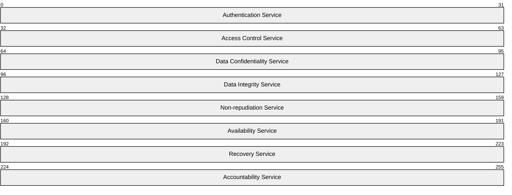

In the diagram above, each segment represents a different security service, showing how they work together to provide comprehensive security. The byte ranges (0-31, 32-63, etc.) illustrate how these services are integrated into network communications, with each service playing a specific role in protecting data and systems.

### Key Security Services

1. **Authentication Service**

- Verifies identity of users and systems
- Ensures only authorized access
- Prevents impersonation attacks
- Example: Login credentials, biometric verification

2. **Access Control Service**

- Manages permissions and privileges
- Controls what authenticated users can do
- Implements role-based access
- Example: File permissions, user roles

3. **Data Confidentiality Service**

- Protects data from unauthorized access
- Ensures privacy of information
- Uses encryption techniques
- Example: HTTPS, encrypted email

4. **Data Integrity Service**

- Ensures data isn't modified during transmission
- Detects unauthorized changes
- Uses checksums and digital signatures
- Example: Message authentication codes

5. **Non-repudiation Service**

- Provides proof of message origin
- Prevents denial of involvement
- Creates legally binding evidence
- Example: Digital signatures on contracts

6. **Availability Service**

- Ensures resources are accessible
- Prevents denial-of-service attacks
- Maintains system uptime
- Example: Load balancing, backup systems

### Implementation Example

Consider online banking:

- Authentication: Secure login with multi-factor authentication
- Access Control: Limits transactions based on user permissions
- Confidentiality: Encrypts all communication
- Integrity: Verifies transaction data hasn't been altered
- Non-repudiation: Records all transactions with digital signatures
- Availability: Maintains system access during peak hours

### Modern Applications

- Cloud Security Services
- IoT Device Protection
- Mobile Application Security
- Enterprise Network Security
- Blockchain Security

### Important Considerations

- Security services must work together
- Implementation depends on specific needs
- Regular updates are essential
- Monitoring is crucial for effectiveness
- Balance between security and usability

## <mark> 6) Explain playfair cipher substitution technique in detail. Find out cipher text for the following given key and plaintext. <br> Key = ENGINEERING <br> Plaintext=COMPUTER SCIENCE AND ENGINEERING </mark>

The Playfair cipher is a digraph substitution cipher that encrypts pairs of letters instead of single letters. It was invented by Charles Wheatstone in 1854 and is considered one of the first practical digraph substitution ciphers.

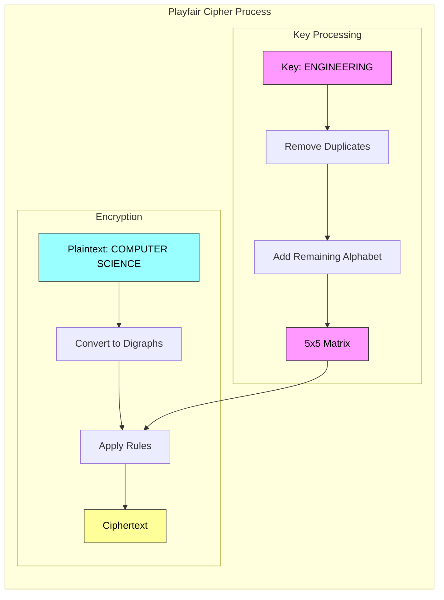

In the diagram above, pink boxes represent key processing steps, blue represents plaintext processing, and yellow shows the final ciphertext output. The diagram illustrates how the key is first processed into a 5x5 matrix, which is then used to encrypt the plaintext digraphs.

### Key Processing Steps

1. Create 5x5 matrix using the key "ENGINEERING":

```
E N G I R
A B C D F
H K L M O
P Q S T U
V W X Y Z
```

2. Rules for matrix creation:

- Write key letters first
- Remove duplicates
- Fill remaining spaces with alphabet
- I/J are treated as same letter

### Encryption Rules

1. Letter Pair Rules:

- Same row: Take letters to right
- Same column: Take letters below
- Different row/column: Take rectangle corners

2. Special Cases:

- X added between repeated letters
- Space ignored
- Last letter gets X if needed

### Encryption Process

For plaintext "COMPUTER SCIENCE AND ENGINEERING":

1. Convert to digraphs:

```
COMPUTERSCIENCEANDENGINEERINGX
```

2. Encrypt each pair:

```
CO → FL
MP → HT
UT → PU
ER → NE
SC → XL
IE → RN
NC → GB
EA → AH
ND → IB
EN → NG
GI → IR
NE → GN
ER → NE
IN → RG
GX → CG
```

### Final Ciphertext

```
FLHTPUNEXLRNGBAHIBNGIRGNNERGCG
```

### Important Notes

- The Playfair cipher is polygraphic (encrypts letter pairs)
- It preserves digraph frequencies
- Not secure for modern use
- Historical significance in cryptography development
- More complex than substitution ciphers

## <mark> 7) Encrypt using HILL CIPHER the P.T “ATTACK CHINAA” using the key GYDNSKURT </mark>

To encrypt the plaintext "ATTACK CHINAA" using the Hill Cipher with the key "GYDNSKURT", we follow these steps:

**1. Convert the Key to a Matrix:**

The key is "GYDNSKURT", which has 9 letters. We can arrange this into a 3x3 matrix. First, we convert each letter to its numerical equivalent (A=0, B=1, ..., Z=25):

G = 6, Y = 24, D = 3
N = 13, S = 18, K = 10
U = 20, R = 17, T = 19

So, the key matrix (K) is:

```
K = [[ 6, 24,  3],
     [13, 18, 10],
     [20, 17, 19]]
```

**2. Convert the Plaintext to Numerical Blocks:**

The plaintext is "ATTACK CHINAA". Convert each letter to its numerical equivalent:

A = 0, T = 19, T = 19, A = 0, C = 2, K = 10, C = 2, H = 7, I = 8, N = 13, A = 0, A = 0

Since we are using a 3x3 key matrix, we need to divide the plaintext into blocks of 3 letters:

Block 1: ATT -> [0, 19, 19]
Block 2: ACK -> [0, 2, 10]
Block 3: CHI -> [2, 7, 8]
Block 4: NAA -> [13, 0, 0]

Represent each block as a column vector.

**3. Encryption Process (Matrix Multiplication modulo 26):**

For each plaintext block (P), we calculate the ciphertext block (C) using the formula:
C = K \* P (mod 26)

**Block 1: P1 = [0, 19, 19]**

```
C1 = [[ 6, 24,  3],   *  [ 0 ]   =   [ (6*0 + 24*19 + 3*19) mod 26 ]   =   [ (0 + 456 + 57) mod 26 ]   =   [ 513 mod 26 ]   =   [ 19 ]
      [13, 18, 10],      [ 19]       [ (13*0 + 18*19 + 10*19) mod 26 ]   =   [ (0 + 342 + 190) mod 26 ]   =   [ 532 mod 26 ]   =   [ 12 ]
      [20, 17, 19]]      [ 19]       [ (20*0 + 17*19 + 19*19) mod 26 ]   =   [ (0 + 323 + 361) mod 26 ]   =   [ 684 mod 26 ]   =   [ 8  ]
```

C1 = [19, 12, 8] -> TMI

**Block 2: P2 = [0, 2, 10]**

```
C2 = [[ 6, 24,  3],   *  [ 0 ]   =   [ (6*0 + 24*2 + 3*10) mod 26 ]   =   [ (0 + 48 + 30) mod 26 ]   =   [ 78 mod 26 ]   =   [ 0 ]
      [13, 18, 10],      [ 2 ]       [ (13*0 + 18*2 + 10*10) mod 26 ]   =   [ (0 + 36 + 100) mod 26 ]   =   [ 136 mod 26 ]   =   [ 6 ]
      [20, 17, 19]]      [ 10]       [ (20*0 + 17*2 + 19*10) mod 26 ]   =   [ (0 + 34 + 190) mod 26 ]   =   [ 224 mod 26 ]   =   [ 16]
```

C2 = [0, 6, 16] -> AGQ

**Block 3: P3 = [2, 7, 8]**

```
C3 = [[ 6, 24,  3],   *  [ 2 ]   =   [ (6*2 + 24*7 + 3*8) mod 26 ]   =   [ (12 + 168 + 24) mod 26 ]   =   [ 204 mod 26 ]   =   [ 22 ]
      [13, 18, 10],      [ 7 ]       [ (13*2 + 18*7 + 10*8) mod 26 ]   =   [ (26 + 126 + 80) mod 26 ]   =   [ 232 mod 26 ]   =   [ 24 ]
      [20, 17, 19]]      [ 8 ]       [ (20*2 + 17*7 + 19*8) mod 26 ]   =   [ (40 + 119 + 152) mod 26 ]   =   [ 311 mod 26 ]   =   [ 25 ]
```

C3 = [22, 24, 25] -> WYZ

**Block 4: P4 = [13, 0, 0]**

```
C4 = [[ 6, 24,  3],   *  [ 13]   =   [ (6*13 + 24*0 + 3*0) mod 26 ]   =   [ (78 + 0 + 0) mod 26 ]   =   [ 78 mod 26 ]   =   [ 0 ]
      [13, 18, 10],      [ 0 ]       [ (13*13 + 18*0 + 10*0) mod 26 ]   =   [ (169 + 0 + 0) mod 26 ]   =   [ 169 mod 26 ]   =   [ 13]
      [20, 17, 19]]      [ 0 ]       [ (20*13 + 17*0 + 19*0) mod 26 ]   =   [ (260 + 0 + 0) mod 26 ]   =   [ 260 mod 26 ]   =   [ 0 ]
```

C4 = [0, 13, 0] -> ANA

**4. Combine Ciphertext Blocks:**

Combine the ciphertext blocks to get the final ciphertext: TMI AGQ WYZ ANA

**Therefore, the Hill Cipher encryption of "ATTACK CHINAA" using the key "GYDNSKURT" is TMIA GQWYZ ANA.**

## <mark> 8) Differentiate between Monoalphabetic and Polyalphabetic cipher. </mark>

Monoalphabetic and polyalphabetic ciphers represent two distinct approaches to classical encryption, each with its own characteristics and security implications.

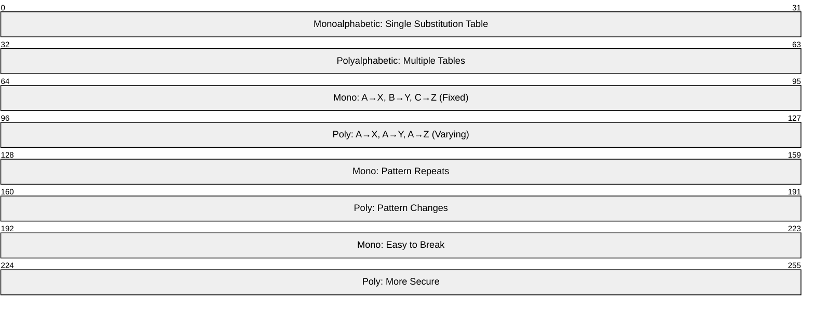

In the diagram above, each segment represents different aspects of these ciphers, from their basic substitution patterns to their security implications. The byte ranges (0-31, 32-63, etc.) illustrate how these ciphers handle encryption differently, with monoalphabetic using a single fixed substitution table and polyalphabetic using multiple varying tables.

### Key Differences

| Feature              | Monoalphabetic       | Polyalphabetic            |
| -------------------- | -------------------- | ------------------------- |
| Substitution Pattern | Single fixed mapping | Multiple varying mappings |
| Key Length           | Short (single key)   | Longer (multiple keys)    |
| Security Level       | Basic                | Enhanced                  |
| Frequency Analysis   | Vulnerable           | Resistant                 |
| Implementation       | Simple               | Complex                   |
| Pattern Repetition   | Predictable          | Unpredictable             |

### Monoalphabetic Cipher

- Uses a single substitution table
- Each letter always maps to the same letter
- Example: Caesar cipher (shift by 3)
- Easy to implement but vulnerable to frequency analysis
- Key is typically short (e.g., shift value)

### Polyalphabetic Cipher

- Uses multiple substitution tables
- Same letter can map to different letters
- Example: Vigenère cipher
- More secure against frequency analysis
- Key is typically longer and more complex

### Practical Example

Consider encrypting "ATTACK":

**Monoalphabetic (Caesar Cipher, shift=3)**:

```
A→D
T→W
T→W
A→D
C→F
K→N
```

**Polyalphabetic (Vigenère Cipher, key=KEY)**:

```
A + K = D
T + E = X
T + Y = B
A + K = D
C + E = O
K + Y = R
```

### Modern Applications

**Monoalphabetic**:

- Simple password systems
- Educational purposes
- Basic encoding schemes

**Polyalphabetic**:

- Historical encryption methods
- Educational demonstrations
- Legacy system compatibility

### Important Considerations

- Monoalphabetic ciphers are vulnerable to frequency analysis
- Polyalphabetic ciphers provide better security but are more complex
- Neither is secure for modern cryptographic needs
- Both are primarily used for educational purposes today
- Polyalphabetic ciphers were an important step in cryptographic evolution

## <mark> 9) Explain the Vigener Cipher with an example. </mark>

The Vigenère cipher is a method of encrypting alphabetic text by using a series of interwoven Caesar ciphers, based on the letters of a keyword. It's a form of polyalphabetic substitution, which makes it significantly stronger than simple monoalphabetic ciphers. Here's a breakdown:

**How it Works:**

- **Keyword:**
  - The Vigenère cipher uses a keyword to determine the shift for each letter of the plaintext.
  - The keyword is repeated as many times as necessary to match the length of the plaintext.
- **Encryption:**
  - Each letter of the plaintext is shifted according to the corresponding letter of the repeated keyword.
  - The shift value is determined by the position of the keyword letter in the alphabet (A=0, B=1, C=2, etc.).
  - A Vigenère square (or table) is often used to simplify the encryption process.
- **Decryption:**
  - Decryption is the reverse process, using the keyword to determine the amount to shift each ciphertext letter back to its original plaintext value.

**Example:**

Let's encrypt the plaintext "ATTACKATDAWN" using the keyword "LEMON".

1.  **Repeat the keyword:**

    - Plaintext: ATTACKATDAWN
    - Keyword: LEMONLEMONLE

2.  **Encryption using the Vigenère square (or by calculating shifts):**

    - A shifted by L (11) becomes L
    - T shifted by E (4) becomes X
    - T shifted by M (12) becomes F
    - A shifted by O (14) becomes O
    - C shifted by N (13) becomes P
    - K shifted by L (11) becomes V
    - A shifted by E (4) becomes E
    - T shifted by M (12) becomes F
    - D shifted by O (14) becomes R
    - A shifted by N (13) becomes N
    - W shifted by L (11) becomes H
    - N shifted by E (4) becomes R

3.  **Ciphertext:**
    - LXFOPVEFRNHR

**Key Points:**

- The Vigenère cipher's strength comes from using multiple Caesar ciphers, which obscures the frequency of letters in the ciphertext.
- The key length is very important to the ciphers security.
- Although for a long time it was considered unbreakable, methods were developed to break this cipher.

## <mark> 10) Explain the Vernam Cipher with an example. </mark>

The Vernam cipher, also known as the one-time pad, is a theoretically unbreakable encryption technique. It achieves perfect secrecy by combining plaintext with a random key that is:

- **As long as the plaintext:** The key must be the same length as the message.
- **Truly random:** The key must be generated from a genuinely random source.
- **Used only once:** The key must never be reused for any other message.

**How it Works:**

1.  **Key Generation:** A random key is generated that is exactly the same length as the plaintext message.
2.  **Encryption:** The plaintext and the key are combined using a bitwise XOR (exclusive OR) operation.
3.  **Decryption:** The ciphertext is combined with the same key using another bitwise XOR operation, which restores the original plaintext.

**Example (using binary representation):**

Let's encrypt the plaintext "10110" using a random key "01011".

1.  **Plaintext:** 10110
2.  **Key:** 01011
3.  **Encryption (XOR):**
    - 1 XOR 0 = 1
    - 0 XOR 1 = 1
    - 1 XOR 0 = 1
    - 1 XOR 1 = 0
    - 0 XOR 1 = 1
4.  **Ciphertext:** 11101

**Decryption:**

1.  **Ciphertext:** 11101
2.  **Key:** 01011
3.  **Decryption (XOR):**
    - 1 XOR 0 = 1
    - 1 XOR 1 = 0
    - 1 XOR 0 = 1
    - 0 XOR 1 = 1
    - 1 XOR 1 = 0
4.  **Plaintext:** 10110

**Why it's unbreakable:**

- Because the key is truly random and used only once, there is no statistical relationship between the ciphertext and the plaintext.
- Any possible plaintext of the same length is equally likely, making it impossible for an attacker to determine the original message.

**Practical Limitations:**

- Generating and securely distributing truly random keys that are as long as the messages is extremely difficult.
- It is very hard to ensure the key is only used one time.
- Because of the impracticality of the key distribution, it is rarely used in real world scenarios.

## <mark> 11) Explain Block cipher mode of operation. </mark>

Block ciphers encrypt data in fixed-size blocks. To handle data larger than a single block, different modes of operation are used. These modes define how successive blocks are processed, impacting security and performance. Here are some common block cipher modes of operation:

**1. Electronic Codebook (ECB):**

- **How it works:** Each block of plaintext is encrypted independently with the same key.
- **Pros:** Simple and fast.
- **Cons:** Identical plaintext blocks produce identical ciphertext blocks, revealing patterns. This makes it highly vulnerable to attacks.
- **Use:** Rarely used except for very short messages or testing.

**2. Cipher Block Chaining (CBC):**

- **How it works:** Each plaintext block is XORed with the previous ciphertext block before encryption. An Initialization Vector (IV) is used for the first block.
- **Pros:** Hides patterns in the plaintext, making it more secure than ECB.
- **Cons:** Encryption is sequential, so it cannot be parallelized. Error propagation: if one ciphertext block is corrupted, all subsequent blocks will be affected.
- **Use:** Widely used for general-purpose encryption.

**3. Cipher Feedback (CFB):**

- **How it works:** Turns a block cipher into a stream cipher. A shift register is used to generate a keystream, which is XORed with the plaintext.
- **Pros:** Can encrypt data in units smaller than a block.
- **Cons:** Sequential encryption, error propagation. Less efficient than other modes.
- **Use:** Used for encrypting streaming data.

**4. Output Feedback (OFB):**

- **How it works:** Similar to CFB, but the keystream is generated independently of the plaintext and ciphertext.
- **Pros:** Can encrypt data in units smaller than a block. No error propagation.
- **Cons:** Sequential encryption. If the IV is compromised, the keystream is compromised. Vulnerable to bit-flipping attacks.
- **Use:** Used for encrypting streaming data.

**5. Counter (CTR):**

- **How it works:** A counter is used to generate a unique keystream for each block. The keystream is then XORed with the plaintext.
- **Pros:** Can be parallelized, making it fast. No error propagation. Can encrypt data in units smaller than a block.
- **Cons:** Requires a unique counter value for each block. If the counter is reused, security is compromised.
- **Use:** Widely used for high-performance encryption.

**6. Galois/Counter Mode (GCM):**

- **How it works:** Combines CTR mode for encryption with Galois authentication for integrity.
- **Pros:** Provides both confidentiality and authentication. Parallelizable, high performance. No error propagation.
- **Cons:** More complex to implement.
- **Use:** Widely used for authenticated encryption, especially in network protocols.

**Key considerations:**

- The choice of mode depends on the specific application and its security requirements.
- IVs (Initialization Vectors) should always be random and unpredictable (except for ECB mode, where they are not used).
- GCM is becoming increasingly popular due to its speed and authenticated encryption capabilities.

## <mark> 12) Why is it important to study Feistel cipher? </mark>

Studying the Feistel cipher is important for several reasons, even though it's not as widely used in its pure form as some other modern ciphers like AES. Here's why it remains a crucial concept in cryptography:

- **Foundation for many ciphers:**
  - The Feistel structure is the basis for many important symmetric-key block ciphers, including the Data Encryption Standard (DES) and its variants like 3DES. Understanding Feistel ciphers provides a solid foundation for comprehending how these widely used ciphers work.
- **Understanding block cipher design:**
  - The Feistel network demonstrates a fundamental approach to constructing block ciphers. It illustrates how to build a reversible encryption scheme from a non-invertible function (the round function). This is a key concept in cryptography.
- **Simplicity and flexibility:**
  - The Feistel structure is relatively simple to understand and implement. It allows for flexibility in the design of the round function, which can be tailored to specific security requirements. This flexibility is a valuable concept to learn.
- **Reversibility:**
  - A key feature of the Feistel cipher is that the encryption and decryption processes are very similar, differing only in the order of the subkeys. This property simplifies implementation and analysis.
- **Understanding the principles of confusion and diffusion:**
  - Feistel ciphers help illustrate the principles of confusion and diffusion, which are essential for strong encryption. Confusion obscures the relationship between the plaintext and ciphertext, while diffusion spreads the influence of each plaintext bit throughout the ciphertext.
- **Historical context:**
  - Studying Feistel ciphers provides valuable historical context for the development of modern cryptography. It helps understand the evolution of encryption techniques and the challenges that cryptographers have faced.
- **Basis for other cryptographic construction:**
  - The general idea of splitting a block, and then using a round function on one half to modify the other half, is seen in other cryptographic constructions.

In essence, the Feistel cipher is a valuable learning tool that provides insights into the design and analysis of block ciphers, even if modern ciphers like AES have largely replaced it in practical applications.

## <mark> 13) Explain a single round function in DES. </mark>

The DES round function is a crucial component of the Data Encryption Standard algorithm, implementing the Feistel structure we discussed earlier. Let me break down exactly how a single round operates.

### Round Function Components

1. **Input Processing**

- Takes 64-bit right half of previous state
- Uses 48 bits after expansion
- Processes 32 bits per substitution box

2. **Key Mixing**

- Uses 48 bits from round subkey
- Performs XOR operation with expanded input
- Ensures key influence across entire block

Let me show you visually how these components interact:

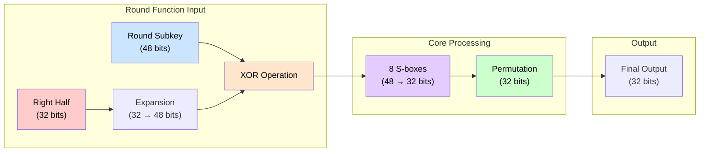

In the diagram above:

- Colors represent different stages:

  - Red: Input processing stage
  - Blue: Key material
  - Yellow: Core transformation
  - Purple: Substitution boxes
  - Green: Final permutation

- Bit transformations show how data expands from 32 to 48 bits for key mixing, then contracts back to 32 bits after substitution
- Each stage builds upon the previous, creating cryptographic strength through iteration

### Detailed Operation

1. **Expansion Permutation (E-box)**

- Takes 32-bit right half
- Duplicates some bits to create 48-bit output
- Ensures efficient key mixing
- Creates redundancy for substitution boxes

2. **XOR with Round Key**

- Performs bitwise XOR with 48-bit round key
- Mixes key material into expanded data
- Creates initial confusion
- Ensures key influence across entire block

3. **Substitution Boxes (S-boxes)**

- Eight parallel 4×16 boxes
- Each processes 6 bits → 4 bits
- Non-linear substitution
- Provides confusion property

4. **Permutation Box (P-box)**

- 32-bit permutation
- Redistributes S-box outputs
- Creates diffusion
- Prepares for next round mixing

### Security Features

1. **Confusion**

- Key mixing through XOR
- Non-linear substitution boxes
- Complex key schedule

2. **Diffusion**

- Bit expansion and permutation
- Parallel S-box processing
- Cross-round dependencies

3. **Round Structure**

- Maintains Feistel symmetry
- Efficient implementation
- Balanced security/performance

This round function repeats 16 times in DES, with each round using a different subset of key bits. The combination of substitution, permutation, and key mixing creates strong cryptographic properties that made DES secure for its time.

## <mark> 14) Explain Byte substitution and Shift row operation of AES in detail. </mark>

Byte substitution and shift rows are two fundamental operations in AES's round function that work together to provide strong cryptographic properties. Let me explain each in detail.

### Byte Substitution (SubBytes)

1. **Operation Overview**

- Replaces each byte independently using S-box lookup
- Combines affine transformation with multiplicative inverse
- Provides non-linear substitution
- Ensures high confusion property

2. **Mathematical Process**

- Each byte goes through multiplicative inverse in GF(2^8)
- Affine transformation follows specific matrix multiplication
- Constant vector added for additional complexity
- Results stored in S-box lookup table

Let me illustrate the SubBytes operation visually:

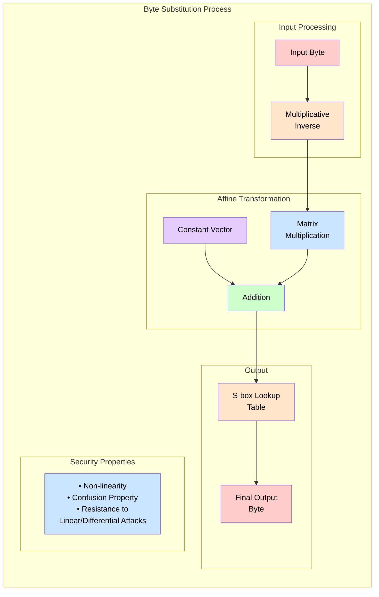

In the diagram above:

- Colors represent different stages: - Red: Input processing stage

  - Yellow: Mathematical transformations
  - Blue: Matrix operations
  - Purple: Constant vector addition
  - Green: Final lookup and output

- The multiplicative inverse provides the core non-linearity
- Affine transformation adds additional complexity
- Security properties emerge from the combination of these operations

### Shift Rows Operation

1. **Operation Overview**

- Performs cyclic shift on each row independently
- Different shifts for each row
- Preserves byte alignment within columns
- Creates diffusion across state matrix

2. **Shift Pattern**

- Round 1: [0,1,2,3] shifts
- Round 2: [0,1,2,3] shifts
- Round 3: [0,1,2,3] shifts
- Round 4: [0,1,2,3] shifts

Let me show how ShiftRows transforms the state matrix:

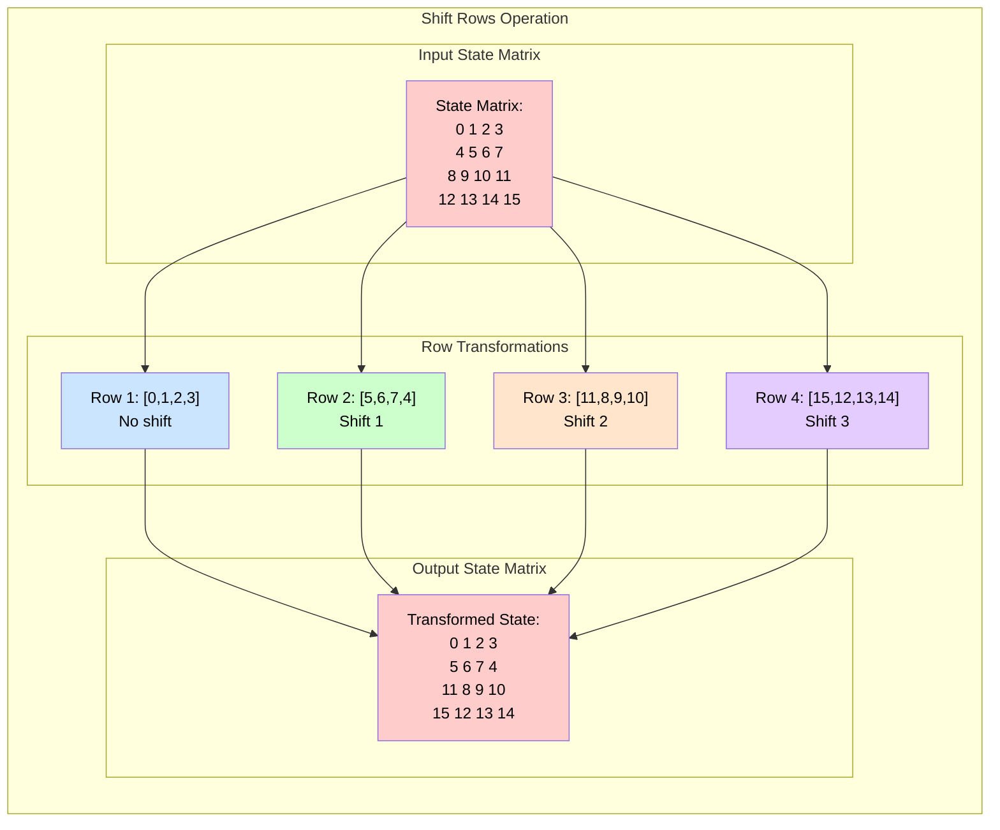

In the diagram above:

- Colors represent different stages: - Red: Input and final states

  - Blue: Row 1 (no shift)
  - Green: Row 2 (shift 1)
  - Yellow: Row 3 (shift 2)
  - Purple: Row 4 (shift 3)

- Numbers represent byte positions (0-15)
- Shifts wrap around cyclically (last becomes first)
- Each row maintains its column alignment

### Combined Security Effects

1. **SubBytes + ShiftRows Interaction**

- SubBytes provides local substitution
- ShiftRows spreads substitution effects
- Together ensure full diffusion
- Resists differential and linear cryptanalysis

2. **Implementation Efficiency**

- SubBytes uses lookup tables
- ShiftRows requires minimal memory movement
- Both support parallel processing
- Efficient in both hardware and software

### Practical Implementation Considerations

1. **SubBytes Implementation**

- Typically implemented as 256-byte lookup table
- Precomputed values for efficiency
- Same table used for encryption/decryption
- Hardware implementations often include dedicated circuitry

2. **ShiftRows Implementation**

- Simple byte rearrangement
- Minimal computational overhead
- Easy to implement in hardware
- Supports parallel processing

These operations form the core of AES's round function, providing the cryptographic strength that makes AES secure against known attacks. Their combination ensures both confusion and diffusion properties essential for modern encryption algorithms.

## <mark> 15) Elaborate AES encryption with neat sketches. </mark>

AES (Advanced Encryption Standard) is a widely-used symmetric encryption algorithm that provides strong security through multiple rounds of substitution and permutation operations. Let me explain its structure and operation with detailed visualizations.

### Basic Structure

AES operates on fixed-size blocks of 128 bits, organized as a 4×4 matrix of bytes. Each round consists of four main operations that work together to provide strong encryption.

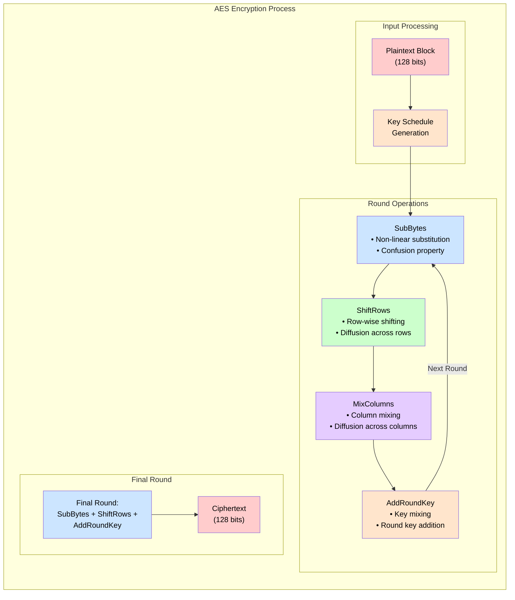

In the diagram above:

- Colors represent different stages:

  - Red: Input/output states
  - Yellow: Key generation and mixing
  - Blue: Non-linear substitution
  - Green: Row operations
  - Purple: Column mixing

- Each round uses a different round key from the key schedule
- The final round omits MixColumns for additional security
- Operations feed back into subsequent rounds except for the last

### Detailed Operation Flow

Let's examine how these operations transform the state matrix:

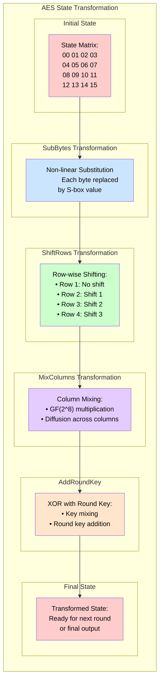

In the transformation diagram above:

- Numbers represent byte positions (00-15) in hexadecimal
- Colors show the progression of transformations:

  - Red: Initial and final states
  - Blue: Non-linear substitution
  - Green: Row operations
  - Purple: Column mixing
  - Yellow: Key mixing

- Each transformation builds upon the previous one
- The process repeats for multiple rounds (10, 12, or 14 rounds depending on key size)

### Key Size Variants

AES supports three key sizes, each requiring a different number of rounds:

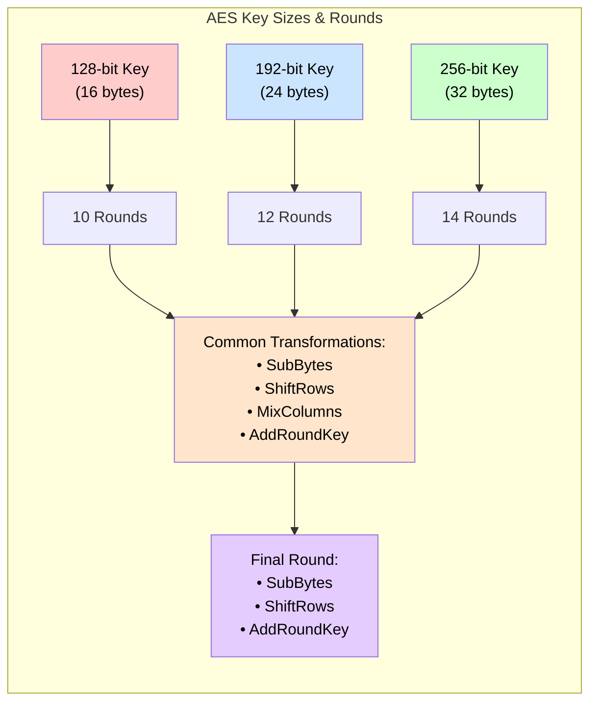

In the key size diagram above:

- Colors represent different aspects:

  - Red: 128-bit variant (original AES)
  - Blue: 192-bit variant
  - Green: 256-bit variant
  - Yellow: Common transformations
  - Purple: Final round operations

- Larger keys require more rounds for proportional security
- All variants share the same basic structure but differ in complexity
- The final round remains constant across all variants for simplicity

### Security Features

1. **Confusion Property**

- Provided by SubBytes operation
- Makes relationship between plaintext and ciphertext complex
- Resists linear cryptanalysis

2. **Diffusion Property**

- Achieved through ShiftRows and MixColumns
- Spreads single-byte changes across multiple bytes
- Makes differential cryptanalysis difficult

3. **Key Schedule**

- Generates round keys systematically
- Ensures different keys for each round
- Maintains security across all rounds

### Practical Implementation Considerations

1. **Hardware Optimization**

- Dedicated AES instruction sets in modern CPUs
- Efficient implementation of S-box lookups
- Parallel processing support
- Minimal memory requirements

2. **Software Implementation**

- Lookup tables for SubBytes
- Efficient MixColumns implementation
- Optimized key schedule generation
- Support for all key sizes

AES's strength comes from the careful balance of these operations, providing strong security while maintaining practical efficiency. The visualizations above demonstrate how each component contributes to the overall cryptographic security of the algorithm.

## <mark> 16) Explain avalanche effect in DES and discuss strength of DES in brief. </mark>

**Avalanche Effect in DES:**

The avalanche effect is a desirable property of cryptographic algorithms where a small change in the input (plaintext or key) results in a significant change in the output (ciphertext). In DES, this effect is crucial for its security.

- **How it works:**
  - DES achieves the avalanche effect through its series of rounds, particularly the S-boxes and the P-box.
  - The S-boxes introduce non-linearity, meaning a single bit change in the input can cause multiple bit changes in the output.
  - The P-box and the Shift operations in the Feistel structure ensure that these changes are spread throughout the block.
  - As a result, even a single bit flip in the plaintext or key propagates through the rounds, causing a cascading effect and significantly altering the ciphertext.
- **Significance:**
  - The avalanche effect makes it difficult for attackers to perform differential cryptanalysis, where they analyze how changes in the input affect the output.
  - It helps to obscure the relationship between the plaintext, key, and ciphertext, making the cipher more resistant to attacks.

**Strength of DES (in brief):**

DES (Data Encryption Standard) was once a widely used symmetric-key block cipher, but it has several weaknesses that make it vulnerable to modern attacks.

- **Key Size:**
  - The most significant weakness of DES is its short key size of 56 bits.
  - This key size is too small to withstand brute-force attacks with modern computing power.
  - In 1999, a DES cracker was built that could break a DES key in a matter of hours.
- **S-boxes:**
  - While the S-boxes were designed to provide non-linearity, they have been the subject of scrutiny.
  - Although no deliberate weaknesses have been definitively proven, there have been concerns that the S-boxes might have been designed with hidden vulnerabilities.
- **Block Size:**
  - The 64 bit block size is also considered to be too small for some modern applications.
- **Modes of Operation:**
  - The security of DES also depends on the mode of operation used. ECB mode is extremely weak.
- **Strengths:**
  - DES introduced important cryptographic concepts like the Feistel network and the avalanche effect.
  - It was a significant advancement in cryptography when it was first introduced.
  - 3DES was created to extend the life of DES, and uses DES three times to increase the key length.

**Conclusion:**

Due to its small key size, DES is no longer considered secure for most applications. However, it remains an important historical cipher and a valuable learning tool for understanding cryptographic principles.

## <mark> 17) Explain function of S-BOX in DES and also Explain avalanche effect. </mark>

Let's break down the S-boxes in DES and the avalanche effect:

**S-Boxes in DES:**

- **Purpose:**
  - The S-boxes (Substitution boxes) are the core of DES's non-linearity. They are the only non-linear components in the DES algorithm.
  - Their primary function is to introduce confusion, which obscures the relationship between the plaintext and the ciphertext.
- **How they work:**
  - DES has eight S-boxes, each with a 6-bit input and a 4-bit output.
  - After the expansion and key mixing stages, the 48-bit result is divided into eight 6-bit blocks.
  - Each 6-bit block is fed into a corresponding S-box.
  - The first and last bits of the 6-bit input select a row (0-3) in the S-box's lookup table.
  - The middle four bits select a column (0-15).
  - The value at the intersection of the selected row and column is the 4-bit output.
  - These S-boxes are pre-defined lookup tables that perform a complex, non-linear substitution.
- **Importance:**
  - The non-linear nature of the S-boxes is crucial for DES's security. Without them, DES would be a linear cipher, easily broken with linear cryptanalysis.
  - The S-boxes are carefully designed to provide resistance to differential cryptanalysis, which analyzes how differences in the input affect the output.

**Avalanche Effect (in detail):**

- **Definition:**
  - The avalanche effect is a property of cryptographic algorithms where a small change in the input (plaintext or key) causes a significant change in the output (ciphertext).
- **How it works in DES:**
  - DES achieves the avalanche effect through the combined action of its S-boxes and permutation (P-box).
  - When a single bit is changed in the plaintext or key:
    - The change is fed into the S-boxes, which, due to their non-linear nature, produce multiple bit changes in their outputs.
    - The P-box then permutes these changed bits, spreading them throughout the 32-bit output.
    - This process repeats in each round, causing the changes to propagate and amplify.
    - Because of the Feistel structure, the right half of the block is then xored with the left half of the block, which causes the changes to propagate across the entire block.
- **Significance:**
  - **Security:** The avalanche effect is essential for the security of block ciphers. It makes it extremely difficult for attackers to predict how changes in the input will affect the output.
  - **Resistance to analysis:** It hinders attacks like differential cryptanalysis, where attackers try to find patterns in the relationship between input and output differences.
  - **Diffusion:** The avalanche effect is a manifestation of diffusion, a fundamental principle of cryptography that aims to spread the influence of each input bit throughout the output.

In essence, the S-boxes provide the non-linearity that initiates the avalanche effect, and the permutation and round structure ensure that the effect is thoroughly propagated throughout the ciphertext.

## <mark> 18) What are the different Types of Attack on Encrypted Messages. </mark>

Attacks on encrypted messages can be broadly categorized based on the attacker's knowledge, resources, and goals. Here are some common types:

**1. Ciphertext-Only Attack:**

- **Description:** The attacker only has access to the ciphertext and tries to deduce the plaintext or the key.
- **Characteristics:**
  - This is the most basic attack and also the most challenging for the attacker.
  - The attacker might use statistical analysis, pattern recognition, or brute-force techniques.
- **Example:** Trying to decode a message by analyzing the frequency of characters in the ciphertext.

**2. Known-Plaintext Attack:**

- **Description:** The attacker has access to both the ciphertext and the corresponding plaintext for one or more messages.
- **Characteristics:**
  - The attacker uses this information to deduce the key or to find a way to decrypt other ciphertexts.
  - This attack is more powerful than a ciphertext-only attack.
- **Example:** If an attacker knows a common message format, they might obtain both the plaintext and ciphertext for a few messages.

**3. Chosen-Plaintext Attack:**

- **Description:** The attacker can choose arbitrary plaintexts and obtain their corresponding ciphertexts.
- **Characteristics:**
  - This gives the attacker significant control, allowing them to choose plaintexts that might reveal information about the key.
  - This attack is very powerful.
- **Example:** An attacker might choose specific plaintexts designed to test the cipher's behavior.

**4. Chosen-Ciphertext Attack:**

- **Description:** The attacker can choose arbitrary ciphertexts and obtain their corresponding plaintexts.
- **Characteristics:**
  - This is even more powerful than a chosen-plaintext attack.
  - The attacker can use this ability to find weaknesses in the decryption algorithm.
- **Example:** An attacker might submit carefully crafted ciphertexts to a decryption system to observe the resulting plaintexts.

**5. Man-in-the-Middle Attack:**

- **Description:** The attacker intercepts communications between two parties, potentially modifying or replacing messages.
- **Characteristics:**
  - The attacker can eavesdrop on communications and potentially insert their own messages.
  - This attack often targets key exchange protocols.
- **Example:** An attacker intercepts the exchange of public keys and replaces them with their own keys.

**6. Replay Attack:**

- **Description:** The attacker intercepts and retransmits a valid message, potentially causing an unintended action.
- **Characteristics:**
  - This attack is effective against systems that do not have mechanisms to prevent the reuse of messages.
- **Example:** An attacker captures a network login message and retransmits it to gain unauthorized access.

Understanding these attack types is crucial for designing and implementing secure cryptographic systems.

## <mark> 19) Write a short note on Blowfish with a diagram. </mark>

Blowfish is a symmetric-key block cipher designed by Bruce Schneier in 1993. It is known for its simplicity, efficiency, and strong security features. Blowfish is widely used in various applications, including file encryption and secure communications.

### Key Features of Blowfish:

1. **Block Size**: Blowfish operates on 64-bit blocks of data.
2. **Key Size**: The key size can vary from 32 bits to 448 bits, providing flexibility in security levels.
3. **Feistel Network**: Blowfish uses a Feistel network structure, which consists of multiple rounds of encryption. The default number of rounds is 16, but this can be adjusted.
4. **Subkeys**: Blowfish generates a set of subkeys from the main key using a key schedule algorithm. These subkeys are used in the encryption and decryption processes.
5. **S-Boxes**: Blowfish employs S-boxes (substitution boxes) to introduce non-linearity into the encryption process, enhancing security.

### Blowfish Encryption Process:

1. **Initial Permutation**: The plaintext block is split into two 32-bit halves, which are then XORed with subkeys.
2. **Rounds**: The data undergoes multiple rounds of encryption, each consisting of a series of operations involving XOR, addition, and S-box lookups.
3. **Final Permutation**: After the final round, the two halves are combined to form the ciphertext block.

### Diagram of Blowfish Encryption:

```mermaid
flowchart TD
    subgraph "Blowfish Encryption Process"
        direction TB

        subgraph "Input Processing"
            PT["Plaintext Block
            (64 bits)"] --> KS["Key Schedule
            Generation"]

            style PT fill:#ffcccc,color:#000000
            style KS fill:#ffe5cc,color:#000000
        end

        subgraph "Round Operations"
            SB["SubBytes
            • Non-linear substitution
            • 4×4 S-boxes"] --> SR["ShiftRows
            • Row-wise shifting
            • Diffusion across rows"]

            SR --> MC["MixColumns
            • Column mixing
            • Diffusion across columns"]

            MC --> AK["AddRoundKey
            • Key mixing
            • Round key addition"]

            style SB fill:#cce5ff,color:#000000
            style SR fill:#ccffcc,color:#000000
            style MC fill:#e5ccff,color:#000000
            style AK fill:#ffe5cc,color:#000000
        end

        subgraph "Round Structure"
            R1["Round 1"] --> R2["Round 2"]
            R2 --> R3["Round 3"]
            R3 --> R4["Round 4"]
            R4 --> R5["Round 5"]
            R5 --> R6["Round 6"]
            R6 --> R7["Round 7"]
            R7 --> R8["Round 8"]
            R8 --> R9["Round 9"]
            R9 --> R10["Round 10"]
            R10 --> R11["Round 11"]
            R11 --> R12["Round 12"]
            R12 --> R13["Round 13"]
            R13 --> R14["Round 14"]
            R14 --> R15["Round 15"]
            R15 --> R16["Round 16"]

            style R1 fill:#cce5ff,color:#000000
            style R2 fill:#cce5ff,color:#000000
            style R3 fill:#cce5ff,color:#000000
            style R4 fill:#cce5ff,color:#000000
            style R5 fill:#cce5ff,color:#000000
            style R6 fill:#cce5ff,color:#000000
            style R7 fill:#cce5ff,color:#000000
            style R8 fill:#cce5ff,color:#000000
            style R9 fill:#cce5ff,color:#000000
            style R10 fill:#cce5ff,color:#000000
            style R11 fill:#cce5ff,color:#000000
            style R12 fill:#cce5ff,color:#000000
            style R13 fill:#cce5ff,color:#000000
            style R14 fill:#cce5ff,color:#000000
            style R15 fill:#cce5ff,color:#000000
            style R16 fill:#cce5ff,color:#000000
        end

        subgraph "Final Round"
            FR["Final Round:
            • SubBytes
            • ShiftRows
            • AddRoundKey"] --> CT["Ciphertext
            (64 bits)"]

            style FR fill:#cce5ff,color:#000000
            style CT fill:#ffcccc,color:#000000
        end

        KS --> SB
        AK --> |"Next Round"| SB
        R16 --> FR
    end
```

### Security and Performance:

- **Security**: Blowfish is considered secure against various types of attacks, including linear and differential cryptanalysis. However, its security depends on the number of rounds and the key size used.
- **Performance**: Blowfish is efficient in terms of both speed and memory usage, making it suitable for a wide range of applications.

### Applications:

Blowfish is used in various encryption tools and protocols, including:

- **GnuPG**: A popular encryption software.
- **OpenSSL**: A widely used cryptographic library.
- **BCrypt**: A password hashing function based on Blowfish.

In summary, Blowfish is a robust and efficient symmetric-key block cipher that provides strong security for encrypting data. Its Feistel network structure and the use of S-boxes contribute to its effectiveness in protecting sensitive information.

## <mark> 20) Specify the difference between diffusion and confusion. </mark>

### Difference Between Diffusion and Confusion

Diffusion and confusion are two fundamental principles in cryptographic algorithms, introduced by **Claude Shannon** to enhance security.

| **Feature**        | **Diffusion**                                                                       | **Confusion**                                                                                 |
| ------------------ | ----------------------------------------------------------------------------------- | --------------------------------------------------------------------------------------------- |
| **Definition**     | Spreads out the influence of plaintext over the ciphertext.                         | Hides the relationship between the plaintext, ciphertext, and key.                            |
| **Objective**      | Reduces patterns in the ciphertext to make cryptanalysis difficult.                 | Makes it hard to deduce the encryption key even if some plaintext-ciphertext pairs are known. |
| **Implementation** | Achieved through **permutations and transpositions**.                               | Achieved through **substitution** (complex mapping of inputs to outputs).                     |
| **Example**        | **DES (Data Encryption Standard)** uses permutation functions to achieve diffusion. | **AES (Advanced Encryption Standard)** uses S-Boxes for confusion.                            |
| **Effect**         | A small change in plaintext spreads over the entire ciphertext (avalanche effect).  | Alters the ciphertext in a complex way so that it appears random.                             |

Both principles work together to strengthen encryption, making it resistant to attacks like frequency analysis and brute force.

## <mark> 21) Differentiate between a block cipher and a stream cipher. </mark>

### Difference Between Block Cipher and Stream Cipher

| **Feature**            | **Block Cipher**                                            | **Stream Cipher**                                                            |
| ---------------------- | ----------------------------------------------------------- | ---------------------------------------------------------------------------- |
| **Definition**         | Encrypts data in fixed-size blocks (e.g., 64-bit, 128-bit). | Encrypts data one bit or byte at a time in a continuous stream.              |
| **Speed**              | Generally slower due to complex processing of blocks.       | Faster since it encrypts data in real-time.                                  |
| **Encryption Method**  | Uses **substitution and permutation** in multiple rounds.   | Uses **keystream generation** combined with plaintext (e.g., XOR operation). |
| **Example Algorithms** | AES, DES, Blowfish                                          | RC4, ChaCha20, Salsa20                                                       |
| **Error Propagation**  | An error in one block affects only that block.              | An error in one bit affects the entire message.                              |
| **Usage**              | Used for **file encryption, database encryption**.          | Used for **real-time communications (Wi-Fi, VoIP, streaming)**.              |

Both types have their advantages, and the choice depends on the security and performance requirements of the application.

## <mark> 22) Define meet-in-the-middle attack. </mark>

A meet-in-the-middle attack is a cryptanalytic attack that attempts to find the secret key in a cipher that uses multiple encryption stages. It's particularly relevant when a cipher uses two or more rounds of encryption with independent keys.

Here's a breakdown:

**How it Works:**

1.  **Divide and Conquer:**

    - The attack exploits the fact that if a cipher uses two encryption stages (e.g., E<sub>k1</sub>(E<sub>k2</sub>(P)) = C), it can be broken faster than a brute-force attack on the combined key space.
    - Instead of trying all possible combinations of k1 and k2, the attack works from both ends.

2.  **Encryption from Plaintext:**

    - The attacker encrypts the known plaintext (P) using all possible values of the first key (k1) and stores the resulting intermediate values.

3.  **Decryption from Ciphertext:**

    - The attacker decrypts the known ciphertext (C) using all possible values of the second key (k2) and stores the resulting intermediate values.

4.  **Match and Find:**
    - The attacker compares the two sets of intermediate values.
    - When a match is found, it means that the corresponding k1 and k2 values are likely the correct keys.

**Why it's effective:**

- Instead of needing to try all k1\*k2 combinations, the attack only needs to perform approximately k1 + k2 operations.
- This significantly reduces the time complexity compared to a brute-force attack.

**Example:**

Consider a hypothetical cipher that uses two rounds of encryption with 56-bit keys each.

- A brute-force attack would require trying 2<sup>112</sup> key combinations.
- A meet-in-the-middle attack would require approximately 2<sup>56</sup> encryptions and 2<sup>56</sup> decryptions, plus the time to compare the results. This is significantly faster.

**Limitations:**

- The meet-in-the-middle attack is most effective against ciphers that use multiple rounds with independent keys.
- It can be prevented by using a more complex key schedule or by using a single, stronger encryption algorithm.
- It requires known plaintext/cyphertext pairs.

**Relevance:**

- The meet-in-the-middle attack was famously used to demonstrate a weakness in double-DES (DES encrypted twice with two keys).
- This attack is one of the reasons that triple DES was created.

## <mark> 23) Explain Transposition Technique. </mark>

The transposition technique is a classical encryption method that rearranges the positions of the plaintext characters to create the ciphertext. Unlike substitution techniques, which replace characters with other characters, transposition techniques keep the original characters intact but change their order.

Here's a breakdown of how transposition techniques work:

**Core Concept:**

- The fundamental idea is to scramble the order of the plaintext characters according to a specific rule or pattern.
- This rearrangement makes the ciphertext appear jumbled and difficult to decipher without knowing the transposition rule.

**Common Transposition Techniques:**

1.  **Columnar Transposition:**

    - The plaintext is written horizontally into a grid of a specified number of columns.
    - The ciphertext is then read vertically, column by column, in a predetermined order.
    - The order of the columns is determined by a keyword or a numerical sequence.
    - Example:
      - Plaintext: "ATTACKPOSTPONEDUNTILTWELVEPM"
      - Keyword: "4312567"
      - Grid:
        ```
        4 3 1 2 5 6 7
        A T T A C K P
        O S T P O N E
        D U N T I L T
        W E L V E P M
        ```
      - Ciphertext: "TTNACOPKTSUODWIEPASTNLVEMT"

2.  **Rail Fence Technique:**

    - The plaintext is written diagonally downwards and upwards on a "rail" structure.
    - The ciphertext is then read horizontally, row by row.
    - The number of "rails" determines the transposition pattern.
    - Example with 3 rails:
      - Plaintext: "HELLOWORLD"
      - Rail 1: H...L...W...L
      - Rail 2: .E.O.O.R.D
      - Rail 3: ..L...R...
      - Ciphertext: HLWLEOORDLR

3.  **Route Cipher:**
    - The plaintext is written into a grid following a specific path, such as a spiral or a zigzag.
    - The ciphertext is then read out of the grid in a different path.

**Key Characteristics:**

- **Simplicity:** Transposition techniques are relatively simple to implement.
- **Weakness:** They are generally considered weak against modern cryptanalysis, especially when used alone.
- **Frequency Analysis:** Transposition ciphers preserve the frequency of individual characters, making them vulnerable to frequency analysis.
- **Combination:** Transposition techniques are often combined with substitution techniques to create stronger ciphers.

**Purpose:**

- Historically, transposition techniques were used to provide basic confidentiality.
- In modern cryptography, they are rarely used as standalone encryption methods but may be incorporated as part of more complex algorithms.

## <mark> 24) Write a short note on Triple DES. </mark>

### Triple DES (3DES): Overview

**Triple Data Encryption Standard (Triple DES or 3DES)** is a symmetric block cipher that enhances the security of the original DES algorithm by applying it three times to each data block. It was introduced in 1998 as an interim solution to address the vulnerabilities of DES, which had become insecure due to its short 56-bit key length.

### How Triple DES Works

Triple DES operates in three steps using the **Encrypt-Decrypt-Encrypt (EDE)** process:

1. **Encrypt** the plaintext using the first key ($$K_1$$).
2. **Decrypt** the result using the second key ($$K_2$$).
3. **Encrypt** again using the third key ($$K_3$$).

The process can be summarized as:

$$
C = E_{K_3}(D_{K_2}(E_{K_1}(P)))
$$

Where $$E$$ represents encryption, $$D$$ represents decryption, $$P$$ is the plaintext, and $$C$$ is the ciphertext.

- In a **two-key variant**, $$K_1 = K_3$$, reducing the effective key length to 112 bits.
- In a **three-key variant**, all keys are independent, providing a theoretical key length of 168 bits. However, due to meet-in-the-middle attacks, its effective security is only 112 bits.

### Key Features

- **Block Size**: Operates on 64-bit blocks of data.
- **Key Length**: Uses three 56-bit keys (totaling 168 bits, though only 112 bits are effectively secure).
- **Security**: Stronger than DES but vulnerable to modern cryptographic attacks like Sweet32 due to its small block size.

### Strengths

1. Backward compatibility with DES.
2. Increased security compared to single DES.
3. Proven reliability over decades of use.

### Weaknesses

1. Computationally slower (three times slower than DES).
2. Vulnerable to attacks like meet-in-the-middle and Sweet32 (due to its 64-bit block size).
3. Deprecated by NIST in 2019 and disallowed for most applications after 2023.

### Applications

Triple DES was widely used in industries like banking and telecommunications for securing financial transactions (e.g., ATM PIN encryption). However, it has been largely replaced by AES (Advanced Encryption Standard), which is faster and more secure.

### Diagram of Triple DES Encryption

```
Plaintext
   ↓
Encrypt with K1 → Ciphertext1
   ↓
Decrypt with K2 → Ciphertext2
   ↓
Encrypt with K3 → Final Ciphertext
```

### Conclusion

While Triple DES improved upon the weaknesses of DES, it has become obsolete due to advancements in cryptanalysis and computing power. AES is now the preferred standard for modern encryption needs.

## <mark> 25) Discuss the following terms in brief: <br> i) brute force attack ii) cryptography </mark>

### i) Brute Force Attack:

**Definition**: A brute force attack is a cryptographic attack method where the attacker systematically tries all possible combinations of keys or passwords until the correct one is found. This approach relies on the computational power of the attacker's resources rather than any specific vulnerability in the encryption algorithm.

**Mechanism**:

- **Exhaustive Search**: The attacker attempts every possible key or password in a predefined keyspace.
- **Time-Consuming**: The time required for a brute force attack depends on the length and complexity of the key or password. Longer and more complex keys significantly increase the time needed.
- **Resource-Intensive**: Requires substantial computational resources, especially for large keyspaces.

**Applications**:

- **Password Cracking**: Often used to crack passwords by trying all possible combinations.
- **Key Recovery**: Can be used to recover encryption keys by exhaustively searching the keyspace.

**Countermeasures**:

- **Strong Passwords**: Use long and complex passwords that are difficult to guess.
- **Key Length**: Employ encryption algorithms with sufficiently long key lengths to make brute force attacks impractical.
- **Rate Limiting**: Implement rate-limiting mechanisms to slow down the number of attempts an attacker can make.

**Example**: If an attacker is trying to crack a 4-digit PIN, they would try all combinations from 0000 to 9999. For a longer password or encryption key, the number of possible combinations increases exponentially.

### ii) Cryptography:

**Definition**: Cryptography is the practice and study of techniques used for secure communication in the presence of adversaries. It involves creating algorithms and protocols to protect information by transforming it into an unreadable format, ensuring confidentiality, integrity, authenticity, and non-repudiation.

**Key Concepts**:

- **Encryption**: The process of converting plaintext (readable data) into ciphertext (unreadable data) using an encryption algorithm and a key.
- **Decryption**: The process of converting ciphertext back into plaintext using a decryption algorithm and a key.
- **Symmetric-Key Cryptography**: Uses the same key for both encryption and decryption (e.g., AES, DES).
- **Asymmetric-Key Cryptography**: Uses a pair of keys—a public key for encryption and a private key for decryption (e.g., RSA, ECC).
- **Hash Functions**: One-way functions that produce a fixed-size output (hash) from an input of any size, used for data integrity and authentication (e.g., SHA-256).

**Applications**:

- **Secure Communications**: Protects data transmitted over networks (e.g., HTTPS, VPNs).
- **Data Storage**: Encrypts data stored on devices to prevent unauthorized access.
- **Digital Signatures**: Ensures the authenticity and integrity of digital documents.
- **Blockchain**: Uses cryptographic techniques to secure transactions and maintain a decentralized ledger.

**Importance**:

- **Confidentiality**: Ensures that only authorized parties can access sensitive information.
- **Integrity**: Protects data from being altered or tampered with.
- **Authenticity**: Verifies the identity of communicating parties.
- **Non-Repudiation**: Ensures that actions or agreements cannot be denied by the parties involved.

**Example**: When you send an email using a secure email service, cryptography is used to encrypt the email content so that only the intended recipient can read it. The recipient uses their private key to decrypt the email, ensuring confidentiality and authenticity.

In summary, cryptography is a fundamental field that enables secure communication and data protection in the digital age. It encompasses various techniques and algorithms to safeguard information against unauthorized access and tampering.
