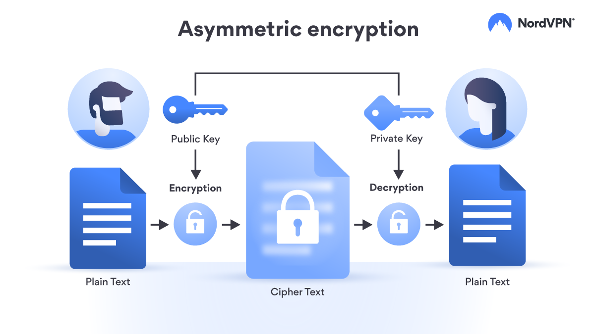
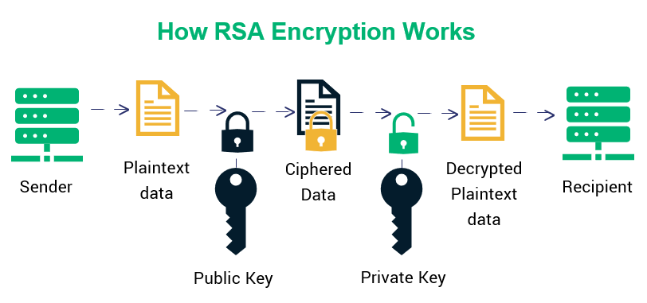
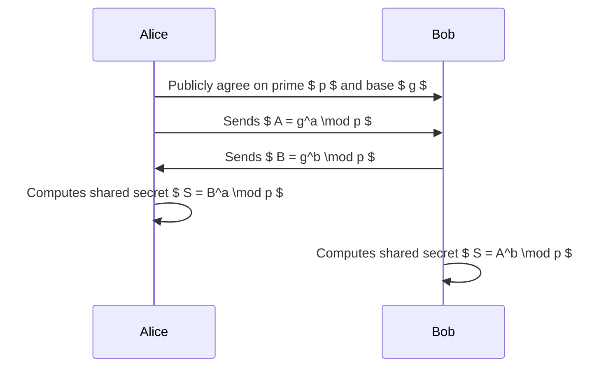
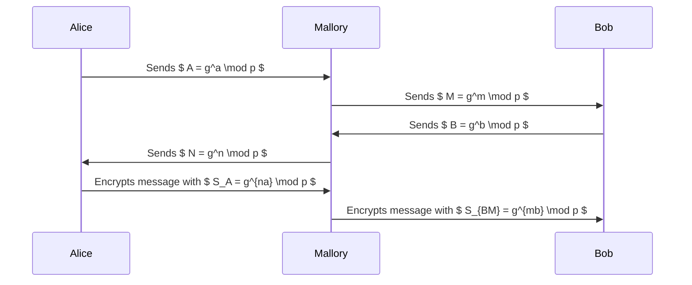
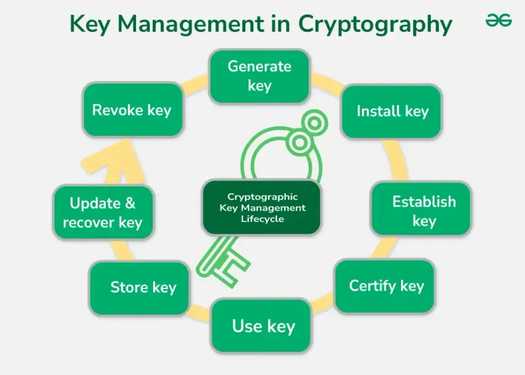

# Unit 2

## <mark> 1) Define Asymmetric Key Encryption with a proper Diagram. </mark>

Asymmetric key encryption, also known as public-key cryptography, utilizes a pair of keys—a public key and a private key—to secure data. The public key is openly shared and used for encryption, while the private key remains confidential and is used for decryption. This method ensures that only the intended recipient, who possesses the private key, can access the encrypted information.

**Process:**

1. The sender obtains the recipient's public key.
2. Using this public key, the sender encrypts the message.
3. The encrypted message is transmitted to the recipient.
4. The recipient uses their private key to decrypt and read the message.

This approach eliminates the need for sharing secret keys beforehand, addressing key distribution challenges inherent in symmetric encryption systems. Asymmetric encryption is widely used in applications such as secure email communication, digital signatures, and SSL/TLS protocols.

**Diagram:**

In the diagram above, the sender encrypts the plaintext message using the recipient's public key. The ciphertext is then sent over the network. Upon receiving it, the recipient decrypts the ciphertext using their private key, retrieving the original plaintext message.

This mechanism ensures that even if the encrypted message is intercepted during transmission, it cannot be decrypted without the corresponding private key, thereby maintaining confidentiality and security.

## <mark> 2) Explain RSA public key cryptography with all steps. </mark>

RSA (Rivest-Shamir-Adleman) is an asymmetric cryptographic algorithm that uses a pair of keys—a public key for encryption and a private key for decryption—to securely transmit data. The security of RSA relies on the computational difficulty of factoring large composite numbers.

**Key Generation Steps:**

1. **Select Two Large Prime Numbers (p and q):** Choose two distinct large prime numbers, `p` and `q`. These should be kept secret to ensure security.

2. **Compute n:** Calculate the product of `p` and `q`:
   $$ n = p \times q $$
   `n` serves as the modulus for both the public and private keys.

3. **Calculate Euler's Totient Function (φ(n)):** Determine the totient function:
   $$ \phi(n) = (p - 1) \times (q - 1) $$
   This value is used in the key generation process.

4. **Choose Public Exponent (e):** Select an integer `e` such that:

   - $ 1 < e < \phi(n) $
   - `e` is coprime with φ(n) (i.e., gcd(e, φ(n)) = 1)
     Common choices for `e` include 3, 17, or 65537.

5. **Compute Private Exponent (d):** Determine `d` as the modular multiplicative inverse of `e` modulo φ(n):
   $$ d \times e \equiv 1 \pmod{\phi(n)} $$
   This means:
   $$ d = e^{-1} \pmod{\phi(n)} $$

The public key consists of `(n, e)`, and the private key consists of `(n, d)`.

**Encryption Process:**

1. **Obtain Recipient's Public Key:** Retrieve the recipient's public key `(n, e)`.

2. **Convert Plaintext to Integer (m):** Transform the plaintext message into an integer `m` such that $ 0 \leq m < n $. This is typically done using a reversible encoding scheme.

3. **Compute Ciphertext (c):** Encrypt the message using the public key:
   $$ c = m^e \pmod{n} $$

**Decryption Process:**

1. **Use Private Key:** Utilize the private key `(n, d)` for decryption.

2. **Compute Original Message (m):** Decrypt the ciphertext:
   $$ m = c^d \pmod{n} $$

3. **Revert Integer to Plaintext:** Convert the integer `m` back to the original plaintext message using the appropriate decoding scheme.

**Example:**

1. **Key Generation:**

   - Select primes: `p = 61`, `q = 53`
   - Compute `n`:
     $$ n = 61 \times 53 = 3,233 $$
   - Calculate φ(n):
     $$ \phi(n) = (61 - 1) \times (53 - 1) = 3,120 $$
   - Choose `e`:
     $$ e = 17 $$
   - Compute `d`:
     $$ d \times 17 \equiv 1 \pmod{3,120} $$
     $$ d = 2,753 $$

2. **Encryption:**

   - Message: `m = 65`
   - Compute ciphertext:
     $$ c = 65^{17} \pmod{3,233} = 2,790 $$

3. **Decryption:**
   - Compute original message:
     $$ m = 2,790^{2,753} \pmod{3,233} = 65 $$

This example demonstrates the RSA algorithm's process of key generation, encryption, and decryption.

**Diagram:**

In the diagram, the sender encrypts the plaintext message using the recipient's public key, resulting in ciphertext. The recipient then decrypts this ciphertext using their private key to retrieve the original plaintext message.

## <mark> 3) Explain Diffie Hellman Key Exchange with all steps. </mark>

The Diffie-Hellman key exchange algorithm allows two parties to securely establish a shared secret over an insecure communication channel. This shared secret can then be used for symmetric encryption to ensure confidentiality.

**Steps of the Diffie-Hellman Key Exchange:**

1. **Agree on Public Parameters:**

   - Both parties select a large prime number $ p $ and a primitive root modulo $ p $, denoted as $ g $. These values are public and can be known to anyone.

2. **Select Private Keys:**

   - Each party chooses a private key:
     - Alice selects a private key $ a $, where $ 1 < a < p $.
     - Bob selects a private key $ b $, where $ 1 < b < p $.
   - These private keys are kept secret.

3. **Compute Public Keys:**

   - Using their private keys, both parties compute their respective public keys:
     - Alice computes $ A = g^a \mod p $.
     - Bob computes $ B = g^b \mod p $.
   - These public keys are then exchanged between the parties.

4. **Compute Shared Secret:**
   - After exchanging public keys, each party computes the shared secret using their private key and the other party's public key:
     - Alice computes $ S = B^a \mod p $.
     - Bob computes $ S = A^b \mod p $.
   - Both computations result in the same shared secret $ S $ due to the properties of modular arithmetic.

**Example:**

1. **Agree on Public Parameters:**

   - Choose a prime number $ p = 23 $ and a primitive root $ g = 5 $.

2. **Select Private Keys:**

   - Alice selects $ a = 6 $.
   - Bob selects $ b = 15 $.

3. **Compute Public Keys:**

   - Alice computes $ A = 5^6 \mod 23 = 8 $.
   - Bob computes $ B = 5^{15} \mod 23 = 19 $.

4. **Exchange Public Keys:**

   - Alice and Bob exchange their public keys: $ A = 8 $ and $ B = 19 $.

5. **Compute Shared Secret:**
   - Alice computes $ S = 19^6 \mod 23 = 2 $.
   - Bob computes $ S = 8^{15} \mod 23 = 2 $.
   - Both arrive at the shared secret $ S = 2 $.

This shared secret $ S $ can now be used as a key for symmetric encryption algorithms to securely transmit data between Alice and Bob.

**Diagram:**

In this diagram, both Alice and Bob agree on public parameters $ p $ and $ g $, exchange their computed public keys $ A $ and $ B $, and independently compute the shared secret $ S $.

**Security Considerations:**

The security of the Diffie-Hellman key exchange relies on the difficulty of solving the discrete logarithm problem. An eavesdropper, even if they know $ p $, $ g $, $ A $, and $ B $, cannot feasibly compute the shared secret $ S $ without knowing the private keys $ a $ or $ b $.

**Note:** In practical applications, much larger values of $ p $ (typically 2048 bits or more) and corresponding $ g $ are used to ensure security against modern computational capabilities.

## <mark> 4) Justify Diffie Hellman Key Exchange vulnerable to Man in Middle Attack. </mark>

The Diffie-Hellman key exchange protocol allows two parties to establish a shared secret over an insecure channel. However, it is susceptible to a Man-in-the-Middle (MitM) attack due to the absence of authentication mechanisms.

**How the Man-in-the-Middle Attack Works:**

1. **Initial Setup:**

   - Alice and Bob agree on public parameters: a large prime number $ p $ and a base $ g $.
   - Alice selects a private key $ a $ and computes her public value $ A = g^a \mod p $.
   - Bob selects a private key $ b $ and computes his public value $ B = g^b \mod p $.

2. **Interception by the Attacker (Mallory):**

   - Mallory intercepts Alice's public value $ A $ intended for Bob and replaces it with her own public value $ M = g^m \mod p $, where $ m $ is Mallory's private key.
   - Mallory sends $ M $ to Bob, who assumes it's Alice's public value.
   - Similarly, Mallory intercepts Bob's public value $ B $ intended for Alice and replaces it with her own public value $ N = g^n \mod p $, where $ n $ is another private key chosen by Mallory.
   - Mallory sends $ N $ to Alice, who assumes it's Bob's public value.

3. **Establishment of Separate Shared Secrets:**

   - Alice computes the shared secret using the received value $ N $:
     $$
     S_A = N^a \mod p = (g^n)^a \mod p = g^{na} \mod p
     $$
   - Bob computes the shared secret using the received value $ M $:
     $$
     S_B = M^b \mod p = (g^m)^b \mod p = g^{mb} \mod p
     $$
   - Mallory computes both shared secrets:
     $$
     S_{AM} = A^n \mod p = (g^a)^n \mod p = g^{an} \mod p
     $$
     $$
     S_{BM} = B^m \mod p = (g^b)^m \mod p = g^{bm} \mod p
     $$

4. **Communication Compromise:**
   - Alice encrypts messages using $ S_A $, believing it's the shared secret with Bob.
   - Mallory decrypts these messages using $ S*{AM} $, reads or alters them, re-encrypts using $ S*{BM} $, and forwards them to Bob.
   - Bob decrypts messages using $ S_B $, believing they're from Alice.

Throughout this process, Mallory maintains separate shared secrets with both Alice and Bob, effectively controlling and monitoring their communication without their knowledge.

**Diagram Illustrating the Attack:**

**Reason for Vulnerability:**

The core issue is the lack of authentication in the basic Diffie-Hellman protocol. Without verifying the identities of the parties involved, there's no assurance that the public keys exchanged haven't been tampered with by an attacker.

**Mitigation Measures:**

To prevent MitM attacks, it's essential to incorporate authentication mechanisms into the key exchange process:

- **Digital Signatures:** Alice and Bob can sign their public values using their private keys. The recipient can then verify the signature using the sender's public key, ensuring the integrity and authenticity of the public values.

- **Public Key Infrastructure (PKI):** Utilizing certificates issued by trusted Certificate Authorities (CAs) binds public keys to their respective owners, allowing parties to authenticate each other during the exchange.

By integrating these authentication methods, the Diffie-Hellman key exchange can be secured against Man-in-the-Middle attacks.

## <mark> 5) P and Q are two prime numbers. P=7, and Q=17. Take public key E=5. If the plaintext value is 6, then what will be the cipher text value according to the RSA algorithm? Explain in detail. </mark>

Let's work through the steps:

1. **Compute $ n $:**  
   Given $ p = 7 $ and $ q = 17 $, we have:

   $$
   n = p \times q = 7 \times 17 = 119
   $$

2. **Encryption Formula:**  
   The RSA encryption formula is:

   $$
   c = m^e \mod n
   $$

   where:

   - $ m $ is the plaintext
   - $ e $ is the public key exponent
   - $ n $ is the product of the two primes

3. **Substitute the Given Values:**  
   Here, $ m = 6 $, $ e = 5 $, and $ n = 119 $. So, we compute:

   $$
   c = 6^5 \mod 119
   $$

4. **Calculate $ 6^5 $:**

   $$
   6^5 = 6 \times 6 \times 6 \times 6 \times 6 = 7776
   $$

5. **Compute $ 7776 \mod 119 $:**  
   Divide 7776 by 119. The quotient is 65 (since $ 119 \times 65 = 7735 $) and the remainder is:
   $$
   7776 - 7735 = 41
   $$
   Thus,
   $$
   7776 \mod 119 = 41
   $$

**Final Answer:**  
The ciphertext value is **41**.

This detailed computation shows how the RSA encryption formula is applied using the given primes and public key exponent.

## <mark> 6) Solve this example Using Knapsack algorithm   Super Increasing sequence={1, 2, 4, 10, 20, 40} Do necessary calculation to solve. </mark>

Let's solve an example of the Merkle–Hellman Knapsack Cryptosystem using the superincreasing sequence

$$
w = \{1,\; 2,\; 4,\; 10,\; 20,\; 40\}.
$$

For this example, we will illustrate both the encryption and decryption processes. (Since the problem doesn’t specify a plaintext, we’ll assume a 6‐bit message; here we choose the plaintext bits as “101101”.)

---

### Step 1. Key Generation

1. **Private (Superincreasing) Sequence:**  
   This is given as

   $$
   w = \{1, 2, 4, 10, 20, 40\}.
   $$

2. **Choose a Modulus $ Q $:**  
   $ Q $ must be greater than the sum of the sequence.

   $$
   \text{Sum} = 1+2+4+10+20+40 = 77.
   $$

   For example, choose

   $$
   Q = 89 \quad (\text{since } 89 > 77).
   $$

3. **Choose a Multiplier $ R $:**  
   Choose $ R $ such that $ \gcd(R, Q)=1 $ and $ 1 < R < Q $.  
   For instance, let

   $$
   R = 17.
   $$

4. **Compute the Public Key Sequence:**  
   For each $ w_i $ in $ w $, compute

   $$
   b_i = (R \times w_i) \mod Q.
   $$

   Calculation for each component:

   - $ b_1 = (17 \times 1) \mod 89 = 17 $
   - $ b_2 = (17 \times 2) \mod 89 = 34 $
   - $ b_3 = (17 \times 4) \mod 89 = 68 $
   - $ b_4 = (17 \times 10) \mod 89 = 170 \mod 89 = 170-89=81 $
   - $ b_5 = (17 \times 20) \mod 89 = 340 \mod 89 = 340 - 3\times89 = 340-267=73 $
   - $ b_6 = (17 \times 40) \mod 89 = 680 \mod 89 = 680 - 7\times89 = 680-623=57 $

   So, the **public key** is:

   $$
   b = \{17, 34, 68, 81, 73, 57\}.
   $$

---

### Step 2. Encryption

Assume the plaintext message is the 6-bit binary string “101101”. Label the bits corresponding to the private sequence (ordered as given):

$$
\text{Plaintext bits: } (b_1, b_2, b_3, b_4, b_5, b_6) = (1,\; 0,\; 1,\; 1,\; 0,\; 1).
$$

**Encryption Formula:**  
The ciphertext $ C $ is the sum of the public key components corresponding to the 1’s in the plaintext:

$$
C = \sum\_{i=1}^{6} m_i \times b_i.
$$

Plug in the values:

$$
C = 1\cdot17 + 0\cdot34 + 1\cdot68 + 1\cdot81 + 0\cdot73 + 1\cdot57.
$$

Now calculate:

$$
C = 17 + 0 + 68 + 81 + 0 + 57 = 223.
$$

Thus, the ciphertext is **223**.

---

### Step 3. Decryption

To decrypt, the receiver (who knows the private key) performs the following steps:

1. **Compute the Modular Inverse of $ R $ modulo $ Q $:**  
   We need $ R^{-1} $ such that:

   $$
   R \times R^{-1} \equiv 1 \pmod{Q}.
   $$

   With $ R = 17 $ and $ Q = 89 $, using the Extended Euclidean Algorithm we find:

   $$
   17 \times 21 = 357 \quad \text{and} \quad 357 \mod 89 = 1,
   $$

   so

   $$
   R^{-1} = 21.
   $$

2. **Multiply the Ciphertext by $ R^{-1} $ mod $ Q $:**  
   Compute:

   $$
   C' = C \times R^{-1} \mod Q = 223 \times 21 \mod 89.
   $$

   First, $ 223 \times 21 = 4683 $. Then,

   $$
   4683 \mod 89 = 55 \quad \text{(since } 89 \times 52 = 4628 \text{ and } 4683-4628 = 55\text{)}.
   $$

   So, $ C' = 55 $.

3. **Solve the Superincreasing Knapsack Problem:**  
   We now use the superincreasing sequence $ w = \{1, 2, 4, 10, 20, 40\} $ to determine which subset sums to $ 55 $.  
   **Decryption Process (working backward):**

   - Start with the largest number:  
     $ 40 $ is less than or equal to $ 55 $, so include it.  
     Remainder: $ 55 - 40 = 15 $.
   - Next, $ 20 $ is greater than $ 15 $ so skip it.
   - $ 10 $ is less than or equal to $ 15 $; include it.  
     Remainder: $ 15 - 10 = 5 $.
   - $ 4 $ is less than or equal to $ 5 $; include it.  
     Remainder: $ 5 - 4 = 1 $.
   - $ 2 $ is greater than $ 1 $; skip it.
   - $ 1 $ is equal to the remainder; include it.  
     Remainder: $ 1 - 1 = 0 $.

   **Mapping to Bit Positions:**  
   The sequence $ \{1, 2, 4, 10, 20, 40\} $ corresponds to bit positions from the smallest weight to the largest. Inclusion means the bit is 1:

   - $ 1 $ (included) → bit1 = 1
   - $ 2 $ (skipped) → bit2 = 0
   - $ 4 $ (included) → bit3 = 1
   - $ 10 $ (included) → bit4 = 1
   - $ 20 $ (skipped) → bit5 = 0
   - $ 40 $ (included) → bit6 = 1

   Thus, the decrypted bit string is:

   $$
   1\;0\;1\;1\;0\;1 \quad \text{or "101101"},
   $$

   which matches the original plaintext.

---

### Summary

- **Private Key (Superincreasing sequence):** $ \{1, 2, 4, 10, 20, 40\} $
- **Modulus $ Q $:** $ 89 $
- **Multiplier $ R $:** $ 17 $
- **Public Key:** $ \{17, 34, 68, 81, 73, 57\} $
- **Plaintext (assumed):** "101101"
- **Ciphertext:** $ 223 $
- **Decrypted Message:** "101101"

This complete example demonstrates the steps involved in the Merkle–Hellman knapsack cryptosystem using the given superincreasing sequence.

## <mark> 7) Explain in detail about Elliptic Curve Architecture. </mark>

### Elliptic Curve Architecture

Elliptic Curve Cryptography (ECC) is a modern cryptographic approach based on the algebraic structure of elliptic curves over finite fields. It provides high security with smaller key sizes, making it efficient for constrained environments like IoT and mobile devices.

---

#### 1. Introduction to Elliptic Curves

An **elliptic curve** is a set of points that satisfy the equation:

$$
y^2 = x^3 + ax + b
$$

where:

- $ x, y $ are coordinates in a finite field $ F*p $ (prime field) or $ F*{2^m} $ (binary field),
- $ a $ and $ b $ are constants satisfying $ 4a^3 + 27b^2 \neq 0 $ (to ensure a valid curve).

A **graphical representation** of an elliptic curve is a symmetric curve about the x-axis.

---

#### 2. Key Components of Elliptic Curve Architecture

ECC relies on the mathematical properties of elliptic curves for encryption, key exchange, and digital signatures. The architecture consists of:

##### a) Curve Definition

- Defined by parameters $ (p, a, b) $.
- **Prime Field $ F_p $**: The curve is defined over integers modulo a prime number $ p $.
- **Binary Field $ F\_{2^m} $**: Used in certain applications where numbers are represented in binary.

##### b) Elliptic Curve Points

- The set of points $ P(x, y) $ on the curve satisfying $ y^2 = x^3 + ax + b $.
- Includes a special point called the **point at infinity** (denoted as $ O $), acting as the identity element in addition.

##### c) Point Addition and Doubling

ECC operations are defined using **point addition** and **point doubling**, which form the basis of ECC cryptographic algorithms.

1. **Point Addition**: Given two points $ P $ and $ Q $, the sum $ R = P + Q $ is computed using:

   $$
   x_r = \lambda^2 - x_p - x_q
   $$

   $$
   y_r = \lambda (x_p - x_r) - y_p
   $$

   where $ \lambda $ (the slope) is:

   $$
   \lambda = \frac{y_q - y_p}{x_q - x_p} \mod p
   $$

2. **Point Doubling**: If $ P = Q $, the doubling formula is:
   $$
   x_r = \lambda^2 - 2x_p
   $$
   $$
   y_r = \lambda (x_p - x_r) - y_p
   $$
   where:
   $$
   \lambda = \frac{3x_p^2 + a}{2y_p} \mod p
   $$

##### d) Scalar Multiplication

- ECC uses **scalar multiplication**, which involves computing $ kP $ (adding $ P $ to itself $ k $ times).
- It is the fundamental operation in ECC-based encryption and key exchange.

---

#### 3. ECC in Cryptographic Applications

ECC is used in:

##### a) Key Exchange (Elliptic Curve Diffie-Hellman - ECDH)

- Both parties agree on an elliptic curve and a public base point $ G $.
- Each party selects a private key ($ d_A, d_B $).
- Public keys: $ P_A = d_A G $, $ P_B = d_B G $.
- Shared secret: $ S = d_A P_B = d_B P_A $, ensuring secure key exchange.

##### b) Digital Signatures (Elliptic Curve Digital Signature Algorithm - ECDSA)

- Private key: $ d_A $.
- Public key: $ P_A = d_A G $.
- Signature generation and verification involve elliptic curve operations for authentication.

##### c) Encryption (Elliptic Curve Integrated Encryption Scheme - ECIES)

- Uses ECC to encrypt messages securely.
- More efficient than RSA due to smaller key sizes.

---

#### 4. Advantages of ECC Architecture

1. **Stronger Security with Smaller Keys**: ECC provides the same security as RSA but with much smaller key sizes.
   - 256-bit ECC key ≈ 3072-bit RSA key.
2. **Efficient Performance**: Faster computations and lower memory usage.
3. **Energy-Efficient**: Ideal for IoT, mobile, and embedded devices.
4. **Scalability**: Works well in distributed and resource-limited environments.

---

#### 5. Comparison with RSA

| Feature        | ECC             | RSA                  |
| -------------- | --------------- | -------------------- |
| Key Size       | Small (256-bit) | Large (2048-bit)     |
| Speed          | Faster          | Slower               |
| Security       | High            | Requires larger keys |
| Resource Usage | Low             | High                 |

---

#### Conclusion

ECC is a highly efficient cryptographic system that provides strong security with smaller keys, making it ideal for modern security applications like secure communications, blockchain, and IoT security.

## <mark> 8) Write a short note on Man in the Middle Attack. </mark>

### Man-in-the-Middle (MITM) Attack

A **Man-in-the-Middle (MITM) attack** is a cyberattack where an attacker secretly intercepts and alters communication between two parties without their knowledge. The attacker positions themselves between the sender and receiver to eavesdrop, modify, or inject malicious data.

#### How MITM Works:

1. **Interception:** The attacker intercepts communication between two parties (e.g., user and website).
2. **Modification:** The attacker can alter the messages, steal sensitive data (passwords, financial details), or inject malicious content.
3. **Forwarding:** The manipulated data is sent to the intended recipient, making it appear as a legitimate conversation.

#### Types of MITM Attacks:

- **Eavesdropping:** Listening to unencrypted communication.
- **Session Hijacking:** Stealing active session cookies.
- **SSL Stripping:** Downgrading HTTPS to HTTP to intercept secure traffic.
- **Wi-Fi Spoofing:** Creating fake Wi-Fi networks to capture data.

#### Prevention Methods:

- Use **end-to-end encryption** (e.g., HTTPS, VPN).
- Implement **public key infrastructure (PKI)** and digital certificates.
- Avoid connecting to **unsecured public Wi-Fi** without VPN.
- Use **multi-factor authentication (MFA)** for extra security.

MITM attacks are dangerous as they compromise confidentiality and integrity, making secure communication essential.

## <mark> 9) Write a short note on Key Distribution and also define Master and Session Key. </mark>

### Key Distribution

Key distribution is the process of securely delivering cryptographic keys to parties that need to communicate securely. Since encryption relies on keys, securely sharing them is crucial to prevent unauthorized access.

#### Methods of Key Distribution:

1. **Manual Key Exchange:** Physically delivering keys (e.g., USB drives).
2. **Public Key Cryptography:** Using asymmetric encryption (e.g., RSA, Diffie-Hellman).
3. **Key Distribution Center (KDC):** A trusted third party that provides session keys.
4. **Kerberos Protocol:** Uses a Ticket Granting System for authentication and key distribution.

---

### Master Key vs. Session Key

#### Master Key:

- A long-term key used to establish a secure connection and generate session keys.
- Shared between two parties in advance.
- Less frequently changed to avoid security risks.
- Example: A pre-shared key (PSK) in a VPN.

#### Session Key:

- A temporary key used for a single session of communication.
- Generated dynamically and discarded after use.
- Improves security by reducing key exposure.
- Example: The key used in TLS/SSL during HTTPS communication.

Efficient key distribution and management are essential for ensuring secure communication in cryptographic systems.

## <mark> 10) 10.List four general categories of schemes for the distribution of public keys. </mark>

### Four General Categories of Public Key Distribution Schemes:

1. **Publicly Available Directory:**

   - A trusted directory maintains a list of public keys associated with user identities.
   - Users retrieve public keys when needed.
   - Requires authentication and regular updates to prevent unauthorized modifications.

2. **Public-Key Authority:**

   - A central trusted entity (like a Certification Authority, CA) verifies and provides public keys.
   - Users contact the authority to obtain verified public keys.
   - More secure than a public directory but requires trust in the authority.

3. **Public-Key Certificates:**

   - A trusted authority issues **digital certificates** containing a user's public key, identity, and a digital signature.
   - Certificates can be shared over untrusted networks while ensuring authenticity.
   - Used in **PKI (Public Key Infrastructure)** and SSL/TLS security.

4. **Peer-to-Peer Exchange:**
   - Users exchange public keys directly without relying on a central authority.
   - Often used in small or private networks.
   - Vulnerable to **Man-in-the-Middle (MITM) attacks** without proper authentication.

Each method has its strengths and weaknesses, with **Public-Key Certificates** and **Public-Key Authorities** being the most widely used in modern secure communications.

## <mark> 11) Write a note on simple secret key distribution. </mark>

### Simple Secret Key Distribution

Secret key distribution is the process of securely sharing a symmetric encryption key between two communicating parties. Since symmetric encryption uses the same key for both encryption and decryption, protecting the key during transmission is crucial to prevent unauthorized access.

#### Basic Methods of Secret Key Distribution:

1. **Manual Key Exchange:**

   - The secret key is physically shared using a secure channel (e.g., USB, paper, face-to-face).
   - Secure but impractical for large-scale networks.

2. **Using a Trusted Third Party (Key Distribution Center - KDC):**

   - A **KDC** generates and distributes session keys to communicating parties.
   - Used in protocols like **Kerberos** to authenticate users and distribute keys securely.

3. **Diffie-Hellman Key Exchange:**

   - A cryptographic method where two parties securely generate a shared secret over an insecure channel.
   - Vulnerable to **Man-in-the-Middle (MITM) attacks** without authentication.

4. **Public Key Cryptography (Hybrid Approach):**
   - A public key algorithm (e.g., RSA) encrypts the secret key before sending it.
   - Once exchanged, symmetric encryption (e.g., AES) is used for faster communication.

Efficient secret key distribution is essential for secure communication, ensuring confidentiality and preventing unauthorized access.

## <mark> 12) Draw a neat sketch showing the key distribution scenario.

## <mark> 13) Specify the application of public key cryptography. </mark>

### Applications of Public Key Cryptography

Public Key Cryptography (PKC) is widely used for secure communication and authentication. Some key applications include:

1. **Secure Communication (Encryption & Decryption)**

   - Used in SSL/TLS protocols for encrypting web traffic (HTTPS).
   - Ensures confidentiality in emails (PGP, S/MIME).

2. **Digital Signatures**

   - Used in digital certificates to verify sender authenticity (e.g., ECDSA, RSA).
   - Prevents message tampering and ensures non-repudiation.

3. **Key Exchange (Key Distribution)**

   - Securely shares symmetric keys using algorithms like **Diffie-Hellman**.
   - Essential for secure messaging apps (e.g., Signal, WhatsApp).

4. **Authentication & Identity Verification**

   - Used in digital certificates for user authentication in systems like **PKI**.
   - Enables **passwordless logins** with public-private key pairs (e.g., SSH authentication).

5. **Blockchain & Cryptocurrencies**

   - Used in Bitcoin and Ethereum for **wallet security and transactions**.
   - Ensures ownership and verification through cryptographic hashing.

6. **Secure Email Communication**

   - **PGP (Pretty Good Privacy)** and **S/MIME (Secure/Multipurpose Internet Mail Extensions)** use PKC for email encryption and signing.

7. **Software Security (Code Signing)**
   - Verifies software integrity using digital signatures before installation.
   - Prevents tampering and malware injection.

Public key cryptography is fundamental to modern cybersecurity, enabling **secure data exchange, authentication, and digital trust** across various applications.
