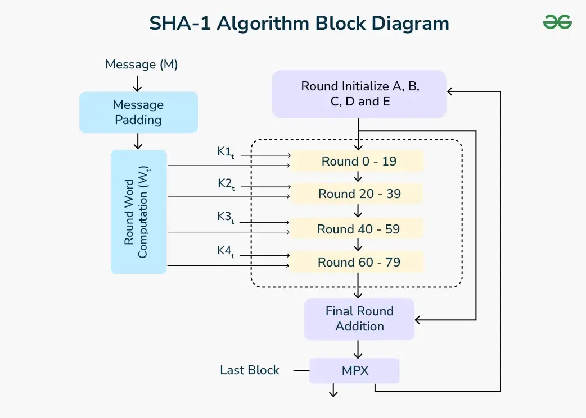

# Unit 3

## <mark> 1) Explain MACs based on Hash functions. </mark>

### Message Authentication Codes (MACs) Based on Hash Functions

A **Message Authentication Code (MAC)** is a cryptographic technique used to verify the integrity and authenticity of a message. A **MAC based on a hash function** is known as an **HMAC (Hash-based Message Authentication Code)**.

#### 1. What is HMAC?

HMAC is a **keyed-hash function** that combines a cryptographic hash function (e.g., SHA-256) with a **secret key** to generate a secure MAC value. It ensures that the message has not been altered and verifies the sender’s authenticity.

#### 2. HMAC Algorithm Steps:

1. **Key Padding:** The secret key is adjusted to match the block size of the hash function.
2. **Inner Hashing:**
   - The padded key is XORed with the inner pad (`ipad` = 0x36).
   - The result is concatenated with the message.
   - A hash function (e.g., SHA-256) is applied to get an intermediate hash.
3. **Outer Hashing:**
   - The original key is XORed with the outer pad (`opad` = 0x5C).
   - The result is concatenated with the intermediate hash.
   - The final hash function is applied to produce the **HMAC value**.

#### 3. HMAC Formula:

$$
HMAC(K, M) = H((K \oplus opad) || H((K \oplus ipad) || M))
$$

where:

- $ H $ = Hash function (e.g., SHA-256)
- $ K $ = Secret key
- $ M $ = Message
- $ ipad $ = 0x36 repeated to match block size
- $ opad $ = 0x5C repeated to match block size

#### 4. Advantages of HMAC:

- **Stronger Security:** Provides both integrity and authentication.
- **Resistance to Attacks:** More secure than regular hashing (prevents length extension attacks).
- **Efficient:** Works with existing hash functions like MD5, SHA-1, and SHA-256.

#### 5. Applications of HMAC:

- **Secure communication protocols** (e.g., TLS, SSL, IPsec).
- **API authentication** (e.g., AWS, OAuth).
- **Data integrity verification** in file transfers.

HMAC is widely used due to its security, efficiency, and adaptability in cryptographic systems.

## <mark> 2) Discuss SHA-1 with proper diagrams. </mark>

SHA-1 (Secure Hash Algorithm 1) is a cryptographic hash function that processes input data to produce a fixed 160-bit (20-byte) hash value, commonly represented as a 40-digit hexadecimal number. Developed by the U.S. National Security Agency (NSA), SHA-1 was widely used for securing data integrity and authentication. However, due to vulnerabilities identified over time, it is now considered insecure for many applications.

**How SHA-1 Works:**

1. **Message Padding:**

   - The original message is appended with a single '1' bit, followed by enough '0' bits to make its length 64 bits short of a multiple of 512 bits. This ensures the message length aligns with the algorithm's requirements.

2. **Appending Message Length:**

   - A 64-bit representation of the original message length is appended to the padded message. This step ensures that even if padding adds extra bits, the original length is still known.

3. **Message Processing in Blocks:**

   - The padded message is divided into 512-bit blocks. Each block undergoes processing to contribute to the final hash value.

4. **Block Expansion:**

   - Each 512-bit block is divided into sixteen 32-bit words. These words are then expanded to eighty 32-bit words through specific operations, preparing them for the main hashing process.

5. **Initialization of Hash Values:**

   - Five 32-bit hash values are initialized to specific constants. These values will be updated during the processing of each block.

6. **Main Hash Computation (80 Rounds):**

   - For each of the eighty 32-bit words derived from the block, the algorithm performs a series of logical operations (such as bitwise AND, OR, XOR) and modular additions. These operations mix the input data thoroughly, ensuring that even small changes in the input produce significantly different hash outputs.

7. **Updating Hash Values:**
   - After processing all blocks, the final values of the five hash variables are concatenated to produce the 160-bit hash value.

**Security Concerns:**

Despite its widespread use, SHA-1 has been found vulnerable to collision attacks, where two different inputs produce the same hash output. Notably, in 2017, researchers demonstrated a practical collision, leading to major organizations and browsers discontinuing support for SHA-1 in favor of more secure algorithms like SHA-256 and SHA-3.

In summary, while SHA-1 played a significant role in cryptographic applications, its vulnerabilities have led to a shift towards more secure hashing functions in modern security practices.

## <mark> 3) Explain HMAC with a diagram. </mark>

Hash-based Message Authentication Code (HMAC) is a mechanism that combines a cryptographic hash function with a secret key to ensure data integrity and authenticity. It verifies that a message has not been altered and confirms the sender's identity.

**HMAC Process:**

1. **Key Preparation:**

   - If the secret key (K) is longer than the hash function's block size (B), it's hashed to reduce its length.
   - If shorter, it's padded with zeros to match the block size.

2. **Inner Hashing:**

   - The key is XORed with the inner padding constant (ipad) and concatenated with the message.
   - This concatenated result is hashed, producing an intermediate hash.

3. **Outer Hashing:**
   - The key is XORed with the outer padding constant (opad) and concatenated with the intermediate hash.
   - This final concatenation is hashed, yielding the HMAC value.

**HMAC Formula:**

HMAC(K, M) = H[(K ⊕ opad) ∥ H[(K ⊕ ipad) ∥ M]]

Where:

- H is the hash function (e.g., SHA-256).
- K is the secret key.
- M is the message.
- ⊕ denotes the XOR operation.
- ∥ denotes concatenation.
- ipad and opad are constants defined for inner and outer padding.

**Applications of HMAC:**

- **Secure Communications:** Used in protocols like SSL/TLS to ensure data integrity.
- **Data Storage:** Verifies the integrity of stored data.
- **API Authentication:** Ensures that API requests are from legitimate sources.

HMAC is favored for its simplicity, efficiency, and resistance to certain cryptographic attacks, making it a cornerstone in modern security practices.

## <mark> 4) Explain Elgamal and Schnorr Digital Signature algorithm with examples. </mark>

### 1. ElGamal Digital Signature Algorithm

#### Overview

ElGamal digital signature is based on the difficulty of the discrete logarithm problem. It consists of three main steps:

1. **Key Generation**
2. **Signature Generation**
3. **Signature Verification**

#### Key Generation

1. Choose a large prime number $ p $ and a generator $ g $ of $ Z_p^\* $.
2. Choose a private key $ x $, where $ 1 \leq x \leq p-2 $.
3. Compute the public key:
   $$
   y = g^x \mod p
   $$
4. Public key: $ (p, g, y) $ and Private key: $ x $.

---

#### Signature Generation

For a given message $ m $:

1. Choose a random integer $ k $ such that $ \gcd(k, p-1) = 1 $.
2. Compute:
   $$
   r = g^k \mod p
   $$
3. Compute:
   $$
   s = k^{-1} (H(m) - x \cdot r) \mod (p-1)
   $$
   where $ H(m) $ is the hash of the message.
4. The signature is $ (r, s) $.

---

#### Signature Verification

To verify the signature $ (r, s) $:

1. Compute:
   $$
   v_1 = y^r \cdot r^s \mod p
   $$
2. Compute:
   $$
   v_2 = g^{H(m)} \mod p
   $$
3. The signature is valid if:
   $$
   v_1 = v_2
   $$

---

#### Example (Using Small Numbers)

###### Key Generation

- Let $ p = 23 $, $ g = 5 $.
- Choose private key $ x = 6 $.
- Compute public key:
  $$
  y = 5^6 \mod 23 = 8
  $$
- Public key: $ (23, 5, 8) $, Private key: $ x = 6 $.

###### Signature Generation

- Assume $ H(m) = 10 $.
- Choose $ k = 7 $, where $ \gcd(7, 22) = 1 $.
- Compute:
  $$
  r = 5^7 \mod 23 = 17
  $$
- Compute $ k^{-1} $ mod 22, which is 19.
- Compute:
  $$
  s = 19 \times (10 - 6 \times 17) \mod 22 = 12
  $$
- Signature: $ (r, s) = (17, 12) $.

###### Signature Verification

- Compute:
  $$
  v_1 = 8^{17} \cdot 17^{12} \mod 23
  $$
- Compute:
  $$
  v_2 = 5^{10} \mod 23
  $$
- If $ v_1 = v_2 $, the signature is valid.

---

### 2. Schnorr Digital Signature Algorithm

#### Overview

Schnorr’s digital signature scheme is based on the difficulty of the discrete logarithm problem. It is known for efficiency and security.

#### Key Generation

1. Choose a large prime $ p $ and another prime $ q $ such that $ q $ divides $ p-1 $.
2. Choose a generator $ g $ of order $ q $.
3. Choose a private key $ x $, where $ 0 \leq x < q $.
4. Compute public key:
   $$
   y = g^x \mod p
   $$

---

#### Signature Generation

For a message $ m $:

1. Choose a random integer $ k $ from $ [0, q-1] $.
2. Compute:
   $$
   r = g^k \mod p
   $$
3. Compute challenge:
   $$
   e = H(r \parallel m) \mod q
   $$
4. Compute:
   $$
   s = k - x \cdot e \mod q
   $$
5. The signature is $ (e, s) $.

---

#### Signature Verification

To verify the signature $ (e, s) $:

1. Compute:
   $$
   r' = g^s \cdot y^e \mod p
   $$
2. Compute challenge:
   $$
   e' = H(r' \parallel m) \mod q
   $$
3. The signature is valid if $ e' = e $.

---

#### Example (Using Small Numbers)

###### Key Generation

- Let $ p = 23 $, $ q = 11 $, and $ g = 2 $.
- Choose private key $ x = 3 $.
- Compute public key:
  $$
  y = 2^3 \mod 23 = 8
  $$

###### Signature Generation

- Choose $ k = 4 $.
- Compute:
  $$
  r = 2^4 \mod 23 = 16
  $$
- Compute challenge (assume hash function returns $ e = 5 $).
- Compute:
  $$
  s = 4 - 3 \times 5 \mod 11 = 0
  $$
- Signature: $ (e, s) = (5, 0) $.

###### Signature Verification

- Compute:
  $$
  r' = 2^0 \cdot 8^5 \mod 23 = 16
  $$
- Compute:
  $$
  e' = H(16 \parallel m) \mod 11
  $$
- Since $ e' = e $, the signature is valid.

---

#### Comparison of ElGamal and Schnorr Digital Signature Schemes

| Feature          | ElGamal Signature                 | Schnorr Signature                     |
| ---------------- | --------------------------------- | ------------------------------------- |
| Security         | Based on discrete logarithm       | Based on discrete logarithm           |
| Efficiency       | Slower due to two exponentiations | More efficient                        |
| Signature Length | Longer                            | Shorter                               |
| Randomness       | Uses $ k $                        | Uses $ k $                            |
| Verification     | Uses modular exponentiation       | Uses modular exponentiation with hash |

---

#### Conclusion

- **ElGamal Signature:** Uses discrete logarithms for security but has longer signatures.
- **Schnorr Signature:** More efficient, with shorter signatures and better performance.

Both are widely used in cryptographic applications like digital authentication and blockchain security. 🚀

## <mark> 5) What is Kerberos and its requirements? </mark>

### Kerberos and Its Requirements

#### What is Kerberos?

Kerberos is a network authentication protocol that uses secret-key cryptography to provide secure authentication between users and services over an insecure network. It was developed at **MIT** and is widely used in enterprise environments, including **Windows Active Directory** and **Unix-based systems**.

#### How Kerberos Works?

Kerberos uses a **trusted third party** called the **Key Distribution Center (KDC)**, which consists of:

1. **Authentication Server (AS):** Verifies user credentials.
2. **Ticket Granting Server (TGS):** Issues service tickets.
3. **Database (KDC Database):** Stores user and service credentials.

The authentication process involves exchanging **tickets** instead of passwords to minimize the risk of password exposure.

#### Requirements for Kerberos

For Kerberos to function effectively, the following conditions must be met:

1. **Trusted Third Party (KDC):**

   - The KDC must be a secure and trusted authority to issue authentication credentials.

2. **Time Synchronization:**

   - All devices in the network must have synchronized clocks because Kerberos tickets have time-based expiration to prevent replay attacks.

3. **Secret-Key Cryptography:**

   - Kerberos uses symmetric encryption (e.g., AES) to secure authentication messages.

4. **Credential Caching:**

   - Users receive **tickets** instead of entering passwords repeatedly for multiple services.

5. **Mutual Authentication:**

   - Both the client and the server verify each other to prevent **Man-in-the-Middle (MITM) attacks**.

6. **Single Sign-On (SSO):**

   - Users log in once and get authenticated for multiple services without entering credentials again.

7. **Secure Network Communication:**
   - Requires a protected environment to prevent unauthorized access to authentication data.

#### Conclusion

Kerberos enhances security in distributed networks by using **ticket-based authentication** and eliminating password transmission. Its applications include enterprise networks, cloud services, and online transactions. 🚀

## <mark> 6) What is PGP? How authentication and confidentiality is maintained in PGP? </mark>

### Pretty Good Privacy (PGP) and Its Security Mechanisms

#### What is PGP?

**Pretty Good Privacy (PGP)** is an encryption program used for **secure email communication, file encryption, and digital signatures**. It combines **symmetric and asymmetric cryptography** to provide both **confidentiality** and **authentication**. PGP was developed by **Phil Zimmermann** in 1991 and is widely used for securing emails and files.

---

### How Authentication and Confidentiality are Maintained in PGP

PGP ensures **authentication** and **confidentiality** using a hybrid encryption approach:

#### 1. Authentication (Digital Signature)

Authentication in PGP is achieved using **digital signatures**, which ensure that the message comes from a trusted sender and has not been altered.

🔹 **Steps for Authentication:**

1. The sender generates a **hash** (SHA-1, SHA-256) of the message.
2. The hash is **encrypted with the sender’s private key**, creating a **digital signature**.
3. The digital signature is attached to the message.
4. The recipient decrypts the signature using the **sender’s public key** and verifies the hash.

📌 **If the hashes match, the message is authentic and unaltered.**

---

#### 2. Confidentiality (Encryption)

PGP ensures confidentiality by **encrypting** the message so that only the intended recipient can read it.

🔹 **Steps for Confidentiality:**

1. The sender encrypts the message using a **symmetric key (AES, 3DES, etc.)**.
2. The symmetric key is then **encrypted using the recipient’s public key**.
3. The encrypted message and encrypted key are sent to the recipient.
4. The recipient decrypts the symmetric key using their **private key**.
5. The decrypted symmetric key is used to decrypt the actual message.

📌 **This hybrid encryption ensures both security and efficiency.**

---

### Summary of PGP Security

| Feature             | Method Used                                |
| ------------------- | ------------------------------------------ |
| **Authentication**  | Digital Signature (Hash + Private Key)     |
| **Confidentiality** | Hybrid Encryption (Symmetric + Asymmetric) |
| **Integrity**       | Hashing (SHA, MD5)                         |
| **Key Management**  | Public-Key Cryptography (RSA, DSA)         |

PGP provides **strong security** for emails, files, and documents by combining digital signatures and encryption. 🚀

## <mark> 7) Explain authentication services of X.509. </mark>

### Authentication Services of X.509

#### What is X.509?

X.509 is a widely used **public key infrastructure (PKI) standard** that defines the format of **digital certificates**. These certificates are used for **authentication and secure communication** in applications like SSL/TLS, email security, and VPNs.

---

### Authentication Services Provided by X.509

X.509 provides **three main authentication services** based on **public key certificates**:

#### 1. One-Way Authentication

✅ **Used in:** SSL/TLS (Websites), Secure Email, VPN  
🔹 **Process:**

- The sender transmits a digitally signed message to the receiver.
- The receiver verifies the sender’s digital certificate using a **Certificate Authority (CA)**.
- Ensures **message integrity and sender authentication**.
- No interaction is needed from the sender after sending the message.

📌 **Example:** A client verifies a website’s SSL certificate before sending sensitive data.

---

#### 2. Two-Way (Mutual) Authentication

✅ **Used in:** Secure Client-Server Communication, VPNs  
🔹 **Process:**

- Both parties (client & server) exchange digital certificates.
- Each party verifies the other's certificate using a trusted **CA**.
- Ensures **mutual authentication**, preventing identity spoofing.
- Secure communication is established after verification.

📌 **Example:** A VPN client and server authenticate each other before establishing a secure connection.

---

#### 3. Three-Way Authentication

✅ **Used in:** Secure Messaging, Encrypted Transactions  
🔹 **Process:**

- Both parties authenticate each other using **time-stamped challenges**.
- Prevents **replay attacks** by ensuring freshness of authentication.
- The sender encrypts a nonce (random number) using their private key.
- The receiver decrypts and verifies it, ensuring the sender’s identity.

📌 **Example:** Secure transactions where both users and the service provider verify each other's identity dynamically.

---

### Summary of X.509 Authentication Services

| **Authentication Type** | **Key Features**                                      | **Use Cases**                            |
| ----------------------- | ----------------------------------------------------- | ---------------------------------------- |
| **One-Way**             | Sender authentication, digital signature verification | SSL/TLS, Secure Email                    |
| **Two-Way**             | Mutual authentication, certificate exchange           | VPNs, Secure Client-Server Communication |
| **Three-Way**           | Prevents replay attacks, uses time-stamped challenges | Encrypted Transactions                   |

X.509 provides **strong authentication** and **data integrity** for secure communications over networks. 🚀

## <mark> 8) Explain MD5 algorithm with diagram. </mark>

The MD5 (Message-Digest Algorithm 5) is a widely used cryptographic hash function that produces a 128-bit (16-byte) hash value from input data of any length. Developed by Ronald Rivest in 1991, MD5 is commonly employed to verify data integrity, ensuring that data has not been altered or corrupted.

**Working of the MD5 Algorithm:**

1. **Padding the Message:**

   - The original message is padded so that its length is 64 bits less than a multiple of 512. This involves appending a single '1' bit followed by enough '0' bits to reach the required length.

2. **Appending the Length:**

   - After padding, a 64-bit representation of the original message length is appended to the result. This ensures that the total length of the message is now a multiple of 512 bits.

3. **Initializing MD Buffers:**

   - Four 32-bit buffers (A, B, C, and D) are initialized to specific constants:
     - A = 0x67452301
     - B = 0xEFCDAB89
     - C = 0x98BADCFE
     - D = 0x10325476

4. **Processing Message in 512-bit Blocks:**

   - The padded message is divided into 512-bit blocks, and each block undergoes a series of operations:
     - **Dividing into 16 Words:** Each 512-bit block is divided into 16 words of 32 bits each.
     - **Four Rounds of Operations:** Each block undergoes four rounds, each consisting of 16 operations, involving bitwise functions (F, G, H, I), modular addition, and left rotations.

5. **Updating Buffers:**
   - After processing all blocks, the buffers A, B, C, and D are concatenated to form the final 128-bit hash value.

**MD5 Algorithm Diagram:**

_Note: The above diagram illustrates the structure of the MD5 algorithm, including the padding process, initialization of buffers, and the four rounds of operations._

**Security Considerations:**

While MD5 was once widely used, it is now considered cryptographically broken and unsuitable for further use due to vulnerabilities that allow for hash collisions—situations where different inputs produce the same hash output. As a result, more secure hash functions like SHA-256 are recommended for cryptographic applications.

**Conclusion:**

The MD5 algorithm played a significant role in the history of cryptographic hash functions. However, due to its vulnerabilities, it has been largely replaced by more secure algorithms in modern applications.

## <mark> 9) Explain NIST Digital Signature algorithm. </mark>

### NIST Digital Signature Algorithm (DSA)

#### What is DSA?

The **Digital Signature Algorithm (DSA)** is a **public key digital signature scheme** developed by the **National Institute of Standards and Technology (NIST)** in 1991 as part of the **Digital Signature Standard (DSS)**. It is used for **authentication, data integrity, and non-repudiation** in cryptographic applications.

---

### Working of DSA

DSA is based on modular exponentiation and the **Discrete Logarithm Problem (DLP)**. It consists of three main steps:

### 1. Key Generation

To generate a key pair:

1. **Choose a prime number** $ p $ (large, at least 1024 bits).
2. **Select a prime divisor** $ q $ of $ p-1 $.
3. **Choose a generator** $ g $ such that $ g^q \equiv 1 \mod p $.
4. **Select a private key** $ x $, where $ 1 < x < q $.
5. **Compute the public key** $ y = g^x \mod p $.

📌 The public key **(p, q, g, y)** is shared, while the private key **(x)** is kept secret.

---

### 2. Signing the Message

To generate a digital signature:

1. Compute the **hash** of the message: $ H(M) $.
2. Select a **random number** $ k $ such that $ 0 < k < q $.
3. Compute **signature components**:
   - $ r = (g^k \mod p) \mod q $
   - $ s = (k^{-1} (H(M) + x \cdot r)) \mod q $
4. The digital signature is **(r, s)**.

📌 $ k $ must be a fresh random value for each signature to ensure security.

---

### 3. Verifying the Signature

To verify the received signature $ (r, s) $:

1. Compute the hash of the received message: $ H(M) $.
2. Compute verification parameters:
   - $ w = s^{-1} \mod q $
   - $ u_1 = (H(M) \cdot w) \mod q $
   - $ u_2 = (r \cdot w) \mod q $
   - $ v = ((g^{u_1} \cdot y^{u_2}) \mod p) \mod q $
3. If $ v = r $, the signature is **valid**.

📌 If verification fails, the signature is **invalid** and the message might be **tampered with**.

---

### Advantages of DSA

✅ **Secure** due to the difficulty of solving the Discrete Logarithm Problem.  
✅ **Efficient for signing** due to modular exponentiation.  
✅ **Standardized** by NIST, widely used in government and financial applications.

### Disadvantages of DSA

❌ Slower **verification** compared to RSA.  
❌ Requires **random value (k)** for each signature; reuse can break security.  
❌ Vulnerable to **attacks** if $ k $ is predictable or poorly chosen.

---

### Conclusion

DSA is a secure and standardized digital signature algorithm used in cryptographic applications. While it has some drawbacks compared to RSA and **Elliptic Curve DSA (ECDSA)**, it remains widely used in **secure communications, digital certificates, and financial transactions**. 🚀

## <mark> 10) Differentiate between SHA-1 and MD5. </mark>

### Difference Between SHA-1 and MD5

SHA-1 and MD5 are both cryptographic **hash functions** used for data integrity and authentication. However, SHA-1 is more secure than MD5 due to its longer hash length and stronger cryptographic properties.

| Feature                  | **SHA-1**                                             | **MD5**                                                        |
| ------------------------ | ----------------------------------------------------- | -------------------------------------------------------------- |
| **Full Name**            | Secure Hash Algorithm 1                               | Message Digest Algorithm 5                                     |
| **Developed By**         | NIST (National Institute of Standards and Technology) | Ronald Rivest (RSA Security)                                   |
| **Hash Length**          | **160 bits (20 bytes)**                               | **128 bits (16 bytes)**                                        |
| **Output Digest**        | 40 hexadecimal characters                             | 32 hexadecimal characters                                      |
| **Number of Rounds**     | 80 rounds                                             | 64 rounds                                                      |
| **Security Strength**    | More secure than MD5 but still vulnerable to attacks  | Weaker, vulnerable to collisions                               |
| **Collision Resistance** | Weak (Broken by attacks)                              | Weaker than SHA-1                                              |
| **Speed**                | Slightly slower than MD5                              | Faster than SHA-1                                              |
| **Usage**                | Digital signatures, certificates, file integrity      | Checksums, integrity verification                              |
| **Vulnerabilities**      | Collision attacks found (SHA-1 is now deprecated)     | High collision risk, not recommended for security-critical use |

### Conclusion

- **MD5 is faster** but highly insecure due to its vulnerability to collisions.
- **SHA-1 is more secure** but still deprecated in favor of **SHA-256 or SHA-3** for modern applications. 🚀
