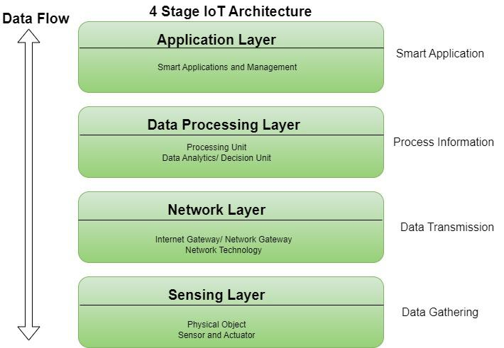
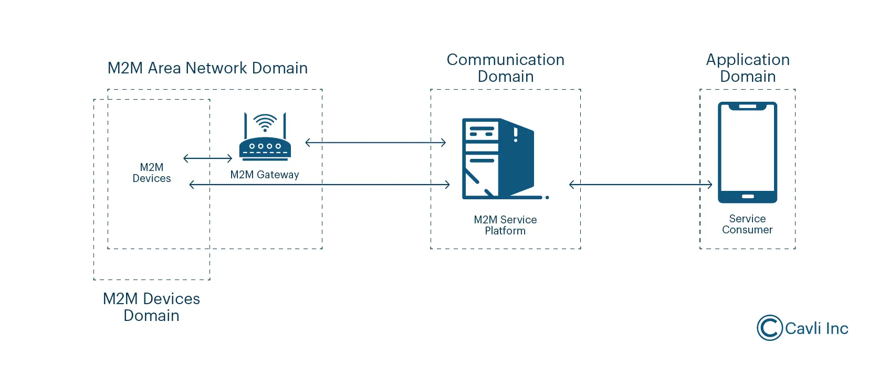
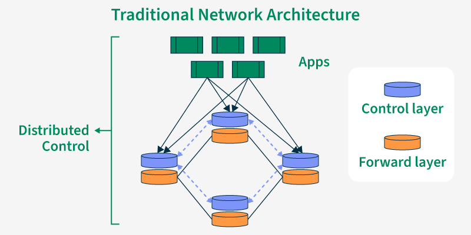
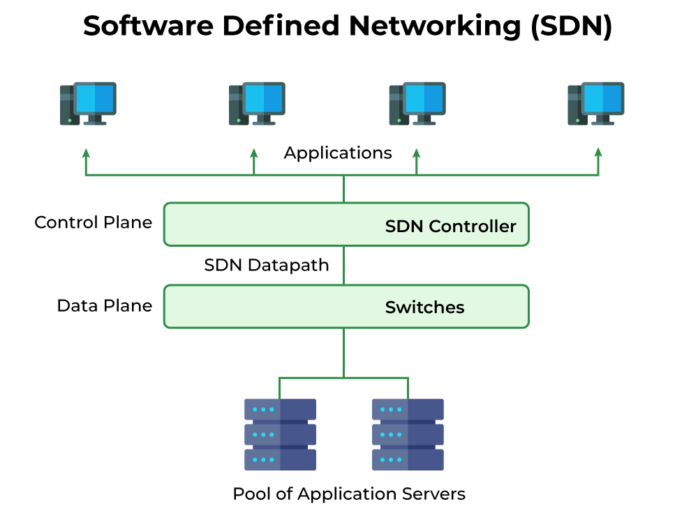

# Unit 1

## <mark> 1) Define the Internet of Things. </mark>

The Internet of Things (IoT) is a system of interrelated computing devices, mechanical and digital machines, objects, animals or people that are provided with unique identifiers (UIDs) and the ability to transfer data over a network without requiring human-to-human or human-to-computer interaction. Essentially, it's a network of "things" that can communicate with each other and exchange data. These things can range from everyday household appliances to sophisticated industrial sensors and medical devices.

## <mark> 2) What are the characteristics of IoT? </mark>

The Internet of Things (IoT) is characterized by several key features:

- **Interconnectivity:** This is the foundational characteristic. IoT devices communicate with each other and with central systems, often wirelessly, to exchange data and perform actions. This connectivity can be through various protocols like Wi-Fi, Bluetooth, Zigbee, LoRaWAN, etc.

- **Data Generation & Collection:** IoT devices are prolific data generators. Sensors embedded in these devices constantly collect information about their environment (temperature, pressure, location, etc.) and transmit it to other systems for processing and analysis.

- **Remote Monitoring and Control:** The ability to monitor and control devices remotely is a key benefit. This allows for efficient management of assets, early problem detection, and proactive maintenance.

- **Scalability:** IoT networks can easily grow to accommodate a vast number of devices. This scalability is crucial for applications that involve many connected objects, such as smart cities or industrial automation.

- **Heterogeneity:** IoT networks are composed of a diverse range of devices from various manufacturers, operating systems, and communication protocols. This heterogeneity presents challenges in terms of interoperability and security.

- **Intelligence & Automation:** Many IoT systems incorporate intelligence and automation features, allowing devices to make decisions and perform actions based on the data they collect. This can lead to increased efficiency and optimized operations.

- **Real-time Capabilities:** Many IoT applications require real-time data processing and responsiveness. This is critical for applications such as industrial control systems and traffic management.

- **Security Concerns:** The interconnected nature of IoT devices creates significant security challenges. Vulnerabilities in individual devices can compromise the entire network, requiring robust security measures.

- **Context Awareness:** Many advanced IoT systems leverage context awareness, using data from various sources (time, location, user activity) to provide more personalized and relevant services.

These characteristics work together to define the capabilities and challenges associated with the Internet of Things. The specific importance of each characteristic depends on the particular application or system being considered.

## <mark> 3) List the applications of IoT in various fields. Explain any one application with a proper example. </mark>

The Internet of Things (IoT) has a vast array of applications across numerous sectors. Here's a list categorized by field:

**1. Healthcare:** Remote patient monitoring, smart wearables, connected medical devices, smart hospitals, telehealth.

**2. Manufacturing:** Predictive maintenance, supply chain management, quality control, automation, smart factories.

**3. Agriculture:** Precision farming, smart irrigation, livestock monitoring, crop management, environmental monitoring.

**4. Transportation:** Smart traffic management, autonomous vehicles, fleet management, real-time tracking, driver safety.

**5. Smart Cities:** Smart lighting, waste management, parking optimization, environmental monitoring, public safety.

**6. Retail:** Inventory management, smart shelves, customer analytics, personalized marketing, loss prevention.

**7. Energy:** Smart grids, energy consumption monitoring, renewable energy integration, demand-side management.

**8. Home Automation:** Smart appliances, security systems, lighting control, entertainment systems, energy management.

**Explanation of one application: Predictive Maintenance in Manufacturing**

Predictive maintenance uses IoT sensors and data analytics to anticipate equipment failures before they occur. This contrasts with reactive maintenance (fixing things after they break) and preventive maintenance (scheduled maintenance at fixed intervals, often unnecessarily frequent).

**Example:** Imagine a large manufacturing plant with numerous machines on its production line. Each machine is fitted with IoT sensors that monitor various parameters such as vibration levels, temperature, pressure, and motor current. This data is continuously streamed to a central platform where machine learning algorithms analyze it.

If the algorithms detect anomalies – for example, a gradual increase in vibration beyond a pre-defined threshold – it can predict a potential bearing failure in a specific machine within the next few days. This prediction allows maintenance crews to schedule repairs proactively, preventing costly downtime and production losses. They can order the necessary parts, plan the repair, and carry it out before the failure occurs. This minimizes disruptions to the manufacturing process, reduces repair costs (because fixing a minor problem is cheaper than a major breakdown), and extends the lifespan of the equipment.

This is a significant improvement over reactive maintenance where a machine might unexpectedly fail, halting the entire production line until it's repaired, resulting in significant financial losses due to lost production and potentially damage to other equipment. The predictive approach is more efficient, cost-effective, and safer.

## <mark> 4) Give the difference between IoT and M2M. </mark>

While the terms IoT (Internet of Things) and M2M (Machine-to-Machine) are often used interchangeably, there's a subtle but important distinction:

- **M2M** focuses primarily on the _communication_ between machines. It's about devices automatically exchanging data without human intervention. Think industrial sensors reporting data to a central system for analysis. The primary goal is automation and efficiency within a specific system or network. Connectivity is often dedicated and less reliant on the public internet.

- **IoT** is a broader concept encompassing M2M but adding a significant layer of _human interaction_ and _data accessibility_. While it includes machine-to-machine communication, it also emphasizes the ability to collect and analyze data from various sources (including machines) to gain insights, improve efficiency, and create new services and business models. IoT devices are often connected to the public internet, making data accessible through various interfaces (apps, dashboards, etc.). The focus is on leveraging data for a much wider range of applications than just automation.

In essence: M2M is a _subset_ of IoT. All M2M communication is IoT, but not all IoT involves just machine-to-machine communication. IoT adds the layer of human interaction and broader data utilization.

## <mark> 5) Draw and Explain IoT Stack. </mark>

The Internet of Things (IoT) stack is a layered architecture representing the different components and functionalities that work together to enable IoT devices and systems. There isn't one universally agreed-upon model, but a common representation organizes the stack into four or five layers:

**1. Perception Layer (Devices):**

- **What it is:** This is the bottom-most layer, encompassing the physical devices that collect data from the real world. These are the "things" in the IoT.
- **Components:** Sensors (temperature, pressure, light, motion, etc.), actuators (controlling devices like motors, lights, valves), microcontrollers (e.g., Arduino, ESP32), and other hardware components that perform sensing, processing, and actuation.
- **Example:** A smart thermostat's temperature sensor, a fitness tracker's accelerometer, a smart lock's fingerprint scanner.
- **Key Characteristics:** Resource-constrained (limited processing power, memory, battery life), often requires low-power communication protocols.

**2. Network Layer (Connectivity):**

- **What it is:** This layer handles the communication between devices and the cloud or other systems. It focuses on getting data from the perception layer to the higher layers.
- **Components:** Various communication protocols including Wi-Fi, Bluetooth, Zigbee, LoRaWAN, cellular (3G/4G/5G), Ethernet, etc. Gateways often reside here, aggregating data from multiple devices and translating between different protocols.
- **Example:** A Wi-Fi router connecting smart home devices, a cellular modem enabling communication in remote locations, a Zigbee network for low-power sensors in a building.
- **Key Characteristics:** Reliability, security, scalability, and energy efficiency are crucial considerations.

**3. Data Processing Layer (Middleware):**

- **What it is:** This layer focuses on managing, processing, and aggregating data received from the network layer. It prepares the data for analysis and applications.
- **Components:** Message queues (e.g., Kafka, RabbitMQ), data streams (e.g., Spark, Flink), databases (e.g., MongoDB, Cassandra), cloud platforms (AWS IoT, Azure IoT Hub, Google Cloud IoT), and data integration tools.
- **Example:** Filtering sensor data to remove noise, aggregating data from multiple sensors, storing data in a cloud database, applying data transformation rules.
- **Key Characteristics:** Scalability, reliability, real-time processing capabilities.

**4. Application Layer (Applications and Services):**

- **What it is:** This layer provides the user interface and the specific applications built on top of the processed data.
- **Components:** Mobile apps, web portals, dashboards, data analytics tools, machine learning models, business intelligence systems.
- **Example:** A mobile app displaying temperature readings from a smart home, a web dashboard visualizing sensor data, a predictive maintenance system using machine learning on sensor data.
- **Key Characteristics:** User experience, usability, and functionality are paramount.

**5. Security Layer (Optional, but increasingly crucial):**

- **What it is:** This layer, often integrated across the entire stack, focuses on ensuring the security and privacy of data and devices throughout the IoT ecosystem.
- **Components:** Authentication and authorization mechanisms, encryption techniques, firewalls, intrusion detection systems, data anonymization methods.
- **Example:** Secure boot processes for devices, encryption of data transmitted over the network, access control mechanisms for applications.
- **Key Characteristics:** Confidentiality, integrity, and availability of data and systems.

**(Diagram):**

It's important to note that the exact implementation and naming of these layers may vary depending on the specific IoT system and architecture. However, the fundamental concepts remain consistent across different approaches.

## <mark> 6) Write a short note on Physical Design of IoT Application. </mark>

### Physical Design of IoT Applications: A Short Note

The physical design of an IoT application encompasses the tangible components and their arrangement necessary for the system's functionality. It's about translating the conceptual design into a working reality. Key aspects include:

- **Hardware Selection:** This involves choosing appropriate sensors, actuators, microcontrollers (e.g., ESP32, Arduino), communication modules (e.g., Wi-Fi, Bluetooth, LoRaWAN), power sources (batteries, solar), and enclosures. Considerations include power consumption, processing power, memory, environmental robustness, and cost.

- **Connectivity and Network Infrastructure:** Defining how devices communicate – point-to-point, mesh networks, star topology – and selecting the appropriate communication protocols (MQTT, CoAP, HTTP) is crucial. This also includes considerations for network coverage, security, and bandwidth requirements.

- **Physical Placement and Environment:** The physical location of devices greatly impacts performance and reliability. Factors such as range, interference, environmental conditions (temperature, humidity, dust), and security (from theft or vandalism) must be carefully considered.

- **Power Management:** Especially crucial for battery-powered devices, efficient power management strategies are needed. This might involve low-power components, sleep modes, and energy harvesting techniques.

- **Mechanical Design and Packaging:** This includes the physical casing, mounting mechanisms, and protection against environmental elements. The design needs to be robust and user-friendly while accommodating all chosen hardware components.

Effective physical design directly impacts the reliability, scalability, and cost-effectiveness of the entire IoT application. A well-planned physical design minimizes operational issues and ensures the long-term success of the deployment.

## <mark> 7) Write a short note on Logical Design of IoT Application. </mark>

### Logical Design of IoT Applications

The logical design of an IoT application focuses on defining the system's functionality and data flow, independent of physical implementation details. It bridges the gap between requirements and the physical design. Key aspects include:

- **Data Model:** Defining the structure and relationships of data generated and processed by the IoT system. This includes identifying data sources (sensors, actuators), data types, and how data is organized (e.g., using relational databases, NoSQL databases, or data lakes). Consider data normalization, security, and scalability.

- **Functional Decomposition:** Breaking down the application's overall functionality into smaller, manageable modules. Each module should have a specific purpose and well-defined inputs and outputs. This modularity improves design clarity, maintainability, and testability.

- **Data Flow:** Mapping the movement of data throughout the system. This includes showing how data flows from sensors, through processing stages (e.g., data aggregation, filtering, analysis), to storage, and finally to applications or users. Diagrams like data flow diagrams (DFDs) are useful here.

- **Component Interaction:** Defining how different components of the system interact with each other. This involves specifying communication protocols (e.g., MQTT, CoAP, HTTP), interfaces (APIs), and data exchange formats (e.g., JSON, XML).

- **Event Handling:** Designing how the system reacts to events generated by sensors or other components. This involves defining event triggers, actions, and the sequence of events.

- **Security Considerations:** Integrating security mechanisms from the outset. This includes authentication, authorization, data encryption, and secure communication protocols to protect data and prevent unauthorized access.

A well-defined logical design is crucial for building a robust, scalable, and maintainable IoT application. It serves as the blueprint for the physical design and implementation phases, minimizing errors and ensuring the system meets its functional requirements. Tools like UML diagrams are commonly used to visually represent the logical design.

## <mark> 8) Which are the functional blocks in IoT? </mark>

The functional blocks in an IoT system can be categorized in several ways, but a common and comprehensive breakdown includes these key components:

- **Sensing:** This involves collecting data from the physical world using various sensors. Examples include temperature sensors, accelerometers, GPS modules, cameras, microphones, and more. This block focuses on data acquisition.

- **Data Processing/Preprocessing:** This stage involves cleaning, transforming, and preparing the raw sensor data for further use. This might include filtering noise, aggregating data, applying algorithms for feature extraction, and converting data formats. This often happens on the device itself (edge processing) or in the cloud.

- **Communication:** This block handles the transmission of data between devices and the cloud or other devices. It uses various communication protocols like Wi-Fi, Bluetooth, LoRaWAN, cellular (3G/4G/5G), Zigbee, Z-Wave, etc., depending on the requirements of range, bandwidth, and power consumption.

- **Data Storage:** This component deals with persistently storing the collected and processed data. Options range from on-device storage (flash memory, SD cards) to cloud storage solutions (AWS, Azure, GCP) and edge servers.

- **Data Analytics:** This is where the stored data is analyzed to extract meaningful insights. This can involve applying machine learning algorithms, statistical analysis, and data visualization techniques to identify trends, patterns, and anomalies. This can be performed in the cloud or on edge devices depending on the application's requirements.

- **Application/User Interface:** This is the final layer that allows users to interact with the IoT system. It provides a means to visualize data, control devices, receive alerts, and interact with the system's functionality. This can be a mobile app, web portal, or embedded system interface.

- **Security:** This is a critical component that should be integrated throughout the entire system. It encompasses measures to protect data integrity, confidentiality, and availability. This includes authentication, authorization, encryption, and secure communication protocols.

These blocks are interconnected and interdependent. The exact implementation and complexity of each block will vary depending on the specific IoT application. For instance, a simple IoT device might only include sensing, communication, and a minimal application layer, while a more complex system might incorporate all of the above.

## <mark> 9) List and Explain Communication Models in IoT. </mark>

Several communication models are used in the Internet of Things (IoT), each with its strengths and weaknesses depending on the application's requirements. Here are some key models:

**1. Publish-Subscribe (Pub/Sub):**

- **Explanation:** This model is a many-to-many communication paradigm where publishers (IoT devices) send messages (data) to a topic (a named channel or subject), and subscribers (applications or other devices) subscribe to specific topics to receive relevant messages. The publishers don't know who the subscribers are, and the subscribers don't know who the publishers are. This decoupling is a significant advantage.
- **Advantages:** Scalability, flexibility, loose coupling (changes on one side don't directly affect the other), efficient for one-to-many or many-to-many communication.
- **Disadvantages:** Message ordering isn't guaranteed (unless explicitly managed), potential for message loss if subscribers are offline, requires a message broker (e.g., MQTT broker) to manage subscriptions and message routing.
- **Example:** A smart thermostat (publisher) publishes temperature data to a "temperature" topic. Multiple applications (subscribers) – a mobile app, a home automation system, an energy management system – subscribe to this topic to receive updates.

**2. Request-Response (Client-Server):**

- **Explanation:** A client (IoT device or application) sends a request to a server (e.g., a cloud platform or a gateway), and the server processes the request and sends a response back to the client. This is a one-to-one communication model.
- **Advantages:** Simple to understand and implement, reliable for transactional operations, guarantees a response (unless the server is down).
- **Disadvantages:** Less scalable for many devices, can be inefficient for high-volume data streaming, client needs to know the server's address.
- **Example:** A smart lock (client) sends a request to a cloud server to unlock, and the server, after authentication, sends a response to unlock the lock.

**3. Message Queuing (MQ):**

- **Explanation:** Similar to Pub/Sub, but emphasizes reliable message delivery. Messages are placed in a queue and processed sequentially or based on other criteria. This ensures that even if a subscriber is temporarily unavailable, the message will be delivered later.
- **Advantages:** Reliable message delivery, asynchronous communication, decoupling of sender and receiver.
- **Disadvantages:** Can introduce latency, requires a message queue server, might be overkill for simple applications.
- **Example:** A sensor network sends data to a message queue. A data processing application then retrieves and processes the data from the queue, even if the sensor network experiences temporary outages.

**4. Peer-to-Peer (P2P):**

- **Explanation:** Devices communicate directly with each other without relying on a central server. This is useful in situations where a central server is unavailable or undesirable.
- **Advantages:** Decentralized, robust to server failures, efficient for localized communication.
- **Disadvantages:** More complex to manage, security can be challenging, scalability can be limited depending on the implementation.
- **Example:** A network of smart streetlights communicating with each other to optimize lighting based on local conditions.

**5. Hybrid Models:**

- **Explanation:** IoT systems often use a combination of the above models. For instance, a system might use Pub/Sub for data streaming and Request-Response for configuration updates.
- **Advantages:** Allows for optimized communication depending on the specific requirements of different parts of the system.
- **Disadvantages:** Increased complexity in design and implementation.

The choice of communication model depends on factors like:

- **Scalability:** How many devices and how much data are involved?
- **Reliability:** How critical is it to ensure message delivery?
- **Latency:** How quickly do messages need to be delivered?
- **Security:** What level of security is required?
- **Cost:** What are the infrastructure costs associated with each model?

Often, a hybrid approach, combining elements of several models, is the most effective solution for real-world IoT deployments.

## <mark> 10) List and Explain Connectivity Models in IoT. </mark>

IoT connectivity models describe how IoT devices communicate with each other and with the cloud or other networks. The choice of model depends on several factors including range, bandwidth requirements, power consumption, cost, and security needs. Here are some key connectivity models:

**1. Direct Connection:**

- **Explanation:** Devices directly connect to the internet without any intermediary. This usually involves embedded cellular (3G/4G/5G) or Wi-Fi modules.
- **Advantages:** Simple architecture, low latency.
- **Disadvantages:** High power consumption (especially for cellular), requires individual SIM cards or Wi-Fi configuration for each device, potentially increased security vulnerabilities if not properly secured. Suitable only for devices with sufficient power and processing capabilities.

**2. Star Topology:**

- **Explanation:** All devices connect to a central hub (e.g., a gateway or router) which then connects to the internet. The hub manages communication between devices and the cloud. This is the most common model.
- **Advantages:** Simplified network management, centralized security, better power management for devices, scalability.
- **Disadvantages:** Single point of failure (if the hub fails, the entire network is affected), potential bottleneck at the hub, increased latency compared to direct connection.

**3. Mesh Topology:**

- **Explanation:** Devices communicate with each other and relay data to the internet through multiple paths. One or more devices can act as gateways.
- **Advantages:** High reliability (failure of one device doesn't necessarily affect the whole network), increased range, self-healing capabilities, efficient use of bandwidth.
- **Disadvantages:** Complex network management, requires more sophisticated routing protocols, higher device complexity. Best for scenarios requiring extensive range and resilience like smart city deployments or industrial automation.

**4. Hybrid Topology:**

- **Explanation:** A combination of the above topologies. For example, devices might use a mesh network locally to communicate with each other, and then use a star topology to connect to the cloud through a gateway.
- **Advantages:** Combines the advantages of different topologies, enabling a tailored approach to specific use cases.
- **Disadvantages:** Increased complexity in design and management.

**5. Cloud-based Connectivity:**

- **Explanation:** Data from IoT devices is sent to the cloud for processing and storage. This is the prevalent model for many IoT applications. Cloud providers offer various services for managing data, analytics, and application development.
- **Advantages:** Scalability, flexible data storage and processing, access to advanced analytics tools.
- **Disadvantages:** Security concerns (data breaches), reliance on cloud service providers, latency due to data transfer.

**6. Edge Computing:**

- **Explanation:** Data processing is done closer to the source (the edge of the network) rather than solely in the cloud. This reduces latency and bandwidth requirements. Edge devices (e.g., gateways, edge servers) perform preliminary processing before sending data to the cloud.
- **Advantages:** Reduced latency, lower bandwidth consumption, improved data privacy, greater real-time responsiveness.
- **Disadvantages:** Increased complexity, requires more powerful edge devices, security challenges at the edge.

These models are not mutually exclusive. Many IoT systems employ a hybrid approach, combining elements of different models to optimize performance and meet specific requirements. The best model depends heavily on the specific application and its constraints.

## <mark> 11) What is a node in IoT? </mark>

In the Internet of Things (IoT), a node is any device that can connect to a network and either send or receive data. This could be anything from a simple sensor (like a temperature sensor) to a complex device (like a smart refrigerator or a self-driving car). Essentially, it's a point in the network that participates in the communication and data exchange. Each node has a unique identifier and can interact with other nodes or a central server.

## <mark> 12) Define Gateway. </mark>

A gateway is a network point that acts as an entrance to another network. It translates data between networks using different protocols or architectures. Think of it as a translator and a router combined. It doesn't just forward packets; it often converts them into a format suitable for the destination network.

Here's a breakdown of key aspects:

- **Protocol Conversion:** Gateways often handle the conversion of data packets from one protocol to another (e.g., converting between TCP/IP and IPX).
- **Network Segmentation:** They can be used to isolate networks, providing security and managing traffic flow between different segments.
- **Different Network Technologies:** Gateways are especially important when connecting networks using different technologies (e.g., connecting a LAN to the Internet).
- **More Complex than Routers:** While routers forward packets based on IP addresses, gateways perform a more complex function involving protocol translation and other transformations.

Examples include:

- **A router that connects a home network to the Internet:** This is a simple example where the router acts as a gateway, converting data packets between the private IP address space of the home network and the public IP address space of the Internet.
- **A gateway between a corporate LAN and a WAN:** This gateway might handle various security features, network address translation (NAT), and protocol conversions.
- **An application gateway:** This specialized gateway handles the security and routing of application-specific traffic.

In short, a gateway is a crucial component for connecting disparate networks and facilitating communication between them.

## <mark> 13) What is WSN? </mark>

WSN stands for **Wireless Sensor Network**. It's a group of spatially distributed autonomous sensors to monitor physical or environmental conditions, such as temperature, sound, pressure, etc. and to cooperatively pass their data through the network to a main location.

## <mark> 14) List and Explain Component of IoT Application. </mark>

An IoT application consists of several interconnected components working together to collect, process, and act upon data from physical devices. Here's a breakdown of the key components:

**1. Devices/Things:**

- **Explanation:** These are the physical objects embedded with sensors, actuators, and connectivity capabilities. They form the foundation of the IoT system, collecting data from the real world. Examples include smart thermostats, wearable fitness trackers, industrial sensors monitoring equipment performance, and smart home appliances.
- **Key Aspects:** Processing power (varies greatly), memory, sensors (temperature, pressure, light, motion, etc.), actuators (motors, switches, displays), and communication interfaces (Wi-Fi, Bluetooth, cellular, etc.).

**2. Connectivity:**

- **Explanation:** This component enables communication between devices and other parts of the IoT system. It can be wired (e.g., Ethernet) or wireless (e.g., Wi-Fi, Bluetooth, Zigbee, LoRaWAN, cellular networks). The choice of connectivity depends on factors such as range, power consumption, bandwidth requirements, and security needs.
- **Key Aspects:** Network protocols, bandwidth, latency, security measures (encryption, authentication). Consideration of network topology (mesh, star, bus).

**3. Data Processing & Storage:**

- **Explanation:** Raw data collected from devices needs processing, analysis, and storage. This might involve local processing on the device itself, edge gateways (for pre-processing near the devices), or cloud servers (for more comprehensive analysis and storage).
- **Key Aspects:** Cloud platforms (AWS IoT, Azure IoT Hub, Google Cloud IoT), edge computing gateways, databases (SQL, NoSQL), data analytics tools, data visualization dashboards.

**4. Application Layer:**

- **Explanation:** This is the software component that interacts with users and other systems. It provides the user interface (UI), facilitates data visualization, and enables interaction with the IoT system (e.g., setting up rules, receiving alerts, controlling devices). This can be a mobile app, web portal, or even an embedded system.
- **Key Aspects:** User interfaces (web, mobile, embedded), APIs (Application Programming Interfaces) for interaction with other systems, business logic, security mechanisms.

**5. Data Analytics & Visualization:**

- **Explanation:** This component processes the collected data to extract meaningful insights. This can involve various techniques like machine learning, statistical analysis, and data mining to identify trends, anomalies, and patterns. Results are then presented in a user-friendly way.
- **Key Aspects:** Machine learning algorithms, data visualization tools, reporting and dashboards, predictive analytics.

**6. Security:**

- **Explanation:** Security is crucial in IoT systems due to the large number of connected devices and the potential for vulnerabilities. This component involves measures to protect data and devices from unauthorized access, attacks, and breaches.
- **Key Aspects:** Authentication and authorization, encryption, access control, intrusion detection systems, regular software updates and patching.

**Interconnections:**

It's crucial to understand that these components are not isolated but are deeply interconnected. Data flows between devices, connectivity networks, data processing units, and the application layer. The application layer interacts with the user and may trigger actions on devices through the connectivity and processing layers. Security considerations permeate all aspects of the system.

## <mark> 15) List and Explain Levels of IoT Applications. </mark>

The Internet of Things (IoT) applications can be categorized into different levels based on their complexity, scope, and the interactions between devices. There isn't a universally agreed-upon single hierarchy, but here's a common way to structure the levels, focusing on the increasing complexity of interaction and data processing:

**1. Level 1: Device Level:**

- **Explanation:** This is the foundation of IoT. It involves individual smart devices equipped with sensors, actuators, and communication capabilities. These devices collect data from their environment (e.g., temperature, humidity, pressure) and may perform basic processing locally before transmitting data.
- **Examples:** A smart thermostat sensing room temperature, a fitness tracker monitoring heart rate, a smart light bulb responding to ambient light levels. These devices operate independently or with minimal interaction with other devices.
- **Characteristics:** Simple data collection, limited processing, typically uses simple communication protocols (e.g., Zigbee, Z-Wave).

**2. Level 2: Gateway/Edge Level:**

- **Explanation:** This level comprises gateways or edge devices that aggregate and pre-process data from multiple Level 1 devices. They act as a bridge between the device level and the cloud, performing tasks like data filtering, aggregation, and initial analysis. This reduces the amount of data that needs to be transmitted to the cloud, saving bandwidth and improving efficiency. Some basic intelligence and decision-making can happen here.
- **Examples:** A gateway collecting data from multiple smart sensors in a factory, an edge server processing video feeds from security cameras before sending summaries to the cloud.
- **Characteristics:** Data aggregation, local processing, improved bandwidth efficiency, can perform basic analytics and decision making.

**3. Level 3: Cloud Level:**

- **Explanation:** This level involves cloud-based platforms and services for data storage, processing, and analysis of data from multiple gateways. Advanced analytics, machine learning, and AI algorithms are often employed to extract insights from the vast amount of data collected. This is where larger scale applications and complex decision-making systems are built.
- **Examples:** Cloud-based platforms providing dashboards visualizing data from multiple smart homes, AI algorithms predicting equipment failures in industrial settings based on sensor data.
- **Characteristics:** Massive data storage and processing, advanced analytics, machine learning capabilities, sophisticated applications and user interfaces.

**4. Level 4: Application Level:**

- **Explanation:** This is the highest level where end-users interact with the IoT system. This involves applications and user interfaces that provide insights and allow users to control and manage devices and systems. These applications often leverage the data analysis and processing performed at the cloud level.
- **Examples:** A mobile app allowing users to control their smart home devices, a web portal providing real-time monitoring of industrial equipment, a predictive maintenance system alerting users about potential equipment failures.
- **Characteristics:** User interfaces, customized applications, data visualization, actionable insights, user interaction and control.

It's important to note that these levels are not strictly hierarchical. Some applications might skip certain levels or combine functionalities. For instance, a simple IoT application might only involve levels 1 and 4, while complex industrial IoT applications typically span all four levels. The choice of levels depends on the complexity and requirements of the specific application.

## <mark> 16) List and Explain Security Challenges in IoT. </mark>

The Internet of Things (IoT) presents a vast attack surface due to its interconnected nature and the often-limited security features of its constituent devices. Security challenges can be broadly categorized as follows:

**1. Device-Level Vulnerabilities:**

- **Insecure Device Design and Manufacturing:** Many IoT devices are designed with minimal security considerations, lacking robust authentication, encryption, and secure boot processes. This makes them easy targets for attackers. Poorly implemented firmware can also contain vulnerabilities.
- **Lack of Software Updates:** Many IoT devices lack mechanisms for receiving and applying software updates, leaving them vulnerable to known exploits even after vulnerabilities are discovered. Even if updates are available, users often don't apply them.
- **Weak or Default Passwords:** Many devices ship with default or easily guessable passwords, providing attackers with immediate access.
- **Insufficient Memory and Processing Power:** Resource-constrained devices struggle to run complex security software, making them vulnerable to attacks that exploit their limited capabilities.
- **Unencrypted Communication:** Many devices transmit data without encryption, making it easily intercepted and manipulated by attackers.

**2. Network-Level Vulnerabilities:**

- **Lack of Secure Network Segmentation:** IoT devices often operate on the same network as other sensitive systems, enabling attackers to pivot from a compromised IoT device to access other parts of the network.
- **Vulnerable Network Protocols:** Some IoT devices rely on insecure network protocols, making them susceptible to various attacks like man-in-the-middle attacks.
- **Denial-of-Service (DoS) Attacks:** The large number of interconnected devices in IoT networks makes them vulnerable to DDoS attacks, which can overwhelm the network and render services unavailable.

**3. Data Security and Privacy Issues:**

- **Data Breaches:** Compromised IoT devices can lead to the theft of sensitive personal data, financial information, and intellectual property.
- **Data Integrity:** Attackers can manipulate data transmitted by IoT devices, leading to inaccurate readings, faulty control commands, and potentially dangerous consequences.
- **Privacy Concerns:** IoT devices often collect significant amounts of personal data, raising concerns about user privacy and surveillance.
- **Lack of Data Anonymization and Pseudonymization:** Many IoT devices transmit data without adequate anonymization or pseudonymization techniques, making it easy to identify individuals.

**4. Management and Control Challenges:**

- **Lack of Centralized Management:** Managing security for a large number of diverse IoT devices can be challenging, especially when devices are spread across different locations and networks.
- **Difficulties in Identifying and Responding to Threats:** Detecting and responding to security incidents in IoT environments can be difficult due to the lack of visibility and centralized monitoring.
- **Lack of Standardization:** The lack of standardization in IoT devices and protocols makes it difficult to develop and implement consistent security solutions.

**5. Human Factors:**

- **User Ignorance and Lack of Awareness:** Many users are unaware of the security risks associated with IoT devices and fail to take basic security precautions.
- **Poor Password Management:** Users often reuse passwords across multiple devices and services, making them vulnerable to credential stuffing attacks.

Addressing these challenges requires a multi-faceted approach involving device manufacturers, network operators, policymakers, and users. This includes designing more secure devices, implementing robust security protocols, developing effective security management tools, and raising user awareness about IoT security risks.

## <mark> 17) List and Explain Design and Development Challenges in IoT. </mark>

Designing and developing IoT systems presents a unique set of challenges across various domains. Here's a breakdown of key areas:

**1. Heterogeneity and Interoperability:**

- **Challenge:** IoT devices encompass a vast range of hardware platforms, operating systems, communication protocols (e.g., MQTT, CoAP, HTTP), and data formats. Ensuring seamless communication and data exchange between these diverse components is incredibly complex.
- **Explanation:** A single system might involve sensors from multiple vendors, gateways with different capabilities, and cloud platforms with varying APIs. Lack of standardization makes integration difficult and costly.

**2. Security:**

- **Challenge:** The sheer number of devices, their often limited processing power and memory, and their exposure to various networks (e.g., public Wi-Fi, cellular) create significant security vulnerabilities. Attacks like denial-of-service, data breaches, and malware infections can have serious consequences.
- **Explanation:** Securing every endpoint, establishing robust authentication and authorization mechanisms, implementing secure data transmission (encryption), and managing device lifecycle security are crucial yet challenging tasks. The distributed nature of IoT makes it difficult to apply centralized security management effectively.

**3. Scalability and Maintainability:**

- **Challenge:** IoT systems can grow rapidly, adding thousands or even millions of devices. Maintaining performance, handling massive data volumes, and ensuring system stability under high load are significant challenges. Additionally, updating and maintaining software on countless devices is a major undertaking.
- **Explanation:** The architecture must be designed for scalability from the beginning. This includes choosing appropriate cloud platforms, designing efficient data management strategies, and implementing robust device management systems for remote updates and diagnostics.

**4. Power Consumption and Battery Life:**

- **Challenge:** Many IoT devices are battery-powered, often deployed in remote locations where battery replacement is difficult or impossible. Optimizing power consumption is vital for maximizing battery life and reducing maintenance costs.
- **Explanation:** This requires careful selection of hardware components, efficient software design, and intelligent power management strategies (e.g., duty cycling, sleep modes). Balancing functionality with power consumption is a critical trade-off.

**5. Data Management and Analytics:**

- **Challenge:** IoT devices generate vast quantities of data, often in real-time. Storing, processing, analyzing, and visualizing this data effectively presents significant challenges. Extracting meaningful insights from this data for decision-making requires advanced analytics capabilities.
- **Explanation:** This involves selecting suitable data storage solutions (e.g., cloud databases, edge computing), developing efficient data processing pipelines, and utilizing advanced analytics techniques (e.g., machine learning) to derive actionable intelligence.

**6. Real-time Constraints:**

- **Challenge:** Many IoT applications require real-time or near real-time processing of data. Ensuring low latency and high reliability in data transmission and processing is crucial for these applications.
- **Explanation:** Latency introduced by network delays, data processing, and other factors can severely impact the effectiveness of time-sensitive applications, such as industrial automation or autonomous driving.

**7. Testing and Debugging:**

- **Challenge:** Testing and debugging IoT systems is complex due to the heterogeneous nature of devices, the distributed architecture, and the difficulty in replicating real-world conditions.
- **Explanation:** Comprehensive testing requires specialized tools and techniques, including simulation, emulation, and remote debugging capabilities. Effective debugging often requires sophisticated monitoring and logging mechanisms.

**8. Privacy and Data Ethics:**

- **Challenge:** IoT devices collect sensitive personal data, raising concerns about privacy and data security. Ensuring ethical data handling and compliance with data privacy regulations (e.g., GDPR, CCPA) is crucial.
- **Explanation:** Data anonymization, data minimization, and transparent data handling practices are essential to address privacy concerns.

Addressing these challenges effectively requires a multidisciplinary approach, involving expertise in hardware design, software engineering, network communication, security, data science, and ethics. Careful planning, rigorous testing, and continuous monitoring are crucial for successful IoT system development and deployment.

## <mark> 18) Which are the emerging technologies that go hand in hand with IoT? </mark>

Several emerging technologies are crucial for the continued growth and advancement of the Internet of Things (IoT). These include:

- **Artificial Intelligence (AI) and Machine Learning (ML):** AI and ML are essential for analyzing the massive amounts of data generated by IoT devices. They enable predictive maintenance, anomaly detection, improved decision-making, and automation of tasks. AI-powered edge computing is particularly important for processing data closer to the source, reducing latency and bandwidth requirements.

- **Edge Computing:** Processing data closer to the source (the "edge" of the network) rather than relying solely on the cloud reduces latency, bandwidth usage, and dependency on network connectivity. This is vital for real-time applications like autonomous vehicles or industrial automation.

- **Blockchain Technology:** Blockchain offers enhanced security and transparency for IoT networks. It can be used for secure data storage, authentication of devices, and tracking the provenance of data, improving trust and traceability in IoT applications.

- **5G and other advanced network technologies:** 5G and future generations of cellular networks provide the high bandwidth, low latency, and increased reliability needed to support the growing number of connected devices and the vast data streams they generate. This includes private 5G networks tailored to specific IoT deployments.

- **Digital Twins:** Digital twins are virtual representations of physical objects, processes, or systems. They integrate data from IoT sensors to create a dynamic model, allowing for simulation, prediction, and optimization of real-world operations.

- **Low-Power Wide-Area Networks (LPWANs):** These technologies, such as LoRaWAN and NB-IoT, are designed to connect low-power, long-range devices, making them ideal for IoT applications in remote locations or where battery life is critical.

- **Quantum Computing:** While still in its early stages, quantum computing has the potential to revolutionize data analysis for IoT by enabling the processing of extremely complex data sets and accelerating machine learning algorithms.

These technologies aren't mutually exclusive; they often work together to create more powerful and efficient IoT systems. For example, AI on the edge, powered by 5G, analyzing data from sensors and feeding information into a digital twin is a common scenario showcasing the synergy between these technologies.

## <mark> 19) What are the differences between Machines in M2M and Things in IOT? </mark>

The terms "Machines" in Machine-to-Machine (M2M) and "Things" in the Internet of Things (IoT) are often used interchangeably, blurring the lines between the two concepts. However, there are subtle differences stemming from their historical context and typical applications:

**M2M (Machine-to-Machine):**

- **Focus:** Primarily on _industrial automation_ and _operational efficiency_. M2M systems often involve robust, specialized machines exchanging data directly with each other or a central system for monitoring and control. Think industrial sensors, automated manufacturing equipment, or utility meters.
- **Communication:** Typically uses dedicated networks or private networks optimized for reliable data transmission. Security is important, but often implemented at a more basic level.
- **Data:** Data is usually structured, predictable, and directly related to the machine's operational status. Analysis is often focused on immediate operational needs.
- **Complexity:** Generally involves fewer devices than a typical IoT deployment, but those devices are often more complex and expensive.
- **Examples:** Automated teller machines communicating with bank servers, industrial robots coordinating tasks, smart meters reporting energy consumption.

**IoT (Internet of Things):**

- **Focus:** Broader scope encompassing a _wider range of devices_, including consumer electronics, wearables, and environmental sensors, in addition to industrial machinery. The goal is often beyond just operational efficiency; it can include user experience, data analytics for new insights, and even remote control.
- **Communication:** Often uses public internet networks, along with other communication protocols like Bluetooth, Zigbee, and Wi-Fi. Security considerations are more diverse and critical due to the wide range of devices and network environments.
- **Data:** Data can be structured or unstructured, coming from a diverse range of sources. Analysis can be targeted towards a wide range of applications, including business intelligence, user personalization, and product improvement.
- **Complexity:** Characterized by a large number of heterogeneous devices, potentially involving different communication protocols and data formats. This complexity necessitates sophisticated management tools and security measures.
- **Examples:** Smartwatches tracking fitness data, smart home devices controlled via a smartphone, environmental sensors monitoring air quality, connected cars.

**In short:**

M2M is a subset of IoT, focusing on the industrial use of interconnected machines. IoT is a much broader concept encompassing the network connection of a much wider variety of "things," including consumer devices, with a broader range of goals and functionalities. The distinction is fading as IoT increasingly incorporates the traditional M2M applications. Many consider M2M as the precursor to, or a more specialized segment within, the wider field of IoT.

## <mark> 20) How do data collection and analysis approaches differ in M2M and IOT? </mark>

While both Machine-to-Machine (M2M) and Internet of Things (IoT) involve collecting and analyzing data from connected devices, their approaches differ in scale, complexity, and the types of data handled:

**M2M (Machine-to-Machine):**

- **Data Collection:** Typically involves a smaller number of devices, often with a more defined and predictable data flow. Data is usually structured and collected for specific, pre-defined purposes. Collection methods might involve dedicated networks or direct connections. Examples include industrial automation where machines exchange data on production status.
- **Data Analysis:** Analysis is often focused on real-time monitoring and control, aiming for immediate operational insights. Techniques might involve simple statistical analysis, rule-based systems, or basic predictive modeling. The focus is on immediate operational efficiency and optimization. Data volume is generally lower compared to IoT.

**IoT (Internet of Things):**

- **Data Collection:** Involves a massively larger number of heterogeneous devices generating diverse data streams. Data can be structured, semi-structured, or unstructured, coming from various sources (sensors, actuators, wearables etc.). Data collection is often decentralized and relies on various communication protocols and network technologies (e.g., Wi-Fi, cellular, LoRaWAN). The sheer volume, velocity, and variety (the 3 Vs of Big Data) are key characteristics.
- **Data Analysis:** Analysis is much more complex and often involves Big Data technologies. Techniques like machine learning, deep learning, and advanced analytics are employed to extract valuable insights from the vast amounts of data. The focus is broader, ranging from predictive maintenance and personalized experiences to developing new business models and improving overall operational efficiency at a large scale. Real-time and historical data are analyzed to identify patterns, trends, and anomalies.

Here's a table summarizing the key differences:

| Feature             | M2M                                     | IoT                                                   |
| ------------------- | --------------------------------------- | ----------------------------------------------------- |
| **Scale**           | Smaller number of devices               | Massive number of heterogeneous devices               |
| **Data Type**       | Primarily structured                    | Structured, semi-structured, and unstructured         |
| **Data Volume**     | Relatively low                          | Extremely high                                        |
| **Data Velocity**   | Relatively low                          | Very high                                             |
| **Data Variety**    | Relatively low                          | Very high                                             |
| **Data Collection** | Often dedicated networks/direct links   | Diverse communication protocols & networks            |
| **Data Analysis**   | Real-time monitoring & simple analytics | Advanced analytics, machine learning, AI              |
| **Purpose**         | Operational efficiency & control        | Operational efficiency, new business models, insights |

In essence, M2M can be considered a subset of IoT. IoT expands upon the concepts of M2M by incorporating a much larger scale, more diverse data types and sources, and significantly more sophisticated analysis techniques. The boundaries can be blurry, but the scale and complexity are the major distinguishing factors.

## <mark> 21) What is the function of a centralized network controller in SDN? </mark>

In Software-Defined Networking (SDN), a centralized network controller acts as the **brain** of the network. Its primary function is to **programmatically manage and control the data plane**, which consists of the forwarding devices (like switches and routers). This contrasts with traditional networks where control plane functions are distributed across individual devices.

More specifically, the controller's functions include:

- **Centralized control plane:** It consolidates the control plane functions from individual network devices, providing a single point of management for the entire network.
- **Flow management:** The controller determines how network traffic should be handled, creating and installing flow entries (rules) in the data plane. These rules specify actions to be taken for specific types of traffic, such as forwarding packets to a particular destination or applying Quality of Service (QoS) policies.
- **Network topology discovery:** The controller dynamically learns and maintains a map of the network's topology, including the location and capabilities of all devices.
- **Resource allocation and management:** It can allocate network resources (bandwidth, etc.) efficiently based on network conditions and application demands.
- **Security enforcement:** The controller can implement security policies, such as access control lists (ACLs) and firewalls, across the network.
- **Monitoring and troubleshooting:** It collects data from the data plane, providing network visibility and aiding in troubleshooting. This allows for quicker identification and resolution of network issues.
- **Policy enforcement:** Allows for the implementation of network-wide policies that can be applied consistently and easily updated.

In essence, the centralized controller decouples the data plane from the control plane, allowing for greater flexibility, programmability, and centralized management of the network.

## <mark> 22) Draw and explain M2M system architecture. </mark>

### M2M System Architecture

A Machine-to-Machine (M2M) system architecture connects machines or devices to exchange data without human intervention. There's no single, universally accepted architecture, but a common model includes several key components:

**Diagram:**

**Explanation of Components:**

1. **Devices (Sensors/Actuators):** These are the endpoints of the M2M system, collecting data from the physical world (sensors) or acting upon it (actuators). Examples include:

   - Smart meters (electricity, water, gas)
   - Environmental sensors (temperature, humidity, pressure)
   - Industrial equipment (machine monitoring)
   - Wearable health trackers
   - Vehicles (telematics)

2. **Network:** This component provides the communication pathway between devices and the application server. Several network technologies can be used:

   - **Cellular (3G, 4G, 5G):** Wide coverage, suitable for remote devices.
   - **Wi-Fi:** High bandwidth, suitable for local area networks.
   - **Ethernet:** High bandwidth, suitable for wired connections.
   - **Satellite:** For very remote locations with no other network connectivity.
   - **Low-Power Wide-Area Networks (LPWAN):** (e.g., LoRaWAN, Sigfox) ideal for low-power, long-range applications.

3. **Application Server/Gateway:** This is a crucial component that acts as an intermediary between devices and the data center. Its functions include:

   - **Communication Management:** Handling the communication protocols used by different devices.
   - **Data Aggregation:** Collecting data from multiple devices and consolidating it.
   - **Data Transformation:** Converting data into a suitable format for processing and storage.
   - **Security Management:** Authenticating devices and securing data transmission.
   - **Routing:** Directing data to the appropriate destination.

4. **Data Center (Cloud/On-Premise):** This component handles the storage, processing, and analysis of the aggregated data. It can be:

   - **Cloud-based:** Leveraging cloud services for scalability and cost-effectiveness.
   - **On-premise:** Using a local server infrastructure for greater control and security.

5. **Data Storage & Processing:** This function within the Data Center involves storing the received data in databases and utilizing data analytics tools for processing, generating insights, and enabling decision-making. This could include:
   - **Databases (SQL, NoSQL):** Storing raw and processed data.
   - **Data Analytics Platforms:** Processing and analyzing data for patterns and trends.
   - **Machine Learning Algorithms:** Predictive modeling and automation.

**Key Considerations in M2M Architecture:**

- **Scalability:** The system should be able to handle a growing number of devices and data volume.
- **Security:** Robust security measures are vital to protect data from unauthorized access.
- **Reliability:** The system should be reliable and available even in case of failures.
- **Interoperability:** Different devices and networks should be able to communicate seamlessly.
- **Power Management:** Efficient power management is crucial, especially for battery-powered devices.

This architecture provides a general framework. Specific implementations might vary depending on the application and requirements. For instance, some M2M systems might skip the application server and directly connect devices to the data center, while others might include additional components like edge computing for real-time processing of data closer to the source.

## <mark> 23) Discuss Application of Internet of things in detail.   Home Automation   Environment Monitoring   Energy Management   Agriculture   Industry </mark>

### Applications of the Internet of Things (IoT)

The Internet of Things (IoT) is revolutionizing various sectors by connecting everyday objects to the internet, enabling data collection, analysis, and automated control. Let's explore its applications in detail across several domains:

**1. Home Automation:**

IoT significantly enhances home comfort, security, and efficiency. Examples include:

- **Smart Lighting:** LED bulbs connected to the internet can be controlled remotely via smartphones or voice assistants, adjusting brightness and color based on schedules or user preferences. Energy saving is a key benefit.
- **Smart Thermostats:** These devices learn user preferences and automatically adjust heating and cooling systems, optimizing energy consumption and comfort. They can be integrated with other smart home devices for a more holistic approach.
- **Security Systems:** IoT-enabled security cameras, door locks, and motion sensors provide real-time monitoring and alerts, enhancing home security. Integration with smart assistants allows for voice-controlled access and monitoring.
- **Smart Appliances:** Refrigerators that track food inventory, washing machines that automatically adjust wash cycles based on fabric type, and ovens with remote pre-heating capabilities are all examples of IoT integration in appliances.
- **Entertainment Systems:** Smart speakers, smart TVs, and streaming devices offer seamless integration and voice-controlled access to entertainment content.

**Benefits:** Increased convenience, enhanced security, optimized energy consumption, and personalized comfort.

**2. Environment Monitoring:**

IoT plays a crucial role in environmental monitoring and conservation efforts:

- **Air Quality Monitoring:** Sensors placed in various locations can monitor pollutants like particulate matter, carbon monoxide, and ozone, providing real-time data for air quality assessments and pollution control measures.
- **Water Quality Monitoring:** IoT sensors can track water parameters like pH, temperature, and dissolved oxygen levels, helping to identify pollution sources and ensure water safety.
- **Wildlife Tracking:** Sensors attached to animals can track their movements and behavior, providing valuable insights into their habitats and migration patterns. This aids in conservation efforts.
- **Climate Change Monitoring:** IoT networks of weather stations and sensors can collect vast amounts of climate data, aiding in the prediction of extreme weather events and contributing to climate models.
- **Forest Fire Detection:** IoT-enabled sensors can detect early signs of forest fires, such as changes in temperature and humidity, enabling rapid response and potentially preventing large-scale disasters.

**Benefits:** Improved environmental monitoring, early warning systems for disasters, data-driven decision making for conservation, and a better understanding of environmental changes.

**3. Energy Management:**

IoT improves energy efficiency across various sectors:

- **Smart Grids:** IoT sensors and smart meters collect data on energy consumption, enabling utilities to optimize grid management, reduce peak demand, and integrate renewable energy sources more effectively.
- **Building Automation:** IoT systems monitor and control energy consumption in buildings, adjusting lighting, heating, ventilation, and air conditioning based on occupancy and environmental conditions.
- **Industrial Energy Management:** IoT sensors monitor energy usage in industrial processes, identifying areas for improvement and reducing overall energy waste.
- **Renewable Energy Integration:** IoT facilitates the integration of renewable energy sources like solar and wind power into the grid by providing real-time data on energy production and consumption.
- **Demand-Side Management:** IoT enables utilities to incentivize consumers to shift their energy consumption to off-peak hours, reducing stress on the grid.

**Benefits:** Reduced energy consumption, lower energy costs, improved grid stability, and increased reliance on renewable energy sources.

**4. Agriculture (Precision Agriculture):**

IoT transforms agriculture through precision farming techniques:

- **Smart Irrigation:** Soil moisture sensors and weather data provide insights into irrigation needs, optimizing water usage and reducing water waste.
- **Crop Monitoring:** Sensors monitor plant health, identifying diseases and nutrient deficiencies early on, allowing for timely intervention and improved crop yields.
- **Livestock Monitoring:** IoT sensors track animal location, health, and behavior, improving animal welfare and productivity.
- **Automated Harvesting:** IoT-enabled robots and drones can automate harvesting processes, increasing efficiency and reducing labor costs.
- **Drone-based Surveillance:** Drones equipped with sensors can monitor large fields, providing valuable data on crop health and identifying areas needing attention.

**Benefits:** Increased efficiency, reduced resource waste, improved crop yields, better animal welfare, and data-driven decision-making.

**5. Industry (Industrial IoT or IIoT):**

IoT is revolutionizing industrial processes:

- **Predictive Maintenance:** Sensors monitor the condition of industrial equipment, predicting potential failures and enabling proactive maintenance, reducing downtime and improving efficiency.
- **Supply Chain Management:** IoT devices track goods throughout the supply chain, providing real-time visibility and improving logistics.
- **Process Optimization:** Sensors monitor and control industrial processes, identifying areas for improvement and optimizing production efficiency.
- **Remote Monitoring and Control:** IoT allows for remote monitoring and control of industrial equipment, reducing the need for on-site personnel and improving safety.
- **Quality Control:** IoT sensors monitor product quality during manufacturing, ensuring consistency and reducing defects.

**Benefits:** Improved efficiency, reduced downtime, enhanced safety, improved product quality, and optimized supply chains.

In conclusion, the IoT is transforming numerous sectors, improving efficiency, optimizing resource utilization, and creating new possibilities across various industries. However, challenges remain, including data security, privacy concerns, interoperability issues, and the need for robust infrastructure to support widespread adoption.

## <mark> 24) Draw and explain conventional network architecture. </mark>

A conventional network architecture, often based on the client-server model, comprises several layers:

**1. Physical Layer:** This is the lowest layer, dealing with the physical cabling (e.g., Ethernet cables, fiber optic cables) and hardware (e.g., network interface cards (NICs), hubs, switches, routers). It's responsible for the transmission of raw bits over the physical medium. Think of it as the actual wires and connections.

**2. Data Link Layer:** This layer handles the reliable transmission of data frames between two directly connected nodes. It uses techniques like error detection and correction (e.g., checksums) and media access control (MAC) addresses to ensure data integrity and manage access to the shared medium (like Ethernet). Examples of protocols here include Ethernet and Wi-Fi.

**3. Network Layer:** This layer handles routing data packets across the network. It uses IP addresses to determine the path a packet needs to take to reach its destination. The primary protocol here is the Internet Protocol (IP), which defines how data packets are formatted and routed. Routing protocols like OSPF and BGP operate at this layer.

**4. Transport Layer:** This layer provides reliable and ordered delivery of data between applications. It handles segmentation of data into packets and reassembly at the destination. Two main protocols operate here:
_ **TCP (Transmission Control Protocol):** Provides a reliable, ordered, connection-oriented service. It guarantees delivery and order.
_ **UDP (User Datagram Protocol):** Provides a connectionless, unreliable service. It's faster but doesn't guarantee delivery or order. Used for applications where some packet loss is acceptable (e.g., streaming).

**5. Application Layer:** This is the highest layer, dealing directly with applications and users. It provides services such as email (SMTP, POP3, IMAP), web browsing (HTTP, HTTPS), file transfer (FTP), and more. Each application uses specific protocols to communicate.

**Client-Server Model:** Within this layered architecture, a typical network uses the client-server model.

- **Clients:** These are devices (computers, smartphones, etc.) that request services from the server.
- **Servers:** These are powerful machines that provide services to clients. They manage resources like files, databases, and applications.

**Example Workflow:**

1. A client (your web browser) requests a webpage (Application Layer).
2. The request is broken down into packets (Transport Layer).
3. The packets are routed across the network (Network Layer).
4. The packets are transmitted over the physical medium (Data Link and Physical Layers).
5. The server receives the request, processes it, and sends back the webpage.
6. The process is reversed for the response.

This explanation provides a general overview. Real-world networks are often more complex, involving firewalls, VPNs, and other security measures. The architecture can also vary depending on the specific network design and requirements. Remember to search for diagrams to visualize this layered structure.

## <mark> 25) List and explain limitations of conventional network architecture. </mark>

Conventional network architectures, often referring to client-server or traditional peer-to-peer models, face several limitations in today's dynamic and demanding digital landscape. These limitations can be broadly categorized as follows:

**1. Scalability and Performance Issues:**

- **Centralized Bottlenecks:** Client-server architectures rely on a central server, which can become a single point of failure and a performance bottleneck as the number of clients increases. This leads to slow response times, increased latency, and potential outages. Traditional peer-to-peer networks, while distributing some load, often struggle with efficient resource discovery and management at large scales.
- **Limited Bandwidth:** The network's bandwidth can become saturated as more clients demand resources from the server or each other, especially in bandwidth-intensive applications like video streaming or large file transfers.
- **Single Point of Failure:** The server in a client-server model is a critical component. Its failure renders the entire network inoperable, creating a significant risk.

**2. Security Vulnerabilities:**

- **Centralized Attack Surface:** The central server in client-server architectures presents a large attack surface. Compromising the server can compromise the entire system and expose sensitive data of all clients.
- **Lack of Granular Access Control:** Traditional architectures can struggle to implement fine-grained access control, leading to security risks if unauthorized users gain access to parts of the network.

**3. Maintainability and Management Challenges:**

- **Complex Administration:** Managing large client-server networks can be complex and resource-intensive, requiring specialized personnel for server administration, network maintenance, and security updates.
- **Software Updates and Patching:** Distributing software updates and security patches to numerous clients in a client-server or traditional P2P network can be time-consuming and challenging.

**4. Lack of Flexibility and Adaptability:**

- **Static Topology:** Conventional architectures often have a relatively static topology that struggles to adapt to changing network conditions or user needs. Dynamic changes like increased load or user mobility can lead to performance degradation.
- **Limited Mobility Support:** Client-server models traditionally assume a fixed location for clients. Supporting mobile clients effectively requires careful design and might lead to added complexity.

**5. Cost Inefficiencies:**

- **High Infrastructure Costs:** Maintaining a large client-server network requires significant investment in server hardware, software licenses, network infrastructure, and IT staff.
- **Energy Consumption:** Centralized servers consume considerable energy, leading to higher operating costs and a larger carbon footprint.

**6. Lack of Robustness and Fault Tolerance:**

- **Single Point of Failure (reiterated):** This is such a critical limitation that it deserves repeating. The failure of a central server or key network component can lead to a complete system outage.
- **Limited Redundancy:** Traditional architectures might lack built-in redundancy and mechanisms for automatic failover, making them vulnerable to disruptions.

Modern architectures like cloud computing, decentralized networks (blockchain), and content delivery networks (CDNs) address many of these limitations by offering improved scalability, security, reliability, and cost efficiency. However, it's important to note that even these newer architectures have their own set of challenges and limitations.

## <mark> 26) Draw and explain SDN architecture. </mark>

**SDN Architecture Components and their Interactions:**

1. **End Devices:** These are the devices that generate and consume network traffic, such as computers, smartphones, servers, and IoT devices. These are generally unchanged by the SDN implementation. In a diagram, represent these with simple boxes labeled "End Devices" or with specific device types.

2. **Data Plane (Network Devices):** These are the forwarding elements within the network. Traditionally, this would include routers and switches that make forwarding decisions based on their own internal configuration. In an SDN, these devices become simpler, often referred to as "forwarding elements" or "data plane devices". They are controlled by the SDN controller and perform only the forwarding function dictated by the controller. Represent these as boxes labeled "Switch/Router (OpenFlow, etc.)", indicating the forwarding protocol used (OpenFlow is a common one).

3. **Control Plane:** This is the brain of the SDN. It's centralized and responsible for making all forwarding decisions for the entire network. This is the **SDN Controller**. It receives information about network topology, traffic patterns, and security policies. It then calculates the best forwarding paths and sends instructions to the data plane devices. Show this as a large box labeled "SDN Controller" with clear arrows showing communication with both data and management planes.

4. **Management Plane:** This plane handles the administration and monitoring of the SDN. It allows network administrators to configure and manage the SDN controller, monitor network performance, and implement policies. It also interfaces with other network management systems. This could be a separate box or integrated within the SDN Controller box, but it's important to show the connections to things like network monitoring tools and user interfaces.

5. **Northbound API:** This is the interface between the SDN controller and external network management systems, applications, and users. This allows for centralized management and the creation of sophisticated network applications. Represent this as an arrow/interface labeled "Northbound API" connecting the controller to external systems.

6. **Southbound API:** This is the interface between the SDN controller and the data plane devices (switches and routers). This is often based on protocols like OpenFlow, but other southbound APIs exist. Represent this as arrows labeled "OpenFlow (or other southbound API)" between the controller and the data plane devices.

**Drawing the Diagram:**

1.  Start with the end devices on the left and right sides of the page.
2.  Place the data plane devices (switches/routers) in between.
3.  Position the SDN Controller in the center.
4.  Show arrows representing the Southbound API connections from the Controller to each data plane device.
5.  Show arrows representing the Northbound API connections from the Controller to external management systems.
6.  Connect end devices to the data plane devices via arrows representing the data flow.
7.  Clearly label all components and connections.

This detailed description allows you to create a clear and informative diagram of an SDN architecture. Remember to adjust the specifics depending on the complexity of the SDN you wish to depict. There may be additional elements (e.g., virtual switches, specific applications using the Northbound API) depending on the exact implementation.
