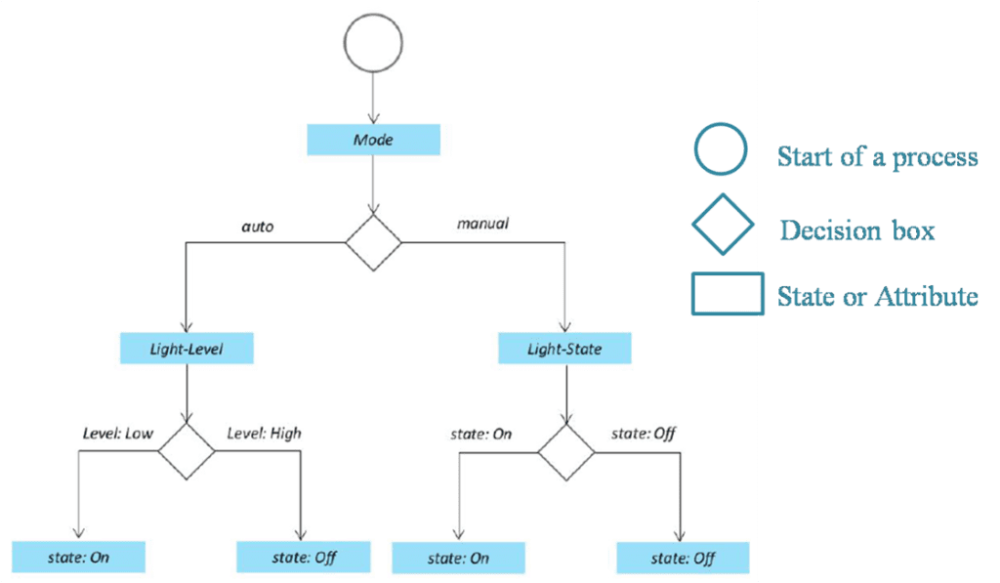

# Unit 2

## <mark> 1) List out the steps involved in IOT system design methodology. </mark>

The steps involved in IoT system design methodology can vary slightly depending on the specific project and chosen framework, but a common and comprehensive approach includes these stages:

**1. Requirements Gathering and Analysis:**

- **Identify the problem:** Clearly define the problem the IoT system aims to solve. What are the specific needs and goals?
- **Define functionalities:** Detail the specific tasks the system should perform. What data needs to be collected, processed, and acted upon?
- **Identify stakeholders:** Determine all parties involved (users, developers, manufacturers, etc.) and their requirements.
- **Constraints analysis:** Define limitations such as budget, power consumption, security requirements, regulatory compliance, and environmental factors.

**2. System Architecture Design:**

- **Choose hardware components:** Select appropriate sensors, actuators, microcontrollers, gateways, and cloud platforms based on the requirements. Consider factors like power consumption, processing power, communication protocols, and cost.
- **Design communication protocols:** Determine how devices will communicate with each other and the cloud (e.g., MQTT, CoAP, HTTP, AMQP).
- **Database design:** Plan how data will be stored and managed (e.g., cloud databases, local databases).
- **Security design:** Implement security measures at every layer to protect data and devices from unauthorized access and cyber threats. This includes authentication, authorization, encryption, and secure communication channels.
- **Define software architecture:** Design the software components, including firmware for devices, middleware for data processing, and applications for user interaction.

**3. Prototype Development and Testing:**

- **Build a prototype:** Create a working model of the system to validate the design and identify potential issues.
- **Unit testing:** Test individual components and modules to ensure they function correctly.
- **Integration testing:** Test the interaction between different components and modules.
- **System testing:** Test the entire system to ensure it meets the requirements.
- **User acceptance testing (UAT):** Allow users to test the system and provide feedback.

**4. Deployment and Integration:**

- **Deploy the system:** Install and configure the hardware and software components in the target environment.
- **Integrate with existing systems:** Connect the IoT system with other relevant systems (e.g., ERP, CRM).
- **Configure monitoring and management tools:** Set up tools to monitor the system's performance and manage devices remotely.

**5. Monitoring, Maintenance, and Updates:**

- **Monitor system performance:** Continuously track key metrics to identify potential issues and optimize performance.
- **Perform regular maintenance:** Update firmware, software, and security patches as needed.
- **Implement scalability and fault tolerance:** Design the system to handle increasing data volume and potential failures.
- **Data analysis and insights:** Analyze collected data to gain valuable insights and improve system performance or decision-making.

**Iterative Process:** It's crucial to understand that IoT system design is an iterative process. Feedback from testing and deployment phases often leads to refinements in earlier stages. Continuous monitoring and adaptation are essential for long-term success.

## <mark> 2) What is the difference between physical and virtual entity? </mark>

The difference between a physical and virtual entity lies in their existence and interaction with the physical world:

**Physical Entity:**

- **Exists in the physical world:** A physical entity occupies space and has a tangible presence. You can touch, see, smell, or otherwise physically interact with it.
- **Subject to physical laws:** Its behavior is governed by the laws of physics (gravity, inertia, etc.).
- **Examples:** A tree, a car, a person, a book, a computer (the hardware itself).

**Virtual Entity:**

- **Exists only in a computer system or network:** A virtual entity is represented by data and code. It doesn't have a physical form in the real world.
- **Exists as information:** It's a representation or simulation of something, often mimicking a physical entity but lacking its physical properties.
- **Manipulated by software:** Its behavior is determined by the software that creates and manages it.
- **Examples:** A digital photograph, a software application, a character in a video game, a cryptocurrency, a website, a virtual machine.

**Key distinctions summarized:**

| Feature     | Physical Entity                   | Virtual Entity                     |
| ----------- | --------------------------------- | ---------------------------------- |
| Existence   | Physical world                    | Computer system/network            |
| Tangibility | Tangible, occupies physical space | Intangible, no physical presence   |
| Interaction | Physical interaction possible     | Interaction via software/interface |
| Governed by | Laws of physics                   | Software and algorithms            |

It's important to note that the line between physical and virtual can sometimes blur. For example, a 3D-printed object starts as a virtual design and becomes a physical object. Similarly, the Internet of Things (IoT) connects physical devices to the virtual world, creating complex interactions between the two.

## <mark> 3) Explain the purpose and requirements specification of IOT system design methodology. </mark>

### IoT System Design Methodology: Purpose and Requirements Specification

The purpose of an IoT system design methodology is to provide a structured and systematic approach to developing reliable, scalable, and secure Internet of Things (IoT) systems. It aims to minimize risks, reduce development time and costs, and ensure the final product meets the defined needs and expectations. A good methodology guides the process from initial concept to deployment and maintenance.

**Purpose:**

- **Clearly define system goals and objectives:** What problem is the IoT system solving? What are its key functionalities? What are the desired outcomes?
- **Ensure interoperability and compatibility:** IoT systems often involve devices from different manufacturers and technologies. A methodology helps ensure seamless communication and data exchange.
- **Manage complexity:** IoT systems can be highly complex, involving numerous devices, sensors, networks, and software components. A structured approach simplifies management and development.
- **Prioritize security:** Security is paramount in IoT. The methodology should incorporate security considerations at every stage, from device selection to data transmission and storage.
- **Support scalability and maintainability:** The system should be able to handle increasing amounts of data and devices over time and allow for easy updates and maintenance.
- **Optimize resource utilization:** IoT systems often operate with limited resources (power, bandwidth, processing). The methodology should guide efficient resource allocation and management.

**Requirements Specification:**

The requirements specification stage is crucial and forms the foundation of the entire IoT system design. It meticulously outlines all aspects of the system, ensuring everyone involved (developers, stakeholders, etc.) is on the same page. This stage typically covers:

**1. Functional Requirements:** These describe _what_ the system should do. Examples include:

- **Data acquisition:** What data needs to be collected? From which sensors? How often?
- **Data processing:** How should the data be processed (filtered, aggregated, analyzed)?
- **Data storage:** Where will the data be stored (cloud, local database, edge device)?
- **Data communication:** What communication protocols will be used? (e.g., MQTT, CoAP, HTTP)
- **User interface:** How will users interact with the system? (web portal, mobile app, etc.)
- **System control:** How will the system be controlled and managed? (remotely, locally)
- **Alerting and notification:** How will users be notified of important events or errors?

**2. Non-Functional Requirements:** These describe _how_ the system should perform. Examples include:

- **Performance:** Response time, throughput, latency
- **Scalability:** Ability to handle increasing load
- **Security:** Authentication, authorization, data encryption, access control
- **Reliability:** System uptime, fault tolerance
- **Maintainability:** Ease of updates, troubleshooting, and maintenance
- **Usability:** Ease of use for end-users
- **Portability:** Ability to run on different platforms or devices
- **Power consumption:** Especially important for battery-powered devices

**3. Environmental Requirements:** These consider the operational environment. Examples include:

- **Temperature range:** Operating temperature limits
- **Humidity:** Humidity levels the system can withstand
- **Network connectivity:** Type and availability of network (Wi-Fi, cellular, etc.)
- **Physical constraints:** Size, weight, power supply availability

**4. Legal and Regulatory Requirements:** Compliance with relevant laws and regulations (e.g., data privacy, safety standards).

**Output of Requirements Specification:**

The output of this stage is a comprehensive document that clearly articulates all the functional and non-functional requirements, along with justifications and acceptance criteria. This document serves as the blueprint for the entire development process and is used to assess the final product against the initial goals. Different methodologies might use different formats (e.g., use cases, user stories, UML diagrams) to capture these requirements. The key is completeness, clarity, and traceability.

## <mark> 4) Discuss process specifications with a neat diagram for IOT system design methodology with an example. </mark>

Designing an effective Internet of Things (IoT) system involves a structured methodology to ensure all components work harmoniously. A critical step in this process is the **Process Specification**, which outlines the system's behavior and use cases derived from its purpose and requirements.

**Process Specification:**

In this phase, the specific functions and operations of the IoT system are defined. This includes detailing how the system should respond under various conditions and interactions between different components. Essentially, it translates the system's objectives into actionable processes.

**Example: Home Automation System**

Consider designing a home automation system that allows remote control of household lighting via a web application. The Process Specification for such a system would involve:

- **Auto Mode:** The system monitors ambient light levels using sensors. When natural light diminishes below a certain threshold, the system automatically activates indoor lighting to maintain desired illumination levels.

- **Manual Mode:** Users can remotely switch lights on or off through a web interface, providing direct control regardless of sensor readings.

- **System Management:** The system should support remote monitoring and control functionalities, allowing users to oversee system status and make adjustments as needed.

- **Data Analysis:** Implementing local data analysis enables the system to function effectively even without continuous internet connectivity, enhancing reliability and responsiveness.

- **Security:** Basic user authentication mechanisms are necessary to prevent unauthorized access and ensure that only authorized individuals can control the lighting system.

By meticulously defining these processes, developers can create a robust and user-friendly home automation system that aligns with user needs and operational requirements.

## <mark> 5) Explain the domain model specifications in detail with a neat diagram for IOT system design methodology. </mark>

In the context of IoT system design methodology, the **Domain Model Specification** serves as a conceptual framework that outlines the primary entities, objects, and their interrelationships within the system's domain. This model provides a high-level understanding of the system's structure, independent of specific technologies or platforms, facilitating effective communication among stakeholders and guiding subsequent design phases.

**Key Components of the Domain Model:**

1. **Physical Entity:**
   Tangible objects in the environment, such as appliances, vehicles, or industrial machinery, which the IoT system monitors or controls.

2. **Virtual Entity:**
   Digital representations of physical entities within the IoT system, enabling interaction and data exchange in the virtual domain.

3. **Device:**
   Hardware components like sensors and actuators that bridge the physical and virtual entities by collecting data or performing actions.

4. **Resource:**
   Software components, either on-device or network-based, that provide specific functionalities or services.

5. **Service:**
   Interfaces offering specific functionalities to users or other system components, such as data retrieval or device control.

**Illustrative Example: Home Automation System**

Consider a home automation system designed to manage household lighting:

- **Physical Entity:** The actual light fixtures in the home.

- **Virtual Entity:** Digital counterparts of these light fixtures within the system's software, allowing for virtual monitoring and control.

- **Device:** Sensors detecting ambient light levels and actuators controlling the lights' on/off states.

- **Resource:** Software modules that process sensor data and determine appropriate lighting responses.

- **Service:** User interfaces, such as mobile apps, enabling residents to monitor and adjust lighting settings remotely.

**Visual Representation:**

A diagram illustrating these components and their interactions can be found in the following resource:

[IoT Design Methodology - IoT Tutorial for Beginners - Startertutorials](https://www.startertutorials.com/blog/iot-design-methodology.html)

In this diagram, the relationships between physical entities, virtual entities, devices, resources, and services are depicted, providing a clear visualization of the domain model for a home automation system.

By developing a comprehensive domain model specification, designers can ensure a structured approach to IoT system development, promoting clarity, consistency, and alignment with user needs and system objectives.

## <mark> 6) Explain the information model specification for IOT system design methodology with diagrams. </mark>

In the context of IoT system design methodology, the **Information Model Specification** defines the structure and organization of information within the system. It outlines how data is represented, the relationships between different data entities, and the semantics associated with them. This model serves as a blueprint for data management, ensuring consistency and interoperability across various components of the IoT system.

**Key Components of the Information Model:**

1. **Virtual Entities:**
   Digital representations of physical entities within the IoT system. Each virtual entity corresponds to a real-world object or concept that the system monitors or controls.

2. **Attributes:**
   Characteristics or properties associated with virtual entities. Attributes define specific data points relevant to the entity, such as temperature, location, or status.

3. **Relationships:**
   Connections between different virtual entities or between entities and attributes. These relationships define how data points interact or depend on each other within the system.

**Example: Home Automation System**

Consider a home automation system designed to manage household lighting:

- **Virtual Entity:** A representation of a light fixture within the home.

- **Attributes:** Properties such as the light's current state (on/off), brightness level, and color temperature.

- **Relationships:** Associations between the light fixture and other entities, such as rooms or control switches, defining how they interact within the system.

By establishing a clear information model, system designers can ensure that all components of the IoT system have a shared understanding of data structures and semantics, facilitating seamless integration and operation.

For a visual representation and further details on IoT information models, you can refer to the following resource:

- **IoT Reference Model:** This model provides an in-depth look at the structure of information handled and processed in an IoT system, detailing aspects such as virtual entities, services, and associations.

By adhering to a well-defined information model specification, IoT systems can achieve greater reliability, scalability, and interoperability, ensuring that all components work together harmoniously to meet user needs and system objectives.

## <mark> 7) What are the service specifications in designing IOT systems? </mark>

Service specifications in designing IoT systems are crucial for ensuring the system meets its intended goals and operates reliably. They define the functional and non-functional requirements of the services offered by the IoT system. These specifications can be categorized in several ways, but here are some key aspects:

**1. Functional Specifications:** These define _what_ the IoT system should do.

- **Data Acquisition & Processing:** This specifies how data is collected from sensors, pre-processed (e.g., filtering, aggregation), and formatted for transmission or storage. Details include:
  - Supported sensor types and protocols (e.g., I2C, SPI, Modbus, MQTT)
  - Data sampling rates and frequency
  - Data validation and error handling
  - Data transformation and normalization
- **Data Storage & Management:** This outlines how data is stored (e.g., cloud, edge device, database), accessed, and managed, including:
  - Data storage capacity and retention policies
  - Data security and access control
  - Data backup and recovery mechanisms
  - Data query and retrieval methods
- **Communication & Connectivity:** This defines the communication protocols, network infrastructure, and bandwidth requirements:
  - Network protocols (e.g., MQTT, CoAP, HTTP, AMQP)
  - Network topology and architecture
  - Bandwidth requirements and limitations
  - Security protocols (e.g., TLS/SSL, DTLS)
  - Network connectivity reliability and fault tolerance
- **Application Services:** This describes the higher-level services provided by the IoT system, such as:
  - User interface (UI) and user experience (UX) specifications
  - Data visualization and analytics dashboards
  - Alerting and notification mechanisms
  - Remote control and management capabilities
  - Integration with other systems (e.g., enterprise resource planning (ERP), customer relationship management (CRM))
- **Actuator Control:** If the system includes actuators, this specifies how they are controlled and monitored:
  - Actuator types and protocols
  - Control commands and responses
  - Safety mechanisms and fail-safes

**2. Non-Functional Specifications:** These define _how well_ the IoT system performs.

- **Performance:** This encompasses aspects like:
  - Response time and latency
  - Throughput and scalability
  - Data processing speed
  - System stability and reliability
- **Security:** This addresses the protection of data and the system from unauthorized access and threats:
  - Authentication and authorization mechanisms
  - Data encryption and integrity
  - Intrusion detection and prevention
  - Secure boot and firmware updates
  - Compliance with relevant security standards (e.g., NIST, ISO 27001)
- **Scalability:** The ability to handle increasing amounts of data and devices over time.
- **Reliability:** The ability of the system to operate without failure for a specified period. Includes fault tolerance and recovery mechanisms.
- **Maintainability:** Ease of maintenance, upgrades, and troubleshooting.
- **Availability:** The percentage of time the system is operational.
- **Portability:** The ability to deploy the system on different platforms and hardware.
- **Usability:** Ease of use for both end-users and administrators.

These service specifications should be documented thoroughly and consistently throughout the design process. They serve as a basis for development, testing, and deployment, ensuring the IoT system meets the needs of its users and stakeholders. The specific details will vary greatly depending on the particular application and requirements of the IoT system being designed.

## <mark> 8) Discuss the various functional groups involved in functional view specifications in detail. </mark>

Functional view specifications, in the context of software engineering and system design, focus on _what_ a system does rather than _how_ it does it. They describe the system's functionality from the user's perspective, using functional requirements. Various functional groups can be categorized within these specifications, although the exact categorization might vary slightly depending on the methodology used. Here's a discussion of some key functional groups:

**1. Input/Output Functions:** These are fundamental. They describe how data enters and leaves the system. This group encompasses:

- **Input Functions:** Describe how the system receives data. This could include reading from files, databases, sensors, user interfaces (keyboard, mouse, touchscreen), network connections (APIs, web services), or other systems. Specific examples include: `ReadFromFile`, `ReceiveNetworkPacket`, `GetUserInput`. The specification would detail the data format expected, validation rules, and error handling.

- **Output Functions:** Describe how the system delivers data or results. This involves writing to files, databases, displays, actuators, network connections, or other systems. Examples: `WriteToFile`, `SendNetworkResponse`, `DisplayResults`, `ControlActuator`. Specifications should include the format of the output, any formatting requirements, and error handling.

**2. Data Manipulation Functions:** This group focuses on how the system processes data internally. These are often crucial for complex systems and include:

- **Calculation Functions:** Perform mathematical or logical operations on data. Examples: `CalculateTotal`, `ComputeAverage`, `PerformStatisticalAnalysis`. Specifications would detail the algorithms used, accuracy requirements, and any limitations.

- **Data Transformation Functions:** Modify the format or structure of data. Examples: `ConvertUnits`, `FormatDate`, `EncryptData`, `ParseXML`. Specifications would define the input and output data formats and any transformation rules.

- **Data Storage and Retrieval Functions:** Manage data persistence. Examples: `SaveData`, `RetrieveData`, `UpdateData`, `DeleteData`. Specifications would detail the data storage mechanism (database, file system), data structures used, and access methods.

- **Data Validation and Error Handling Functions:** Ensure data integrity and handle unexpected input or errors. Examples: `ValidateInput`, `HandleError`, `RecoverFromFailure`. Specifications would describe validation rules, error messages, and recovery procedures.

**3. Control and Management Functions:** This group deals with the overall operation and management of the system:

- **System Initialization and Termination Functions:** Handle the startup and shutdown processes. Examples: `InitializeSystem`, `ShutdownSystem`. Specifications might detail configuration parameters, resource allocation, and cleanup procedures.

- **Security Functions:** Ensure data confidentiality, integrity, and availability. Examples: `AuthenticateUser`, `AuthorizeAccess`, `EncryptData`, `LogSecurityEvents`. Specifications must describe security policies, authentication methods, and access control mechanisms.

- **Monitoring and Logging Functions:** Track system performance and generate logs for debugging and auditing. Examples: `MonitorSystemStatus`, `GenerateLog`, `ReportError`. Specifications should detail logging levels, data collected, and reporting mechanisms.

- **User Interface Functions (if applicable):** These directly interact with users. Examples: `DisplayMenu`, `ProcessUserInput`, `HandleUserInteraction`. Specifications would describe the user interface design, navigation, and usability aspects.

**Detailed Specification Elements:**

For each function within these groups, a thorough functional specification should include:

- **Function Name:** A clear and concise name.
- **Description:** A detailed description of the function's purpose.
- **Input Parameters:** Data types, formats, and validation rules.
- **Output Parameters:** Data types, formats, and any constraints.
- **Preconditions:** Conditions that must be met before the function can be executed.
- **Postconditions:** Conditions that are true after the function has executed successfully.
- **Error Handling:** How errors are detected and handled.
- **Algorithm (if necessary):** A high-level description of the function's logic.

By carefully defining these functional groups and their associated elements, developers create clear and unambiguous specifications that serve as a solid foundation for system development and testing. The level of detail within each functional specification will depend on the complexity of the system and the needs of the stakeholders.

## <mark> 9) Explain the operational view specifications in designing IOT systems. </mark>

Operational view specifications in designing IoT systems focus on how the system will function in real-time and how its components will interact during operation. They address the dynamic aspects, contrasting with the static aspects covered in logical and physical views. These specifications detail the system's behavior and performance characteristics under various conditions. Key aspects include:

- **Data Flow and Processing:** This describes how data is acquired from sensors, transmitted through the network, processed by various components (e.g., gateways, cloud servers), and finally acted upon (e.g., triggering an alert, controlling an actuator). It includes details on data rates, latency requirements, error handling, and data transformation processes. Consideration is given to real-time constraints and the impact of varying network conditions.

- **Communication Protocols:** Specifications detail the communication protocols used at each stage of data flow (e.g., MQTT, CoAP, HTTP, AMQP). This includes addressing issues of interoperability, security, and reliability. Specific protocols chosen will depend on factors like bandwidth limitations, power constraints, and security requirements.

- **Event Handling and Responses:** This describes how the system reacts to events detected by sensors or generated within the system. It defines event triggers, event processing logic, and the actions taken in response to different events. This section covers the timing and sequence of actions, including handling exceptions and failures.

- **Concurrency and Synchronization:** If multiple components operate concurrently (e.g., multiple sensors sending data simultaneously), the specifications will detail mechanisms for managing concurrent operations and synchronizing access to shared resources (e.g., databases, actuators). This often involves considering strategies for managing race conditions and deadlocks.

- **Performance Requirements:** This section outlines the performance metrics that the system must meet, such as data acquisition rate, latency, throughput, availability, and response time to events. These requirements are crucial for defining system constraints and guiding design choices.

- **Security Considerations:** Operational specifications address security during runtime. This includes mechanisms for data authentication, authorization, encryption, and secure communication protocols to protect against unauthorized access and data breaches. It addresses aspects of handling security incidents and responses.

- **Fault Tolerance and Recovery:** The specifications outline mechanisms for detecting and handling failures. This includes redundancy strategies (e.g., having backup sensors or communication paths), error recovery procedures, and system self-healing capabilities.

Essentially, the operational view specifications provide a blueprint for the system's runtime behavior, addressing not only "what" the system does but also "how" it does it, "when" it does it, and "how well" it performs under various conditions. These specifications are crucial for ensuring the system's reliability, efficiency, and security in a real-world deployment.

## <mark> 10) Explain the importance of device, component integration and application development in IOT system design. </mark>

The successful design of an IoT system hinges critically on the seamless integration of devices, components, and the application that brings it all together. Each aspect plays a crucial role, and failures in any one area can compromise the entire system.

**1. Device Integration:** This involves selecting and connecting the physical hardware that collects and transmits data. Its importance stems from:

- **Data Acquisition:** The accuracy, reliability, and efficiency of data collection are paramount. Choosing the right sensors, actuators, and communication modules (e.g., Wi-Fi, Bluetooth, LoRaWAN) is crucial for acquiring the relevant data with the desired precision and frequency. Poorly chosen devices lead to inaccurate data, system failures, or increased energy consumption.
- **Power Management:** IoT devices are often battery-powered, so efficient power consumption is vital for longevity. Device integration involves selecting energy-efficient components and optimizing power management strategies within the device firmware.
- **Security:** Devices are potential entry points for malicious actors. Secure device integration means implementing robust security mechanisms, including secure boot, encryption, and authentication, to protect against unauthorized access and data breaches.
- **Interoperability:** IoT systems often involve devices from different manufacturers. Careful selection and integration ensure that these devices can communicate effectively and exchange data seamlessly, even if they use different protocols.

**2. Component Integration:** This refers to the integration of hardware and software components beyond individual devices. It includes:

- **Networking:** Connecting devices to the network (e.g., cloud, local network) is critical for data transmission and system management. This involves selecting appropriate network protocols, gateways, and communication infrastructure. Issues here can lead to network congestion, latency, and data loss.
- **Data Processing:** This may involve edge computing (processing data locally on a gateway or device) or cloud computing (processing data in a remote data center). The selection of the processing environment depends on the application's requirements for latency, processing power, and data storage. Efficient component integration is crucial for real-time responsiveness and scalability.
- **Data Storage:** Deciding where and how data is stored (cloud, local database, device memory) is key. This involves considering data volume, access requirements, security, and cost.
- **Middleware:** This software layer facilitates communication and data exchange between devices, applications, and cloud services. Effective middleware integration simplifies development and ensures interoperability.

**3. Application Development:** This is the crucial final step that ties everything together, creating the user interface and the system's functionality. Its importance lies in:

- **User Experience:** A well-designed application provides a user-friendly interface for monitoring data, controlling devices, and receiving alerts. Poor application design can render even the most sophisticated hardware useless.
- **Data Visualization and Analysis:** The application should provide tools for visualizing and analyzing the collected data, enabling users to extract meaningful insights and make informed decisions.
- **System Management:** The application often includes tools for managing devices, monitoring system performance, and troubleshooting issues. Efficient management is critical for maintaining the reliability and scalability of the IoT system.
- **Integration with other systems:** Many IoT systems need to integrate with existing enterprise systems, databases, or other applications. Application development includes designing the interfaces and protocols for this integration.

In summary, IoT system design is a holistic endeavor. Successfully integrating devices, components, and the application requires a deep understanding of hardware, software, networking, security, and user experience. Neglecting any of these aspects can lead to a flawed system that fails to meet its intended purpose.

## <mark> 11) What is the need for controller service? </mark>

Controller services are needed in software architecture, particularly in microservices and other distributed systems, to manage and orchestrate the interactions between different components. Their necessity stems from several key reasons:

- **Decoupling and Modularity:** Controllers act as intermediaries, decoupling the underlying business logic (often residing in separate services) from the external world (e.g., user interfaces, other applications). This improves modularity, making it easier to develop, test, and maintain individual components independently. Changes in one service don't necessarily necessitate changes in others.

- **Abstraction and Simplification:** Controllers abstract away the complexities of interacting with multiple services. A client application only needs to interact with the controller, which handles the details of communication, data transformation, and error handling with the underlying services. This simplifies the client's code and reduces its dependency on the internal workings of the system.

- **Orchestration and Workflow Management:** Controllers can orchestrate complex workflows involving multiple services. They determine the order of service calls, handle dependencies, and manage the flow of data between services. This is crucial for implementing business processes that involve interactions with various parts of the system.

- **Security and Access Control:** Controllers provide a centralized point for implementing security and access control policies. They can authenticate users, authorize requests, and enforce security rules before forwarding requests to underlying services. This enhances the overall security of the system.

- **Error Handling and Resilience:** Controllers can handle errors that occur during interactions with underlying services, providing a consistent and user-friendly experience to the client. They can implement retry mechanisms, circuit breakers, and other resilience patterns to ensure that the system remains available even in the face of failures.

- **Data Transformation and Validation:** Controllers often perform data transformation and validation before passing requests to downstream services. They can convert data from one format to another, ensure that data meets certain constraints, and handle data inconsistencies.

In short, controller services are essential for building robust, scalable, and maintainable systems, especially those with multiple interconnected components. They act as the glue that binds different services together, providing a simplified and manageable interface for clients and enhancing the overall reliability and security of the application.

## <mark> 12) What is cloud computing? What are Basic Cloud Characteristics? </mark>

### Cloud Computing Explained

Cloud computing is the on-demand availability of computer system resources, especially data storage (cloud storage) and computing power, without direct active management by the user. Instead of owning and maintaining physical data centers and servers, users access these resources over the internet from a cloud provider like Amazon Web Services (AWS), Microsoft Azure, or Google Cloud Platform (GCP). Think of it like accessing electricity from the power grid – you don't need to own a power plant to use electricity.

Essentially, cloud computing allows individuals and organizations to:

- **Rent** computing resources instead of buying and maintaining them.
- **Scale** resources up or down as needed, paying only for what they use.
- **Access** resources from anywhere with an internet connection.
- **Focus** on their core business rather than IT infrastructure management.

### Basic Cloud Characteristics

Several key characteristics define cloud computing:

- **On-demand self-service:** Users can provision computing capabilities, such as server time and network storage, as needed automatically without requiring human interaction with each service provider.

- **Broad network access:** Capabilities are available over the network and accessed through standard mechanisms that promote use by heterogeneous thin or thick client platforms (e.g., mobile phones, tablets, laptops, and workstations).

- **Resource pooling:** The provider's computing resources are pooled to serve multiple consumers using a multi-tenant model, with different physical and virtual resources dynamically assigned and reassigned according to consumer demand. There's a sense of sharing, but users generally don't know where their data is physically stored.

- **Rapid elasticity:** Capabilities can be elastically provisioned and released, in some cases automatically, to scale rapidly outward and inward commensurate with demand. To the consumer, the capabilities available for provisioning often appear to be unlimited and can be appropriated in any quantity at any time.

- **Measured service:** Cloud systems automatically control and optimize resource use by leveraging a metering capability at some level of abstraction appropriate to the type of service (e.g., storage, processing, bandwidth, and active user accounts). Resource usage can be monitored, controlled, and reported, providing transparency for both the provider and consumer of the utilized service.

These characteristics, when combined, allow for flexible, scalable, and cost-effective computing solutions. Different cloud deployment models (public, private, hybrid, etc.) exist to accommodate varying needs and security requirements.

## <mark> 13) Explain SaaS, PaaS, IaaS in detail. </mark>

SaaS, PaaS, and IaaS are three common cloud computing service models, each offering different levels of control and responsibility to the user. Let's break down each one:

**1. Software as a Service (SaaS):**

- **What it is:** SaaS is the highest level of abstraction in the cloud. You access and use software applications over the internet, without managing the underlying infrastructure (servers, operating systems, databases, etc.). Think of it like renting an apartment – you use the space, but the landlord handles everything else.
- **Who manages what:** The cloud provider manages _everything_: the hardware, operating system, application software, and even the database. The user only manages their own data and user configurations within the application.
- **Examples:** Salesforce (CRM), Microsoft 365 (email, office suite), Google Workspace (email, docs, sheets), Dropbox (file storage), Zoom (video conferencing).
- **Advantages:**
  - **Cost-effective:** No upfront capital investment in hardware or software. Pay-as-you-go or subscription models are common.
  - **Easy to use:** Requires minimal technical expertise. Applications are accessed through a web browser or mobile app.
  - **Scalability:** Resources can be easily scaled up or down as needed.
  - **Accessibility:** Accessible from anywhere with an internet connection.
  - **Automatic updates:** The provider handles software updates and maintenance.
- **Disadvantages:**
  - **Limited customization:** You have limited control over the software's functionality and features.
  - **Vendor lock-in:** Switching providers can be difficult and expensive.
  - **Security concerns:** You are reliant on the provider's security measures.
  - **Dependence on internet connectivity:** Requires a stable internet connection.

**2. Platform as a Service (PaaS):**

- **What it is:** PaaS provides a platform for developers to build, deploy, and manage applications without the need to manage the underlying infrastructure. Think of it as renting a workshop – you provide your own tools and materials (code, databases), but the landlord (provider) provides the building and essential utilities (servers, operating systems, databases).
- **Who manages what:** The cloud provider manages the hardware, operating system, runtime environment, middleware, and databases. The user manages the applications and data they deploy.
- **Examples:** AWS Elastic Beanstalk, Google App Engine, Microsoft Azure App Service, Heroku.
- **Advantages:**
  - **Faster development:** Focus on application development rather than infrastructure management.
  - **Increased agility:** Quickly deploy and update applications.
  - **Scalability and flexibility:** Easily scale resources as needed.
  - **Cost-effective:** Reduces the cost of managing infrastructure.
- **Disadvantages:**
  - **Limited control:** Less control over the underlying infrastructure than IaaS.
  - **Vendor lock-in:** Can be challenging to migrate to another provider.
  - **Potential compatibility issues:** Applications may not be compatible with all PaaS platforms.

**3. Infrastructure as a Service (IaaS):**

- **What it is:** IaaS is the most basic cloud computing model. It provides on-demand access to computing resources such as virtual machines (VMs), storage, networks, and operating systems. Think of it like renting a building – you are responsible for everything inside, from building the structure to furnishing it.
- **Who manages what:** The cloud provider manages the physical hardware (servers, network, storage). The user manages the operating systems, applications, databases, and other software.
- **Examples:** Amazon Web Services (AWS) EC2, Microsoft Azure Virtual Machines, Google Compute Engine.
- **Advantages:**
  - **High control:** Maximum control over the infrastructure and applications.
  - **Flexibility:** Choose the operating systems, software, and configurations that best suit your needs.
  - **Scalability:** Easily scale resources up or down as needed.
  - **Cost-effective:** Pay only for the resources you use.
- **Disadvantages:**
  - **High management overhead:** Requires significant technical expertise to manage the infrastructure.
  - **More complex setup:** Setting up and configuring the infrastructure can be time-consuming.
  - **Security responsibility:** The user is responsible for security management.

In summary: SaaS is about using software, PaaS is about building and deploying software, and IaaS is about managing the underlying infrastructure. The choice of model depends on your technical expertise, budget, and specific needs. Many organizations utilize a combination of these models to achieve optimal efficiency.

## <mark> 14) What are the advantages and disadvantages of cloud computing? </mark>

### Cloud Computing: Advantages and Disadvantages

Cloud computing offers numerous benefits but also presents some challenges. Here's a breakdown:

**Advantages:**

- **Cost-effectiveness:**

  - **Reduced capital expenditure:** No need to invest heavily in hardware infrastructure (servers, storage, networking equipment). Pay-as-you-go models significantly reduce upfront costs.
  - **Lower operational costs:** Reduced IT staffing needs, lower energy consumption, and minimized maintenance expenses.
  - **Scalability:** Easily adjust resources (compute power, storage) up or down based on demand, avoiding overspending on unused capacity.

- **Scalability and Elasticity:** Quickly scale resources up or down to meet fluctuating demands. This is crucial for businesses experiencing seasonal peaks or rapid growth.

- **Accessibility and Availability:** Access data and applications from anywhere with an internet connection, improving collaboration and productivity. Cloud providers typically offer high availability and redundancy, minimizing downtime.

- **Increased efficiency and productivity:** Focus on core business activities instead of managing IT infrastructure. Cloud services automate many tasks, freeing up IT staff for strategic initiatives.

- **Enhanced collaboration:** Cloud-based tools facilitate seamless collaboration among team members, regardless of location.

- **Data backup and disaster recovery:** Cloud providers offer robust data backup and disaster recovery solutions, ensuring business continuity in case of unforeseen events.

- **Automatic software updates:** Cloud providers handle software updates and maintenance, reducing the burden on IT staff.

- **Innovation:** Access to a wide range of cutting-edge technologies and services without significant upfront investment.

**Disadvantages:**

- **Internet dependency:** Requires a stable and reliable internet connection. Outages can disrupt access to data and applications.

- **Security concerns:** Data security and privacy are major concerns. While cloud providers implement security measures, there's still a risk of data breaches or unauthorized access. Compliance with regulations (e.g., GDPR, HIPAA) can be complex.

- **Vendor lock-in:** Migrating data and applications from one cloud provider to another can be difficult and expensive. Choosing a provider requires careful consideration.

- **Limited control:** Users have less control over their infrastructure compared to on-premise solutions. This can be a concern for organizations with strict security or compliance requirements.

- **Downtime:** Although cloud providers strive for high availability, downtime can still occur due to outages, maintenance, or other unforeseen circumstances.

- **Cost management:** While cloud computing can be cost-effective, it's crucial to monitor usage and costs carefully to avoid unexpected bills. Uncontrolled resource consumption can lead to significant expenses.

- **Compliance and regulations:** Meeting specific industry regulations and compliance requirements can be challenging in a cloud environment.

- **Data sovereignty:** Storing data in a cloud provider's data center may raise concerns about data sovereignty and jurisdiction.

The decision of whether or not to adopt cloud computing depends on a careful assessment of an organization's specific needs, resources, and risk tolerance. Weighing the advantages and disadvantages is essential to make an informed choice.
