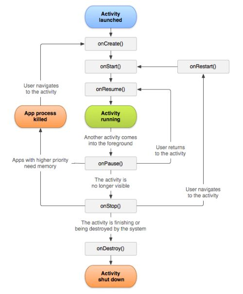

# Unit 1

## <mark> 1) What is android? Explain with its features. </mark>

### What is Android?

Android is an open-source mobile operating system based on the **Linux kernel**, primarily designed for touchscreen devices like **smartphones, tablets, and smart TVs**. It was initially developed by **Android Inc.** and later acquired by **Google** in 2005. The first commercial Android device was released in 2008. Android provides a flexible and customizable environment for app developers and offers a vast ecosystem of applications via the **Google Play Store**.

### Features of Android:

1. **Open-Source** – Android’s source code is freely available, allowing developers and manufacturers to modify and customize it.
2. **Customizable UI** – Users can personalize themes, widgets, and layouts according to their preferences.
3. **Multiple Device Compatibility** – Supports a variety of devices, including smartphones, tablets, smartwatches, TVs, and even cars.
4. **Google Services Integration** – Seamless access to Google apps like Gmail, Maps, Drive, and Play Store.
5. **Multitasking** – Allows users to run multiple applications simultaneously.
6. **Connectivity Options** – Supports Wi-Fi, Bluetooth, NFC, 4G/5G, and USB connections.
7. **Application Framework** – Provides APIs for developers to create powerful applications.
8. **Security Features** – Includes built-in security tools like **Google Play Protect**, app permissions, and encryption.
9. **Regular Updates** – Google releases frequent updates to enhance performance and security.
10. **Support for Various Programming Languages** – Developers can build Android apps using **Java, Kotlin, C++, and Python**.

These features make Android a **widely used and powerful** operating system for mobile devices.

## <mark> 2) Explain Android software stack in detail. </mark>

### Android Software Stack

The **Android software stack**, also known as the **Android architecture**, is a layered structure that provides the necessary components to develop and run Android applications. It consists of **five main layers**, each serving a specific function.

#### 1. Linux Kernel

- The **foundation** of the Android operating system.
- Manages **device drivers**, **memory management**, **power management**, **process management**, and **networking**.
- Provides an **abstraction layer** between hardware and the rest of the software stack.
- Examples: Display Driver, Camera Driver, Flash Memory Driver, Audio Driver, Binder (IPC) Driver.

#### 2. Native Libraries (Middleware)

- Built on top of the Linux kernel, these libraries provide **core functionalities** of Android.
- Written in **C/C++** and include essential libraries like:
  - **WebKit** – For web browsing.
  - **SQLite** – Lightweight database for local storage.
  - **OpenGL ES** – Handles 2D/3D graphics rendering.
  - **Media Framework** – Supports audio and video playback.
  - **FreeType** – For font rendering.
  - **SSL** – For secure internet communications.

#### 3. Android Runtime (ART) & Core Libraries

- **ART (Android Runtime)**:
  - Replaces **Dalvik Virtual Machine (DVM)** in newer versions.
  - Uses **Ahead-of-Time (AOT) Compilation** for better performance.
  - Manages memory, executes apps, and optimizes performance.
- **Core Libraries**:
  - Provides essential Java libraries for Android development.
  - Includes libraries for data structures, graphics, and file handling.

#### 4. Application Framework

- Provides APIs and services that developers use to create applications.
- Key components include:
  - **Activity Manager** – Manages app lifecycle and back stack.
  - **Content Providers** – Enables data sharing between apps.
  - **Resource Manager** – Handles external resources (UI layouts, images, strings).
  - **Notification Manager** – Controls status bar notifications.
  - **Location Manager** – Provides location tracking using GPS or Wi-Fi.

#### 5. Applications

- The **topmost layer** where user applications reside.
- Includes **built-in** apps (Phone, Contacts, Messages, Browser) and **third-party** apps installed via the Play Store.

This structured **software stack** ensures that Android applications run smoothly while maintaining **security, efficiency, and compatibility** across various devices.

## <mark> 3) Explain with diagram the Android platform architecture. </mark>

### Android Platform Architecture

Android platform architecture is structured into multiple layers, each providing essential functionalities to support application development and execution. The architecture consists of **five main layers**, as shown in the diagram below.

#### Diagram of Android Platform Architecture


#### 1. Applications

- The topmost layer where **user applications** and **pre-installed system apps** (such as Phone, Contacts, and Browser) reside.
- Applications interact with the **Application Framework** to access system resources.

#### 2. Application Framework

- Provides APIs to developers for building Android apps.
- Key components include:
  - **Activity Manager** – Manages app lifecycle and navigation.
  - **Content Providers** – Enables data sharing between apps.
  - **Notification Manager** – Handles app notifications.
  - **Resource Manager** – Manages UI elements like strings, images, and layouts.

#### 3. Android Runtime & Native Libraries

- **Android Runtime (ART):**
  - Replaces the older Dalvik Virtual Machine.
  - Uses **Ahead-of-Time (AOT) Compilation** for better performance.
- **Native Libraries:**
  - Built using **C/C++**, providing essential system functionalities.
  - Includes libraries for graphics, multimedia, databases, and web browsing.
  - Examples:
    - **SQLite** – Database management.
    - **OpenGL ES** – Graphics rendering.
    - **Media Framework** – Audio and video playback.

#### 4. Hardware Abstraction Layer (HAL)

- Acts as a **bridge between hardware and software**.
- Provides standard interfaces for communication between the Android system and device hardware (camera, audio, sensors, etc.).

#### 5. Linux Kernel

- The **core layer** that interacts directly with the hardware.
- Manages **process scheduling, memory, drivers, networking, and security**.
- Ensures **device stability and efficiency**.

This layered structure enables Android to provide **flexibility, security, and compatibility** across various devices.

## <mark> 4) Explain the Android Virtual Machine. </mark>

### Android Virtual Machine (AVM)

Android Virtual Machine (AVM) is responsible for running Android applications efficiently on different hardware devices. Initially, Android used the **Dalvik Virtual Machine (DVM)**, which was later replaced by the **Android Runtime (ART)** for better performance.

#### 1. Dalvik Virtual Machine (DVM)

- Used in **Android versions up to 4.4 (KitKat)**.
- Optimized for **low memory and battery consumption**.
- Uses **Just-In-Time (JIT) Compilation**, which translates bytecode into machine code at runtime.
- Runs **DEX (Dalvik Executable) files**, which are optimized for mobile devices.
- Supports **multiple instances**, allowing apps to run in their own isolated environments.

#### 2. Android Runtime (ART)

- Introduced in **Android 4.4 (KitKat)** and made the default runtime in **Android 5.0 (Lollipop)**.
- Uses **Ahead-Of-Time (AOT) Compilation**, which compiles apps into native machine code during installation.
- Improves **app performance, startup speed, and battery life**.
- Supports **Garbage Collection (GC)**, reducing memory leaks and improving memory management.
- Runs **DEX files**, but with precompiled native code for faster execution.

#### Key Differences Between DVM and ART

| Feature             | Dalvik VM (DVM)                   | Android Runtime (ART)                  |
| ------------------- | --------------------------------- | -------------------------------------- |
| Compilation Method  | Just-In-Time (JIT)                | Ahead-Of-Time (AOT)                    |
| Performance         | Slower                            | Faster                                 |
| Memory Efficiency   | Optimized for low memory          | Uses more storage for precompiled code |
| Execution Speed     | Converts bytecode at runtime      | Precompiles code during installation   |
| Battery Consumption | Higher due to runtime compilation | Lower due to precompiled execution     |

#### Conclusion

Android Runtime (ART) has replaced Dalvik VM due to its better performance, energy efficiency, and smoother app execution. It enables **faster and more optimized** Android applications while maintaining backward compatibility.

## <mark> 5) Write down the steps to create AVD (Android Virtual Device). </mark>

### Steps to Create AVD (Android Virtual Device)

1. **Open Android Studio**

   - Launch **Android Studio** on your computer.

2. **Open AVD Manager**

   - Click on **Tools** in the top menu.
   - Select **AVD Manager** from the dropdown.

3. **Create a New Virtual Device**

   - In the AVD Manager window, click on **Create Virtual Device**.

4. **Select Hardware**

   - Choose a device model (e.g., **Pixel 6, Nexus 5X**).
   - Click **Next**.

5. **Select a System Image**

   - Choose an **Android version (API level)** for the virtual device.
   - If not downloaded, click **Download** next to the version you want.
   - Click **Next** after selection.

6. **Configure AVD Settings**

   - Set **RAM, Storage, and Graphics options** (default settings work fine).
   - Optionally, modify **device orientation and scale**.
   - Click **Finish**.

7. **Launch the AVD**
   - In the AVD Manager, find your newly created virtual device.
   - Click **Run (▶️ Play button)** to start the emulator.

Now, the Android Virtual Device is ready for testing applications.

## <mark> 6) Write down the steps to create Android Application. </mark>

### Steps to Create an Android Application

1. **Open Android Studio**

   - Launch **Android Studio** on your computer.

2. **Start a New Project**

   - Click on **"Start a new Android Studio project"**.

3. **Select a Project Template**

   - Choose a template such as **Empty Activity** and click **Next**.

4. **Configure the Project**

   - Enter **Application Name** (e.g., "MyFirstApp").
   - Select **Programming Language** (**Java** or **Kotlin**).
   - Set **Minimum SDK** (e.g., API 21 for Android 5.0 Lollipop).
   - Click **Finish**.

5. **Wait for Project Setup**

   - Android Studio will create the necessary files and build the project.

6. **Design the User Interface (UI)**

   - Open **res/layout/activity_main.xml**.
   - Add UI elements like **TextView, Button, EditText** using XML or the Design view.

7. **Write the Application Logic**

   - Open **MainActivity.java (or .kt for Kotlin)**.
   - Add functionality, such as handling button clicks.
   - Example:
     ```java
     Button myButton = findViewById(R.id.button);
     myButton.setOnClickListener(new View.OnClickListener() {
         @Override
         public void onClick(View v) {
             Toast.makeText(MainActivity.this, "Button Clicked!", Toast.LENGTH_SHORT).show();
         }
     });
     ```

8. **Run the Application**

   - Click **Run (▶️ Play button)** or press **Shift + F10**.
   - Choose an **Android Emulator (AVD)** or a connected **physical device**.

9. **Test and Debug**

   - Use **Logcat** to check for errors.
   - Modify and improve the app as needed.

10. **Build and Generate APK**

- Click **Build > Build Bundle(s) / APK(s) > Build APK**.
- Install the APK on a physical device for testing.

Now, your **Android application is successfully created and running**.

## <mark> 7) Explain the Android Manifest File and its common settings in detail. </mark>

### Android Manifest File and Its Common Settings

The **Android Manifest file** (`AndroidManifest.xml`) is an essential configuration file in every Android application. It provides **information about the app** to the Android system, including its components, permissions, hardware features, and app metadata.

#### Location and Structure

- The `AndroidManifest.xml` file is located in the **root directory** of every Android project inside the `app/src/main/` folder.
- It follows XML format and must begin with the `<manifest>` root element.

#### Common Settings in Android Manifest

1. **Manifest Root Element (`<manifest>`)**
   - Declares the package name of the app, which acts as a unique identifier.
   - Example:
     ```xml
     <manifest xmlns:android="http://schemas.android.com/apk/res/android"
         package="com.example.myapp">
     ```
2. **Application Tag (`<application>`)**

   - Defines application-wide settings such as icons, themes, and app components.
   - Example:
     ```xml
     <application
         android:allowBackup="true"
         android:icon="@mipmap/ic_launcher"
         android:label="@string/app_name"
         android:theme="@style/Theme.MyApp">
     ```

3. **Activity Declaration (`<activity>`)**

   - Specifies each screen (activity) of the app.
   - The `intent-filter` with `MAIN` and `LAUNCHER` actions marks the **entry point** of the app.
   - Example:
     ```xml
     <activity android:name=".MainActivity">
         <intent-filter>
             <action android:name="android.intent.action.MAIN" />
             <category android:name="android.intent.category.LAUNCHER" />
         </intent-filter>
     </activity>
     ```

4. **Permissions (`<uses-permission>`)**

   - Defines the permissions required by the app to access device resources (e.g., camera, internet).
   - Example:
     ```xml
     <uses-permission android:name="android.permission.INTERNET" />
     <uses-permission android:name="android.permission.CAMERA" />
     ```

5. **Service Declaration (`<service>`)**

   - Used for **background processing** like playing music or syncing data.
   - Example:
     ```xml
     <service android:name=".MyBackgroundService" />
     ```

6. **Broadcast Receiver (`<receiver>`)**

   - Registers components that respond to system-wide broadcast events (e.g., battery low, boot completed).
   - Example:
     ```xml
     <receiver android:name=".MyReceiver">
         <intent-filter>
             <action android:name="android.intent.action.BOOT_COMPLETED" />
         </intent-filter>
     </receiver>
     ```

7. **Content Provider (`<provider>`)**

   - Allows data sharing between applications using a structured interface.
   - Example:
     ```xml
     <provider
         android:name=".MyContentProvider"
         android:authorities="com.example.myapp.provider"
         android:exported="false" />
     ```

8. **Hardware and Software Features (`<uses-feature>`)**

   - Declares required hardware or software capabilities.
   - Example:
     ```xml
     <uses-feature android:name="android.hardware.camera" android:required="true" />
     ```

9. **Minimum and Target SDK Versions (`<uses-sdk>`)**
   - Specifies compatibility with Android versions.
   - Example:
     ```xml
     <uses-sdk android:minSdkVersion="21" android:targetSdkVersion="33" />
     ```

### Conclusion

The Android Manifest file is crucial for defining an app’s **structure, permissions, components, and device compatibility**. It helps Android **understand how the app should function** within the system.

## <mark> 8) What are resources? Explain different types of resources in detail. </mark>

### Resources in Android

Resources in Android refer to **external elements** such as **layouts, strings, images, colors, and themes** that are separate from the code. Storing these elements in **XML files** under the `res/` directory allows developers to manage UI elements efficiently and support **multiple devices, languages, and screen configurations**.

### Types of Android Resources

1. **Drawable Resources (`res/drawable/`)**

   - Used for storing **images, icons, and graphical elements**.
   - Supports formats like **PNG, JPG, WebP, and VectorDrawable**.
   - Example: Adding an image in `res/drawable/logo.png`, then using it in XML:
     ```xml
     <ImageView android:src="@drawable/logo" />
     ```

2. **Layout Resources (`res/layout/`)**

   - Defines **UI structure** using XML.
   - Used in Activities and Fragments to create screens.
   - Example: `activity_main.xml`
     ```xml
     <LinearLayout xmlns:android="http://schemas.android.com/apk/res/android"
         android:layout_width="match_parent"
         android:layout_height="match_parent">
         <TextView android:text="Hello, World!" />
     </LinearLayout>
     ```

3. **String Resources (`res/values/strings.xml`)**

   - Stores **text values** for better localization support.
   - Example:
     ```xml
     <string name="app_name">My Application</string>
     ```
   - Usage in XML:
     ```xml
     <TextView android:text="@string/app_name" />
     ```

4. **Color Resources (`res/values/colors.xml`)**

   - Defines colors for UI components.
   - Example:
     ```xml
     <color name="primary_color">#6200EE</color>
     ```
   - Usage in XML:
     ```xml
     <TextView android:textColor="@color/primary_color" />
     ```

5. **Dimen Resources (`res/values/dimens.xml`)**

   - Stores dimensions like **padding, margin, text size** for consistency.
   - Example:
     ```xml
     <dimen name="text_size">16sp</dimen>
     ```
   - Usage in XML:
     ```xml
     <TextView android:textSize="@dimen/text_size" />
     ```

6. **Style and Theme Resources (`res/values/styles.xml`)**

   - Defines **global appearance settings** for UI elements.
   - Example:
     ```xml
     <style name="MyTheme" parent="Theme.MaterialComponents.Light">
         <item name="colorPrimary">@color/primary_color</item>
     </style>
     ```
   - Usage in `AndroidManifest.xml`:
     ```xml
     <application android:theme="@style/MyTheme" />
     ```

7. **Menu Resources (`res/menu/`)**

   - Stores XML files for **app menus** like options menus and context menus.
   - Example: `menu.xml`
     ```xml
     <menu xmlns:android="http://schemas.android.com/apk/res/android">
         <item android:id="@+id/settings" android:title="Settings" />
     </menu>
     ```

8. **Animation Resources (`res/anim/`)**

   - Defines **animation effects** for UI elements.
   - Example: `fade_in.xml`
     ```xml
     <alpha xmlns:android="http://schemas.android.com/apk/res/android"
         android:fromAlpha="0.0"
         android:toAlpha="1.0"
         android:duration="500" />
     ```

9. **Raw Resources (`res/raw/`)**

   - Stores **media files (MP3, JSON, TXT)** that apps need to process.
   - Example: Access a JSON file stored in `res/raw/data.json`:
     ```java
     InputStream is = getResources().openRawResource(R.raw.data);
     ```

10. **Font Resources (`res/font/`)**

- Stores custom fonts that can be applied to text elements.
- Example: Adding `custom_font.ttf` to `res/font/` and using it:
  ```xml
  <TextView android:fontFamily="@font/custom_font" />
  ```

### Conclusion

Android resources help in **managing UI elements efficiently**, making applications **scalable, customizable, and adaptable** to different devices and languages.

## <mark> 9) Explain dalvik virtual machine. </mark>

### Dalvik Virtual Machine (DVM)

Dalvik Virtual Machine (DVM) is a **register-based virtual machine** used in early versions of Android to execute applications. It was designed by **Google** to optimize performance on **low-memory and battery-constrained devices**.

### Features of Dalvik Virtual Machine

1. **Optimized for Mobile Devices** – Uses a **register-based architecture** for efficient memory usage.
2. **Runs DEX Files** – Converts Java bytecode into **Dalvik Executable (DEX)** format for better performance.
3. **Just-In-Time (JIT) Compilation** – Translates bytecode into machine code at runtime to speed up execution.
4. **Supports Multiple Instances** – Each Android app runs in its **own instance** of DVM, ensuring **sandboxing**.
5. **Garbage Collection** – Manages memory efficiently by automatically freeing unused resources.

### Dalvik vs. Java Virtual Machine (JVM)

| Feature        | Dalvik VM (DVM)         | Java VM (JVM)                 |
| -------------- | ----------------------- | ----------------------------- |
| Architecture   | Register-based          | Stack-based                   |
| Execution File | DEX (Dalvik Executable) | Java Bytecode                 |
| Performance    | Optimized for mobile    | Designed for desktops/servers |
| Memory Usage   | Low                     | Higher                        |
| Compilation    | JIT (Just-In-Time)      | JIT/AOT (Ahead-Of-Time)       |

### Why Dalvik Was Replaced?

With the release of **Android 5.0 (Lollipop)**, Dalvik was replaced by **Android Runtime (ART)** due to:

- **Better performance** (ART uses Ahead-of-Time (AOT) compilation).
- **Reduced power consumption**.
- **Faster app startup times**.

Dalvik was an essential part of early Android versions, but ART is now the **default runtime for modern Android devices**.

## <mark> 10) Describe the android activity life cycle with suitable diagram. </mark>

### Android Activity Lifecycle

An **Activity** in Android represents a single screen in an application. The **Activity Lifecycle** defines how an activity behaves from creation to destruction as a user interacts with the app. Android manages this lifecycle using different **callback methods**.

### Diagram of Android Activity Lifecycle



### Stages of Activity Lifecycle

1. **onCreate()**

   - Called when the activity is first created.
   - Initializes components like UI elements and variables.
   - Example:
     ```java
     @Override
     protected void onCreate(Bundle savedInstanceState) {
         super.onCreate(savedInstanceState);
         setContentView(R.layout.activity_main);
     }
     ```

2. **onStart()**

   - Called when the activity becomes visible but is not yet interactive.
   - Prepares the UI for display.

3. **onResume()**

   - Called when the activity is in the foreground and ready for user interaction.
   - The user can now interact with buttons, text fields, etc.

4. **onPause()**

   - Called when the activity is partially visible (e.g., another activity opens on top).
   - Used to pause ongoing tasks (e.g., video playback).

5. **onStop()**

   - Called when the activity is no longer visible to the user.
   - Used to save data or release resources.

6. **onDestroy()**

   - Called before the activity is completely removed from memory.
   - Used for final clean-up operations.

7. **onRestart()** _(Optional)_
   - Called when the activity is coming back to the foreground after being stopped.

### Conclusion

The Android Activity Lifecycle ensures smooth app behavior and proper resource management, helping developers handle **app transitions efficiently**.

## <mark> 11) Write down the Java pseudo code for android spinner. </mark>

### Java Pseudo Code for Android Spinner

```java
// Import required Android packages
import android.os.Bundle;
import android.view.View;
import android.widget.AdapterView;
import android.widget.ArrayAdapter;
import android.widget.Spinner;
import android.widget.Toast;
import androidx.appcompat.app.AppCompatActivity;

public class MainActivity extends AppCompatActivity {

    @Override
    protected void onCreate(Bundle savedInstanceState) {
        super.onCreate(savedInstanceState);
        setContentView(R.layout.activity_main);

        // Step 1: Initialize Spinner
        Spinner mySpinner = findViewById(R.id.spinner);

        // Step 2: Define data for Spinner (Dropdown items)
        String[] items = {"Item 1", "Item 2", "Item 3", "Item 4"};

        // Step 3: Create an ArrayAdapter to link data with Spinner
        ArrayAdapter<String> adapter = new ArrayAdapter<>(
            this,
            android.R.layout.simple_spinner_item,
            items
        );
        adapter.setDropDownViewResource(android.R.layout.simple_spinner_dropdown_item);

        // Step 4: Set Adapter to Spinner
        mySpinner.setAdapter(adapter);

        // Step 5: Handle item selection from Spinner
        mySpinner.setOnItemSelectedListener(new AdapterView.OnItemSelectedListener() {
            @Override
            public void onItemSelected(AdapterView<?> parent, View view, int position, long id) {
                String selectedItem = parent.getItemAtPosition(position).toString();
                Toast.makeText(MainActivity.this, "Selected: " + selectedItem, Toast.LENGTH_SHORT).show();
            }

            @Override
            public void onNothingSelected(AdapterView<?> parent) {
                // Do nothing if no item is selected
            }
        });
    }
}
```

### Explanation

1. **Initialize the Spinner** using `findViewById(R.id.spinner)`.
2. **Define the list of items** to be displayed in the dropdown.
3. **Create an ArrayAdapter** to populate the Spinner with the list.
4. **Set the adapter** to the Spinner using `setAdapter()`.
5. **Handle item selection** using `setOnItemSelectedListener()`.

This pseudo-code provides a **basic Spinner implementation**, allowing users to select an item from a dropdown list in an Android application.

## <mark> 12) Define the usability of various layouts of android. </mark>

### Usability of Various Layouts in Android

Android provides different **layouts** to structure the UI elements efficiently. Each layout type serves a specific purpose based on **screen size, orientation, and design complexity**.

### Types of Layouts and Their Usability

1. **LinearLayout**

   - Arranges elements in a **single row (horizontal)** or **single column (vertical)**.
   - Best for **simple, one-directional UI designs**.
   - Example use case: **Login form with TextViews, EditTexts, and Buttons**.
   - Example XML:
     ```xml
     <LinearLayout
         android:orientation="vertical"
         android:layout_width="match_parent"
         android:layout_height="match_parent">
         <TextView android:text="Enter Name"/>
         <EditText android:hint="Name"/>
         <Button android:text="Submit"/>
     </LinearLayout>
     ```

2. **RelativeLayout** _(Deprecated in newer versions, replaced by ConstraintLayout)_

   - Allows elements to be **positioned relative to each other** or to the **parent**.
   - Suitable for **complex layouts with dynamic positioning**.
   - Example use case: **Placing a "Next" button aligned to the bottom-right corner**.
   - Example XML:
     ```xml
     <RelativeLayout
         android:layout_width="match_parent"
         android:layout_height="match_parent">
         <Button
             android:id="@+id/nextButton"
             android:text="Next"
             android:layout_alignParentBottom="true"
             android:layout_alignParentRight="true"/>
     </RelativeLayout>
     ```

3. **ConstraintLayout** _(Recommended for modern Android development)_

   - Provides a **flexible and efficient** way to design complex UI layouts.
   - Uses **constraints instead of nested layouts**, improving performance.
   - Example use case: **Creating responsive UIs for different screen sizes**.
   - Example XML:
     ```xml
     <androidx.constraintlayout.widget.ConstraintLayout
         android:layout_width="match_parent"
         android:layout_height="match_parent">
         <Button
             android:id="@+id/btn"
             android:text="Click Me"
             app:layout_constraintBottom_toBottomOf="parent"
             app:layout_constraintEnd_toEndOf="parent"/>
     </androidx.constraintlayout.widget.ConstraintLayout>
     ```

4. **FrameLayout**

   - Designed for **overlapping elements**, displaying **one child at a time**.
   - Best for **loading indicators, banners, or switching views dynamically**.
   - Example use case: **Displaying a progress bar over an image**.
   - Example XML:
     ```xml
     <FrameLayout
         android:layout_width="match_parent"
         android:layout_height="match_parent">
         <ImageView android:src="@drawable/image"/>
         <ProgressBar android:visibility="visible"/>
     </FrameLayout>
     ```

5. **TableLayout**

   - Arranges elements in a **grid-like structure using rows and columns**.
   - Suitable for **displaying tabular data** like a **calculator layout**.
   - Example use case: **Creating a simple form with labels and input fields**.
   - Example XML:
     ```xml
     <TableLayout
         android:layout_width="match_parent"
         android:layout_height="match_parent">
         <TableRow>
             <TextView android:text="Name"/>
             <EditText android:hint="Enter Name"/>
         </TableRow>
         <TableRow>
             <TextView android:text="Email"/>
             <EditText android:hint="Enter Email"/>
         </TableRow>
     </TableLayout>
     ```

6. **GridLayout**
   - Arranges items in a **flexible grid format**.
   - Suitable for **image galleries, dashboards, or chessboard-like designs**.
   - Example use case: **Displaying product thumbnails in a shopping app**.
   - Example XML:
     ```xml
     <GridLayout
         android:layout_width="match_parent"
         android:layout_height="match_parent"
         android:columnCount="2">
         <ImageView android:src="@drawable/product1"/>
         <ImageView android:src="@drawable/product2"/>
     </GridLayout>
     ```

### Conclusion

Each Android layout is designed for **specific use cases**. Choosing the right layout improves **app performance, responsiveness, and user experience**.

## <mark> 13) What is intent? Explain Types of intent with example. </mark>

### Intent in Android

An **Intent** in Android is a **messaging object** used to **communicate between components** like activities, services, and broadcast receivers. It helps in **launching activities, starting services, passing data, and triggering system events**.

### Types of Intent in Android

1. **Explicit Intent**

   - Used to **navigate between components within the same app**.
   - The target component (activity, service, or receiver) is **explicitly specified**.
   - Example: Opening `SecondActivity` from `MainActivity`.

   ```java
   Intent intent = new Intent(MainActivity.this, SecondActivity.class);
   startActivity(intent);
   ```

2. **Implicit Intent**
   - Used to **request an action** from another app or system component without specifying the exact component.
   - The system determines the best app to handle the request.
   - Example: Opening a webpage in a browser.
   ```java
   Intent intent = new Intent(Intent.ACTION_VIEW);
   intent.setData(Uri.parse("https://www.google.com"));
   startActivity(intent);
   ```

### Common Use Cases of Intents

| Use Case          | Intent Type | Example Code                                             |
| ----------------- | ----------- | -------------------------------------------------------- |
| Open new activity | Explicit    | `startActivity(new Intent(this, SecondActivity.class));` |
| Open web browser  | Implicit    | `intent.setData(Uri.parse("https://example.com"));`      |
| Make a phone call | Implicit    | `intent.setData(Uri.parse("tel:1234567890"));`           |
| Send an email     | Implicit    | `intent.setType("message/rfc822");`                      |
| Start a service   | Explicit    | `startService(new Intent(this, MyService.class));`       |

### Conclusion

Intents are a core mechanism in Android that allow smooth **inter-component communication** and help in performing **various tasks like navigation, data transfer, and system interactions**.

## <mark> 14) Write down the Java code for Implicit Intent. </mark>

### Java Code for Implicit Intent

```java
// Import necessary Android packages
import android.content.Intent;
import android.net.Uri;
import android.os.Bundle;
import android.view.View;
import android.widget.Button;
import androidx.appcompat.app.AppCompatActivity;

public class MainActivity extends AppCompatActivity {

    @Override
    protected void onCreate(Bundle savedInstanceState) {
        super.onCreate(savedInstanceState);
        setContentView(R.layout.activity_main);

        // Find the button in layout
        Button btnOpenWebsite = findViewById(R.id.btnOpenWebsite);

        // Set OnClickListener to handle button click
        btnOpenWebsite.setOnClickListener(new View.OnClickListener() {
            @Override
            public void onClick(View v) {
                // Create an implicit intent to open a webpage
                Intent intent = new Intent(Intent.ACTION_VIEW);
                intent.setData(Uri.parse("https://www.google.com"));

                // Start the activity
                startActivity(intent);
            }
        });
    }
}
```

### Explanation

1. **`Intent.ACTION_VIEW`** – Opens a web browser.
2. **`setData(Uri.parse("URL"))`** – Specifies the webpage to open.
3. **`startActivity(intent)`** – Launches the browser with the given URL.

This code demonstrates **Implicit Intent** by opening a webpage when the button is clicked.

## <mark> 15) What is testing? Explain types of testing. </mark>

### Testing in Android

**Testing** in Android ensures that an application **functions correctly, performs efficiently, and remains bug-free**. It involves evaluating different components of the app to detect errors before deployment.

### Types of Testing in Android

1. **Unit Testing**

   - Tests **individual components** like functions, methods, or classes.
   - Ensures that each module works as expected.
   - Example: Testing a function that calculates total price in a shopping app.

2. **Integration Testing**

   - Checks whether **multiple components work together** correctly.
   - Example: Verifying that a login screen successfully interacts with a backend API.

3. **Functional Testing**

   - Validates that the application behaves according to **user requirements**.
   - Example: Ensuring that a "Submit" button correctly sends user input to the database.

4. **UI Testing (User Interface Testing)**

   - Checks the **visual elements** of the app for proper layout and responsiveness.
   - Example: Ensuring that buttons, text fields, and images are correctly aligned on different screen sizes.

5. **Performance Testing**

   - Evaluates **speed, responsiveness, and stability** under different conditions.
   - Example: Checking app behavior when multiple processes are running in the background.

6. **Security Testing**

   - Identifies **vulnerabilities** to prevent unauthorized access and data breaches.
   - Example: Testing user authentication and encryption methods.

7. **Compatibility Testing**

   - Ensures that the app functions correctly across **different devices, OS versions, and screen sizes**.
   - Example: Running the app on multiple Android versions to check compatibility.

8. **Regression Testing**

   - Performed after code changes to **ensure that new updates do not break existing features**.
   - Example: Testing previous features after implementing a new payment gateway.

9. **Beta Testing (User Acceptance Testing - UAT)**
   - Involves **real users** testing the app before final release.
   - Example: Releasing an app to a small group of users for feedback.

### Conclusion

Testing is crucial in Android development to ensure **app reliability, security, and performance**, leading to a **better user experience**.

## <mark> 16) Differentiate testing with debugging. </mark>

### Difference Between Testing and Debugging

| Feature            | Testing                                                      | Debugging                                                         |
| ------------------ | ------------------------------------------------------------ | ----------------------------------------------------------------- |
| **Definition**     | Process of evaluating software to identify bugs and errors.  | Process of finding and fixing the root cause of a detected issue. |
| **Purpose**        | Ensures that the application functions as expected.          | Identifies and removes errors in the code.                        |
| **Performed By**   | Testers (QA Engineers) or Developers.                        | Developers or Programmers.                                        |
| **Automation**     | Can be automated using tools like JUnit, Espresso, Selenium. | Mostly a manual process using debugging tools.                    |
| **Tools Used**     | Android JUnit, Espresso, Robotium for UI testing.            | Android Studio Debugger, Logcat, Breakpoints.                     |
| **When It Occurs** | Conducted throughout the development lifecycle.              | Done after a bug is detected during testing or execution.         |
| **End Result**     | A report listing found issues.                               | Fixed errors leading to correct program execution.                |

### Conclusion

- **Testing** ensures that the software works correctly and meets requirements.
- **Debugging** is the process of analyzing and fixing issues found during testing or execution.

Both are essential for delivering a **bug-free and high-quality Android application**.
