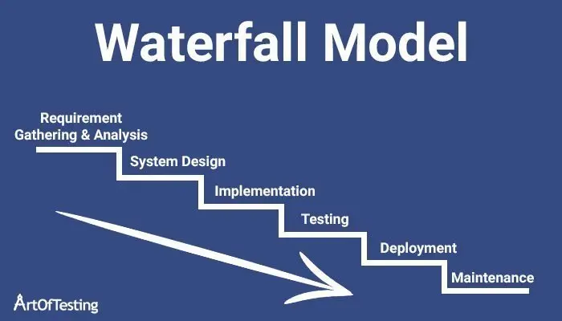
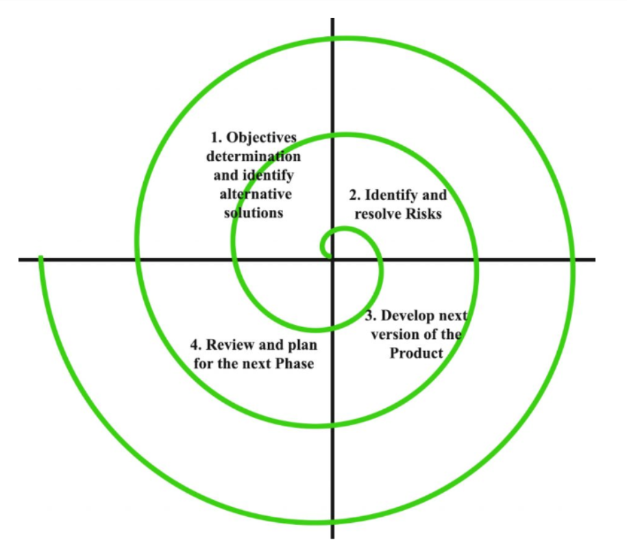
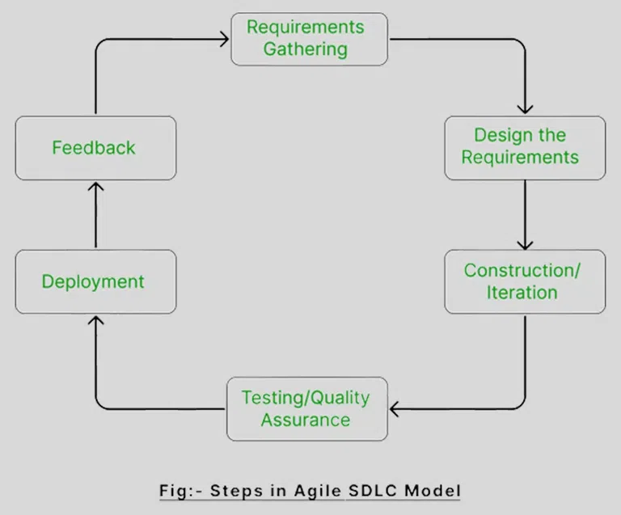

# Unit 1

## <mark> 1) What is Software Engineering? Explain. </mark>

**Software Engineering** is a discipline of engineering focused on designing, developing, maintaining, and managing software systems. It applies engineering principles, practices, and methodologies to ensure software is reliable, efficient, and meets user requirements.

### Key Features of Software Engineering:

1. **Systematic Approach:** It uses structured methods to analyze, design, and implement software.
2. **Scalability:** Ensures that software can adapt to increased demands or complexities.
3. **Quality Management:** Prioritizes testing, debugging, and maintenance to deliver high-quality software.
4. **Collaboration:** Involves teamwork among developers, project managers, and stakeholders.
5. **Documentation:** Maintains detailed records for clarity and ease of future updates.

By applying scientific principles and engineering techniques, software engineering bridges the gap between theoretical computer science and practical programming. It has become essential in producing software for various industries, including healthcare, finance, transportation, and more.

## <mark> 2) Describe Evolving Role of Software. </mark>

The role of software has dramatically evolved, moving from a specialized tool to a fundamental and pervasive element of modern life. Here's a breakdown of that evolution:

**Key Aspects of the Evolving Role of Software:**

- **From Specialized Tool to Core Infrastructure:**
  - Initially, software was primarily used for specific, complex calculations in scientific and military applications.
  - Now, it underpins virtually every aspect of our lives, from communication and commerce to transportation and healthcare. It's become a critical part of our infrastructure.
- **Increased Complexity and Interconnectedness:**
  - Software systems have become increasingly complex, with vast networks of interconnected applications and devices.
  - The rise of the internet, cloud computing, and the Internet of Things (IoT) has amplified this interconnectedness, creating complex ecosystems of software.
- **Driving Innovation and Transformation:**
  - Software is a key driver of innovation, enabling the development of new products, services, and business models.
  - It's transforming industries by automating processes, improving efficiency, and creating new opportunities.
- **Emphasis on User Experience:**
  - As software has become more widespread, there's been a growing emphasis on user experience (UX) and usability.
  - Software is now designed to be intuitive and accessible to a wide range of users.
- **Data-Driven Decision Making:**
  - Software plays a crucial role in collecting, analyzing, and interpreting vast amounts of data.
  - This data-driven approach is enabling organizations to make more informed decisions and improve their operations.
- **Increased Importance of Security:**
  - With the increasing reliance on software, security has become a paramount concern.
  - Protecting software systems from cyber threats is essential to safeguarding sensitive data and maintaining critical infrastructure.
- **The rise of AI:**
  - Artificial intelligence and Machine learning are greatly changing the role of software. Software is becoming more and more intelligent, and capable of automated decision making.

**In summary:**

Software's role has shifted from a supporting element to a central driving force in society. It's now a critical component of our infrastructure, a catalyst for innovation, and a key enabler of data-driven decision-making. This evolution continues, with emerging technologies like AI and quantum computing poised to further transform the landscape.

## <mark> 3) Define Software Crisis. Write down Causes & Solution for Software Crisis. </mark>

### Definition of Software Crisis

The **Software Crisis** refers to the challenges faced during the development and maintenance of software, leading to cost overruns, delays, and low-quality outputs. It emerged in the 1960s when the growing demand for complex software outpaced the ability of software development techniques to deliver reliable solutions.

### Causes of Software Crisis

1. **Increasing Complexity of Software:**

   - Software systems became more intricate, making them harder to design, develop, and test.

2. **Inadequate Project Management:**

   - Poor planning, unrealistic timelines, and lack of proper communication led to project failures.

3. **Lack of Skilled Professionals:**

   - A shortage of qualified software engineers and developers impacted project quality and delivery.

4. **Rapidly Changing Requirements:**

   - Frequent changes in user or business requirements disrupted ongoing projects.

5. **Failure in Estimation:**

   - Incorrect estimation of time, cost, and resources resulted in project delays or budget overruns.

6. **Insufficient Testing:**
   - Poor testing and debugging practices led to software with numerous defects.

### Solutions for Software Crisis

1. **Adopting Software Engineering Practices:**

   - Implementing systematic approaches, tools, and methodologies to streamline development.

2. **Improved Project Management:**

   - Setting realistic goals, timelines, and allocating resources effectively.

3. **Skilled Workforce:**

   - Training and hiring experienced professionals to meet the demands of complex projects.

4. **Modular Design:**

   - Breaking software into smaller, manageable modules to reduce complexity.

5. **Emphasis on Testing:**

   - Ensuring rigorous testing at every stage to deliver high-quality, error-free software.

6. **Requirement Analysis:**

   - Conducting detailed requirement analysis to minimize changes during the development process.

7. **Use of CASE Tools (Computer-Aided Software Engineering):**
   - Utilizing CASE tools to automate and enhance various stages of the software development life cycle.

## <mark> 4) Explain Software Myths in detail. </mark>

### Software Myths

Software myths are widely held but incorrect beliefs or misconceptions about software development and engineering. These myths often lead to unrealistic expectations and can negatively impact the software development process if not addressed.

### Categories of Software Myths

#### 1. Management Myths

These are misconceptions held by project managers or stakeholders about software development.

- **Myth:** _"We already have the tools; they are enough to guarantee project success."_

  - **Reality:** Tools are valuable, but they cannot replace proper project planning, skilled professionals, and teamwork.

- **Myth:** _"Adding more developers late in a project will speed up completion."_

  - **Reality:** Known as "Brooks' Law," adding developers to a late project often delays it further due to the time required for onboarding and coordination.

- **Myth:** _"Once the software is developed, the work is done."_
  - **Reality:** Maintenance, updates, and addressing user feedback are continuous processes after development.

#### 2. Customer Myths

These arise from misunderstandings on the part of the customer or end-users about the software process.

- **Myth:** _"Changing requirements during development is easy and inexpensive."_

  - **Reality:** Late-stage changes can increase costs and delay the project significantly due to the ripple effect on design, coding, and testing.

- **Myth:** _"A general statement of objectives is enough for developers to understand my requirements."_

  - **Reality:** Developers need detailed and well-documented requirements to create the desired software effectively.

- **Myth:** _"Software is flexible and can be changed anytime without problems."_
  - **Reality:** While software is adaptable, changes require time, effort, and resources, particularly in complex systems.

#### 3. Developer Myths

These myths are misconceptions held by developers themselves.

- **Myth:** _"If the program works, it is perfect."_

  - **Reality:** Functional software isn't necessarily high-quality; aspects like scalability, security, and maintainability must also be ensured.

- **Myth:** _"The only deliverable for the project is the code."_

  - **Reality:** Other deliverables like documentation, user manuals, and test cases are equally important for long-term success.

- **Myth:** _"Testing will automatically find all errors in the program."_
  - **Reality:** Testing reduces errors but cannot guarantee finding every defect, especially in large and complex systems.

### Importance of Addressing Software Myths

- **Improved Communication:** Reduces misunderstandings between stakeholders, customers, and developers.
- **Realistic Expectations:** Helps set achievable project timelines, budgets, and goals.
- **Better Decision-Making:** Promotes informed choices at every stage of software development.
- **Higher Quality:** Avoiding myths ensures a more effective and efficient development process.

## <mark> 5) Explain Software Engineering as a layered technology. </mark>

### Software Engineering as a Layered Technology

Software engineering is considered a **layered technology** because it organizes various processes and techniques into distinct layers, each building upon the previous one. This layered structure ensures the development of reliable, scalable, and maintainable software.

### Layers of Software Engineering

1. **Quality Focus**

   - At the foundation of all layers lies the emphasis on **software quality**.
   - This layer ensures that the software meets defined standards, requirements, and customer expectations.
   - Quality is integrated at every stage, from design to deployment.

2. **Process Layer**

   - The **process** forms the backbone of software engineering and acts as the framework for all activities.
   - It provides a structured approach to software development, ensuring consistency and efficiency.
   - Examples include process models like the Waterfall Model, Agile, and Spiral Model.

3. **Methods Layer**

   - This layer includes various **technical methods** and techniques for designing, developing, and testing software.
   - It covers key tasks such as requirements analysis, system modeling, architecture design, coding, and testing.
   - Methods ensure the systematic execution of each phase in the development life cycle.

4. **Tools Layer**
   - **CASE tools (Computer-Aided Software Engineering)** and other software tools support and automate tasks in the process and methods layers.
   - These tools help developers in coding, testing, debugging, version control, and more.
   - Examples include IDEs (like IntelliJ, Eclipse), testing tools (like Selenium), and version control systems (like Git).

### Benefits of the Layered Approach

- **Structure and Clarity:** Provides a clear framework, making software development more manageable.
- **Quality Assurance:** Ensures that all activities align with quality standards.
- **Efficiency:** The use of tools and methods improves productivity and reduces errors.
- **Adaptability:** Processes and tools can be tailored to different projects and technologies.

By organizing software engineering into layers, this approach promotes a structured, systematic, and disciplined way of developing software.

## <mark> 6) Explain Software Development Life Cycle with all the phases. </mark>

### Software Development Life Cycle (SDLC)

The **Software Development Life Cycle (SDLC)** is a structured process that outlines the stages involved in developing software. It provides a framework for planning, creating, testing, and maintaining software efficiently and effectively.

### Phases of SDLC

1. **Requirement Analysis:**

   - **Goal:** Understand and gather the needs and expectations of stakeholders.
   - **Activities:**
     - Identifying business needs.
     - Documenting functional and non-functional requirements.
   - **Output:** Software Requirements Specification (SRS) document.

2. **Feasibility Study:**

   - **Goal:** Determine whether the project is technically, financially, and operationally viable.
   - **Activities:**
     - Cost-benefit analysis.
     - Assessing risks and resource availability.
   - **Output:** Feasibility Report.

3. **System Design:**

   - **Goal:** Define the architecture, components, and interfaces of the system.
   - **Activities:**
     - High-level design (HLD) for system architecture.
     - Low-level design (LLD) for detailed module design.
   - **Output:** Design documents like Data Flow Diagrams (DFDs) and Entity-Relationship Diagrams (ERDs).

4. **Implementation (Coding):**

   - **Goal:** Translate the design into actual software.
   - **Activities:**
     - Writing code using programming languages.
     - Adhering to coding standards and guidelines.
   - **Output:** Source code files.

5. **Testing:**

   - **Goal:** Identify and fix defects to ensure the software meets requirements.
   - **Activities:**
     - Unit testing, integration testing, system testing, and user acceptance testing (UAT).
   - **Output:** Test reports and a bug-free software product.

6. **Deployment:**

   - **Goal:** Release the software to the production environment for use.
   - **Activities:**
     - Deployment on servers or app stores.
     - Providing user training and documentation.
   - **Output:** Operational software available to end-users.

7. **Maintenance:**
   - **Goal:** Ensure the software continues to perform as expected after deployment.
   - **Activities:**
     - Bug fixes, performance improvements, and updates.
     - Handling user feedback and adapting to changing needs.
   - **Output:** Improved versions of the software.

### Importance of SDLC

- Ensures a systematic and efficient approach to software development.
- Helps in delivering high-quality software on time and within budget.
- Reduces risks and improves collaboration among stakeholders.

This framework can be adapted to various software development models like Waterfall, Agile, or Spiral.

## <mark> 7) Explain Waterfall Model (Linear Sequential Model) with suitable diagram. </mark>

### Waterfall Model (Linear Sequential Model)

The **Waterfall Model** is one of the earliest and most straightforward software development models. It is called the "Linear Sequential Model" because the process flows sequentially through well-defined phases, like a waterfall cascading downwards. Each phase must be completed before the next one begins, and there is little to no overlap.

### Phases of the Waterfall Model

1. **Requirement Analysis:**

   - Gathering and documenting all software requirements.
   - Deliverable: Software Requirements Specification (SRS).

2. **System Design:**

   - Creating the architecture and design of the system based on requirements.
   - Deliverable: Design documents, Data Flow Diagrams (DFD), and Entity-Relationship Diagrams (ERD).

3. **Implementation (Coding):**

   - Translating design into actual source code using programming languages.
   - Deliverable: Executable code or software.

4. **Testing:**

   - Identifying and fixing defects to ensure the software functions as intended.
   - Deliverable: Bug-free software.

5. **Deployment:**

   - Deploying the completed software in the production environment for use.
   - Deliverable: Fully functional operational software.

6. **Maintenance:**
   - Addressing issues, bugs, and updates to adapt to evolving needs or environments.
   - Deliverable: Software updates or new versions.

### Advantages of the Waterfall Model

- Simple and easy to understand.
- Suitable for smaller projects with well-defined requirements.
- Provides clear documentation at every phase.
- Each phase has specific deliverables, ensuring systematic progress.

### Disadvantages of the Waterfall Model

- Not flexible for changing requirements.
- Errors in earlier phases can be costly to fix in later stages.
- Unsuitable for complex or large projects with evolving needs.
- Testing occurs late in the cycle, which may delay defect detection.

### Diagram

## <mark> 8) Describe RAD Model with its advantages and disadvantages. </mark>

### Rapid Application Development (RAD) Model

The **Rapid Application Development (RAD)** Model is an agile software development methodology that emphasizes rapid prototyping and iterative delivery over extensive planning. The primary goal is to develop software quickly by involving user feedback and reusing existing components.

### Phases of the RAD Model

1. **Business Modeling:**

   - Analyze business requirements and workflows.
   - Identify vital information flow between business functions.

2. **Data Modeling:**

   - Define the data objects and relationships between them.
   - Establish data attributes needed for the business process.

3. **Process Modeling:**

   - Design processes to manipulate data objects as per business needs.
   - Define process rules, inputs, and outputs.

4. **Application Generation:**

   - Rapidly develop the application using automation tools, code generators, and reusable components.

5. **Testing and Turnover:**
   - Perform testing on prototypes and final modules.
   - Incorporate user feedback to make refinements.

### Advantages of the RAD Model

1. **Faster Development:**

   - Focuses on rapid prototyping and iterative delivery, reducing development time.

2. **User Involvement:**

   - Involves users in every phase, ensuring that the final product meets their requirements.

3. **Flexibility:**

   - Easy to incorporate changes based on user feedback or evolving needs.

4. **Reusability:**

   - Utilizes reusable components, saving time and effort.

5. **Improved Quality:**

   - Continuous feedback and testing reduce defects and ensure better quality.

6. **Parallel Development:**
   - Allows different modules to be developed simultaneously, speeding up the process.

### Disadvantages of the RAD Model

1. **Not Suitable for Large Projects:**

   - It works best for smaller, modular projects rather than large and complex systems.

2. **Dependence on Skilled Developers:**

   - Requires a team of highly skilled and experienced professionals to succeed.

3. **High Resource Demand:**

   - Needs sufficient resources like automated tools and reusable components.

4. **Inadequate Documentation:**

   - Due to rapid development, documentation is often neglected, leading to challenges in maintenance.

5. **Limited Scalability:**

   - The focus on quick delivery makes it less adaptable to scalability requirements.

6. **High User Commitment:**
   - Continuous user involvement is required, which may not always be feasible.

The RAD Model is ideal for projects where requirements are well-understood, and quick delivery is a priority. However, it demands skilled teams and resources to achieve its goals effectively.

## <mark> 9) Write short notes on Evolutionary Process Model. </mark>

The Evolutionary Process Model is a software development approach that emphasizes iterative and incremental development, allowing for the gradual evolution of a software product. Here's a concise overview:

**Key Characteristics:**

- **Iterative and Incremental:**
  - The software is developed in cycles (iterations), with each cycle producing a working version of the product.
  - Each iteration builds upon the previous one, adding new features and functionalities incrementally.
- **Prototyping:**
  - Prototyping is often used to explore requirements and design options.
  - Prototypes evolve into the final product through successive iterations.
- **Feedback-Driven:**
  - User feedback is crucial in shaping the evolution of the software.
  - Feedback is gathered at the end of each iteration and used to refine the next iteration.
- **Risk Management:**
  - The evolutionary model allows for early identification and mitigation of risks.
  - Risks are addressed in each iteration, reducing the overall project risk.
- **Flexibility:**
  - It is adaptable to changing requirements and user needs.
  - It is suitable for projects where requirements are not fully understood at the beginning.

**Types of Evolutionary Models:**

- **Incremental Model:**
  - Delivers software in increments, with each increment adding new functionalities.
  - Focuses on delivering a working product quickly and then gradually adding features.
- **Spiral Model:**
  - Combines iterative development with risk management.
  - Each iteration involves planning, risk analysis, engineering, and evaluation.
- **Prototyping Model:**
  - Focuses on creating and refining prototypes to explore requirements and design options.
  - The final product is developed based on the refined prototype.

**Advantages:**

- Suitable for complex projects with evolving requirements.
- Allows for early user feedback and validation.
- Reduces project risk through iterative development.

**Disadvantages:**

- Can be difficult to manage and control.
- Requires strong communication and collaboration.
- The end point of the project may not be known at the project's beginning.

### Diagram

## <mark> 10) Explain the Incremental Model with its advantages and disadvantages. </mark>

### Incremental Model

The **Incremental Model** is a software development approach where the system is built and delivered in small, manageable increments or parts. Each increment adds specific functionality, and over time, these increments combine to form the complete system. This allows parts of the system to be developed, tested, and delivered early while accommodating changes or enhancements in future increments.

### Phases of the Incremental Model

1. **Requirement Analysis:**
   - All system requirements are initially identified and divided into smaller, prioritized sets or modules.
2. **Design:**

   - A high-level design is created for the entire system, and detailed design is prepared for each increment.

3. **Implementation (Coding):**

   - The software is developed incrementally, with each increment adding a specific functionality.

4. **Testing:**

   - Testing is performed for each increment to ensure its functionality and compatibility with previous increments.

5. **Integration:**

   - The tested increments are integrated into the growing system and delivered as a working product.

6. **Maintenance:**
   - Regular updates and enhancements are made based on user feedback and changing requirements.

### Advantages of the Incremental Model

1. **Early Delivery:**

   - Functional increments can be delivered early, allowing users to start using the system before full completion.

2. **Flexibility:**

   - Changes or new features can be easily incorporated into future increments.

3. **Risk Reduction:**

   - Issues in one increment are easier to manage, and risks are distributed across multiple cycles.

4. **Continuous Feedback:**

   - User feedback on each increment helps improve the system progressively.

5. **Efficient Resource Usage:**
   - Resources can be focused on developing prioritized increments first.

### Disadvantages of the Incremental Model

1. **System Architecture Challenges:**

   - Requires careful initial design to ensure future increments integrate seamlessly.

2. **Complex Management:**

   - Managing multiple increments and their dependencies can be challenging.

3. **Not Suitable for Smaller Projects:**

   - May not be efficient for simple or small-scale systems.

4. **Requires Skilled Team:**

   - Demands expertise to develop and integrate increments effectively.

5. **Delays in Full System Visibility:**
   - Users may not see the complete system until the final increment is delivered.

The Incremental Model is ideal for projects with clear but evolving requirements, where delivering partial functionalities quickly is beneficial.

## <mark> 11) Explain about the Prototype model in detail. </mark>

The Prototype Model is a software development approach that focuses on creating a working prototype of the system early in the development process. This prototype is then used to gather user feedback and refine the requirements, design, and implementation of the final product. Here's a detailed explanation:

**Description:**

- **Focus on Early Prototyping:**
  - The primary goal is to create a working prototype quickly to demonstrate functionality and gather user feedback.
- **Iterative Refinement:**
  - The prototype is iteratively refined based on user feedback, leading to a better understanding of the requirements and design.
- **Exploratory Development:**
  - The prototype is used to explore different design options and validate assumptions.
- **Risk Reduction:**
  - Prototyping helps to identify and mitigate risks early in the development process, especially those related to user interface and usability.
- **User Involvement:**
  - User involvement is crucial throughout the prototyping process, ensuring that the final product meets their needs.

**Phases of the Prototype Model:**

1.  **Requirements Gathering and Analysis:**
    - The initial requirements are gathered from the user.
2.  **Quick Design:**
    - A quick design of the prototype is created, focusing on the key functionalities and user interface.
3.  **Build Prototype:**
    - A working prototype is developed based on the quick design.
4.  **Prototype Evaluation:**
    - The prototype is evaluated by the user, and feedback is gathered.
5.  **Refine Prototype:**
    - The prototype is refined based on the user feedback, and the process is repeated until the prototype meets the user's needs.
6.  **Engineer Product:**
    - Once the prototype is finalized, the final software product is engineered. This phase involves a more rigorous approach to design, coding, testing, and deployment.

**Types of Prototypes:**

- **Throwaway Prototypes:**
  - These prototypes are created to explore requirements and design options, and they are discarded after the final product is developed.
- **Evolutionary Prototypes:**
  - These prototypes evolve into the final product through successive iterations. They are refined and expanded until they meet the user's needs.

**Advantages of the Prototype Model:**

- **Improved User Involvement:**
  - Users are actively involved in the development process, ensuring that the final product meets their needs.
- **Reduced Risk of Misunderstanding Requirements:**
  - Prototyping helps to clarify requirements and reduce the risk of developing software that doesn't meet user expectations.
- **Early Detection of Errors:**
  - Errors can be identified and corrected early in the development process.
- **Increased Customer Satisfaction:**
  - Users see working versions of the software early and often, leading to increased satisfaction.
- **Exploration of Design Options:**
  - Prototypes allow for the easy exploration of different design choices.

**Disadvantages of the Prototype Model:**

- **Potential for Increased Development Time:**
  - The iterative nature of prototyping can lead to increased development time if not managed properly.
- **Risk of Incomplete or Inaccurate Prototypes:**
  - If the prototype is not carefully developed, it may not accurately represent the final product.
- **Management Complexity:**
  - Managing the prototyping process and integrating user feedback can be complex.
- **Expectation Management:**
  - Customers may get an unrealistic expectation of how fast the final product can be delivered.
- **Throwaway prototypes can lead to wasted effort:**
  - If the throw away prototype is not managed well, it can result in a lot of wasted time.

## <mark> 12) Draw and explain Spiral Model with its advantages. </mark>

### Diagram

### Spiral Model

The **Spiral Model** is a risk-driven software development process model that combines iterative development with systematic risk management. It is particularly useful for large, complex, and high-risk projects.

### Phases of the Spiral Model

The Spiral Model has **four main phases**, repeated in every loop (or iteration) of the spiral:

1. **Objective Setting:**

   - Identify the objectives, constraints, and alternatives for the specific phase or cycle.
   - Example: Understanding user requirements for a new feature.

2. **Risk Assessment and Reduction:**

   - Analyze risks associated with the objectives and select strategies to mitigate them.
   - Example: Building a prototype to reduce uncertainties about user requirements.

3. **Development and Validation:**

   - Develop the product increment based on the risk analysis and validate it with stakeholders.
   - Example: Implementing and testing a functional module.

4. **Planning for the Next Iteration:**
   - Evaluate the results of the current cycle and plan the activities for the next loop.
   - Example: Incorporating user feedback into updated requirements.

### Diagram Explanation

In a diagram of the **Spiral Model**, imagine a spiral with several loops. Each loop consists of the four phases mentioned above. The spiral starts at the center and expands outward with each iteration, representing the progression of the project. The center of the spiral indicates minimal risks and resources, while the outer loops represent higher risks as the project progresses.

### Advantages of the Spiral Model

1. **Risk Reduction:**

   - Risks are identified and mitigated at every phase, ensuring better project outcomes.

2. **Flexibility:**

   - Accommodates changes and evolving requirements easily.

3. **Iterative Approach:**

   - Allows for continuous improvement based on feedback from stakeholders.

4. **Customer Satisfaction:**

   - Customer involvement in each phase ensures the final product meets their expectations.

5. **Focus on Quality:**

   - The iterative and risk-driven approach emphasizes delivering high-quality outputs.

6. **Scalability:**
   - Suitable for large and complex projects with high risks or uncertainties.

### Disadvantages of the Spiral Model

1. **High Cost and Time:**

   - Repeated risk analysis and iterative development can make the process resource-intensive.

2. **Complexity:**

   - Requires expertise in risk management and planning, making it challenging for inexperienced teams.

3. **Not Suitable for Small Projects:**

   - May not be cost-effective for small-scale projects with minimal risks.

4. **Inconsistent Deliverables:**
   - Since deliverables are iterative, they may not provide a clear vision of the final product early on.

The **Spiral Model** is particularly useful for projects where managing risks and adapting to changing needs are critical.

## <mark> 13) Describe Concurrent Development Model. </mark>

The Concurrent Development Model, sometimes referred to as concurrent engineering, is a software development approach that emphasizes simultaneous development of different system components. It aims to reduce the overall development time by allowing multiple teams to work on different aspects of the project concurrently. Here's a breakdown:

**Description:**

- **Parallel Development:**
  - This model focuses on developing different components of the software simultaneously.
- **Concurrent Activities:**
  - Different phases of the software development lifecycle (e.g., requirements gathering, design, coding, testing) can overlap.
- **Communication and Coordination:**
  - Effective communication and coordination between teams are essential for successful concurrent development.
- **State-Based Representation:**
  - The model often uses state-based representations to track the progress and dependencies of different components.
- **Network of Activities:**
  - The model can be represented as a network of activities. Where each activity can be in a different state.

**Key Characteristics:**

- **Overlapping Phases:**
  - Unlike sequential models (e.g., waterfall), phases can overlap, allowing for faster development.
- **Team Collaboration:**
  - Concurrent development requires strong collaboration and communication between teams.
- **Dependency Management:**
  - Careful management of dependencies between components is crucial to avoid conflicts.
- **Iterative Nature:**
  - The model can contain iterative elements, to allow for refinements of different components.

**How it works:**

Instead of waiting for one phase to complete before starting the next, teams work on different phases or components simultaneously. For example, while one team is designing the user interface, another team might be developing the database schema. This requires careful planning and coordination to ensure that the different components integrate smoothly.

**Advantages:**

- **Reduced Development Time:**
  - Concurrent development can significantly reduce the overall development time.
- **Improved Resource Utilization:**
  - It allows for better utilization of resources by allowing multiple teams to work in parallel.
- **Faster Feedback:**
  - Because components are being developed at the same time, the feedback can be gathered quicker.

**Disadvantages:**

- **Increased Complexity:**
  - Concurrent development can be more complex to manage than sequential models.
- **Increased Communication Overhead:**
  - It requires effective communication and coordination between teams, which can increase overhead.
- **Risk of Conflicts:**
  - If dependencies are not managed properly, conflicts can arise between different components.
- **Requires Good Management:**
  - This model requires very strong management to make sure that all the teams are working well together.

## <mark> 14) Draw and explain different phases of the Agile Process Model. </mark>

### Diagram

### Phases of the Agile Process Model

The Agile Process Model emphasizes iterative development, collaboration, and flexibility. Below are its key phases:

1. **Concept/Initiation:**

   - **Objective:** Identify project goals, scope, and high-level requirements.
   - **Activities:**
     - Meet stakeholders to gather initial requirements.
     - Define the purpose and expected outcomes of the project.
   - **Outcome:** A prioritized backlog of features or user stories.

2. **Iteration Planning:**

   - **Objective:** Plan for the next iteration based on the prioritized backlog.
   - **Activities:**
     - Break down tasks for the sprint or iteration.
     - Estimate effort and assign responsibilities to the team.
   - **Outcome:** A sprint plan with well-defined deliverables.

3. **Design:**

   - **Objective:** Develop a simple, high-level architecture or prototype.
   - **Activities:**
     - Create models or mockups as needed.
     - Define workflows and system interactions.
   - **Outcome:** A minimal yet functional design to guide the development process.

4. **Development:**

   - **Objective:** Build functional software incrementally within iterations.
   - **Activities:**
     - Write code, conduct unit tests, and integrate components.
     - Collaborate with team members for continuous progress.
   - **Outcome:** A working increment of the product at the end of each iteration.

5. **Testing:**

   - **Objective:** Ensure the quality and functionality of the increment.
   - **Activities:**
     - Perform unit testing, integration testing, and user acceptance testing (UAT).
     - Identify and resolve defects promptly.
   - **Outcome:** A high-quality and defect-free software increment.

6. **Release/Deployment:**

   - **Objective:** Deliver the software increment to stakeholders or end-users.
   - **Activities:**
     - Deploy the tested software increment.
     - Train users if required and gather feedback.
   - **Outcome:** A usable version of the product ready for use.

7. **Review/Feedback:**

   - **Objective:** Evaluate the completed iteration and gather feedback for future improvements.
   - **Activities:**
     - Conduct sprint reviews and retrospectives.
     - Adjust the backlog and refine requirements based on feedback.
   - **Outcome:** Updated requirements and strategies for the next iteration.

8. **Continuous Maintenance:**
   - **Objective:** Ensure the software remains functional and up-to-date.
   - **Activities:**
     - Fix bugs, improve performance, and implement new features.
   - **Outcome:** Long-term software reliability and user satisfaction.

### Characteristics of the Agile Process Model:

- **Iterative and Incremental:** Delivering software in smaller, functional increments.
- **Flexibility:** Adapts to changing requirements throughout the project life cycle.
- **Collaboration:** Involves stakeholders, developers, and testers working closely together.
- **Focus on Customer Satisfaction:** Ensures that feedback is continuously integrated.

## <mark> 15) Explain Component Based Development with examples. </mark>

Component-Based Development (CBD) is a software development approach that focuses on building applications from pre-built, reusable software components. Instead of developing everything from scratch, developers assemble applications by selecting and integrating existing components. This promotes efficiency, reduces development time, and enhances maintainability.

**Key Concepts:**

- **Components:**
  - These are self-contained, independent software units with well-defined interfaces.
  - They can be developed by different teams or organizations.
  - They encapsulate functionality and data, hiding internal details from other components.
- **Interfaces:**
  - Components communicate with each other through well-defined interfaces.
  - These interfaces specify the services that a component provides and the services it requires from other components.
- **Assembly:**
  - Applications are built by assembling components together, connecting their interfaces.
  - This assembly process is often facilitated by visual development tools.
- **Reusability:**
  - Components are designed to be reusable in multiple applications.
  - This reduces development time and costs.
- **Standardization:**
  - CBD often relies on standards and frameworks that define how components should be developed and integrated.

**Examples:**

- **User Interface Components:**
  - Libraries of pre-built UI components (e.g., buttons, text boxes, grids) are widely used in web and desktop application development.
  - For example, React, Angular, and Vue.js provide component-based frameworks for building web UIs.
- **Enterprise Java Beans (EJBs):**
  - EJBs are reusable server-side components that provide business logic for enterprise applications.
  - They simplify the development of complex, distributed applications.
- **Web Services:**
  - Web services are components that expose functionality over the internet using standard protocols (e.g., SOAP, REST).
  - They allow different applications to communicate and exchange data.
- **.NET Components:**
  - .NET provides reusable components that can be used to create windows applications, web applications, and web services.
- **Third-Party Libraries:**
  - Using any third party library is using a software component. Libraries that handle things like, image processing, database interactions, or network communications.
- **Microservices:**
  - Microservices architecture can be considered a form of component based design. Each microservice is a component that provides a specific business functionality.

**Advantages:**

- **Reduced Development Time:**
  - Using pre-built components can significantly reduce development time.
- **Increased Reusability:**
  - Components can be reused in multiple applications, saving time and effort.
- **Improved Maintainability:**
  - Components are self-contained and independent, making them easier to maintain and update.
- **Enhanced Reliability:**
  - Components that have been thoroughly tested and proven in other applications are likely to be more reliable.
- **Increased Productivity:**
  - Developers can focus on the unique aspects of their application, rather than reinventing the wheel.

**Disadvantages:**

- **Dependency on Third-Party Components:**
  - Applications may become dependent on third-party components, which can introduce risks.
- **Integration Challenges:**
  - Integrating components from different sources can be challenging.
- **Overhead:**
  - There can be overhead involved in using components, such as increased memory usage or slower performance.
- **Finding suitable components:**
  - Finding a component that perfectly matches your need can be difficult.

## <mark> 16) What is Product & Process? Differentiate Product and Process. </mark>

In software engineering, "product" and "process" are fundamental concepts, each playing a distinct role in the development lifecycle. Here's a breakdown:

**Product:**

- The product refers to the tangible or intangible outcome of the software development effort.
- It's the software system itself, including its code, documentation, and associated data.
- The product is what the customer or end-user ultimately uses.
- Examples: A mobile app, a web application, an operating system, a database management system.

**Process:**

- The process refers to the set of activities, methods, and practices used to develop the software product.
- It defines how the software is created, from requirements gathering to deployment and maintenance.
- The process provides a structured approach to software development, ensuring quality and efficiency.
- Examples: Requirements analysis, design, coding, testing, deployment, maintenance.

**Differentiating Product and Process:**

Here's a table summarizing the key differences:

| Feature           | Product                                                 | Process                                                          |
| :---------------- | :------------------------------------------------------ | :--------------------------------------------------------------- |
| **Nature**        | Tangible or intangible output                           | Set of activities and methods                                    |
| **Focus**         | What is created                                         | How it is created                                                |
| **Goal**          | Deliver a functional software system                    | Ensure efficient and effective development                       |
| **Measurability** | Measured by functionality, performance, usability, etc. | Measured by efficiency, effectiveness, cost, time, etc.          |
| **User**          | End-user, customer                                      | Development team, project manager                                |
| **Change**        | Changes reflect modifications to the software itself.   | Changes reflect modifications to the development methodology.    |
| **Example**       | The finished application                                | The agile development methodology used to create the application |

**In simpler terms:**

- The product is the "what" – the final software.
- The process is the "how" – the way the software is built.

Both product and process are crucial for successful software development. A high-quality product requires a well-defined and executed process. Conversely, even the best process cannot guarantee a successful product if the requirements are poorly understood or the design is flawed.
