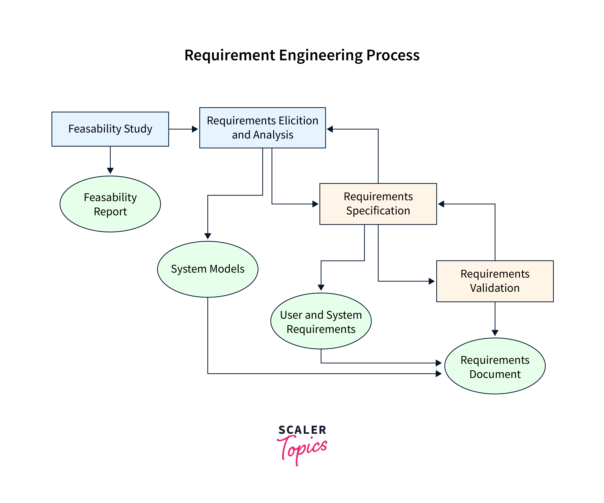
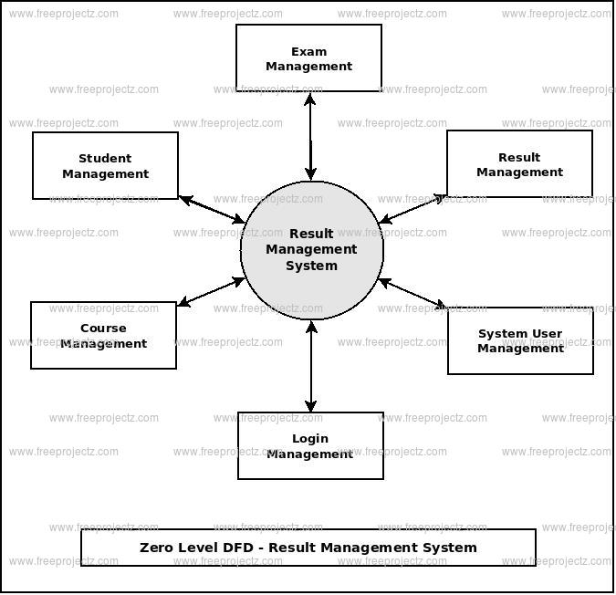
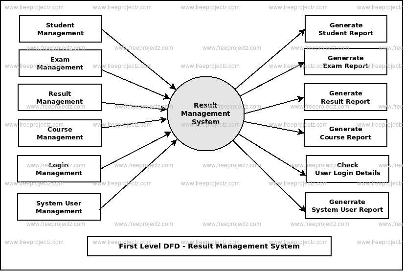
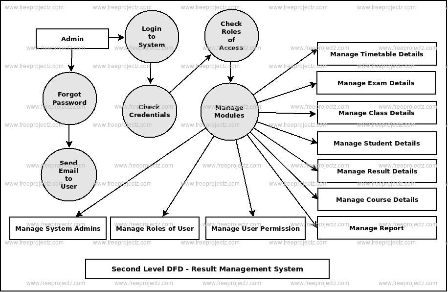
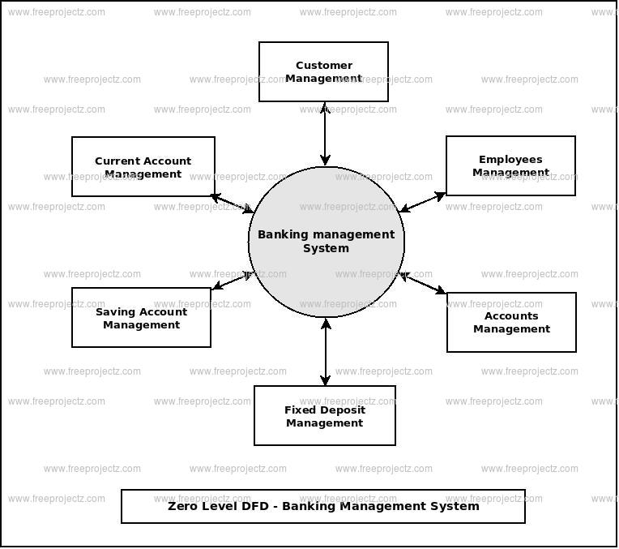
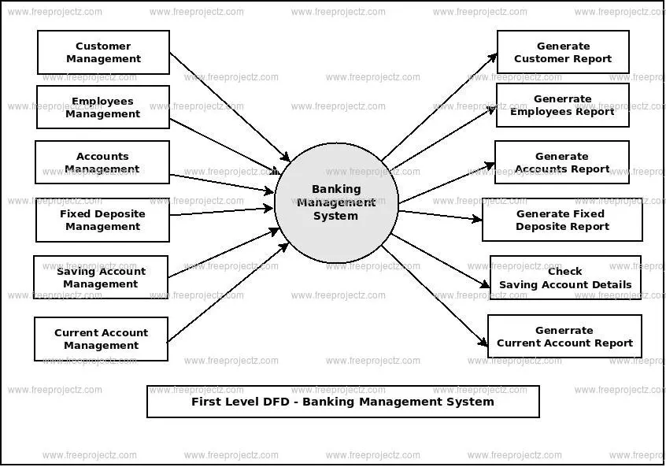
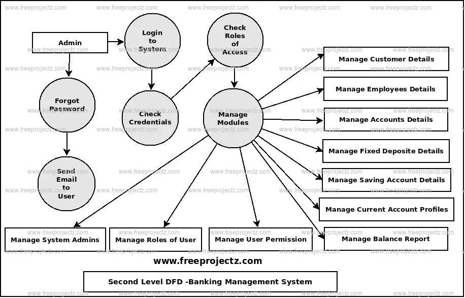
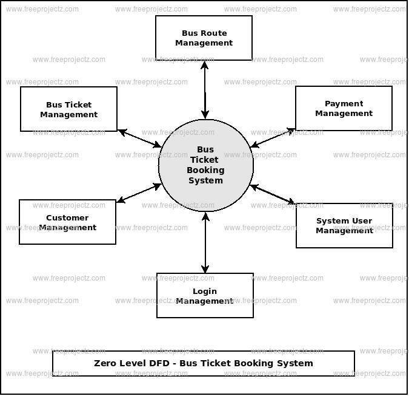
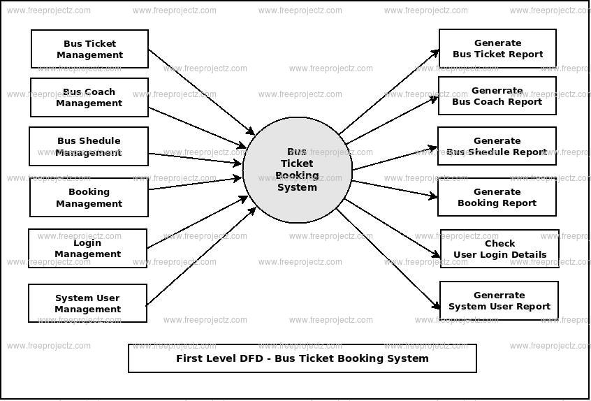
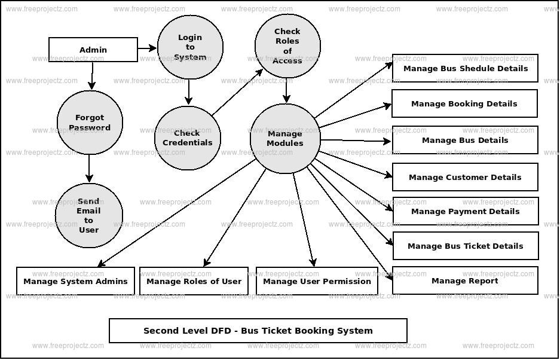

# Unit 2

## <mark> 1) What is Requirement Analysis and Specification? Explain it </mark>

### **Requirement Analysis and Specification**

**Requirement Analysis and Specification** is the first and most crucial phase of the Software Development Life Cycle (SDLC). It involves gathering, analyzing, and documenting the software system's functional and non-functional requirements to ensure that the final product meets user needs.

### **1. Requirement Analysis**

Requirement analysis is the process of understanding what the users need from the system and defining these needs in a structured way. It includes:

- **Elicitation:** Collecting requirements from stakeholders through interviews, surveys, or observations.
- **Analysis:** Refining and prioritizing requirements to resolve conflicts and ambiguities.
- **Validation:** Ensuring the requirements are correct, feasible, and aligned with business goals.

#### **Types of Requirements**

1. **Functional Requirements** – Define specific behaviors or functions of the system (e.g., "The system should allow users to log in using a username and password").
2. **Non-functional Requirements** – Define system properties like performance, security, and usability (e.g., "The system should respond within 2 seconds").

### **2. Requirement Specification**

Once requirements are analyzed, they are documented formally in a **Software Requirement Specification (SRS)** document. The SRS serves as a reference for designers, developers, and testers.

#### **Contents of SRS**

- **Introduction** – Purpose, scope, and definitions
- **Overall Description** – Product perspective, features, constraints
- **Specific Requirements** – Detailed functional and non-functional requirements
- **External Interfaces** – UI, API, and communication with other systems

### **Importance of Requirement Analysis and Specification**

✔️ Ensures a clear understanding of project goals  
✔️ Reduces ambiguities and misunderstandings  
✔️ Helps in better project planning and cost estimation  
✔️ Serves as a reference for future modifications

Would you like an example of an SRS document? 😊

## <mark> 2) Explain Software Requirement Modeling strategies. </mark>

### **Software Requirement Modeling Strategies**

**Software Requirement Modeling** is a structured approach to visually representing software requirements using different models and diagrams. These strategies help in understanding, analyzing, and specifying the system requirements efficiently.

### **1. Structured Analysis and Design Modeling**

This strategy focuses on **functional decomposition** and **data flow representation** to break down the system into smaller, manageable parts.

- **Data Flow Diagram (DFD):** Represents the flow of data between processes, data stores, and external entities.
- **Entity-Relationship Diagram (ERD):** Illustrates relationships between data entities.
- **State Transition Diagram (STD):** Shows how the system changes states based on events.

### **2. Object-Oriented Modeling (OOM)**

This strategy represents the system in terms of **objects, classes, and interactions** using UML diagrams.

- **Use Case Diagram:** Represents user interactions with the system.
- **Class Diagram:** Defines system objects and their relationships.
- **Sequence Diagram:** Shows object interactions over time.

### **3. Behavioral and Dynamic Modeling**

Focuses on the system’s behavior and interactions over time.

- **Activity Diagram:** Represents workflow and actions.
- **State Machine Diagram:** Models state transitions of an object.

### **4. Goal-Oriented Requirement Modeling**

- Defines the system’s goals and how they can be achieved.
- Uses techniques like **KAOS (Knowledge Acquisition in Automated Specification)** and **i\* (i-star)** to analyze goals and dependencies.

### **5. Formal Requirement Modeling**

- Uses mathematical logic and formal methods to define requirements precisely.
- Example: **Z Notation**, **Petri Nets**, and **Finite State Machines (FSMs)**.

### **6. Scenario-Based Modeling**

- Represents real-world **use cases** and **user stories** to capture how users interact with the system.
- Example: **Use Case Scenarios, User Story Mapping**.

### **Conclusion**

Each modeling strategy serves a different purpose in software requirement analysis. **Structured modeling** is useful for functional analysis, while **object-oriented and behavioral modeling** is great for dynamic systems. Formal modeling ensures precision, and scenario-based modeling focuses on real-world usage.

## <mark> 3) What are the qualities of a good SRS? Describe software Requirement Specification (SRS) with example. </mark>

### **Qualities of a Good Software Requirement Specification (SRS)**

A **good SRS (Software Requirement Specification)** document should have the following qualities:

1. **Correctness** – The SRS must accurately define all requirements without errors or inconsistencies.
2. **Completeness** – It should include all necessary requirements, including functional and non-functional aspects.
3. **Unambiguousness** – Each requirement should have only one interpretation. Avoid vague terms like "fast" or "user-friendly."
4. **Consistency** – There should be no conflicting requirements.
5. **Verifiability** – Each requirement should be testable through inspection, demonstration, or analysis.
6. **Modifiability** – The document should be structured so that changes can be made easily without affecting other parts.
7. **Traceability** – Each requirement should be uniquely identified so that it can be traced throughout the development lifecycle.
8. **Feasibility** – The requirements should be technically and financially achievable.

### **Software Requirement Specification (SRS) Format**

A standard SRS document consists of several sections:

#### **1. Introduction**

- **Purpose:** Describes the goal of the system.
- **Scope:** Defines what the system will do and what it won’t.
- **Definitions, Acronyms, and Abbreviations:** Lists technical terms.
- **References:** Includes related documents or standards.

#### **2. Overall Description**

- **Product Perspective:** How the system fits into the current environment.
- **User Characteristics:** Defines user roles and expectations.
- **Constraints:** Limitations like hardware, software, legal, etc.
- **Assumptions and Dependencies:** Conditions that affect the project.

#### **3. Specific Requirements**

- **Functional Requirements:** Detailed features of the system.
- **Non-Functional Requirements:** Performance, security, usability, etc.
- **External Interface Requirements:** Hardware, software, communication interfaces.
- **Software System Attributes:** Reliability, availability, maintainability, etc.

### **Example of SRS Document**

#### **1. Introduction**

**Purpose:** This SRS defines the requirements for an **Online Library Management System**.

**Scope:** The system allows users to search, borrow, and return books online. It will be used by students, teachers, and librarians.

#### **2. Overall Description**

**Product Perspective:** This system replaces the manual library process.

**User Characteristics:**

- Students: Can search, borrow, and return books.
- Librarians: Can manage inventory and user accounts.

**Constraints:**

- Must work on Windows and Linux.
- Response time should be less than 2 seconds.

#### **3. Specific Requirements**

**Functional Requirements:**

1. The system shall allow users to register with an email and password.
2. The system shall allow users to search for books by title, author, or ISBN.
3. The system shall allow librarians to add, update, and remove books.
4. The system shall allow users to borrow books for a maximum of 14 days.

**Non-Functional Requirements:**

1. The system should support up to 500 concurrent users.
2. The system should provide role-based access control.
3. The system should have 99.9% uptime.

### **Conclusion**

A well-structured **SRS document** ensures clear communication between stakeholders and helps developers build a system that meets user needs.

Would you like a **UML diagram** for this example? 😊

## <mark> 4) List out the characteristics of SRS. </mark>

The characteristics of a Software Requirement Specification (SRS) are essential attributes that ensure the document is effective and useful throughout the software development lifecycle. Here are the key characteristics of a well-crafted SRS:

1. **Correct**:

   - The SRS should accurately reflect the needs and expectations of the stakeholders.
   - It should be free from errors and misinterpretations.

2. **Unambiguous**:

   - Each requirement should be clearly stated to avoid multiple interpretations.
   - Use precise and concise language to eliminate ambiguity.

3. **Complete**:

   - The SRS should include all functional and non-functional requirements.
   - It should cover every aspect of the system's behavior and constraints.

4. **Consistent**:

   - Requirements should not contradict each other.
   - Terminology and definitions should be used consistently throughout the document.

5. **Ranked for Importance and Stability**:

   - Requirements should be prioritized based on their importance and stability.
   - This helps in managing scope and focusing on critical features first.

6. **Verifiable**:

   - Each requirement should be testable, meaning there should be a way to determine if the requirement has been met.
   - Include acceptance criteria where possible.

7. **Modifiable**:

   - The SRS should be structured to allow for easy updates and modifications.
   - Use version control to track changes and manage different versions of the document.

8. **Traceable**:

   - Each requirement should be traceable to its source, such as a stakeholder request or regulatory standard.
   - Requirements should also be traceable to design components, test cases, and other development artifacts.

9. **Understandable**:

   - The SRS should be written in a language that is clear and understandable to all stakeholders, including non-technical users.
   - Use diagrams, models, and examples to illustrate complex requirements.

10. **Feasible**:

    - The requirements should be technically and economically feasible to implement.
    - Consider the constraints and capabilities of the development team and technology.

11. **Concise**:

    - The SRS should be concise and to the point, avoiding unnecessary details or repetition.
    - Focus on what is essential for understanding the requirements.

12. **Organized**:

    - The document should be well-structured and logically organized.
    - Use headings, subheadings, and numbering to improve readability.

13. **Abstract**:
    - The SRS should focus on what the system should do, not how it should be implemented.
    - Avoid including design or implementation details in the SRS.

These characteristics help ensure that the SRS is an effective tool for communication, planning, and development, ultimately leading to a software system that meets the needs and expectations of the stakeholders.

## <mark> 5) How to write a Software Requirement Specification document? Write all the points of SRS. </mark>

Writing a Software Requirement Specification (SRS) document involves capturing and documenting the functional and non-functional requirements of a software system. Here is a structured outline to help you write an effective SRS document:

### 1. Introduction

- **Purpose**:

  - Describe the purpose of the SRS document and its intended audience.

- **Scope**:

  - Define the boundaries of the system, including what is included and excluded.

- **Definitions, Acronyms, and Abbreviations**:

  - List any terms, acronyms, or abbreviations used in the document.

- **References**:

  - List any documents or standards referenced in the SRS.

- **Overview**:
  - Provide a high-level overview of the system.

### 2. Overall Description

- **Product Perspective**:

  - Describe the system's relationship with other related products or systems.
  - Identify any interfaces with other systems.

- **Product Functions**:

  - List the high-level functions of the system.
  - Describe the main features and capabilities.

- **User Classes and Characteristics**:

  - Identify the different types of users and their characteristics.
  - Describe their needs and expectations.

- **Operating Environment**:

  - Describe the environment in which the system will operate, including hardware, software, and network requirements.

- **Design and Implementation Constraints**:

  - List any constraints that may affect the design and implementation, such as regulatory requirements, standards, or hardware limitations.

- **Assumptions and Dependencies**:
  - Document any assumptions made and dependencies on other systems or components.

### 3. Specific Requirements

- **Functional Requirements**:

  - Describe the functional capabilities of the system.
  - Use "shall" statements to clearly define what the system must do.
  - Example: "The system shall allow users to log in using a username and password."

- **Non-Functional Requirements**:

  - Describe the quality attributes of the system, such as performance, usability, reliability, and security.
  - Example: "The system shall respond to user inputs within 2 seconds."

- **External Interface Requirements**:

  - Describe the interfaces between the system and external systems, users, or devices.
  - Include details about data formats, communication protocols, and APIs.

- **System Features**:

  - Break down the system's features and describe each one in detail.
  - Include use cases, user stories, or scenarios to illustrate how the features will be used.

- **Other Requirements**:
  - Include any other requirements that do not fit into the above categories, such as legal or regulatory requirements.

### 4. Appendices (Optional)

- **Glossary**:

  - A list of terms and definitions used in the SRS.

- **Analyses**:

  - Any analyses performed to derive the requirements, such as feasibility studies or market research.

- **Issues**:
  - A list of open issues or questions related to the requirements.

### 5. Review and Approval

- **Review Process**:

  - Describe the process for reviewing and approving the SRS.
  - Include the roles and responsibilities of the reviewers.

- **Approval**:
  - Document the approval of the SRS by the stakeholders.
  - Include signatures and dates.

### Tips for Writing an Effective SRS

- **Use Clear and Concise Language**: Avoid ambiguity and use precise language to describe the requirements.
- **Include Visual Aids**: Use diagrams, models, and examples to illustrate complex requirements.
- **Engage Stakeholders**: Involve stakeholders in the review process to ensure their needs are accurately captured.
- **Maintain Version Control**: Use version control to track changes and manage different versions of the document.
- **Ensure Traceability**: Make sure each requirement is traceable to its source and to design components and test cases.

By following this structured outline, you can create a comprehensive and effective SRS document that serves as a foundation for the software development process.

## <mark> 6) Write SRS For Airlines Management System. </mark>

Creating a Software Requirement Specification (SRS) for an Airlines Management System involves capturing all the functional and non-functional requirements necessary for managing airline operations. Below is a structured outline for the SRS of an Airlines Management System:

### 1. Introduction

#### 1.1 Purpose

The purpose of this SRS document is to define the requirements for an Airlines Management System that will facilitate the efficient management of airline operations, including flight scheduling, passenger management, crew management, and maintenance tracking.

#### 1.2 Scope

The system will cover the following functional areas:

- Flight scheduling and management
- Passenger booking and management
- Crew scheduling and management
- Aircraft maintenance tracking
- Reporting and analytics

#### 1.3 Definitions, Acronyms, and Abbreviations

- **AMS**: Airlines Management System
- **CRM**: Crew Resource Management
- **ETA**: Estimated Time of Arrival
- **ETD**: Estimated Time of Departure

#### 1.4 References

- IATA (International Air Transport Association) standards
- FAA (Federal Aviation Administration) regulations
- Existing airline management systems documentation

#### 1.5 Overview

The Airlines Management System will provide a comprehensive solution for managing airline operations, ensuring efficient and safe flight operations, and enhancing customer satisfaction.

### 2. Overall Description

#### 2.1 Product Perspective

The AMS will integrate with existing airline systems, such as reservation systems, crew management systems, and maintenance systems. It will provide a centralized platform for managing all airline operations.

#### 2.2 Product Functions

- Flight scheduling and management
- Passenger booking and management
- Crew scheduling and management
- Aircraft maintenance tracking
- Reporting and analytics

#### 2.3 User Classes and Characteristics

- **Airline Administrators**: Manage system settings and user access.
- **Flight Operations Managers**: Schedule and manage flights.
- **Crew Managers**: Manage crew scheduling and assignments.
- **Maintenance Managers**: Track aircraft maintenance activities.
- **Passengers**: Book flights and manage reservations.

#### 2.4 Operating Environment

- **Hardware**: Servers, workstations, and mobile devices
- **Software**: Web browsers, mobile apps, and database management systems
- **Network**: Secure internet connection for accessing the system

#### 2.5 Design and Implementation Constraints

- Compliance with aviation regulations and standards
- Scalability to handle high volumes of data and users
- Security measures to protect sensitive information

#### 2.6 Assumptions and Dependencies

- Assumes integration with existing airline systems
- Dependent on reliable internet connectivity

### 3. Specific Requirements

#### 3.1 Functional Requirements

- **FR1**: The system shall allow administrators to manage user access and permissions.
- **FR2**: The system shall enable flight operations managers to schedule and manage flights, including setting ETA and ETD.
- **FR3**: The system shall allow passengers to book flights, manage reservations, and check-in online.
- **FR4**: The system shall enable crew managers to schedule and manage crew assignments.
- **FR5**: The system shall allow maintenance managers to track aircraft maintenance activities and schedules.
- **FR6**: The system shall generate reports on flight operations, passenger bookings, crew schedules, and maintenance activities.

#### 3.2 Non-Functional Requirements

- **NFR1**: The system shall respond to user inputs within 3 seconds.
- **NFR2**: The system shall support a minimum of 1,000 concurrent users.
- **NFR3**: The system shall be available 99.9% of the time.
- **NFR4**: The system shall comply with aviation industry regulations and standards.
- **NFR5**: The system shall implement security measures to protect sensitive data.

#### 3.3 External Interface Requirements

- **EIR1**: The system shall integrate with existing reservation systems using APIs.
- **EIR2**: The system shall support data import and export in standard formats (e.g., CSV, JSON).
- **EIR3**: The system shall provide a user-friendly web interface and mobile app for accessing the system.

#### 3.4 System Features

- **Flight Scheduling**: Manage flight schedules, including setting ETA and ETD.
- **Passenger Management**: Handle passenger bookings, reservations, and check-ins.
- **Crew Management**: Schedule and manage crew assignments.
- **Maintenance Tracking**: Track aircraft maintenance activities and schedules.
- **Reporting**: Generate reports on flight operations, passenger bookings, crew schedules, and maintenance activities.

#### 3.5 Other Requirements

- **OR1**: The system shall comply with data privacy regulations.
- **OR2**: The system shall provide multi-language support for international users.

### 4. Appendices (Optional)

- **Glossary**: A list of terms and definitions used in the SRS.
- **Analyses**: Feasibility studies and market research conducted to derive the requirements.
- **Issues**: A list of open issues or questions related to the requirements.

### 5. Review and Approval

- **Review Process**: The SRS will be reviewed by stakeholders, including airline administrators, flight operations managers, crew managers, maintenance managers, and passengers.
- **Approval**: The SRS will be approved by the project sponsor and key stakeholders.

This SRS provides a comprehensive overview of the requirements for an Airlines Management System, ensuring that all stakeholders have a clear understanding of the system's capabilities and constraints.

## <mark> 7) Create a SRS document for the University Management System. </mark>

Creating a Software Requirement Specification (SRS) for a University Management System involves capturing all the functional and non-functional requirements necessary for managing university operations. Below is a structured outline for the SRS of a University Management System:

### 1. Introduction

#### 1.1 Purpose

The purpose of this SRS document is to define the requirements for a University Management System that will facilitate the efficient management of university operations, including student admissions, course management, faculty management, and administrative tasks.

#### 1.2 Scope

The system will cover the following functional areas:

- Student admissions and enrollment
- Course and curriculum management
- Faculty and staff management
- Administrative tasks and reporting
- Financial management

#### 1.3 Definitions, Acronyms, and Abbreviations

- **UMS**: University Management System
- **CRM**: Course Resource Management
- **GPA**: Grade Point Average

#### 1.4 References

- University policies and procedures
- Educational standards and regulations
- Existing university management systems documentation

#### 1.5 Overview

The University Management System will provide a comprehensive solution for managing university operations, ensuring efficient administration, and enhancing the educational experience for students and faculty.

### 2. Overall Description

#### 2.1 Product Perspective

The UMS will integrate with existing university systems, such as student information systems, learning management systems, and financial systems. It will provide a centralized platform for managing all university operations.

#### 2.2 Product Functions

- Student admissions and enrollment
- Course and curriculum management
- Faculty and staff management
- Administrative tasks and reporting
- Financial management

#### 2.3 User Classes and Characteristics

- **University Administrators**: Manage system settings and user access.
- **Admissions Officers**: Handle student admissions and enrollment.
- **Faculty Members**: Manage courses, grades, and student interactions.
- **Students**: Access course materials, submit assignments, and view grades.
- **Financial Officers**: Manage tuition fees and financial aid.

#### 2.4 Operating Environment

- **Hardware**: Servers, workstations, and mobile devices
- **Software**: Web browsers, mobile apps, and database management systems
- **Network**: Secure internet connection for accessing the system

#### 2.5 Design and Implementation Constraints

- Compliance with educational regulations and standards
- Scalability to handle high volumes of data and users
- Security measures to protect sensitive information

#### 2.6 Assumptions and Dependencies

- Assumes integration with existing university systems
- Dependent on reliable internet connectivity

### 3. Specific Requirements

#### 3.1 Functional Requirements

- **FR1**: The system shall allow administrators to manage user access and permissions.
- **FR2**: The system shall enable admissions officers to process student applications and manage enrollment.
- **FR3**: The system shall allow faculty members to create and manage courses, upload course materials, and grade assignments.
- **FR4**: The system shall enable students to access course materials, submit assignments, and view grades.
- **FR5**: The system shall allow financial officers to manage tuition fees and financial aid.
- **FR6**: The system shall generate reports on student enrollment, course completion, and financial transactions.

#### 3.2 Non-Functional Requirements

- **NFR1**: The system shall respond to user inputs within 3 seconds.
- **NFR2**: The system shall support a minimum of 5,000 concurrent users.
- **NFR3**: The system shall be available 99.9% of the time.
- **NFR4**: The system shall comply with educational industry regulations and standards.
- **NFR5**: The system shall implement security measures to protect sensitive data.

#### 3.3 External Interface Requirements

- **EIR1**: The system shall integrate with existing student information systems using APIs.
- **EIR2**: The system shall support data import and export in standard formats (e.g., CSV, JSON).
- **EIR3**: The system shall provide a user-friendly web interface and mobile app for accessing the system.

#### 3.4 System Features

- **Student Admissions**: Manage student applications and enrollment.
- **Course Management**: Create and manage courses, upload materials, and grade assignments.
- **Faculty Management**: Manage faculty information and assignments.
- **Administrative Tasks**: Handle administrative tasks and generate reports.
- **Financial Management**: Manage tuition fees and financial aid.

#### 3.5 Other Requirements

- **OR1**: The system shall comply with data privacy regulations.
- **OR2**: The system shall provide multi-language support for international students and faculty.

### 4. Appendices (Optional)

- **Glossary**: A list of terms and definitions used in the SRS.
- **Analyses**: Feasibility studies and market research conducted to derive the requirements.
- **Issues**: A list of open issues or questions related to the requirements.

### 5. Review and Approval

- **Review Process**: The SRS will be reviewed by stakeholders, including university administrators, admissions officers, faculty members, students, and financial officers.
- **Approval**: The SRS will be approved by the project sponsor and key stakeholders.

This SRS provides a comprehensive overview of the requirements for a University Management System, ensuring that all stakeholders have a clear understanding of the system's capabilities and constraints.

## <mark> 8) What is Requirement Elicitation? Explain different types of Elicitation Techniques. </mark>

Requirement Elicitation is the process of gathering and understanding the needs, goals, and constraints of stakeholders to define the requirements for a software system. It is a critical phase in the software development lifecycle that ensures the final product meets the expectations and needs of the users. Here's an explanation of the process and various elicitation techniques:

### Requirement Elicitation Process

1. **Identify Stakeholders**: Determine who will be affected by the system and who has an interest in its development. Stakeholders can include end-users, clients, developers, and regulatory bodies.

2. **Gather Requirements**: Use various techniques to collect information from stakeholders about their needs and expectations.

3. **Document Requirements**: Record the gathered requirements in a structured format, such as a Software Requirement Specification (SRS) document.

4. **Validate Requirements**: Ensure that the documented requirements are accurate, complete, and aligned with stakeholder expectations.

5. **Manage Requirements**: Maintain and update the requirements as the project evolves and new information becomes available.

### Types of Requirement Elicitation Techniques

1. **Interviews**:

   - **Description**: One-on-one conversations with stakeholders to gather detailed information about their needs and expectations.
   - **Advantages**: Allows for in-depth exploration of requirements and clarification of ambiguities.
   - **Disadvantages**: Can be time-consuming and may lead to biased information if not conducted carefully.

2. **Surveys and Questionnaires**:

   - **Description**: Structured sets of questions distributed to a large number of stakeholders to gather quantitative data.
   - **Advantages**: Efficient for collecting data from a broad audience and can be analyzed statistically.
   - **Disadvantages**: May not capture detailed or nuanced information and can have low response rates.

3. **Workshops**:

   - **Description**: Group sessions involving multiple stakeholders to collaboratively identify and define requirements.
   - **Advantages**: Encourages collaboration and consensus-building among stakeholders.
   - **Disadvantages**: Can be challenging to manage and may be dominated by vocal participants.

4. **Observation**:

   - **Description**: Observing users in their work environment to understand their processes and identify requirements.
   - **Advantages**: Provides firsthand insights into user needs and workflows.
   - **Disadvantages**: Can be intrusive and may not capture all requirements, especially those that are not visible.

5. **Document Analysis**:

   - **Description**: Reviewing existing documents, such as business plans, policies, and procedures, to identify requirements.
   - **Advantages**: Useful for understanding the context and constraints of the system.
   - **Disadvantages**: May not capture all requirements, especially those that are not documented.

6. **Brainstorming**:

   - **Description**: Group sessions where participants generate ideas and requirements freely and spontaneously.
   - **Advantages**: Encourages creativity and can lead to innovative solutions.
   - **Disadvantages**: May produce a large number of ideas that need to be filtered and prioritized.

7. **Prototyping**:

   - **Description**: Creating a preliminary version of the system to gather feedback and identify requirements.
   - **Advantages**: Provides a tangible representation of the system and helps in validating requirements.
   - **Disadvantages**: Can be time-consuming and may lead to scope creep if not managed properly.

8. **Use Cases and Scenarios**:

   - **Description**: Describing how users will interact with the system to achieve their goals.
   - **Advantages**: Helps in understanding the system's behavior from the user's perspective.
   - **Disadvantages**: May not capture all requirements, especially non-functional ones.

9. **Focus Groups**:
   - **Description**: Small group discussions led by a moderator to gather in-depth insights into user needs.
   - **Advantages**: Encourages open discussion and can reveal underlying motivations and preferences.
   - **Disadvantages**: Can be influenced by group dynamics and may not represent the views of all stakeholders.

### Conclusion

Requirement Elicitation is a crucial process that sets the foundation for the success of a software project. By using a combination of elicitation techniques, stakeholders can ensure that the requirements are comprehensive, accurate, and aligned with their needs and expectations. Effective elicitation helps in reducing risks, managing scope, and delivering a product that meets user satisfaction.

## <mark> 9) What is Requirement Engineering? Explain the process of requirement engineering with a suitable diagram. </mark>

Requirement Engineering is a systematic process in software development that involves identifying, documenting, and maintaining the needs and requirements of stakeholders to ensure a software system meets their expectations. This process is crucial for delivering a product that is both functional and aligns with user needs.

**Key Phases of the Requirement Engineering Process:**

1. **Feasibility Study:**

   - **Technical Feasibility:** Assessing whether current technology and resources can support the proposed system.
   - **Operational Feasibility:** Evaluating if the system will function within existing organizational operations.
   - **Economic Feasibility:** Determining if the project's benefits outweigh the costs.
   - **Legal Feasibility:** Ensuring the project complies with legal and regulatory requirements.
   - **Schedule Feasibility:** Confirming that the project timeline is realistic and achievable.

2. **Requirements Elicitation:**

   - Gathering requirements from stakeholders through interviews, surveys, and observations to understand their needs and expectations.

3. **Requirements Specification:**

   - Documenting the gathered requirements in a clear and detailed manner, often in a Software Requirements Specification (SRS) document.

4. **Requirements Verification and Validation:**

   - Ensuring that the documented requirements accurately reflect stakeholder needs and that the developed system meets these requirements.

5. **Requirements Management:**
   - Monitoring and controlling changes to requirements throughout the project lifecycle to maintain clarity and agreement among stakeholders.

A visual representation of this process can be found in the Requirement Engineering Process Model.

**Advantages of a Well-Executed Requirement Engineering Process:**

- Improved understanding between stakeholders and developers.
- Enhanced project planning and estimation.
- Reduced risk of project overruns and failures.
- Increased satisfaction among end-users due to a product that meets their needs.

Implementing a thorough Requirement Engineering process is essential for the successful development of software systems that are efficient, effective, and aligned with user expectations.

## <mark> 10) What do you mean by Good Software Design? Explain Software Design concepts and Principles in detail. </mark>

Good Software Design refers to the process of creating a software system that is efficient, maintainable, scalable, and meets the specified requirements. It involves organizing the software's components and their interactions in a way that optimizes performance, usability, and future adaptability. Here are the key concepts and principles of good software design:

### Key Concepts of Software Design

1. **Abstraction**:

   - **Definition**: The process of hiding the complex implementation details and showing only the essential features of the object.
   - **Purpose**: Simplifies the understanding and use of complex systems by focusing on high-level functionality.

2. **Encapsulation**:

   - **Definition**: Bundling the data and methods that operate on the data within a single unit or class, and restricting access to some of the object's components.
   - **Purpose**: Protects the integrity of the data and promotes modularity.

3. **Inheritance**:

   - **Definition**: A mechanism where a new class (subclass) inherits properties and behaviors (methods) from an existing class (superclass).
   - **Purpose**: Facilitates code reuse and the creation of a hierarchical relationship between classes.

4. **Polymorphism**:

   - **Definition**: The ability to process objects differently depending on their data type or class.
   - **Purpose**: Allows one interface to be used for a general class of actions, simplifying interactions between components.

5. **Modularity**:

   - **Definition**: The degree to which a system's components can be separated and recombined.
   - **Purpose**: Enhances maintainability and allows for independent development and testing of components.

6. **Cohesion**:

   - **Definition**: The degree to which the responsibilities of a single module or class form a logical grouping.
   - **Purpose**: High cohesion means that the class or module has a well-defined purpose, making it easier to understand and maintain.

7. **Coupling**:
   - **Definition**: The degree to which one module depends on another.
   - **Purpose**: Low coupling is desirable as it reduces dependencies between modules, making the system more flexible and easier to maintain.

### Principles of Good Software Design

1. **SOLID Principles**:

   - **Single Responsibility Principle (SRP)**: A class should have only one reason to change, meaning it should only have one job or responsibility.
   - **Open/Closed Principle (OCP)**: Software entities should be open for extension but closed for modification.
   - **Liskov Substitution Principle (LSP)**: Objects of a superclass should be replaceable with objects of a subclass without affecting the correctness of the program.
   - **Interface Segregation Principle (ISP)**: Many client-specific interfaces are better than one general-purpose interface.
   - **Dependency Inversion Principle (DIP)**: Depend upon abstractions, do not depend upon concretions.

2. **DRY (Don't Repeat Yourself)**:

   - **Purpose**: Avoid duplication of code by abstracting common functionality into reusable components.
   - **Benefit**: Reduces redundancy and improves maintainability.

3. **KISS (Keep It Simple, Stupid)**:

   - **Purpose**: Simplify the design as much as possible by avoiding unnecessary complexity.
   - **Benefit**: Simpler designs are easier to understand, test, and maintain.

4. **YAGNI (You Aren't Gonna Need It)**:

   - **Purpose**: Avoid adding functionality until it is necessary.
   - **Benefit**: Prevents over-engineering and keeps the design focused on current requirements.

5. **Separation of Concerns**:

   - **Purpose**: Divide the software into distinct sections, each addressing a separate concern or functionality.
   - **Benefit**: Enhances modularity and makes the system easier to manage and evolve.

6. **Design Patterns**:
   - **Purpose**: Provide proven solutions to common design problems.
   - **Benefit**: Improves code organization, promotes reuse, and enhances communication among developers.

### Conclusion

Good software design is essential for creating robust, maintainable, and scalable software systems. By adhering to key concepts and principles, developers can ensure that their software meets current requirements while being adaptable to future changes. This leads to higher quality software that is easier to develop, test, and maintain.

## <mark> 11) What is Coupling and Cohesion? Explain different types of Cohesion and Coupling with proper example. </mark>

Coupling and cohesion are fundamental concepts in software engineering that describe the relationships and interactions between different modules or components of a software system. They play a crucial role in determining the quality and maintainability of the software.

### Coupling

**Coupling** refers to the degree of interdependence between software modules. It indicates how much one module relies on the implementation or interface of another module. Lower coupling is generally desirable as it makes the system more modular, flexible, and easier to maintain.

#### Types of Coupling

1. **Content Coupling (High)**:

   - **Definition**: One module modifies or relies on the internal workings of another module.
   - **Example**: Directly accessing and modifying the private variables of another class.
   - **Impact**: Highest form of coupling, making the system very rigid and difficult to maintain.

2. **Common Coupling**:

   - **Definition**: Two modules share a common data structure.
   - **Example**: Multiple classes accessing and modifying a global variable.
   - **Impact**: Changes to the shared data structure can have widespread effects.

3. **Control Coupling**:

   - **Definition**: One module controls the flow of another by passing control information.
   - **Example**: A function that passes a flag to another function to control its behavior.
   - **Impact**: Moderate coupling; changes in control logic can affect dependent modules.

4. **Stamp Coupling (Data-Structured Coupling)**:

   - **Definition**: Modules share a composite data structure, and they use only a part of the structure.
   - **Example**: Passing a large data structure to a function that only uses a few fields.
   - **Impact**: Changes to the data structure can affect modules that use it.

5. **Data Coupling (Low)**:

   - **Definition**: Modules share data through parameters.
   - **Example**: Passing simple data types (e.g., integers, strings) as arguments to functions.
   - **Impact**: Lowest form of coupling; changes in one module are less likely to affect others.

6. **Message Coupling (Lowest)**:
   - **Definition**: Modules communicate by exchanging messages or events.
   - **Example**: Using message-passing interfaces or event-driven architectures.
   - **Impact**: Very low coupling; modules are independent and can evolve separately.

### Cohesion

**Cohesion** refers to the degree to which the responsibilities of a single module or class form a logical grouping. High cohesion is desirable as it means that the module has a well-defined purpose and is focused on a single task or set of related tasks.

#### Types of Cohesion

1. **Coincidental Cohesion (Lowest)**:

   - **Definition**: Elements are grouped arbitrarily; tasks in the module are barely related or totally unrelated.
   - **Example**: A module that performs both user authentication and calculates tax.
   - **Impact**: Very low cohesion; difficult to understand, test, and maintain.

2. **Logical Cohesion**:

   - **Definition**: Elements are grouped because they logically belong together, even if they perform different tasks.
   - **Example**: A module that contains all input/output operations for a system.
   - **Impact**: Low cohesion; changes in one part of the module can affect unrelated parts.

3. **Temporal Cohesion**:

   - **Definition**: Elements are grouped by when they execute, such as initialization or cleanup tasks.
   - **Example**: A module that performs all startup tasks for an application.
   - **Impact**: Moderate cohesion; tasks are related by time but may not be functionally related.

4. **Procedural Cohesion**:

   - **Definition**: Elements are part of a single control sequence or procedure.
   - **Example**: A module that performs a sequence of operations to complete a task.
   - **Impact**: Higher cohesion; tasks are related by a common procedure.

5. **Communicational Cohesion**:

   - **Definition**: Elements operate on the same data or share a common data structure.
   - **Example**: A module that performs various operations on a customer record.
   - **Impact**: High cohesion; tasks are related by their use of common data.

6. **Sequential Cohesion**:

   - **Definition**: Elements are grouped because the output of one element serves as input to another.
   - **Example**: A module that reads data from a file, processes it, and then writes the result to another file.
   - **Impact**: High cohesion; tasks are related by a sequence of data processing steps.

7. **Functional Cohesion (Highest)**:
   - **Definition**: Elements work together to perform a single, specific task.
   - **Example**: A module that calculates the square root of a number.
   - **Impact**: Highest cohesion; the module has a single, well-defined purpose.

### Conclusion

Understanding coupling and cohesion is essential for designing software systems that are modular, maintainable, and adaptable. By aiming for low coupling and high cohesion, developers can create systems that are easier to understand, test, and modify, ultimately leading to higher quality software.

## <mark> 12) ​What are functional & non-functional requirements? Explain with examples. </mark>

Functional and non-functional requirements are two fundamental categories of requirements in software engineering that define what a system should do and how it should behave.

### Functional Requirements

**Functional Requirements** describe the specific behaviors, functions, or features that a system must support. They define what the system should do in terms of its functionality. These requirements are usually derived from user needs and are essential for the system to operate correctly.

#### Examples of Functional Requirements

1. **User Authentication**:

   - The system shall allow users to log in using a username and password.
   - The system shall provide an option for users to reset their passwords.

2. **Order Processing**:

   - The system shall enable users to add items to a shopping cart.
   - The system shall calculate the total cost of items in the shopping cart, including taxes and shipping fees.

3. **Data Management**:

   - The system shall allow administrators to add, edit, and delete user accounts.
   - The system shall generate reports on user activity and system usage.

4. **Communication**:
   - The system shall send confirmation emails to users after they complete a purchase.
   - The system shall provide a chat feature for users to communicate with customer support.

### Non-Functional Requirements

**Non-Functional Requirements** describe the qualities or attributes of the system, such as performance, usability, and reliability. They define how the system should behave and the constraints under which it must operate. These requirements are crucial for ensuring that the system meets user expectations and operates efficiently.

#### Examples of Non-Functional Requirements

1. **Performance**:

   - The system shall respond to user inputs within 2 seconds.
   - The system shall support a minimum of 1,000 concurrent users.

2. **Usability**:

   - The system shall have an intuitive and user-friendly interface.
   - The system shall provide accessibility features for users with disabilities.

3. **Reliability**:

   - The system shall be available 99.9% of the time.
   - The system shall have a mean time between failures (MTBF) of at least 1,000 hours.

4. **Security**:

   - The system shall encrypt sensitive data both at rest and in transit.
   - The system shall implement multi-factor authentication for user accounts.

5. **Scalability**:

   - The system shall be able to scale horizontally by adding more servers.
   - The system shall handle increased load during peak usage times.

6. **Maintainability**:
   - The system shall be designed to allow for easy updates and modifications.
   - The system shall have comprehensive documentation for developers and users.

### Conclusion

Both functional and non-functional requirements are essential for the success of a software project. Functional requirements ensure that the system meets the users' needs and performs the intended functions, while non-functional requirements ensure that the system operates efficiently, reliably, and securely. By clearly defining both types of requirements, stakeholders can ensure that the final product meets their expectations and delivers a high-quality user experience.

## <mark> 13) List the Functional and Non-Functional requirements for Library Management system. </mark>

A Library Management System (LMS) is designed to automate and streamline the operations of a library. Below are the functional and non-functional requirements for such a system:

### Functional Requirements

1. **User Management**:

   - The system shall allow users to register and create accounts.
   - The system shall support different user roles, such as librarians, members, and administrators.
   - The system shall enable users to log in and log out securely.

2. **Book Management**:

   - The system shall allow librarians to add, edit, and delete book records.
   - The system shall enable users to search for books by title, author, genre, or ISBN.
   - The system shall display book details, including availability status.

3. **Borrowing and Returning Books**:

   - The system shall allow members to borrow books, given they have a valid membership.
   - The system shall track borrowed books and their due dates.
   - The system shall enable members to return books and update the book's status accordingly.

4. **Reservation System**:

   - The system shall allow members to reserve books that are currently checked out.
   - The system shall notify members when reserved books become available.

5. **Cataloging**:

   - The system shall categorize books based on genres, authors, and other attributes.
   - The system shall generate a catalog of all available books.

6. **Membership Management**:

   - The system shall manage member information, including contact details and borrowing history.
   - The system shall allow members to renew their memberships.

7. **Fine Management**:

   - The system shall calculate and track fines for overdue books.
   - The system shall allow members to view and pay their fines online.

8. **Reporting**:
   - The system shall generate reports on book borrowing statistics, member activities, and overdue books.
   - The system shall provide analytics on library usage and trends.

### Non-Functional Requirements

1. **Performance**:

   - The system shall respond to user queries within 3 seconds.
   - The system shall support a minimum of 500 concurrent users.

2. **Usability**:

   - The system shall have an intuitive and user-friendly interface.
   - The system shall provide accessibility features for users with disabilities.

3. **Reliability**:

   - The system shall be available 99.5% of the time.
   - The system shall have a mean time between failures (MTBF) of at least 500 hours.

4. **Security**:

   - The system shall encrypt sensitive data, such as user credentials and payment information.
   - The system shall implement role-based access control to restrict unauthorized access.

5. **Scalability**:

   - The system shall be able to scale horizontally by adding more servers to handle increased load.
   - The system shall support the addition of new libraries or branches.

6. **Maintainability**:

   - The system shall be designed to allow for easy updates and modifications.
   - The system shall have comprehensive documentation for developers and users.

7. **Compatibility**:

   - The system shall be compatible with major web browsers and mobile devices.
   - The system shall integrate with existing library systems and databases.

8. **Recovery**:
   - The system shall have a backup and recovery mechanism to restore data in case of failure.
   - The system shall perform regular automated backups of the database.

These requirements ensure that the Library Management System is efficient, user-friendly, secure, and capable of meeting the needs of both library staff and members.

## <mark> 14) What is architectural design? Discuss different styles and components of software architectural design. </mark>

Architectural design in software engineering refers to the high-level structure of a software system, defining how components interact and work together to fulfill the system's requirements. It serves as a blueprint for both the system and the project, guiding the development process and ensuring that the system meets its functional and non-functional requirements.

### Key Components of Software Architectural Design

1. **Components**:

   - The fundamental building blocks of a software system. Each component encapsulates a specific functionality or a set of related functionalities.

2. **Connectors**:

   - Mechanisms that facilitate communication, interaction, and data exchange between components. Connectors define how components interact with each other.

3. **Interfaces**:

   - The boundaries through which components interact. Interfaces define the services a component provides and how those services can be accessed.

4. **Data Stores**:

   - Repositories where data is stored and managed. This includes databases, file systems, and other storage mechanisms.

5. **Architectural Patterns**:
   - Proven solutions to common design problems that provide a template for organizing components and their interactions.

### Different Styles of Software Architectural Design

1. **Layered (N-tier) Architecture**:

   - **Description**: Organizes the system into layers, each with a specific responsibility (e.g., presentation, business logic, data access).
   - **Use Case**: Suitable for enterprise applications where separation of concerns is crucial.
   - **Example**: A web application with a presentation layer (UI), business logic layer, and data access layer.

2. **Client-Server Architecture**:

   - **Description**: Divides the system into clients (requesting services) and servers (providing services).
   - **Use Case**: Common in distributed systems where resources are shared across a network.
   - **Example**: A web browser (client) requesting data from a web server.

3. **Microservices Architecture**:

   - **Description**: Breaks down the system into small, independent services that communicate over a network.
   - **Use Case**: Ideal for large, complex applications that require scalability and flexibility.
   - **Example**: An e-commerce platform with separate services for user management, inventory, and order processing.

4. **Event-Driven Architecture**:

   - **Description**: Components communicate by producing and consuming events, often using a message broker.
   - **Use Case**: Suitable for systems that need to respond to real-time events and changes.
   - **Example**: A stock trading system that reacts to market fluctuations.

5. **Service-Oriented Architecture (SOA)**:

   - **Description**: Organizes the system into services that can be reused and shared across different applications.
   - **Use Case**: Useful in enterprise environments where integration between different systems is required.
   - **Example**: A banking system where different services (e.g., account management, loan processing) are exposed as web services.

6. **Peer-to-Peer (P2P) Architecture**:

   - **Description**: Each component (peer) has equal capabilities and responsibilities, and they communicate directly with each other.
   - **Use Case**: Suitable for decentralized systems where there is no single point of control.
   - **Example**: File-sharing networks like BitTorrent.

7. **Pipeline Architecture**:
   - **Description**: Data is processed sequentially through a series of components, each performing a specific transformation.
   - **Use Case**: Common in data processing systems and ETL (Extract, Transform, Load) processes.
   - **Example**: A data processing pipeline that extracts data from a source, transforms it, and loads it into a data warehouse.

### Conclusion

Architectural design is a critical aspect of software development that defines the structure and behavior of a system. By choosing the appropriate architectural style and carefully designing the components and their interactions, developers can create systems that are robust, scalable, and maintainable. The choice of architectural style depends on the specific requirements and constraints of the system being developed.

## <mark> 15) Describe Component Level Design. </mark>

Component-level design focuses on the detailed design of individual components within a software system. It builds upon the architectural design by specifying how each component will be implemented to fulfill its responsibilities. This level of design is crucial for ensuring that each component is efficient, maintainable, and meets the system's requirements.

### Key Aspects of Component-Level Design

1. **Component Identification**:

   - Identify the specific components that need to be designed based on the architectural design. Each component should have a clear purpose and responsibility within the system.

2. **Component Interfaces**:

   - Define the interfaces for each component, specifying the methods, inputs, outputs, and any exceptions that may be thrown. Interfaces serve as contracts between components, ensuring they interact correctly.

3. **Data Structures**:

   - Design the data structures that will be used within the component. This includes defining classes, their attributes, and relationships with other classes.

4. **Algorithms**:

   - Specify the algorithms that will be used to implement the component's functionality. This includes detailing the logic, control flow, and any computational processes.

5. **Error Handling**:

   - Define how the component will handle errors and exceptions. This includes specifying error codes, messages, and strategies for recovery or failover.

6. **Component Interactions**:

   - Describe how the component will interact with other components in the system. This includes defining communication protocols, data exchange formats, and synchronization mechanisms.

7. **Performance Considerations**:

   - Consider the performance requirements of the component, such as response time, throughput, and resource utilization. Optimize the design to meet these requirements.

8. **Security Measures**:

   - Incorporate security measures into the component design, such as input validation, authentication, and authorization. Ensure that the component protects sensitive data and prevents unauthorized access.

9. **Testing Strategy**:
   - Define a testing strategy for the component, including unit tests, integration tests, and any other relevant test cases. Ensure that the component can be tested in isolation and as part of the integrated system.

### Example of Component-Level Design

Consider a component in a Library Management System responsible for managing book loans. The component-level design might include:

- **Component Identification**:

  - Name: BookLoanManager
  - Responsibility: Manage the borrowing and returning of books.

- **Component Interfaces**:

  - Methods:
    - `borrowBook(bookId: String, memberId: String): Boolean`
    - `returnBook(bookId: String, memberId: String): Boolean`
    - `checkOverdueBooks(memberId: String): List<Book>`

- **Data Structures**:

  - Classes:
    - `Book`: Represents a book with attributes like `bookId`, `title`, `author`, and `dueDate`.
    - `Member`: Represents a library member with attributes like `memberId`, `name`, and `borrowedBooks`.

- **Algorithms**:

  - Borrow Book:
    - Check if the book is available.
    - Update the book's status to "borrowed".
    - Record the borrowing transaction with the member's details.
  - Return Book:
    - Verify the book is borrowed by the member.
    - Update the book's status to "available".
    - Remove the borrowing transaction from the member's record.

- **Error Handling**:

  - Handle cases where the book is not available or the member has overdue books.
  - Provide meaningful error messages for invalid inputs.

- **Component Interactions**:

  - Interact with the `BookCatalog` component to check book availability.
  - Interact with the `MemberManager` component to update member records.

- **Performance Considerations**:

  - Optimize database queries to minimize response time.
  - Implement caching for frequently accessed data.

- **Security Measures**:

  - Validate input data to prevent injection attacks.
  - Ensure that only authorized members can borrow or return books.

- **Testing Strategy**:
  - Unit tests for each method in the `BookLoanManager` component.
  - Integration tests to verify interactions with the `BookCatalog` and `MemberManager` components.

### Conclusion

Component-level design is essential for translating the high-level architectural design into a detailed implementation plan. By focusing on the specifics of each component, developers can ensure that the system is robust, efficient, and meets the desired quality attributes. This level of design is crucial for successful software development and maintenance.

## <mark> 16) Explain in detail for Function Oriented Design. </mark>

Function-Oriented Design (FOD) is a software design approach that focuses on the decomposition of a system into functions or procedures, emphasizing the actions or operations that the system must perform. This approach is often contrasted with Object-Oriented Design (OOD), which focuses on the objects and their interactions. Function-Oriented Design is particularly well-suited for procedural programming languages and systems where the primary concern is the sequence of operations.

### Key Concepts of Function-Oriented Design

1. **Function Decomposition**:

   - The process of breaking down a complex problem into smaller, manageable functions or procedures. Each function performs a specific task or operation.
   - Functions are designed to be reusable and can be called from different parts of the program.

2. **Top-Down Design**:

   - Starts with a high-level overview of the system and progressively breaks it down into more detailed functions.
   - The main function is defined first, and then it is decomposed into sub-functions, each addressing a specific part of the problem.

3. **Bottom-Up Design**:

   - Begins with the implementation of the smallest, most basic functions and builds up to more complex functions.
   - Basic functions are tested individually before being integrated into higher-level functions.

4. **Modularity**:

   - Functions are designed as independent modules with well-defined interfaces.
   - Each module has a single responsibility and can be developed, tested, and maintained independently.

5. **Function Interfaces**:

   - Define the inputs (parameters) and outputs (return values) of each function.
   - Clear and well-defined interfaces facilitate communication between functions and ensure that each function can be used correctly.

6. **Control Flow**:
   - Emphasizes the sequence of operations and the flow of control between functions.
   - Control structures like loops, conditionals, and function calls are used to manage the execution flow.

### Advantages of Function-Oriented Design

- **Simplicity**: Functions are straightforward and easy to understand, making the design approach accessible for beginners.
- **Reusability**: Functions can be reused across different parts of the program, reducing code duplication.
- **Maintainability**: Well-defined functions with clear interfaces are easier to test and maintain.
- **Efficiency**: Functions can be optimized individually, leading to improved performance.

### Disadvantages of Function-Oriented Design

- **Scalability**: As the system grows, managing a large number of functions can become complex.
- **Data Management**: Global data structures are often used, which can lead to issues with data consistency and concurrency.
- **Limited Abstraction**: Unlike object-oriented design, function-oriented design does not inherently support complex abstractions and relationships between data and behavior.

### Example of Function-Oriented Design

Consider a simple Library Management System where we need to manage book loans. A function-oriented design might include the following functions:

1. **Main Function**:

   - `main()`: Entry point of the program, managing the overall flow.

2. **Book Management Functions**:

   - `addBook(bookId, title, author)`: Adds a new book to the library catalog.
   - `removeBook(bookId)`: Removes a book from the library catalog.
   - `searchBook(title)`: Searches for a book by title and returns its details.

3. **Member Management Functions**:

   - `addMember(memberId, name)`: Adds a new member to the library system.
   - `removeMember(memberId)`: Removes a member from the library system.

4. **Loan Management Functions**:

   - `borrowBook(bookId, memberId)`: Records the borrowing of a book by a member.
   - `returnBook(bookId, memberId)`: Records the return of a book by a member.
   - `checkOverdueBooks(memberId)`: Checks for overdue books borrowed by a member.

5. **Utility Functions**:
   - `calculateFine(dueDate, returnDate)`: Calculates the fine for an overdue book.
   - `sendNotification(memberId, message)`: Sends a notification to a member.

### Conclusion

Function-Oriented Design is a straightforward and effective approach for designing software systems, particularly in procedural programming environments. By focusing on the decomposition of the system into functions, this approach promotes modularity, reusability, and maintainability. However, as systems grow in complexity, integrating function-oriented design with other design paradigms, such as object-oriented design, may be necessary to manage scalability and data abstraction effectively.

## <mark> 17) What is DFD? Explain about DFD in detail. </mark>

A Data Flow Diagram (DFD) is a graphical representation of the flow of data within a system. It illustrates how data is processed and transferred between different components of the system. DFDs are commonly used in the analysis and design phases of software development to model the system's data flow, highlighting the transformations that occur as data moves from input to output.

### Key Components of a DFD

1. **Processes**:

   - Represented by circles or rounded rectangles.
   - Describe the operations or transformations that are performed on the data.
   - Each process takes input data, processes it, and produces output data.

2. **Data Stores**:

   - Represented by open-ended rectangles or parallel lines.
   - Store data at rest that is used or produced by processes.
   - Examples include databases, files, or any persistent storage.

3. **Data Flows**:

   - Represented by arrows.
   - Show the movement of data between processes, data stores, and external entities.
   - Labeled to indicate the type of data being transferred.

4. **External Entities**:
   - Represented by squares or rectangles.
   - Represent sources or destinations of data that are outside the system.
   - Examples include users, other systems, or external devices.

### Levels of DFD

DFDs are typically created at different levels of abstraction to provide a comprehensive view of the system:

1. **Context Diagram (Level 0)**:

   - Provides a high-level overview of the entire system.
   - Shows the system as a single process and its interactions with external entities.
   - Focuses on the boundaries of the system and the data flows across these boundaries.

2. **First Level DFD (Level 1)**:

   - Breaks down the single process from the context diagram into more detailed processes.
   - Shows the major processes within the system and their data flows.
   - Provides an overview of how data moves between the main components of the system.

3. **Detailed DFDs (Level 2 and beyond)**:
   - Further decompose the processes from the first level DFD into more detailed processes.
   - Provide a more granular view of the data flows and transformations within each process.
   - Can be created for each process in the first level DFD to show detailed internal workings.

### Steps to Create a DFD

1. **Identify the System Boundaries**:

   - Define the scope of the system and identify the external entities that interact with it.

2. **Identify Major Processes**:

   - Determine the main processes that occur within the system.
   - Each process should represent a significant transformation or operation on the data.

3. **Identify Data Stores**:

   - Identify the places where data is stored and retrieved within the system.

4. **Identify Data Flows**:

   - Determine how data moves between processes, data stores, and external entities.
   - Label each data flow to indicate the type of data being transferred.

5. **Draw the DFD**:
   - Start with the context diagram to show the overall system.
   - Create first level and detailed DFDs to provide more detailed views of the system.

### Example of a DFD

Consider a simple Library Management System. The context diagram (Level 0) might show the system interacting with external entities like "Library Members" and "Book Suppliers." The first level DFD (Level 1) might include processes like "Manage Book Loans," "Catalog Books," and "Handle Member Registrations," along with data stores like "Book Database" and "Member Database."

### Advantages of DFD

- **Visual Representation**: Provides a clear and concise visual representation of the system's data flow.
- **Communication Tool**: Facilitates communication between stakeholders, including developers, analysts, and users.
- **Identifying Data Requirements**: Helps in identifying the data requirements and transformations needed within the system.
- **System Analysis**: Useful for analyzing and improving the system's data processing and storage mechanisms.

### Limitations of DFD

- **Limited Detail**: Does not show the sequence or timing of operations, nor does it capture control flow or decision logic.
- **Static View**: Provides a static view of the system and does not capture dynamic behavior or real-time interactions.
- **Complexity**: Can become complex and difficult to manage for large systems with many processes and data flows.

In summary, DFDs are a valuable tool for modeling the data flow within a system, helping to understand and communicate the system's data processing requirements. They are often used in conjunction with other modeling techniques to provide a comprehensive view of the system.

## <mark> 18) List out the drawing rules of DFD. </mark>

Data Flow Diagrams (DFDs) follow specific drawing rules to ensure clarity, consistency, and effective communication of the system's data flow. Here are the key drawing rules for creating DFDs:

### Drawing Rules for DFD

1. **Use Standard Symbols**:

   - **Process**: Represented by a circle or rounded rectangle. Each process should have a unique identifier and a descriptive name.
   - **Data Store**: Represented by an open-ended rectangle or parallel lines. Each data store should be labeled to indicate the type of data it holds.
   - **External Entity**: Represented by a square or rectangle. Each external entity should be labeled to indicate its role in the system.
   - **Data Flow**: Represented by arrows. Each data flow should be labeled to describe the data being transferred.

2. **Labeling**:

   - **Processes**: Label each process with a verb phrase that describes the action performed (e.g., "Validate Order").
   - **Data Stores**: Label each data store with a noun phrase that describes the data it holds (e.g., "Customer Database").
   - **Data Flows**: Label each data flow with a noun phrase that describes the data being transferred (e.g., "Order Details").
   - **External Entities**: Label each external entity with a noun phrase that describes its role (e.g., "Customer").

3. **Direction of Data Flow**:

   - Use arrows to indicate the direction of data flow between processes, data stores, and external entities.
   - Ensure that the direction of the arrows accurately represents the flow of data within the system.

4. **Numbering**:

   - Number each process uniquely. This helps in referencing processes in documentation and discussions.
   - Use a consistent numbering scheme, especially when creating detailed DFDs that decompose higher-level processes.

5. **Levels of Detail**:

   - Start with a context diagram (Level 0) that shows the entire system as a single process and its interactions with external entities.
   - Create a first level DFD (Level 1) that breaks down the single process into major sub-processes.
   - Develop detailed DFDs (Level 2 and beyond) for each sub-process as needed, showing more granular data flows and transformations.

6. **Consistency**:

   - Maintain consistency in the use of symbols, labels, and numbering across all levels of the DFD.
   - Ensure that the data flows and processes in detailed DFDs align with those in higher-level DFDs.

7. **Simplicity**:

   - Keep the DFD as simple as possible while accurately representing the system's data flow.
   - Avoid crossing lines and minimize the complexity of the diagram to enhance readability.

8. **Balance**:

   - Ensure that the inputs and outputs of each process are balanced. Every data flow entering a process should have a corresponding output data flow.
   - Verify that all data flows are accounted for and that there are no missing or extraneous data flows.

9. **Boundaries**:

   - Clearly define the system boundaries in the context diagram to show what is included and excluded from the system.
   - Ensure that all interactions with external entities are accurately represented.

10. **Validation**:
    - Review the DFD with stakeholders to ensure that it accurately represents the system's data flow and meets their expectations.
    - Validate the DFD against the system's requirements to ensure completeness and correctness.

By following these drawing rules, you can create DFDs that are clear, consistent, and effective in communicating the system's data flow. This helps in understanding the system's requirements, identifying potential issues, and facilitating communication among stakeholders.

## <mark> 19) Draw DFD of Student Result management system. </mark>

## <mark> 20) Draw DFD of Banking management system. </mark>

## <mark> 21) Explain 0 Level (Context Level), Level 1 and Level 2 DFD on Bus Ticket Booking System. </mark>

A **Data Flow Diagram (DFD)** is a graphical representation that illustrates how data moves through a system, highlighting processes, data stores, and interactions with external entities. In the context of a Bus Ticket Booking System, DFDs can be structured into multiple levels to depict varying degrees of detail:

**Level 0 DFD (Context Diagram):**

This high-level diagram provides an overview of the entire Bus Ticket Booking System as a single process, showcasing its interactions with external entities:

- **External Entities:**
  - **Customer:** Initiates booking requests and receives booking confirmations.
  - **Bus Operator:** Provides bus schedules and availability information.
  - **Payment Gateway:** Processes payment transactions.

The Level 0 DFD emphasizes the system's major data flows between these entities without delving into internal processes.

**Level 1 DFD:**

This diagram decomposes the main process into sub-processes, offering a more detailed view of the system's functionality:

1. **Manage Bus Schedule:**

   - Inputs: Bus details from Bus Operator.
   - Outputs: Updated bus schedules accessible to customers.

2. **Handle Bookings:**

   - Inputs: Booking requests from customers.
   - Processes: Check seat availability, reserve seats.
   - Outputs: Booking confirmations or notifications of unavailability.

3. **Process Payments:**

   - Inputs: Payment details from customers.
   - Processes: Validate and process payments via Payment Gateway.
   - Outputs: Payment confirmations and receipts.

4. **Generate Tickets:**
   - Inputs: Confirmed booking and payment details.
   - Outputs: Electronic tickets issued to customers.

**Level 2 DFD:**

This level further breaks down the sub-processes identified in Level 1, detailing specific operations:

- **For "Handle Bookings":**

  - **Verify Customer Details:**

    - Inputs: Customer information.
    - Processes: Authenticate customer identity.
    - Outputs: Verification status.

  - **Check Seat Availability:**

    - Inputs: Desired travel date and bus route.
    - Processes: Query available seats.
    - Outputs: Availability status.

  - **Reserve Seat:**
    - Inputs: Seat selection by customer.
    - Processes: Update seat status to reserved.
    - Outputs: Reservation confirmation.

By utilizing these layered DFDs, stakeholders can gain a clear and detailed understanding of the Bus Ticket Booking System's data flows and processes, facilitating effective analysis and development.
